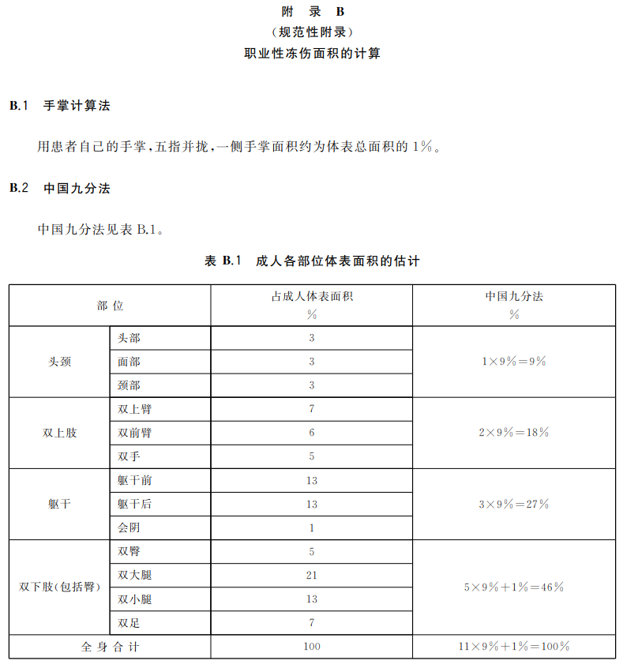

- [吴军数学通识讲义 (豆瓣)](https://book.douban.com/subject/35426737/)
	- [人类数学思维发展史_哔哩哔哩_bilibili](https://www.bilibili.com/video/BV1W7411B7Yw)
- [3Blue1Brown](https://www.3blue1brown.com/)
	- [【官方双语】GPT是什么？直观解释Transformer | 深度学习第5章_哔哩哔哩_bilibili](https://www.bilibili.com/video/BV13z421U7cs)
- [Mathigon – The Mathematical Playground](https://mathigon.org/)
	- [数学与世界史的时空交汇 （上集）_哔哩哔哩_bilibili](https://www.bilibili.com/video/BV11Z421M7sm)
- [如何理解数学？从纠正对数学的偏见开始——得数学者得天下](https://mp.weixin.qq.com/s/-He1bR38pSgydXulSqSisA)
  id:: 62fda9cd-6d61-4203-b881-327c4c5df6a0
- 数学家
	- 杨辉
	  id:: 6906cd79-5f27-4b24-b10c-3f2afed82f44
		- [杨辉（南宋著名数学家）_百度百科](https://baike.baidu.com/item/%E6%9D%A8%E8%BE%89/24967)
		- 杨辉三角
		  id:: 6906ce12-84ab-4cc7-8d7f-3b1cb2ae3594
			- [杨辉三角_百度百科](https://baike.baidu.com/item/%E6%9D%A8%E8%BE%89%E4%B8%89%E8%A7%92/0)
		- ((6906d107-16cc-4780-a352-e902f12d56b3))
- 数
	- 数字
	  id:: 678a4dea-fee6-40cc-851b-0b56627e3159
	  collapsed:: true
		- 记数法
			- [位值制记数法_百度百科](https://baike.baidu.com/item/%E4%BD%8D%E5%80%BC%E5%88%B6%E8%AE%B0%E6%95%B0%E6%B3%95)
		- 苏州码子
			- [苏州码子_百度百科](https://baike.baidu.com/item/%E8%8B%8F%E5%B7%9E%E7%A0%81%E5%AD%90/951069)
		- 印度-阿拉伯数字
		  id:: 67eb282f-d3b5-4f69-8fed-02ce822d37e9
			- 易用符号、十进制、位值记数法、竖式计算
			- [为啥近代科学革命没发生在中国？除了战争因素以外，我再补充一点【傅正】](https://www.bilibili.com/video/BV1MF411M74i)
			  id:: 69494dad-dc7a-4f4e-a402-19759a1884a9
			- ((67fba331-70c6-4b4a-bd2e-7049021af08b))
		- 保留运算过程
		- 印刷术（传播途径扩大）
	- 进制/数制
	  id:: 68eb4697-f10f-4171-b962-a132378c212b
	  collapsed:: true
		- 十进制
			- ((67b670e6-2f18-4b9d-891d-1095d01e61dc))
		- 二进制
			- “要么通，要么不通”
			- ((67ab06b9-1238-4a8d-be69-f0131457cf35))
		- [无理数进制是什么? - 知乎](https://www.zhihu.com/question/357570598)
		- 算筹
		- ((66bacf9d-b87b-4b6a-8805-f444170437ae))
	- 无理数
	  id:: 64e816a1-0859-4d34-97b7-998f1fc355b1
	  collapsed:: true
		- [如何证明一个数为无理数？ - 知乎](https://www.zhihu.com/question/66606347)
		- 自然对数
	- 对数
	  collapsed:: true
		- ((654b8382-29e6-4946-8456-96f4c0f08b2c))
		- 自然对数
			- [自然对数的底“e”到底是怎么来的？ - 知乎](https://zhuanlan.zhihu.com/p/45846342)
			- ((690f3e9b-6db8-43be-ada2-3761ff0c1398))
	- 极限
	  collapsed:: true
		- 连续
			- 古代人有连续的概念吗？
		- 无穷小
			- [无限个无穷小之积是否一定是无穷小？ - 知乎](https://zhuanlan.zhihu.com/p/88642140)
			  id:: 64e74994-2ae8-4313-98f1-41760840533d
		- 微积分
			- [15 - 1 讲座 2.7 - 隐式微分_高清_哔哩哔哩_bilibili](https://www.bilibili.com/video/BV13Ad8YUE6C/?p=15)
	- ---
	- 数列
	  collapsed:: true
		- 斐波那契数列
		  id:: 679add59-5266-4431-b7de-1bbf4f8e5b3b
			- ((679adda6-8f77-4920-854e-b81f84f788c7))
			- 黄金分割（约等于0.618）
			  id:: 67836268-571e-448c-ad16-44e8573a58d9
				- 比较接近的比值
					- ((678362ad-691d-4e9b-a430-31f791b22a74)) 与人类最长寿命（“随便想想”）
						- 能从相对小样本的后者反推前者吗？
				- [人体6大“黄金分割点”，照着养生事半功倍](https://baijiahao.baidu.com/s?id=1557060947216391)
					- [人体长寿有5大“黄金分割点”你知道几个（人体上28项长寿特征）-老人健康-科常识网](https://kechangshi.com/ren-ti-chang-shou-you-5-da-huang-jin-fen-ge-dian--ni-zhi-dao-ji-ge)
				- ((67402b08-4f17-4ce3-879e-ec9e1784dbed))
				- [洛书与黄金分割](https://www.renrendoc.com/paper/108383231.html)
				  id:: 67836701-af51-46aa-8017-fa771b961e42
				- ((677e6420-3d52-4386-bfd9-9677617c008b))
				- ((67c3adf1-cce8-4713-9a1d-e07d7f4cff6a))
				- ((68c8bd61-5544-42eb-bc63-5d717944437a))
			- [[斐波那契数列]]
			- 
				- ((67dff28e-1f80-4f66-a075-9e58b80cf418))
	- 比例
	- “凑巧”
	  collapsed:: true
		- “定律”
			- 摩尔定律
			  id:: 68eb466b-1b63-4b70-84d5-adba9c11f31d
			- 加速密度定律
		- ((66fd4f81-7adc-4515-bc15-bbfd6c156fa8))
		- ((66f807e4-e5c9-4cd5-ac19-d0ff14de406d))
	- 计算
	  id:: 68a69ccd-e852-4081-8028-83ff8719b2d4
	  collapsed:: true
		- 乘法
			- 因式分解，然后找规律
			  collapsed:: true
				- 《十万个为什么》
					- “哈哈”
				- [1分钟背完【大九九乘法表】恭喜找到宝藏数学UP！_哔哩哔哩_bilibili](https://www.bilibili.com/video/BV1EKbsz4Ef8/)
			- [外国人怎么算乘法？外国没有九九乘法表吗？ - 知乎](https://www.zhihu.com/question/266903315)
			  collapsed:: true
				- [谁说美国不背乘法表的。都已经12✖️12了](https://www.xiaohongshu.com/explore/653749cc000000001e030831)
		- 开方
			- ((6906ce12-84ab-4cc7-8d7f-3b1cb2ae3594))
		- 指算
		  id:: 68a69ccd-762e-4f14-affa-5f8340cdb711
			- ((daf8b389-dc2e-4d00-bf38-268395bd394d))
			- [指算法 - 维基百科，自由的百科全书](https://zh.wikipedia.org/zh-cn/%E6%8C%87%E7%AE%97%E6%B3%95)
			- [快速指算法 | 乳山县教育局教研室编 | download on Z-Library](https://z-lib.fm/book/41352039/d1047d)
			  id:: 68c51cff-eefa-481c-a5ef-35845565fa0f
				- [乳山一中数学名家，山东省劳动模范，乳山教育事业的突出贡献者！ - 知乎](https://zhuanlan.zhihu.com/p/378155956)
			- [小学一分钟速算指算法、加法、减法_哔哩哔哩_bilibili](https://www.bilibili.com/video/BV14M4y127Vr)
			- “计算过程？还会算错？真的更容易算错？”
		- 珠心算
		  id:: 68eb466b-51db-4094-9503-88af166abd4d
			- [最强大脑里说的珠心算太神奇，到底要不要送孩子去学？ - 知乎](https://zhuanlan.zhihu.com/p/86656013)
			- [浙大教授为您解答：珠心算为什么会让人的运算变得这么快？ - 知乎](https://zhuanlan.zhihu.com/p/366694367)
			- ((66f7cd1e-861b-4319-9dc5-a43d0fecd683))
		- ---
		- 防看错
			- >可以逐步使用删除线、过程符号（比如3！除以3后）等减少错误吧
		- 验算
			- 为了强化低效但统一、可以看出点差距的运算？
		- 矩阵
		  id:: 67bc4e01-783e-4089-9211-ce9fbd2915c8
		- ---
		- 加减
			- ((64340dc9-cb75-4291-86bd-690acf1c3a17))
			- 涨跌多空买卖加减正负，后前下上
			- 加时（加学历）加钱加息加密加权
	- 概率
	  collapsed:: true
		- ((680a2a67-4213-425b-b242-6918dac07dd8))
		- 非独立概率
			- 马尔科夫链
				- [这个数学模型（几乎）能预测宇宙万物_哔哩哔哩_bilibili](https://www.bilibili.com/video/BV1Aj8DzzE42)
				  id:: 688abffd-83c7-4c7d-b6e0-830a7fd84513
- 形
	- 拓补
	  id:: 681bf794-5641-44aa-9cd9-667282e2a8a9
		- [为什么每个人的头发都有“旋”？这门数学可能藏着物理世界最深刻的真相](https://mp.weixin.qq.com/s/xDfWqZxQyCvJrADq5ilN6g)
	- 非整数维
	  collapsed:: true
		- 分形
		  id:: 667b89db-83f5-468a-b2f2-5bb5df9e9a02
			- [【分形】数学揭示万物密码 ，当然这还不够我们要去探访一下，永恒。_哔哩哔哩_bilibili](https://www.bilibili.com/video/BV1Z8411z7Dt)
			- 对生物的意义
				- 最小成本（能量、空间等）实现反应面积（光合作用、思维等）、角度（闪避、攻击等）最大化
				- 人类的生命科学
					- 将原本割裂的部分作为整体审视
			- ((690847bd-35fc-4345-9e1d-4239fba9905f))
			- ((67836268-571e-448c-ad16-44e8573a58d9))
			- [【主义主义】分形多元论（2-1-1-3）——千古之谜：何为努斯？客观精神如何实体化？阿那克萨戈拉的分形几何与连续统思想_哔哩哔哩_bilibili](https://www.bilibili.com/video/BV1jN411Q7P1)
			- ((630c9710-ba73-4610-856c-2c3bc5b0d51d))
	- 最速曲线
		- [最速曲线_百度百科](https://baike.baidu.com/item/%E6%9C%80%E9%80%9F%E6%9B%B2%E7%BA%BF/19479976)
		- ((66ab81d0-e223-4c4c-b885-d91c537dbc26))
	- 三角函数
	  collapsed:: true
		- [单手秒杀三角函数_哔哩哔哩_bilibili](https://www.bilibili.com/video/BV1khCGYpEwj)
	- 数学模型
		- 坐标轴
	- 波形
	  collapsed:: true
		- 傅里叶变换
		  id:: 6770bb01-59ba-46c3-90d5-226681bd9279
			- ((6770bae7-ad23-4f44-af5f-18836aa3c39a))
			- [这个算法改变了世界_哔哩哔哩_bilibili](https://www.bilibili.com/video/BV1CY411R7bA)
			  id:: 67ab5649-ee8e-4eca-99e1-a8772677877c
			- [La Follia (Original Mix) - Sefa - 单曲 - 网易云音乐](https://music.163.com/song?id=1297743647&uct2=U2FsdGVkX1+NwB0BVapjyWYa6SiUcx8QG3bAWvdreys=)
			  id:: 67bc2208-c9aa-4498-8809-13417c4f5fed
	- ---
	- 是非曲直
		- ((661fb6a1-8dbf-4684-8dec-813fe21d3a09))
		- 整体局部观
		- 演化解剖、成人解剖
		- 欧几里得几何
		  id:: 690f53d9-4b8b-4466-a276-37db6544cbd0
			- ((69084764-df01-40e3-9ac3-17323ed1100c))
			- 是什么？
				- “是——预制几何空间”
					- ~~“那还说啥了，三维坐标轴和三维空间直接送你得了！”~~
					- 三点成面，或（先想好）面（再）取三点（回溯性建构已经想好的面）
					- “‘成’人的土地、死物几何学”
					- ~~“我是直人，我与一切弯的东西为敌”~~
						- ((690847ed-2ee4-486c-8007-033ecb01706f))
			- （效果）怎么样？
				- “怎么看就会看到什么”
					- ((688b283a-c587-42c3-923b-8eda3d7750b3))
					- 灵敏度、时效性
						- “第二天腿酸走不快路关我全身跑步啥关系？我当时全身各处的感觉又不是酸！——跑步后腿酸不是正常现象吗？——讲究这讲究那还跑啥步？”
						- 讳疾忌医
							- 扁鹊会望气（“背景设定”）
							- 影像能看出来时差不多算是病入膏肓了
			- 为什么？
				- “为什么‘凭空’给了个空间”、“为什么是直的”、“为什么夹角是90度”、“为什么认为生物的内外运动可由就是或接近简化的几部分的运动组合而成”等
				- “常识（？）中的错觉或误判的可能来源”
					- 过程与结果
						- 直播/流动与切片
					- 死物及其加工——劳动与几何模型
						- 当然没生命复杂
							- 确实还不会造
						- 土地是平的
							- 人造地面也是平的
							- 建筑、家具
								- 木材
									- “只留树干”——宏观分形被砍了
										- 木纹、纤维素方向与切割、组装方向
											- ((68c2c779-175f-486f-968a-32ebe7f8e373))
											- 纤维箭
								- 石、砖块
									- 底面不平无法水平叠加，侧面不平无法尽量紧密相贴
								- 器具适配建筑
						- 研究者可能不碰、不管短保质期的生物等
							- “君子远庖厨”
							- ~~“你这是老保几何学！”~~
							- “为什么对食物不像对钢筋水泥那样啃硬骨头？食物的用途，应该就是被吃吧？再具体点无非是好吃等~~——而在现实生活中，存在着对于这种‘为什么’执着追求的人~~”
						- 解剖不新鲜尸体
						- 机械
						- （其他）工业品
							- 武器
								- 箭、子弹等
									- “子弹被过度简化了，子弹并没有那么简单”
						- ---
						- 欧洲地理条件相对差，古代时间短，没玩出气功
						- 能抢不造
					- 当代人的
						- “鱼摇尾巴，甚至看过”
							- 鳊鱼等最常见鱼比较扁？
						- 简化物理题（蛇借助静摩擦力的合力前进等）
						- 欧式几何式的人体解剖图式与宏观人体功能经验（“屈肘”）结合
						- 弹力带等健身器械
		- ((667b89db-83f5-468a-b2f2-5bb5df9e9a02))
			- 分形是开天辟地，是本体长出场域
			- 整体生成、发生学
			- 从小到大
- 数形结合
  id:: 6906cecc-ae3d-43cc-8394-4aacd80a2d5f
	- ((67836268-571e-448c-ad16-44e8573a58d9))
	- ((6906ce12-84ab-4cc7-8d7f-3b1cb2ae3594))
- 欧拉公式
  id:: 690f3e9b-6db8-43be-ada2-3761ff0c1398
	- [欧拉公式直观化_哔哩哔哩_bilibili](https://www.bilibili.com/video/BV1Bk4y1v7Zo/)
	- [【官方双语】微分方程概论-第五章：在3.14分钟内理解e^iπ_哔哩哔哩_bilibili](https://www.bilibili.com/video/BV1G4411D7kZ)
	- [【官方双语】欧拉公式与初等群论_哔哩哔哩_bilibili](https://www.bilibili.com/video/BV1fx41187tZ)
	- [用几何直觉理解欧拉公式！【中学生也能懂|manim】_哔哩哔哩_bilibili](https://www.bilibili.com/video/BV1bF411P7RL/)
	- [如何理解欧拉（Euler）公式 - 知乎](https://zhuanlan.zhihu.com/p/677664617)
	- ---
	- [动态弦力公式:欧拉公式、斐波那契数列、分形理论共同构建起物质的地基_theta_能量](https://www.sohu.com/a/860667057_122191401)
- [度规张量（Metric Tensor）以及它的本质 - 知乎](https://zhuanlan.zhihu.com/p/94862461/)
- [动物能识数，但为何只有人会数学？](https://mp.weixin.qq.com/s/ThDAgH0WVnKFsaceP9KSTw)
  id:: 64631f07-3df4-47c0-9a1f-f1aa601ed2af
- [[指标]]
- 线性代数
	- [线性代数极简入门 - 知乎](https://zhuanlan.zhihu.com/p/360522408)
	  id:: 68eb466b-adce-4af1-ad0c-606e8bfcae46
- 数学课程
	- [大学学习微积分和高数有什么差别? - 知乎](https://www.zhihu.com/question/346869038)
- 数学机械化
  id:: 679add59-5490-478b-bb55-3d004ea1e5a1
	- 吴文俊
		- [跟随吴文俊先生从事数学机械化研究_工作](https://www.sohu.com/a/313576707_642678)