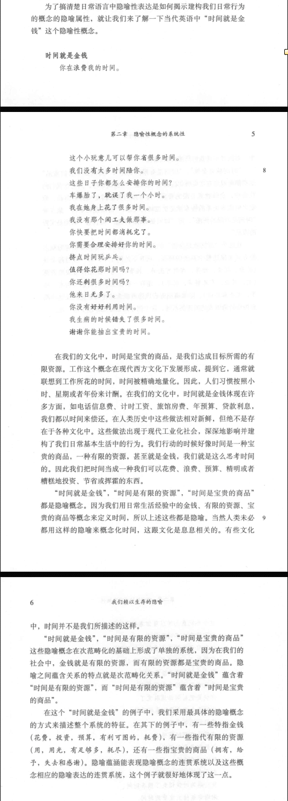
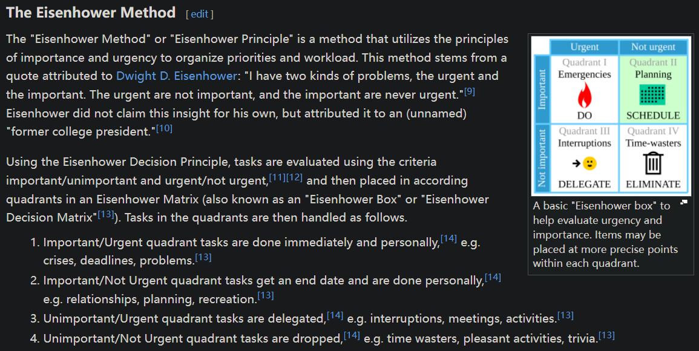

- TODO [时间游戏 (豆瓣)](https://book.douban.com/subject/36905188/)
- [李斯特《钟》La Campanella-18位钢琴家演绎 - 歌单 - 网易云音乐](https://music.163.com/playlist?id=750663570&uct2=U2FsdGVkX1+lGlDdR2BffL4w+yhP86aryLyth6ekhyg=)
- [时间理解论 夹杂有“臆说” ——过份观念化的“时间”(新探十三) - 知乎](https://zhuanlan.zhihu.com/p/115321157)
- 时间感
	- [洞穴里的人类禁闭实验](https://mp.weixin.qq.com/s/YLURX9i6UJ4O7UaW7Zt37w)
	- [流光易逝与度日如年：是什么改变了我们对时间的感知？](https://mp.weixin.qq.com/s/aAJjeIuerl1gZC6nMayc-Q)
- 昼夜节律
  id:: 64631f0c-3c85-446d-a89e-92f911e37600
	- [Circadian cycle - supermemo.guru](https://supermemo.guru/wiki/Circadian_cycle)
	  id:: 6666db67-b937-47b5-b4cf-15eaafa3fc32
- 时间的比喻
  collapsed:: true
	- 动、快
		- 水
			- id:: 66fc8f91-2f66-4078-88ea-d11b91a3f5aa
			  >知者乐水，仁者乐山。知者动，仁者静。知者乐，仁者寿。
			- 年华似水
		- 箭（可以抓住，但是飞得快，一般抓不住）
			- 光阴似箭
			- ((66fc8559-7553-4800-8c4a-9f39aa80e684))
		- 子弹
		- 汽车
		- 飞机
	- 静、慢
	  collapsed:: true
		- 山
			- ((66fc8f91-2f66-4078-88ea-d11b91a3f5aa))
	- 磨灭
	  collapsed:: true
		- >时间碾碎万物：一切都因时间的力量而衰老，在时间的流逝中被遗忘。——亚里士多德
			- id:: 66fcae54-8b02-4e5a-8f78-484b379d6c19
			  >物质不灭，不过粉碎
	- 时代精神
- 生产、仪式等的安排
- 自然化的时间
- [[天文]]
	- id:: 66db8b0f-2fc8-47eb-b564-6ec58e8c1e2f
	  >莫若以明
	- 昼夜交替
		- 晨昏线
			- [晨昏圈 - 维基百科，自由的百科全书](https://zh.wikipedia.org/wiki/%E6%99%A8%E6%98%8F%E5%9C%88)
			- >黎明来一遍，来一遍，黄昏来一遍
				- ((65ae08db-7b92-4199-8748-f67f160e0fa5))
			- 小周天
			  id:: c65aacd5-dba2-4a85-966b-6f624c0624fd
				- [小周天_百度百科](https://baike.baidu.com/item/%E5%B0%8F%E5%91%A8%E5%A4%A9/1633970)
					- “就是本天......就是本天！”
				- [周天 - 道教文化中心資料庫](https://zh.daoinfo.org/wiki/%E5%91%A8%E5%A4%A9)
				- “圆神，启动！”
				  id:: 66fd017b-ff7b-4789-9565-e887f2299bf5
					- （但由于时区划分、“标准时间”而呈现一定的量子特性）
				- 奇经八脉交通网
	- ((64a3ad1d-341d-4cc8-b41a-8fca85d54720))
		- ((66fd1131-083f-4c5c-8e81-f33cc2f1e9a4))
		- >海上生明月，天涯共此时
			- 上下、明暗、远近、动静（“生”、“共”）“对照”，我与我思念的人（“我他”——一说是唐玄宗）互相对称地观赏（至少有个明月，大概——“张九龄你根本不在海边，你到底在哪里？！”）、想象此情此景，海月天涯的空间（也可以有时间）上的分离因相同的时间而聚合（还可以有），是很有意境的（“啊~~斯国一”），“时差啥的就不挑剔了”（当然，也可以继续附会“此时”）
	- ((66fcfd2d-eb2a-4340-9842-eb8cae88bba2))
		- 你不看星星，古人们也不看手机
- ((66fd0068-2c79-4b33-b17b-ba6d1f5bcc31))
- 数字化的时间
  id:: 66fc8b25-7149-4942-a94e-18e66ad22c1d
	- ((66db8afb-8a6c-4131-9a6d-74896c773aae))
	- 日晷、钟表时间与时间制
	  id:: 64cc4eb5-d796-4e41-83b8-cc9f0f9ed1fe
		- 日晷时间
			- [为什么中国和西方都把一天分为12时辰（24小时）？ - 知乎](https://www.zhihu.com/question/278522285)
		- 钟表时间
			- [为什么60秒为一分钟，60分钟为一个小时，一天是24小时? - 知乎](https://www.zhihu.com/question/31985970)
			- [为什么时间制是是以一天24小时为单位的？ - 知乎](https://www.zhihu.com/question/68609464)
	- 时间的视觉形象
	  id:: 66fc8cb7-8155-496e-a877-04e5cdee91f3
		- 黎明
			- 晨昏线/圈（“太美丽啦地球！”）
		- 时针与罗马/印度-阿拉伯数字
		  collapsed:: true
			- 影子（“爸爸快看，影子动了！”）
				- 日晷
			- 实体时针
				- hands of time
					- “时手”，可能源于比较老比较大的落地钟，更大还有大本钟之类的钟塔上的市镇钟，那些就比一般的手更粗更长了，能拨弄更多人的时间（
					- [Doing It Again - DJ Valium - 单曲 - 网易云音乐](https://music.163.com/song?id=26633688&uct2=U2FsdGVkX1+Dv5akz9grDJizlGYD6AUOlpJBXtj9WsY=)
				- 跳党还是扫党？
					- [扫秒机芯 - 维基百科，自由的百科全书](https://zh.wikipedia.org/zh-cn/%E6%89%AB%E7%A7%92%E6%9C%BA%E8%8A%AF)
					- 跳秒
						- “与心跳、脉搏共振？”
						- ((66db8aae-538e-4bdd-91ae-fd71b3b0be68))
					- 扫秒
				- 手表
					- [手表最早为什么被设计成12时的表盘？ - 知乎](https://www.zhihu.com/question/38805083)
					- [为什么市面上没有24小时制（一天转一圈）的手表？ - 知乎](https://www.zhihu.com/question/275969065)
			- 电子数字
				- “只在需要时出现或消失，小子”
				- “每个人都有手机，时间随时能看到，你可不能不守时，不要迟到偷懒哦！”
	- 时间的听觉形象
	  collapsed:: true
		- 钟楼、鼓楼
			- ["暮鼓晨钟"响彻数百年 为古都报送"北京时间"](http://cul.china.com.cn/2024-04/15/content_42755289.htm)
			  id:: 66fcf764-dfac-46f4-8c1f-28472a31dcba
				- >说到“小时”计时方式，当是西方的钟表传入中国后开始。中国古代使用十二时辰计时方法，一个时辰相当于现代的两个小时。当时有人把一个时辰叫做“大时”，把一个钟点叫做“小时”。随着中西方文化交流以及钟表的普及，“大时”一词逐渐消失，中国计时系统逐渐成为24小时制，与世界通行做法衔接，“小时”一直沿用至今。
			- [“晨钟暮鼓”和“暮鼓晨钟”有什么区别？民间和寺庙，又有何异？_凤凰网](https://history.ifeng.com/c/7xH4Negt7us)
		- 机械闹钟（“不孤！不孤！大宝贝起床啦！六点啦！”）
		- 电子闹钟/计时器（“滴滴滴滴”）
		- 电子屏幕（红绿灯的时间显示）
		- 电子设备、软件开关音效（“等灯等灯”）
	- 时间的宗教形象
	- 时间的政治形象
		- 标准时间
			- mean time——“吝啬的时间”
			- “北京时间”
				- ((66fcf764-dfac-46f4-8c1f-28472a31dcba))
- 货币化的时间
  id:: 66fc9128-7b57-43e2-8272-6b2b3bda8afd
  collapsed:: true
	- ((66c7e20a-f941-4036-861d-301ea311ba12))
	- 资源、效率/产能、商品、服务、金钱
		- id:: 66c7e20a-f941-4036-861d-301ea311ba12
		  >时间就是金钱，效率就是生命
			- {:height 34, :width 175}
			  ——《我们赖以生存的隐喻》
		- 浪费时间
			- “现在不浪费时间，等着以后再浪费吗？”
	- 劳动时长
		- 工作日
		  collapsed:: true
			- 996
			  id:: 6319e69a-6d93-456d-a55c-1a4c8990f4c3
				- 马云只是为了阿里巴巴的效率或对其的控制吗？他会不知道996会传播到全社会吗？他是否可能预先布局获益？
				  id:: 66fcebbc-e768-4014-8c50-37e3d1469490
				- 剥削？内卷？不，是控制！
				  id:: 637211eb-cc45-421a-9311-d0789305ee9e
					- [【社会观察】996的实质：不！是！剥！削！_哔哩哔哩_bilibili](https://www.bilibili.com/video/BV1U5411T7tV)（“要断章取义”——《不要断章取义》）
					  id:: 6319e700-72f0-4565-a348-946addee945b
						- 文字版概要：[为什么996是违法的，而所有公司都明显违法却得不到相应的惩罚？ - 知乎](https://www.zhihu.com/question/319759530/answer/2507661424)
						  id:: 6319edd2-0f3a-45a4-9c0b-c9d13ed29bcf
					- 时间分配的阶级性
					- 为什么多发生在互联网行业？
						- 互联网行业大多轻资产，模式创新易复制，为了避免被复制竞争，必须阻断新社交
							- “[[微信]]做得好吗？”
				- 劳动力供给侧
					- 大城市房租
						- 近公司房租过高，则会提高工资成本或竞争者优势
	- 月薪（“生活”）、年薪（“建筑”、“建制”；“年终奖”）、时薪（“效率”）
		- 年终奖
		- [月薪和年薪有什么区别吗？ - 知乎](https://www.zhihu.com/question/304837631)
		- [年薪12万和月薪1万，真的没有区别吗？错，两种薪酬完全不同，不懂吃亏-36氪](https://www.36kr.com/p/2635582608851207)
- “时间概念”
	- “美国时间”
- 生产时间
	- [生产时间_百度百科](https://baike.baidu.com/item/%E7%94%9F%E4%BA%A7%E6%97%B6%E9%97%B4/7308279)
	- ((66ef77de-08a9-4c68-91dc-ccf0efc02872))
	- 劳动时间
	  id:: 66fcadfb-fab1-4b99-8465-ffc27f6b85c6
		- 加量
			- “好干就往死里干”
			- 加速
				- ((66c7e20a-f941-4036-861d-301ea311ba12))
				- 产能
					- ((66fca79c-114a-43c9-8858-297f6d2e4370))
				- ((66db8ac4-d558-458d-9528-499eb66f69ee))
					- “Quicker是一款加速主义APP”
				- 加速主义
					- [加速主义 - 维基百科，自由的百科全书](https://zh.wikipedia.org/wiki/%E5%8A%A0%E9%80%9F%E4%B8%BB%E4%B9%89)
			- 延时
				- “加量不加价”，“利差被吃啦！”
				- ((66ea4d39-4564-44ed-8f8d-693b29c9534e))
				- 延迟
					- 延误
						- 逾期
					- 时间贫困
					  id:: 66fc8559-9163-4dbc-a547-ecbf46876c43
						- ((66c7e20a-f941-4036-861d-301ea311ba12))
							- “换来换去都给手续费换没了是吧？”
					- ((66db8aad-a8d2-46e0-a2d2-0dc3106ff3fc))
		- 时间管理
		  id:: 66c7df52-2c2a-4ace-b416-1ffa909e394a
		  collapsed:: true
			- 时间管理的神话
			- 柳比歇夫
				- [亚历山大·亚历山德罗维奇·柳比歇夫 - 维基百科，自由的百科全书](https://zh.wikipedia.org/zh-cn/%E4%BA%9A%E5%8E%86%E5%B1%B1%E5%A4%A7%C2%B7%E4%BA%9A%E5%8E%86%E5%B1%B1%E5%BE%B7%E7%BD%97%E7%BB%B4%E5%A5%87%C2%B7%E6%9F%B3%E6%AF%94%E6%AD%87%E5%A4%AB)
			- 优先级（保证及时吸收）
				- 信任网络——信任但看不到的（关注了不少的微信公众号）
				- 特别关注、等
				- 优先级矩阵
				  collapsed:: true
					- 艾森豪威尔矩阵
						- >这种艾森豪威尔矩阵以前也用过，但好像没啥用，可能对近期计划还是多了，对远期计划少了
						  可能对日程满而杂的人（比如艾森豪威尔这样的管理者）有“取舍”之类的意义，对其他人为了把矩阵区分填出意义要考虑的就很多了
						- 
							- >“可能艾森豪威尔用的不是这种，或者就没用过”
			- “不想干”的时间
				- ((66db8aba-5f68-4a8f-860b-4599215273cb))
				- ((66db8b0b-568a-4482-ba03-ac79ecf38adf))
			- “自由支配”时间
			  id:: 66fca668-5ea0-4e80-8713-a50c06567e8b
				- “（自由支配）时间越多，（自由支配）时间越少”
				  id:: 66fc8559-1421-46bc-9092-16148066cb57
					- 要做的事会“滚雪球”、“芝诺圆圈”
					- “因为都用掉了”
				- 每天有2~5小时自由支配时间时比较幸福——《时间贫困》
				  id:: 66c833ab-5486-4e16-a850-2f2c16cedc60
					- “我不信！”
						- ((66fc8559-1421-46bc-9092-16148066cb57))
						  collapsed:: true
							- 但是未必不那么幸福
			- 部分旧笔记
			  collapsed:: true
				- [我们这个时代的悖论](https://www.douban.com/note/596366082)
				- 何为时间
				  collapsed:: true
					- “本可做其他事的另一种安排”
					- 一种可快可慢的知觉，一把万物运动的软尺，一座连接自身与外物的桥梁，桥上通过有无、长短、先后、快慢各异的活动，有意义和刻度的运动——地球旋转，昼夜交替，时针摆动，人类思考——“何为时间？”
				- 重视时间
				  collapsed:: true
					- 人的注意力资源对很多人而言就是生钱的流量（而很多不赚钱的流量会以各种形式受限），如果你不愿让别人占你便宜，你就需要捂好自己的时间
					  updated-at:: 1626356978311
					  created-at:: 1626356978311
					- 对于有价值的关系和活动，你需要给它们匀出足够的时间
					- 做自己认为有价值、应该做的事的时间往往只是一部分，所以也许可以说你自己很多时候都不算你自己
					- 通过对自身时间的使用描述即能快速自我介绍，比一般的人格测试好用多了
					  updated-at:: 1626356980288
					  created-at:: 1626323524376
					- 善待每一天——尽量不缺席白昼的演出
				- [[计时]]（以前用手机手动记录的，效果可能不大行）
				- 注意事项
				  collapsed:: true
					- 结合自身实际
						- 生活方式这个主题很大、细节很多，人与人的体质不能一概而论，部分需要积攒发展潜力的读者可能需要更多休息和更少劳损
						  updated-at:: 1626873034905
						  created-at:: 1626873034905
					- 先记录再计划
					  created-at:: 1626873010212
					  updated-at:: 1626873010212
						- 计划谋划的时间不要太长，多数事可以记一笔就先放下。提高整体效率的方法一般有“积极尝试新活动把低效活动挤出”。
						- 计划时发现各个在状态等方面不同的时段并安排相应活动
					- 正确使用正确工具
						- 闹钟
							- 如果关闹钟时不看备注可能忽略备注要做的事，可用不同的自制（录音，比如说话，觉得听自己声音“怪异”可用语音合成或请别人录；也可以统一——“看备注”）或自带的铃声
							- 一天内的日程/计划一般可以用加备注的闹钟
						- 少光用手机，多用更高效的电脑和连键鼠大屏的手机，信息输入输出效率高了就能节省大量时间
							- 打个比方，你要上网找一个还不确定的爱好、人、工具、答案等，本来可能要花三年（其实对重要的事情而言不算久，读者可以想想上一所学校、上一家单位、上一位好友等理解；这一建议也是从我和部分朋友的个人历史中提炼出的），提升了信息输入输出效率，可能一两年都用不着就能找到
							- 键鼠大屏等也提升视野的广度和深度，大屏的一页更大，一次能显示更多信息，像双链笔记之类的软件功能也更强，而且还能因为平台特点自动过滤掉很多手机上的低价值APP
					- 常见的时间敞口/滑坡
						- 很多时候我们主观上想做点好事，但是客观条件不允许，于是没做好或没做成，这些客观条件就是最主要的时间敞口/滑坡
						- 拖延
							- 不能减少”任务“的净时间
						- 精力不足
							- 睡眠不足
							- 吃撑腹胀
								- 意外的美食（可能是别人送的）
								- 其次是吃早了，然后胀着时还继续吃，导致无法进行较高水平的脑力劳动也睡不着，只能玩玩游戏、看看视频
						- 没有合适的工具
							- 没电脑尽快买
							- 电脑体验不够丰富
								- 大屏键鼠低音炮是我的基本需求
						- 环境不佳/没算过改造环境的账
							- 天热~省不得开空调~不坐客厅电脑前~不整理写作——这点电费、折旧和碳排放哪有我抓紧时间写作让读者今早看到这些文字重要？
						- 难控制的鸡肋
							- 乘兴而来兴尽而返的网聊/动态草稿、网购等
						- 有些东西太新鲜和/或刺激
							- 买股票、基金过于关注它们的短期波动
						- 饮食
							- 食物选择与烹饪
								- 注意少吃内外难清洗的东西，尽快清洗部分厨具
						- 社会情绪选择理论——为何很多年轻人有时间却不做自己也认为“更有价值的事”
							- ((66db8abc-dd94-4e71-a526-9276b1955010))
							- 年轻人觉得时间多，侧重面向开放世界学习工具性知识，老年人觉得时间少，侧重情绪目标；“不匹配”的现象，例如玩游戏，大作和氪金手游，取决于时间知觉，长则学习大量知识玩大作，短则放弃学习氪金买虚荣。当然，这只是游戏内部比较，如果把游戏跟健康、学习工作等比较又是另回事了，再怎么好的大作，无论最后给它加多少意义，都不能否认它可能在其他方面绊倒你
							- 而考虑其他因素，如996，也会产生时间少的判断
				- [[我以前上班时的一日常规]]