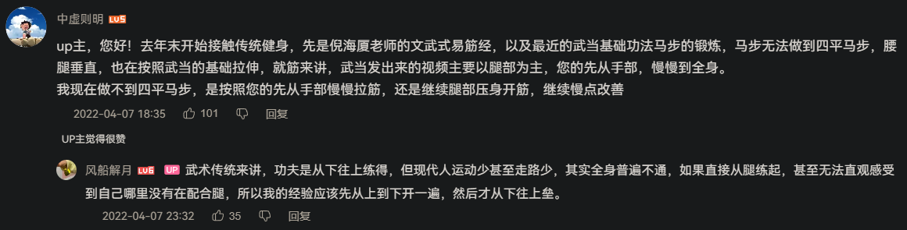
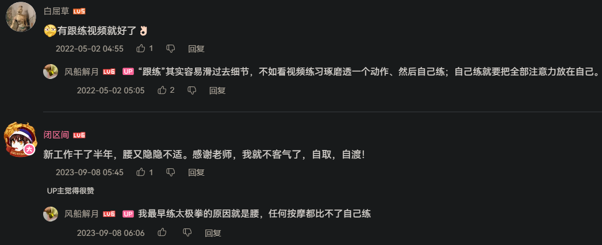
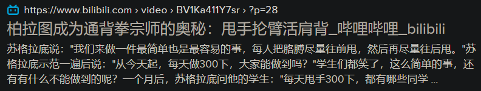

- 价值
	- 人类站起来后，还吃到处爬来爬去的动物的老本（但它们的进步空间可能也很大）已经不能适应新时代新形势了
	- “为了大家能心平气和地说话”
		- >我会武术啊，是为了能让傻X心平气和地跟我说话，我读书呢，是为了能够和傻X心平气和地说话。——吴京
			- [主持人：为什么学武术？吴京：主要是想让傻X好好跟我说话！_哔哩哔哩_bilibili](https://www.bilibili.com/video/BV1bg411G7f9)
				- [1992年全国武术套路锦标赛—吴京（通臂拳）_哔哩哔哩_bilibili](https://www.bilibili.com/video/BV1vb411N7Fe)
				- [吴京舞枪（1992年）_哔哩哔哩_bilibili](https://www.bilibili.com/video/BV1xs411S7qv)
	- 提振武风
		- >文明其精神，野蛮其体魄
		- >国力苶弱，武风不振，民族之体质，日趋轻细。此甚可忧之现象也。——毛泽东[《体育之研究》](http://www.ziyexing.com/maozedong/maozedong_53.htm)
- “中国新武术”
  collapsed:: true
	- 陈鹤皋
	  id:: 626614b8-5064-4c3c-b654-fc85a8f950fb
		- [从陈鹤皋的“无限制格斗术”说起【刃牙吧】_百度贴吧](https://tieba.baidu.com/p/7157738311)
		  id:: 66933726-1170-4101-9548-f89edabb9273
		- [寻找功夫 谈陈鹤皋_哔哩哔哩_bilibili](https://www.bilibili.com/video/BV1sQ4y1n71A)
		- [无限制](http://www.w01w.com/)
		- [【半佛】“疯狗流”陈鹤皋的魔幻江湖。](https://www.bilibili.com/video/BV1dT4y1M7Ko)
		- [陈鹤皋无限制格斗教学【一切为了实战】](https://www.bilibili.com/video/BV1Jz4y1m7GZ)
			- 链接：https://pan.baidu.com/s/1o8QvZ5UBfg2jgrs7Q1JGEw 
			  提取码：yyds
		- [陈鹤皋无限制格斗教学【一切为了实战】_哔哩哔哩_bilibili](https://www.bilibili.com/video/BV1Jz4y1m7GZ)
		- ((66335bd5-3700-4466-b323-478317a2194e))
		- [【无限制武道】陈鹤皋训练菲律宾短棍世界级高手_哔哩哔哩_bilibili](https://www.bilibili.com/video/BV12P4y1L7qL)
		- ---
		- “发声自由”
		- “这个吼啊，是绝对精神的宣泄、怒吼、发声”
			- “这是坠（指“气沉丹田”）吼滴！”
		- 在地下车库小房间、空旷户外练，还可以戴 ((65bcbf46-7772-4bee-be4a-6b7f8f56a859)) 掩耳盗铃
		- 呐喊疗法？
			- ((66335c32-30b1-4973-b09a-7cba8f974b6b))
		- 录音录像
		- 拉群练
			- “人们并非不想活得魔怔，很可能只是缺乏一个有认同感、归属感、安全感、各种感的社群，现在我们来了，我们带着‘一起鬼叫群’来了！”
			- “什么破冰行动？”
	- 邵发明
		- [寻找功夫—陈鹤皋的师兄自创门派的故事_哔哩哔哩_bilibili](https://www.bilibili.com/video/BV1qc411R7Yt)
		- [【半佛】疯魔武人，野王邵发明。_哔哩哔哩_bilibili](https://www.bilibili.com/video/BV1gL411v7uA)
- 传统武术
	- 传武观点
	  id:: 668f6f73-d802-47e0-85b4-0757bbdac0ec
	  collapsed:: true
		- [很多传统武术中都有搭手听劲的功夫，为什么在现代搏击中用不上呢？ - 季风号舰长的回答 - 知乎](https://www.zhihu.com/question/601956808/answer/3036256910)
		- [传统武术是否真的像网上讲的那样是从兵器功夫上蜕变下来的，精髓在器而不在拳？ - 季风号舰长的回答 - 知乎](https://www.zhihu.com/question/529813654/answer/2456114684)
		- id:: 66933e15-a8fa-4b5b-a5bf-812a929ee00d
		  >实际上传统武术至少按我目前的体会和见闻，它更多的是一个发生学意义上的混杂的实体，是一个混杂传统格斗技术，兵器技术，护身技战术，江湖经验，组织活动，随身物品制作等等的庞大缝合怪。其中，格斗技术已经落后于现代了，但依然是技术。兵器是因为现在世界都属于“文艺复兴”……目前传统大枪挺牛的，其他不了解。护身技战术和其他技术一样，都属于OK的水准。至于春点啥的，这属于民俗。
			- ((66933726-1170-4101-9548-f89edabb9273))
		- 传武的传播为了治安而受阉割，民警不带枪需要群众不会拳
	- 内家拳
	  id:: 65bcbf48-c451-4809-ab3a-d091b9e533f0
	  collapsed:: true
		- [内家拳_百度百科](https://baike.baidu.com/item/%E5%86%85%E5%AE%B6%E6%8B%B3)
		- TODO 内家拳与现代运动康复（帕维尔·塔索林等）
		- ((661d0696-1e51-4244-8ead-1c6dae85753a))
		- 霹雳手老顽童
		  id:: 64631f0b-6e2a-44c3-9327-b46359a22b97
			- [霹雳手老顽童的个人空间_哔哩哔哩_Bilibili](https://space.bilibili.com/1808979518)
		- ((65ddc5a2-c177-4a26-91b6-c2aab896539e))
			- [网络热门武术鉴定（8） 虎豹雷音和筋骨齐鸣是否真的存在？究竟是武术还是修仙？_哔哩哔哩_bilibili](https://www.bilibili.com/video/BV1wY411J76W)
		- [内家版“囚徒健身”系列之一：写在前面 - 知乎](https://zhuanlan.zhihu.com/p/23542760)
			- [内家版“囚徒健身”练习（摘要） - 简书](https://www.jianshu.com/p/e18126beaa47)
			  id:: 66125921-05ba-4f23-b3ac-c49ce5f9cc06
		- [简单说一两句《洗髓经》 - 知乎](https://zhuanlan.zhihu.com/p/95671749)
		- 刘杨
			- [内家拳的正确打开方式-刘杨-微信读书](https://weread.qq.com/web/reader/d4e321e071df64ccd4e6f21)
			  id:: 65dc21b5-e762-4e16-8d3d-c813d6ccd7e4
			  :LOGBOOK:
			  CLOCK: [2024-02-26 Mon 17:54:50]
			  :END:
				- [内家拳的正确打开方式_全集免费在线阅读收听下载 - 喜马拉雅](https://www.ximalaya.com/album/66885121)
				  id:: 668f7c65-83b0-4bc5-bebf-d13403df1b5c
				- ((65c589f9-342d-42c5-818c-f363a95b3847))
			- [网上的武术视频中，哪些真正符合了传统拳的体用原则？ - 知乎](https://www.zhihu.com/question/40885048)
			- ((62a5f646-75fe-480c-80a7-c8cf1303639b))
		- 太极拳
		  id:: 6311e5cf-9e50-48b0-a908-ad7b535aeca4
		  collapsed:: true
			- “打什么拳？打太极”
			- [为什么传统武术中，太极拳的假大师和骗子是最多的？ - 知乎](https://www.zhihu.com/question/396539146)
			- [风船解月的个人空间-风船解月个人主页-哔哩哔哩视频](https://space.bilibili.com/2006739226)
			  id:: 6660ed13-b53c-4020-a158-68d028b225de
				- 
				- 
				- ((65d2aef4-03a9-41c1-b9cc-85c2fa6a4abd))
				- [合集·解密、健身、到实战：传统武术就这么简单](https://space.bilibili.com/2006739226/channel/collectiondetail?sid=49179)（0.x可以挑感兴趣的一掠而过，然后从视频1开始看）
				  id:: 66a06e8e-ca12-47fa-be0b-ac8fc286145a
					- 翻江倒海
					  id:: 66a6d22e-9cdd-497c-bcb7-973171014335
						- 可以想象自己是异型摩天轮，这样可能帮助练得整体些
				- [传武基础常识1 撑筋拔骨，健身与实战作用_哔哩哔哩_bilibili](https://www.bilibili.com/video/BV17F411Y76n)
				  id:: 66821af3-c161-4923-ad56-a4a360934d72
			- [于海老师打一套行云流水的太极拳，我终于明白马保国想表达的意思。_哔哩哔哩_bilibili](https://www.bilibili.com/video/BV1jj421Q7mh)
			- 推手
			  id:: 65e5bb8d-9564-489f-8ef7-358cacef502d
				- [竞技推手和太极推手是什么关系？发展如何？ - 知乎](https://www.zhihu.com/question/440766426)
		- 形意拳
		  collapsed:: true
			- [mma与形意实战，如何规避组合拳时间差_哔哩哔哩_bilibili](https://www.bilibili.com/video/BV1dC411W78j)
		- 八卦掌
		- 通背拳
		  id:: 668ce778-547e-4cff-8392-ff8d5dbbf5f6
			- [通背心得丨易师兄谈内家拳和外家拳_筋骨](https://www.sohu.com/a/394541632_744573)
			- [通背拳基本功动作展示 练习满一年了_哔哩哔哩_bilibili](https://www.bilibili.com/video/BV1MG4y1L77j)
			  id:: 668ce77c-c714-41a1-9e40-a6ae88c5ab70
				- [练习时长两年半的【通背拳】展示 松沉劲儿 摇山:开胸顺背阴阳掌掸手鸳鸯膀子_哔哩哔哩_bilibili](https://www.bilibili.com/video/BV1fi421v7pd)
				- “柏拉图也甩”
					- 
						- 很遗憾没能看到这个视频
			- [通背拳 悠荡腿 调理腿疼膝盖疼骶髂疼后背疼_哔哩哔哩_bilibili](https://www.bilibili.com/video/BV15v4y1r76c)
			  id:: 66a74ab3-575f-4e89-9c5d-30b4bae6ad14
			- ((66a484a5-d044-4627-acf5-f7c6a3d0a63e))
		- ---
		- 洗膀
		  id:: 667b89db-93e3-485b-9b12-0f5f52661d3b
		  collapsed:: true
			- [内家版"囚徒健身"系列之三：洗膀](https://zhuanlan.zhihu.com/p/23583690)
			  id:: 62a5f646-75fe-480c-80a7-c8cf1303639b
				- ((6311e5d3-7574-41c0-8eea-a65c37cfcbca))
		- [内家拳的开胯练习方法 - 知乎](https://zhuanlan.zhihu.com/p/186189108)
		  id:: 661ba8ad-5f35-41f1-8207-423084a1d40a
	- [【传武】少林禅武医释德建VS省拳击冠军！_哔哩哔哩_bilibili](https://www.bilibili.com/video/BV1Fx41147Bb)
	- 八拳
		- [武林高手传青年毛泽东“王拳” 毛自创“六段运动”|武林|高手_凤凰历史](https://news.ifeng.com/a/20160118/47114032_0.shtml)
		  id:: 66a21403-3707-4164-adbb-bc15ceb3842a
			- [怪人柳午亭-湖南省文史研究馆](https://css.hunan.gov.cn/css/tslm/hxws/wssy/201603/sxrj_17/201701/t20170103_3823583.html)
				- id:: 66a21d83-fbb1-479e-8cc8-13501ac4c017
				  >柳午亭锻炼身体的方法很怪，冬天定会洗冷水浴，三伏天会在烈日下打坐进修，早晨会放出自家的一条狗在窄窄的山道上奔跑，而自己在后面紧追不舍，直到抓住狗尾。
	- [纪念毛泽东诞辰130周年|《党史纵览》：毛泽东与中华武术](http://www.360doc.com/content/23/0928/14/7793103_1098313485.shtml)
	  id:: 66a22129-da0e-4449-b5f1-8ada4a33c119
		- [毛泽东鲜为人知的习武经历](http://www.360doc.com/content/22/0803/20/69881565_1042475120.shtml)
	- [从自卫术、国粹到气功热 中国武术的百年历程|界面新闻 · 文化](https://www.jiemian.com/article/1308406.html)
- [俄罗斯武术systema_能量传导_哔哩哔哩_bilibili](https://www.bilibili.com/video/BV1K84y1q7T7)
- 摔跤
	- [【我推的孩子】家庭地位黄金联赛⚡不战斗就无法生存！_哔哩哔哩_bilibili](https://www.bilibili.com/video/BV1PK4y1i7g5)
- 格斗
- 冷兵器
  collapsed:: true
	- 双节棍
		- [双节棍属于哪个国家的兵器（武器）？ - 知乎](https://www.zhihu.com/question/24318933)
		- [【日常记录】（医武相通）耍双截棍背后换手可预防缓解颈椎病肩颈痛肩周炎手机病._哔哩哔哩_bilibili](https://www.bilibili.com/video/BV1Uk4y1B7Yw)
		  id:: 668bbdbc-8d04-4c51-bfe2-ac65c3ac2ad7
	- 兵击
		- [兵击应该先去哪里学? - 赤色的彗星的回答 - 知乎 ](https://www.zhihu.com/question/447931467/answer/1767145401)
		- 海绵棒/空气棒（可蒙眼盲打）
			- [【鞭打发力】海绵棒大杀四方，猜猜这集有没有教学（Doge）_哔哩哔哩_bilibili](https://www.bilibili.com/video/BV1Qf4y1j7us)
	- [剑术技巧解密：扭曲的手臂_哔哩哔哩_bilibili](https://www.bilibili.com/video/BV1YZ421M7Zs)
	  id:: 667f8bc0-7690-44e2-ae5e-eebaf2dca838
- 防身术
  id:: 66335be1-be8b-4286-9eed-b14567455ea6
	- 咏春据说是拥挤室内或船内劳动者创造的武术，各行各业多少应该学点
	- ((668ce773-758c-479a-8d54-76ab3bd14022))
		- 及时感知（至少最近死了人可以留点神）
- ---
- “霸气”
  collapsed:: true
	- [海贼王中的武装色，霸王色，见闻色可以理解现实生活中人的什么能力？](https://www.zhihu.com/question/385256933)（“最爱的经典回答”）
	  id:: 66335be1-4def-4ff7-8f3e-1e19070b229c
		- 对三种霸气的简单理解：见闻色霸气——随时知彼知己（猜透活动的目的和可能安排，迅速从对方的行为推测出对方目前和之后的目的和行为，以及我需要做出的对应行为），武装色霸气——接近本能的技能（知道如何顺畅地摆出强硬姿态和气场，否则光知道要做什么也做不出来），霸王色霸气——多次强化的残留（多次“寻衅滋事”，胆儿肥了）
		- [[交通安全]]
	- 武装色霸气
		- ((666e15d2-d6f6-49f8-84c2-ba7a7a593316))
	- 见闻色霸气
		- [我睁着眼睛都不一定有他能躲_哔哩哔哩_bilibili](https://www.bilibili.com/video/BV1WY4y1W7wE)
		- [我预判了你所有动作，太帅啦_哔哩哔哩_bilibili](https://www.bilibili.com/video/BV1tb4y1s7bw)
	- 霸王色霸气
		- ((628ca87d-8db4-43d6-bccd-7f4c099e3c52))
			- 只要你不敢掀、不敢打，手上有再好的武器也不顶用
		- 
		- {{embed ((60c89be5-94a1-4122-b370-f41eb3f63385))}}