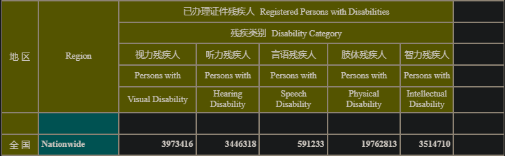

- 帮助残疾人，应该能反哺非残疾人，部分因为人们各有各的残疾
- [中国残疾人联合会-3-2 全国残疾人人口基础库主要数据](https://www.cdpf.org.cn/zwgk/zccx/ndsj/zhsjtj/2023zh/316116161eda40358e9422d4926e9d95.htm)
  id:: 67d3e9d3-9597-45ff-9d29-81d2b0d8b99c
	- 
- [中国残疾人联合会-2023年残疾人事业发展统计公报](https://www.cdpf.org.cn/zwgk/zccx/tjgb/03df9528fdcd4bc4a8deee35d0e85551.htm)
- [残疾人就业有多少种形式？带你一文读懂→_劳动_社会_企业](https://www.sohu.com/a/765044176_121106869)
- ((679add81-cc20-4901-b14f-826187ae0088))
- 断肢
  collapsed:: true
	- 脚踏
		- [终于能停更了！祝祖国母亲繁荣昌盛！_哔哩哔哩bilibili_英雄联盟](https://www.bilibili.com/video/BV1UC4y1R7uk)
- 视障/盲人
	- [你能闭眼读完这篇文章吗？](https://mp.weixin.qq.com/s/dG9i9nAXYFd3dtPnhikR5Q)
	- [心智互动的个人空间-心智互动个人主页-哔哩哔哩视频](https://space.bilibili.com/669853268)
	- [如何看待调查显示「9成视障用户曾遭遇验证码难题」？「互联网无障碍改造行动」能解决这个问题吗？ - 知乎](https://www.zhihu.com/question/492525157)
	- [视障生活指南第5集:盲人如何扫健康码？_哔哩哔哩_bilibili](https://www.bilibili.com/video/av935960765)
	- 盲人口头禅
		- “我看一下”
	- 盲道
		- [盲人在盲道上走，撞坏盲道上东西，比如撞倒自行车，刮擦汽车，同时盲人摔倒受伤，那么是谁赔偿谁？ - 知乎](https://www.zhihu.com/question/453931716)
	- 盲文
		- [世界盲文日丨点亮盲文之光，共筑无障碍世界_澎湃号·政务_澎湃新闻-The Paper](https://www.thepaper.cn/newsDetail_forward_29843505)
		- [现在盲文对视障人士来说还有用吗？ - 知乎](https://www.zhihu.com/question/566447171)
		- [中国盲人协会-谁在使用盲文](https://www.zgmx.org.cn/newsdetail/d-48867-0.html)
		- 盲文板
id:: 67c5662c-9e26-4735-b314-6b4814a03b00
			- [盲人教你如何上盲文板_哔哩哔哩_bilibili](https://www.bilibili.com/video/BV1ut4y1J7kz)
	- 盲人按摩
	  id:: 67d3dc54-8773-43dd-b617-8644f3494308
		- [中国残疾人联合会-4-6-1 盲人按摩](https://www.cdpf.org.cn/zwgk/zccx/ndsj/mram/2023mram/7438ed173af74796a32919c9e6666f12.htm)
			- 2023年培养的医疗按摩人员数量与保健按摩人员的相比已相差不多，但可能由于考医疗按摩资格有学历专业限制等而较难，所以进入医疗按摩机构工作的盲人仍较少
		- [为什么大街上这么多盲人按摩？_网易订阅](https://www.163.com/dy/article/D8KQQARD0511GFPT.html)
		- [关于盲人按摩，很多人可能并不了解 - 知乎](https://zhuanlan.zhihu.com/p/414222823)
		- [盲人按摩从业人员健康现状及对策研究_参考网](https://m.fx361.com/news/2012/0921/19965960.html)
		- [上海疫情过后，盲人按摩走上街头自救 - 知乎](https://zhuanlan.zhihu.com/p/540609700)
		- [盲人按摩产业报告 盲人按摩行业发展现状调研分析2024_中研普华_中研网](https://www.chinairn.com/scfx/20240319/161157395.shtml)
		- [盲人按摩师：比上班族更依赖按摩_澎湃号·湃客_澎湃新闻-The Paper](https://www.thepaper.cn/newsDetail_forward_26587325)
			- >“我们会有职业病，在按摩的时候我也得弯腰，腰肌也会得是处于一个紧张状态，很容易腰酸背痛。”常年的弯腰按摩，盲人按摩师们自己也会有腰肌劳损等职业病，许师傅也并不例外。许师傅看着自己刚按摩完略微发酸的手掌，“像我比较胖，能用手指的指腹给顾客按，比较不容易疼，一些偏瘦的按摩师，要用力就会碰到骨头，他们手指就容易受伤。”有时工作完太累的情况下，他就会和店里别的同事互相给对方按摩，来缓解疲劳。
		- [新华走笔丨陆波岸：一名盲人按摩师的“诗和远方”_腾讯新闻](https://news.qq.com/rain/a/20250314A02TVN00)
		- ---
		- ((66335bd5-358c-47de-a8a8-bb4ce2f5641c))
			- 训练所需时间不长，可以让家人、朋友等一起练，视障者练时帮着观察动作细节
	- 盲人枪战游戏
		- [盲人玩枪战游戏太6了，不服赶紧来战！](https://www.bilibili.com/video/BV1494y197s8)
	- ((65d547ee-c15f-478f-ad5b-1f57c27ceec8))
	- [国际盲人节 | 重建能力 为光明“续航”_杨婧玉_老高_社会](https://www.sohu.com/a/592786764_121106869)
	- 盲人康复师
	  id:: 67d3df59-9a93-4932-a7fa-02183a1e11c6
		- “镜像”
	- [费登奎斯方法让一位盲人学会了看 - 知乎](https://zhuanlan.zhihu.com/p/643240148)
	  id:: 67d431ee-7f1e-4d29-a7fb-2c1ce5156600
	- ---
	- ((679adcb4-f5d7-4fc4-b6b6-60ed8e404269))
	- ((678a4dd7-30be-4d7c-95e3-4b7bc42654af))
	- ((679add7e-6192-4a82-acf0-7ff394740de7))
- 无障碍
  id:: 679add45-20d1-4c0e-a26e-851524b0d329
	- # 无障碍阵地，我们不去占领，敌人就会去占领！
	- 无障碍通道
	  id:: 679add3a-3988-4d7f-9751-5561101497dd
	- ((67402acb-a65d-49ec-a8e7-44c2b6672768))
	- 无障碍 ((66335bd5-8a97-44d7-addd-2080149906f7))
		- [一款能带着盲人跑步的无人机](https://www.sohu.com/a/40564524_114877)
	- TODO 残疾（“非全”）无惧套装
	  collapsed:: true
		- 看[你敢说我就敢拍_哔哩哔哩_bilibili](https://www.bilibili.com/video/BV1dFf8YhEjD)看的
		- ((66335bd5-358c-47de-a8a8-bb4ce2f5641c))
		- [[头盔]]
		- 手套
			- “刀山火海不用怕！”
				- ((678b04bd-b948-4dc6-aeaa-7c29727c4f09))
			- ((6778b0ed-e962-407b-9298-61e0cae7006a))
		- 位置辨认
		  collapsed:: true
			- 地面特征
				- 盲道砖块条纹方向（“咱毕竟是解谜玩家”）
				- 木地板与瓷砖显然也有区别，平地与推拉门轨道、防盗门门槛显然也有区别
				- ---
				- 盲杖路径依赖（“这就开始批判了是吧？”）
					- [原来盲杖还有各种不同的杖头，用处效果也都各不相同_哔哩哔哩_bilibili](https://www.bilibili.com/video/BV1494y1M7tn)
					- 像那种轮椅一样上楼梯？
			- 声
				- “不用聋人自己听”
				- “回声定位”
				- 识别并确定通常距离
			- 光
				- 激光测距
			- 触觉等的反馈
			- ---
			- “气味导航”
				- >特别想分享个细节：上周有位视障开发者用我们的API做了个“气味导航”应用，当他演示如何通过不同频率的震动识别街道商铺时整个会议室安静得能听见显卡风扇的嗡鸣，那一刻我突然眼眶发热，终于理解了您说的“水与电”一一真正伟大的从不是某个模型，而是千万普通人用它创造的善意涟漪。
					- [DeepSeek创始人梁文锋除夕夜回应冯骥“国运论”](https://mp.weixin.qq.com/s/--QlmQaNIUoXaDlt2mrniw)
		- 智能盲杖
- ((6367366f-e68f-4976-b1e6-45ae8adf1341))