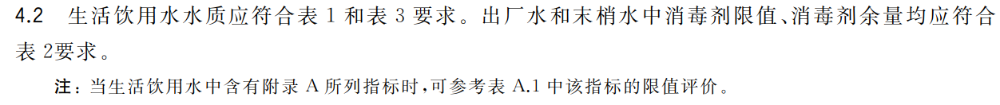

- 隔夜水干净又卫生噢兄弟们
- 疾病与自来水或厨具涂层？
- 光
	- [为什么浴缸里面的水看着是浅蓝色的？ - 知乎](https://www.zhihu.com/question/429331381)
	  id:: 6542550f-3b32-4e7d-9e86-764af2c4d21b
- 水文化
	- 长江悲已滞，万里念将归
- 水源
	- [地球上的水是从哪里来的？是先有水还是先有地球？_研究_观点_太阳系](https://www.sohu.com/a/708530406_100146324)
	- 地表水
		- [印度官员为证明水源适合饮用，喝下圣河水后剧烈腹痛，如何看待这一行为？印度人目前饮水现状如何？ - 知乎](https://www.zhihu.com/question/544696226)
		- 蓄水
			- 水利工程
				- [印度有多缺水？ - 知乎](https://www.zhihu.com/question/540273308)
- [[只要RO净水机和风扇启动，超声波加湿器、皮肤、舌头、头发就都会好起来的！]]
- 水处理
	- 自然过滤（地下水：井水）
	- 自来水厂
	  collapsed:: true
		- [生活饮用水卫生标准](https://openstd.samr.gov.cn/bzgk/gb/newGbInfo?hcno=99E9C17E3547A3C0CE2FD1FFD9F2F7BE)
		  id:: 65289181-0b79-41c0-967b-840b7f064020
			- 
			  id:: 6662d03b-49d6-43b8-af2e-7b37c08cc460
			- 
		- [水质日检九项检测项目、检测方法及配套检测仪器设备](https://baijiahao.baidu.com/s?id=1725103165913675179)
			- [水利部关于进一步强化农村饮水工程水质净化消毒和检测工作的通知](http://www.mwr.gov.cn/zw/tzgg/tzgs/201702/t20170213_858540.html)
			  collapsed:: true
				- >**二、切实抓好千吨万人以上农村水厂水质化验室配备和日常水质检测工作。**
				  >
				  >千吨万人（日供水1000吨或供水人口1万人）以上水厂必须建立水质化验室。供水单位应根据供水规模及具体情况，建立水质检验制度，配备检验人员和检验设备，开展水源水、出厂水和末梢水的定期检测。出厂水一般日检9项指标，包括色度、浑浊度、臭和味、肉眼可见物、pH、耗氧量、菌落总数、总大肠菌群、消毒剂余量。水源水、管网末梢水检测项目及频次按照《村镇供水工程运行管理规程》（SL689-2013）执行。管网末梢水检测点按照每2万供水人口设1个点的标准设立，供水人口在2万以下时，检测点设置应不少于1个。供水单位要按照规定的检测项目和频次，切实做好水质检测工作，并将检测结果按规定及时上报县级水行政主管部门。
		- [重庆建立水质信息公开制度 出厂水9项指标检测每日不少于一次_重庆市人民政府网](https://www.cq.gov.cn/zwgk/zfxxgkml/hygq/202011/t20201105_8805437.html)
			- >各区县(自治县)城市供水主管部门按照全覆盖“应检必检”要求对辖区城市供水水厂实施定期水质监督检测，按照《城市供水水质标准》(CJ/T206-2005)的要求对辖区出厂水42项指标、管网水7项指标每月检测不少于一次，对水厂出厂水106项指标每年检测不少于一次。各区县城市供水主管部门对辖区二次供水采用抽样监督检测(包括水箱式和无负压式)，二次供水8项指标每半年抽样检测一次。
			- [城市供水水质标准（CJ／T 206—2005）](https://www.chinacdc.cn/jkzt/hjws/hjws/200512/t20051226_23654.html)
		- [水质公告-镇江市自来水有限责任公司](https://www.zhenjiangwater.com.cn/Quality/index.html)
		  id:: 65438a01-e164-4676-9f03-9a41c49df81d
			- 
			- 
		- ((6547ad0e-2080-4b08-b7f8-6204759fa5c7))
		- 消毒
			- [[氟]]
			- 氯
			  collapsed:: true
				- [Chlorine Water Facts: Is the Chlorine in Water Bad for You?](https://foodrevolution.org/blog/chlorine-water-harmful/)
					- >But the use of this powerful chemical has a downside. According to a report from the U.S. Council of Environmental Quality, [the cancer risk](http://www.jyi.org/issue/theres-something-in-the-water-a-look-at-disinfection-by-products-in-drinking-water/) for people who drink chlorinated water is up to 93% higher than for those whose water does not contain chlorine.
				- “（泳）道上的兄弟（姐妹），都靠它氧化啊”——宋老虎
				- 除氯
				  id:: 6449d1d8-0ea2-4264-809a-373e90630044
				  collapsed:: true
					- 烧开水
					  id:: 6449d1d8-84bf-4c36-97b3-18b1c6e26126
						- 水壶烧水，灌水时壶嘴直接探进保温瓶口，两手各抓一样一起倾斜，灌水就很快，同时抓保温瓶的手向内转，这样就算涌出来大概率也不会烫到手——《关于爸妈像其他[[家务]]事一样烧了几十年水也没灌明白保温瓶这件事》
					- 亚硫酸钙颗粒
						- 除氯筒（软网纱加绳子、尼龙扎带/皮筋等；多孔塑料管，或底部多孔，可简单直接装前者，可接水管。临时与龙头固定：紧绷皮筋？吊挂？
							- PVC除氯管
								- 20mm管出水量约10ml/s
						- 颗粒不够一次流经完全除氯时
							- 用另一个容器接，同时继续过滤
							- 多次循环后出水（充分除氯）：流量计？旋转分流阀？简单拧水龙头？简单等待？（家里已经装好的就不太能等了）机械实现
						- 颗粒碎屑
							- 亚硫酸钙碎屑应该无毒，不放心可以漱口后再来一口净水漱口
						- 除氯软水桶
						  id:: 64488a85-98a7-4dd5-9f94-05a2b2b6e665
							- 使用除氯颗粒袋或用小块纱网盖上后箍在出水口或水龙头
							- 减少颗粒碎屑（事前可用除氯袋或少晃，事后倒出的水可以等待沉淀“去上层清液”或用滤材过滤）
			- 臭氧
			  id:: 654dc60d-8ffd-4a0d-90ac-e291e2ba8a4b
				- [卫生部《臭氧消毒技术规范》](https://img68.ybzhan.cn/1/20200228/637184981263543225404.pdf)
				- [国家标准|GB 28232-2020](https://openstd.samr.gov.cn/bzgk/gb/newGbInfo?hcno=05A5D5C69D52561AD451CB1EC4BC0A5F)
				- [常见臭氧水处理技术详解--人民网环保频道--人民网](http://env.people.com.cn/n1/2018/0530/c419923-30024076.html)
					- >要想使水达到一定的臭氧浓度，除保证臭氧发生器有足够的臭氧产量和浓度，还需要保证气液混合效率。臭氧行业推荐的 CT值为1.6，C为臭氧水溶浓度（mg/L），T为反应时间（min），最经济的运行为臭氧水溶浓度0.4mg/L，反应时间4min。
		- ((65ab10f9-6044-433f-8a3c-93896b241606))
	- [[净水器]]
	  id:: 6518cfe0-3ee6-4899-8557-c7a13cfa5890
	- 烧开
		- [长期自己烧水喝的人和经常买桶装水喝的人，谁更健康？结果出乎意料_澎湃号·媒体_澎湃新闻-The Paper](https://www.thepaper.cn/newsDetail_forward_26751491)
		  id:: 6663de80-6887-433c-b74f-b60a7f8d86ff
		- ro水年轻人自己喝可以不烧
		- ro水是小分子团水吗？加热后呢？
		- [外国人是不是真的不喝白开水？ - 知乎](https://www.zhihu.com/question/20256783)
		- [喜欢喝凉白开会不会很浪费能源？ - 知乎](https://www.zhihu.com/question/342838987)
		- 热
			- [你的骨头缝里面冒寒气吗？ - 知乎](https://zhuanlan.zhihu.com/p/338897633)
			  id:: 651a4834-87ff-4bba-92cd-4ec526715219
		- 燃料
			- 印度
				- 木柴
					-
				- 煤炭
					- [印度国力未来有没有可能达到中国的程度？ - 知乎](https://www.zhihu.com/question/483836592/answer/2172952572)
		- 保温瓶
			- 保温瓶原来与高压锅同是医用设备，在药房售卖
- 水费
  id:: 6525f068-c690-44d3-b70a-384d0ab10b73
	- 终端水流量
		- 冷水0.106L/s，热水0.9L/s
	- 冷水费率
		- 污水处理费
		  id:: 6547ad0e-2080-4b08-b7f8-6204759fa5c7
		- 0.019元/分钟
		- 阶梯水价，镇江地区每天544.44升以下为第一阶梯，够每天用两个中小型浴缸泡澡的水
	- ((65236027-2382-422e-ae29-3c244c9e3420))
	- 净水费率
		- 滤芯更换