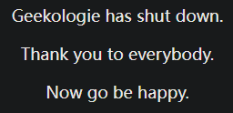
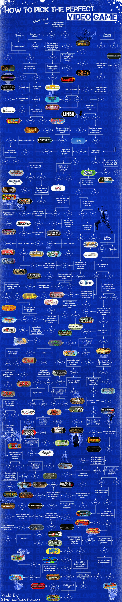

- ==“为了省事点块引用放进来的，还要慢慢整理”==
- 如果一定要玩游戏的counterpart，以及附带其他
- 判断方式，玩法
- [【主义主义】游戏的世界象征主义（3-1-2-4）——“我玩故我在”的哲学_哔哩哔哩_bilibili](https://www.bilibili.com/video/BV1oy4y1M7ef)
  id:: 66304de6-0077-4e49-9dca-27cf8168cea9
- ---
- [[Crying Suns]]
  id:: 0711327c-3f9a-48d5-ae7f-23370eecf1ea
- [k选音影游单](https://zhuanlan.zhihu.com/p/103355338)（知乎老文章）整理（就是现在本页的大部分内容）
  :LOGBOOK:
  CLOCK: [2021-11-14 Sun 09:33:17]
  :END:
- [[玩具]]
- [[剧本杀]]
- TODO 医学游戏
  id:: 65df25c2-d0d3-4683-9ea9-ad5b47c9cdfd
- 资料
  collapsed:: true
	- [为什么国内对游戏管的越来越苛刻了？](https://www.zhihu.com/question/520599428)（游戏是软柿子）
	  id:: 624cf914-5bbe-4434-bbc2-55d2d2ef0629
	- [理 性 与 感 性](https://www.bilibili.com/video/BV1JY411G7yM)
	- [NPC视角下的玩家~哈哈~](https://www.zhihu.com/zvideo/1343972040609591296)
	- [“横版动作游戏”的前世今生](https://zhuanlan.zhihu.com/p/45211419)
	- [steam上有哪些手柄玩的游戏推荐？](https://www.zhihu.com/question/263707047)
	- 奖项
	  collapsed:: true
		- TGA
			- inside（2016）
		- [BAFTA Awards英国电影与电视艺术学院奖](https://baike.baidu.com/item/%E8%8B%B1%E5%9B%BD%E7%94%B5%E5%BD%B1%E4%B8%8E%E7%94%B5%E8%A7%86%E8%89%BA%E6%9C%AF%E5%AD%A6%E9%99%A2%E5%A5%96)
			- [BAFTAs: How the iconic trophy mask is made](https://edition.cnn.com/style/article/bafta-trophy-mask-how-it-is-made/index.html)
			- inside
			- life is strange
			- 提名
				- GRIS、密教模拟器
	- 选游戏的流程图
	  id:: 65d5659d-f596-40ad-a7a1-569d2f50a2e7
		- [流程图告诉你：怎样挑选一款合适你的手游](https://zhuanlan.zhihu.com/p/19695786)
		  id:: 6248f62c-5d88-45fb-b05b-e20974f34476
		- [How To Pick The Perfect Video Game To Play, A Flowchart](https://geekologie.com/2014/02/how-to-pick-the-perfect-video-game-to-pl.php)
		  id:: 6248f62c-b70d-4987-af46-318f954f1aef
			- 
			- 
				- https://web.archive.org/web/20220423151649/https://geekologie.com/image.php?path=/2014/02/18/video-game-flowchart-large.jpg
	- 结局、成就与有限时间
		- 不同结局有重复的过程可以看其他玩家的录屏
	- 游戏视频
		- [八元竟能玩上几百款高质量游戏！](https://www.bilibili.com/video/BV1VS4y1L7na)
			- 1.Rubber Bandits
			  2.Spelunky 2
			  3.Embr
	- 流行游戏
		- [如何评价央媒点名批评王者荣耀？](https://www.zhihu.com/question/62191953/answer/2040262307)
- 合作类型
	- 单人、（接力？）、同屏、同机、本地双机/多机、网络
- [电子游戏也能拍成纪录片？答案是可以](https://mp.weixin.qq.com/s/J36RT5eTK39Jlzr0HkqKrw)
- [有哪些让玩家感觉“不像是主角”的单机游戏？ - 知乎](https://www.zhihu.com/question/28776756)
- 互动式游戏
	- [近年来兴起的「互动式电影游戏」有哪些佳作？ - 知乎](https://www.zhihu.com/question/67188462)
- 价值
	- 开放世界，无限游戏
	- 世上有小孩中孩大孩老孩
	- 要当自己拥有全宇宙，或者自己就是全宇宙，尊重不会玩的现实，抓住和创造机会充分体验
	- 手游线下互动
		- 代替猜拳、掷骰子等的胜负或合作游戏拖后腿等
- “禁游戏”原因
	- 垄断，好游戏批不出来或出不了头
- 获取
  collapsed:: true
	- steam共享游戏
- 短游戏的急赢瘾
  id:: 643fe69d-5c5d-44bc-85d2-a42e3f2f15a6
- 创意
	- ((6210727b-5224-42cb-a813-1ace7e2a56ff))
- 2021.11.14起的一打
  collapsed:: true
  :LOGBOOK:
  CLOCK: [2021-11-19 Fri 11:35:37]
  :END:
	- 社交
	  collapsed:: true
		- 线下
			- tick tock滴答声：两个人的故事（最好与一位要好的、爱解谜的朋友线下碰面玩）
				- 需要双人交谈的解谜游戏，每人下载安装游戏选择角色一或二进行相应角色的游戏，由于剧情是固定的，所以把玩这游戏的第一次、可能也是最后一次交给谁就看个人了
			- 2 player games
				- 单屏双人对决小游戏集合，比剪包锤好玩得多
			- spaceteam（大概能让英语较好的几个人一起吼着玩玩）
				- 用英语，“都有一弧人了”，在公共场合喊英语不会尬，就是大概都得至少过四级，懂基本的单词发音模式
	- GRIS
		- 类似机械迷城的动作机关解谜，比较美，一位能突然缓降、增加自身质量的半神生物从天上掉了下来（从这些石头想到看过逆风笑的[【风笑试玩】竟然有胃口吃这些东西丨Grime 试玩](https://www.bilibili.com/video/BV1B54y177ky)），失去了歌唱的动力，试图回去
	- 消失在夜空的眼泪
		- 密室逃脱，感觉做得不是很好，有些地方有点牵强
	- 联机动作恐怖解谜
		- the ghost
			- 单人或2-5人联机，我一个人不敢玩，多人玩可以让自己碍于面子不好退了，况且一份恐惧分享出去就成了n倍的恐惧和未知量的快慰
	- 动作解谜
		- the coma
			- 主角经典“心口/表里不一”了属于是
		- 秘密档案2：清心
			- 1酷酷跑上没有，有比较好的过场动画和物品录音（“中文字幕标准英语听力”），场景也不错，好
			- 这类西方的剧情解谜之前玩得比较好的是九条线索：蛇溪的秘密
			- 穿得休闲、小包也暂时不拿的女主角拿滑轮鞋时我觉得这游戏也有四次元口袋了，但当她真把船桨拿走时我真绷不住了
	- 剧情解谜
		- ((30573544-14e9-4d57-840c-5d1abca1ac61))
- 流浪者：弗兰肯斯坦的怪物
  id:: 30573544-14e9-4d57-840c-5d1abca1ac61
  collapsed:: true
	- 艺术特点包括通过色彩等展现身体机能和情绪的正负面状态
	  id:: 62500a50-4fe5-4053-95ae-e7467bd31fdb
		- “愿你的世界的轮廓和色彩（“记忆的底色”）在源源不断的新鲜正面经验中永葆鲜明”
	- The Wanderer: Frankenstein’s Creature ，经典科幻小说的游戏化，一个怪物试图融入人类社会的感人故事。结局几种，感觉懒人要花很久玩完，其实就不玩了吧；一周目中前期我把画面调得太白，结果没看到对话选项还一直熬到往北冰洋里走的结局......
	- 出品人ARTE France（Apps）为德法公共电视台法国部（大概是这么翻译），拍纪录片（脑力），也做游戏，挺厉害
	- 可以sl大法
	- 林地醒来三件好事（增色），两件坏事（变暗，避开）
		- 小鹿是可以撸到的
		- 休息后“干涉”
- arg平行实境游戏
	- 生活方式（如使用智能手机）、地理（城市、坐标）、文化（鬼节、五朔节等）上的平行
	- [[失踪的萨拉]]
- AR游戏（透明，场域重合）
	- ((64a76bb9-6687-41d7-aca9-be574d8e4687))
- vr游戏（不透明，场域不重合；可以戴vr盒子玩）
	- 白色空间whitespace（视角在物体间切换；最后像是“学生作品”）
- 继续玩
	- [[别喂猴子]]
	  id:: 61fa1001-59dd-41ae-895a-4982b5cfde0c
- 线下
  collapsed:: true
	- 儿童游戏
		- [为什么小孩子喜欢挖土和玩泥巴？](https://www.zhihu.com/question/516368376/answer/2346814669)
	- 运动
		- 音乐椅
		- 滑坡
			- 滑梯
			- 雪坡、冰坡
	- ARG平行实境游戏（《游戏改变世界》）
	  id:: 66335be3-3d2f-4b92-8e43-74b28c4a4f58
		- [ARG游戏是什么？](https://www.zhihu.com/question/22210471)
		- 实例
			- [我收到了一个来历不明的Minecraft版本！Jeena的世界完整纪录片](https://www.bilibili.com/video/BV1sQ4y1f79G)
				- 企业级游戏体会：真正的“我的世界”从来不是单机游戏，就算玩家眼中好欺负、（很快）落后的村民也拥有了和谐的社群，
		- 本地或招待外地玩家
		- 生活游戏化
			- “幼儿园活动把奖品塞公园角落算不算沾边？”
			- 欲望管理游戏化（尼古拉·特斯拉）
				- #+BEGIN_QUOTE
				  一开始，我会经常压制自己的爱好。然而，逐渐的，我可以将个人爱好与意志控制结合起来。这样过了几年，我不仅可以完全控制自己的意志，甚至可以以游戏的心态控制自己的爱好，而有些嗜好其实足以毁灭意志最坚强的人。——尼古拉·特斯拉
				  #+END_QUOTE
- 联机
  collapsed:: true
	- portal传送门联机模式（能从波士顿动力的机器人联想到）、英雄无敌
	- 猜画
		- “你画我猜”微信小程序
- 模拟
	- “土皇帝模拟器”
		- 辐射：避难所
- 卡牌RPG
  collapsed:: true
	- [[密教模拟器]]
	  id:: 61f758d9-08e2-4f15-942e-e9bf5632f9ff
	- [【风笑试玩】一个发展全靠拆卡包的世界丨Stacklands 试玩](https://www.bilibili.com/video/BV143411n7WC)
	  id:: 625fac95-4a98-4083-9041-b47be80920b8
- 战棋
  collapsed:: true
	- 英雄无敌系列（最先是一位哥哥在我小学时带光盘到我家装了玩的）
	-
- 网游
  collapsed:: true
	- [打开 打开 一定要打开网络游戏！](https://www.bilibili.com/video/BV1VD4y1d7xn)
	- 防沉迷
		- TODO 4399的防沉迷除了手机号验证码或微信号外只需要姓名和身份证号？
		  id:: 655b548c-7471-4180-8083-36fa5df8397b
		- [防沉迷新规推出后，未成年玩家减少3900万，仍有82%父母让孩子冒用自己身份玩游戏，如何看待这一现象？ - 知乎](https://www.zhihu.com/question/549383661)
- 游戏视频
- 解谜游戏（广义的，凡是让我有问号的都是，我说是那就是吧/滑稽。不少有恐怖元素；最推荐解谜，节奏自定，相对别的益智、启发思考，不太浪费时间；我安卓手机游戏主要用酷酷跑下载；简单的没多少剧情的房间逃脱也可部分作为基础练习适量玩玩；我觉得解谜和策略都是很好的，如果喜欢玩各种更强的武器只为看个效果，完全可以换个游戏或版本）
  collapsed:: true
	- 剧情解谜
	  collapsed:: true
		- 开发者
			- wasabi
			- esc-ape
			- g5 entertainment
				- the serpents of creek
		- 锈湖
		- the room三部曲
		- starman星人
		- 幽默
			- 万民四末
			- 强尼博纳塞拉的探险
		- 艺术
			- Gorogoa画中世界
			- 弗兰肯斯坦
			- GRIS
	- 剧情解谜
	  collapsed:: true
		- 被错过的天堂（可能是搜什么碎片想法发现的；安卓版因为版本过老会闪退，应该要用安卓模拟器玩）
		- [[the witness见证者]]
		  id:: 6319b708-434d-44bd-8c81-1bd4063f34f5
		- 横版
		  collapsed:: true
			- 沉默年代、伟大的可能
		- inside
		  id:: 61f76381-297f-45b8-a503-b2d2aed32e0f
			- limbo后的新作
		- 逃离方块合集
		  id:: bd299cd4-172d-45f0-ae0e-964a7f558178
			- [一家人就要整整齐齐，锈湖工作室推出《逃离方块合集》](https://zhuanlan.zhihu.com/p/356249218)
	- 其他国家
		- cube escape方块逃脱和rusty lake锈湖系列（有些有点恐怖、恶心）
		- portal1/2
		  id:: 61f758d9-49c4-4881-ad35-a950b7104a47
			- 与半条命系列有关
		- fran bow系列（比较恶心，有点恐怖）
		- life is strange奇异人生系列（扯点远的，刘慈欣的《混沌蝴蝶》）
		- lost echo回声迷踪（剧情爆炸）
		- gorogoa画中世界（太艺术了；2021年大年初二晚上吃饭，看到我小外甥早早吃好站桌旁低头在黑色石英桌上用手指画画，联想到游戏里身份神秘的小男孩——他当真有那么点艺术细胞）
			- [《画中世界》：你的决定不是你的决定](https://zhuanlan.zhihu.com/p/40778369)（建议通关后再看）
		- the room未上锁的房间系列（3d操作道具的手感好，剧情方面没锈湖系列那么时刻吊人胃口，不过3最后迅速收束的剧情确实是有点硬核，第一次玩出来那个结局短片不知为何让我震惊之余想了一下删游了……还好可以跳关/滑稽。
		  提示∶通过右边两个木头房间便可开始预知结局和选择结局，预知结局是按顺序展示，选择结局则看最后用了什么，黑色窜风的门进去就是结局前最后一站了准备好了再进去，仔细观察多双击，这游戏找钥匙孔有时比找钥匙难）
		- 约翰尼博纳瑟拉的复仇系列（脑回路清奇，美式幽默，梗多）
		- agent a系列（比较难）
		- 湖边小屋系列（横版动作，有点恐怖、恶心。第三章开始，一开始好像可以直接游到左边不会有食人鱼，后面好像就不行了，而且一开始我还把人扔过右边的石头继续游就掉下去，蛮诡异的......拿到一张字条后可能会按着指示被骗被偷袭然后丧失信心团灭，建议闲人先躲起来，我最开始的杀法是飞车杀，因为我一开始是发现斧子搞不动后骑摩的没跳车炸的简易电梯，斧子还没把门开熟，当然第一次跳车距离近还是一换一了。之后我就看up主玩了）、house（横版像素恐怖解谜，看up主玩的，想起fran bow和the witch's isle）
		- 万民四末（幽默）
		  id:: 627b0cd8-b949-42ad-8666-44dcfca74b68
		- 帕萨拉之谜（古怪画风，大概只有第一章免费）
		- forgotten hill disillusion
		- 9条线索∶蛇溪的秘密等“G5 Entertainment”作品
		- 小房间故事（玩的时候还没做完，后面可能要收费吧）
		- die with glory寻找英灵殿（北欧史诗）
		- 米皮大冒险（横版动作）
		- bestluck最好的运气（韩国的，跑步时间长）
		- stay驻留
		  id:: 6312b7e0-688b-4e0e-87e5-ee8ff87644e3
			- 比较肝，最好一天内通关不然多少掉联系，但是要一两天通关的话那个难度……
		- 机械迷城
		- braid时空幻境（我自己通不了关的；“所以说像小时候家里大多没电脑一样围着一起玩？”）
	- 日本
		- Studio Wasabi作品：囚禁之馆、谎言游戏、恶狼游戏、夏娃计划、绝望监牢等（部分作品剧情有点肝，有些一周目后不能跳关，建议想看完制作比较细致的人物对话的话在一周目就按故事进展一步步看完，一周目后除了新出来的阅读材料等快点通关就行……在“wasabi游戏”里可以玩恶狼游戏和与其平行的夏娃计划以及各种各样相关的故事，原班人马成系列后剧情真的非常棒。“改变”或者说“改造”的概念似乎在日本解谜游戏里更流行
		- （SEEC） ESC-APE作品
			- 黄昏旅店
			- 爱丽丝的精神审判
			- 四目神
			  id:: 61f7647a-f044-49c7-b996-5e6047a95831
			- 他们还做了几个恐怖解谜，方向转几下飘过一个小姐姐刺激死了
		- 艾比（entabridge作品，肝度低点，剧情短平快点，话题是人与AI关系，有点深刻）、古董旅店系列、逃脱侦探少女（主角让我想到黄昏旅店……）、监狱脱出少女（有点硬核，汉化可能不太好影响解谜可以英语或日语）
	- 中国
		- 恒水中学连环虐杀（最后变脸那个环节真的秀）
		- 潜伏之赤途（隐形守护者大概就是这个改编的。我下的版本好像容易坏档，大概香港富商代表团后面存档就坏了）
		- stanley博士的家系列
		- 胡侦探系列（重玩前印象深刻的一幕是有次胡侦探说别人蹲马步像拉屎挨揍了）
		- 云端之约（有点像前面的艾比，主题也跟AI有关，国产梗不少，有关系值影响结局的设定所以可能有点肝，于是我没玩完）
		- 迷失岛系列（比较难）
- 益智游戏
  collapsed:: true
	- 数字
		- 数独（偶然看到未明子直播玩相关手游）
			- [Monogram](https://nonogram.frvr.com/zh-Hans/)（融合数独和扫雷）
	- blek（手指画线）
	- 点亮之路（Path To Luma）
		- 以前通关过，2021.8.18晚从白天客户说的一只垃圾焚烧（固体废物）发电股票想到这个游戏的同种发电方式
- 生存
  collapsed:: true
	- Mini DayZ系列
	- 加拿大不归路
- 密教模拟器
  updated-at:: 1626325265798
  created-at:: 1626325265798
	- 这游戏主要是文本意蕴丰富给我启发较多
	- 用不了电脑、手机上也没东西看时（如很多视频会议）就只能玩游戏（如果能玩的话），这是既符合这个屏幕又符合这个场合的活动
	  updated-at:: 1626325314590
	  created-at:: 1626325314590
	- 等AK的新作BoH
- RPG
  collapsed:: true
	- GTA
		- 初中在教电脑的暑假班邻座玩3把我带进了一个相对较大的坑，后来我扒着车辆属性的txt把最快跑车cheetah和坦克rhino序号对调了一下，顺带学了一些单词，
		- 在vc里则是作弊器玩得最爽，开阿帕奇各种沿路俯冲火箭轰炸和调头抬头轰警用直升机
		- 电脑性能低，圣安地列斯只骑了自行车和开飞机降落了一次
	- 孤胆车神：维加斯
		- （从某群聊里的“开除学籍”）想到类似gta的经典手游gangster：vegas有个经典任务，好像叫“开除军籍”
		- [孤胆车神维加斯_攻击-重创敌军（开除军籍）_腾讯视频](https://v.qq.com/x/page/c0546ojwh1d.html)
			- 这视频里的车也许是老炮车换皮（原来是带跟踪火箭弹的类似吃鸡里的敞篷全地形车）
	- 樱花校园模拟器
- 页游
  collapsed:: true
	- 页游存档在哪？
		- [网页上玩flash小游戏，它的本地存档路径在哪？ - 『悬赏问答区』 - 吾爱破解 - LCG - LSG |安卓破解|病毒分析|www.52pojie.cn](https://www.52pojie.cn/thread-1523027-1-1.html)
		- [win10Flash游戏存档在哪？ - 知乎](https://www.zhihu.com/question/318020835)
	- https://frvr.com/
		- 在rocket chat聊天室的marketplace里发现的页游网站，不错
		- gold digger（玩的最长的，升级最快的方式似乎是挖软岩炸硬岩下深度）
	- 模拟
		- 初识点数模拟
			- [人生重开模拟器](http://liferestart.syaro.io/view/index.html)（已有手机版）
			  id:: 627cdcd3-fbdd-41a6-b706-d206bc04758d
				- 体验
					- 这个这周看同事玩过，看评论区吹的似乎能玩很久，类似的以前玩过逗比人生（似乎早被有关部门要求关服整改了）
					- 第一局不错，写这么多挺好的，作者开心，也让普通玩家憧憬未来和幻想未曾有过的生活
					- 出生在城市就不容易死于饥荒借贷（这两个在农村要靠家境扛，性价比不高）洪水艾滋等
					- 昨晚（2021.9.25）差一点（缺个土）就飞升了，主要靠随机到的传承和天阶灵器加速
				- 注意看清重开前选择保留的天赋边框是亮的，不要把重要的天赋落下
				- 网址后面的countinue flag对应重开前选定必能抽到的天赋，其他天赋则随机——可以刷（还可以复制多个页面刷），但没必要——修仙的关键是苟到100岁。到了第500年拿积累的各种资源渡劫
	- flash小游戏（“征服童年系列”）
		- 失落的维京战士（从until we die和湖边小屋想到，小时候自己玩过大概几十分钟；可切换人物）
		- 天眼传说（由天演私募想到，类似魔塔的rpg/flash游戏；半成品，去不了西之国）
		- 恶魔的笛子（在天眼传说界面看到以前玩过的；感觉战斗很拖时间了）
		- 暗黑破坏神（有点色情，以前不会玩，想着怎么把墙上的女人解救下来，然后似乎就没玩下去）
		- 怪怪水族馆（b站黑镖客想到）
		- 海绵宝宝抓水母（从网友发言联想到一个b站必看的海绵宝宝和派大星的视频联想到）
		- 格斗
		  collapsed:: true
			- 横版（大概小时候和同伴、同学、亲戚一起玩得最多的类型）
			  collapsed:: true
				- 拳皇系列（由前者想到）
				- 死神VS火影（同事先后聊到火影和死神）
				- 全明星大乱斗（同上）
				- 疯狂小人战斗（同上；一般认为拿手枪、大招火箭筒的桃子战力最强，大招按好键很容易放——“基本都我赢”）
		- Q版泡泡堂（同上；有多鞋子、多炸弹、保龄球可以一路放一路炸）
		- RPG
		  collapsed:: true
			- 上古神器系列（同上，虽然不是一类游戏）
			  collapsed:: true
				- [横穿15年的《上古神器》](https://zhuanlan.zhihu.com/p/84054408)
			- 妖星再现系列
			  collapsed:: true
				- 宇文拓，炸硝石
			- 轩辕剑外传
			- 金庸群侠传
		- 霜炎（类似上古神器）
		- [Tank 2012](http://www.freeworldgroup.com/games9/gameindex/tank2012chinese.htm)
		  collapsed:: true
			- 游戏里面有个HE高爆弹节奏很带感
			- 可能是flash player版本有问题，最后还是看评论下了个以前用过一阵子、已经老到官网都打不开的世界之窗浏览器（“泪目”）才玩得了，后面速度快的坦克的光翼在挑战模式的圆场很爽——“不禁又联想到GTA VC内部的暴力赛车场”
		- [疯狂坦克](http://www.4399.com/flash/1636_3.htm)
		  collapsed:: true
			- 疯狂坦克，现在发现炮管调最高，前进、跳、开炮都按着加上垂直火箭弹连按就无脑过了
			- [疯狂坦克3](http://www.4399.com/flash/1384_3.htm)
		- 闪客快打系列
		  collapsed:: true
		- 僵尸危机
		  collapsed:: true
			- 这个小时候玩得挺多，比疯狂小人战斗早些
		- 龙珠
		- 风萧萧骨录？
		- 死神的试炼
		- 炸弹人
- 策略
  collapsed:: true
	- 选项
		- 逃脱
			- Fleeing The Complex火柴人逃离监狱（当初玩的手游）
				- [火柴人逃狱记](http://www.4399.com/flash/27265_2.htm)（电脑上搜到的flash，也不错，挺搞笑，就是要听懂点英语）
- 敏捷
  collapsed:: true
	- 赛车
		- 狂野飙车8（老游戏，在ipad上玩的）
		- reckless racing鲁莽赛车1/2/3
		  id:: 61f764fd-7b78-4a1f-859e-149c05c96ba6
			- ((61f758d5-d8c0-4fbb-b768-1acbfa236755))
			- ((61f758d4-4466-4234-a877-c1b51ea877ef))
	- 动作
		- 骑马与砍杀：战团
	- 射击
		- FPS
			- 战地1942
			- 三角洲部队系列
		- fear the walking dead：dead run（同事谈到美剧行尸走肉时连带后者想起来了）
		- into the dead勇闯死人谷（加入跑酷元素）
		- Kungfu Master一代宗师（少年电脑世界某期游戏，三角绕忍者很快嗷）
		  collapsed:: true
			- [一代宗师(Kungfu Master)完美硬盘版](http://www.962.net/fps/5036.html)
			- 一般拳脚都建议至少30，后面最烦的是弩匠（也许是墨家子弟）和弩，很影响活动范围，其次是雷工和地雷阵
			- 另一款少电某期的俯视机甲射击？
		- flash
		  collapsed:: true
			- （下载的）[flash游戏打不开，显示没有注册类该怎么办? - 知乎](https://www.zhihu.com/question/545205511)
			  id:: 64a629b2-8230-4b03-ae85-dce2d6918872
			- 合金弹头系列
			  collapsed:: true
				- [特种任务](http://www.4399.com/flash/2472_1.htm)
			- [Heli Attack 3](http://www.4399.com/flash/1809_3.htm)
			  collapsed:: true
				- 想起来我曾经用一款flash游戏修改器把弓箭搞成了全自动360度机关炮
			- 高达空战（同事同一天谈到高达想到的；还是挺好玩，小时候“机体不适配”）
			  collapsed:: true
				- 纯白枪骑兵（搜前者搜错的，“假3D”，感觉“宇宙界面比较暗”）
	- 消除
		- [[俄罗斯方块]]
- 在我目前的分类中，学习载体主要是“七学”：音影游书友梦史（按一般的努力和时间顺序排的，睡前经历一般给梦提供主要素材，而个人历史记录也可包括梦），其中音影游是本文的内容（其他有khtazmt：k选核心书单），在现代，它们中很大一部分可以统称“电子娱乐”（原标题的一部分），经过适当的挑选，也许它们能通过帮助体验者走进艺术世界来丰富电子娱乐体验，帮助优化兴趣结构，实现“艺术共鸣治疗”，简言之，艺术能促进人的自由全面发展。
- “体感音乐”
  collapsed:: true
	- 我爱听音乐，在外面听音乐走路有时会“以地为鼓”、“踏鼓而行”——地球不就是我的乐器么？随时随地踏鼓，在电轻摩踏板上也一样。坐在电脑前听音乐则会各种晃啊扭啊跳啊，坐不住了站起来打字也像是弹琴或面朝现场蹦迪观众的键盘手，闭起眼来比那些玩vr节奏光剑的还嗨。有时蹲着抬脚跟用尾椎和臀碰椅背，前脚掌累了换跪坐也停不下来，身体运动的一种组合过后再换一种，感觉自己哪里只是什么键盘手，明明是整支乐队嘛！（“更好的音游当然是让全身动起来的音游”；偶尔在浴缸里听嗨了则是“波动音乐”）
	- #+BEGIN_QUOTE
	  今天一汤匙速咖真不错，听着老音乐感觉自己就像一支起飞的乐队！
	  #+END_QUOTE
- “脆弱的人别听嗨歌”
  collapsed:: true
	- 不然心慌胸闷脑壳疼。从“舒缓”（例如理查德·克莱德曼、班得瑞、久石让）到“炸裂”（例如frenchcore、rawstyle、）风格的广泛适应（只爱听炸裂的可能也有问题，搭配听可能更好），也许主要意味着神经质（大五人格）等“体质”的天赋或改善（我现在才储测的神经质只有5），一般人通过饮食运动睡眠等多方面的优化，一般可在几个月内基本适应
- 老音乐，永远的心体验
  collapsed:: true
	- 人对音乐细节的记忆力往往很弱，于是我们能够在成千上万首喜欢的音乐中不断重新喜欢那些“老音乐”
- 游戏
  b站游戏区up主推荐：逗川kshadow、逆风笑、黑镖客、楼上的老张、与山0v0、APA奥特怕
- 我写过攻略的游戏：pathos、unciv、mindustry、密教模拟器（目前唯一在玩的游戏）
- 我（曾经）最爱的一些游戏及其新分类
  collapsed:: true
	- 通讯文字探险（选择短信进行联系和指导对方行动）：lifeline系列
	- 符号化的角色扮演文字探险（符号化：用键盘能打出来的文字符号和边框作为游戏界面）：a dark room和the ensign
	- 角色扮演探险（作为角色本人）：fran bow系列
	- 预设转向的机关解谜探险（例如一个房间通常只能转四个方向，物品主要靠点）：rusty lake系列
	- 自由转向的机关解谜探险（可以拖动视角、物品，操作感较好）：the room系列
	- 随机地牢探险战棋：pathos（一般是一个意义不大的人，但环境、怪物、物品等的种类和特性很多）
	- 即时战时工业体系搭建：mindustry
	- 国家战棋：[[unciv]]（“思厥先祖父，斩荆棘，曝霜露，以有尺寸之地”。玩到国王难度，卡了不玩了）
- 像素（剧情都很不错）∶我在7年后等着你、the witch's isle女巫岛、在无尽黄昏中消失的你、最后她对我说、潮声小镇
- 黑白
	- a dark room和the ensign（以文字符号点阵为主要画面的探险剧情独立游戏，多数难度没水没食就会回家）
		- a dark room开源版本：https://github.com/doublespeakgames/adarkroom
	- ovivo（可变色小球在黑白两种密度不同的物质中滑越穿梭，地图展现为“生物演化史”、“文明史”等）
- 聊天为主∶ddlc心跳文学部（美少女，比较恐怖。最好用电脑玩；我大外甥自己在steam上玩，暂时未通关）、lifeline生命线系列（让被主角请求帮助的读者/玩家/顾问等待，妙啊！）、7days（类似lifeline，人物、支线、画面更丰富，我当时玩的版本可能比较难收集结局）
- 叙事观赏∶florence、the end of the world世界的尽头、男孩与鹈鹕、见（公益游戏，模拟中国盲人生存现状）、猫头鹰和灯塔
- 策略走路（或下棋）
	- 纪念碑谷
		- 纪念碑谷2
		  id:: 61f764ba-1967-4288-8959-3cb334ac017c
	- 错觉视界、梦境机器、机械迷宫、欧几里得之地、starman、the path to luma、幻视空间、回声探路
- 动作∶辐射岛（最大的乐趣是到处滑翔，尤其是在通常一堆人一通乱打的服务器里秀“你打不到我”。atypical games还有两款类似题材的，但我的老手机跑不动，而且感觉做得不够润还没滑翔翼玩。另外还有一个非常棒的可以联机对战夺旗的空战，sky gamblers搏击长空系列）、失落的记忆（要打会突然动起来的假人，有点恐怖。不要恐怖的话，除了知道干就完了外，一般按游戏推荐反过来，尤其是把声音关掉特别有效，就这个游戏而言画质也可以调清晰点）
- 卡牌：密教模拟器（拖了一年左右开始玩的最近玩的游戏，对我的写作影响不小；我的《密教模拟器攻略》）
- 建造塔防：mindustry像素工厂（略肝，基础是传送带上的军工塔防，现在6.0可玩性大幅提升，喜欢玩但觉得手机不方便建议玩电脑版或手机连键鼠屏幕；我的《mindustry攻略》）
	- ((662da7ed-a0af-4534-bacb-55ec5b68caa0))
- 模拟飞行：“RORTOS”（空中行动）
- 快速反应
	- 俄罗斯方块（《巨人的工具》里那位《游戏改变世界》的作者提到，在较大的负面情绪出现十分钟内玩能有效消除负面情绪，建议用于辅助治疗）
	  id:: 65bcbf67-b7b6-4f6d-9e7b-bef147b4497f
	- hyperburner极速燃烧（避开障碍向前飞考验反应力的手游，比较紧张刺激，我当时竟然两小时内通关了）
	- limbo地狱边境（黑白画风比较血腥。inside还没玩过）
	- [[inside]]
	- feist费斯特（有一点血腥，而且难，这个我没过……）、air attack 2（酷酷跑上叫“致命空袭2”，手机上比较精美的空战弹幕游戏。是用超市里的叉车时想到这个和一款更老的电脑游戏……上被飞机打的武装列车；一天中午看到老板手机上也有这游戏）
- 养成∶樱花校园模拟器（感觉比校园女生模拟器有意思，毕竟它这个操作舒服得多，任务也多且清楚，画风更明亮；成就一般不难，打迷宫和假面等无非就是神庙加持后飞飞喷喷，就是“社会好感度”上下限的两个可能浪费时间没必要都做；可选玩法有摆姿势解说、建筑等）
  沙雕∶模拟山羊系列（僵尸那个可以是独孤求败的射击游戏，跑来跑去找武器躲子弹。彩蛋很多，但是看不明白……）、逗比人生（联想到王权：女王陛下，好吧，这两个我都没“通关”，没动力了）、陨石60秒（成就不算难，可以刷一下）
- 刷怪：崩溃大陆（装备、场景丰富，啊，这会想起来这机器人咋开场的了......在手机上比饥荒操作流畅，也更肝，超肝）
- roguelike∶pathos（很肝，需要较多的查阅学习，单局每天玩三小时可能要一周以上；我的《pathos攻略》
  灾难∶瘟疫公司（大多是毁灭人类。冠状病毒让我又下了一次，就更了两个莫名奇妙的剧情……一般，还是吸血鬼好玩点）、这是我的战争系列（战争中的平民生存。以前主要是前一两遍无助流泪吧，后来普通玩家学会了把所有人当刺客神偷……）、莉拉与战争的阴影（短片）、我的孩子∶生命之泉（云养孩）、先发制人（全球核战争。实际上是个手速游戏？吃我大伊万）
- flash小游戏（单人、对战、合作、童年）∶疯狂小人战斗（可惜以前玩伴不多，总是我赢/滑稽）、僵尸危机系列（有合作和对战，小学时还一本正经地写过一个只有我看过的攻略）、q版泡泡堂（虽然少很多传送带之类的机关，但我觉得还是一代简单好玩，白手套踢雷炸旁边队友，速度和炸弹数量够了直接万岁冲锋炸一片）、闪客快打系列（打击感还是2最爽，3关卡多剧情跟不上没意思，4玩玩枪炮还行，5太长了，6之后更没意思了）
- 电脑单机
	- ballance平衡球（原版十三关，卡关了可以看大佬视频，过了可以继续玩真正变态的玩家自制关卡，一星难度即超过原版难度，非常修身养性，让人乐此不疲；可能会引起眩晕和恐高）
	  id:: 65bcbf67-78e1-45b3-8d92-76480d36724a
	- 半条命系列（与传送门系列有密切关联的经典FPS，一般最容易晕3d，尤其是走得快的半条命1，慢的几小时，快的几分钟）
		- 半条命：Alyx
			- [大哥你住手啊！我们这可是VR恐怖游戏啊啊啊啊啊！！！](https://www.bilibili.com/video/BV1S44y1E7JN)
	- 孢子（从海里的小动物发展成银河系文明，文明的每一爆发阶段都有不同的活动、界面等；进入银心找到地球，普通玩家离开。可惜不小心打了grox几艘飞船关系再也高不了没和grox结盟，不然还能再玩一会儿）
	- 三角洲部队系列（带点特种作战的意思）、
- 多人电游
  id:: 1deff941-927c-4c8e-9a62-aaa990af618b
  collapsed:: true
	- 多人电游是很通用的项目，而非像书籍（看不懂的专业书好点，尤其在“压力转动力”能够部分生效的学校）、音乐、电影、单机游戏（尤其是各种“独立游戏”）等相对个人，因为即便一开始部分人可能有“非常糟糕的游戏理解”，他们的行为和认识也能较快地通过电子游戏环境内的模仿（“社会学习”）等改进，而很多现实中的游戏环境不带或只有较弱的反馈
	- 用电脑语音的由于电脑通常固定在室内，可能需要配套的隐私环境、耳机等
	- 聊天
		- vrchat
		  id:: 630e0d46-b661-4b23-ac2f-47f47c5c1e52
			- [[vrchat]找到了个不得了的博物馆...](https://www.bilibili.com/video/BV1rZ4y1v75z)
			  id:: 62bee50d-ac6e-401e-8370-0d4b4bb1eea4
	- 解谜（合作，且节奏自由、可以穿插更多交流）
		- 滴答声：两个人的故事（2人）
			- 2D分画面解谜手游，推荐当面玩
		- portal2（2人）
			- 3D动作射击解谜，Valve经典之作，建议在双人关卡前先通关单机游戏
		- Escape Simulator（推荐2人）
			- 3D密室逃脱解谜，部分人可能晕3D
			- [【风笑试玩】小巧好玩的密室逃脱丨Escape Simulator 试玩_哔哩哔哩bilibili](https://www.bilibili.com/video/BV1nL4y1B78z)
			- [两个月收入破400万美元，开发者复盘《Escape Simulator》成功历程](https://new.qq.com/omn/20220103/20220103A09CR000.html)
		- human fall flat人类一败涂地
	- 团战
		- 和平精英
		- spaceteam（8人）
			- 推荐当面玩
			- 根据显示在自己手机上的针对别人或自己手机上的飞船操作区的指示“喊”别人操作，也许人略多就能把房顶掀了，总之也是“比博燃”，适合和没什么架子的人一起拯救冷场。美中不足是游戏内没汉化，至少需要一点英语，一般得超越李阳学英语了，或者可以点“更多游戏”下载ESL版本学英语；相同密码服务器连接也行，但是要有语音联机，而且也比较鸡肋吧
			- 画面升维的vr版演示
				- [oculus quest20200525更新 太空站队Spaceteam_VR.[1.0.2233]](https://www.bilibili.com/video/BV1854y1D78S)
		- 泰拉瑞亚（8人）
			- 买Terraria 4-Pack就是四份，除了自己那份可以送三位朋友4人玩
		- 空袭2（2人）
			- air strike 2，在超市里拉叉车时想到的，当年好像是我看的第一期《少年电脑世界》上就推荐的这个游戏，和小学同学玩过几次，双人游戏就难分配物资了哈哈
		- broforce武装原型（2人）
			- 类似合金弹头但人物技能丰富的单双人横版射击，走位好的话蛮流畅带感
	- 对战
		- 炸弹小分队（8人）
			- 推荐本地联机
		- the ghost（5人）
			- 3D恐怖手游，有逃脱和生存两种模式，鬼刀人，人找汽车部件逃脱或生存够足够时间（生存局10分钟），实际上只有模型（“恐怖奶奶的游戏视频看过没？还没那个精细、恐怖”）和jumpscare（跳脸杀，可在设置中选择跳过关闭——“其实就是捉迷藏，找到了就是找到了，对吧？”）有点恐怖
			- [多人联机恐怖手游！【the ghost】带上你的小伙伴一起嗨吧！](https://www.bilibili.com/video/BV1C64y1B7aZ)
		- the tabung
			- 基本同上
		- 百战天虫：战争武器（6人）
			- 2D横版回合制对战，每人最多控制8只虫子，有坦克、机甲、直升机等载具，可进入有内部的建筑，多人游戏建议多架防空炮
			- [手残联萌《百战天虫》爆笑集锦 中国BOY化身托比昂](https://www.bilibili.com/video/BV1ms411k7JT)
			- ((61f758d4-34d1-4db7-87ec-9a124f8108e8))
		- 骑马与砍杀
			- 时代没变！精锐弯刀点击就送……竞技大会、开厂、跑商、钝器抓海寇等卖了，买巨盔精锐弯刀攻城弩等给npc升级装备、攻城、交友、分封……主要就是竞技大会和攻城砍瓜切菜，统一卡拉迪亚，普通玩家离开，其余玩家继续玩各种mod、对战、看骑砍2更新日志......哦，骑砍2已经出了，爷长寿了！