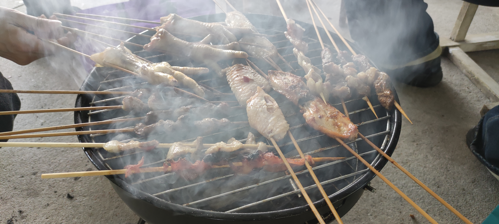

- [[露营]]（可能更多人在户外炭烤）
  id:: 62ee4dac-d882-4540-9457-16a6a5fc106e
-  [[20250405]]
- “不是很看好方形炭烤炉”
- 风险提示
	- 可以
	- 健康：炭烤食物含苯并芘等有害物质，真正的炭烤可能是你一生中最致癌的事件之一，而你一生中可能会得癌症
		- 炭烤令人难忘的风味主要来自烤肉油滴落到下方千余度的炭上产生并作为烟雾的一部分升腾附着到烤肉上的好吃的致癌物（如果炭温越高油盐越有害的话，那么也许越高级的炭越有害），想健康可以用烟熏液（可以喷雾）、烟熏盐等~~相当~~一定程度上代替
			- [炭烤和烤箱烤的区别是什么？只是烟熏味吗？](https://www.zhihu.com/question/65489199/answer/231953086)
	- 好吃：至于烤肉会不会不好吃，我想即便大部分原切肉没来得及腌制直接烤了味道不够重，调料也是够用的，其次还有多种食材兜底，牛排也可以先烤后煎或是直接煎；但不是所有人都喜欢炭烤的油脂烟熏味，乃至具体到部位
- 地点
  collapsed:: true
	- 不是你找的地点也可以确认一下
	- 普通室内厨房、阳台可能都不行，小米净烟机那样的尚不确定能否及时排烟，而且那么多油烟可能带来较大的清洁压力
	  id:: 67f0ebec-408a-418e-88f4-7fcac07f9ae0
	- 室外炭烤要看 ((678b0495-d45c-499b-874c-0897487b947f))
		- 要不要[[防晒]]、如何防晒
		- 温度
			- 别穿多了大汗淋漓，可能简单一件速干衣、皮肤衣就很够了
		- 湿度
			- 要不要保湿
		- 风力
			- 点炭、撒料等要不要挡风
			- 部分炭炉有上盖当挡风板的设计
		- 风向
			- 影响油烟运动方向、烤炉进气等
			- 是否可能影响他人，比如露营、运动、晾晒织物
			- 想象一个对风无感的钝感人，如果烤时没用什么滴油的部位没注意到烟飘的风向，或者对烟也比较钝感，之后突发奇想“鼓风”或 ((67f1360d-daae-4c12-ae80-145e027fb0c4)) 会不会正好在炭灰的下风口，然后就像 ((679add3e-44a6-4918-9486-b6a3288031b1)) 那样吃吃灰
	- 网友分享、卫星地图上看 ((67f1c0c6-6601-41bf-b740-2c4f4aa65956)) 够就不一定要带[[天幕]]啥的
	  id:: 67f1360e-62eb-4ce1-bb77-1e5cf6b87f3a
	  collapsed:: true
		- 根据树冠推测树荫
			- 树冠稀疏估计投影密度
			- 可以用微信、拼多多等扫一扫识别树种，结合卫星地图对应上
			  id:: 67f1bda1-fbae-459a-85ef-c8ef8a5f3994
				- 同地区可能树种比较同质化，就近识别的树种可能就是目的地的，不是也可能用于推测
			- 直径/冠幅对应高度
				- 一般宽高比不低于1
				- [江南常用园林绿化苗木品种及相应胸径、高度、冠幅一览规表 - 百度文库](https://wenku.baidu.com/view/b239554c316c1eb91a37f111f18583d049640f08)
			- 再结合“立竿见影”实测的影高比（相邻若干天变化不大）或结合太阳高度角、勾股定理等推测投影范围
			- 如果更近的树后还有树，通常能覆盖（部分或接近全部）更近的树的树冠覆盖不到的地方，除非比较光秃秃
		- 卫星地图上可能就拍到了树荫，并可能根据草地颜色大致判断拍摄季节
		  id:: 67f1c121-adf1-4b81-ba94-24b357623e5f
	- 是否是烧烤店、烧烤区，是否有炭烤炉、遮阳伞、桌椅凳等可以租（不一定有你需要的那么好），炭、食材、调料、饮料等可以买
	- 交通
		- 节假日沿线可能比较堵
	- 有“禁止烧烤”之类的牌子，可能也有骑电瓶车的保安，看他来了，几个人像点球大战游戏那样围上去顾左右而言他可能也没啥用
		- “灵活无烟”（比如快速转移烤制中的食材）可能并没有什么用
		- 如果附近有不是草坪的场所，或许保安能通融一些
- 至少0.5L水（洗手洗脸、灭炭，可能洗炭炉乃至灭火）
- ((67402acc-a104-4e41-a03c-5d5442ddb0e8))
- 餐巾纸、护手霜
- 厨房纸（吸表面肉汁、烤后现场擦炭炉）/旧毛巾（烤后现场擦炭炉），垃圾袋（装一次性烤签、现场开袋肉汁等）
- 烤炉
  collapsed:: true
	- 可以租也可以买
	- 估算烤炉产能
	  collapsed:: true
		- “参考炒锅直径”
		- 烤网面积
		- 食材（实际）占用面积
		- 食材密度（重量，不含烤签）
		- 食材营养（不含通过滴油等方式损失的，当然刷油也可以补回来一部分，简单点就不算了吧）
	- 苹果炉
	  collapsed:: true
		- 带上盖，设计合理时可盖盖焖烤而不熄灭
		- 尺寸
			- 外径37cm（15英寸；一小时内烤完也许最多供五人同时吃），内径34cm，深11cm
		- 风门
			- 在进气量上，下风门（可能——没试过）优于侧风门，若为侧风门，则炭两端应对准风门以增大空气与炭的实际接触效率
		- TODO ((679f0f50-9b2f-4ce7-a1da-7d735ec9b34c)) “拼烤炉”
		  id:: 67f10574-8a05-49ac-a854-e158c00af90f
			- 我家炒锅内径32cm，深9cm，略小了些，大概够三、四人同时吃
			- [我用废炒锅做了一个烤肉炉！还挺好用！_哔哩哔哩_bilibili](https://www.bilibili.com/video/BV1kGcweiEiQ/)
				- “我们这个”不破坏锅
			- 使用中还容易移动，如果炒锅带锅把
			- 搭锅边进气道
				- 锅盖开孔（如果要焖烤）
				- 烤网剪孔（如果烤网不架高）
			- 倒置点炭
				- 炭网下降（留出排废气空间；炭网或烤网要架高也能用——“喜欢啊对称”），夹在锅边
					- 一边可旋转，炭网可全程保持水平
						- 还可以有锅边导轨，锅转过来后烤网像（部分）抽屉那样“丝滑一下”——“疑似有点多此一举了”
						- 炭网侧面可以加一两圈围着（“小幅防呆”）
				- 铝箔隔热罩
					- 略微反射热量
					- ((67f0e3b6-b3b8-4b9d-86a3-c59a2132829d))
	- 烤炉保温性
	  collapsed:: true
		- 烤炉焖烧（“盖了帽的”，比如苹果炉）
	- 清洁难度
		- 防滴油到炉底
		  collapsed:: true
			- 炭网、尤其炉底（没多少炭将滴油以油烟的形式快速分散，所以都在底下集中烤）的油焦（可能——最近一次炉底烧过树叶，不太确定是否主要是树叶残留物难洗）是不太好洗的
				- 厨房油污清洁剂需要停留15-30分钟或更久，然后戴一次性手套用厨房纸巾等擦拭，否则会沾来沾去
			- “炭铺满”
			- TODO 炉底铝箔垫
			  id:: 67f0e3b6-b3b8-4b9d-86a3-c59a2132829d
				- 够大张的铝箔的直接垫，小张铝箔上翻边用 ((679add4e-226d-4157-a5c6-2d9fe3ce923b)) 等连接
				- “搜下拼多多”——“特氟龙不环保、没铝箔耐热、高温分解也有毒——没见放在炭下的演示，那么大概是不行”
					- ((67eb283e-056b-49f4-a414-04f4eea0675f))
		- 搪瓷的比不锈钢的好洗
		- 水槽能不能放得下
	- 烤炉温度显示
	- 观察
	  collapsed:: true
		- （我之前买的小苹果炉）侧风门盖焖烤5分钟后除靠近开口且纵向带孔的一根炭外基本都熄灭，侧风门不够通风
	- 及时清洁
	  collapsed:: true
		- 久放不洗，生霉（以烤网、炉底居多）后可能并不会难洗多少，但可能或多或少带来点创伤（我是唱着“红烧~~鸡~~翅膀我喜欢吃~”在淋浴间洗的）
		  collapsed:: true
			- [红烧鸡翅我喜欢吃_哔哩哔哩_bilibili](https://www.bilibili.com/video/BV1N64y1A7zg/)
		- 洗前戴好N95以上级别口罩、防毒面罩、护目镜，浴室花洒以上冲洗设备，朝外冲洗，之后用钢丝球以上工具擦洗
- 炭
  collapsed:: true
	- 品种
	  collapsed:: true
		- TODO 机制炭和乌冈炭哪个更省钱？
			- 购买成本
				- 同重量机制炭价格更低
			- 点燃成本
				- 时间
					- 乌冈炭装在炸篮里架在卡式炉上点燃约需10-20分钟
				- 液化丁烷气、丁烷喷枪
				- 污染
			- 烤制成本
				- 同重量机制炭较轻（？），可铺更大面积
				- （同重量？）乌冈炭燃烧时间更长、燃烧功率更大（？）
				- 污染
			- 重复使用成本
				- 哪种炭更容易散？
	- 挑选
		- 长度（最好不小于20cm，至少10cm，可以两根凑20cm）
		- 直径（不小于2cm，免得铺开要较多根甚至从烤网缝间漏下；人少为方便点炭可在2~3cm间）
		- 重量（人均200~300g，包括之前没烧完的剩炭）
	- 存放
	- 晒炭、烤炭（在烤箱里烤）
	- 形状和摆放匹配食材
	  collapsed:: true
		- 挑好了可以装在带盖塑料盒等较结实（）的密封容器里，或者在架炭网上用塑料袋等装起来，空间够可以放炭炉里
		- 赶时间没预先断炭（可以在“上一次”断炭）于是带了长炭的可以找大石头敲断
- 食材
  collapsed:: true
	- 估算消耗量
	- 确定人数、什么人，吃多少、吃什么食材（禁忌、牙口），根据经验或 ((67402ac7-d585-492b-800f-4d93eeeecbd1))
	- 食材称重（第一轮先根据“供给侧实际情况”发起），计算请客/送礼金额和人均，约（风险提示、“不太好吃”等风险的控制方案、问还想吃啥带啥、接送等），解冻等处理
	- 炭烤食材
		- 附近的烧烤店也可以购，但我不确定食材温度，按理说应该至少有当天（或那几天，如果不太卫生）冷藏的，是否有室温的就不太确定是否能保证
		- 少点零食、预置菜（火腿肠、骨肉相连等），多点更健康且可能更便宜的自制食材（“让吃的人一起参与”）
		- 年轻气盛的炭烤食材不应以“菇菇鸡”为主
		- 素菜推荐5毫米以上的土豆片，烤鼓包即可，还可在鼓包里加料
		- 秋刀鱼、多春鱼、大西洋鲭鱼等补充Omega-3
		- 部位和厚度一般甚于等级
			- ==牛肋条（还有牛舌）==性价比较高，烤制节奏适中，有点嚼劲适合牙口良好者
		- 食材：片（做熟不切片就等吧）、串、条（香肠等）、排（一厘米以上，可能配合煎），大块、整只
			- 肉品选择
				- 性价比还是冰鲜和牛或潮汕地区热鲜牛肉
				- 没吃的可能带回来，除非高温几小时肉臭了
		- [为什么日式烤肉不便宜，你知道如何完美地吃日式烤肉吗？ - 知乎](https://www.zhihu.com/question/67721052/answer/1365070815)（“这个是比较贵的”）
		- 备料
			- 在外面备料或许新鲜些，但意味着多少需要点水洗刀具、砧板、手套或手（水或许是够的，但排水可能是更大的问题），或者装袋带回来再洗，如果觉得不够方便，不妨先备好
				- 用陶瓷刀切的土豆片、藕片等的表面也不易氧化变黑
			- ((679adce8-972d-4fc8-884b-7bf36226e120))
			- ((67eb281d-46d9-40be-860b-9308663b6247))
			- ((66ebea5c-cc04-4494-83d4-cf1e19f53782))
			- ((67eb281d-b0b6-4865-b23c-fce46eee3e5a))
				- 腌料（相对普通部位）：蜂蜜、照烧汁、香油
			- 烤签
				- 烤串必用烤签（“真的吗？我不信！”），烤签不一定做成烤串（比如两根或更多根烤签穿较大的食材）
				- 红柳枝烤签对较小的食材可能偏大
				- 非金属烤签可以放入微波炉烤
				- 为避免烤签尖戳穿保温袋、背包等，放在任何戳不穿的食品级容器内（硬塑料盒、水果硬纸盒、竹篓、无镂空塑料垃圾桶、花瓶等，不是食品级可以套保鲜膜或铺铝箔等），或者用烤签套（可用各种最外端不太软的材料自制），——或者用烤签筒装烤签，现场穿烤串——或者干脆别吃烤串了
				- 防烤签柄沾油
				  collapsed:: true
					- “你有没有看过那个过手流油的故事？”
					- 生产、储存、运输等环节防沾油
						- 烤签柄与食材隔离
						- 烤签柄朝上
					- TODO 延长夹柄
					  id:: 67f117de-589a-4ac6-8bb9-61fbba0c0df3
						- 挡油护手
						  id:: 67f22da5-6f4c-42f1-b442-a0cdde9717d0
							- 烤制时脂肪细胞炸开可能也是烤签柄沾油的途径
							- “大护手剑”
							- ---
							- 柚皮、瓜皮、椰壳
							  id:: 67f23be9-9688-43a2-9d48-fd35c1be64b4
							- ((67f21e9b-c02d-47d9-8f9d-1599262cc99f))
						- 掌根夹柄（“如果是夹的”）
						- ((67b6f846-9b35-4ebd-b5b6-53be8e101051))
					- ((67f21e9b-d9a7-4ed9-8ae0-a4ad6bfcb592)) 不夹烤签柄
			- ((678a4de4-4508-4f03-b353-f75fbf3504f1))
			  collapsed:: true
				- 大格钢丝网竖放烤签
				- 双线夹挂 ((67f22da5-6f4c-42f1-b442-a0cdde9717d0))
				- ((67f117de-589a-4ac6-8bb9-61fbba0c0df3))
				- ---
				- 防虫
					- ((6311e5d1-6abf-47f9-a9da-c111792d975d))
			- ((67f24de5-5fbf-407d-a8f9-14db31bf3cae))
				- 泡沫箱
					- 当天吃常温或热食的话主要用于解冻和回温
			- 预热
				- 在室内比较容易用烤箱/微波炉
				- 烤炉上方
	- 干调料
	  collapsed:: true
		- 原装调料罐孔径可能偏大，直接倒食材上容易不均匀和过量，进而导致钠等物质摄入超标
		- 餐盘底油水多了会让调味粉沾不上食材
		- 可以用成品也可以现磨（胡椒比较适合现磨），现磨用重力感应开关的电动研磨瓶比较方便
		- 常用的没多少钠的调料可以加点盐，如果原本没有或不够
		- 孜然粉
		- 辣椒粉
		- 撒料罐
	- 湿调料
	  collapsed:: true
		- 油
			- 没什么油的食材比如大多数素菜，如果为了好吃，是需要的
		- 烧烤酱
	- 餐垫
	  id:: 67f23cfa-755b-4041-b36e-9076427f387e
		- 上翻边的厚铝箔
		  id:: 67f23ced-542e-43cc-a612-a62499bdb2d3
- [美式BBQ点火的技巧 – 木炭和烟熏木的选择 | 酒肉大观](https://www.dalianbbq.com/intro/2019/09/09/start-fire/)
- ---
- 分区
  collapsed:: true
	- 食材（多层架；干草）、调味、进食、卫生
- 点炭
  collapsed:: true
	- 断炭（如果偏长）
	- ((67f1360d-daae-4c12-ae80-145e027fb0c4))
	- 点炭容器（最好与烤肉容器分开，方便清洁）
		- 干净（或没用过的，油炸过的手洗很可能洗不干净会有异味）直径18cm以上的炸篮（18cm的建议一次最多400g炭）
			- id:: 661a38b7-1a3f-4642-8a09-9cdab69bb103
			  >炭没点着？通风不够？
			  >可以把炭放炸篮之类的点炭筐里用气炉点 #宁波绯雪
		- 点炭桶（柴火炉加个可能上拱增大受热面积的炭架的自然下鼓风结构，对户外需要鼓风的木头等燃料有较大提升，对燃气提升较小）
			- TODO 配合或接入排风做到真正“无烟”
	- 炭网首先要够放足量炭，即便时间充裕、一开始可以慢点烤，也建议最多两次点完所有炭
	- 之前炭烤用下来的剩炭虽然大概也能铺开这么多面积，但体积小了还是影响总热功率，很可能不够热导致食材烤半天都不熟，用的话要么剩炭量得大些，要么得接着烧第二锅炭（赶时间的话有两套点炭设备一起点当然更好）
	- 不要翻
	- 点了几分钟的炭一般不会再迸几下，但查看点炭情况建议戴眼镜
	- 上火（喷枪：小口径和大口径）
		- 用喷枪从上方加热可能迸炭粒，可能迸到眼睛，非要试的话建议面部全部防护再试
		- 喷枪一般不要用，效率一般不高，还可能急剧加大迸炭概率（喷火区域一小片炭像是坦克的反应装甲一样飞出，眼睛里）
	- 点炭炉和点炭桶：炭夹（），卡式炉/户外炉头、气罐、炸篮（点炭时、灭炭后装炭）、乌冈炭、喷枪（加速点炭、“补火”）
		- 不是适合十人以上的超大烤炉的话，比烤肉夹长的炭夹基本上没用，夹肉时比一次性竹筷长的烤肉夹也可以不用，顶多也就手上多点烟熏味（可能要注意用公筷）
	- 没厨房秤至少带两罐气，避免正好少带罐气，然后正好缺那几分钟气就爽了
		- >完了，barbecue了！
	- 点的炭不够烤制的话，可与没点的炭单边接触（如果一开始就要较高的火力密度；对于较长的烤制时间，也可能便于有序替换）或间隔混合
	- 下火（燃气灶、卡式炉、户外气炉、电加热点炭盘等）
	- 15~20分钟后关火，将点燃的炭取出，剩下不确定有没点着的可以和一部分确定点着的炭继续放点炭桶加热，或是继续开火加热
		- 表层白色炭灰可能轻微降低燃烧效率，闲得没事可以吹着玩玩，注意风向
	- 车上、车内点炭
		- 如果比较赶时间，或者被保安赶出来要换地方继续烤
		- 车辆需要注意防火，电池、油箱啥的在哪，车内饰是否“万条垂下绿丝绦”，灭火器有没有（点炭时可以放一个水基灭火器在旁边）
		- 固定点炭机构，比如像是用什么拉紧器、炉架钢丝绳、钢夹固定，然后点炭器用两轮车上的棘轮带固定
		- 车内开窗通风
	- 不推荐新手使用的提前点炭省时方式：提前点着的炭可以放在放在后备箱里的稳固、通风的隔热箱内，后备箱开一点问题不大，后面车窗开着就行，或者放副驾驶
- 架炉
  collapsed:: true
	- 不要让水泥（比如水泥地、水泥砖）接触较多热量（如果手或其他部位放地上因偏烫不能稍长时间停留，可能就算较多了，而且可能破坏植被和土壤；点炭时隔着卡式炉、炭烤炉支脚展开应该都没事），否则可能炸裂伤人伤物
- 摆炭
  collapsed:: true
	- 炭炉放于草地上或不够高时需要展开脚架
	- 单向炭网、烤网、食材的方向
	  collapsed:: true
		- 陶盆烤炉等常用的双向交叉网较细密，不易使上方食材掉落，但清洗相对困难，而苹果炉等常用的单向网则易掉落，食材甚至可能直接连掉两层掉到炭网下，因此单向炭网要与炭垂直而非平行，不然炭烧细了就从间隙掉下去了，食材亦然
		- 首先从食材方向看，如果横着排竖条食材，那么炭也一样，于是烤网和炭网的钢丝都横着即可——（也许）一般情况下，人们更习惯先横着摆
	- 为高效燃烧，（较粗的）炭与炭可间隔半厘米左右，可以将炭与炭网平行（”灵活运用“）
	- 剩下的炭在点炭桶里备着
- 刷油
  collapsed:: true
	- ((679adce8-173d-4479-836b-abdec00658ce)) 没有刷子好用
	- ((67f117de-589a-4ac6-8bb9-61fbba0c0df3))
		- 避免刷油时手沾烟
	- TODO 用带油脂烤串给新烤串刷油
	  id:: 67f21cd1-ea50-4788-bce4-8eed2e8ce69b
	  collapsed:: true
		- ((67f106dc-0725-4410-849b-a8561ea80c6c))
			- 两烤串之间上部
				- ((67eb9b08-2c79-4b9a-84a3-808897dd7e46))
			- 限位
			- 刷后下降开烤
- 烤肉夹
  id:: 67f21e9b-d9a7-4ed9-8ae0-a4ad6bfcb592
  collapsed:: true
	- 不讲究“看着脏就是脏”还可以夹烤网、炭网、炭等
	- kds烤肉夹
- 防烟
	- 油滴不接触火焰或火源的炭烤
	  id:: 67d41eb9-8e14-4957-a252-e1e51cf86f5b
		- “没有味儿！”
		- 炭放食材斜下方，不在食材正下方
			- 如此这般形状的炭烤炉
				- [淄博市领导胆子真肥，敢推露天炭火烧烤，不怕人间烟火抹黑环保么_哔哩哔哩_bilibili](https://www.bilibili.com/video/BV1DL411Y7FM)
				  id:: 679adcc0-eeed-4c98-8111-537cfd2db326
	- 排烟（主要是室内用，但不推荐室内用）
	  collapsed:: true
		- ((65f78b91-757f-430b-8996-d7ae97e6cb42))
			- ((67f0ebec-408a-418e-88f4-7fcac07f9ae0))
			- 排烟不够强劲的话（如果煎牛排排烟不够强劲，那炭烤必然不够），房间内水等物品都会被炭烤物质污染，不开窗畅饮西北风的话味道几天都散不去
				- 此外，也可能污染 ((670d40ca-2fce-4132-92cd-666ecd82d119)) 没装好的邻居家
				- 从窗边排烟也可能影响楼上，就是气密也可能有碍观瞻乃至触发火警（“楼下着了？”——很多时候是烟感器自动报警到物业）
		- ((67402ab2-1e8a-4d0a-bc30-8a0c6be79901))
		- TODO 烧烤油烟过滤
		  id:: 6767ad82-0b45-4511-b214-55c67da24144
	- P95以上口罩、防毒面具
- 铝箔片（临时桌布/餐垫）
- 烤前
	- 餐具
		- 叶（“天然美观，一次性免洗还轻，大多还可参与烹饪”）
		  id:: 67f21e9b-c02d-47d9-8f9d-1599262cc99f
			- 紫苏叶/生菜/柠檬叶/箬叶
			- 良姜叶/毛竹笋壳/槲树叶/柊叶（适合整叶作餐盘）
			- 朴叶（可垫在烧热石板上浸湿垫酱或直接烤肉）/蒲扇叶（“挺拉风”）/荷叶（“鲜叶夏季限定”；除了干叶不够鲜绿外，还可惜整叶不完全平，但也可在中间放点什么）/芭蕉叶（一般会裁成长方形，够大）
			- [搞事情！粽叶到底有多少种？究竟哪种最正宗？粽馅到底可以包些啥？是咸的好吃还是甜的好吃？](https://zhuanlan.zhihu.com/p/27166372)
			  id:: 64631f0c-9092-4eeb-9b26-050dfb11f4e8
			- [涨姿势！15种常见，可用来包粽的叶子！](https://zhuanlan.zhihu.com/p/151334084)
- ((66db8abb-050c-4368-a0bf-4035b0528285))
- 自动翻面
  collapsed:: true
	- ((67b53e37-eed4-430d-84c3-944d9169e7ac))
	- TODO 烤签横向均匀旋转
	  id:: 67f106dc-0725-4410-849b-a8561ea80c6c
		- ~~“竖的烤串机当然看过，不会还有人没看过吧？”——“现在是横串了，听懂掌声！”~~
		- 去烤网（“最关键的一步”）
		- 防互相阻碍（“顶针”）
			- [顶真（修辞格之一）_百度百科](https://baike.baidu.com/item/%E9%A1%B6%E7%9C%9F/939291)
			- ((67f12912-7438-4e57-aeed-cd2d4607780a))
		- 转速调整
		- （“搜下拼多多”——）“更多形状、布局”
		- ---
		- 远烤签尾端
			- 烤签炉壁限位夹
			  id:: 67f11380-cc1c-43e2-802a-e2edcd045c25
				- “缺口式照门”、“台球架杆器”
				- 夹是夹在炉壁上
			- ~~中心~~烤面限位环、阶梯圆台
				- 如果（食材、炭等的位置）全部或大多比较~~均匀、对称~~有规律，就（可以）不用个别调整距离
				- （“但是还得固定”）那么是个阶梯圆台，或者 ((67f11380-cc1c-43e2-802a-e2edcd045c25)) 能卡住
				  id:: 67f11ac5-05dc-4199-943b-94289619a54d
		- 近烤签尾端
			- 烤签旋转卡
			  id:: 67f116b6-601f-4e16-ac01-da05e2e9fc34
				- 与 ((67f11380-cc1c-43e2-802a-e2edcd045c25)) 连接可能简单些
				- 固定部
					- 下压烤签卡住
						- 旋转卡直接转，烤签间接转
						- “啪！细竹签断喽！”
				- 旋转部
					- 最廉价的部分原理演示
						- 拿个（最好是圆的）筷子部分悬空放桌边，用 ((675f9e97-39e7-40dc-b794-6896d3b080a3)) 绕一圈，下压拉动，快看，筷子转起来啦！
							- 绕个带子，再多绕一根筷子，恭喜你发明了传送带、扶梯扶手！
					- ((67f117de-589a-4ac6-8bb9-61fbba0c0df3))
					- 旋转动力
						- ((67eb2831-41e0-47a2-a19c-78927018b584))
							- “漏壶”
							- “撸个水先”（指使用水袋上上下下餐前、餐中健身，我们必须想象马上要吃到烤肉的西西弗斯是幸福的）
								- ((66a41ac0-4d2e-4973-b301-38b43d46adf3))
								- ((67eb281d-df34-491a-935e-6f198d953dad))
							- ---
							- 浮球
						- 电扇？
						- ((67f12872-40c4-455c-9718-1a74e9c9897c))
							- ((67f12847-aa78-4582-bc1e-a93148bc712d))
					- 多直径转轴（多转速）
						- ((67f11ac5-05dc-4199-943b-94289619a54d))
						- “变速”——“就是，怎么移动到其他转轴？”
							- >要啥自行车？！
								- “链条、飞轮组、拨链器等疑似还是有点太复杂了”
							- 斜面
							- 弹簧凸点（讲究一个双向； ((67f12a3a-b66a-4f0c-9b7a-da03b1c8c672)) 上也有）
							- ---
							- ((67b53e37-eed4-430d-84c3-944d9169e7ac))
					- “未必是（圆柱面那样的）转轴”
						- “还可能像是——训练用固定滚轮——梅花桩”
							- [SPACECURL 3D核心肌群测试与训练系统_报价/价格/性能参数/图, 斯倍库尔SPACECURL_生物器材网](https://www.bio-equip.com/show1equip.asp)
								- >顺带搜到的
								  （“条件真好”）想起来了，有的游乐园也有自由度较高的旋转游乐设施，当时我在上面喊了几声事后觉得尬的（“真好，不然不一定想得起来”）
							- [固定滚轮训练对大学生平衡能力的影响_俞杰 - 道客巴巴](https://www.doc88.com/p-26416026427106.html)
							- [梅花桩（中国传统武术拳法）_百度百科](https://baike.baidu.com/item/%E6%A2%85%E8%8A%B1%E6%A1%A9/3176263)
					- “只要不拉断，随便怎么掰扯”
		- 总之就是两/三个支点，一个/组旋转部，三轴限位
		- ((67eb282b-cf31-4f0f-8c3d-3beb0fd0bea8))
- 烤中
	- 燃料：乌冈炭、氯化钙颗粒（除湿，减少炸炭？）、脉鲜长气罐、大口径喷枪（可灼肉）、打火机、存炭桶（燃气灶点好带着；或者放车后座科学开窗）
	- 烤肉
	  collapsed:: true
		- 较厚的食材
			- 肋条等较厚的要烤到全熟可以多翻面、哪边出“血水”了就翻面，要想不过焦可以离开炭正上方
		- 焖烤（盖盖烤）
			- 上风门和下风门配合（侧风门进气效率较下风门低，调节意义不大），如需较深度的烟熏效果，则上风门排烟量要降低，但炭也可能就灭了，只能说烟熏可以是一阶段的终结
		- 烤串
		  collapsed:: true
			- 适用食材范围
				- 任何能切成块、加热后不会大部分变成液体的食物
					- 牛排、香肠、边角碎肉、咸蛋黄、熟蛋黄
				- 部分含筋膜、不适合所有人嚼的食物，如牛肋条
				- “赶时间”，太厚的切薄
			- 什锦烤串：平衡肥瘦、荤素搭配、降低成本
			- 肉块大小
				- 切大块偏厚了小火10分钟不完全熟
			- 烤签
				- 红柳枝、香茅
				- 35cm长了，一般用不着，太长了是要击剑吗？
				- 卡扣、海绵等防尖刺戳坏保温容器等
				- 固定
					- 烤签支架
					- 烤签直接架在炸篮沿不能全角度自然固定，甚至由于重心问题只会转到一面需要手持调整
						- 应当能手动固定或电动旋转
					- 烤签架在炸篮沿可不用烤网，肉片肉排可穿或架在两三充当临时烤网的烤签上
		- 炭（“你想做乌冈炭吗？”）
			- 双层炭烤或上层电/气烤
	- 安防
	  collapsed:: true
		- 别人乱飞的无人机（不一定是因卫星或朝阳群众看到冒烟而赶来的警方无人机，警方无人机也许会闪光甚至喊话，而且为什么警察不亲自拍照过来讲道理呢？所以很可能是同样到户外来但是有普通以上好奇心的无人机飞手，我第三次户外炭烤时第一次遇到听声音起身看了眼之后沉稳地转身蹲下继续烤，也不管它从这颗杨柳绕过枝条从侧面拍我，总之我不能像台湾金门守军小哥哥那样啊——如果读者有手段且想搞手段的可以遮挡面部等、对着无人机警告、激光干扰、电磁迫降，甚至迫降后直接顺走开溜，但飞手可能有图传录像或周围群众证词，所以一般没必要，如果迫降了你可以等飞手过来，实在等不来就先帮飞手保管，当然有把握跑得快跑得久还会控位也可以主动追风筝找飞手讲道理，这样还顺带锻炼了）
	- 烟熏：干果木
	- 防粘：和牛油（生熟皆可）等在热起来的烤网/煎锅上刷刷
	- 熟度判断：烤肉剪刀（弯的，更适合斜着剪）、针式温度计
- 烤后
	- 调料
		- 咸：凯尔特灰盐
		- 甜：俄罗斯椴树蜜
		- 酸甜：青梅酱、巴萨米克醋
		- 辣：山葵、绿柚子胡椒酱（辣椒、香橙皮，中低辣，带点果皮清香）、沙茶酱（花生、蒜、蚝油、辣椒，低辣，香鲜）、贡布黑胡椒、甜辣酱、椒盐
		- 鲜甜：照烧酱
		- 油脂：芝麻油（甘露牌）、半盐黄油
	- 注意烫口（可能把口腔上皮烫下来，即便你觉得还不是很烫，然后吃有刺激性的调料就“爽”了）
	- 碳水
		- 水果（可以提前剥好、切好，省得带刀和洗手）、土豆（用工具可以切成不同形状）、米饭（家里煮的，以后可能做成寿司）
	- 包料：紫苏
- 喷厨房重油污清洁剂后15-30分钟后直接用一次性厨房纸巾等擦拭，不然继续沾来沾去
- 人员
	- “都不是一个人烤着吃吧？”
	- 外地朋友至少要准备气罐、烤肉剪刀，可能还有刀（可能修剪部分部位）、砧板等
- 确定人员和场所（可能很多地方不允许烧烤），透明软屏风暂时没用上（天幕杆有两根；屏风可能没用，多穿点），问了水果饮料这些要不要带、要不要冰，米饭要不要带等，一般从瘦吃到肥
- 烤法
  collapsed:: true
	- 分区烧烤：根据不同食材的快烤慢烤（比如大肉块、可能放到烤网之下的整个红薯）需求进行炭的功率分区（炭顶端与烤网的距离、炭与炭的疏密）
	- 食材铺放间距：兼顾食材铺放密度和食材受热总面积
		- 不要贴太紧，确保受热（辐射）面积足够，而不被其他食材遮挡（比如食材靠上的边缘处）——“让翻面多一些从容”
	- 烤制节奏（“不要让炭火闲下来！”）
	- 烤串刷油与撒料
		- 如果烤串本身含有肥肉块等在烧烤中会渗出油脂的食材，那么可以让两手烤串重叠互相刷（“抱团取暖”），撒到烤串一部分表面的调味料也可以互相刷，以此减少浪费、可能落到炭火中产生的空气污染物乃至刷植物油对烤串造成风味遮盖损失
	- 明火处理
	- 除表面炭灰
	  id:: 67f1360d-daae-4c12-ae80-145e027fb0c4
		- 大概降低功率
		- （一般是这批全部或大致烤好后）连食材取出烤网放到 ((67f23cfa-755b-4041-b36e-9076427f387e)) ，其他人离开，手扇、电扇吹灰
- 炭烤寿司
  id:: 67f241c9-6681-42a9-8233-c1f21ed9c838
	- 烤串及其他烤物放入已铺好基材的寿司海苔，卷上后抽走烤签
- 灭炭
	- 没烧完的炭可重复使用
	- ---
	- 闷
		- 盖盖，关闭风门等待5分钟以上——风门开关把手如果没有隔热，大概需要 ((65db1962-3ee4-4e8d-b56e-8c02a329c2f1))
		- 开放式炭炉或盖子坏了、丢了的炭炉可以盖铝箔
			- ((67f0e3b6-b3b8-4b9d-86a3-c59a2132829d))
		- 也可以埋在较干燥、少黏性杂质的沙里
	- 浇水、过水（快速泡水）
		- 比闷快，之后运输或丢弃也更可靠
		- 每升水至少能灭2000g炭
		- 浇水、灭炭时的白汽也会把表面炭灰吹上来，先抖抖能减少一部分，或者浸到水里
	- 倒炭
		- 有时因为烤得慢吃得慢等拖延而要赶时间（比如约了下一场要润）要快速灭炭，关风门盖盖可能不够快或无法完全熄灭、水又忘了带或正好不够浇了，周边又没沙子，土也没铲子挖或不敢乱挖公地——那么一般可以把炭直接倒了，当然，如果能用铝箔袋之类的装起来大概比直接倒空地上好些——注意倒炭不要靠近植被，不然可能突然妖风一吹把鼓了把风烧得旺起来的炭滚到草地上引发火灾，无把握宁可倒马路上也不要倒小路上
	- 去炭灰
		- 如果烤炉上盖不能牢固锁定，为避免运输时炭灰、剩炭等污染包装、影响后续清理，建议灭炭后至少去一下炭灰
		- 倒炭
			- 把剩炭倒到点炭炸篮里，倒炭时也能去除较多炭灰
		- 吹炭
			- 直接用嘴吹的话注意及时抬头后退（注意后面别碰到什么），避免炭灰扑脸
- 清洁
  collapsed:: true
	- 炭灰（后续：木炭粉/灰作画等）
	- （炉内剩余）炭灰尽量不影响美观且稳定地散在绿地上（如绿化带的灌木丛）
		- 如果讲究LNT，炭灰也可以带走，但油烟和二氧化碳、一氧化碳等也算是trace吧？
- ---
- 现代主义烹调第二卷“烧烤”
- 实验
	- 点炭和备炭加热火锅/煎锅？
		- 是否有点低性价比？
	- 炭放煎锅与油脂接触烟熏代替整体炭烤？
	- 烤速统计
- 口诀
	- 先有炉，再放炭，气罐喷枪点点炭，盖盖通风炭烧红，室温肉肉烤起来
		- ((671a39f7-7177-44a6-84d5-8013873fbcf6))
	- 肉肉什么时候熟？除了针式温度计，剪下一角就知道
- 黄油
- [[第二次户外炭烤]]（以前不太赶时间时的记录）