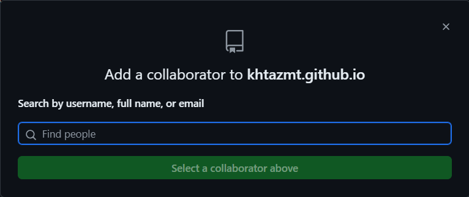

- 本网站（khtazmt.github.io）是基于GitHub公开仓库[GitHub - khtazmt/khtazmt.github.io](https://github.com/khtazmt/khtazmt.github.io)的 ((658fc4ca-21a3-49e7-a6b8-6277d16e0062)) ，其中的笔记（即你在浏览器看到的网页）等内容主要使用[[Logseq]]制作
  id:: 66ade37e-72cf-4363-ad92-6fb748cbcc8d
  collapsed:: true
	- 本站日志格式与顺序
	  id:: 680a3159-582e-4340-ad7b-563a942bb8ae
	  collapsed:: true
		- 最上方是不公开内容（现在不搞了，浪费时间），但是，没有完全不公开，其中，下部显示可能有的不公开页面
		- 把可能想做的事（可能同时是“想让大家帮我做的事”）打上TODO并分享到日志上部（一般按想到的时间顺序排列，日期按写入logseq的日期，上同，除了其下部的不公开页面）
		- “写得差不多可以让大家看一下了”的内容（大致按推荐度、优先度降序排列，下同）
		- 推荐给大家的（外部来源的）内容
		- 加了当天日志块链接的块，可能是标记、“动态”等
	- 我爱指指点点，看到能软荐硬评的就可能以相对很不多的内容和提升空间宽广的成功率给出建议，对于我觉得比较公开的集体和个人打上标签，可能会引用到日志，此外读者也可以手动查看（是否更新）或通过 ((678369b1-f629-42a5-8f71-4b4daf46d227)) 之类比较自动的方式查看
	- “Logseq笔记真的很难看吗？”
	  collapsed:: true
		- ((679adda9-ebf8-4b4d-9c2d-73b7a5906ac0))
		- 淡蓝色的是页面链接，“下划线”是块引用（链接），都是可以点击跳转的（当然在导出的图片或截图里没法这么做）；左侧栏、右侧栏都可以展开/折叠
		  id:: 674bf6a8-90b4-4afd-a051-4b7eea809c21
		- 很多内容按若干种顺序排过，比如流程、时间（适龄）、空间、普及度、价格、难度（包括判断是否需要的难度）、我的了解程度、我的推荐程度等
		- 没测试过等完成度低的部分可能用分割线（“---”）隔开（也可能是把资料放到后面），而非加“TODO”
		  collapsed:: true
			- 看起来可能也有点“星际视力”内味，赶时间先“态势感知”意思相近的“大而化之”放一起简单排排，“过会儿”再多用点脑“微操”
				- [星际玩家是什么梗【梗指南】_哔哩哔哩_bilibili](https://www.bilibili.com/video/BV1Py4y1H74R)
		- 不同页面乃至同一页面内不同块的“写作风格”可能有较大差异（“看不出来拉倒”），因为这里有我若干年的笔记（一年以上没大变动的最少占1/3，其中很多意味着“触目惊心的巨大失败”；org格式的大概100%是，当时看org、emacs啥的功能更多就用了，现在就很后悔，未来还不清楚），**有些**（“赶时间、 ((679b8a48-f04c-4390-83c0-700a34856e06)) 懂吧？”）我看到了会写上“早期作品”
			- 你看时有部分时间像我一样感到“无所谓”等是对的、赶时间的，虽然你我此处的“部分时间”不一定能在具体内容上对齐——你也参考我的方式写的话，或许能多些
			- 很多地方没写完，确实是“断头路”
		- 双引号内的可视作我的（一部分）“假设场景”或“思维链”
		- 部分个人或组织在此有专属标签及页面
			- “侵删”
			- {{embed ((65e5e1a2-0f07-4e18-86e9-33fa88ec04d8))}}
			- 其中也有一些建议（比如建议尝试什么）
		- ((6629f549-f80e-41bd-972f-0d54ee89c1fb)) 等更直观的呈现和陈列形式做起来时间成本较大——“读者可以借此做点想象训练”
			- [《你有这么高速运转的机械进入中国》《黄龙江一派全都带蓝牙》听的CPU都烟！！！_哔哩哔哩_bilibili](https://www.bilibili.com/video/BV1Pt421a7rw)
		- ((67a46496-86e8-411b-9525-6e8bb9d3afbd))
- “别把为师说出来”协议 [[20251122]]
  collapsed:: true
	- 本网站（包括链接、标题、内容）及相关信息，仅可使用比较不公开的方式传播（建议参考 ((67402aac-65b2-4b3b-8d67-0356818dcaf8)) ，实在赶时间也可以用各种私聊；第一次最多给个完整链接就算传好了，以后随便取“那个/他网站/博客/（笔记）库”之类的名字即可），即禁止使用网络平台、群聊、个性签名等比较一目了然的公开方式传播——我本人和得到我各种授权的例外
		- 正常人可能不会热衷满天下传播ta感觉有劲到有点爆的东西，可能更不会热衷满天下传播ta不以为然的史，这种事情我好像没啥印象，但我只想说懂的都懂，不懂的我也不多说了，说了你也不明白，不如不说，细细品吧，你也别来问我怎么回事，这里面利益牵扯太大了，说了对你我都没有好处，你就当不知道就行了，其余的我只能说这里水很深，牵扯到很多东西，详细情况你们很难找到的，网上大部分都删干净了，所以我说懂的都懂，不懂也没办法。
	- ---
	- 《我放弃了CC BY-NC-SA 4.0协议》（塑封）
	- TODO “教你如何洗稿！”
		- ((691989cf-9035-4fb9-8c45-a5bb2554e386))
- ((670d40f3-496d-4a58-b303-1e7d353f8033))
- ((65c589f9-342d-42c5-818c-f363a95b3847))
- [[激烈的斗争]]
- 我的部分联系方式
  id:: 67402aac-65b2-4b3b-8d67-0356818dcaf8
  collapsed:: true
	- 我的PGP公钥 [[20251129]]
		- ((692a773f-68a3-4814-a311-dedb6957a10b))
		  id:: 692a7900-5b6b-448a-9bc4-757379fbd0df
		- ((692c186b-a4ee-4ab6-a416-8f2347c6da31))
		- -----BEGIN PGP PUBLIC KEY BLOCK-----
		  
		  xsBNBGkqd0QBCADNccU/65zAIOJMi9bCwNkc47Fji3NNigxULo/g9PXPBwXLPKmA
		  eM8fFl3wVOF3ZuR0PfKPX6fEg9NuascctvUbrWJaxSb33CTGiOD+hTk68XY0M9qn
		  fG5ADko+RnWdkA53W/I3bBFFZviO48Hfxz3plmKWjDGNWJfG0PZPuxuzM95m6C8S
		  KL6qFrx4SA2XcSEpOCyCVVkhpv1jw8i9HoH7Y4XRqhQlYSQpgYx2c46Taoty1V97
		  ftbnFAWhFo0mLgB95XEP5Xmj51vjKRguSUb26WoMfBoSL+kdcIO+CgsL9fPGdFWd
		  lcNZSVtj4qeI4lZcOv1TUcKrlLsiUfynx1fPABEBAAHNHW5vYm9keSA8bm9ib2R5
		  QGVtYWlsLmFkZHJlc3M+wsB6BBMBCgAkBQJpKndEAhsvAwsJBwMVCggCHgECF4AD
		  FgIBAhkBBQkAAAAAAAoJEMdgSM1lirwcZHYIAJvcSxxCviakK6NtiIu3khJlOj6C
		  /RtMuEJfrm4Dix+6g2hMZv8oi+duUPpSUOruuWo//3QzpA4HCCZv4nE1LzHHXWEG
		  xy2sxamYakxaiXLMLiVoZ9K74NJlNYgJx0uW69/Et47yS1d/z/nvo4hAjP0RgJkr
		  q3zItqH4ypOBaJIzk5j9Ewh48HMT9+A+WpWUr6nEAgN1JFBaifGm23A+bQdTRKWP
		  3X9rkd/RpKMlhwITexwLgrz7CqcuM1bfdq4i5iF2r5F8MxeXD5Puisv1Fy0CJ3ye
		  Y3mM/fbQaKdcevOYdCpvPzAOJ5ThCi4dCG7jtzikzG6itLuZHQJhYQa6UV/OwE0E
		  aSp3RAEIANj744IxtsVrtbX6b2xGgnzjk3TYgiJ+1lk+ml37s8d/sZOUaGSD7Vud
		  xJkCj3hmozijO+WwgnYVhrUXWnPwzZGXUFlRut0MESHPBKrv0hRIpc2X2kOUarKM
		  nnP4CbAXfzMkk29kligkM+IrkcbZ0gUIVr9XBc/DtJ93sxUnNT0ClMbzAd67+dnx
		  MsGXWW333urLzfJm/lLskkG9Xjw5hGm1Qtb9+jkszt1u2oB5QgXJIKlCyyUmlnpO
		  0A60/OYlyZvavM0plpZMNTHQx+RmG1kiAzSVIUag71K91HG6ug1KXsfw65nk5Z7d
		  0odBFdzSJVXEy5viJkAaTc4xYuF/QKcAEQEAAcLBhAQYAQoADwUCaSp3RAUJAAAA
		  AAIbLgEpCRDHYEjNZYq8HMBdIAQZAQoABgUCaSp3RAAKCRCxvhhyn4koE0ULB/41
		  wPOQbE/s/+jLatXzt1PS5DrKG/CzMkaC/nk8cEx6Pw8TPZ/RvZPWAzN5YuSfb7PR
		  ud/Sm6OO27tpqSJU0JBmWc2TB1t76pVt7PF5nuxYjvZKOstY35Wbi4qeA4or2xpu
		  AOOYsSElR92wPc4lokqcStZ3n8iotHDsJwef32BrkFJeABYvDWVHBfIcti8Pwg1A
		  4seBz4/ynE9o102DZjNLFBcHr8ONVg1WPKj+xy//NNkxt6uGOPgjmulJHv4j3zuf
		  Av1EwQHZ2WrRrHVe+s2CyxnOm6suiCzJ5T1CPTx0SybH1GW7BcOrfqbg8jodtVjy
		  HCywWjlbEuOAAc+i/Anu5AoIAJL/IsJc32oRxzbXgeN5jGN5au2FemlEIt6ch60F
		  sms+xvobqR4FQyCgBg78pizpWhXGJ9s7MMV01J91Ok5kDIpfa2YAfGtDmS1cr+97
		  ihhn0aI4yPfILrJ9t454OzRzafj9YQquarumE8ISVrhAVc15o1d6saKh1qviwtF7
		  aRoB49CsZNVJyWUIMEVuuTxHoras72PZeYowCNDEb7bCXxsOvqYRk9z9vo8qm6IN
		  tDRZxadkHf18uQ+jaDkhwSkTEXGnRQU8vRPtVogG01AIW+3LTBDoUa0Yhp7guiem
		  475nDbrxECZ3YBsBLbZFvU2pvuQE62JgY4JUr5r86liZV7fOwE0EaSp3RAEIAOZX
		  T/qt8gNxKtzdYEDDRa/UEoaza7UlVbg/EF9E5tb57elYO2Cehph9Q0jnqoDNYubG
		  pSOQ88+LIyilReL3J6trWhdIm6PkCbHqyFoCmIgCia/3JLvKxh1TOegEGYmKC9V5
		  IVAmlMCMGz1i51RcfFM/aDu+HOSLK696eMWTzvryVgirt4b6SxuXikwu82LmFP+O
		  zTaWg15bW2Ed/w3YRyUb0cruEz6q4SJTGX8lAfwHvf/OXfrEDDTaB4mzJSY7qxbm
		  J02aPOA976/PW4uRqnUcwdX6LLzh17DGckXuLvF6hDAFwAhWvBxyuo/TGV7YKfIt
		  uenpEMQVrMqFjWpUHb0AEQEAAcLBhAQYAQoADwUCaSp3RAUJAAAAAAIbLgEpCRDH
		  YEjNZYq8HMBdIAQZAQoABgUCaSp3RAAKCRBqRJ2gnmBSpRI/CAChJf3ef9LJjtv3
		  UFUxHxpw80Z6fQz8uvP3vmB6sygbpmyXlUm99vdgOvDW12BSo69txRYG+9A6ZOmj
		  ymV5ghfekw+nVFKivRAW+hj4lXAUmI+8ImmQRBpn8Ngx3rwuEtOqSBE5uQeNY3Op
		  Wx+roJDQB9YGHVIl06UF+sIOHHXR8wXqeKZnAUxhu0j5+0ZOThM6VPDUSy6t8zzZ
		  oQ/7GQmWeIo60tqNocvv4Q2eMjctRcxCLDeENlhKkBtVnHW4d5xi2cT/QJ3bVnlj
		  C4xgT+ci8gIxBKd6GmdYGDXwiCLsrFoQiJcvC8XzxV3NhM8Xg8gvFo3ejWIJvvCZ
		  zT71G6nBNjgH/395N9K48GswVBFooK7rUvDRyGGYEEPi196Py/dNz2MaAU0yIx7H
		  X7DxThT5/+QaizZPxRxAjegeLc7muRuCZniecnLWWsO01ywojv3isV/j5u94XWc7
		  3qX7rwiymVZqFsGcJYj9fABycNtaumsEZlvi4Mdh64Ww7mDjBvI04Hx5Q36BAlo7
		  3zSwq2pfLTwWNX1xjzC7Dv2cuIwRaT/1xnA2kAJdYrktfTs03vy9yyYmhnY13oWT
		  PAwjnKI6PEj8aNI0EOFrdkFIpXtaD9Uil2PzCTK/pKiInmDzy+i8N+8nXsEaOwV3
		  kSQA38CVD/H2WR7xk6zkvk21XguTEGfdNVI=
		  =cqPs
		  -----END PGP PUBLIC KEY BLOCK-----
	- 可公开内容
		- ((691e9319-288b-461b-bcd8-345ae20bfc04))
			- https://xoyondo.com/mb/90qp7agut21dwf7 [[20251129]]
			  id:: 6922631e-3599-43e8-b674-09f0129aa2ba
	- ((67402aac-b37d-44cf-b8c5-86612c20c604))
	- ((679adda8-7225-428d-93d2-109a2ae482bb))
	  collapsed:: true
		- 我的邮箱
			- soundsnormal@pissmail.com [[20251127]]
		- 代注册邮箱
			- ((6928118a-21f9-47c6-87ff-d21c20f0cc96))
				- alienonearth@dmc.chat [[20251128]]
					- N字神人密码
			- 建议尽快修改密码
			- 邮箱里可能有一个文本
	- 线下会晤
	  id:: 691fa561-cf23-4f62-a2d1-386b4dde2e09
	  collapsed:: true
		- ~~“先尊带动后尊”~~
		- 必选
		  collapsed:: true
			- （首次会面）（带）电脑（可电池供电）演示、讨论（包括不公开的外库，数据已备份）
				- ((66335bea-765e-49a8-ad56-87c4569e6389))
			- 讨论问题及解决方案
		- 可选
		  collapsed:: true
			- 共享食材或成菜以及厨具等
			  id:: 69270154-bbcb-4955-95fe-cf2131cb0ce3
			  collapsed:: true
				- ((69198a03-a329-4de4-8bbc-9379cf421424))
					- 我在叮咚买菜买的菜，欢迎助我尽快赏味
					  id:: 692ede68-c64a-4f01-a06d-cb1342d68a18
						- ((6922631e-3599-43e8-b674-09f0129aa2ba)) 同步更新
				- ((6927022d-a9a9-40f0-a10d-7536e3e82449))
			- （借用、）基础教学
			  collapsed:: true
				- ((6928f773-f06e-432a-961d-480b18525665))
					- 白天可用于[[观鸟]]等
				- ((691989e3-6989-4a87-937d-2eff5b2899c6))
					- ((6929205d-2038-44eb-9949-2187e8e2aac2))
				- ((6311e5d5-e4da-460b-9e55-b5056e581366))
			- [[可转让]]
			- ---
			- ((6926816c-e75f-473b-a795-af3a855c1375)) 等临时隔离（如果带了过来且需要临时隔离，我可能表演一套 ((69266af2-30f6-43d9-99cb-2f37354ce4ff)) ）
			- 保密联系方式
			- 来我家
			  collapsed:: true
				- 我爸妈另外租了我爸单位附近的房子过冬，周五晚上可能回来吃几顿，周日可能上午、中午就会出门，我妈工作日也可能因为附近有晚上学吉他等活动而回来
				  id:: 691989e3-0c02-4936-8741-f5545d11067b
					- 当然他们不一定介意像我一样的正人君子造访（
					- 他们一回来非要搞这搞那，我的生活一有反差就得给他们上规矩，说他们不一定避着客
				- 没礼貌来指指点点我家风水（“吃饭的地方正对灶头不好”~~——“那咋了，我造反！”~~）、我的个人状况啥的我不管老小都赶出去的——“你们有什么资格XX？！”
				- 看 ((690c00f6-66ba-4d9d-bc52-84a0333881c1))
- 参与本网站创作
  id:: 691989f0-12ff-4dab-b4e5-f8de93d8a815
  collapsed:: true
	- 创作没啥难度，比较简单的是像我一样“纯提需求”（“但可能重复”）
	  collapsed:: true
		- 我觉得可以“商用”的话也会建议你保密，同时问你能不能把它记到我不公开的外库
	- [[TODO]]
	- [GitHub - khtazmt/khtazmt.github.io](https://github.com/khtazmt/khtazmt.github.io)
	  id:: 67402aac-838e-4294-a36b-4cefcae7dba7
	  collapsed:: true
		- 可fork，然后在 ((659c981c-4681-4798-87dc-9cddea73f56e)) clone到本地，选择contribute to原仓库，然后用[[Logseq]]（推荐，不然很多块引用之类的格式内容看不到）或 ((65ab10fa-9bb1-4c11-8112-1d5744559b36)) 按需增改删，commit提交，然后我可能会部分或全部点击采纳（然后可能再手工改一下）或复制并修改后采纳
		  id:: 67402aac-b37d-44cf-b8c5-86612c20c604
			- 可能增比删更容易，但我可能大改大拆大挪，最后不排除原内容删完的可能
			- ((670d1208-1017-4db4-a8f9-f3618c2bd00b))
		- 还可以添加collaborator，更不确定怎么用
			- 
			  id:: 668684e6-93fc-4cf9-8730-335820822e30
				- “兄弟，把你的github昵称给我”
	- 实时协作
	  collapsed:: true
		- 视频协作
			- ~~“没事，唱支歌儿给你听！”~~
			- 屏蔽部分页面
				- 视频上传延迟
		- TODO 更少信息协作
		  id:: 692ab788-d696-4aec-ade2-5c3073a63aca
			- 获取协作者当前停留页、块名称（Logseq窗口标题）
			- 屏蔽部分名称
			- 实时上传前者
			- 协作界面
			- 匹配提醒
				- 关键字匹配
				- 图谱相近页面提醒
			- 语音
			- 光标等位置定位
				- 覆盖图层
					- “相同显示条件即可”
					- 显示相邻字
- Dear international friends，
  collapsed:: true
	- （You can use translate tools and meme search for information you don't understand）
		- ((690847be-365e-40fc-8464-abc835aae946))
	- There are Chinese puns, idioms and different countries' jokes manywhere，but of course I'm not a racist or something like that，in fact，I feel lucky that I was born and live in China for me to design and carry out my socialism plan and I feel great honor and hope to carry it to you——I know how to sense joy and collect many kinds of intelligence that is probably useful no matter how amusing to me，maybe many people tend to take joy from FAKE NEWS which they deem TRUTH to get through hard times，but you can see for yourselves that I can create from different kinds of materials no matter how many percent of TRUTH in them，for sure they will determine their overall  potency in the future
	- Maybe China is much more confident for its different kinds of challenges，maybe it's just that different places have different REGULATIONS，so take care if you gonna carry something in this blog out in otherwhere
	- ---
	- You may all know that “Made In China” is cheap，but how much？
		- ((68fd800f-6a27-4e20-b5cb-cfdc1cebf643))
		- [1 CNY to USD - Chinese Yuan Renminbi to US Dollars Exchange Rate](https://www.xe.com/currencyconverter/convert/)
	- Maybe we can cooperate
		- ((69007c89-0984-4caf-a14c-548af7e0d5f0))
- ---
- 更多页面可点左侧栏“图谱视角”或“全部页面”（按更新日期排序也是缩小“我最近可能关注过的页面”的方法），也可直接搜索关键字
  id:: 678a4dfd-e145-4f07-be1a-2cb01b11c4cf
- 本页（及相关内容）可能慢更
  collapsed:: true
	- 当你有（“说多不多说少不少”）300个笔记时，或许（“积累期”）每天你能编辑其中50个，但你大概并不会用6天把这300个笔记都轮一遍，一段时期总有一段时期的“重心”，然后你就有了忘得差不多的“早期作品”——“人们经常忽视他们遭逢的‘信息量’，高估自己的‘记忆力’，低估自己‘重复、无效劳动’的潜力”
	  id:: 678b8873-24af-464a-8f5d-c8b66d200a7a
	- id:: 66db8b0c-debf-4132-a6af-00783e9ce727
	  #+BEGIN_QUOTE
	  图难于其易，为大于其细；天下难事，必作于易；天下大事，必作于细。——《道德经》
	  #+END_QUOTE
	- >骐骥一跃，不能十步；驽马十驾，功在不舍。——《荀子·劝学》
	- >博观而约取，厚积而薄发。——苏轼