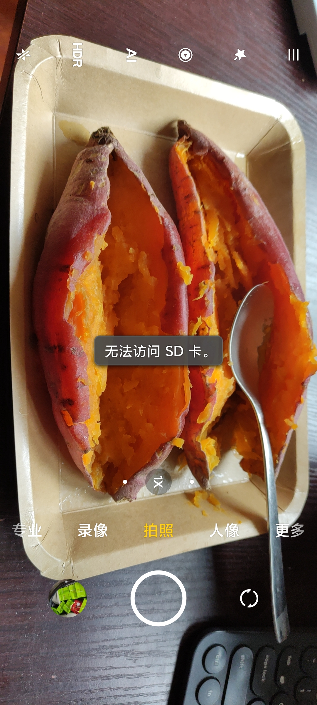

- 微波炉烤红薯
	- 
	- 微波炉“烤红薯”模式按每档150g分了四档，每天烤一到两次，每次烤约600-750g，家人们也要吃
	- 大点的红薯（可能超过200g的就算）用对应总重量的微波炉“烤红薯”模式可能一次烤不透，靠外的部分可能不熟，然后需要继续烤，浪费时间、电费乃至营养——对此，可以在加热结束前5-10分钟（可以用电子计时器或手机计时提醒）暂停取出（注意防烫），把红薯下部出糖蜜处转上来，用勺子切开，外翻，然后放回继续加热
		- TODO 切开外翻后还可放上黄油继续烤
- 烤箱烤红薯（所需时间较长）：[【【糯唧唧的烤红薯】糖油四溢皮肉分离外糯里嫩吸溜着吃！的做法步骤图】春殿w_下厨房](https://www.xiachufang.com/recipe/104191592/)
	- 一段加热结束后，用隔热手套将烤盘取出放在烤箱顶上，立刻关门减少烤箱内热量损失，然后给红薯翻面，一只手可能要脱下不够灵活的隔热手套给红薯翻面，另一只手可能要按住点与红薯有点粘的铝箔
	- TODO 烤制中失水变形滚动
		- 凹凸烤盘
	- >烤好后马上从烤箱中拿出来，不要闷在里面，否则红薯外皮会因为蒸汽变软，就没有外焦里嫩的效果了
	- [为什么烤红薯大多是200~230℃，查了下美拉德焦糖反应是在110~180℃呀，如何最大化甜度？ - 知乎](https://www.zhihu.com/question/471417108)
	  id:: 65dea11a-18f5-42c6-b521-52129ef88e25
- 有苦味的部分扔掉不要食用
- [市面上常见的12种红薯测评 - 知乎](https://zhuanlan.zhihu.com/p/419532088)
	- id:: 65de9fc8-d169-454b-b324-882092023c2f
	  >每一种红薯都有一个糖化的过程，如果拿到手很干也不甜，不妨放几天，会发现口感变好~
- TODO 黄油烤红薯（去皮？）
- [看一次笑一次， - 哔哩哔哩](https://www.bilibili.com/read/cv57819/)
  id:: 65deae87-2955-45a5-879a-a1f52affed90