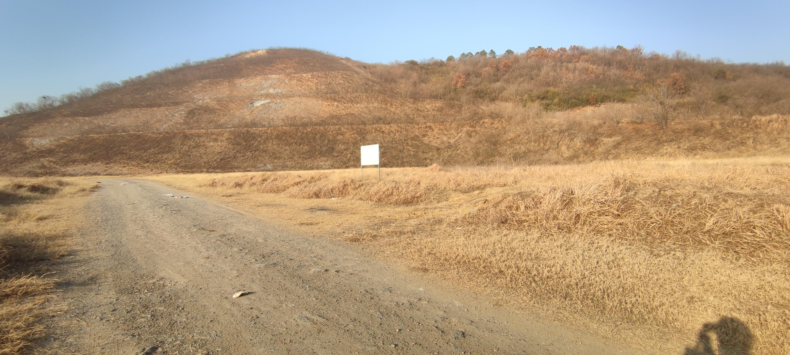
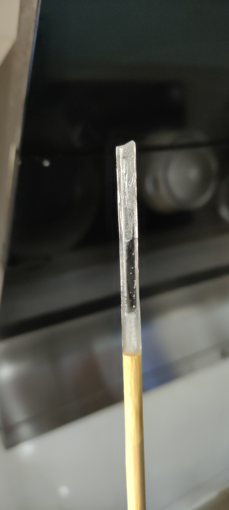

- [[绘画]]
  id:: 67cede84-d9c1-4b3a-b933-0190960d2b10
- 阿基米德圆规
  id:: 67ab4b1b-918d-495c-a41e-10b9e85083cd
	- [不可思议的“阿基米德圆规”，每颗球都走直线！你知道原理吗？_哔哩哔哩_bilibili](https://www.bilibili.com/video/BV1Ng4y1179S)
- “可食用玩具”
  id:: 67402ac6-ff78-4d1e-ac73-b32a870649ef
	- ((678b04ab-d9ca-4686-a9f3-b48d04404b9f))
	- ((67303aa5-6610-40fc-8160-50387674b19d))
- ((673ec846-6415-4aae-9850-7882079b4ee7))
  id:: 679adcca-384e-4bcc-821f-10e87b5886af
- 积木
  id:: 67c2ceeb-1f73-4f73-94e5-8f1278d6bd1e
	- 乐高积木
		- ((67cf91e9-87e1-4147-983a-ed7c0fac84d3))
	- ((67e9f6f4-7140-4cc4-a499-6ad3cd4c3ade))
- 多米诺骨牌
  id:: 67cf9178-8395-4292-b3f9-80e3ec66c436
	- [人体多米诺，场面极度沙雕_哔哩哔哩_bilibili](https://www.bilibili.com/video/BV1o4411c7zz/)
	  id:: 67cf90ed-6afd-473f-ad44-e043ef802c77
	- 复位
		- [这不比全自动功德机好玩？_哔哩哔哩_bilibili](https://www.bilibili.com/video/BV1q24y1q7Lt/)
		  id:: 67cf91e9-87e1-4147-983a-ed7c0fac84d3
- 远程玩具
  id:: 66335be4-7f61-4c0b-832e-7fc580f5c595
	- 投掷（“难以掷信”）
	  id:: 679add39-5e29-4d78-bb8e-17906721ae0e
	  collapsed:: true
		- 投掷运动（纸飞机、泡沫回旋飞机、扔纸团/垃圾/鸡蛋/诺基亚/三星、掼炮、飞镖、飞刀、飞牌、沙包、打雪仗、水气球、粘靶球、打水漂、打卡、保龄球、套圈、飞盘、手里剑、回旋镖、标枪、实心球、铁饼、飞石索、链球、手球、擦炮/燃烧瓶/手雷、投篮）
		- [保安用矿泉水瓶打掉马蜂窝，有0.5秒空气静止了。_哔哩哔哩_bilibili](https://www.bilibili.com/video/BV1z24y1N7tE)
		- 扔衣物
			- 枕头大战
			  id:: 66a76430-b3ea-41bd-99f5-9383096e508a
		- [[垃圾袋]]
			- 扔到垃圾桶里——“最日常的一集”
		- 石头
			- 击中物体
				- ((678b04a5-4e20-437a-818e-324876bf76b5))
				- 记录
					-  [[20250117]]
						- 农村砾石路蛮多石子石头的
						- 可能15-20米，可能扔了有半小时以上，击中“警示牌”（含支撑杆；上面像是有bb弹压缩空气枪或气枪的弹坑，“警”字上的最多，“示”上的最少）4次，经常往左偏（想省力身体就不够后仰和右旋，投掷末段就会偏），其次就是不够高从“警示牌”下部穿过
			- 打水漂
			- 铁饼（古希腊罗马运动，但当时用的是扁圆石块）
		- 纸飞机
		  id:: 67eb2843-5f74-4d58-98f1-0367a86e2833
			- [世界上最优雅的纸飞机，Zephyr曲翼纸飞机_哔哩哔哩_bilibili](https://www.bilibili.com/video/BV1xy4y1b7RC/)
			- [【纸飞机】全网首发！地表最强百米级距离机苏may4公布！_哔哩哔哩_bilibili](https://www.bilibili.com/video/BV1rbz6YXEkJ/)
		- ((670610f4-4f81-4b3a-b878-e7fbb7e82f6a))
		- 标枪
		- 投矛器
			- 固定
		- 飞饼
		- 回旋镖
		- 飞盘
		  id:: 670d40d6-18fe-4e48-8952-f1dd059b32ac
		  collapsed:: true
			- [新潮出圈的飞盘，为何能成为都市青年的“乌托邦”？_澎湃号·湃客_澎湃新闻-The Paper](https://www.thepaper.cn/newsDetail_forward_18149011)
			- “青春版高尔夫”
			- 旋转投掷低速轻飞行器（对抗性的弱化、低反应需求与弱运动基础的大众普及，实体运动的资本新宠；运动规则对暴力的预防，空间容纳和无网拦等阻隔，更安全统一（男女混合）的足球场体育课；运动民族主义与运动资本主义妥协，冠军来自群众基础，人少踢不过就扔，场地限制少、受众面广，在专用场地上则能在整体上降本利用原有足球场）
			- 活动肩部，延缓中年僵化——“通背拳”
			- 飞盘媛（其实整体上是少数；资本选美的开放场地运动化）
			  id:: 64631f0c-2973-4219-b842-cf0b3e7fee63
			- 大约10米内传着玩玩青少年版就挺合适，10岁以上应该都可以玩
			- 可以和别人家的边牧等玩
			- 有的公园里草地稍大可以玩玩飞盘
	- 球类
	  collapsed:: true
		- 杀伤球
			- 雪球
			  id:: 67402ab4-f291-4eee-97f9-e6677c11fc58
		- 进球（“赢球”）
		  collapsed:: true
			- 迷宫球
			  id:: 66dba0ae-4bbe-4f70-8398-fe8edb032e2e
			- ---
			- 保龄球
			- 冰壶
			- 台球
			- 门球
			- 高尔夫球
			  id:: 67d27058-757c-47b5-b584-7b61eefd24cf
				- ((67fe82ff-b9d0-4029-9c42-b9ca3e69b2e2))
				- 高尔夫球童
				  id:: 67d009d0-8f5a-4d70-ab4e-04845f6ff4a8
					- [揭秘高尔夫行业“球童”这个职业的真相 - 知乎](https://zhuanlan.zhihu.com/p/570237344)
			- ---
			- 水球
			- 冰球
				- [北京室外冰场的平行空间，是连接1991和2001的神奇时空入口](https://new.qq.com/omn/20210219/20210219A04LCD00.html)
			- 橄榄球
			- 足球
			  id:: a1d8be49-a949-40c9-b41f-ac1d9de87ed8
				- “更多足球”
					- ((668ce77a-758e-409b-83b7-b640e203d535))
					- ((65d9feda-f198-4a75-b00b-ef0dc182e1f8))
				- ((664d9dd6-5f57-42b1-83b7-aa7031f03527))
				- [江苏沛县“村界杯”再度开赛，这次还能成网红吗？_哔哩哔哩_bilibili](https://www.bilibili.com/video/BV1fg4y1Y7Zy)
				- 中国足球
					- [范志毅：“中国足球脸都不要了！”](https://www.bilibili.com/video/BV1yx411L73B)
					  id:: a6efa660-72c0-4f6e-937b-f649e786d096
					- [万字长文揭露中国足球现状：国足还远没到谷底！2019旧文已预见今日结果！](https://mp.weixin.qq.com/s/4jwJaepPEQ4hIVC0XZRV6w)
					- 足球青训
					  id:: 67b132b1-7dde-4e7e-9fbd-55cc0cf6c229
					  collapsed:: true
						- 
			- 篮球
				- [篮球风云WaveBall的个人空间-篮球风云WaveBall个人主页-哔哩哔哩视频](https://space.bilibili.com/335564074)
			- 手球
			- 板球
			- 棒球
		- 接（不到）球（“输球”）
		  collapsed:: true
			- 粘靶抛接球
			  id:: 67cede84-d43d-4047-895c-efe252f14c5d
			- 挥拍
			  id:: 67fe0956-2669-4902-86d9-1838a6b32033
			  collapsed:: true
				- “不拍人体也是拍”
				- [Associations of specific types of sports and exercise with all-cause and cardiovascular-disease mortality: a cohort study of 80 306 British adults | British Journal of Sports Medicine](https://bjsm.bmj.com/content/51/10/812)
				  id:: 67fdbc16-0d6c-4bbc-abce-7f9184dc1715
					- [Swimming, aerobics, racquet sports slash risk of death | CNN](https://edition.cnn.com/2016/11/30/health/swimming-aerobics-racquet-sports-reduce-death-risk/index.html)
					- [排名第一的长寿运动竟是它！研究发现：这几种运动延寿效果好，你练对了吗？](https://mp.weixin.qq.com/s/sEktEoI1-A_231cZGanYqg)
					  id:: 67bd169c-fcc6-4bcf-97a9-0c763b905b16
						- “简中笑传之传错（出）版（社）”（看了几个网页全都说是柳叶刀，实际是BMJ）
				- ((66f4ac7f-846d-4a78-9f45-df4bf35d92e0))
				- ((6800e553-d969-4e1a-9e43-cecada76d31a))
				  id:: 6800e571-27d8-4073-901f-4ea07fc43ce7
				- ---
				- [打羽毛球和打网球有什么区别？ - 知乎](https://www.zhihu.com/question/296830891)
				- 羽毛球
				  id:: 67cede84-e9d8-44b2-8e83-a2700c7aae4c
					- ((679add8c-89dc-40f4-87e6-193d34de0306))
					- [Play Badminton Forever: A Systematic Review of Health Benefits - PMC](https://pmc.ncbi.nlm.nih.gov/articles/PMC9330062/)
					  id:: 67fdb8fb-1c99-4b9d-8ab2-3230acb46193
					  collapsed:: true
						- id:: 67fdc02f-0d7d-48e2-b674-a1161da85dfc
						  >缺乏活动的负面影响已得到广泛研究，结果表明，缺乏活动会导致学业成绩较差  [6 ]；心理健康状况较差，例如压力和焦虑程度较高  [7 , 8 , 9 , 10 , 11 ]；身体健康与冠心病风险增加相关  [12 , 13 ]；运动技能发展下降  [14 , 15 ]；以及失去改善社会关系的机会  [16 ]，等等。
						- id:: 67fe09cb-29aa-4fdd-ade6-f9a6df68c9c7
						  >Schnohr 等人  [42 ] 在一项针对青少年、成年和老年男女的研究中，比较了参与各种运动对预期寿命的影响。这些作者得出结论，与久坐不动的人相比，羽毛球运动员的预期寿命高出 6.2 年，是预期寿命获益第二大的运动项目（网球 9.7 年，羽毛球 6.2 年，足球 4.7 年，骑自行车 3.7 年，游泳 3.4 年等）。
							- [Sci-Hub | Various Leisure-Time Physical Activities Associated With Widely Divergent Life Expectancies:The Copenhagen City Heart Study. Mayo Clinic Proceedings | 10.1016/j.mayocp.2018.06.025](https://www.sci-hub.ru/10.1016/j.mayocp.2018.06.025)
							  id:: 67fe77c9-e4ea-4c7f-9c97-86b62c9029d4
								- [Mayo Clin Proc：爱打网球多活十年！科学家发现社交频繁的运动更有益于延长寿命-MedSci.cn](https://www.medsci.cn/article/show_article.do?id=ec9415655651)
								- >与久坐不动人群相比，不同运动项目的多变量调整预期寿命增长如下：网球，9.7 年；羽毛球，6.2 年；足球，4.7 年；骑自行车，3.7 年；游泳，3.4 年；慢跑，3.2 年；健美操，3.1 年；健身俱乐部活动，1.5 年。
									- “这个健身俱乐部活动大概指的是健身房相关器械活动，这下很难一丝一毫不想嘲讽了”
										- >Regarding health club activities, we were not able to separate the time spent on aerobic exercise or anaerobic exercise because these activities include treadmill, elliptical, stair-climber, stationary bikes, weightlifting, and so forth.
								- 调整后每周平均：网球104分钟，羽毛球93分钟
								- 论文讨论可以看看
									- 社会支持比运动强度更有性价比
									- 间歇性大肌群、全身爆发运动和短重复间歇高强度运动比持续性（中等强度）运动好
									- 跑步者之中，轻度跑步者（每周2.5h以下，同时每周不超过三次）死亡率最低
									- id:: 67fe82ff-b9d0-4029-9c42-b9ca3e69b2e2
									  >Other studies show that golf is another sport that is associated with robust health ben-
									  efits.  One very large observational study found that playing golf on a regular basis improved life expectancy by about 5 years.
						- id:: 67fe6bd8-84a2-4fbd-8696-21a06761c1e6
						  >关于社交效益，Patterson 等人  [45 ] 发现，羽毛球运动提高了女性与朋友相处和建立新关系的积极性。
							- [Sci-Hub | The impact of badminton on health markers in untrained females. Journal of Sports Sciences, 35(11), 1098–1106 | 10.1080/02640414.2016.1210819](https://www.sci-hub.ru/10.1080/02640414.2016.1210819)
								- >The badminton programme was effective at increasing participants’ social engagement motives (i.e., affiliation) to exercise when compared with both the running group and the control group. This suggests that participants in the badminton programme increased their motivation to exercise to spend time with friends, they enjoyed the social aspects of playing badminton and had fun being active with friends and making new friends. This provides partial evidence that badminton can increase an individual’s social engagement motives to exercise and social engagement could be considered as a potential reason for people to join badminton groups, particularly for females. This has been shown in previous research on motives to exercise in adults (Allender et al., 2006), who concluded that enjoyment and social networks offered by sport and physical activity are clearly importantmotivators for many different groups of people aged between 18 and 50 years. Participating in exercise for social reasons is considered an intrinsic motive and is associated with better long-term adherence and behaviour change.
					- [BWF Research Projects – BWF Development](https://development.bwfbadminton.com/sport-science/bwf-research/bwf-research-projects)
					- [The Effect of Badminton in Myopia Progression Among Children in Yogyakarta | Ophthalmologica Indonesiana](https://ophthalmologica-indonesiana.com/index.php/journal/article/view/174)
					- [踢足球还是打羽毛球更有锻炼效果？ - 知乎](https://www.zhihu.com/question/376262839)
					- ---
					- [羽毛球场_百度百科](https://baike.baidu.com/item/%E7%BE%BD%E6%AF%9B%E7%90%83%E5%9C%BA/4977741)
					- 羽毛球拍捡球夹
					- ---
					- [羽毛球快速提高技巧，绝对干货（建议收藏细看）](https://zhuanlan.zhihu.com/p/106296639)
					- [职业羽毛球运动员假动作赏析！论动作一致性的重要！_哔哩哔哩_bilibili](https://www.bilibili.com/video/BV1fdKHeiEtR/)
					- ---
					- [不会物理都不敢打羽毛球（完整版）_哔哩哔哩_bilibili](https://www.bilibili.com/video/BV1Rs411D7pf)
					- [全寝公开赛！_哔哩哔哩_bilibili](https://www.bilibili.com/video/BV1Bf421B7ux)
					- ---
					- ((67fe095a-26e9-4577-8965-82bc7b2e46e8))
					- “为什么羽毛球是~~LSP~~两性交友友好运动？”
					  id:: 67fe0956-c51c-4d3a-913e-948974253bc6
						- 运动量不太小
							- 首先比较延年益寿，你好我好大家好
								- “朋友们，我们不仅不应感到羞愧，还必须为自己感到自豪！因为帮助人们养成健康的运动习惯可以说是功德无量！”
								- ((67ff5520-66a0-4e7a-8092-086d7165fbba))
							- 相比玩绝大多数联机电子游戏，运动量更大，运动模式更健康，能看到人，且比一般不开的摄像头看得更可靠（“瞧！碧螺！”）、立体、全面
							- 比 ((6706103a-07bf-441f-bb46-d144c378ac8a)) 异性参与率更高，且比较有锻炼效果而少符号 ((678a4de0-f33a-4106-b977-3b87b79d5897)) 、规训
							- 比 ((67aed69c-1631-41d7-b207-6a060d49122e)) 等健康，比如照明
							- 比骑摩托车、开车门槛低得多，比骑摩托车飙车、炫技安全得多，整体上运动量也大得多
						- 随便看看
							- 相向而非跑步、自行车、徒步那样的同向，可以大大方方看正面（看脸分析假动作等也可以有道理），且比自行车的自行车、场地限制小，而跑步、平地徒步手挽手需要本来关系就比较好
							- 游泳可能裸露更多，但也因此相对不易邀请，场地费用高，野泳更不易邀请，技术要求高，游时看得不太清楚，泳镜、泳帽遮挡，泳衣的风格可能还不如陆上日常的
							- 有垂直位移，尤其是进阶后还有跳跃，而且可以看~~抖胸抖屌~~“身体弹性”、“衣品”（比如是否“自我悦纳”）~~，这些还可以有技巧地主动触发~~
								- 比足球、篮球等通常激烈运动的~~女性~~异性（“我是懂一点相对论的”）参与率（可以）更高，入门简单，场地普及率更高，人数较少，场地较小、不那么疲于奔命，人与人的距离也会自动调节、相对稳定
							- 可以不区分性别，也可以混双，打赢了有奖励，打输了有惩罚，还可以笼络其他人（“最照顾兄弟、我带你们打的一集”）
								- ((67fe6bd8-84a2-4fbd-8696-21a06761c1e6))
							- 比乒乓球少台面遮挡，看得更全面，且入门容易，反应时间没那么紧张
							- 比网球靠得更近，看得更清楚，而且力量偏小者的参与率也（可以）更高，且球不好滚、弹不远，纯手工捡球省力些
							- 更全面的高频互动
							- 入门简单≠能坚持（跟你玩），整体上更易筛选
				- 网球
				  id:: 67cede84-baa4-4f0d-9ba5-d6c8eb1586ec
					- ((67fe09cb-29aa-4fdd-ade6-f9a6df68c9c7))
					- ((67ff6d7e-1794-47ae-87df-04ce995bb082))
					- 网球的运动模式相对羽毛球更募集、更均衡、更长程？
					- ---
					- [【网球链】自制各种网球训练神器,妈妈再也不用担心我打不好网球了_哔哩哔哩_bilibili](https://www.bilibili.com/video/BV1XK4y1o71Q)
					- [居然接不到球…网球时速这么快吗？_哔哩哔哩_bilibili](https://www.bilibili.com/video/BV1CFSvYeEKT/)
					  id:: 67ff60ed-4ede-4646-80c6-f63db8d172aa
					- [你会用通背拳打网球吗？？？_哔哩哔哩_bilibili](https://www.bilibili.com/video/BV1LU421Z7UD/)
					  id:: 67ff99d1-d2fe-4eb0-8268-f27b0c13f100
					- ---
					- [网球场地_百度百科](https://baike.baidu.com/item/%E7%BD%91%E7%90%83%E5%9C%BA%E5%9C%B0/5520069)
					- 网球拍
						- [[奥运网球热]一个视频搞定选网球拍！如何选？选哪个？手把手教我看谁还学不会。_哔哩哔哩_bilibili](https://www.bilibili.com/video/BV1LBiKeZEJQ/)
					- 网球捡球滚筐
					- 网球单人训练器
					- ---
					- “为什么网球也是、甚至更是？”
						- ((67fe0956-c51c-4d3a-913e-948974253bc6))
						- 球网更低更少遮挡上身
						- >网球裙 look 比羽毛球 look 好看多了——评论区
							- ((67ff60ed-4ede-4646-80c6-f63db8d172aa))
							- [「网球裙」是怎么演变到如今这么短的？_哔哩哔哩_bilibili](https://www.bilibili.com/video/BV1eW42197Kp/)
						- 成品球场更大比例是露天球场（可能最主要与风力对球速的影响有关），有自然光、自然风等，环境对近视控制更有帮助，所以不戴眼镜时看得更清楚，另外，室外自然光亮度更高，比室内电灯的显色指数也更高，看起来会更饱满鲜艳
						- 网球与足球相比，总预期寿命增加的空间密度是4倍（按足球场105×68米，网球场36.6×18.3米，不考虑多个球场间的间隔计算），加上时间后的时空密度是5.08倍
							- ((67fe77c9-e4ea-4c7f-9c97-86b62c9029d4))
				- 软式网球
					- [Comparing sports vision among three groups of soft tennis adolescent athletes: Normal vision, refractive errors with and without correction - PMC](https://pmc.ncbi.nlm.nih.gov/articles/PMC4705707/)
				- 乒乓球
					- [无-乒乓之恋（Alex Liu remix）](http://music.163.com/song?id=1322025282)
					- [马龙张继科得分到底喊什么?气势满分!真不是cao](https://www.163.com/sports/article/BU8RHN5T00050I18.html)
					- ---
					- 乒乓球桌下供球筒
					- 乒乓球捡球筐
				- 壁球
					- [小众运动项目科普—壁球篇_哔哩哔哩_bilibili](https://www.bilibili.com/video/BV1Pj411z7sA/)
				- 匹克球
					- [羽毛球场上“打网球”，“乒乓”桌前“踢足球”？这两种运动在厦走红_腾讯新闻](https://news.qq.com/rain/a/20231220A0340O00)
				- ((67d27058-757c-47b5-b584-7b61eefd24cf))
				- ---
				- 便携球网、球界
				  id:: 67fe0956-4fea-468f-8756-0da93e5d8728
				  collapsed:: true
					- 便携球网
					  id:: 67fe35a8-b4df-4fd4-a83e-c45931f8252b
					- TODO 绳挂球网
					  id:: 67fdce6e-cd21-4724-bd5e-a8792c2adc58
						- 高挂、绑树等
							- 不影响行人、车辆等通过
						- 绳上两点下垂
						- 减少网飘动
							- 水气球、石头、水具等
						- ((67cede84-baa4-4f0d-9ba5-d6c8eb1586ec)) 外界网应该也可以挂
					- 便携球界
						- ((67bfddc2-1137-425c-ac59-f69b8e83ffd4)) 、 ((67fb92b2-c405-4a64-b4ba-498ac13e69c8)) 量下
						- 步行估计
						- ---
						- 使用现有图案
						- 水具
						- 反光尺、绳拿东西固定一下
						- ((67d38067-9062-4d16-8aa2-0f072061bcbb))
						- 粉笔
				- 发球机
				- 眼部护具
					- [Full article: A Systematic Review on the Effectiveness of Eyewear in Reducing the Incidence and Severity of Eye Injuries in Racket Sports](https://www.tandfonline.com/doi/full/10.1080/00913847.2023.2196934)
				- 捡球抄网
				- ((67fe066d-271f-4b52-a510-b02b8a6e45df))
				- ---
				- ((67fdb96c-f62d-461a-8622-9fb7ea6a91e3))
				- TODO 足球场挥拍传球进球
				  id:: 67fdc9bb-09d4-4e59-971d-cc9082321341
					- ((67cede84-e9d8-44b2-8e83-a2700c7aae4c)) 、 ((67cede84-baa4-4f0d-9ba5-d6c8eb1586ec))
					- 球拍快速背取
						- >加油特种兵！
					- 球拍臂固定、伸缩
						- ((67eb281b-4b38-4654-8917-4a940314130e))
				- ---
				- ((67fdcdd7-4384-4a0f-89c9-a36ac9e1cc04))
				- ((668ce77c-fd06-4399-b852-a97bdfb34191))
				- ((669c6f67-cdd2-483f-850d-14dbdb988cef))
				- ((668ce778-547e-4cff-8392-ff8d5dbbf5f6))
				- ((66ade371-0e26-4122-aa07-40dea22f2162))
				- ((67402ab2-b658-4500-a11c-eb438227a692))
				- [[陀螺]]？
				- 打屁股
					- [「 高田熊 」 跟 着 节 奏，一 起 摇 摆 ~ | takadabear_哔哩哔哩_bilibili](https://www.bilibili.com/video/BV1uL411g7Yg/)
			- 排球
				- 沙滩排球
		- ---
		  id:: 62a870bf-6bdf-4cdf-a335-3cc02ba4a1fc
		- 塑胶弹球（动能别太大把电视砸坏）
	- 体外储能/蓄力
		- [[弹弓]]
		- 传统弹弓
			- [古人的弹弓用什么当橡皮筋？ - 知乎](https://www.zhihu.com/question/20449607)
			- [弹弓起源于何时？古时没有皮筋怎么做弹弓 - 弹弓技术交流 - 爱归来弹弓论坛](https://www.aiguilai.com/thread-12597-1-1.html)
		- 弓
		  id:: 67eb2843-bdd1-48ce-a0cf-22c6aef81310
			- 反曲弓
				- ((67fe1222-3543-45a6-967c-b258e1b571e1))
			- 复合弓
			  id:: 67a550e1-a5d5-4e83-bba0-0adbd784ceb2
				- ((67f8db8f-1dd8-43cb-9522-1b55bbeeea67))
		- 弩
			- 小时候在景区玩过金属的
			- [男子主动上交弓弩，值班民警看到如临大敌：关门那一刻气氛感十足_哔哩哔哩_bilibili](https://www.bilibili.com/video/BV1nh41137hA)
			- [一个男子带着弩枪走进了派出所，警官也立刻拔枪，但结局我是没想到·····_哔哩哔哩_bilibili](https://www.bilibili.com/video/BV1wf4y1K7Cc)
			- [“手搓武器大师”_哔哩哔哩_bilibili](https://www.bilibili.com/video/BV1aAzSYaE3u)
			- 连弩
				- TODO 皮筋加特林连弩
				  id:: 67c273a0-42cb-4425-909b-35168464ea86
					- 人力驱动的话，单发动能应该不太大，能发射黄豆最终穿透 ((67a07bf4-41b9-48bc-9a0d-c30980148d95)) 就行，毕竟本身就是演示机械结构用的“样子货”
					- 渐进切换角度模式（“横扫”）
					- ((67c27a31-fa44-44e8-9556-86d9d04a7297))
		- 枪/炮
		  id:: 679add39-a917-455a-ac0e-09fd66ec3f7a
			- 皮筋枪
			  id:: 67cbf21e-777d-4b37-8454-e69619ed67a3
				- >枪口它没长眼睛，我曾经答应上帝，除非是万不得已，我尽量射橡皮筋~~
					- [【4K修复】周杰伦 - 牛仔很忙 MV 2160p修复版_哔哩哔哩_bilibili](https://www.bilibili.com/video/BV1EA4y1Z7n7)
						- 虽然MV里拿的是弹弓
				- [1s内清空所有皮筋_哔哩哔哩_bilibili](https://www.bilibili.com/video/BV1du4y1v7Ty)
				- [这应该是当前功能最多的的皮筋枪了吧！【成品展示】MP7连发反吹皮筋枪_哔哩哔哩_bilibili](https://www.bilibili.com/video/BV1BBkbYZEeR)
				- 纸飞机皮筋枪
				- 纸牌皮筋枪
			- 弹簧子弹
				- [粉丝要的7.62km子弹教程（纸质玩具请审核通过）_哔哩哔哩_bilibili](https://www.bilibili.com/video/BV1T14y197MX)
			- 湿纸团枪
				- 卷纸拉栓
			- TODO 苍耳枪
			  id:: 67cedf5e-46bd-49fc-aafb-5a775044deb0
			  collapsed:: true
				- “最讨喜的一集”
				- “XX减速带”
					- ((66335be9-b70e-4f6e-94e6-8365f8b74ba0))
				- 苍耳榴弹炮
					- “送中药喽！”
				- ---
				- “所以有什么说法？”
					- 内部结构防苍耳钩挂
					- 防苍耳互相钩挂
						- “两个苍耳就要隔一道，全枪上下那么多苍耳，后面不找了”
							- ((67402aa3-b889-4af0-acd2-ccd4d88b504e))
						- “直假苍耳”隔开？（“去制造更多问题吧！”）
						- （附着面）直接截取发射
							- ((67bfdec2-a3b1-495a-a8a7-aa29cf325f14))
							- “没说要完整的苍耳，主打的就是钩子”
					- ((675f9e97-39e7-40dc-b794-6896d3b080a3))
						- “拽衣服是吧？”
			- 玩具水枪
			  id:: 668ce77a-9b8f-4d88-8b06-e5f1c9c80719
			- 水弹枪
			  id:: 679add39-a61e-4002-ae99-baecb3753011
			  collapsed:: true
				- [wargame从入门到入土（入门篇） - 哔哩哔哩](https://www.bilibili.com/read/cv3651505)
				- 媒体，cherry pick，水弹枪打穿纸，青少年保护，然后一起刷短视频成废物
				  id:: 67bed4cd-9827-4ab9-b6c3-fdb8a172e25f
			- 飞碟枪
			  collapsed:: true
				- TODO ((67a07bf4-41b9-48bc-9a0d-c30980148d95)) 飞碟
				  id:: 67cef8cf-83a8-4fea-be2f-6e18a9523ef8
					- ((67bfdec2-a3b1-495a-a8a7-aa29cf325f14))
					- 现制
						- ((67960091-8e1f-4e71-ac07-6741f2d240db))
					- ((67b339bb-2abf-45ba-b0f0-972e81a0c397))
				- TODO ((670ccc0c-6c3d-44e9-bd3f-79426c174a9e)) 飞碟
				  id:: 67cefae3-f4c7-4c1e-872b-904de9bcb44a
					- “飞走吧！成熟男士的过去！”
					- “现货组合”
						- 经常炒烟卡的朋友都知道，庞大的市场需求至今未被充分满足，儿童消费者们总是贪得无厌，讲究一个人无我有，人有我优，人优我多——货源总不够充足的朋友不要灰心，通过复盘整合过往成功案例，创新驱动新质生产力，发力新赛道，转换市场需求，广阔的蓝海是属于我们的！
						- 朋友们，有没有用过货币？纸币应该都见过吧？纸币有不同面值，纸币可以堆叠，以前我们大多是那样交易的，那么烟卡飞碟就可以按原料所属烟品的价格、位置（比如商标优于边角）和堆叠层数分出很多不同的价值，市场升维啦！这就是给孩子们的一节最好的财商课，听懂掌声！
					- “时尚是一个圈”
						- ((670cc845-b855-4804-9d90-cd986fb659e2))
					- ((67bfdec2-a3b1-495a-a8a7-aa29cf325f14))
					- ((679add4e-226d-4157-a5c6-2d9fe3ce923b))
			- 气枪/炮/弓
			  id:: 679add39-8441-4b02-9038-4f22b69200a8
			  collapsed:: true
			  :LOGBOOK:
			  CLOCK: [2022-01-26 Wed 09:15:24]--[2022-01-26 Wed 09:15:24] =>  00:00:00
			  :END:
				- ((67e20fe1-db3c-4a1b-8c57-741464c564a0))
				- 人力压缩空气
					- ((67b43c9e-2203-4353-bd46-af6dc897bd76))
					- 吹管
					  id:: 678c9d15-adb9-4c0c-8063-0f7f58696996
						- “[[呼吸]]肌和肺的强大超乎你的想象！”
						- “上20mm就是嘴炮了”
						- 吸管
						  id:: 67debf59-ce16-4123-9239-ccb58e433504
							- 塑料吸管
							  id:: 678c900f-4e77-44ba-bb8a-d59f016b132a
								- “听懂掌声！”
								- [六月物理 | 关于吸管，你知道多少？_容器](https://www.sohu.com/a/347212050_653653)
								- “纸弹”、塑料bb弹（最常见的直径6mm）、食物等都可以吹
								- 吸管浪费得多，也更容易污染奶箱信箱
							- 玻璃吸管
							- [【独家测评】最适合做吸管的蔬菜是谁？🥬🥬🥬_哔哩哔哩_bilibili](https://www.bilibili.com/video/BV1Y4UHYyE2z)
							  id:: 67debf4e-54cd-465e-94db-ed2bb760f89b
							- ((6789b89e-3552-4df7-979b-8fa0c6ea5ffd))
					- [轻松自制三种简易空气炮_哔哩哔哩_bilibili](https://www.bilibili.com/video/BV1Hp42eZEw4)
					  id:: 6792ef34-195a-4a18-b99f-6da03367ec7c
					- 饮料塑料瓶扭转加压空气炮
					  id:: 679add39-42a5-463f-a1ec-d049b4341c6e
						- 瓶身薄些的比较好扭（例如冰露，瓶盖也更轻）
						- [众所周知，冰露是一种武器_哔哩哔哩_bilibili](https://www.bilibili.com/video/av428809946)
							- [我貌似发现了冰露除“高射炮”以外的另一种用法:漏斗_哔哩哔哩_bilibili](https://www.bilibili.com/video/BV18a4y167b4)
								- ((6645c052-7bce-4b03-9f0d-6354d964b588))，不建议食用
							- [冰露？威力不如润田_哔哩哔哩_bilibili](https://www.bilibili.com/video/BV1yS4y1x7xa)
					- TODO 多塑料袋扎带弹弓空气炮
					  id:: 67c30722-387a-4b1d-8cba-e5b7a1b3f0fb
						- 主要缺点大概是塑料袋的空气阻力就不小
						- ((67bfe678-2e2b-4565-a0d7-f9f67d415fa4))
					- TODO ((6790bb4f-2cf8-463c-a029-1593e0e6e818)) 气枪/炮
					  id:: 6790bb74-dd0c-45ce-a343-a3346e3b53cf
						- [气压喷壶改造成飞镖发射器,只要10元,用随处可见的宝特瓶和A4纸_哔哩哔哩_bilibili](https://www.bilibili.com/video/BV1Xm4y1c7ob)
					- ((6793854a-cf74-4932-888f-d95f2827c295))
				- 压缩气瓶
					- ((dd50b3de-f28c-4c52-9e11-752b42023b2e))
			- 酒精爆炸
			  id:: 6792edcf-3b81-4241-9210-73243ddb8062
			  collapsed:: true
				- [用饮料瓶盖做一个空气炮_哔哩哔哩_bilibili](https://www.bilibili.com/video/BV1624y1B7q8)
			- ((628f3a54-d6d9-44e7-ab4d-9e9ebaa4870c))
		- TODO 冰弹
		  id:: 676e3e3e-d19d-47a8-b107-562eee63c8a3
		  collapsed:: true
			- 真正无添加、无“化学”残留、“无痕”，比什么高分子水弹（更结实，动能也可以更高？）或打苍蝇盐弹（或纸弹）高到不知道哪里去了！
			- 独头弹（短管冰圆柱）
			  id:: 6779fa50-ddb3-4599-8726-acf3b52d81e9
			- 霰弹（内含多个小冰珠）
			- 尖头
			- 透明
				- “会更隐身吗？”
				- ((677a12c3-a35b-4155-b4e5-ebacfd88f6e1))
				- 模具直接冷冻成型
					- ((6779fa50-ddb3-4599-8726-acf3b52d81e9))
					- ((678c900f-4e77-44ba-bb8a-d59f016b132a)) 插一次性圆筷后加水放冷冻室门上置物架30分钟，之后用吸管撇断后可吹出
					  id:: 678c9d15-40a8-4ef7-a243-a5d1f6e09afd
						- 
				- 冷冻后切割
			- 回收
				- 反取证
			- ---
			- 冰雹水箭炮
			- 冰雪奇圆（冰珠）
			- 调酒师
			- [库拉·戴尔蒙多（格斗游戏《拳皇》系列中的角色）_百度百科](https://baike.baidu.com/item/%E5%BA%93%E6%8B%89%C2%B7%E6%88%B4%E5%B0%94%E8%92%99%E5%A4%9A/22164042)
- [[家庭wargame]]