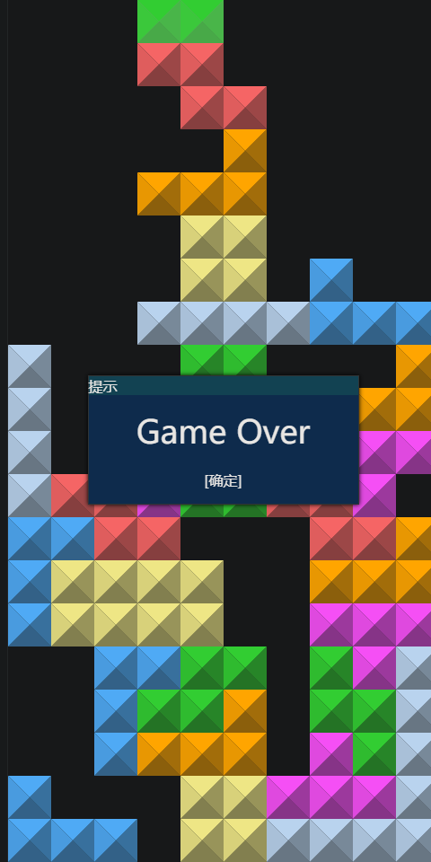

- “前情提要”
  collapsed:: true
	- 未派大本营电视台有了娱乐频道，美女主播与游戏直播（“可能主要因为直播电脑上有不少steam游戏，而展现电脑商品价值的其他途径尚不如游戏易进入”）都好看，我很爱看（“就像看未明子的大部分非DOTA2游戏直播”），但为了回复时间利用率，我照常（“每次玩都给自己点理由”）从中学到点啥，毕竟技多不压身
- [[硬件]]
- “低试错成本”
  collapsed:: true
	- 因为电子游戏标准（内容统一）、可靠（相对不受“以讹传讹”影响——父母说的普通话可能不够准确，也不一定能不搜题就辅导对作业，甚至可能由于在外务工等经常不在——而电子游戏有手机电脑、电、网等就能玩）、灵活（比印刷物反应敏捷、更改方便）
- ---
- 以下大致为目的（“意义”）
- ((679adda6-a918-4fc1-8fc8-20880d48acbd))
  collapsed:: true
	- ((68eb469a-761e-441d-8f0c-37e2ed396984)) 的默片比大批台词又臭又长的电影好看，应该也有不少无自然语言的游戏比啰里八唆的好玩吧？
	- [25个适合孩子的趣味中文游戏，让学习更轻松更高效](https://www.lingoace.com/zh/blog/25-mandarin-chinese-learning-games-for-kids-cn-2/)
	- 字母拼词
		- crosswords
		- spelling bee
		  id:: 68dfd523-8660-49cb-8b96-95417eeb4935
		  collapsed:: true
			- [Spelling Bee Game - 100% Free](https://spellbee.org/)
			- [第10季SPBCN全国总决选：用语言力量点燃教育星河_中国网](http://yingji.china.com.cn/2025-04/27/content_43095948.shtml)
	- 打字
	  id:: 67b093fa-af25-4b81-9968-91f0b063b54c
	  collapsed:: true
		- 金山打字通
			- [金山打字通生死时速 自行车也可以虐汽车！_哔哩哔哩_bilibili](https://www.bilibili.com/video/BV1RW411F7Ay)
			- TODO 生死时速换文本
				- 带查词功能
		- ((67402acb-f66c-48f4-919b-c62791029355))
	- “编故事”
		- 多人词语拼句子
			- [有趣的拼句子游戏 - 知乎](https://zhuanlan.zhihu.com/p/267255126)
			- 跟我爸朋友子女小伙伴们玩过，很好笑
		- 拼贴诗
		  id:: 68dfccaa-bb9c-456b-81b1-269bf43fb12b
		  collapsed:: true
			- [我们在满地的碎片里成为一个拾荒者｜拼贴诗的乐趣 - 知乎](https://zhuanlan.zhihu.com/p/415769331)
- （“我以为的”）自我肯定
  collapsed:: true
	- “（想象）（逃脱）无目标的痛苦和（或）无聊”
	- “任务我能完成，那么我去完成吧！”
	- “爽游”
	- ---
	- 玩家相对XX的实力（“广义难度”）
		- [Gaming Vocabulary: What does OP mean for gamers?](https://www.bidyogeyms.com/posts/what-does-op-mean)
		- 玩家与游戏世界
			- “是我熟悉、大概比较容易适应的世界吗？”
				- “很多玩家是殖民者”
			- [【游戏理论 | 中英熟肉】性格如何影响你的游戏选择_怪物猎人_游戏杂谈](https://www.bilibili.com/video/BV1sk4y1S7nu)
			  id:: 68df51f0-91e6-4916-837e-41f9751158db
			- 玩家年龄
				- 老年玩家
				  id:: 67b32de7-5d83-4463-8f97-ea6aaf1cbf23
				  collapsed:: true
					- [硬核！86岁大爷通关游戏几百款，边玩边测心电图证明自己不慌_哔哩哔哩_bilibili](https://www.bilibili.com/video/BV1xN411o7Qm)
			- 玩家与指令设备
				- 玩家（职业）不是用刀枪而是用键鼠等控制角色的刀枪
				- “升级”接入设备的地球OL
			- “玩家拥有四两拨千斤的优势地位——还是被缴械、与角色分隔？”
			- “天赋人权”
			- “玩家的特权时间”
			  collapsed:: true
				- 正好够玩家反应的时间，逐渐缩短
				- 暂停
					- “玩家确实往往没想好就开始莽了”
					- 游戏外部暂停
					  id:: 68d73dda-06ed-44d3-81d8-6a47b0be62dd
					  collapsed:: true
						- [电脑到手后玩家必备的软件-雪藏HsFreezer 最强游戏暂停器 -即将加入网游防掉线模式-随停随玩不等待!你没用过的船新版本!_哔哩哔哩_bilibili](https://www.bilibili.com/video/BV19H4y137hx/)
							- “卡关？阳痿？只要内存够大，后台总有一款适合你再来一次！”
				- 什么游戏结构会出现思考、操作时间？（包括空地、不触发区）
				- 子弹时间
			- 玩家的游戏
				- [安德的游戏 - 维基百科，自由的百科全书](https://zh.wikipedia.org/wiki/%E5%AE%89%E5%BE%B7%E7%9A%84%E6%B8%B8%E6%88%8F)
				- 游商、游戏意识、游戏理解、游戏觉悟（“原来我们都是玩家，甚至角色”）
				- 游戏的跨年龄群体性
					- 世上有小孩中孩大孩老孩
				- 要当自己拥有全宇宙，或者自己就是全宇宙，尊重不会玩的现实，抓住和创造机会充分体验
				- 开放世界，无限游戏
				  collapsed:: true
				- 避免长期过度单调的运动
					- 打破周期，否则添头（？）
				- 结局、成就与有限时间
					- 不同结局有重复的过程可以看其他玩家的录屏
				- 发展革命玩家
					- ((68df1358-c185-4f18-b1ed-9770622a3674))
				- ---
				- 如果絮叨我的游玩历史，大概是
				  collapsed:: true
					- 小学一年级左右，我爸给我治（？）弱视买的电脑（不知道这方面有没有——“电脑代”；大概没了）
						- 治（？）弱视的方格动画（“不算游戏”）
						- 拨号上网时期
							- 米勒山庄（当时船上射箭好像就没过，或者过了之后也没玩多少）
						- 自己玩的flash（也可能给朋友看过、聊过）
							- 上古神器
						- 同学
							- 双人玩过几次的
								- 僵尸危机
								- Q版泡泡堂
							- 附近小区的小学同学
							- 有次好几位同学来家里玩电脑
							- 我看同学玩或同学看我玩
								- 小学同学玩CF生化模式
						- 单机游戏
							- 比我大几岁的我妈朋友儿子带来的
							- 二姐家的连连看（也许是过年玩的）
							- 干姐电脑上的吞食鱼
							- 《少年电脑世界》
						- 小学同桌的口袋妖怪掌机（可能没咋碰过，只是看了几眼）
						- 舅舅送的手机上的帝国时代2（？；跟同一个初中/高中同桌在初中还是高中玩过）
						- 上大学的堂姐（？）的植物大战僵尸
						- 我爸朋友儿子电脑上的平衡球
						- 同岁的我妈同事儿子电脑上玩的flash页游
					- 初中
						- 学校旁教育机构电脑课，旁边哥们儿给下了GTA3
						- 我爸单位活动奖品ipad1上越狱装的游戏（无尽之刃、镜之边缘等）
							- 后来一次运动会上有其他同学带了更新的ipad，当然由于设备数量绝对匮乏，围都是围着的
					- 我大概试出过几次我爸设的密码（“想到现在他们的手机等的密码，似乎不奇怪”），不确定有没有用其他方法破解过，但初中、高中后大概不行了
					- 初、高中（？）家里蹲时期在电视盒子上玩的游戏（不好玩就看上面电影了，好像在上面看过个《永不消逝的电波》）
					- 高考暑假时我爸客户送的iphone6p（大学没买电脑，基本玩它）
					- 第二台式机
					- 至今的[[Logseq]]时期
						- 至今的 ((65f78b91-84e4-4c20-a7ae-2a57d74dc901))
					- ---
					- “所以为了所有人把游戏玩好，合作很重要”
				- 如果一定要玩游戏的counterpart，以及附带其他
				  collapsed:: true
					- ((670d4143-d180-4a4a-9875-6c7569039f7f))
					- [[the witness见证者]]
					- [[CDDA]]
				- 我的“自我效能感”和日志会告诉我，今天这个最爱玩的游戏我玩得大致怎样——但写到这下一秒我又不信了，我拥抱整体观，“每一天！”
					- 为什么这个游戏好玩？因为它对于仓鼠党是非常友好的，没有保质期问题，一切可搜、瞬间抵达，发展也相对由我不由“游戏机制”
		- 玩家与玩家
		  id:: 68eb467f-daf7-4f6f-8227-5153917575ce
		  collapsed:: true
			- 游戏排名
				- “游戏经济的常见基石”
				- “全世界XX水平下降XX，而我保持不变”
				  id:: 68da3304-4503-4c69-aa78-a3cf24b2bddd
				  collapsed:: true
					- ((68da8020-2bd7-4914-b206-fb4555331dfa))
				- 在现实中比较游戏排名
					- “只要我打得足够好，打游戏就能当饭吃！”
					- “做题家思维”
			- 多人电子游戏
			  id:: 1deff941-927c-4c8e-9a62-aaa990af618b
			  collapsed:: true
				- ((67583721-ae11-4553-b002-1f4ee5f1e98d))
				- 多人电游是很通用的项目，而非像书籍（看不懂的专业书好点，尤其在“压力转动力”能够部分生效的学校）、音乐、电影、单机游戏（尤其是各种“独立游戏”）等相对个人，因为即便一开始部分人可能有“非常糟糕的游戏理解”，他们的行为和认识也能较快地通过电子游戏环境内的模仿（“社会学习”）等改进，而很多现实中的游戏环境不带或只有较弱的反馈
				- 用电脑语音的由于电脑通常固定在室内，可能需要配套的隐私环境、耳机等
				- id:: 67987e57-e5b4-48d8-9b2d-b90210599ca7
				  >我先后想到spaceteam（线下玩效果更好，也看反应（））、mc、mindustry、百战天虫、flash小游戏联机
				  “现在的大游戏（平均而言）真有q版泡泡堂、疯狂小人战斗那么好玩吗？”
				- 网络联机
					- 本地（多人）游戏网络联机
					  id:: 6798841a-9ea7-471d-a379-36b066b4c714
					  collapsed:: true
						- “就是默认单人玩的游戏，也可以‘手把手’教学或添麻烦对吧？”
						- [[Flash页游]]
							- ((67987e57-e5b4-48d8-9b2d-b90210599ca7))
						- ---
						- Parsec
						  id:: 679add7e-3c76-4b0d-b2df-f440ba4699c9
						  collapsed:: true
							- [比Steam的远程同乐顺畅一百倍！蜥蜴君教你如何远程一起玩本地多人游戏_攻略](https://www.bilibili.com/video/BV11q4y1F7TT)
							- ((67b421a5-d76f-4de8-9952-70c303bee7de))
						- ((66335bea-507c-418c-9ec3-8d279d0c9859))
							- [腾讯会议也能用来联机游戏？腾讯会议Pukuniku双人联机教程（含与Parsec对比）_哔哩哔哩_bilibili](https://www.bilibili.com/video/BV1824y1T7mi)
						- ---
						- 远程键盘锁区
					- ((67402ac8-ecdf-4c62-9819-f3c3a0d628e8))
					- 聊天
				- 对战
					- 炸弹小分队（8人）
						- 推荐本地联机
					- the ghost（5人）
						- 3D恐怖手游，有逃脱和生存两种模式，鬼刀人，人找汽车部件逃脱或生存够足够时间（生存局10分钟），实际上只有模型（“恐怖奶奶的游戏视频看过没？还没那个精细、恐怖”）和jumpscare（跳脸杀，可在设置中选择跳过关闭——“其实就是捉迷藏，找到了就是找到了，对吧？”）有点恐怖
						- [多人联机恐怖手游！【the ghost】带上你的小伙伴一起嗨吧！](https://www.bilibili.com/video/BV1C64y1B7aZ)
					- the tabung
						- 基本同上
					- 百战天虫：战争武器（6人）
					  id:: 678b04a9-df0d-4a5e-bcd4-4a847753c48e
					  collapsed:: true
						- 2D横版回合制对战，每人最多控制8只虫子，有坦克、机甲、直升机等载具，可进入有内部的建筑，多人游戏建议多架防空炮
						- [手残联萌《百战天虫》爆笑集锦 中国BOY化身托比昂](https://www.bilibili.com/video/BV1ms411k7JT)
						- ((61f758d4-34d1-4db7-87ec-9a124f8108e8))
					- ((68eb4680-4543-43a6-990a-d14ab13836ab))
				- 线下
					- tick tock滴答声：两个人的故事
						- 最好与一位要好的、爱解谜的朋友线下碰面玩
						- 需要双人交谈的解谜游戏，每人下载安装游戏选择角色一或二进行相应角色的游戏，由于剧情是固定的，所以把玩这游戏的第一次、可能也是最后一次交给谁就看个人了（“那很浪漫了”）
					- spaceteam（大概能让英语较好的几个人一起吼着玩玩）
						- 用英语，“都有一弧人了”，在公共场合喊英语不会尬，就是大概都得至少过四级，懂基本的单词发音模式
					- 2 player games
						- 单屏双人对决小游戏集合，比剪包锤好玩得多
				- 合作
					- 单人、（接力？）、同屏、同机、本地双机/多机、网络
					  id:: 67eb2841-eff0-42f2-96ab-8a96d500790e
					- 组队
						- 队间竞争推动队内发展
					- 解谜（合作，且节奏自由、可以穿插更多交流）
						- 滴答声：两个人的故事（2人）
							- 2D分画面解谜手游，推荐当面玩
						- Escape Simulator（推荐2人）
						  id:: 68a69ce9-a820-4477-81c9-36a46dc59dfe
						  collapsed:: true
							- 3D密室逃脱解谜，部分人可能晕3D
							- [【风笑试玩】小巧好玩的密室逃脱丨Escape Simulator 试玩_哔哩哔哩bilibili](https://www.bilibili.com/video/BV1nL4y1B78z)
							- [两个月收入破400万美元，开发者复盘《Escape Simulator》成功历程](https://new.qq.com/omn/20220103/20220103A09CR000.html)
						- human fall flat人类一败涂地
						  id:: 66db8abe-565d-402f-a7c6-b36cd91d1acf
					- 团战
						- 和平精英
						- spaceteam（8人）
							- 推荐当面玩
							- 根据显示在自己手机上的针对别人或自己手机上的飞船操作区的指示“喊”别人操作，也许人略多就能把房顶掀了，总之也是“比博燃”，适合和没什么架子的人一起拯救冷场。美中不足是游戏内没汉化，至少需要一点英语，一般得超越李阳学英语了，或者可以点“更多游戏”下载ESL版本学英语；相同密码服务器连接也行，但是要有语音联机，而且也比较鸡肋吧
							- 画面升维的vr版演示
								- [oculus quest20200525更新 太空站队Spaceteam_VR.[1.0.2233]](https://www.bilibili.com/video/BV1854y1D78S)
						- 泰拉瑞亚（8人）
							- 买Terraria 4-Pack就是四份，除了自己那份可以送三位朋友4人玩
							- ((669cfdf6-8fb6-41bb-8fd4-dc244d3aef27))
						- 空袭2（2人）
							- air strike 2，在超市里拉叉车时想到的，当年好像是我看的第一期《少年电脑世界》上就推荐的这个游戏，和小学同学玩过几次，双人游戏就难分配物资了哈哈
						- broforce武装原型（2人）
							- 类似合金弹头但人物技能丰富的单双人横版射击，走位好的话蛮流畅带感
		- 玩家与家长等上位者
		  collapsed:: true
			- “你打游戏能当饭吃吗？！”
	- 惊喜、意外之喜
	  collapsed:: true
		- “为了自我肯定，惊喜与含剧透的攻略等的冲突”
		- >风景这边独好
			- >山就在那里
		- 故事
			- “听故事也不错”
	- “半天没爽急了，寻出美来了”
	  collapsed:: true
		- “我这番 ((670d40c8-3d03-4295-b052-06dcc635b2c9)) 并非全部木大......”
		  id:: 68db21ef-9da5-4b22-847d-1319ba2cf7f3
		  collapsed:: true
			- “因为我是自由的”
				- [这些史上最无聊的游戏，居然被玩家捧出续作？啥也没的游戏好评率94%](https://www.bilibili.com/video/BV1xT421i7wW/)
- 电子游戏世界
  collapsed:: true
	- “电子游戏需要一个世界吗？”
	- 过度城市化的电子保留地
	- collapsed:: true
	  >“你该去买彩票的，文总。”萧子山喃喃自语，“在卫生间里发现一个虫洞，比买到头彩的概率还低啊。”
	  “这个还不算头彩？”文德嗣心满意足地笑了起来，“有可以给你赢得一个世界的彩票吗？”
	  “文总，你不是一直说：单人双向低调的穿越才是王道。”王洛宾想起了当年 BBS 上关于穿越的讨论。
	  “没错。”文德嗣指着虫洞，“你知道那后面是什么吗？是一个世界！”他激动的挥舞起了胳膊，“通过它，我可以拥有一个地球、一个宇宙！”
		- [虫洞降临 - 第一卷「启航」 | 临高启明公开图书馆](https://lgqm.halu.lu/0001/0001)
	- 公开时间
	  collapsed:: true
		- >好康......是新游戏喔？
	- 进入成本
	  collapsed:: true
		- 了解成本
		  collapsed:: true
			- 除了此处其他成本外，还可能有线下人际关系等的影响，比如你是男的女的、玩得来的同学玩什么、家长意见，等等
		- ((68b82730-d18f-44c7-a1de-b3da1d5c1da7))
		- 常见模式
		  collapsed:: true
			- 通过互联网获取游戏及可能的游戏所需网络流量
			  collapsed:: true
				- 流量+手机
				- 住房+宽带+手机/电脑
				- ((660d5ab5-0892-4c5d-bbdd-b1fa1e3e7961)) +手机/电脑
				- 跨操作系统游戏
				  collapsed:: true
					- ((670d40f3-3aff-449e-91e4-0670a8ded2fc))
				- ---
				- TODO 低进入成本组合
				  id:: 68db9824-70ce-42a2-9ebd-ebbb33f86081
				  collapsed:: true
					- ((68eb4681-06a3-4016-8774-8090a8fb755e))
			- “云玩家”
			  collapsed:: true
				- ((68d73077-2fb5-4766-89bb-ac8456a9fe3d))
			- ((68a69cee-a1d8-4bf5-b1c6-ef1deab348eb))
			- 指令
			  collapsed:: true
				- ((670d4143-c378-4ec0-ad00-43208df973fd))
				- “鼠标点点”
				  collapsed:: true
					- ((679adca5-9354-42b2-ba4e-f1759a5463ec))
				- 方向分隔
				  collapsed:: true
					- [[键盘]]、 ((678a4dfd-85d8-4a3e-bb78-4f1ff76bb863))
					  collapsed:: true
						- 键盘加上组合也就几个方向，加上视角旋转是另一回事
					- ((67eb2847-b23f-402c-a450-820deed4c6c3))
				- 操作集成封装（行动，概率）
				  collapsed:: true
					- ((68ddd714-73a2-495f-a408-d176cf7e743c))
					- 桌游
					  id:: 688b2818-3117-4d1f-818b-8412e8b587bd
					  collapsed:: true
						- [象棋、麻将、扑克是否属于桌游？若属于，为何现代却设计不出超越上述桌游的作品？ - 知乎](https://www.zhihu.com/question/39558756)
						- 桌游改进 #苏州植青
						  collapsed:: true
							- 看小孩玩的
					- 卡牌
					  collapsed:: true
						- 卡牌RPG
						  collapsed:: true
							- [[密教模拟器]]
							  collapsed:: true
								- 流亡者DLC
								  collapsed:: true
									- [流亡者 - 密教模拟器中文维基 - 灰机wiki - 北京嘉闻杰诺网络科技有限公司](https://cultist.huijiwiki.com/wiki/%E6%B5%81%E4%BA%A1%E8%80%85)
									- 象征
									  collapsed:: true
										- 安宁
										  collapsed:: true
											- [安宁 - 密教模拟器中文维基 - 灰机wiki - 北京嘉闻杰诺网络科技有限公司](https://cultist.huijiwiki.com/wiki/%E6%B5%81%E4%BA%A1%E8%80%85/%E5%AE%89%E5%AE%81)
										- 狂怒
										  collapsed:: true
											- [狂怒 - 密教模拟器中文维基 - 灰机wiki - 北京嘉闻杰诺网络科技有限公司](https://cultist.huijiwiki.com/wiki/%E6%B5%81%E4%BA%A1%E8%80%85/%E7%8B%82%E6%80%92)
										- 大敌
										- 77年
								- [Cultist Simulator Free Download (v2024.5.a.3 & ALL DLC) « IGGGAMES](https://igg-games.com/cultist-simulator-975726415-free-download.html)
							- BOH司辰之书
							  collapsed:: true
								- https://fitgirl-repacks.site/book-of-hours/
							- ---
							- [[卡牌生存热带岛屿]]
							- stacklands
							  collapsed:: true
								- 卡牌像扑克牌那样叠加后互动，可以采矿，也可以生小孩，也就是“增殖”
								- 拆卡包机制像是买纸质卡包“盲袋”
								- 叙事性、互动复杂性弱，不推荐
								- [【风笑试玩】一个发展全靠拆卡包的世界丨Stacklands 试玩](https://www.bilibili.com/video/BV143411n7WC)
								  id:: 625fac95-4a98-4083-9041-b47be80920b8
				- 真操作——模拟——数字——集成
		- 朋友
		  collapsed:: true
			- “朋友是游戏最高配置”
			- ((68eb467f-daf7-4f6f-8227-5153917575ce))
			- ((68f5933e-bf02-48a4-b2d5-e36a72336331))
		- ---
		- 免费
		  collapsed:: true
			- 操作系统自带游戏
			  collapsed:: true
				- [这些电脑自带的游戏消失了？揭秘背后不为人知的故事！_扫雷_童年回忆](https://www.bilibili.com/video/BV1Z841147iT/)
			- ((68a69cea-359b-4966-b642-737837112777))
			- 盗版游戏
			  id:: 68d9ff4f-32fe-4cd5-9ccf-851feed0bd76
			  collapsed:: true
				- [Switch618|免费Switch游戏PC游戏下载 - SWITCH618游戏公益分享](https://www.switch618.com/)
				  id:: 675a850d-516e-4428-a2f0-261a913f3000
				- ((668f8021-44cb-44b7-aea2-0b3701466195))
				- [国外5大分享游戏下载网站详解！其实世界真的很大！ （分享知识 ） - 哔哩哔哩](https://www.bilibili.com/opus/622858369183354772)
				- [IGGGAMES » Free Download PC Games - Direct Links - Torrent](https://igg-games.com/)
				  id:: 67fc8c63-578a-4e41-93c6-e3dbbbee0fb9
				- [Welcome to Gamefabrique - GameFabrique](https://gamefabrique.com/)
			- 部分收费
			  collapsed:: true
				- 独立游戏
				  collapsed:: true
					- itch.io
					  id:: 68a69d7d-d051-4f68-8b9b-33d88b7fdd52
					  collapsed:: true
						- [Download the latest indie games - itch.io](https://itch.io/)
						- [itch.io：一个充满独立气质的游戏宝库 - 知乎](https://zhuanlan.zhihu.com/p/47140576)
			- ---
			- steam共享游戏
		- 收费
		  collapsed:: true
			- “看看实力”
			- Steam
			  id:: 688b2836-11b2-4bd9-86b6-fdc93ac82737
			  collapsed:: true
				- “谨慎安卓人”
				  collapsed:: true
					- [电脑上下 Steam 的游戏违法吗? - 知乎](https://www.zhihu.com/question/639331356)
				- steam家庭组
				  id:: 68f5933e-bf02-48a4-b2d5-e36a72336331
				- [Steam 玩家们所说的 Steam 7大名著分别是什么？ - 知乎](https://www.zhihu.com/question/28687268)
				- ((65d2ecf3-8af1-47e4-9219-317a3d501fe1))
				- [steam上有哪些手柄玩的游戏推荐？](https://www.zhihu.com/question/263707047)
				  id:: 67402ab8-25f7-48d2-9e94-fd9f77ec6225
			- [八元竟能玩上几百款高质量游戏！](https://www.bilibili.com/video/BV1VS4y1L7na)
			  collapsed:: true
				- 1.Rubber Bandits
				  2.Spelunky 2
				  3.Embr
		- 网游
		  collapsed:: true
			- 页游
			  id:: 68a69cea-359b-4966-b642-737837112777
			  collapsed:: true
				- ((68a69cea-ed43-48d6-9c2a-6f7e9aa644d0))
				- [让我们网上冲浪吧](https://web.wetab.link/games/surf/index.html)
				  collapsed:: true
					- 左右键（“怎么不能反转啊？”）分别可以按两次、两个斜角，下键正向下，上键停住，空格键暂停
					- ((66f22b31-dbbf-4f54-b48e-e30455326187))
					  collapsed:: true
						- “你看！”
					- [Edge浏览器网上冲浪小游戏计时赛14.76秒_哔哩哔哩_bilibili](https://www.bilibili.com/video/BV1Qz4y1S74e)
				- [FRVR - Free online games](https://frvr.com/)
				  id:: 68a69cea-be83-4e5d-b942-2a36ccf2ef8b
				  collapsed:: true
					- 在rocket chat聊天室的marketplace里发现的页游网站，不错
					- gold digger（玩的最长的，升级最快的方式似乎是挖软岩炸硬岩下深度）
					- 修改游戏数据
					  collapsed:: true
						- ((65d734ea-1a53-4fbe-b3ed-4ea445fadb75))
						  collapsed:: true
							- [大部分FRVR游戏作弊方法，百亿身家不是梦_游戏热门视频](https://www.bilibili.com/video/BV1iu4y147xc/)
							- [玩转FRVR修正版_哔哩哔哩bilibili_演示](https://www.bilibili.com/video/BV1MR4y1z7hj/)
				- [Overtide.io | FPS io Game - Play Overtide io Online!](https://overtide.io/)
				- [Wesane.com - Free online games](https://www.wesane.com/)
					- ((68fc60c1-a467-457e-b97c-fb491b3175c0))
				- [[Flash页游]]
				- ((67b499e9-96a1-49b8-932b-f3aec8fe89a4))
			- 客户端网游
			- ---
			- 网游账号
			  collapsed:: true
				- 网游账号租赁
				  id:: 68d9f7ff-911d-4164-a0b9-92b3c9a0f9b9
				  collapsed:: true
					- [如何防沉迷？游戏账号租卖已形成灰色产业链_哔哩哔哩_bilibili](https://www.bilibili.com/video/BV1xv411P7T9/)
					- （租赁的）网游账号找回
			- 网游限制
			  collapsed:: true
				- “删掉”
				  collapsed:: true
					- [[删掉哥]⚡本人就在B站！孩子们，我来了⚡_哔哩哔哩_bilibili](https://www.bilibili.com/video/BV1tH4y1W7xC)
				- “关掉”
				  collapsed:: true
					- [关掉姐原版视频_哔哩哔哩_bilibili](https://www.bilibili.com/video/BV1FA411g7TK/)
					  collapsed:: true
						- ~~“好啊，我玩的是单机游戏！”~~
						- [打开 打开 一定要打开网络游戏！](https://www.bilibili.com/video/BV1VD4y1d7xn)
				- “每周有限开禁”
				  collapsed:: true
					- “防沉迷”
					  id:: 66dba0b1-9d54-4a46-969b-3873217a18b1
					  collapsed:: true
						- [防沉迷新规推出后，未成年玩家减少3900万，仍有82%父母让孩子冒用自己身份玩游戏，如何看待这一现象？ - 知乎](https://www.zhihu.com/question/549383661)
						- [如何看待单机游戏加上防沉迷系统这件事？ - 知乎](https://www.zhihu.com/question/393868337)
						  collapsed:: true
							- “你那是安卓单机，不可能不防！”
						- ((6775dec3-1321-418f-9940-3fe78e0570f5))
						- ---
						- 反“防沉迷”手段
						  collapsed:: true
							- TODO 4399的防沉迷除了手机号验证码或微信号外只需要姓名和身份证号？
							  id:: 655b548c-7471-4180-8083-36fa5df8397b
							- ((68d9f7ff-911d-4164-a0b9-92b3c9a0f9b9))
							- 玩国外的、破解版
				- “批评”
				  collapsed:: true
					- [如何评价央媒点名批评王者荣耀？ - 知乎](https://www.zhihu.com/question/62191953)
	- 世界划分与分辨方式
	  id:: 68d733bc-254c-4731-abbd-59c89c8a2367
	  collapsed:: true
		- 四边形
		  collapsed:: true
			- ASCII
			  collapsed:: true
				- [ASCII - 维基百科，自由的百科全书](https://zh.wikipedia.org/wiki/ASCII)
				- ((68df4559-3ea6-417f-8851-9678e253bf91))
			- ((68a69d07-313d-4964-b490-d7b7fe8cf95e))
			  collapsed:: true
				- 《文字游戏》
				  id:: 68a69cad-b33d-43ef-bee2-3d6269f8b512
			- ---
			- 正方体
			  collapsed:: true
				- [[Minecraft]]
				  collapsed:: true
					- 作为建筑游戏：“空中楼阁”
		- 六边形
		  id:: 68da4f8f-d20d-4d81-a8a7-7cd20bb84dc6
		  collapsed:: true
			- “多点触达，多点通宵——《文明》的代价”
			- 文明系列
			  id:: 68a69ce9-ba58-4092-89dc-ad512c6bde90
			  collapsed:: true
				- 六边形从文明5开始
				- [《文明：超越地球》背景设定中的「大错误」（The Great Mistake）是一个怎样的事件？ - 知乎](https://www.zhihu.com/question/26199708)
				- [粮，锤，金，瓶，琴，鸽有换算准则吗？【文明6吧】_百度贴吧](https://tieba.baidu.com/p/8840263322)
				- [在《文明7》里可以实现汉朝的拿破仑、美利坚的孔夫子，这一改动会带来什么新的玩法体验？ - 知乎](https://www.zhihu.com/question/11554654884)
				  collapsed:: true
					- “那很~~政治正确~~平行世界了”
				- 二创
				  collapsed:: true
					- [[Unciv]]
					  collapsed:: true
						- 可联机
						- [yairm210/Unciv: Open-source Android/Desktop remake of Civ V](https://github.com/yairm210/Unciv)
				- {{embed ((68a69cd1-eb47-4903-b2a1-04737b3095bd))}}
			- ((68dfd523-8660-49cb-8b96-95417eeb4935))
			  collapsed:: true
				- “虽然一般不被认为是世界”
				  id:: 68e0e9f1-af71-4a83-aacc-a1d83def9c84
		- 无定形
		- ---
		- 像素
		  collapsed:: true
			- ((68df4559-3ea6-417f-8851-9678e253bf91))
			- ((68da7d07-bf46-44d7-b16f-c1bb875be383))
	- 世界构造
	  collapsed:: true
		- 随机
		  collapsed:: true
			- roguelike
			  id:: 68df4559-3ea6-417f-8851-9678e253bf91
			  collapsed:: true
				- [【安利】0期：传统roguelike游戏瞎推荐_哔哩哔哩bilibili](https://www.bilibili.com/video/BV1wD4y1T72y/)
				- ((68da83a1-6ad0-4fe1-9484-a59c27b246f6))
	- 视角
	  collapsed:: true
		- “世界是给人看的”
		- ((68a69cd3-8ef2-4781-98e5-7603336bd51b))
		- 横版
		  id:: 68dfbc29-7ac6-4fe8-8fbc-8fcec1fb93da
		  collapsed:: true
			- [“横版动作游戏”的前世今生](https://zhuanlan.zhihu.com/p/45211419)
			- 侧视
			  collapsed:: true
				- 角色可能会朝玩家偏一点
		- 俯视（正45，斜45；飞行、瞬移视角）
		  collapsed:: true
			- [为什么20多年前的游戏画面看起来仍然如此震撼？[中英字幕]_游戏热门视频](https://www.bilibili.com/video/BV1yf421U7Ev/)
			- 低模（？）
			  collapsed:: true
				- ((68da7c34-8df8-4d22-9dd8-dd2661a439cf))
		- 正视（第一人称，第三人称，第二人称；doom）
		  collapsed:: true
			- “第一人称已经多了一层了”
		- 跟随角色/图片、自由视角等
		- 更多沉浸
		  collapsed:: true
			- VR
			- AR游戏（透明，场域重合）
			  id:: 66ade37e-5fcf-472e-8533-049dbcfb0ac4
			  collapsed:: true
				- Pokemon Go
				  collapsed:: true
					- ((64a76bb9-6687-41d7-aca9-be574d8e4687))
		- [【中文字幕】格斗游戏的视觉悖论_哔哩哔哩_bilibili](https://www.bilibili.com/video/BV1z68BzeEwX/)
	- 声音
	  collapsed:: true
		- “我听见脚步声？”
		  collapsed:: true
			- 手游不听声见谁杀谁
	- “二阶游戏”
	  collapsed:: true
		- ((68d72a6c-0eb6-4dcf-9aed-2a21411d65b7))
		- “更多面墙”
		  collapsed:: true
			- 游戏直播（更多窗口——别喂猴子）
			  id:: 68d73077-2fb5-4766-89bb-ac8456a9fe3d
			  collapsed:: true
				- >玩还小众的游戏解说得有趣也可能有人看，或者手残联萌那种联机
				- 看玩家
				- 玩家人设刻板印象偏离
				  collapsed:: true
					- ~~“群众喜欢激烈的reaction”~~
				- 玩家参与能力
				  collapsed:: true
					- 复杂操作无法直接测试
				- 手残联萌
				- 或者视作其他项目可能用到的“游戏测试”
				- ((67c8f1b8-214a-4cb8-a71e-39bdc6ae32ce))
			- 对steam等国外游戏平台国内化的觊觎？（“蒸汽平台”）
			  id:: 62f62800-c1f4-44e9-b7c5-e87146630a9c
			  collapsed:: true
				- [如何评价 Steam 近期无法连接？](https://www.zhihu.com/question/525590687)
			- [为什么国内对游戏管的越来越苛刻了？](https://www.zhihu.com/question/520599428)
			  id:: 624cf914-5bbe-4434-bbc2-55d2d2ef0629
		- b站游戏区up主推荐：逗川kshadow、逆风笑、黑镖客、楼上的老张、与山0v0、APA奥特怕
		- [【主义主义】游戏的世界象征主义（3-1-2-4）——“我玩故我在”的哲学_哔哩哔哩_bilibili](https://www.bilibili.com/video/BV1oy4y1M7ef)
		  id:: 66304de6-0077-4e49-9dca-27cf8168cea9
	- ((67402ae3-eb71-44b3-b320-249d8edde652))
	- “有意义的部分及种类？”
	  collapsed:: true
		- “现实中更多还是游戏中更多？”
		- “已经存在了，只需获取？”
		  collapsed:: true
			- 角色作为人间兵器
			  collapsed:: true
				- 赛博朋克版角斗士预演
				- 玩家大多越俎代庖
			- 宝物、神器
			- “没指望玩家搞出法力，玩家就是个武装跑腿的”
			- ((678b04be-1ccf-4343-906f-3b83bfb744e2))
		- 玩家的点子
	- 虚构环境
	  collapsed:: true
		- 地下城
		  id:: 68a69ce9-79a6-4c00-8394-48ca767bca18
		  collapsed:: true
			- pathos
			  id:: 68da83a1-6ad0-4fe1-9484-a59c27b246f6
			  collapsed:: true
				- 一般是一个意义不大的人，但环境、怪物、物品等的种类和特性很多
	- 色彩，美术风格
	  collapsed:: true
		- 黑白
		  collapsed:: true
			- a dark room和the ensign（以文字符号点阵为主要画面的探险剧情独立游戏，多数难度没水没食就会回家）
			  collapsed:: true
				- a dark room开源版本：https://github.com/doublespeakgames/adarkroom
			- ((68a69ce9-f0c8-47d4-af8e-b7da5fbf53a4))
	- 策略创意与实验
	  collapsed:: true
		- 移动中射击策略
		  collapsed:: true
			- 随时调整（因为远距目标瞄准时间长，且持续偏离瞄准线导致重复瞄准），就近射击
		- 重新应用被画面遮蔽的现实知识
		  collapsed:: true
			- 物品管理、现实常识
			- 现实常识：出门不把家里东西都带上
			- 查资料（做个菜会搜菜谱）
		- 走位
		  collapsed:: true
			- 直线走，游戏里会预判，转弯不费事，绕着容易被追上
		- 攻击节奏：如果你动了她跟着走攻击就被打断了
		- 游戏资本主义的一个个危机（玩家的好打法）
		  collapsed:: true
			- ((68f077a1-ca87-42a1-9f9a-9b3d3ce85a96))
		- 游戏任务截屏，后台剪贴板等
	- 真实性
	  collapsed:: true
		- ((679adcc8-f652-4756-8a26-22e6e574b247))
		- “真实的物理学”
		- 合理性
		  collapsed:: true
			- “徒手破坏方块”
			- 自洽性
		- 谋略空间
	- 拓展性
	  collapsed:: true
		- ((68a69ce9-6377-4108-a6a5-7c65b79bf0ea))
- collapsed:: true
  ---
- [玩不同类型游戏的人的刻板印象](https://www.bilibili.com/video/BV12K421s7GB/)
	- [玩不同类型游戏的人的刻板印象(第二部分)_游戏热门视频](https://www.bilibili.com/video/BV12K421x7m9/)
- 选游戏的流程图（“不一定比这里的分类合适”）
  id:: 65d5659d-f596-40ad-a7a1-569d2f50a2e7
  collapsed:: true
	- [流程图告诉你：怎样挑选一款合适你的手游](https://zhuanlan.zhihu.com/p/19695786)
	  id:: 6248f62c-5d88-45fb-b05b-e20974f34476
	- [How To Pick The Perfect Video Game To Play, A Flowchart](https://geekologie.com/2014/02/how-to-pick-the-perfect-video-game-to-pl.php)
	  id:: 6248f62c-b70d-4987-af46-318f954f1aef
	  collapsed:: true
		- 
		- 
			- https://web.archive.org/web/20220423151649/https://geekologie.com/image.php?path=/2014/02/18/video-game-flowchart-large.jpg
- 放置
	- ((68eb464b-002b-4887-89f3-75de86ea1e0d))
	- 塔防
	- ((679adca5-9354-42b2-ba4e-f1759a5463ec))
- 移动
  collapsed:: true
	- 肢体不动
	  collapsed:: true
		- [[想象]]
			- “什么意思这是？还用我动脑的吗？”
		- 梦
		- 游戏视频
		  collapsed:: true
			- 更有趣的游戏视频与完成欲望循环的游戏
			- “省、免费”
			- “玩不了游戏诉苦”——“这下理直气壮了”
		- （看）[[直播]]
		- [[躺平]]
		- “那又怎样？为何我还得（很大意义上）做个人？神也这么憋屈吗？”
	- 消除
	  collapsed:: true
		- “强迫症”
		  collapsed:: true
		- 两个相同消除
			- 连连看
				- “移动了鼠标？”
				- [【连连看】10年前的游戏，有多少人玩过？_哔哩哔哩_bilibili](https://www.bilibili.com/video/BV1M4411J7gp/)
		- 三个相同消除
		  collapsed:: true
			- 泡泡龙
				- [被严重低估的《泡泡龙》，如何三次改变游戏史_游戏热门视频](https://www.bilibili.com/video/BV1MT4y1i7M9/)
			- 祖玛
			  id:: 67b091cd-18f6-464b-ad30-7ebb055da7d2
			  collapsed:: true
				- “没搞错吧？！”
				- [【祖玛】创造史上最高连击纪录！（极限作死...）_哔哩哔哩bilibili_童年回忆](https://www.bilibili.com/video/BV1HC4y1272S)
				  id:: 67b091cf-2215-402c-a75e-390b766c0365
				- [【祖玛】可能的人类理论记录：23分38秒_单机游戏热门视频](https://www.bilibili.com/video/BV1ErFJe2EXv)
				- ---
				- [耄耋的祖玛最终版_哔哩哔哩bilibili](https://www.bilibili.com/video/BV16fVwzZEnE)
			- 锦上添花
			  collapsed:: true
				- 空投、植物大战僵尸的玩家这一块
				- [Flowering](https://www.wesane.com/game/42/)
				  id:: 68fc60c1-a467-457e-b97c-fb491b3175c0
				- [赌 神 对 局_哔哩哔哩bilibili](https://www.bilibili.com/video/BV1Xg47zXEiW/)
				- [锦上添花小游戏，没bug时最高干到35关_哔哩哔哩bilibili](https://www.bilibili.com/video/BV1rB4y1Y73q/)
		- 10个相同消除
			- [[俄罗斯方块]]
		- ---
		- 拾取/进食
			- “看！地上有钱！”
				- ((67ab1729-9308-470b-905e-0d4439ee624f))
				- “哥们儿自动拾取忘关了说是”
					- “哥们儿错吃了毒蘑菇说是”
			- 一格
				- 吃豆人
				- 贪吃蛇
				  id:: 68eb467f-9c37-4555-b4c6-5df3b20c375c
				  collapsed:: true
					- 贪吃蛇大作战
					  id:: 68a69cad-8c13-4270-bc31-de43a6a18c73
					  collapsed:: true
						- [贪吃蛇大作战真的是单机游戏吗？ - 知乎](https://www.zhihu.com/question/48638245)（“啊？”）
						  id:: 65d34629-a42d-485b-9e1c-0e9c60c339fb
						- 贪吃蛇“民间”团队推流？
				- 吞食鱼（“大鱼吃小鱼”）
				  id:: 68eb467f-17cf-479a-bc64-ac630a93c16c
					- “啊？是暴力吗？我们人类通常不这样使用暴力”
				- 球球大作战
				  id:: 68eb4651-8589-4483-8a91-5ea5daaa38bc
					- [从4亿人在玩到彻底凉凉，球球大作战到底做错了什么？_游戏热门视频](https://www.bilibili.com/video/BV123411C7FR/)
			- “邻近”
		- ~~脱衣~~
	- Ballance平衡球
	  id:: 678b048d-64b3-4017-9dc2-517043a62c1e
	  collapsed:: true
		- “耐心？”
		- [【平衡球点这里下载！】Ballance吧·导航贴【ballance吧】_百度贴吧](https://tieba.baidu.com/p/6264479421)
		  id:: 65d19bde-af7d-4187-9820-3de425d0bcec
			- [Ballance吧导航贴 - Ballance Wiki](https://ballance.jxpxxzj.cn/wiki/Ballance%E5%90%A7%E5%AF%BC%E8%88%AA%E8%B4%B4)（整合包我第一次赶时间关过一次机中断过下载，第二次点就下不了了，显示“Bandwidth limit exceeded.”）
			  id:: 65d15aeb-8598-4d35-b882-299852fad7df
			- [关于较新整合包的游戏分辨率相关问题【ballance吧】_百度贴吧](https://tieba.baidu.com/p/8631939637)
		- 原版十三关，卡关了可以看大佬视频，过了可以继续玩真正变态的玩家自制关卡，一星难度即超过原版难度，非常修身养性，让人乐此不疲；可能会引起眩晕和恐高
		  id:: 65bcbf67-78e1-45b3-8d92-76480d36724a
		- Ballex
			- >概述：Ballex和Ballance最大的区别在于，后者面向普罗大众，而前者面向对于已对Ballance有强烈兴趣并且已经积累大量经验、拥有高超技巧的老玩家。平稳的心态、强大的耐性、大佬的技术，这三者至少得有一个，否则就会像我一样被气哭（呜呜）。
		- [Ballance: 经典游戏平衡球的 Ballance Unity 复刻版](https://gitee.com/imengyu/Ballance)
		  id:: 65d14aa7-432a-4861-8fe9-c18d3d5dcbd7
		- ---
		- TODO 好果子平衡球
		  id:: 67e6713a-4e03-4a90-9ab5-50547302b1c8
			- 今天吃晚饭时用筷子搛小番茄吃，从某个开始换成用牙摘蒂（而非入口后“反过来”）后，小番茄在差不多平行的筷子间滚了起来，然后落到了碗上（然后又正好掉了下去）
			- 也可以做成（“易迁移的”）电子游戏
			- 多双筷子可以实时“搭接”
				- 可以移动中（“什么逆天运动会”）
				- 注意安全，别戳到眼睛、鼻孔等，可以戴护目镜等
		- TODO 斜上吹风Ballance
		  id:: 68d2516e-17ee-4202-8854-f5e388d56147
			- 大概是前阵子玩了下什么纸团？具体怎么玩的？还是说看到啥想到？
			- “斜上吹风？斜上？”
				- “是男人就上一百层？”
					- ((673a0a10-3e16-4fb6-b728-a6c9bcb6062a))
	- “进进进”
	  collapsed:: true
		- “拿拿拿”
		  id:: 68f4e06b-2676-4664-9cea-999f93a939d9
			- “可以拿吗？兄弟？”
				- “敌人（比如恐怖分子）的可以拿”
				- “病人的病源啥的可以拿”
					- ((68eb464e-3cdd-44bb-bbe4-b1beac9152f1))
				- “拿拿拿”
					- 小偷模拟器
	- “润！”
	  collapsed:: true
		- 边逃边捡钱（“金币重量归零”）
			- 神庙逃亡
		- 恐怖游戏
			- “人类的谨慎之处吗？他们把未知的迪化为强大的”
			- 车
				- “内燃机车，人类20世纪工业科技的结晶之一”
				- 恐怖奶奶
				- 13号星期五
				- “只要能到达那个地方”
			- 你好邻居
	- ((68a69d32-2513-41d7-be03-344604add491))
	  collapsed:: true
		- “掘地求升那个更像被合谋归零的甘地的第欧根尼的锤子就是没老卢德分子的得劲，那么大力都没给地图砸出个坑，可以说是比愚公移山差远了”
	- 快速移动
	  collapsed:: true
		- 跑酷
		  collapsed:: true
			- 城市就是健身房
				- 自然训练法则
			- [让红牛看了都不敢赞助的男人_哔哩哔哩_bilibili](https://www.bilibili.com/video/BV1EVtRzgEf8/)
			- 冲 ((68eb466b-1b17-4cd1-a33d-363f1c5defab)) 也是跑酷
		- ((6726339e-6451-438d-95d0-896112e62d89))
		- 赛车
		  collapsed:: true
			- ((68bae48f-8684-4c32-b945-d8a56ed9d4ca))
			- [Stopping For Nothing - S3RL x Slen-D | DEFI BRILATOR-DensetsuMusic-DensetsuMusic-哔哩哔哩视频](https://www.bilibili.com/list/71344657)
			- ((67598ca2-41c8-43af-929d-e85602aa9d3a))
			- 狂野飙车系列
			  collapsed:: true
				- 狂野飙车8（老游戏，在ipad上玩的）
			- reckless racing鲁莽赛车1/2/3
			  id:: 61f764fd-7b78-4a1f-859e-149c05c96ba6
			  collapsed:: true
				- ((61f758d5-d8c0-4fbb-b768-1acbfa236755))
				- ((61f758d4-4466-4234-a877-c1b51ea877ef))
		- 飞行
		  collapsed:: true
			- [{全英文}RORTOS游戏发展历程——2011～2022_哔哩哔哩bilibili_模拟飞行_游戏杂谈](https://www.bilibili.com/video/BV1UR4y1f71q/)
			- hyperburner极速燃烧（避开障碍向前飞考验反应力的手游，比较紧张刺激，我当时竟然两小时内通关了）
	- 传播
	  collapsed:: true
		- ((68eb467f-0c84-4a5f-8c31-bcdddfc532d2))
	- ---
	- 自动跑图
	  id:: 679add7e-6fd1-4bfc-8015-6301a4587aad
	  collapsed:: true
		- ((674d760b-10d1-4c56-8b43-5f659f9cd883))
		- ((676f7433-cafd-4d23-a5b0-789e597debdd))
		- ((66db8ac4-d558-458d-9528-499eb66f69ee))
- 解谜
  collapsed:: true
	- Jonathan Blow
		- [乔纳森·布洛的想法，与我们对其的思考 | 机核 GCORES](https://www.gcores.com/collections/47)
		- ((679adcbd-9d75-492a-92c0-8ab64f27aaaf))
	- 猜
	  collapsed:: true
		- ((68d733bc-254c-4731-abbd-59c89c8a2367))
		- 用途
		  collapsed:: true
			- ((68a69caf-41ea-47d6-a942-603c42f88e8e))
		- “你说我猜”（多人）
		  id:: 68dfc07e-b70b-4258-826d-11b17abd871d
		  collapsed:: true
			- “我问你说我猜我是谁”
			  id:: 68dfc2bb-b40b-4b35-bbf6-778bb14c3a35
			  collapsed:: true
				- [我是谁？_哔哩哔哩_bilibili](https://www.bilibili.com/video/BV1f54y1V7FR/)
			- “你说我猜你是谁”（谁是卧底）
			  collapsed:: true
				- ((68a69cb0-8ca0-4671-b438-f3e0a62b6eb6))
			- “大家问同一个出题者然后猜”（海龟汤）
		- “找凶手”
		  collapsed:: true
			- “受害者已经受害了”
				- 一个人猜
					- ((678b04b6-fba8-418b-9b03-5dffa5b06053))
					- 逆转裁判
					  id:: 68dfbdf6-d323-4ecb-ad66-178b549fe8d7
					  collapsed:: true
						- [我做了一个以同学为主角的逆转裁判同人游戏](https://www.bilibili.com/video/BV1ku411m7Qc/)
			- “受害者不一定（已经）受害”
			  collapsed:: true
				- ((68eb464e-c087-4526-8fd1-f1f836886036))
				- “狼人/鹅鸭杀”
		- ---
		- “一人一票”
		- “特权”、“职业技能”
	- ((68df1767-36f5-4243-8587-7285b4e4bd13))
	  collapsed:: true
		- 灯谜
		  collapsed:: true
			- ((68e485c8-0381-4fb7-b37c-0ebece5d2cd9))
	- “搜”
	  collapsed:: true
		- “攻略”
		- “找到”
			- ((678b0495-560b-48f8-9cfb-bce76331e388))
	- 图形谜
	  id:: 68eb467f-a36b-4602-898f-1e559a38bdc0
		- 猜图
			- “对其他扑面而来的游戏算是审题”
			- ((68a69d07-d083-4aa5-83f5-f807d8d686ed))
			- 猜词（“那我很会分类了”）
			  id:: 68df1767-36f5-4243-8587-7285b4e4bd13
			  collapsed:: true
				- ((68a69d0c-eb99-4904-b611-b1436baeefe6))
				- 表演猜词
				  collapsed:: true
					- 可以动嘴
						- 可以说话
			- [【我是谁】？？？猜中算我输_哔哩哔哩_bilibili](https://www.bilibili.com/video/BV1Np4y197yW/)
			- “你画我猜”（多人）
			  collapsed:: true
				- “省了跑跑和纸笔但别处用了电，综合孰高孰低不好说”
			- ((68dfc07e-b70b-4258-826d-11b17abd871d))
		- ((679add38-a1b8-4e4d-9d5b-9ae2f1a61d90))
		- 一笔画
		  collapsed:: true
			- 网格迷宫一笔画+ ((67402b17-6bd5-41d0-ae7e-8e8717eb7c35))
				- [[the witness见证者]]
			- 一笔画+以终为始继续重复运动
			  collapsed:: true
				- blek
					- [《Blek》手指画线ep1 1-50关——听说国区连这种游戏都下架了？_哔哩哔哩_bilibili](https://www.bilibili.com/video/BV19K4y1T7Wa/)
					- ~~“就叫蛄蛹者吧！”~~
			- ~~“想到下头的了”~~
			  collapsed:: true
				- ((66f276a6-3c1e-4e4c-b94e-2bacb15c514e))
				- ~~“就叫盘古或女娲吧”~~
				  collapsed:: true
					- ((68a69caa-92e0-411f-a676-fbd5b61b315f))
				- “懂了，基本的362关”
				  collapsed:: true
					- ((66fd3f58-dc24-44b0-bd4a-b492fd63d509))
				- ((68df1e36-684d-443c-888e-322843c9ddee))
		- 数字谜
		  collapsed:: true
			- 扫雷
			- 数独（自然数不重复填充行列——“俄罗斯方块它每块也不一样啊”）
			  collapsed:: true
				- [Monogram](https://nonogram.frvr.com/zh-Hans/)
				- 偶然看到未明子直播玩相关手游（？）
			- [不要只知道数独啦！——那些与“数”有关的逻辑解谜游戏(上) - 哔哩哔哩](https://www.bilibili.com/opus/123500985735622694)
		- ((68dfbc29-7ac6-4fe8-8fbc-8fcec1fb93da))
		  collapsed:: true
			- 拼图+缩放
				- Gorogoa画中世界
					- [《画中世界》：你的决定不是你的决定](https://zhuanlan.zhihu.com/p/40778369)（建议通关后再看）
					- 2021年大年初二晚上吃饭，看到我小外甥早早吃好站桌旁低头在黑色石英桌上用手指画画，联想到游戏里身份神秘的小男孩——他当真有那么点艺术细胞
			- 多面板
			  collapsed:: true
				- The Pedestrian
				  id:: 68da8f25-1ee1-4c31-b015-41aa05dc221b
				  collapsed:: true
					- [科技树点歪了？平面解谜游戏为什么要做这么精致的3D场景啊《步行者》【小酌一杯】_哔哩哔哩bilibili_游戏杂谈](https://www.bilibili.com/video/BV1K5411B7u4/)
			- 平面三角结构
			  collapsed:: true
				- 粘粘世界
				  id:: 67c3b062-63ab-4788-9175-97cc14bd8be6
				  collapsed:: true
					- “石油成精啦！”
					- [十余年前受获无数好评的独立游戏《粘粘世界》，究竟讲了怎样令人“震撼”的故事？【彬蓝二井】_哔哩哔哩_bilibili](https://www.bilibili.com/video/BV1tF411x78N)
					- [粘粘世界中文版全OCD【一至五章全】48PART_哔哩哔哩_bilibili](https://www.bilibili.com/video/BV1hx411c7Ts/)
					  collapsed:: true
						- “这个OCD就很不好，知道原理后也比较吃操作，当然如果儿童不在乎那也许无所谓”
					- [【粘粘世界2】4K 最高画质 全关卡 全剧情流程通关攻略 经典解谜冒险游戏 黏黏世界2 - World of Goo 2_其他游戏热门视频](https://www.bilibili.com/video/av1406416482)
			- “常规”无分隔横版
			  id:: 68df21b3-0265-4cd0-9761-38be797f2270
			  collapsed:: true
				- 米皮大冒险
				- die with glory寻找英灵殿
				  id:: 68a69ce9-2ec2-4e5c-8d92-2d26664acc35
				  collapsed:: true
					- 北欧史诗
					- [Die With Glory - Release Trailer | PS4_哔哩哔哩_bilibili](https://www.bilibili.com/video/BV1xZ4y1A76C/)
		- 第一人称射击创建近距传送门（“相比一般的远距传送门要考虑的就很多了”）
		  collapsed:: true
			- portal传送门 1/2
			  id:: 670d4143-d180-4a4a-9875-6c7569039f7f
			  collapsed:: true
				- [世界上最伟大的游戏之一！《传送门》究竟讲述了什么故事？？？_游戏热门视频](https://www.bilibili.com/video/BV13G4y1Z74K)
				- [世界上最伟大的游戏之一！《传送门2》竟然有如此反转的剧情！？_哔哩哔哩bilibili_游戏杂谈](https://www.bilibili.com/video/BV1xR4y1y7Tq/)
				- 创意工坊有很多地图
				- portal2
				  id:: 68a69ce9-0f19-4b50-a665-b237ac0eef27
				  collapsed:: true
					- portal传送门双人联机模式（能从波士顿动力的机器人联想到）、英雄无敌
					- 3D动作射击解谜，Valve经典之作，建议在双人关卡前先通关单机游戏
					- ["This is art." : r/Portal](https://www.reddit.com/r/Portal/comments/gzxbh/this_is_art/)
					  id:: 66ad93a3-ee3f-4cbd-a0d3-48fec9340801
				- “GlaDOS你真需要Chell完成测试？还是说面子上挂不住？”；“工具理性”；传送门，信息传输，同步，线上会议
				- 传送门漆
				  id:: 68eb467a-8fa5-47c5-b229-084e6ddb64fd
		- ---
		- 多面体旋转、推拉连接可通过平面
			- 纪念碑谷
			  id:: 679add7e-70fc-49c4-a747-690425a187d2
			  collapsed:: true
				- 纪念碑谷2
				  id:: 61f764ba-1967-4288-8959-3cb334ac017c
				- [【图片】【考据】从神圣几何学的角度看游戏《纪念碑谷》_纪念碑谷吧_百度贴吧](https://tieba.baidu.com/p/7355775486)
				  id:: 67a34c38-64e2-45f5-b5eb-2c1caa22279c
			- （近）球面
			  collapsed:: true
				- 点亮之路（Path To Luma）
					- 以前通关过，2021.8.18晚从白天客户说的一只垃圾焚烧（固体废物）发电股票想到这个游戏的同种发电方式
				- ---
				- 并非解谜
					- 山
					- 大胆的桌面
					  id:: 68fc8dd3-e4d1-46e1-b5bd-7fa3fcc75e3e
						- [我的软件《大胆的桌面》发售了！可以说bug满天飞！啰嗦一下感受，很点背也很感动！_哔哩哔哩_bilibili](https://www.bilibili.com/video/BV1UEtvzNEwz)
			- 魔方
		- “有限空间有序套圈”
		  collapsed:: true
			- 汉诺塔
			  id:: 67e1496d-5f60-455d-b14e-5a7d4530276c
			  collapsed:: true
				- [汉诺塔_百度百科](https://baike.baidu.com/item/%E6%B1%89%E8%AF%BA%E5%A1%94/3468295)
				  id:: 67e14975-0c9f-4869-9aa3-a28e7b365b77
				- [在线汉诺塔游戏-汉诺塔算法可视化](https://gallery.selfboot.cn/zh/algorithms/hanoitower)
				- ((679adc85-e22a-40f5-baef-eaa6ec7cba08))
		- ---
		- 策略走路（或下棋）
		  id:: 68a69ce9-ef55-464c-9666-7b6e113e99c2
		- 错觉视界
		- 梦境机器
		- 机械迷宫
		- 欧几里得之地
		- starman
		- 幻视空间
		- 听觉可视化
		  collapsed:: true
			- 回声探路
	- 多时态
	  collapsed:: true
		- ((68df21b3-0265-4cd0-9761-38be797f2270))
			- braid时空幻境（我自己通不了关的；“所以说像小时候家里大多没电脑一样围着一起玩？”）
			- “重返未来”
			  collapsed:: true
				- 沉默年代
					- [清洁工意外穿越到9999年！居然发现人类已经灭绝了？_哔哩哔哩_bilibili](https://www.bilibili.com/video/BV1tq4y1T7W3/)
				- 伟大的可能
				  collapsed:: true
					- [主角一觉睡了100年！醒来发现人类竟然灭绝了？?_游戏杂谈](https://www.bilibili.com/video/BV1Z24y1K7JV/)
		- lost echo回声迷踪
		  collapsed:: true
			- [lost echo回声迷踪全流程攻略 无解说纯净欣赏版 手机游戏迷失之声完结结局实况解说剧情向卡关国际象棋书店推荐好玩剪辑体验解密解谜独立单机手机小游戏悬疑_哔哩哔哩_bilibili](https://www.bilibili.com/video/BV1iQ4y1K7qb)
			- [[8年杳无音讯的精品手游2024] 回声迷踪：共振 - 新手引导](https://www.bilibili.com/video/BV1WK4y1q7gX/)
			- 剧情爆炸
			- ((68a69d91-ca60-4c4a-80e2-bf280506f26e))
		- life is strange奇异人生系列
		  collapsed:: true
			- 扯点远的，刘慈欣的《混沌蝴蝶》
	- 密室谜
	  id:: 68d87cb4-0b32-4e41-883c-eae772f031c6
	  collapsed:: true
		- ~~“来看房了朋友们”~~
		- 自由转向的机关解谜探险（可以拖动视角、物品，操作感较好）
		  collapsed:: true
			- the room未上锁的房间系列
				- 3d操作道具的手感好，剧情方面没锈湖系列那么时刻吊人胃口，不过3最后迅速收束的剧情确实是有点硬核，第一次玩出来那个结局短片不知为何让我震惊之余想了一下删游了……还好可以跳关/滑稽
				- 提示∶通过右边两个木头房间便可开始预知结局和选择结局，预知结局是按顺序展示，选择结局则看最后用了什么，黑色窜风的门进去就是结局前最后一站了准备好了再进去，仔细观察多双击，这游戏找钥匙孔有时比找钥匙难
		- 预设转向的机关解谜探险（多种谜题集中于一个房间，房间一般只有四个方向；如果游戏机制简单喜欢藏或玩家没慧根，那么找物品主要靠点）
		  collapsed:: true
			- cube escape方块逃脱和rusty lake锈湖系列（有些有点恐怖、恶心）
				- 逃离方块合集
				  id:: bd299cd4-172d-45f0-ae0e-964a7f558178
				  collapsed:: true
					- [一家人就要整整齐齐，锈湖工作室推出《逃离方块合集》](https://zhuanlan.zhihu.com/p/356249218)
			- [Daily Room Escape](https://dailyroomescape.frvr.com/)
			  collapsed:: true
				- 就玩了两天的（第一天那个字母箱就没开了，AEKS和最后一个字母前后试了一会儿也没用，hint视频也没加载），可能场景不变，谜题种类基本不变
		- ((68a69ce9-a820-4477-81c9-36a46dc59dfe))
		- 消失在夜空的眼泪
		  collapsed:: true
			- 密室逃脱，感觉做得不是很好，有些地方有点牵强
		- fran bow系列（比较恶心，有点恐怖）
	- 流浪者：弗兰肯斯坦的怪物
	  id:: 30573544-14e9-4d57-840c-5d1abca1ac61
	  collapsed:: true
		- 艺术特点包括通过色彩等展现身体机能和情绪的正负面状态
		  id:: 62500a50-4fe5-4053-95ae-e7467bd31fdb
		  collapsed:: true
			- “愿你的世界的轮廓和色彩（“记忆的底色”）在源源不断的新鲜正面经验中永葆鲜明”
		- The Wanderer: Frankenstein’s Creature ，经典科幻小说的游戏化，一个怪物试图融入人类社会的感人故事。结局几种，感觉懒人要花很久玩完，其实就不玩了吧
		- 一周目中前期我把画面调得太白，结果没看到对话选项还一直熬到往北冰洋里走的结局......
		- 出品人ARTE France（Apps）为德法公共电视台法国部（大概是这么翻译），拍纪录片（脑力），也做游戏，挺厉害
		- 可以sl大法
		- 林地醒来三件好事（增色），两件坏事（变暗，避开）
		  collapsed:: true
			- 小鹿是可以撸到的
			- 休息后“干涉”
	- 机械谜
	  collapsed:: true
		- limbo地狱边境
			- 黑白画风遮不住血腥
			- 有反重力场时箱子可以爬着跳着玩，虽然我没玩出啥有利通关的名堂
			- [LIMBO《地狱边境》bug卡箱跳等几个进阶操作_哔哩哔哩bilibili_攻略](https://www.bilibili.com/video/BV1CA4y1d7Jn/)
	- 机械迷城
	- GRIS
	  collapsed:: true
		- 类似机械迷城的动作机关解谜，比较美，一位能突然缓降、增加自身质量的半神生物从天上掉了下来（从这些石头想到看过逆风笑的[【风笑试玩】竟然有胃口吃这些东西丨Grime 试玩](https://www.bilibili.com/video/BV1B54y177ky)），失去了歌唱的动力，试图回去
		- [主角才是反派？7年前最具争议的解密神作！竟然还有隐藏剧情！？_哔哩哔哩bilibili_游戏推荐](https://www.bilibili.com/video/BV1MaZRYXERP)（“那我可能没注意”）
	- 其他剧情较多的
	- “我不到啊！所以我要玩下去！”
	- 幽默
	  collapsed:: true
		- 火柴人逃脱系列（英文短剧，含对话，有点搞笑）
		  id:: 68a69cea-ed43-48d6-9c2a-6f7e9aa644d0
		  collapsed:: true
			- [Fleeing the Complex 🕹️ Play on CrazyGames](https://www.crazygames.com/game/fleeing-the-complex)
		- 万民四末
		  id:: 68a69ce9-2a52-4476-a1c8-d9791cfd894c
		  collapsed:: true
			- [【谜之声实况】万民四末 Four Last Things（完结） 朋友，不犯犯七宗罪吗？_哔哩哔哩_bilibili](https://www.bilibili.com/video/BV1Fx411v7UL/)
		- 约翰尼·博纳瑟拉的复仇系列（脑回路清奇，美式幽默，梗多）
	- 监控
	  collapsed:: true
		- the stanley parable
		  id:: 670d4143-c378-4ec0-ad00-43208df973fd
		  collapsed:: true
			- “叙事是神是吧？”；好像能装中文补丁
			- [别玩这款游戏!  你可能会被“控制”好几年！（史丹利的寓言）〖游戏不止〗_单机游戏热门视频](https://www.bilibili.com/video/BV1dq4y1M7BQ)（“你有权选择不玩”）
		- [[别喂猴子]]
		  collapsed:: true
			- “分屏看直播搞意见连是吧？”
		- [[INSIDE]]
	- starman星人
	- 日本
	  collapsed:: true
		- Studio Wasabi作品
		  id:: 679add7e-dc30-445c-80c7-30468f805575
		  collapsed:: true
			- 囚禁之馆、谎言游戏、恶狼游戏、夏娃计划、绝望监牢等（部分作品剧情有点肝，有些一周目后不能跳关，建议想看完制作比较细致的人物对话的话在一周目就按故事进展一步步看完，一周目后除了新出来的阅读材料等快点通关就行……在“wasabi游戏”里可以玩恶狼游戏和与其平行的夏娃计划以及各种各样相关的故事，原班人马成系列后剧情真的非常棒。“改变”或者说“改造”的概念似乎在日本解谜游戏里更流行
		- （SEEC） ESC-APE作品
		  collapsed:: true
			- 黄昏旅店
			- 爱丽丝的精神审判
			- 四目神
			  id:: 61f7647a-f044-49c7-b996-5e6047a95831
			- 他们还做了几个恐怖解谜，方向转几下飘过一个小姐姐刺激死了
		- 艾比（entabridge作品，肝度低点，剧情短平快点，话题是人与AI关系，有点深刻）
		- 古董旅店系列
		- 逃脱侦探少女（主角让我想到黄昏旅店……）
		- 监狱脱出少女（有点硬核，汉化可能不太好影响解谜可以英语或日语）
	- 中国
	  collapsed:: true
		- 橙光游戏
			- [【游戏侦查冰】从同人游戏净土到吸金利器——橙光游戏发展史_哔哩哔哩_bilibili](https://www.bilibili.com/video/BV1XJ411J73e/)
			- 恒水中学连环虐杀（最后变脸那个环节真的秀）
			- 潜伏之赤途（隐形守护者大概就是这个改编的。我下的版本好像容易坏档，大概香港富商代表团后面存档就坏了）
		- stanley博士的家系列
		- 胡侦探系列（重玩前印象深刻的一幕是有次胡侦探说别人蹲马步像拉屎挨揍了）
		- 云端之约（有点像前面的艾比，主题也跟AI有关，国产梗不少，有关系值影响结局的设定所以可能有点肝，于是我没玩完）
		- 迷失岛系列（比较难）
	- 文本选项
	  id:: 68ddd714-73a2-495f-a408-d176cf7e743c
	  collapsed:: true
		- ((68da7d75-fd0b-45e6-a986-5eec23f56a8a))
		- “好强啊选项之力！”
		  collapsed:: true
			- ((68eb46c9-54c0-4aa6-b3b8-7af38d88402a))
		- a dark room
			- [A Dark Room](https://adarkroom.doublespeakgames.com/)
			- the ensign
		- 被动选择
		  collapsed:: true
			- 潜伏之赤途
			  id:: 670d4143-2dfd-4317-ad57-04ce19f568e2
			  collapsed:: true
				- [《隐形守护者》相比原作《潜伏之赤途》做了哪些改动？ - 知乎](https://www.zhihu.com/question/314769812)
			- 手机
			  id:: 68df29dc-e0dd-40d9-998e-4e12c884280a
			  collapsed:: true
				- [[失踪的萨拉]] #ARG （同时还是高科技犯罪）
				  collapsed:: true
					- [捡到了一部手机，本来想联系失主，但开机后发生的事让我毛骨悚然！_哔哩哔哩_bilibili](https://www.bilibili.com/video/BV1ot411p7vC/)
					- [萨拉失踪了 全结局_哔哩哔哩_bilibili](https://www.bilibili.com/video/BV1Wx41117oo)
			- ((679adcc7-8eff-4c52-bea4-47029177a887))
			  collapsed:: true
				- there is no game
					- [这游戏居然求着别让我退款！_哔哩哔哩_bilibili](https://www.bilibili.com/video/BV1uZ4y1K7dP/)
				- terrorbane
				  collapsed:: true
					- [【warma】在BUG中找游戏可太难了！_实况](https://www.bilibili.com/video/BV1ue4y1f74U/)
			- 互动式游戏
			  collapsed:: true
				- [近年来兴起的「互动式电影游戏」有哪些佳作？ - 知乎](https://www.zhihu.com/question/67188462)
				- “后来僵化成了性压抑短剧说是”
	- 几何
	  collapsed:: true
		- 切合视角
			- 放缩
				- 移动放缩
					- ((670d4143-d180-4a4a-9875-6c7569039f7f))
	- bestluck（韩国，跑图时间长；“什么奥菲欧斯”）
	  collapsed:: true
		- [麻烦#BestLuck#全流程_哔哩哔哩_bilibili](https://www.bilibili.com/video/BV1yW411o7ND/)
	- agent a系列（比较难）
	- 湖边小屋系列
	  collapsed:: true
		- 横版动作，有点恐怖、恶心。第三章开始，一开始好像可以直接游到左边不会有食人鱼，后面好像就不行了，而且一开始我还把人扔过右边的石头继续游就掉下去，蛮诡异的......拿到一张字条后可能会按着指示被骗被偷袭然后丧失信心团灭，建议闲人先躲起来，我最开始的杀法是飞车杀，因为我一开始是发现斧子搞不动后骑摩的没跳车炸的简易电梯，斧子还没把门开熟，当然第一次跳车距离近还是一换一了。之后我就看up主玩了
	- house
	  collapsed:: true
		- 横版像素恐怖解谜，看up主玩的，想起fran bow和the witch's isle
	- 帕萨拉之谜
	  collapsed:: true
		- 古怪画风，大概只有第一章免费
	- forgotten hill disillusion
	- 9条线索∶蛇溪的秘密等“G5 Entertainment”作品
	- 小房间故事（玩的时候还没做完，后面可能要收费吧）
	- 米塔
	  collapsed:: true
		- [嗨，我替你们与米塔作者面基了_哔哩哔哩bilibili](https://www.bilibili.com/video/BV1d7N3eZEe4/)
	- 联机动作恐怖解谜
	  collapsed:: true
		- the ghost
			- 单人或2-5人联机，我一个人不敢玩，多人玩可以让自己碍于面子不好退了，况且一份恐惧分享出去就成了n倍的恐惧和未知量的快慰
	- 动作解谜
	  collapsed:: true
		- the coma
			- 主角经典“心口/表里不一”了属于是
		- 秘密档案2：清心
		  collapsed:: true
			- 1酷酷跑上没有，有比较好的过场动画和物品录音（“中文字幕标准英语听力”），场景也不错，好
			- 这类西方的剧情解谜之前玩得比较好的是九条线索：蛇溪的秘密
			- 穿得休闲、小包也暂时不拿的女主角拿滑轮鞋时我觉得这游戏也有四次元口袋了，但当她真把船桨拿走时我真绷不住了
- collapsed:: true
  ---
- （“我以为的”）我之外的人生
	- ((68005d5f-c53c-46a1-a00a-8c69711fa06d))
	- 玩家与角色相比
	  collapsed:: true
		- ~~“666角色是桂”~~
		- 控制角色数量
			- 一
			- 二
			- 三
				- “我们仨”
				- ((68eb467f-03b9-41a6-aed8-a34918855179))
		- 跨时空能力
			- “跳过”
				- “过程？必要吗？”
		- 生命数
		  collapsed:: true
			- ~~一条~~一命
				- [地球Online - 萌娘百科 万物皆可萌的百科全书](https://zh.moegirl.org.cn/%E5%9C%B0%E7%90%83Online)
					- ~~“不可能不登！”~~
					- “所有游戏都是在现实中玩的”
						- ((67eb287d-c88e-4c36-b91e-ed91631e49f6))
					- “你什么整合包？”
					- [[地球]]
					- ((68a69d2f-3d3b-4ce5-bcf9-b9a83cce9d41))
					- “游戏好啊，游戏得玩啊！”
					- ((6210727b-5224-42cb-a813-1ace7e2a56ff))
				- 不可存档的游戏
					- 只能玩一次的游戏
			- 存档
				- “（一般有限的）生命数”
					- ~~“此为系统自动存档，不可能不存”~~
				- “（可存档的）回合”
			- 无限
				- 上帝、远程实验员等角色
				- 修改
			- ---
			- 不（会）死
		- 生存时间
		  collapsed:: true
			- 从出生到死亡
			- 从“能闯”开始
				- 从失忆开始
					- “那很多了”
				- 很快就死
					- 带走别人的（“那很会提取特征了，此子断不可留”——“那咋啦？其他蠢人看似无害的游戏就不反社会、反人类是吧？”）
						- 地球灭亡前60秒
							- 不一定死倒是
							- ((68a69cc2-a947-4ba0-a1ac-24989966d899))
							- [地球灭亡前60秒 全结局攻略_哔哩哔哩bilibili](https://www.bilibili.com/video/BV1KagkeEEHE/)
							- [地球毁灭前60秒（前传）主播篇_哔哩哔哩bilibili_游戏集锦](https://www.bilibili.com/video/BV1ep4y1V7RT/)
						- 恐怖袭击系列
							- [【童年回忆】恐怖袭击/Mass Mayhem 通关视频_童年回忆](https://www.bilibili.com/video/BV17RKzz6ErF/)
		- “多任务能力”
		  collapsed:: true
			- 一般挺差的，同时操控不了几位角色
			- ((6804d1e4-9d9b-4404-8946-eb32ac3b6092))
		- 防御力
		  collapsed:: true
			- “我是体育生”
		- 大部分游戏的角色相对游戏环境的实力都比玩家相对现实的强
		- 角色与环境力量（比如引力）的相对强弱
			- ((67f63123-897a-4fcd-a44d-17695c8f94da))
				- ovivo（可变色小球在黑白两种密度不同的物质中滑越穿梭，地图展现为“生物演化史”、“文明史”等）
				  id:: 68a69ce9-f0c8-47d4-af8e-b7da5fbf53a4
		- “NPC带带我”
			- “阿比盖尔带带我！”
				- [【饥荒】mod stronger 阿比盖尔 续（阿比盖尔单挑龙蝇）_游戏热门视频](https://www.bilibili.com/video/BV1sY411m7Mp/)
			- [Video Game Girl - song and lyrics by Vau Boy, viewtifulday | Spotify](https://open.spotify.com/track/7pLPOIWilPajJTd5uve8py?si=34f096ad7e2848c8)
		- “我要做神里绫华的狗！”
		- 玩家可能并不完全了解和实际控制角色
			- 无知或沉默、傀儡角色（探索剧情）
			- 已知但不言明或言明的反派
				- [有哪些让玩家感觉“不像是主角”的单机游戏？ - 知乎](https://www.zhihu.com/question/28776756)
			- 怎么只是保持中立？（？）
			- ---
			- 对话
				- ddlc心跳文学部（美少女，比较恐怖。最好用电脑玩）
				- 长时间间隔
				  id:: 68da7d75-fd0b-45e6-a986-5eec23f56a8a
				  collapsed:: true
					- 7days（类似lifeline，人物、支线、画面更丰富，我当时玩的版本可能比较难收集结局）
					- ((68a69cea-ef76-4116-9bdd-503b6254bbe6))
		- ---
		- NPC
			- [电子游戏也能拍成纪录片？答案是可以](https://mp.weixin.qq.com/s/J36RT5eTK39Jlzr0HkqKrw)
			- [When the Controller Dies from the NPC's Perspective - YouTube](https://www.youtube.com/watch?v=JSgrumHw-XA)
				- [NPC视角下的玩家~哈哈~](https://www.zhihu.com/zvideo/1343972040609591296)
			- 第四面墙
			  id:: 68d72a6c-0eb6-4dcf-9aed-2a21411d65b7
			  collapsed:: true
				- 比如 ((670d4143-c378-4ec0-ad00-43208df973fd)) 、undertale
				- “不了吧，我只要通过游戏爽，我只想活在幸福中！”
			- ((68f0d4d4-04ea-4fde-ba91-78f7a74a30b9))
	- 只有“我”（是主角）的人生
	  collapsed:: true
		- 人生模拟类
			- 人生重开模拟器
			  id:: 68da8864-5ebf-431d-9f42-d19ae47365e4
			  collapsed:: true
				- 初识点数+后续随机
				- [人生重开模拟器](http://liferestart.syaro.io/view/index.html)（已有手机版）
				  id:: 627cdcd3-fbdd-41a6-b706-d206bc04758d
				  collapsed:: true
					- 体验
						- 这个这周看同事玩过，看评论区吹的似乎能玩很久，类似的以前玩过逗比人生（似乎早被有关部门要求关服整改了）
						- 第一局不错，写这么多挺好的，作者开心，也让普通玩家憧憬未来和幻想未曾有过的生活
						- 出生在城市就不容易死于饥荒借贷（这两个在农村要靠家境扛，性价比不高）洪水艾滋等
						- 昨晚（2021.9.25）差一点（缺个土）就飞升了，主要靠随机到的传承和天阶灵器加速
					- 注意看清重开前选择保留的天赋边框是亮的，不要把重要的天赋落下
					- 网址后面的countinue flag对应重开前选定必能抽到的天赋，其他天赋则随机——可以刷（还可以复制多个页面刷），但没必要——修仙的关键是苟到100岁。到了第500年拿积累的各种资源渡劫
			- 逗比人生
			  collapsed:: true
				- 联想到王权：女王陛下，好吧，这两个我都没“通关”，没动力了
				- [逗逼人生 丨老张居然被狗日了？？_哔哩哔哩_bilibili](https://www.bilibili.com/video/BV1os411s7fC/)
			- 我的人生
			  collapsed:: true
				- [【风笑试玩】从0岁就开始打工的人生模拟游戏丨我的人生 试玩_游戏热门视频](https://www.bilibili.com/video/BV19qATerENs/)
				  id:: 68db2b53-5b41-4f55-8926-b8296bf648f8
		- 生存类电子游戏
			- “游戏里生存了就是现实里生存了——你看不是还让现代人复习了下基本的生存常识么？”
			- [狂吧友们平时玩生存类游戏吗？【生存狂吧】_百度贴吧](https://tieba.baidu.com/p/8600040102)
	- 还有其他人的人生
		- [[直播]]
		- 一小时人生
		  collapsed:: true
			- [【风笑试玩】原始人人生模拟器丨One Hour One Life 试玩_哔哩哔哩_bilibili](https://www.bilibili.com/video/BV1LW411j7fW/)
			- [如何玩到原版的《一小时人生》](https://www.bilibili.com/video/BV1nx421f7ir/)
			- “也是投胎模拟器，可以有技巧、有组织地续钟”
		- [[元宇宙]]
		  collapsed:: true
			- “就是一般不打架的日常吗？”
			- 第二人生
			  id:: 68db2ebf-5f0f-439f-80cd-74acb578fd77
			  collapsed:: true
				- [第二人生 (互联网) - 维基百科，自由的百科全书](https://zh.wikipedia.org/wiki/%E7%AC%AC%E4%BA%8C%E4%BA%BA%E7%94%9F_(%E4%BA%92%E8%81%AF%E7%B6%B2))
				- [Second Life 第二人生 有史以来最大的由玩家创作的虚拟世界 | 独立游戏宣传片自选集_哔哩哔哩bilibili_游戏推荐](https://www.bilibili.com/video/BV1xZ4y1t7yu/)
			- [【熟肉】我在一个没有人的网游里待了30天_哔哩哔哩_bilibili](https://www.bilibili.com/video/BV1txocYPEui/)
			- vrchat
			  id:: 630e0d46-b661-4b23-ac2f-47f47c5c1e52
			  collapsed:: true
				- ~~“听说有不少丰矿的王座在vrc搞串联，你有什么头猪吗？”~~
				- [VRC List - Find VRChat Worlds, Communities and Events](https://vrclist.com/)
				- [[vrchat]找到了个不得了的博物馆...](https://www.bilibili.com/video/BV1rZ4y1v75z)
				  id:: 62bee50d-ac6e-401e-8370-0d4b4bb1eea4
	- 其他人的人生
	  collapsed:: true
		- 像素剧情
		  id:: 68da7d07-bf46-44d7-b16f-c1bb875be383
		  collapsed:: true
			- 我在7年后等你
			  id:: 68da7c34-8df8-4d22-9dd8-dd2661a439cf
			  collapsed:: true
				- [揭秘7年前最感人的游戏，究竟藏着怎样的结局？《我在七年后等着你》讲了什么？_哔哩哔哩bilibili_游戏资讯](https://www.bilibili.com/video/BV1jb4y1N7Y4/)
			- the witch's isle女巫的岛
			- ---
			- 在无尽黄昏中消失的你
				- [【中字】【kiyo】在无尽的黄昏中消失的你【合集】_实况解说](https://www.bilibili.com/video/BV15F411T71D)
			- 最后她对我说
			  collapsed:: true
				- [【最后她对我说】剧情泪目向游戏QvQ（完结+全bgm已传音频_哔哩哔哩_bilibili](https://www.bilibili.com/video/BV19t411C7vi/)
			- 潮声小镇
			  collapsed:: true
				- [【潮声小镇】像素风剧情向共鸣人生观游戏（完结+bgm已传音频_哔哩哔哩_bilibili](https://www.bilibili.com/video/BV1vt411p7un/)
		- 亲密关系
		  collapsed:: true
			- “过家家”
			  collapsed:: true
				- ((68a69ce9-8b51-45cf-ba34-fa9c176a422f))
				- “女鹅”
			- “两小无猜”
			  collapsed:: true
				- ((68da7c34-8df8-4d22-9dd8-dd2661a439cf))
			- ---
			- 人与自然
				- 风暴男孩
					- [【感人催泪】小男孩与鹈鹕，跨越种族的真挚友情｜风暴男孩 Storm Boy_哔哩哔哩_bilibili](https://www.bilibili.com/video/BV1u7411L7VE/)
			- “和平分手”
			  collapsed:: true
				- Florence
					- [【游戏全流程】Florence（弗洛伦斯）已完结，无人声解说，体验纯粹的游戏感受_哔哩哔哩_bilibili](https://www.bilibili.com/video/BV1bb411m7cp/)
			- “中年丧妻”
			  collapsed:: true
				- the end of the world
					- [【世界的尽头/世界末日】全结局、全剧情流程攻略_哔哩哔哩_bilibili](https://www.bilibili.com/video/BV1xW411t7aW/)
		- ((67eb283d-40bc-4d91-b61b-317e27541998))
		  collapsed:: true
			- 见
			  collapsed:: true
				- [腾讯9.9超高评分免费手游《见》玩过后令人反思..._哔哩哔哩_bilibili](https://www.bilibili.com/video/BV1p4411E7dM/)
		- 猫头鹰和灯塔
		  collapsed:: true
			- [【旅行（划掉）猫头鹰和灯塔】第一季-庄园迷案主线与支线木雕暗黑童话全收集（无解说旁白原版剧情）_哔哩哔哩_bilibili](https://www.bilibili.com/video/BV1NJ41137L9/)
	- ---
	- 儿童玩的电子游戏
	  id:: 68f985f0-9eed-44ec-baf6-4e848c526491
	  collapsed:: true
		- [[电子游戏]]
		  id:: 65d05b3e-1a58-4d4a-bf52-823acabd2dce
			- ((68f981df-4e7f-473a-8adf-5d2744d75ae3))
			- 儿童网游
			  id:: 68eb4651-c05f-4712-87b7-e7713e20ea68
				- ((68eb4651-8589-4483-8a91-5ea5daaa38bc))
				- ((68a69cad-8c13-4270-bc31-de43a6a18c73))
				- [[Minecraft]]
					- 迷你世界
						- [未明子锐评 迷你世界 古神短视频入侵人类幼童大脑_哔哩哔哩_bilibili](https://www.bilibili.com/video/BV1ds421T7is/)
				- 糖豆人
					- 蛋仔派对
						- [求科普“速8”是什么意思？【蛋仔派对吧】_百度贴吧](https://tieba.baidu.com/p/8248770384)
						- 糖豆人与蛋仔派对（、元梦之星）
							- “合理性：成人与儿童匹配分开？”
							- “糖豆”
								- “红芸豆”
								- “糖衣炮弹”
								- “豆”、“米”（“小米儿”、“花生米”）、“钱”
						- TODO 蛋搭子——“你一定要玩啊！”？
						  id:: 679adcca-132c-4447-9dcb-80bace0599cf
						- 还是玩玩以前的2d马里奥吧（“难？”）
						- 触屏玩能提升泛用的精细动作能力吗？
			- 重新介入（“接管！”）童年
			  id:: 65d14aa7-1f32-4259-86ef-953db78399eb
				- 单机游戏
					- [教你怎么玩！未明子儿时都玩过那些游戏？发现游戏直播起源？_哔哩哔哩_bilibili](https://www.bilibili.com/video/BV1Wa4y1y7QQ)
					  id:: 670d40c6-063e-47bd-89f7-ba2fef1d430c
					  collapsed:: true
						- [【随便聊聊】关于青少年的精神娱乐_哔哩哔哩_bilibili](https://www.bilibili.com/video/BV1Fh4y1H7Nf/)
						- 
						  id:: 65de9b51-f85a-4ee6-b7af-f8f3634bc3d0
					- [[俄罗斯方块]]
						- 俄罗斯方块过了几分钟能看出基本堆出形状了，就是中间还是会出现空格，两边还需要长块
						  id:: 65d14e0b-8612-4cb1-9d9d-60c54871a86d
							- ((65d21da1-c60e-4ced-a616-fa8e0894dcf2))
						- 截图
							-  [[20240218]]
					- ((678b048d-64b3-4017-9dc2-517043a62c1e))
					- ((63024c57-8b0f-497d-a0e9-ae77ed2cf1e5))
					- ((68a69ce9-6377-4108-a6a5-7c65b79bf0ea))
				- ((678b04a9-df0d-4a5e-bcd4-4a847753c48e))
				- 教小孩别看短视频，多看长的类似电影的，玩经典游戏
				- 让小孩去学校炫耀输出“游戏鄙视链”
				- “玩哪个？”
					- 儿童向主播生态
					  id:: 65d0ac85-1546-4afc-ad9c-29987ec090e2
						- “一堆大人逗小孩”—— ((65d04195-5b26-4b53-8011-a60e610039c0)) “包销”——“流量包”
						  id:: 65e08224-aa65-41ec-baaa-133b27fef7a1
						- TODO 他们是群什么人啊？
					- 经典游戏重制版
						- ((68a69cad-8c13-4270-bc31-de43a6a18c73))
					- “（从迷你世界到我的世界/MC）少走几年弯路”
						- TODO edu版手机版
							- [我的世界教育版Pro (简介有下载链接)_单机游戏热门视频](https://www.bilibili.com/video/BV16j411p7PC)（在试模拟器，好像中文翻译远远不够？）
					- 多平台游戏
				- 儿童入门套装？
					- 可能不需要教太多
				- 小朋友爱拿开屏幕自己玩就自己玩
					- 在儿童背后的墙上贴镜子观察🧐？
				- “挖三填一”儿童共识——比现实自救知识都记得牢（、记得快）？
				- 年龄分级
				- 小孩为什么喜欢捉迷藏？
			- [孩子开始对电子游戏感兴趣了，什么样的游戏比较适合7岁的孩子？如何引导既能防止沉迷又能让孩子获得满足？ - 知乎](https://www.zhihu.com/question/573631939)
				- TODO 《屏幕时代，重塑孩子的自控力》
				  id:: 65d05c1a-793b-4c6d-981a-f7323aed33a2
					- [屏幕时代，重塑孩子的自控力-希米·康-微信读书](https://weread.qq.com/web/bookDetail/6e3327b0813ab7f89g0113a6)
			- 文字游戏（？）
				- “玩的什么古装剧？”
	- 外卖骑手玩的电子游戏
	  id:: 68f999df-fe48-4038-9045-c008027cf5b9
	  collapsed:: true
		- # 王者荣耀？
			- [被剥削却快乐着：《王者荣耀》与“数字劳动”的魅影_思想市场_澎湃新闻-The Paper](https://www.thepaper.cn/newsDetail_forward_7880410)
			  id:: 6672b662-b393-4956-bb70-0cc179695ab2
			- collapsed:: true
			  >怎么硬控一个人半小时，靠移情啊
				- >这些骑手是怎么“硬控”自己十几小时的？也许他们的一单单派送虽然有逾期压力，但可能也有点类似游戏的成分在里面，虽然这个游戏玩起来不甚明智，很快进入类似短视频和短战斗的刷刷刷状态过度消耗本可能用于改变现有生活的爱欲啥的，只要全过程舒适的花钱消费享乐了
				  然后过来参与理疗，除了本身有点疼之外，过程中是玩不了或玩不好手机影响了每日主要娱乐任务？还是接受理疗不像接单？前者先不谈，后者可能来点消费主义的折扣返点啥的，坚持完成接受理疗的人物搞优惠
				  他们接受理疗时可能不太适合喝奶茶，爱看游戏直播可以放个电视，或者按摩床边加个手机支架，遥控刷短视频
			- ((66304de6-0077-4e49-9dca-27cf8168cea9))
			- ((668ce771-c7db-4f9c-ac8a-5d17c00d66b3))
			- ---
			- 媒体
			  id:: 6634cf51-5700-4dd9-964d-6e366aeab785
			  collapsed:: true
				- [外卖小哥升级记：送单分秒必争，像打“王者荣耀”](https://www.yicai.com/news/100351683.html)
					- id:: 6634d7be-8e4c-4666-a3e1-d635b92668aa
					  >饿了么平台将蜂鸟专送的骑手分成不同的等级，用王者荣耀这款游戏的段位划分为6个等级，依次是青铜、白银、黄金、铂金、钻石、王者。“骑手送的单越多、越好，等级就会越高。”
				- [您的梦想订单已送达，这是一场属于外卖小哥的电竞大赛_赢家_澎湃新闻-The Paper](https://www.thepaper.cn/newsDetail_forward_13575517)（“来源：澎湃新闻·赢家”）
					- [看着外卖小哥打上职业电竞比赛，“全民电竞”的梦想不远了_赢家_澎湃新闻-The Paper](https://www.thepaper.cn/newsDetail_forward_13812509)
					- 澎湃新闻还有个栏目叫“明察”
					  id:: 66ade373-876d-4e41-80ae-9f1498581ca2
						- ((6437d17e-407e-40ad-86c5-a20f0f137342))
			- 为什么玩王者荣耀而不是其他游戏？
			  collapsed:: true
				- 首先送单不方便随身带电脑（“那么要不要电脑？”），回家很快就睡觉的话，家里有电脑也相对不那么容易玩起来，其次要用来维持一定量的某种社交，而且长时间工作后也不太容易玩比较费脑力的游戏
				- 长剧情玩起来可能还会残留到第二天影响工作状态
				- 营养食谱
					- 做奶茶，可以更好喝更健康更省钱，比高端更高端
					- 教他们自己做
				- 营销
					- 阿里饿了么，腾讯美团（可能美团骑手的app里还会有更多王者荣耀的广告？美团骑手玩王者荣耀的比例更高？）
						- 集团操作
							- 类似的等级头衔：几种金属和稀有单质
								- ((6634d7be-8e4c-4666-a3e1-d635b92668aa))
					- ((6634cf51-5700-4dd9-964d-6e366aeab785))
				- 还有就是在班中餐等非直接工作时间消磨时间，然后被钩住了
				- 有更全面的地图（知道队友在哪、敌方建筑在哪，没有工作中不知道区域饱和度/竞争度、下一个地点去哪儿的问题），自己绕过平台找单接单
				- 送单的节奏恰恰是还不够快（“我本可以更快，更少阻碍”——游戏体验可能被预期为对现实工作体验的补偿的机会；更别提缓慢而非以的按摩了）
					- 熟悉地图、熟悉角色（能力也熟悉）——“有限游戏”——“老保”
						- 送单也在熟悉地图乃至角色，但没那么快
					- 没有红灯之类的打断（重生也比出车祸或丢单坏单成本低得多、流畅得多——“那么更爱闯红灯的骑手会更爱玩王者荣耀吗？”），一般认为更公平（更依赖自己能力（算法派单，没派给我都不好说，但每局比赛我能决定得更多，角色可以选，票可以投还有用，可以分享大他者的权力，人不变，车差不多也不变，但是在短暂的比赛过程中可以快速升级买装备强化不少；还有就是被派单不太具有自主性）——可能是骑手圈在收入/单量/里程量（？）之外的辅助/替代竞争方式（就是没啥同行社交的骑手，偶尔刷到个骑手排行榜，加上日常匆匆的体验，可能也会有类似“有人抢了应该我来送的单，有人抢了我的东西！也许是我之前手慢了点没抢到单，但现在我要把它们全都夺回来！”的念头；“人送单的能力有高低......”）
					- 即时反馈（出招立刻有效果）
				- “当然，可能其他不少细分职业也差不多，只是骑手群体在我们看来比较典型——也许主要因为他们的职业需要他们的工作服表明他们的身份相对明确”
			- 怎么办？
			  collapsed:: true
				- “标准骑手”
				- 可以先改变一下他们玩的游戏，要社群我们也能提供，不用让他们还是老一套一起混日子
				- “你是游侠，所以你不在厂里”
				- 他们认为下班了就应该不一样，那就想办法让他们继续上班好了
				- 有团队合作（“还有人帮我，希望他们别帮倒忙”）
				- 方向性
				- 职业规划：“你不能打一辈子王者荣耀”
				- “好好的人怎么不玩原神？”
		- “（消费者）玩手机电脑玩的镜像”
			- 联机网游不能暂停，出门用流量，做公交慢也要走路，自己边走边骑边开车边玩不太安全，那么最好的办法就是点外卖（中途接个电话：“好的，你给我放楼下/门口吧”）
			- 饭点外卖骑手不会暂停送餐，不然钱少，那么最好的办法就是
- 社会扮演
  collapsed:: true
	- 资产、“增殖”
		- 农业
			- 种田
				- “有田的人会玩星露谷吗？”
					- >实际上，国外一些真正的农民在YouTube或Twitch上直播玩《星露谷物语》或《模拟农场》等游戏时，往往会吸引大量观众。因为他们会从专业角度点评游戏的设计，这种“跨界”视角非常有趣。——deepseek
				- “我的21世纪农业科技呢？！”
		- 建筑
		  id:: 683e5198-0853-41c6-a605-a69f691bdd38
			- 在电子游戏世界，建筑活动本身可能是很轻资产的活动，但它的象征资产是很重的
		- 制造
			- ((678a4de0-2f7b-4d85-acff-44a0395ea013))
	- ((68a69caf-8ca6-440e-9b01-2020d17913b6))
		- “还有走资派？！”
		- 金融帝国实验室（直译为资本主义实验室——应该说从过审和实际内容看，直译都并不够适合）
			- [Capitalism Lab – World's #1 Business Simulation Game](https://www.capitalismlab.com/)
			- [马云教你面对创业失败《金融帝国2》基础攻略实况特辑，最新版模拟经营游戏_哔哩哔哩_bilibili](https://www.bilibili.com/video/av65246454/)
		- 大富翁
		  id:: 670d40dd-574a-47a7-bdc1-f0bb61499ab6
		  collapsed:: true
			- [大富翁系列 - 维基百科，自由的百科全书](https://zh.wikipedia.org/wiki/%E5%A4%A7%E5%AF%8C%E7%BF%81%E7%B3%BB%E5%88%97)
	- ((68a69caf-19f5-4ea3-9293-832068a34ef0))
		- 工人与资源：苏维埃共和国
	- 放逐之城
		- [这款共产主义游戏，治好了帕鲁们的精神内耗【天台消息31】_哔哩哔哩bilibili](https://www.bilibili.com/video/BV1gw4m1d7PS/)
		- [Banished/放逐之城无废话新手教程【资源篇】_哔哩哔哩bilibili_新手教程](https://www.bilibili.com/video/BV1dX4y1s7Jv/)
		- [【老刘游戏】放逐之城 生态循环布局图 字幕精解详细 自然稳定 可持续发展 自给自足 新手开局 教程讲解说 城市建造设计 模拟经营 荒野外求生存 古代 中世纪风格_哔哩哔哩_bilibili](https://www.bilibili.com/video/BV17v4y1Z7Uf/)
	- [Foundation(奠基) vs 遥远的边陲 vs 古老城市 vs 人类黎明，哪款才是你的最爱？_游戏热门视频](https://www.bilibili.com/video/BV1fRAHexEis/)
- （“我以为的”）人类文明之外的文明
  collapsed:: true
	- ~~“我早就是区域/人类/某种文明的独裁者了！”~~
	- 从单细胞动物到银河系文明
	  collapsed:: true
		- 孢子
		  id:: 68a69ce9-6377-4108-a6a5-7c65b79bf0ea
		  collapsed:: true
			- 从海里的小动物发展成银河系文明，文明的每一爆发阶段都有不同的活动、界面等；进入银心找到地球，普通玩家离开。可惜不小心打了grox几艘飞船关系再也高不了没和grox结盟，不然还能再玩一会儿
			- [创造细胞，征服宇宙！童年无法通关的神作《孢子》，最終結局竟如此抽象](https://www.bilibili.com/video/BV1Mt421a73X)
			- [【SPORE孢子纪录片】[寰宇视野]《游戏背后的基因原理》_哔哩哔哩_bilibili](https://www.bilibili.com/video/BV1TW411P7fR)
			- ---
			- [警告！不要尝试用孢子捏人类！_哔哩哔哩bilibili](https://www.bilibili.com/video/BV1iu411a7c8/)
				- [《捏电子人类，当赛博女娲》_游戏热门视频](https://www.bilibili.com/video/BV1Tm4y1n7nb/)
	- 从狩猎采集部落到全球统一或独走半人马座阿尔法星
		- ((68a69ce9-ba58-4092-89dc-ad512c6bde90))
	- ((68eb4663-1826-47ed-8fc3-76180fac09af))
		- 钢铁雄心4
			- ((68dbe112-15f8-4c01-aa78-0ab22f7a0f70))
	- 从飞船逃生移民到再造飞船并发射
		- ((68eb467f-03b9-41a6-aed8-a34918855179))
	- 从恒星系开始
	  id:: 68f86142-caa8-4c53-bc5c-758c67245570
		- 群星
		  id:: 6437d187-579c-4cbe-9d3d-83ace722d0ce
		  collapsed:: true
			- [群星适合萌新玩吗？有几个dlc一定要买是吗？ - 知乎](https://www.zhihu.com/question/341025138/answer/820682396)
			- [玩群星(Stellaris)的现实中都是什么样的人？ - 知乎](https://www.zhihu.com/question/274529410)
			- [生活在群星（stellaris）的世界中是怎样的体验？ - 知乎](https://www.zhihu.com/question/374789624)
			- 比较群星与密教模拟器（ak曾制作群星时之虫内容）的异同？
- ---
- 传染病
  collapsed:: true
	- “连我都不一定幸存吗？”
	- 瘟疫公司
	  id:: 68eb467f-0c84-4a5f-8c31-bcdddfc532d2
		- ((68dc6aed-8a50-4d42-bdd6-555bf8619acc))
		- >大多是毁灭人类。新冠让我又下了一次，就更了两个莫名奇妙的剧情……一般，还是吸血鬼好玩点——（大概在2020年）
		- ((68da3304-4503-4c69-aa78-a3cf24b2bddd)) ——“咿呀！”
	- 被传染病病原体转化人类而来的并被其控制的/僵尸/zombie对剩余人类的攻击
	  collapsed:: true
		- 人类剩得不多了不多了
		- 游戏里看到听到的都是僵尸，但只看能力也可视作某些种类的恐怖分子
		  id:: 673d2bd2-fa78-474b-933e-06e93dc1a17d
		- [[CDDA]]
		- 僵尸毁灭工程
			- [正确的萌新入门手册【僵尸毁灭工程吧】_百度贴吧](https://tieba.baidu.com/p/7769671196)
			- [僵尸毁灭工程在线地图中文版](https://pzmap.xianyustudio.top/)
		- [[DayZ]]
		- ---
		- Mini DayZ系列（俯视，这里最简单的一集，不推荐；2有点种田流、放置类了）
		- 加拿大不归路（组队汽车公路撤离到无疫区，开局一辆车，到站后下车走位用史诗级强化后的武器和角色能力开路寻宝后前往下一站——不推荐）
- 暴力
  collapsed:: true
	- “电子游戏世界——是一个万物与我为敌的更极端的世界，我甚至只有杀杀杀的自由”
		- “谁让你图图了？”
	- “迎刃而解”
	- （准星）瞄准
		- 方向已经准备好了
		- “你要我指、指ta？我、我怎敢？——哦我有枪和无后坐力鼠标、强悍角色、天下无法、认知滤镜啊，那没事了！”
		- 从“核心”开始外延，视线、瞄准线、辅助线（“你的思考需要辅助线吗？”）
			- ((68dfcd6f-31c2-4736-9a5a-6d8c0b6e6360))
	- （除了可破坏角色、载具外）可破坏
	  id:: 678b04a9-da25-4eaf-ae6e-28761eac90a3
	  collapsed:: true
		- 可破坏路灯~~（“那很保了”）~~
		  collapsed:: true
			- ((668ce779-586c-4817-80ad-f7e63a4ef98e))
		- 可破坏地形（“那很多了”）
		  collapsed:: true
			- ((68d74acc-3f3e-4246-b01e-5e438746496b))
			- [[Minecraft]]
			- noita
			  id:: 6836c9cc-63bb-4a77-bcf8-c50993030d7a
			  collapsed:: true
				- 正常
				  collapsed:: true
					- 解谜
						- 法杖
							- 挖金
				- 速通
				  collapsed:: true
					- 拿雪山或一层圣山右下岩浆石板，左侧邪王真眼，右侧土石（如果建筑封闭，土石出不来，可以把建筑下方用邪王真眼烧到建筑里后退出重进把土石重置上来），偷右侧繁茂法杖
						- [noita-长线发育开局教程-所有人都能一层不下就轻轻松松获取超强法杖和法术打爆所有小怪的方法!_实况解说](https://www.bilibili.com/video/BV1ENASeeEny)
						- 不溶解在繁茂打打练练应该也行
						- 不好用的法杖全往上堆
				- 特性
				  collapsed:: true
					- 零施法延迟
						- [简单法术编程 造出无敌光剑 杀穿游戏Noita_哔哩哔哩bilibili_演示](https://www.bilibili.com/video/BV1qGELzNE6h/)
					- “盘外招”
					  collapsed:: true
						- 存档
							- [noita怎么存档_noita吧_百度贴吧](https://tieba.baidu.com/p/9565396580)
						- 法师之手
						  collapsed:: true
							- [超简单！一分钟学会最新法师之手！百分百成功，不再用宏！_游戏热门视频](https://www.bilibili.com/video/BV13x4y1U75w/)
							- “三键一体之力，启动！”
				- [史上死法最多的游戏！甚至可以手搓黑洞！_游戏推荐](https://www.bilibili.com/video/BV158411Z76R/)
				- [Noita死亡集锦 噩梦难度 超长助眠录像_哔哩哔哩bilibili](https://www.bilibili.com/video/BV1g5411o7TK/)
				- [Noita无杖通关_游戏热门视频](https://www.bilibili.com/video/BV1ph4y1C7FX/)
				- [The Noita Wiki](https://noita.wiki.gg/)
				- [爆肝两月！史上最硬核解谜游戏！《Noita》究竟隐藏了多少秘密？一口气带你看完全剧情！_哔哩哔哩_bilibili](https://www.bilibili.com/video/BV12V411X7iW/)
				  id:: 68394f8f-b452-439e-adf5-9e86e9ceaa60
			- ((678b04a9-df0d-4a5e-bcd4-4a847753c48e))
		- [【Teardown】可能是目前破坏效果最棒的拆迁游戏【烧火棍子】_哔哩哔哩bilibili_Minecraft_游戏推荐](https://www.bilibili.com/video/BV1Zm4y1L7mc)
	- 个体暴力
	  collapsed:: true
		- “个人英雄主义”
		- 有（好用的）枪的
		  collapsed:: true
			- 半条命系列
			  id:: 670d40dd-2f1c-4839-aa23-f4851f29f24c
			  collapsed:: true
				- 与传送门系列有密切关联的经典FPS，一般最容易晕3d，尤其是走得快的半条命1，慢的几小时，快的几分钟
				- [世界上最伟大的游戏之一！《半条命》究竟讲述了什么故事？？？_半条命_游戏杂谈](https://www.bilibili.com/video/BV1Pe22YFEry/)
				- [世界上最伟大的游戏之一！《半条命2》究竟讲述了什么故事？？？_游戏热门视频](https://www.bilibili.com/video/BV1r6SgYFEnW)
				- [世界上最伟大的游戏之一！《半条命2.5》究竟讲述了什么故事？？？_游戏热门视频](https://www.bilibili.com/video/BV1gjCWYaExr)
				- 半条命：Alyx
				  collapsed:: true
					- [大哥你住手啊！我们这可是VR恐怖游戏啊啊啊啊啊！！！](https://www.bilibili.com/video/BV1S44y1E7JN)
					- alyx优化好一般显卡也要1060往上
				- collapsed:: true
				  ---
				- [(半条命2)布林博士：当正义之子面对理性的世界_半条命2_游戏杂谈](https://www.bilibili.com/video/BV1JmLMz7EqV/)
			- 辐射岛
				- 最大的乐趣是到处滑翔，尤其是在通常一堆人一通乱打的服务器里秀“你打不到我”
					- atypical games还有两款类似题材的，但我的老手机跑不动，而且感觉做得不够润还没滑翔翼玩。另外还有一个非常棒的可以联机对战夺旗的空战，sky gamblers搏击长空系列
			- ---
			- 军事仿真类
				- 武装突袭3（“浪费时间是吧？”）
					- [《武装突袭》的玩家为什么动不动就能玩上千小时？〖游戏不止〗_ARMA3_游戏推荐](https://www.bilibili.com/video/BV1UN4y1P7sk/)
				- 三角洲部队系列
				  collapsed:: true
					- “美国反恐战争”
					- “稍微真实些”
				- 战地系列
				  collapsed:: true
					- 战地1942
			- ---
			- ~~“可以滥杀无辜”~~
			  id:: 68eca72e-42ca-409f-a59b-71a02282eae5
				- GTA
				  id:: 668ce779-586c-4817-80ad-f7e63a4ef98e
				  collapsed:: true
					- 初中在教电脑的暑假班邻座玩3把我带进了一个相对较大的坑，后来我扒着车辆属性的txt把最快跑车cheetah和坦克rhino序号对调了一下，顺带学了一些单词，
					  collapsed:: true
						- ((67260e7d-e744-44b1-9115-8e8872861505))
					- 在vc里则是作弊器玩得最爽，开阿帕奇各种沿路俯冲火箭轰炸（也做了不少“治安”任务）和调头抬头轰警用直升机
					- [侠盗车手圣安地列斯：飞机操作方法详解_单机游戏热门视频](https://www.bilibili.com/video/BV1br421W7QF)
					  id:: 67317308-4440-4009-854b-1501790e91c1
					  collapsed:: true
						- [SA重制版的视角操控好难受啊 - 《GTA三部曲：终极版》 -  3DMGAME论坛 -  Powered by Discuz!](https://bbs.3dmgame.com/thread-6234313-1-1.html)
						  id:: 67380c1b-e8eb-40a3-a829-da69b128fd21
						  collapsed:: true
							- 重制版飞机视角不跟随鼠标
				- 孤胆车神：维加斯（大概没人玩了）
				  collapsed:: true
					- （从某群聊里的“开除学籍”）想到类似gta的经典手游gangster：vegas有个经典任务，好像叫“开除军籍”
					- [孤胆车神维加斯_攻击-重创敌军（开除军籍）_腾讯视频](https://v.qq.com/x/page/c0546ojwh1d.html)
					  collapsed:: true
						- 这视频里的车也许是老炮车换皮（原来是带跟踪火箭弹的类似吃鸡里的敞篷全地形车）
				- 樱花校园模拟器
				  id:: 68a69ce9-8b51-45cf-ba34-fa9c176a422f
				  collapsed:: true
					- [童年爆火至今的开放世界手游！《樱花校园模拟器》究竟有着什么魅力？_哔哩哔哩bilibili_樱花校园模拟器_游戏杂谈](https://www.bilibili.com/video/BV1Nx5tzgEdU/)
					- [樱校屠镇21分钟一镜到底_哔哩哔哩bilibili_樱花校园模拟器](https://www.bilibili.com/video/BV1qTWseUEPj/)
					- 感觉比校园女生模拟器有意思，毕竟它这个操作舒服得多，任务也多且清楚，画风更明亮；成就一般不难，打迷宫和假面等无非就是神庙加持后飞飞喷喷，就是“社会好感度”上下限的两个可能浪费时间没必要都做；可选玩法有摆姿势解说、建筑等
				- 模拟山羊系列
				  collapsed:: true
					- 僵尸那个可以是独孤求败的射击游戏，跑来跑去找武器躲子弹。外国梗彩蛋很多
			- ---
			- 搜打撤
				- ARCRaiders
					- [合作撤离，在末世存活！3A搜打撤新游ARCRaiders 10.17开启免费测试_游戏热门视频](https://www.bilibili.com/video/BV1WQxvzREa5/)
				- 三角洲行动
				  id:: 68eb467f-f3c8-45c2-aa3e-6553347c282c
					- 开个到处都有的箱子都有“仿真”的延迟、都是在抽奖
					- ((68f4e06b-2676-4664-9cea-999f93a939d9))
						- “你就想想现实中你会不会偷含氟牙膏吧？”
					- 交易行
						- 交易行白天物价低，晚上物价高
						- 交易行一时卖不掉（“什么时间价值”）、仓库差不多满了也是 ((66dba0b1-9d54-4a46-969b-3873217a18b1))
					- 仓库
						- 不能卖的可以把配件也安装节省空间
					- 部门任务
						- 提交改枪会把其他配件吞了，注意提交前取下
					- 战备
						- 爱省钱用当前最差的装备即可，死了就丢了
					- [萌新请进！万字攻略“手把手”带你入坑【三角洲行动】（第01期）_哔哩哔哩bilibili_攻略](https://www.bilibili.com/video/BV1qoNHzHEQv/)
					- ---
					- 可以cos人机，服装、武器都直接用或改装（“什么捣乱小白”）
						- [当你在长夜模式下COS阿拉萨士兵会发生什么？_游戏热门视频](https://www.bilibili.com/video/BV15MJBzcEks)
						- [无名cos人机_游戏热门视频](https://www.bilibili.com/video/BV1yxKHziEfr)
					- 霰弹枪等可以试试三一切枪加快射速，但比较可能被封
					- ---
					- “三角洲经济学”
					  id:: 68f077a1-ca87-42a1-9f9a-9b3d3ce85a96
						- 策划
							- 少数决定的多数暴政——失落的共享监狱
						- 零号大坝猛攻
							- [绝密跑刀普坝花 破解三角洲内卷的最佳方案！打响反内卷第一枪！【三角洲行动】](https://www.bilibili.com/video/BV1AZ4FzZE8H/)
							- 点位
								- [零号大坝游客中心焚决_哔哩哔哩bilibili](https://www.bilibili.com/video/BV1PvH3zyEXs/)
					- [【三角洲行动】“搜打撤”的意义_游戏热门视频](https://www.bilibili.com/video/BV13LxezhEEw/)
					- ---
					- 对电脑的影响
						- 晚上开始玩了一两局， ((65f78b91-84e4-4c20-a7ae-2a57d74dc901)) 低画质，CPU很快达到90度，有味儿了，连第二天前五局画面撕裂、开始游戏后加载时闪退各一阵/次 [[20251008]]
							- 普坝水泥厂塔上被伏击输了第二把，倦了，~~退游~~先不玩了 [[20251013]]
						- [比扫盘更可怕！ACE反作弊可能会损毁你的系统！_哔哩哔哩_bilibili](https://www.bilibili.com/video/BV1TV8FzzEy6/)
						- [卸载三角洲和ACE教程，确认包裹上路，欢迎回家_哔哩哔哩bilibili](https://www.bilibili.com/video/BV1FMxQzFEKe/)
						  collapsed:: true
							- “有点繁琐了”
			- 大战场
			  collapsed:: true
				- 无空军
					- “什么21世纪混合时代轻步兵堑壕战”
			- 幻兽帕鲁
				- ((65cccda7-8572-47b9-8052-08d5f568fe89))
			- into the dead勇闯死人谷系列
			  collapsed:: true
				- 加入跑酷元素（翻栅栏等）
				- 可能因为没准备避难所，所以选择一直跑
				- 到处是箱子
				- 1代两脚不停跑、没地方落脚，夜间手电筒模式手电筒很快没电得开开关关，关着时就能充电（？）
				  collapsed:: true
					- 2015年高考后暑假1代玩了可能有大半暑假（好像还氪了金），开学后好像还玩了一阵子
				- 2代有车、更多武器和支线
				- [全网首发攻略 丧尸版这是我的战争《勇闯死人谷：暗黑之日》正式版抢先体验 全地图攻略_这是我的战争_攻略解说](https://www.bilibili.com/video/BV14LR2YDEjt/)
			- fear the walking dead：dead run（同事谈到美剧行尸走肉时连带后者想起来了）
			- id:: 676fc2c8-acfa-4cd9-92e8-7a20bbc9d6b0
			  collapsed:: true
			  >（4）游戏的早期版本，没有枪支和射击功能。后来，团队认识到，游戏要在全球取得成功，必须在美国卖得好，而"美国人喜欢开枪射击"。
				- ((65ccce61-c8f8-49e9-a439-0aa3d5900296))
			- 枪豆人
			  id:: 68dfcd6f-31c2-4736-9a5a-6d8c0b6e6360
			  collapsed:: true
				- >感觉（主界面）那个人字像 ((68d369a7-921a-4aab-929f-96d8ca68b249)) 结算手势
				- >试试守角落控制目标在小角度内连发
				  小角度不用瞄很准，反正子弹不要钱
				  靠近再瞄可能移动光标的瞄准时间相对更长
				- >毒区这些也有让玩家尝试新策略的意思（
				- 多人模式
				  collapsed:: true
					- [【散人】爆笑多人互坑《枪豆人》 海上极限生存！（共2P）_游戏热门视频](https://www.bilibili.com/video/BV1kdYvzqEgM/)
					- 分角度负责？
		- 崩溃大陆
		  collapsed:: true
			- 装备、场景丰富，啊，这会想起来这机器人咋开场的了......在手机上比饥荒操作流畅，也更肝，超肝（“那我的肝可能不太行”）
			- [能给玩家留下深刻印象的《崩溃大陆》到底讲了个什么故事？【第一世界主线】_游戏集锦](https://www.bilibili.com/video/BV13T4y1X7Gx/)
			- [冷门神作！反映人情冷暖的崩溃大陆究竟讲了一个什么故事？_游戏热门视频](https://www.bilibili.com/video/BV1Ua41187bT/)
		- Kungfu Master一代宗师（少年电脑世界某期游戏，三角绕忍者很快嗷）
		  collapsed:: true
			- [一代宗师(Kungfu Master)完美硬盘版](http://www.962.net/fps/5036.html)
			- 一般拳脚都建议至少30，后面最烦的是弩匠（也许是墨家子弟）和弩，很影响活动范围，其次是雷工和地雷阵
			- 另一款少电某期的俯视机甲射击？
		- 恐怖+暴力（“没必要玩”）
		  collapsed:: true
			- [当你在恐怖游戏中发现了武器时](https://www.bilibili.com/video/BV1mLNozTEbV/)
			- 失落的记忆
			  collapsed:: true
				- 要打会突然动起来的假人，有点恐怖。不要恐怖的话，除了知道干就完了外，一般按游戏推荐反过来，尤其是把声音关掉特别有效，就这个游戏而言画质也可以调清晰点
		- air attack 2
		  collapsed:: true
			- 酷酷跑上叫“致命空袭2”，手机上比较精美的空战弹幕游戏。是用超市里的叉车时想到这个和一款更老的电脑游戏……上被飞机打的武装列车；一天中午看到老板手机上也有这游戏；朝鲜游戏厅也有这游戏
		- [4399经典游戏—奈奈子的复仇_哔哩哔哩bilibili](https://www.bilibili.com/video/BV1PbWCejE3L)
		- CRPG
		  collapsed:: true
			- [CRPG游戏大盘点_游戏杂谈](https://www.bilibili.com/video/BV16M4m1R7Sh/)
			  id:: 68351434-bcfc-4358-8b25-937a500777c9
		- feist费斯特
		  collapsed:: true
			- 有一点血腥，而且难，这个我没过……
		- [未明子：魂类游戏是对于人类严重的规训，博德之门是数学题中小学生都能玩，游戏同时带着层层镣铐起舞，哪是游戏就是办公软件而已，你连你游戏的起点本身都没有到达过_哔哩哔哩_bilibili](https://www.bilibili.com/video/BV1br421A73X/)
		- ((68eca72e-42ca-409f-a59b-71a02282eae5))
		  collapsed:: true
			- 疯狂派对
				- [【PartyHard】疯狂派对全派对通关_哔哩哔哩_bilibili](https://www.bilibili.com/video/BV1RW411f7oi/)
	- 集体暴力
	  collapsed:: true
		- 坦克大战
			- ((68f1f150-bb4a-41f5-a961-aa49968ca191))
			- [我做了个8人联机坦克大战！_游戏热门视频](https://www.bilibili.com/video/BV1zM411R7YG/)
		- 即时战略
		  collapsed:: true
			- [[Mindustry]]
		- 战棋
		  collapsed:: true
			- [[Crying Suns]]
				- [【全结局】Crying Suns哀恸之日全流程解说及打法解读（剧情已完结）含《基地》解读_哔哩哔哩_bilibili](https://www.bilibili.com/video/BV1oz4y1z7tK/)
				- [【游戏里的意识形态】哀恸之日 1-1-1-4 宇宙悲观主义 借鉴《基地》《沙丘》《最后的问题》等科幻著作，丧失超强算力后人类的自我救赎/毁灭_游戏热门视频](https://www.bilibili.com/video/BV1zq4y1n7tg/)
				- {{embed ((65bcc046-4d1b-464a-939d-80786db3762b))}}
			- 英雄无敌系列（最先是一位哥哥在我小学时带光盘到我家装了玩的——“人的生命中应该多些这样的记忆”）
		- 骑马与砍杀
		  id:: 678a4dfa-75bf-47b5-8683-d01a14c5cde9
		  collapsed:: true
			- [骑马与砍杀算RTS（即时战略）游戏吗？_骑马与砍杀吧_百度贴吧](https://tieba.baidu.com/p/7834769565)
			- 精锐弯刀
			  id:: 680f3ffc-e4eb-433c-95a5-33726cff15e2
			  collapsed:: true
				- [骑砍装备分析：最强单手精锐弯刀_哔哩哔哩bilibili_骑马与砍杀_游戏解说](https://www.bilibili.com/video/BV1uY4y1G7EB/)
			- [未明子讲骑马与砍杀，情不自禁，手舞足蹈_哔哩哔哩_bilibili](https://www.bilibili.com/video/BV1fh411c756/)
			  id:: 68a69ce9-cb7e-4f59-9911-964415388a38
			- [未圣剿匪录_哔哩哔哩bilibili_骑马与砍杀_游戏集锦](https://www.bilibili.com/video/BV12W421P7Rp/)
			  id:: 68d3ec66-490b-4eea-95eb-ee56568d011f
			- id:: 66db8a9a-ce51-4dab-b585-4e8af154c900
			  >这要是能语音与游戏AI连麦该多有趣 [[20240313]]
		- EVE
		  id:: 68a69d32-1c7d-494a-89a2-81cd93e623ce
		  collapsed:: true
			- [EVE-你以为的千人会战与实际上的千人会战_游戏热门视频](https://www.bilibili.com/video/BV1REdJYoEk8/)
			  collapsed:: true
	- 战争
	  collapsed:: true
		- 基于真实战争的
		  collapsed:: true
			- 被占领区
			- 这是我的战争系列
				- ((673d2790-c759-4256-ad64-56a7abbb16b0))
				- >战争中的平民生存。以前主要是前一两遍无助流泪吧，后来普通玩家学会了把所有人当刺客神偷……
				- [【这是我的战争】啥都不干也能通关？终极自闭流极限挑战_这是我的战争](https://www.bilibili.com/video/BV12e4y1R7Ru/)
			- 围城战
			  collapsed:: true
				- 莉拉与战争的阴影（基于加沙真实故事的互动短片）
			- 我的孩子：生命之泉（在战后收养敌国军人与本国平民的私生子、战争孤儿；简单地说，“孩子是无辜的”）
		- [[核战]]
		  collapsed:: true
			- 战前-战中
			  collapsed:: true
				- 先发制人first strike（全球核战争，实际上是个手速游戏，而且也是“最理想的一集”，无参考价值，可不玩）
			- 战中-战后
			  collapsed:: true
				- 60秒（公共警报后60秒内收集自家大house一楼重要物资并与家人一起撤离至地下室，开始全新的战后生活；“什么假地下室党，还拿拿拿呢，准备不够充分！”）
			- 战后
			  collapsed:: true
				- 放射性沾染（“史诗级强化！”）
				  id:: 67402ab8-a0ef-4329-bfbb-849cd86bdda2
				  collapsed:: true
					- [放射性沾染_百度百科](https://baike.baidu.com/item/%E6%94%BE%E5%B0%84%E6%80%A7%E6%B2%BE%E6%9F%93/11016197)
					- [【杨正思】《民间核辐射防护手册》（1）放射性沾染的处理_哔哩哔哩_bilibili](https://www.bilibili.com/video/BV1HPxDeeEpc)
					- [钴弹真的可以毁灭全人类吗？ - 知乎](https://www.zhihu.com/question/432335038)
					- “什么后启示录”
					- [同样是后启示录游戏，为什么《辐射》和《地铁2033》会有这么大的不同？ - 知乎](https://www.zhihu.com/question/40199449)
					- 地铁2033（“为啥给你留个地铁啊？”）
					- 辐射系列（Fallout，就是放射性落下灰，即放射性沾染的要素；“准备得有点太充分了，过家家是吧？”；AI）
		- 星际战争
		  collapsed:: true
			- ((670d40dd-2f1c-4839-aa23-f4851f29f24c))
- collapsed:: true
  ---
- 游戏产业
	- 电子游戏制作者
		- POP CAP宝开
			- [宝开的76个游戏合集_哔哩哔哩_bilibili](https://www.bilibili.com/video/BV1Gp4y1q7Cz)
		- NEXON
			- [刚去世的韩国第三富豪，当年也被腾讯坑惨了。。。](https://mp.weixin.qq.com/s/7CJoqE77_arUFkxdZXSBJw)
		- 像素软件
			- [这个栽在腾讯搜狐手上的工作室，曾经是外国人眼里的中国之光。](https://mp.weixin.qq.com/s/pNBSCw0X6H8Trem_JvijYg)
		- 游久时代/uuu9
			- [当年混网吧必须记住的网站，怎么沦落到快要退市了？](https://mp.weixin.qq.com/s/H-jcrDjU7YuhtwocwQQDNQ)
		- 龙腾简合（中东市场）
			- [中国厂商在阿拉伯月赚两千万，全靠国内玩剩下的页游。](https://mp.weixin.qq.com/s/YUKctmdUMP1qpUZsB5e6nQ)
		- ---
		- 职位
			- TA技术美术
			- 职业电竞
				- 电竞培训教育
				  id:: 67e1577f-80e7-45ce-b8b9-0c40f0579b35
				  collapsed:: true
					- [4000名网瘾少年被“啪啪打脸”，背后的真相其实很残忍……](https://mp.weixin.qq.com/s/LUQCt1e6Hh1WkuC92OMfww)
					  id:: 67c95943-c438-4f80-b68e-179104055a89
		- 让玩家消费
			- “可别让ta跑太快退款了！”
			- 社会娱乐网吧化
				- 没游戏设备时
				- 会把游戏设备带到熟人组织内部进行协调同步，熟人组织及其成员的常驻空间就成了网吧
			- 玩家忠诚度
				- 游戏公司大多希望玩家能保持忠诚度（除非他们觉得自己制作的游戏没达到预期的效果），但玩家往往并非游戏和（或）游戏公司“忠臣”，就算并非“全游可飞”，此外，还有家长、异地恋等势力间接影响至少是表观上的忠诚度
				- 玩家在
					- ((68db21ef-9da5-4b22-847d-1319ba2cf7f3))
			- 目标外的奖赏
				- “什么是应该做的事？我的情绪价值、我的免费的额外奖赏呢？”
				- “宝宝你/我好棒！”
					- ~~“就这！？”~~
					- 成就
						- “玩家的失败也能被回溯性褒奖”
				- “额外奖励”
					- “荣誉仪式”
						- 金属货币、纸币
						- 荣誉
							- 评分
								- ((68a69d05-be1e-4db9-96ec-da2ce6f1c295))
								- （金色）五角星
	- 电子游戏宣传者
	  collapsed:: true
		- 《游戏改变世界》
		  id:: 668ce771-c7db-4f9c-ac8a-5d17c00d66b3
			- ((66335be3-3d2f-4b92-8e43-74b28c4a4f58))
			- ((66335ba2-ec76-4568-89f8-93d1acf197ca))
			- [《游戏改变世界》跟《Gamestorming》的比较阅读（游戏改变世界）书评](https://book.douban.com/review/5669152/)
				- >1.两本书都是一上来就勾勒了游戏的特征，《游戏改变世界》用了4大特征 1)目标 2）规则 3）反馈 4）自愿参与，Gamestorming用了5大要素 1）游戏空间 2）游戏边界 3）游戏规则 4）游戏物件 5）游戏目标，稍微留心的读者都可以看出，两者颇有共通之处，游戏的空间和边界其实已经决定了其自由出入性，不然就不是游戏了
	- 电子游戏相关奖项
	  collapsed:: true
		- TGA
		  collapsed:: true
			- inside（2016）
		- [BAFTA Awards英国电影与电视艺术学院奖](https://baike.baidu.com/item/%E8%8B%B1%E5%9B%BD%E7%94%B5%E5%BD%B1%E4%B8%8E%E7%94%B5%E8%A7%86%E8%89%BA%E6%9C%AF%E5%AD%A6%E9%99%A2%E5%A5%96)
		  collapsed:: true
			- [BAFTAs: How the iconic trophy mask is made](https://edition.cnn.com/style/article/bafta-trophy-mask-how-it-is-made/index.html)
			- inside
			- life is strange
			- 提名
			  collapsed:: true
				- GRIS、密教模拟器