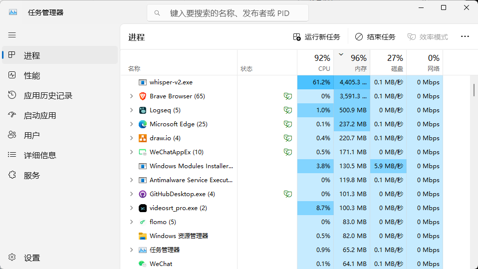

- [[手机]]
- [[为什么要用电脑？]]
- [PoorPlayers穷玩组的个人空间-PoorPlayers穷玩组个人主页-哔哩哔哩视频](https://space.bilibili.com/326251695)
- 不买电脑的可能理由
	- 难携带
	- 怕被偷泄露隐私
- 机箱、线材选择
- 自行组装与保养
  id:: 67b678ff-e5df-420b-a811-c49d522a3bc8
	- 装机
	  id:: 67b1d7b3-8ed9-43be-a120-2a32ddc32a8b
	  collapsed:: true
		- [【装机教程】全网最好的装机教程，没有之一_哔哩哔哩_bilibili](https://www.bilibili.com/video/BV1BG4y137mG)
	- 防尘
	- 除尘（清灰）
	- 上/换硅脂
	- 换WiFi模块
- TODO 定制（“绿色”）系统、主机、使用环境
  id:: 67b3ccc4-af06-4719-a14e-55e6236dcdf5
  collapsed:: true
	- “看了经典行为主义新闻想到的”
	- （好玩）更好学~~的，儿童用；其他中老年人用~~、不卡、不坏、傻子都能用的，所有人都可以用
	- “自己都不太会用，自然更没法限制别人”
	- ---
	- TODO [[AI]]用户条款分析
	  id:: 67be5860-2e2c-4420-ac70-573fdaae697d
		- ((67be58bd-b5eb-45b7-b7bf-3c3b568eb674))
	- 快速批量删装
	  id:: 67b3d178-d1ee-43ac-a7a5-4d1d29926620
		- ((679adda9-378a-4ec9-a22d-b02ba3b7e74b))
		- ((679adda9-42fa-4e52-8f34-3d0b73919d18))
		- ((679adda9-12aa-430e-b1da-831b10de55b4))
		- ((67b532e3-c941-4e39-a5cb-a488ae39791c))
		- ((679add7e-c93d-405e-989d-12a58f230396))
		- ((670d40f3-496d-4a58-b303-1e7d353f8033))
	- 网络限制（非知识类网站、百度网盘等）
		- ((677f6c87-31dc-47ec-bfc8-077088d9b0aa))
	- 定制学习队列
		- 下载
		- ((6730654f-5be3-46f4-9cf8-c0a50fc225b6))
	- “身边人的设备都给管管”
	- 旧手机
	  id:: 67b54d8b-ef40-46e0-a61f-46f9b4b51bd5
		- ((679add53-1456-4cbf-8d0d-b24567133099))
	- ((67ba688b-1c80-4bcc-879e-5ee861c7e4e4))
		- “从零（岁）开始的云开发之旅，并且把可能内置的游戏也禁了”
- 迷你主机
	- [这！是一台透明Mac mini的诞生过程！_哔哩哔哩_bilibili](https://www.bilibili.com/video/BV1FWfUYZE1z)
	  id:: 6799814f-408e-4602-98c3-c4de73ea90c5
	- ((65f78b91-84e4-4c20-a7ae-2a57d74dc901))
- 游戏主机
  id:: 67b41d59-8ffa-47a1-8108-c96f2199231c
- 一台主机多人同时用
	- 好电脑多人用
	- 笔记不知哪去了，反正是用一根线切换的（但那种是两主机一屏幕？）
	- ((6798841a-9ea7-471d-a379-36b066b4c714))
- 整机移动
  id:: 678a4dfd-2ca2-4518-ac31-930d072f01a0
	- 显示器电脑兜（可挂、扣线）
	- 理线一条龙
- ---
- [模板:硬件娘化 - 萌娘百科 万物皆可萌的百科全书](https://zh.moegirl.org.cn/Template:%E7%A1%AC%E4%BB%B6%E5%A8%98%E5%8C%96)
- 机箱
	- [廉政机箱，我可是一局游戏都不敢玩_哔哩哔哩_bilibili](https://www.bilibili.com/video/BV1PgbFeMEVs)
- CPU
  id:: 67b1d906-3baf-4d3f-a0b8-8cb0707b6b84
	- [【硬核科普】带你认识CPU第00期——什么是MOSFET_哔哩哔哩_bilibili](https://www.bilibili.com/video/BV1nL411x7jH)
	  id:: 67b1d90d-9cdd-4bc5-8697-74908a214c34
		- [MOS管符号箭头指向问题？ - 懒叫兽的回答 - 知乎](https://www.zhihu.com/question/27955221/answer/38848664)
- 硬盘
	- ((679adda9-8c06-431b-a20a-b7cb227a8d3c))
	- 闪存芯片
		- [硬盘可能要降价？强如三星，也得向国内厂商“借”技术了。](https://mp.weixin.qq.com/s/m81WxzFXdgcVQfkITgmxHw)
	- 硬盘盒/扩展坞
		- 方便数据迁移
		- [单硬盘换固态保留原始数据？笔记本扩容增速小白教程【小米/红米/联想等通用】_哔哩哔哩_bilibili](https://www.bilibili.com/video/BV1iP41187SW)
		  id:: 6791ce6f-cbd9-43af-afd9-9164212e51c4
- 显卡
	- [再穷不能穷教育，在苦不能苦孩子_哔哩哔哩_bilibili](https://www.bilibili.com/video/BV14zndejEG5)
- 显示器
  id:: 67402ac6-28c9-48b7-9494-fe71ca23ee5c
	- 左右可转
	- 一屏多机（kvm、双击scroll lock切换）
	- “面壁”
	- 显示屏
	  id:: 67a3fb37-b2c7-4b4a-b95f-ff2ed5d3b10e
		- 柔性屏
			- [不靠海归团队的DeepSeek成功了！留美博士光环加持的柔宇科技却破产了！](https://mp.weixin.qq.com/s/X5Ipie1DcHsHmx_k0MYMxg)
		- 拼接屏
	- ---
	- 记录
		- SANC H29PRO
- 电子白板
	- ((679c54bd-e1b4-4cbe-8bdf-bacbc3984b32))
- [[VR]]
- [[键盘]]
  id:: 67401414-2ba8-467b-91e6-5940f00f8d1f
- 鼠标
	- 按键自定义/宏（复制粘贴等）
	- 可设置高灵敏度减少手部磨损
	- 大小可能被形状重要
	- 轨迹球鼠标
	  id:: c5895c9a-7524-4ac0-a212-be1a18a3af9b
		- 手要足够大，否则就是换大拇指不舒服
		- 但是拇指操作感比较灵动倒是真的
		- 比垂直鼠标强得多
		- TODO 握持式轨迹球鼠标
- 手柄
	- 开源手柄
	- 异型手柄
		- 握力器
			- “握力个器啊！”
			- “我玩累了！我不想玩了！”
	- ((67402ab8-25f7-48d2-9e94-fd9f77ec6225))
	- ((667b89e8-be54-4fef-aa16-1a8248bdc3d3))
	- 掌机
		- [Be My Game Boy (feat. S3rl) - song by Yurino | Spotify](https://open.spotify.com/track/7MwK3jvd4OUzfmIOX1YDHA?si=95d1f23fe6bf45a8)
		  id:: 67583721-ae11-4553-b002-1f4ee5f1e98d
		- [乌军新型遥控机枪，为啥要用游戏机操作？丨轻武专栏](https://mp.weixin.qq.com/s/0abkMRD1sLxHiAfdtqANxQ)
		  id:: 677e7682-a15e-47f2-86f7-c3d01d88a1b2
- 数位板（白板直播）
- 打印机
  id:: 6799ed59-91c3-46dc-b930-24b9377027dd
	- [两台、多台电脑如何实现局域网打印机共享 - 哔哩哔哩](https://www.bilibili.com/opus/363502967965399478)
- ((679adcda-0351-4cbb-a0a2-5a1afdb740ce))
	- 电池管理
		- 提醒、自动充电
		  id:: 675815d6-7830-4929-8f01-a7514a0b4955
	- 电池负极生锈原因？
- ---
- 我的设备
	- “这是什么？个人使用设备申报？”
	- 24寸显示器包（应该能把这里的都装进去）
	- 便携显示器包
	  id:: 65f2790c-618c-4b93-a016-03c1e9422233
	  collapsed:: true
		- 便携显示器附的，没手提带
		- 以下可以装进去带出去跑，为什么不买笔记本电脑，因为一般屏幕和键盘不分开，用得不舒服
		- 别处简称“电脑包”
		- ---
		- 零刻SER5 PRO迷你主机 2077
		  id:: 65f78b91-84e4-4c20-a7ae-2a57d74dc901
			- 16G+500G。==现在是旧款了==，CPU是似乎并不比新款的R7-5700U差的R5-5600H，日常开logseq、飞书、浏览器看直播、上传到GitHub加起来CPU利用率一般不超过30%，内存使用量不到80%，500G硬盘不玩太多大游戏、下啥视频素材够用（“现在是有点不太够用了”）
				- 网卡连接稳定性差、网速慢，导致（抛开显卡也不够好不谈）用 ((66c1a0f2-3e27-43dc-8b89-26f4ee5c5218)) 串流时因为家里WiFi难连、易断连而基本玩不了一点
				  id:: 66c1a4c1-c569-4702-88bc-0af29922a694
				- 一些不大的游戏能玩（“3A大作”大概都不怎么能玩），最高能玩 [[we happy few]] 最高画质，有时快速移动鼠标时有点卡
				- 要干点活就更有点不太够用了，建议大家的主力机配置不低于我这台
				  collapsed:: true
					- {:height 263, :width 454}
						- ((668d4673-4f2f-4a63-a58a-6ff2db904fbe))
							- ((66934b21-3076-44f9-ab9c-c9c1b2e488c6))也差不多
				- 以前的用电记录
				  collapsed:: true
					- 时点估计
						- 开机最高50w，无工作10w，轻度码字工作15w，中度读写工作（如logseq重建索引）30w，开新软件最高52w，工作平均25w
					- 时段实测
						- 从开机到下载50分钟0.018度，平均21.6w；10时40分0.333度，平均31.2w
						- 夜间操作最后关机2小时0.036度，平均18w
						- 夜间开机界面起76分0.024度，平均18.9w
						- 开机12:48 0.338度，26.4w
						- 开机14:06，0.437，31w
						- 19v5ah锂电池
						  id:: 67402aac-ea19-4058-8bcc-9c6ae3791d06
							- 约5小时时开始降频或功耗？风扇显得无力？
							- 两次开机，5:58断电，15.8w
							- 21v1a充电器充满时间：4:18
			- 实际上没有徒步背包移动需求的话买大点的itx主机能便宜几百，空间大拓展性还更好，拎上车，自行车后货架也能装，骑车到处跑都不一定需要迷你主机——但好像需要220V电源，而220V移动电源好的比较贵
				- [1000元ITX装机！白色侧透颜值爆表，畅玩网游原子之心！【如舟】_哔哩哔哩_bilibili](https://www.bilibili.com/video/BV1fs4y157Hh)
				- [带着ITX主机去教室是什么体验？_哔哩哔哩_bilibili](https://www.bilibili.com/video/BV1bd4y147EH)
				- 别装花里胡哨的“光污染”风扇灯，因为真的是光污染
			- ((65ba5239-07b1-45c4-8b47-fe09a78658a0))
		- 19V5A锂电池 80（可直接给迷你主机供电，忙点4-5小时用完）、21V充电器（可以给锂电池充电，不确定是不是买时附的）
		- 插头保护套（防尘、打包外带防挤压、剐蹭，原装的注意放好，省得到时再买）
		- DC电源延长线（之前在一图书馆坐桌边发现迷你主机的原装电源线不够长）
		- Type-C全功能线（便携显示器附的，从迷你主机供电）
			- 可能用了一段时间后像其他线一样变松了，在用 ((66c17637-410c-429e-80b9-d7644352b02d)) 有线串流时稍微动一下就断连
		- HDMI线（可能带；我的迷你主机没有DP口，有些地方用的是DP口，且一时不能从电视等处搞到HDMI线）
		- 相思豆F760静音鼠标 10（可能比大多数静音鼠标静音）
			- >10元左右，很静音，护手方面也没觉得比之前多彩的垂直鼠标（有点不适应）还有罗技的轨迹球鼠标差，最近打算再加个腕托
		- 罗技K380薄膜蓝牙键盘 100（薄膜本就比较静音，指甲不长就行；据说山业的也不错，还有V型折叠键盘；小键盘较窄，可能更易导致圆肩（键盘靠近身体可能缓解圆肩，但手腕等不一定舒服））
		- Eweihome Q1 16寸便携显示器 1000
		  id:: 65a7a546-99df-4fb2-a6ce-77dd67b8e329
			- “买贵了是吧？”
			- [全新升级519元2K+CNC 14寸触摸屏推荐，加量不加价，附赠副屏专用桌面软件_哔哩哔哩_bilibili](https://www.bilibili.com/video/BV1wD421A7XH)
			- [299元拿下16寸 2.5K 100%色域 500亮度的显示器  真香定律 PS4 PS5 SWITCH 游戏机便携屏 便携式显示器_哔哩哔哩_bilibili](https://www.bilibili.com/video/BV1NZ1RYQEVZ)
			- [史上最丐最便宜的便携式显示器便携屏17寸便携屏幕_哔哩哔哩_bilibili](https://www.bilibili.com/video/BV1oz4y1H7Ww)
			- [18寸 240HZ 100%P3色域 便携显示器 仅支持DP信号  高端显卡游戏玩家看过来_哔哩哔哩_bilibili](https://www.bilibili.com/video/BV1xG2PY5Ej8)
	- 飞利浦243S7EHMB 24寸显示器 1000（算是比较护眼的常规显示器，现在买性价比可能不高，首先不够轻不够便携）
	  id:: 65a920d3-c65f-42f8-a13f-2772302b747e
	  collapsed:: true
		- 以前的用电记录
			- 显示器室内亮度8.5~8.7w
				- 从开机3:40，0.045，12.3
				- 从开机2:18，0.020，8.7
	- 索尼SRS-D5 2.1音响
		- 以前的用电记录
			- 关机0.5w，开机待机2w，正常音量音乐2w（？）
	- 闪克AU902麦克风 290（之前买过瘦些的PM401，给我爸用了，但可能他现在用的频率比我还低；现在用得多起来了，心形指向能够在爸妈在家时减少干扰）
	- 蓝牙耳机 
	  id:: 679add83-f5b0-4122-abe4-fae2975b5ef2
	  collapsed:: true
		- 420（感觉性价比OK）
		- 【淘宝】https://m.tb.cn/h.5J5RjE4676gWiM5?tk=KL1CW7vimV3 CZ0001 「发烧主动降噪蓝牙头戴式耳机手工定制智能重低音游戏other/其他无」
		  点击链接直接打开 或者 淘宝搜索直接打开
	- 淘宝“菜青虫手工店”七里顶5/7号充电电池
	  collapsed:: true
		- 1节7号：按钮 ((65d0ac85-02ba-489a-ba42-b0a9dee86763))
		- 2节7号：厨房秤、毫克秤、体重秤、手提秤、红外线体温计、指压式脉搏血氧仪、血压计、电视遥控器
		- 还需另购充电器（不带伸缩和短卡槽的还需要7号转5号电池转换筒）