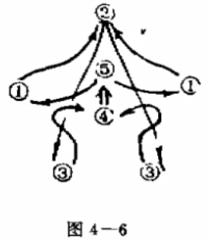
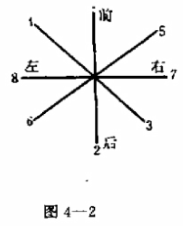
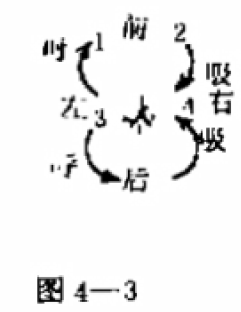
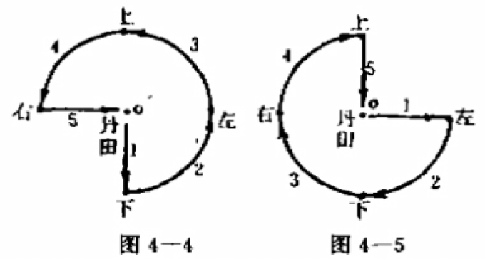

- 我每天就十几个小时网上冲浪，而且要分散于各种优先级不断灵活调整的主题，对于[[气功]]、[[特异功能]]、[[地外文明]]等没有货币乃至“主义”实在的内容的相对挑剔的证明和证伪是需要较多时间的（“啊你就是证明了又如何呢？”），目前优先级不高，因为人要两条腿走路，读者不赶时间的话我也就不赶时间了
  id:: 66f22b31-dbbf-4f54-b48e-e30455326187
- 对两册书的相关内容做了合并、简化、解释、补充和增加背景知识等的工作
	- ((65b99bca-8361-4733-87fa-ae570e31ea46))（日常-运动-经络......-“林渊、科学快速气功”及“经络、穴位、针灸”文件夹，有功法原书和针灸穴位图）
- ---
- 好的气功功法可能是怎样的？
  id:: 66f018d0-a908-452d-8fb9-8afa000d4946
	- 说明来源
	- 连贯，标准速度下不会不连贯，比如太快往复打断意念、气血的连贯运行
	- 容易通过加速等方式可持续地上强度、进阶，同时仍能保持连贯
	- ---
	- 创始人、重要推广者要长寿？不说羽化登仙至少要无疾而终？
		- 不能确定是史实的寿命我不看！
			- 倪海厦
			- [当武术家是个医生：长寿的“千斤大力王”——王子平](https://baijiahao.baidu.com/s?id=1802443209398419322)
		- ((66f3c64a-9039-47f6-a48f-462c6f16052b))
- 功法来源
  collapsed:: true
	- >自古以来，气功修炼都认为道心唯悟，只可心领，不可言传。所以修炼方法不可胜数，但能成家，自成一派以传后世的，都应是最后达到完满境地，否则早已被淘汰。据不完全统计，道家功法有近万种，而佛家功法有四万九千多，三教九流合计，总数不下十万种，谁也无法把所有功法综合起来，进行详细比较分析，去粗取精，分门别类归纳。正如古语所说：“法无定法，万法归宗”。“条条大路通道。”我们认为只要选取一种功法，与传统中医和现代西医的理论比较吻合的，用现代理论把它解开，那么十万种功法的现代化也会迎刃而解，所谓“一通百通”。
	  由于我们对功法的认识有限，就笔者所知道的，选取了**道家南宗天仙派的混元气功**功法作典型来解，很可能有更适合的功法被我们遗漏了，敬请读者指教。由于混元气功的**第一步是“经络功”**，第二步是“脏腑功（又称五行功）”，第三步是“混元功（人体内外混为一体）”，这样与目前中医理论和西医对人体的理论较吻合，易于用生理学和医学对它进行分析，更易于建立相应的基础理论，同时，也便于设计出适合现代人修炼的功法，使之成为系统理论。这就是本书取名《三百年与三干万年＜一＞一一现代气功探索》的主要缘由。
	- {{embed ((66dbeb2c-2d5f-4a7e-8eb7-85facae66db9))}}
	- 意念循经大小周天
	- 法四象： ((66ee9e00-4e8b-426d-8b01-fef9828272bc)) ——但是没看到，可能与那些视频的版本不太一样
	- 通三才：鹰爪功
- 可能的现象（气脉反应）
  collapsed:: true
	- 不出现是常态，不要刻意追求，以免“出偏”（不严重的自己也可以治，但没必要得）和（额外）影响练功、生活质量
		- ((66f3d15f-1db5-4431-9625-11b05f6c4a2a))
	- 持续的（温）热感
		- 天气、饮食都可能影响
	- 小腹（下丹田）、肚脐下抽动、胀感、拧巴
		- 可能是停顿较多、呼吸较多、逆腹式呼吸偏用力，可以对应减少，如果觉得没有大碍、没几次适应了也可以不管
		- 初步结丹是很快的，只是丹的质量/丹品大概还是最初级的雾丹
		- 练武术也比较容易有这样的感觉
	- 唾液（口水）分泌增多、清甜/甘甜
		- 可能在练功开始后到练功数小时后都比较明显
		- 与饮食也有一点关系，可能“清爽干练”些的饮食相比“浓油赤酱”的更容易——可能与刷牙等口腔清洁活动也有关系
	- 足底/涌泉热感
		- 上午练功后，午睡后可能出现
	- 体表附近酥麻
	  id:: 66effcc7-39d8-425f-8b16-d758b639783b
		- 练功做手下压等动作时更容易出现
		- 可能是离散、颗粒状的
		- 用“蚂蚁爬”不太准确，因为实际比那轻巧舒适（“没一本正经让蚂蚁上树过吧！”）
		- 也许以后会扩大范围、连成一片
			- 的确可以用意念触发，持续时间也会比各种“寒颤”、“寒噤”长，于根元在《你也能成为气功师》中用雨点描述（大概是毛毛雨），或许可叫作“心雨”吧
			- ((66d3b6f5-2367-47d2-a235-f9248270e9f7))
	- 肌肉抽动
		- 除小腹（下丹田）外，可能更多是肢端，尤其是手臂，可能因为动得较多，厚度和面积较小，经线和不同组织相对集中
		- 可能到了之前练功的时间也会抽动
		- 跳动正常（有时周围有响声也会触发跳动，当然最好是比较安全），说明有生命力，你身上没别的地方会跳动吗？有的对吧，心脏
	- 较长时间无饥饿感或饥饿感较弱
		- 有没有一种可能，你本来就不需要在不饿的情况下“到点吃饭”（不排除一根筋练过饭点的可能），可能你不“到点吃饭”并不会像不少相对不健康的人那样感到“刺挠”、“心慌”
		- 练功后逐渐往“气足不思食”的方向挪一点是正常的，并且“量变引起质变”，可能以后能自然进入至少几天不用吃饭的辟谷状态
	- 可能只是轻度但持续较久的喜悦
		- 轻安
	- 眉心发胀，尖端、印堂持续有像是尖端恐惧症那样有些不适的胀感
		- ((66e9690b-a48a-4162-8c0f-e5d8c8825712))
		- 注意收功收气入上丹田： ((66e9690b-a48a-4162-8c0f-e5d8c8825712))
		- 上丹田也初步结丹了，坚持练习，以后可以开天目
	- （偏）头疼
		- 可能因为（正好换枕头）枕头偏硬（是否侧睡？与疼的地方对得上吗？）、吹了冷风
- ---
- 以下不带引用格式的文本大多也是引文~~，相信读者能轻易区分~~
- 图4-1针灸挂图够不清晰，用其他替换了
- 先调结构，或同步调结构
- 一、目标和要求
  collapsed:: true
	- 用一年时间扩宽大周天（十二经；十二正经）、小周天（二经；任脉、督脉，奇经八脉）、带脉（一经；奇经八脉）通道。为高速、大容量地传输能量打好基础；同时训练体内与体外环境能量交换的能力。这两者同样重要，不可偏废，达到劳宫穴、百会穴、涌泉穴与外界开通，能感知外间炁场的强弱与冷热。
		- “一年太久？”
		  collapsed:: true
			- （第二册）第五章 科学快速气功生理学探索
				- 第一节 生理级功法的生理综述
					- 古代传统气功很强调筑基。一般习练气功者，先要花2一3年时间练习筑基功法。古代多与武术结合来练，为的是有一个健康强壮的身体，然后才进行气功修炼。沿着古代这一正确道路，科学快速气功的生理级功法，是现代科学的筑基功。通过炁血加速运行，练就一个健康强壮的身体；通过循三个环路十五条经络，相当全身一千个穴位同时针灸治疗，排除身上各种疾病，并调理全身机能，使身体处于最佳的生理状态；通过第一步较简单的功法动作训练，为以后高层次功法中的高难动作奠定基础。所以，它是气功修炼者必不可少的第一步。一定要练好才能进入第二步。基础没打牢，难以练好高层功法。
				- 第四节 气功出偏的生理探索
					- 四、没有筑基 
					  我国传统气功，自古以来都很强调筑基功，连小说的描写也充分地反映出来。高人收徒，先要其徒干两三年重体力劳动后才开始授功，其目的就是锻炼出一个好身体，锻炼出坚强的意志和毅力。不知什么原因，也不知什么时候开始，现在全国盛行不筑基的练功法，两三个月就能出功能，便可到处为人治病。据说更甚者，“神仙一把抓”只要学数小时，就可为人治病。“好事做得越多，功能长得越快”，简直风靡全国。我不知他们的理论根据是什么，又有哪些学功者凭这样练出了成果的实践经验。笔者曾接触到为数不少的这类练功者，出了点功能，但身体垮了，最后登门求救。经笔者检查，多是伤了元气，虽不像前述例子周全先生那么严重，但炁血都很弱，百病丛生。经笔者指导，用“科学快速功法”循经吐纳，积存能量、很快就纠偏，恢复健康。全国出现这样偏差的人难以计数。所以笔者极力主张从动功储能入手，在一册中举汽车蓄电瓶为例，是有充分依据的。如果不筑基，练功就等于慢性自杀。
		- “未必那么慢”
		  collapsed:: true
			- id:: 66e8148f-590b-4170-92f2-3192c5554ed5
			  >想不到报告会结束后，魏庭蓉师傅走到我跟前，竟称我为“大师”，并说我有较深的功夫和根底，使我处于尴尬的境地。我一再解释，对理论研究我已进行了三四年时间，而气功锻炼仅有一年零四个月，谈不上深功夫和根底。魏师傅接着说：“虽然你坐在堂后靠角上，我唱歌时感到你阵阵强烈的感应，这时才开始注意你，用ESP观察到你印堂前出现一阵阵红云，你的功夫怎能骗得过具有特异功能的人呢！”于是我向她介绍这三个月练习逆式腹呼吸法，并建立了上、中、下三个丹的情况。她对这功法给予高度的评价。
			  以上几个人的观察结果，可能仍有人怀疑。现正在进行研究和设计改进，企图用柯莱因照像术，把全过程拍照下来，到成功那一天，才能令人信服。
				- 林渊写书时55岁，练功一年零四个月已经开了天目、炼了三丹，已经达到了特异级，对应书中计划大概有练习时长两年半的水平，大概比零基础考四六级快些
			- id:: 66e813db-c280-4583-a3a6-a93c18778256
			  >对于这些功法和功能大家可能还难为相信。我还介绍最近出现的一个幸运儿，就是本章作者之一的毛渊珺同学，才十一岁。1988年8月中旬大雷雨后，出现很简单的特异功能。由于家长重视，并且有远见，从巩固和提高其功能入手，也就是按上述功法锻炼，只花十几个月时间，竟达到“真人”水平。唯“能体”（又称“结胎”）尚不能出窍。最后，由成都市昭觉寺，清定上师给他点开的，并以答应“皈依”保证不杀生为条件。清定上师还深有感概地说：“三四十年苦练才能达到的功力，想不到小毛十个月就已经达到了。你们修炼的功法是正确的。”
- 二、要领和安排
  collapsed:: true
	- >首先要花几天时间熟记经络位置和走向（要结合自身体位来进行）。然后，才开始动作和内炁运行锻炼。注意手上只是引导外炁在体外运行，意念导血引内炁于体内运行，开始三个月可能会枯燥无味，要用意志和毅力克服之。 三个月后会感到断断续续有热气运行。约半年才明显地感到炁在体内运行。到一年左右，当运行那一经时，全经有麻感（四肢上特强）而炁行的位置上有胀感，这时标志扩宽通道的成功，即大、小周天已打通。
		- 未必“首先要花几天时间熟记经络位置和走向。然后，才开始动作和内炁运行锻炼”
			- ((66e9690b-2206-4b0d-9099-340f8ea86fbb))
			- ((66dd1e9c-170c-4b88-8b57-0654ed78457d))
		- 未必“开始三个月可能会枯燥无味，要用意志和毅力克服之”
		  collapsed:: true
			- 上一条说了，可以拆分，可以合并，立刻开练，无需等待
			- 找个其他枯燥无味或有其他负面体验的事顶替掉，这叫忙里偷闲、今时得宽余
				- 你是在练功，立志成为天仙，那么一念成仙，你已经是天仙了，对你来说几乎是不在乎时间的，不要用审判凡人的眼光裁量你的活动的价值
			- 同时做其他事，买一赠一，捆绑销售，比如晒太阳，显然至少开头呼吸是可以在阳台晒晒背（两节大概7分钟左右，对很多人差不多就够了）的，别让晾着的衣服挡着
			- 找人一起练，互相教（可以分组教），比如动手动脚触摸循经，同时对方可以意念跟着——以后见人就这么摸传播知识，记住了吧？
				- 岂止于摸，有的功法是有双人模式的，也可以至少循个小周天，但是最好先筑基
					- ((66c9a2fd-e708-4d44-9d8b-0eb986019c85))
			- 对于循经的动画和体验可以有奇谲的想象（的预期——因为多套一层更吃性能，可能至少一开始不太能想得起来，而等你会了，也早就不再枯燥无味了）
- 三、注意事项
  collapsed:: true
	- 练功时要全神贯注，彻底抛开七情六欲。意念导血时，全身其它部位高度放松；练习期间，食欲增减，体重增减，包括房事都应顺其自然。俗话说：“神注不思睡，炁足不思食，精固不思欲”都是自然反映，应该出现精力充沛，体质渐增，处事效能提高的自感；如出现练功后疲倦，或对练功有反感，应立即停止练功，检查身体，或许是有病的反映。
		- 没能全神贯注、脑子里蹦画面也别紧张，让它神神
	- 注意剪指甲，否则可能影响学习循经和小周天、叩齿按耳门三穴的手势、手指接触
	- 补充事项（提到前面）：
		- 1.第一个月可先走姿势，熟练后，再导血引内炁运行，全身要高度放松。选择子时（23-1时）或午时（11-13时），及地炁强的地方练功，成效要高得多。
		  id:: 66e9690b-2206-4b0d-9099-340f8ea86fbb
			- 空气清新
			- 温度合适推荐赤足、晒太阳（偏热的话可以不晒或之后再穿衣服或避开阳光）
			- 按摩头皮等使意识清醒，更好运用意念
			- 练功前排便，便秘不适时不要练，腹泻后等身体恢复了再练
			- 避开饮食、性生活半小时以上
			- 注意身上痒了可能要洗头、洗澡，以免头部等瘙痒影响练功质量
			- 月经期间最好不练
			- 慢性病建议不要练强度太大的
			- ((66f3d1ad-31f1-4b23-aaf0-bf20d08225d4))
		- 2.到出现炁感后（约半年）可以将全部呼吸改为逆式腹呼吸。但切切不可猛收腹与吸气，只是顺其自然为度。因为打通大、小周天以前身体的生理自调能力仍不强，适应性低。
		- 3.炁感出现后，对经络中炁运行速度可感知，先让其按自身速度运行1～2个月，以后稍用血力来推它，渐渐提高运行速度。
		- 4.特别加强德行的修养，切忌动怒。一心多做好事，不做对不起别人的事。要建立“宁人人负我，我不负人”的宽阔胸怀。
		- 5.千万不要急于求成。生理级锻炼期不要急于采炁来填充丹田，企图积聚金丹。这一年主要任务是扩宽经络通道，排除本体一切疾病，使正炁（真气）存内以后，才能采炁建立纯正高质量的金丹。炁未纯而积丹，只能是杂炁一团，于己无益。
- 四、生理级练功
	- 所需时间：40分钟左右，初期如果边学边练可能要1.5小时以上
	- 各节的动作次数依次是逆时针的洛书数
	- |5|1|6|7|2|9|4|3|8|
	  |顺式呼吸|逆（腹）式呼吸10次|大周天，手上下六次|小周天|转带脉，左右各一来回|转九宫，应该是做一遍，先往八个方向荡，再晃一个“8”字|法四象，四来回，后两回手到头顶向外（左右两侧）翻掌|通三才|大循行|收功|
	- 1.准备动作
	- （一）入炁态 又分两节。
	  collapsed:: true
		- 1.顺平常吸气（顺式呼吸）
			- 此节目的是调动中丹田与手上六经的炁。
			- 两手掌心相向、十指相对呈环状、捧球状，双臂成圆弧形（“近似”）、抱球状，慢抬起提到中丹田（平肩，让肺张开，使吸到肺活量最大值的空气）。然后慢慢呼、吸各五次，愈慢愈好。呼开时，手拉开与人体双宽度等同便可，不宜过大或过小。
				- 可以凭感觉切换呼吸，做到呼吸间隔可持续，不用读秒（一般比实际快）、硬凑整数，否则可能“欲速则不达”
		- 2.逆（腹）式呼吸
			- 吸（压）呼（松）十次（可能比上节顺式呼吸快，赶时间的话应该是这样），同时轻闭目。要领是：由胸呼吸转腹呼吸，形意气三者一致，随安静而入气功态。
		- 两手（左下右上，或者说左内右外）掌心放在脐上，运用以血运炁原理，尽最大肺活量吸气，吸气时，全身体积收积收缩1/10（腹部胸部全收缩）气问下丹田收，感到气充满全身细胞时为止。呼时全身放松、扩大，此节目的是利用升高血压来激发全身所有细胞和经络。
			- 入气态是做功的准备动作，在动员和激发全身细胞和经络基础上练功，虽各节功法的动作只做几下，但都是处于全身激发到最高水乎上进行的。实质上等于短时间高水平地练了十几种功法动作，所以是科学快速功法。
- 2.内系统循经吐纳，（2）、（3）、（4)节把体内激发至最佳状态。
- （二）大周天（十二正经版）
	- 肩部可能需要 ((66ade372-deeb-482f-b04d-2dfa41f90490))
	- 治病最大效果，就是这十二条经的循行。
	- 先吸气入胸，手呈一并状，于膻（dàn）中准备循经吐纳时作上下移动（参阅图4-6活动路线）。
		- 吸气时应该可以走肺经体内经线
		- 
		  id:: 66f01e37-def1-4aa5-b121-e5b2b08b2d84
	- 手三阴经和足三阳经压手呼气；手三阳经和足三阴经抬手吸气。
	- 手上下动作之数为六（也就是共12次，每4次循环一次，共循环3次）。要领是：行炁笼统（宏观）、熟悉经络（微观），左右平行、承接连续、呼吸均匀、聚散灵活。
	- 循经时全身放松，顺着经随意念用劲，左右两边对称循经（同步走）用同等速度均衡运行。呼气时，要自然出气，仍随意念用劲循经运炁。
	- 科学快速循经
	  id:: 66dd1e9c-170c-4b88-8b57-0654ed78457d
		- 主要用于要走十二正经因而最难入门的两节：大周天、大循行
		- ((66db8abf-36e7-46e2-a9a5-cf5e95566a16)) 读者大多都做过几年，虽然不一定认真做，穴位（比如四白穴）也不一定找得准，所以效果也不一定好，现在有名师指导（“先生不知何许人也”），大概能快准狠地学习有益全身健康的体操
		- 主要的参考图
			- [最新国家标准针灸穴位图_高清图集_新浪网](http://slide.health.sina.com.cn/d/slide_31_28379_32704.html#p=1)
			  id:: 66e383a9-026e-4352-865c-97e984bbff2d
				- 比较简单，体表经线，三个视角三张图，可以拼图
					- ((66db8ac4-c467-4cbc-902c-6b8c0dd6cec4))
			- ((668f8be4-2fcd-4296-a4d7-19463b6a2d9d)) 有经络图，比较复杂，嫌复杂可以减少转角，拉直线段，就像上面的针灸穴位图一样
				- 骨骼、器官等认不出来可以先看全身解剖图或 ((666a4a04-5aa3-494b-b963-e4e6194459d0))
		- 走不走体内经线？走不走支脉？
			- 书中教的（那张够模糊所以在此省略的针灸穴位图，以及文字描述）似乎主要是在体表经线循经，不走可能交接的支脉，而 ((668f8be4-2fcd-4296-a4d7-19463b6a2d9d)) 还显示体内经线
			- 个人认为可以按交接所需的最短路径走，也就是可以走体内经线和支脉，而且不走其他不交接的路径，但这么走效果会否更好还不太确定——不太确定写书的几位老师就是这么练的还是为了方便教授，但即便是后者，可能他们也比较过，认为差异不大
			- 可以根据实际情况（比如可用的学习、练习时间的多寡）灵活调整难度
		- 为什么不同来源的十二经脉图的体表、体内经线形状不一？有更精确的吗？
			- 体内经线是根据《灵枢·经脉》描述画的？
			- 体外经线是根据《灵枢·经脉》描述画的，或是根据针灸实践中确定的穴位散点拟合而成（因为其作者不重视气功或内丹修炼？），还是兼而有之？
			- 有内视者画的版本吗？
				- ((66f159b2-7d4b-44c4-bc31-82148a127d94)) 根据胎息内视经验讲了一个“如环之无端”的像是（“我联想到的”）地球上的有上有下、有左有右、有顺时针转有逆时针转有对称（相对赤道对称；身体左侧与右侧循经方向相反）、同侧中间也有对称（肘、膝以下手、足阴阳经双向回旋——这里似乎不同于近赤道、远赤道都回旋的地球洋流）、有表层（体表）有深层（体内）、甚至（可）能（先减速再）逆转（可能因为气候或健康状况变化）的洋流的版本，但没直接画出来，但根据文字和表格描述以及“外视”辅助可以想象，要按那个流向全身一起练的话大概也比较难
					- 谢明德在 ((66d557e6-588f-44b7-9f3b-0adcb136db41)) 第5页的配图有部分相似的特征
					- >正常人每行一个呼吸之时，其左侧约正运行二次负运行二次，右侧亦正运行二次负运行二次。
						- 按大概稍早时代正常人的呼吸频率15次呼吸/分算，经炁“振荡”的频率约1赫兹
						- 速度还是一呼吸六寸吗？还是说速度会变化进而表现出步进从而实现回旋吗？
		- 十二经脉的命名与位置的关系
			- 阴阳二分
				- 内阴外阳（手臂内侧、腿脚内侧为阴），前阴后阳（背朝太阳为阳）
			- 手足二分（十二经脉都经过手或足，手或足是其起点或终点，手经不过足，足经不过手），走向四分（括号内为终点）
				- 手阴（手）-手阳（头）-足阳（足）-足阴（胸腹/脏腑）
			- 将每四根经视为一组，三组对称（阴阳阳阴）依次分别（在整体上）互相区分为内（阴）或外（阳）的前、后、中三侧，即第一组都是前侧，以此类推
				- ((66e383a9-026e-4352-865c-97e984bbff2d))
			- https://pic1.zhimg.com/v2-71498733dffa02a23c4f7120797a56c1.webp
				- [十二经络的命名规则是什么？ - 知乎](https://www.zhihu.com/question/24950951)
			- 表示每条经脉的两个大写英文字母是其全称的缩写，经脉上的穴位则按循行顺序加上数字
			- 身体左右两侧都有同名穴位，大致是对称的
			- 脏腑，分为五脏六腑，加上一个心包，就是十二
		- 找丹田
		- 摸穴位、经线
		  collapsed:: true
			- “走线，不可不慎”
			- 据说这叫“经络疗法”
			- 完整摸一遍可能要2~4小时，时间少可以减少或不精准定位
			- 穴位定位、循经参考视频
				- 真男人演示，但难度可能更多来自比划比划而不是看看，不一定好用，可不看
				- [初阶（上）谢锡亮《针灸基本功》十二经络同身寸真人定位取穴演示_哔哩哔哩_bilibili](https://www.bilibili.com/video/BV1oM411r7BN)
				- [十二经经络与腧穴实训指导_哔哩哔哩_bilibili](https://www.bilibili.com/video/BV1pW411P7sf)
			- 重点
			  collapsed:: true
				- 交接点（经脉起点/某一终点，大部分在体表）
					- https://img.cndoct.com/upload/202304/03/202304031528579191.png
				- 转折点
					- 觉得复杂可以拉直，反正你在内视经络前也不确定到底实际的“自主”经线偏离多少，而偏离不大也不是大问题，就像磁吸在一定距离内都能吸上去“回正”
			- 每次记几个比较关键的穴位即可
			- 找准经线途经的穴位、脏腑等的位置，以及比较简洁的注意事项和对经线的描述
			- 推荐照镜子，尤其是不太能直接看到的头、颈、背等
			- 手指按/戳、划/揉（掌指关节）/刮，手握（比如肩胛冈、股内侧肌——“鸡胸肉、鸡全腿还是鱼柳？”），提脖子（大概是两侧的胸锁乳突肌，这下 ((6699d14d-680a-4100-b1ba-06493e9bb41f)) 出巨人了）
			- 屈肘、转肩
			- 食指头约1寸，直尺、皮尺、卷尺量
			- 定位
				- 可以瞳孔、鼻翼、口角、乳头（距前正中线4寸）等参照物、移动穴位及穴位附近突出凹陷等辅助定位，
			- 其他穴位
			- 还不确定精准位置但不影响大致走向的穴位可以跳过，一寸左右的偏差对意念循经没多大影响，实际上一开始意念在不用眼睛盯着辅助的情况下也难定位到那么精细
			- 胃经关键穴位，大迎
			- 脾经上到腹股沟的冲门后边上边“（小）外-内-外-内”，入胃入心
			- 膀胱经头部内外内内，然后入两侧脑，
			- 小肠经，交接支脉，沿颧（quán）骨下缘，绕道鼻翼下端，上行至内眼角
			- 肾经，照海穴在内踝尖（“隆起的骨头”）下1寸，入会阴（这时可以适度收缩会阴“提气”），绕后，上入尾骨、骶骨，上走脊柱内部，从腰椎侧向后穿出，走肾、肺、心包（心外，“不走心”）
			- 心包经，绕心外、肋内外旋，出乳头外侧，走手臂内侧（过肘后走）中线至中指/无名指（交接支脉）
			- 三焦经，天井穴在肘后区，肘尖上1寸凹陷中，绕耳
			- 胆经，环跳穴
			- 肝经，脐下，骶骨对面，肋间旋
		- 找脏腑
		- 参考图放在中间（可能会无意被键盘等挡着所以放到旁边），减少重心变化对身体两侧练功的影响
		- 意念循经时加速参考、缩短停顿
		  id:: 66ee244e-9709-464d-8138-80757b48b97d
			- 够高的手机支架（方便按罢了）
			- 图片
				- ((66e383a9-026e-4352-865c-97e984bbff2d))
				- 保存图片、截图-“下一个”（对于竖图，显示器可以调显示方向放大——“疑似有点麻烦了”）、拼图、打印（可能一般的纸也不是很大；可以贴、磁吸、夹子挂钩挂，在户外也可以看着练）、投影
			- 视频（“疑似有点多此一举了”）
				- 录屏、做视频（比如“PPT视频”）
				- 视频调速、剪辑
		- 意念（行气）循经
			- 偏重一侧的话，等相对熟练了可以偏重另一侧
			- 放慢呼吸和动作，否则意念更容易跟不上
				- 不够了可以轻快吸气补充再继续慢呼气
			- 意念跑开、聚焦慢、精确定位慢不要急，可能越急越慢
			- 多路并进，多管齐下，拆解练习，断点续传，控制变量
				- 中途停顿和姿势变化（大概）并不会让本身还没啥“火”的人“出偏”、“走火入魔”——下头类比一下，那些“寸止”过的男同胞们（都）“走火入魔”、性功能障碍了吗？
				- 自然呼吸，不用意念控制循经，根据描述边看（衣服会挡着，最好脱衣；可以看镜子，还可以贴纸、涂色标记关键点乃至经线，但那样的成本可能偏大）边摸穴位（有些地方是不太好摸，比如摸不到骨骼、关节），摸了几个/一段穴位后划经线，想象体内经线（“这把AR增强现实了”），最后把几段拼成完整的一经的交接路线
				- 另一侧的交接路线可以通过想象对称过去，或者采用同样方法
				- 实际循经时综合呼吸、姿势、触-压觉（可以提前稍微用点力留下轻微痛感等）、温觉、痛觉、视觉（不确定时可以看低头看）、想象、意念（“注意”），做到全部或部分同步
					- 皮肤、筋膜、肌肉等的拉伸感（小周天等也一样），以及贴着、绷在骨骼上的压力，比如贴肩胛冈的手三阳
					- 意念可以激发、维持（“注意”）、增强（或增敏）、移动感觉
					- 姿势位置可以作为意念定位和同步参考，比如手平肩时意念大概要在肩部或附近
					- 随着姿势变化，与姿势、重力相关的（更细微的）本体感觉等也可作为意念定位的参考，比如在循手三阳的手上提时，可以帮助意念在手、手臂、肩、颈、头定位，进而优化与姿势的同步
					- 可以想象意念位置膨胀（比如从似乎没看见的点到看见了的球）、翻滚转卷（比如胆经交接支脉到拇趾下穿上翻）、摩擦剐蹭等强化意念相关感知
					- 循经时意念相关感觉可能很不明显（“来了吗？到底来没来？如~来~”），为了（“尽快”）“习得”这种感觉，呼吸、姿势、意念都可以全部或部分同步地在穴位“断点续传”（“像是地铁车门上的地铁线路灯或某些游戏的地图式的关卡点线”——“这下全市地铁线路图上跑工作细胞了”）或整根经重来，可以控制变量，但不要太多次，以防岔炁过多，如果多次循经失败，建议先不用意念做下去，然后注意收功、放松和休息
						- 停顿时减慢呼吸，不过度憋气
						- 中间可以暂时先不同步，比如练循足经时手上行程相对更短、骨盆以下超出手部行程，可以慢慢压，比如转弯的地方你再瞅一眼，然后回来再压一次，但次数也不要太多
		- ((66e9690b-7122-4ab0-9af6-be4ef608a477))
			- 三经三角（手三阳眼鼻三角）
		- 意识与意念，认识与实践
		  collapsed:: true
			- 意识显然不只能相对被动地观察，它可以操作“外部世界”和“人体”的观念浮想联翩，也可以控制我们的运动，我们可以跑步、走路，也可以相对缓慢地蠕动、旋转（大概是有助脊柱的动作），相对静止地站桩，还可以在较小尺度鼓起肱二头肌，收缩肛门括约肌、会阴、PC肌控制排便和排尿，挺起耳朵（大概还有头皮），扩大鼻孔，我们可以控制呼吸，在游泳池或浴缸的水中憋气并体会水里水外的不同，我们可以借助或不借助呼吸调节血压、脉搏，我们可以通过性幻想让生殖器发生变化，专注时（有意识吗？可以是很有的，下次专注时记得试试）会听而不闻（“啊？”）、视而不见，或许我们还可以测试意识的更多能力，但有时我们不一定抓得住这样的机会，长辈们或许说过“心静自然凉”，但已经装好的空调可能还是比较方便，出汗不舒服（还要加上衣服汗湿的），还会掉妆、身上会有汗味，我们就开空调了，于是我们就错过了这样一个“浪费时间”测试和增强调温能力直至的能力的机会，人似乎应该是“恒温”动物，但也许对同样的温度我们的感觉和耐受性在持续变化，似乎我们是越来越怕热怕冷了，如果能有意识地控制散热、发热就好了
			- 不好意思，自主神经可以“自主”，可以通过有意识的呼吸控制
			- “常识”（或者“传统”、“习俗”乃至“社会规范”）与“科学”，很多已经冲突过一次了（可能前面还有“没有常识”与“常识”），很多人欣喜于自己能够更加信赖“科学”，同时有力驳斥了长辈们大概是不假思索的错误观念，但可能我们还需要继续冲突下去，才能向真理更进一步
			- 我们有很多间接认识
			- 我们更习惯“意识”这一源于佛教和现代生物学的术语和常用语，可能会不太在乎乃至轻视“意念”，但是“意念”到底是什么？“有意识地”？
			- 我们习惯的运动的符号大多在人体之外，现代人似乎比较无暇关心我们的身体
	- 手三阴到位后手掌自然朝下
	- 第一步调整到左右同步、均衡、匀速，以后再加力气，速度慢了，又慢慢训练运行快些，这样不断扩展经络通道。
	- 手上下时尽量圆滑，不要死角，要保持弧度。
	- 循经完了后，意念把外边炁收回来，双手搂炁，把炁收回下丹田。（可以与小周天衔接）
	- 内气循：手太阴肺经（呼）→手阴明大肠经（吸）→足阳明胃经（呼）→足太阴脾经（吸）→手少阴心经（呼）→手太阳小肠（吸）→足太阳膀胱经（呼）→足少阴肾经（吸）→手厥阴心包经→（呼）→手少阳三焦经（吸）→足少阳胆经（呼）→足厥阴肝经（吸），此为一大周天。
	  collapsed:: true
		- 1.手太阴肺经。中府穴（肩前销骨）（呼气、掌朝上、下放）至少商穴（拇指甲旁）。
		- 2.手阳明大肠经。商阳穴（食指甲后）（吸气、掌朝下，上提）至迎香穴（鼻子旁）。
		- 3.足阳明胃经。承泣穴（下眼皮中）（呼气，掌朝下、下压）至厉兑穴（脚二指甲后）。
			- 在循胃经时，若气不足，可停在气冲穴很快吸一口气，然后再接下去。
		- 4.足太阴脾经。隐白穴（足拇指内侧）（吸气，掌朝上，上提）至大包穴（腑下六肋）。
		- 5.手少阴心经。极泉穴（腑窝中）（呼气、掌朝上、下放）至少冲穴（小指挠侧）。
		- 6.手太阳小肠经。少泽穴（小指外侧）（吸气、掌朝下，上提）至听宫穴（耳屏前）。
		- 7.足太阳膀胱经。晴明穴（眼内眦）（呼气，掌朝下，下压）至至阴穴（脚小指外侧）。
			- 循膀胱经时，在白环俞、秩边穴（均在臀上）很快吸一口气，再接下去。
		- 8.足少阴肾经。涌泉穴（脚掌心前）（吸气，掌朝上、上提）至俞府穴（锁骨内下）。
		- 9.手厥阴心包经。天池穴（乳头外侧）（呼气、掌朝上、下放）至中冲穴（手中子尖）。
		- 10.手少阳三焦经。关冲穴（无名指甲侧）（吸气、掌朝下、上提）至丝竹空穴（眉梢外侧）。
		- 11.足少阳胆经。瞳子胶穴（眼外眦）（呼气，掌朝下，下压）至足窍阴穴（足四指外侧）。
			- 循胆经时，在维道穴很快吸一口气，再运下去。
		- 12.足厥阴肝经。大敦穴（足拇指外侧）（吸气、掌朝上，上提）至期门穴（乳头下四寸）。
- （三）小周天（由任走督）
	- 双手十指相对掌心向上，中指相接放于小腹前。内炁循腹中线任脉至承浆穴换接督脉，过聪会穴转呼气。双手下压掌心向下内炁循背中线回到会阴，为一小周天。共作七次。要领是：掌握换气、内炁承接连续。舌抵上颚齿跟以搭炁桥。并提会阴，用点劲提炁，炁顺任脉上，顺督脉下（用解便的劲）。
	- 从任脉走督脉的原理如下：
		- （1）自古以来所有功法均为督脉走任脉，其作用是因进入光丹水平后，丹田同向转动能发出高能级的紫色光，有较强的功力。
		- （2）这一练功法，却遇到生理上的极大困难。督脉起于会阴穴，很近距离就转到脊椎末端的长强穴小孔（俗称尾间关）进入脊椎运行，到背中又有夹脊关，到后枕又有玉枕关，从会阴开始运无，只有微弱无流去冲开这三关是事倍功半之举。
		- （3）现在改由任脉走督脉，由于经络中炁的运行有“行波放大作用”，以几十倍于上述功法的炁场能量，倒灌脊推中去冲三关，尤如打汽筒那样去加压。只需2一3个月就能同时打通三关，但将来只能获得略低能级的青光（或兰光）。故在第二阶段气功级锻炼期功法中，将炁改分两支，分别顺任、督二脉同时走，到百会穴会合后，沿体内中轴贯三丹田而下会阴穴，到进入光丹层次后，旋转丹田同时可获得紫光与青光，或顺督走任获紫光，顺任走督获青光。这样就胜于古代的切功法，而练的时间短得多。
		- 这些原理在你开天目以后，就能自我看得清清楚楚。在学功初期，每人都可细心地试下，顺督走任和顺任走督无流强弱的自我感觉，粗略地自我鉴别。
- （四）转带脉
	- 转带脉作用是把各条经络贯通。
	- 1.起势同上（三）。双手十指相对，掌心向上，
	- 2.屈臂随吸气掌心向上，慢慢抬起，先向右侧平举。同时扭转身体90°（双脚不动），在转体时，双手可慢慢抬到胸前；意念内炁从神厥穴内穿下丹田至（腰阳关、）命门穴。
	- 3.再随呼气掌心向下翻掌转回，压手转向正中双手过胸。意念内炁分左右两支沿身体两侧（即带脉）从体表转回至神厥穴。
	- 4.然后按此动作向左转体。左右各二次。要领是：转体自如，双足不动，内炁按磁力线运行 。
- 3.开通内外能量交换通道
- （五）运九宫
	- 此法作用是激励内外无场交换能量。
	- 把人体比拟成一个陀螺，晃动起来与地磁场激起动态能量交换。把人变为轴线，顶天立地，开始把炁收在百会至会阴轴线上（吸）。晃动时，身体保持直线。向前晃，提脚跟，双手往后（双掌收在小窝前）；向后晃，提脚尖，双手向前伸，两手起平衡作用。
		- 也锻炼脚，可以配合 ((66a83f0f-19f7-4990-9377-59cd33dff962)) 、 ((66ade371-3078-4a62-8a59-64d43f5a608b))练习
		- 运动前转脚踝、脚踝左右倾（脚外侧、内侧着地）、脚趾空抓热身
	- 倾斜的过程呼气，全身放松，炁收回体内呈圆柱形与体形同。
	- 从倾斜到返回直立过程中，吸气紧收。使炁成为顶天立地轴线。
	- 晃动幅度要大，身要直，又要稳。
	- 转脚腕、脚趾空抓握热身
	- 反正是向后比较难
	- 相对的方向可以先分开做，以后慢慢加速到连续
	- 1.屈臂掌心向前平胸，按（图4-2）顺序晃体。向外倾时呼气，收体时吸气。体前倾时，屈臂向后用力，体后斜时手臂向前直伸以平衡身体。
		- 
		- “退！退！退！退！”
	- 2.最后按图4-3示意完成九宫运转。要领是：足稳身直、保持整体。关键是靠脚尖和脚跟的提放来控制。
		- 
	- 3.吸气时，意念内炁归在百会穴至会阴穴的中线（黄道）上。呼气时内炁放松成柱形。
- （六）法四象
	- 此法是佛家洗髓功法的发展，目的是打通百会穴与涌泉穴，双手象猴掌，用劳宫穴吸气，乎室头顶，只吸2/3的气，然后双手翻掌时用劳宫、百会猛吸1/3口天上的气，然后还是以血运然。内从百会直贯全身，意念病炁从涌泉排出（可能感到涌泉有热流——“这下涌温泉了”），与此同时，手抱外炁像抱球状下。
	  id:: 66e9690b-f603-459c-a7d0-c848fc089c09
	- 想象头顶淋浴，水沿身体流下
	- 翻掌可能需要转手腕热身（ ((66f018d4-2fcb-4ebd-92e2-5eade458fc8d)) 、咏春拳的一摊三伏手）
	- ((66effcc7-39d8-425f-8b16-d758b639783b))
	  id:: 66efc980-013c-4771-9c5e-4692b412d1fb
	- 动作要慢、舒畅、自然。
	- 1.双手自然下垂手心向后 。
	- 2.随吸气屈肘成猴掌上抬。手过头顶翻掌向上过程中，劳宫穴先下后上从外吸炁。
	- 3.分开双臂，双手相对呈环状。随呼气双手从两侧下压于腰同时双膝微弯。内炁从百会穴进入直贯全身，从涌泉穴排到地下。连作四次。要领是：翻掌时前两次双手平行，后两次双手向外。
- （七）通三才
	- 这是鹰爪功的发展，目的是打通劳宫穴，此法能较快打通劳穴。
	- 手握拳热身
	- 鹰爪，可能手指不要过度后缩，而是像抓坛子（或者大玻璃杯）一样
		- ((66f3b860-1c3f-4b7c-864a-832267f1e877))
	- 吸气时，手便会慢慢浮起，手要伸直，气吸2/3，留1/3，待双手平举时，手挺直，稍用劲一下变成鹰抓/爪（突然爆发力），吸气（炁由劳宫穴入中丹田），气满后慢呼气，双手向后划180°，身慢慢前弯90°，又鹰抓/爪一下（炁从劳宫穴入；这里可能也要猛吸气，但不多)如是三次，最后呼气还原。
	- 1.起式同（六）。
	- 2.随吸气双臂伸直向前平举，翻掌向前成鹰爪同时猛吸气。
	- 3.随呼气双臂伸直向后画180度同时弯腰90度。
	- 4.随吸气双臂向前画180度，同时伸腰还原成2式。
	- 如此三次后自然站立。要领是：意随掌心接通三才（即天、地、人之炁息）。
	- 4.体内，体外炁场的运行与交换。
- （八）大循行
  id:: 66e9690b-7122-4ab0-9af6-be4ef608a477
	- 一次循三经
		- ((66e383a9-026e-4352-865c-97e984bbff2d))
	- 一次循一经也行，一经和其他经在中途串了也行
	- 严格说来，真正练功就是第八节，大循行，这八下运炁是此功法高潮。正如动功静功机理一节中所介绍的参数，大循行可在上述这方面准备后，把呼吸次数，脉搏次数，血压等生理参数提高一倍，
		- 主要是初期马步有点费力
		- 膝关节不要往前突，屈膝、搓膝盖热身。平时注意膝关节保暖（ ((66db8ad0-ea21-42f8-a36e-5f2a1fa58a4b)) ），膝关节不适不要练，或者减少次数，觉得不OK了就停
			- [【达摩易筋洗髓功【完整版】】 【精准空降到 23:47】](https://www.bilibili.com/video/BV1AQ4y177RV/?share_source=copy_web&vd_source=24175964b0df2fcc2c022cae23517fdc&t=1427)
		- 马步宽度较小，不蹲到底，宁多往后撅屁股，不把膝盖过脚尖
		- 不用蹲到大腿平行于地面
		- 深蹲？
	- 但光作这一节，则不可能达到这一水平。
	- 准备工作：马步，上体要直（一开始可以不直，膝关节很重要）。双手从下搂炁上抬（吸气），炁从下丹田→上丹田→沿手三阴下→手三阳上至百会穴后转足三阳下→沿足三阴上。手尖对脚尖，意念他们相通一次，双手楼外炁到下腹前成抱球状。内炁沿涌泉上，至下丹田，双手抱炁球转动五下（大概每下都换个方向），同时硬吸五口气不呼气。使内外无球感应转动，这时，上、中、下三丹田应均有扭动感觉。
	- 做大循行时还是以血运炁用点劲，呼吸要和动作配合好，愈做愈快，用力愈来愈大，吸呼气也愈来愈多，一次比一次炁感强，才能到最高动极点。
	- 按图4-6所示，照下列各节练习：
		- ((66f01e37-def1-4aa5-b121-e5b2b08b2d84))
	- 1.起式：马步，转直立。两手呈环状屈臂随吸气抬至锁骨下，下丹田内炁同时上抬；
	- 2.两手下压至腹，双膝微弯，循手三阴经脉宏观运炁并呼气。
	- 3.双臂伸直其间呈90度斜向上举过头，双膝伸直，循手三阳经脉宏观运炁并吸气。
	- 4.两臂分开双手于头顶侧呈环状，再经身体两则下压，最后自然垂于双腿前手足十指（趾）相对，同时两膝亦呈90度下弯， 循足三阳经宏观运炁并呼气。
	- 5.双手收回于脐部，两膝不动。转吸气同时内炁循足三阴经脉会于脐中，再连吸五口气，同时下丹田内炁与手上炁球接通五次，呼气。
	- 6.呼气后：双后随吸气继续上抬还原成1式，内炁入五脏六腑后再上升，完成足三阴经全程。
	- 共作八次，要领与（二）式同。
- 5.收功
- （九）收功
	- 收功分别收哪些经
	- 由于本功法对体内和外环境炁场的充分调动，所以收功复杂。练此功者一定要先练好各收功动作。请注意，所有古今收功方法都收不了此功，而此功法的收功方法却能收住其他功。
	- 向右转体90°后分如下五式进行：
	- 收功时，先整体向右转90°，眼微开。
	- 1.转脐，是要炁归下丹田（即连接肠胃的膜上）。
	- 眼微睁（是可以的）两手叠于脐上分二步；（1）右手在左手上按照图4-4绕脐转六圈；（2）左手在右手上按照图4-5绕脐转五圈。要领是：手转动吸气 ，并用意念把体外、体内的炁漩涡状收向下丹田，转时肺吸气用点力，收得好，能使雾丹变炁丹（要用逆式呼吸）。每转一次停止于0位置时，轻轻呼气，全身放松。
		- 
	- 2.揉眉，是调理肝胆经肺大肠经的。
	  id:: 66e9690b-a48a-4162-8c0f-e5d8c8825712
		- 没说睁眼闭眼，也许还是眼微睁，但感觉有点怪，还是闭眼吧
		- 按图4-6示意以大拇指骨节（拇指掌指关节）照下式推揉：
		- （1）随呼气，顺起于鼻领（大概是鼻梁上部）循眼（眼眶），先由下向外，再由上向内会于眉心向上行半寸（约1.5cm；“轮刮眼眶先下后上”）
		- （2）随吸气循眼内角（大概沿鼻）下揉至鼻鞍（大概是鼻翼之上的骨骼，或者其与肉质鼻翼的连接部分）后分开至颧（quán）骨内侧（大概是沿颧骨下部向外但不越过颧骨最下端到颧骨外侧）
		- （3）最后倒行揉至鼻鞍，此为一次（大概不要继续往上揉到鼻领），共揉五次
		- ==要领：吸气时，用意念将头外，头内的炁收入上丹田。==
	- 3.叩齿。（大概还是眼微睁或闭眼）双手中间三指分别按耳门三穴（耳屏前），以大指掌骨托住两侧下颌骨，轻叩齿五次。
		- 一次叩一下感觉力度不够、角度不对（牙齐的现代人不多）可以叩几下
	- 4.调息。双眼睁开，手成环状，参阅大周天动作上下活动，轻呼吸六次（呼、吸各6次）。要领：吸气时，用意念将体外体内的炁收入中丹田（可能百会穴也要想象向内“吸炁”）。呼气时，意念将体内邪炁排出身外（可能走涌泉穴，也许也可以想象百会穴向外呼炁）。
		- (4)调息：开眼
		  把全身剩余的无，用意念收入中丹田，慢呼吸（不到1/4一1/3
		  州：），呼气时身体放松，把杂无排出体外，吸气时把体内无收入
		  川。动作愈慢愈好。
		  传到第四次时，手举高点，把无意念从膀胱经下。
		  要求做完之后会感到全身平稳下来，生理指标回到标推值。这
		  "心际.1就是动中修静法（超级功法）之一。当体内极动时，用意念
		  均测呼吸变慢，无血运行变慢，为练超级功法打下基础。
		- ((66f01e37-def1-4aa5-b121-e5b2b08b2d84))
	- 5.压指。双手合掌十指相接。在锁骨线、脐、横线，两乳直线间从上到下，从右到左，一压一松，呈折线运行共压12次，再挺胸稍停收功。压时瞬间吸气，移动位置时吸气。
		- 应该是睁眼
		- 转手腕、压手腕热身，一开始下降和左右移的幅度和压指力度较轻柔，手可以高于脐，以免出现不适和软骨受损（当然一般是很轻微的可以很快恢复的）
		- 没说合掌后的十指朝向，那么避免受伤大概可以朝前乃至朝下
- ---
- 第三章 科学快速功法
	- 第一节 科学快速功法概述
	- 自古以来有个错误认识，“道者，只可心领，不可言传。”又有“道心唯
	  悟”。认为道是讲不出来的，全靠自已领悟，而能讲出来的就不是道。所以，只能
	  用师父教徒弟的办法，没有科学依据，没有理论指导，一传十，十传百，最后以讹
	  传讹，不光形成门派纷繁，而且也曾被利用为害万民。以前述道教盛衰史中看到皇
	  帝因服药丹而死者，已近十人之多，老百姓受害的，不可胜数。历史上，神权至上
	  的唐宋鼎盛时期，甚至成为国教，最后还是被社会抛弃，被贬于封建迷信之列，几
	  乎要被社会作为垃圾清除。我们要按现代科学理论，编出一套科学快速功法。有明
	  确的计划、目的、要求、具体做法，基本上读者看得懂，容易领会精神，可以成为
	  普及教育的教材，使气功回到自然科学的广阔天地中，促进科学的发展，促进人类
	  的自我改造，使社会飞跃发展。
	- 按混元气的精神一鼓作气，最大限度将人体可储存的能量先充满，以后边用边补
	  充。这叫先成大道，法力无边。很象汽车蓄电池的应用方法。
	  可分三个阶段进行。第一为生理阶段，实质是一个准备阶段，将人体储能的通道、
	  交通先练好，并排除体内病和杂杰，做好大量储能的准备；第二为气功阶段，实
	  质是一个大量储能阶段，达到《黄帝内经》所说的“贤人”水平；第三为特异阶
	  段，实质是高水平用能训练阶段，达到《黄帝内经》所说的“真人、至人”水平。
	  至于时间问题，因人的素质差异而定，以正常人来看，每阶段均约一年时间左右，
	  年过半百的老人，时间加倍，而出现特异功能的小孩，时间减半。每天只用40分钟左右，可一次完成，也可分二次、三次完成。根据自身情况而定。
	- 动作次数巧安排是节省每天练功时间的主要原因之一。现在很多功法，每个动作都
	  作36次、49次，甚至108次。所以练功费时。经我们的实践证明，按“洛书”数
	  （见第三部分第二章）5-1-6-7-2-9-4-3-8逆时针次序来安排每个动作次数，与都作
	  36次、49次、108次的效果相同。其机理尚有待研究，可能与天体运行有关。加
	  上以血运气，循行时间缩短，故练此功法只需40分左右，便于推广。
	  这是一套难学易成的大道之法，开头最难，因为自低到高都以大、小周天循经吐纳
	  为主，其他动作虽不断增加，难度也加大，每个月都应有明显进步。这套功法，自
	  始至终各期间内总是保持阴、阳与五行的均衡发展，有明显治病强身作用，并且延
	  年益寿。随时中断也不会导致失衡，是一套安全、稳妥的功法，不会使人走火入
	  魔。对身体有严重的慢性病并易导致走火入魔者用此功法反而可治愈。如果已病
	  重，经络紊乱者，要在气功师发放外帮助纠正过来以后，就可以自行继续锻炼，
	  把病治愈。这套功法每次锻炼分四步完成。第一步是准备动作，使练功者激发内
	  ，初步进入杰态；第二步是循经吐纳，使人体内经络畅通，保证人体全息场的
	  激发，这步对治病强身具有决定性作用，也是区别自古以来各派功法的关键，练功
	  者决不要忽略；第三步是体内体的能量交换，在交换中不断吸收符合自身生理全息
	  的能量。这样才能促进自身的进化，产生生理上的改变，达到正气杰存内，邪不可
	  干；第四步是收功。每次练功一定要具有这四步才能收到预期的效果。
	- “科学快速功法”实际上是中医师刘翔同志，体育教师戴景秀同志总结自古以来各
	  家功法，经过近二十年锻炼的体会，而无私奉献出来的整套功法，并吸取技术人员
	  毛友光同志参阅大量古籍所述功法后，成功地快速培养特异功能小孩毛渊珺的经验
	  总结。根据前述的科学理工科论推导和推理，对他们三家功法系统归纳整理，再上
	  自身练功过程的感受和体会而整理出“生理级锻炼期功法”、“气功级锻炼期功
	  法”、“特异级锻炼期功法”。在练功过程中，各练功者感到哪些动作对自已更适
	  合，效果更佳，按适合自已的去更改，不应限于本书的条文。特别是已练过其他功
	  法，而转练本功的，则应着重补练耕牛功法的不全面或不足部分，不应教条地按本
	  功法从头做起和做全，下面功法的具体动作仅供参考。古人认为“道”不可言传，
	  “道心唯悟”亦有一定道理。最适合自已的功法必须自已去“悟”。但本书介绍的
	  原理则必须深刻领会，认真遵循。
	- 毛泽东主席在其光辉著作《实践论》中指出：“感觉到了的东西，我们不能立
	  刻理解它，只有理解了的东西才更深刻地感觉它。感觉只解决现象问题，理解才貌
	  双解释本质问题”。本书花了很大篇幅，从基础理论与生理、医学理论写起，之
	  后，才谈功法。为的是让读者先理解气功的理论，抓住它的本质问题，才能真正掌
	  握科学快速气功。如果以为只根据下面三级的具体功法，就可用三年时间，练出高
	  水平的气功，这是不可能实现的。因为感觉到的是现象，是靠不住的，只有进入理
	  性阶段你才能把握住它的本质，才能达到预期的目的。
	- 所以按本书的功法练功时，
	  必须下功夫把本书的科学理论理解透彻，在练功过程中更深刻地去感觉它、验证
	  它。如“以血运杰”，你在练功时想着血怎么去激发所有细胞，杰又怎样构成在经
	  络线上产生胀感，你就能很快练出功夫来，并掌握在逆式腹呼吸时进行采。你想
	  着银河系和太阳系的磁泡以及你的躯体都在按四维空间的第四维全向性的发散和收
	  敛同步地胀缩着，你就会深深地感到天人感应。又如你在发功进行突破空间障碍或改变物质时，你想到所有原子核都有磁矩，由你发的杰场把它有序化，使两者之间各自所占的频点叉开，互不相干。而且所有物质只是能量的高度凝固，结构中可穿越的空间很大，令它有序地交叉穿过而不变形，你就很快会聊得成功，而且成功率比目前具有特异功能的小孩表演还强得多，重复性也高得多。这都是理解了它的本质的结果。而古代所有气功都是知其然，而不知其所以然，所以成功的概率就低。这是我们取名为“科学快速气功”的第一个理由。
		- 有多少是林渊专业背景的心理暗示？
	- 现在，高水平的气功，多数掌握在文化低的人手里。而具有高水平科技理论者，有的可能暂时还不够理解，排斥或贬低有益于人们身体健康的作用。只有极少数掌握了气功的先驱者例外，但他们正受到科技界同行的非议，认为是异想天开，不务正业。究其原因，是由于拿不出一套科学理论来解释气功，从而说服科技界同行。本书阐述的理论和实践经验，尽管还待进一步补充完善，它乃可使具有一定文化水平和有科学知识的人去潜心研究，一旦从理论上提高认识，就能很快成为高级气功师，达到“真人”、“至人”水平。这是我们取名为“科学快速气功”的第二个理由。
	- 这套功法既结合现代科学理论，又继承了古代各家各派的功法，在古代气功与现代科学鸿沟之间架起了一道桥梁。试图把几千年来被扭曲、神化的气功功法与传统中医一并推进现代科学的殿堂，使当代和今后的科技界对气功有兴趣的人士，也兼行气功的研究，并从气功的仿生学（更准确点说，应是仿杰学）中得到启示，可能会促进现代科学的进一步发展，造福于人类。这就是我们取名为“科学快速气功”的第三个理由。
- ---
- 其他可能有用的讲究点
	- 月球影响
	- {{embed ((66e81c73-ec4a-4bd8-a5a5-b499f4165aef))}}