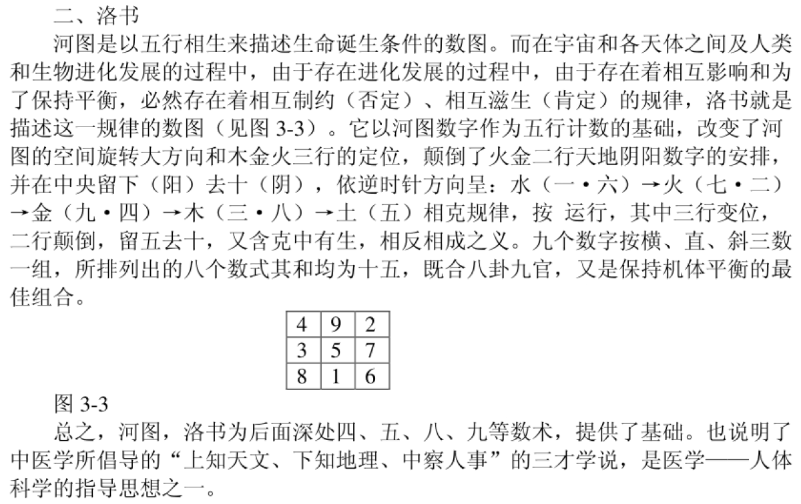
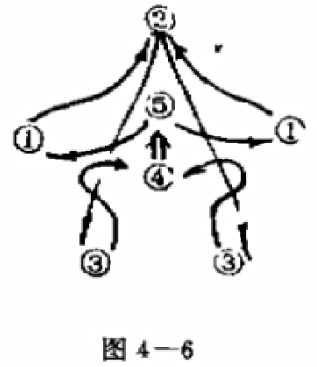
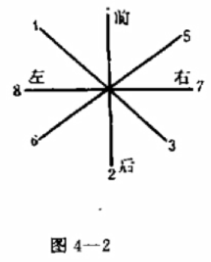
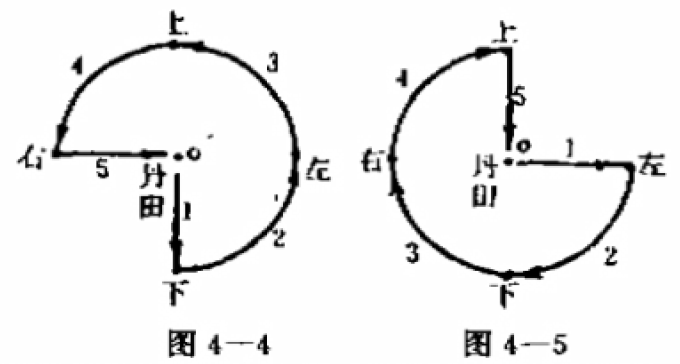

- [[20241005]] 更新：小周天想象眼睛内视、肌肉收缩放松引导或制造“气感”，大周天晒背热点，大循行“集线”、交会穴等
- 待更新：参考图分类优化、顺式呼吸“风喘气息”参考，小周天手到眼前“浮光掠影”、热辐射，镜象，转带脉日晒热感、裤带勒感，大循行手三阳面部肌肉/紧绷感辅助定位，“体外模型”多角度（进而可以“邻近”）、多不透明度并联，先后、快慢并联，意念可时深时淡，叩齿三穴颞下颌关节辅助定位
  id:: 678a4dfe-98bc-4e75-8a8d-87d3ae637ed3
- 我每天就十几个小时网上冲浪，而且要分散于各种优先级不断灵活调整的主题，对于[[丹道]]、[[气功]]、[[特异功能]]、[[地外文明]]、 ((68985f33-e987-4a29-b062-b15f528bb7bf)) 等可能没有货币乃至“主义”（甚至“八字”——之前给癌症家属私信和评论推荐[[郭林新气功]]，没回应，但是老老实实回应别人问八字）实在的内容的相对挑剔的证明和证伪是需要较多时间的（“啊你就是证明了又咋滴？”），目前优先级不高，因为人要两条腿走路，读者不赶时间的话我也就不赶时间了
  id:: 66f22b31-dbbf-4f54-b48e-e30455326187
- 对两册书的相关内容做了合并、简化、解释、补充和增加背景知识等的工作
	- ((65c589f9-342d-42c5-818c-f363a95b3847))（日常-运动-经络......-“林渊、科学快速气功”及“经络、穴位、针灸”文件夹，有功法原书和针灸穴位图；目前大多是藏起来了）
- ---
- 以下不带引用格式的文本大多也是引文~~，相信读者能轻易区分~~
	- 图4-1针灸穴位挂图够不清晰，用其他替换了
	  id:: 66f018d0-257a-48b7-ba03-11bada4cbdb9
- 一、目标和要求
  collapsed:: true
	- 用一年时间扩宽大周天（十二经；十二正经）、小周天（二经；任脉、督脉，奇经八脉）、带脉（一经；奇经八脉）通道。为高速、大容量地传输能量打好基础；同时训练体内与体外环境能量交换的能力。这两者同样重要，不可偏废，达到劳宫穴、百会穴、涌泉穴与外界开通，能感知外间炁场的强弱与冷热。
		- “一年太久？”
		  collapsed:: true
			- （第二册）第五章 科学快速气功生理学探索
				- 第一节 生理级功法的生理综述
					- 古代传统气功很强调筑基。一般习练气功者，先要花2一3年时间练习筑基功法。古代多与武术结合来练，为的是有一个健康强壮的身体，然后才进行气功修炼。沿着古代这一正确道路，科学快速气功的生理级功法，是现代科学的筑基功。通过炁血加速运行，练就一个健康强壮的身体；通过循三个环路十五条经络，相当全身一千个穴位同时针灸治疗，排除身上各种疾病，并调理全身机能，使身体处于最佳的生理状态；通过第一步较简单的功法动作训练，为以后高层次功法中的高难动作奠定基础。所以，它是气功修炼者必不可少的第一步。一定要练好才能进入第二步。基础没打牢，难以练好高层功法。
				- 第四节 气功出偏的生理探索
					- 四、没有筑基 
					  我国传统气功，自古以来都很强调筑基功，连小说的描写也充分地反映出来。高人收徒，先要其徒干两三年重体力劳动后才开始授功，其目的就是锻炼出一个好身体，锻炼出坚强的意志和毅力。不知什么原因，也不知什么时候开始，现在全国盛行不筑基的练功法，两三个月就能出功能，便可到处为人治病。据说更甚者，“神仙一把抓”只要学数小时，就可为人治病。“好事做得越多，功能长得越快”，简直风靡全国。我不知他们的理论根据是什么，又有哪些学功者凭这样练出了成果的实践经验。笔者曾接触到为数不少的这类练功者，出了点功能，但身体垮了，最后登门求救。经笔者检查，多是伤了元气，虽不像前述例子周全先生那么严重，但炁血都很弱，百病丛生。经笔者指导，用“科学快速功法”循经吐纳，积存能量、很快就纠偏，恢复健康。全国出现这样偏差的人难以计数。所以笔者极力主张从动功储能入手，在一册中举汽车蓄电瓶为例，是有充分依据的。如果不筑基，练功就等于慢性自杀。
		- “未必那么慢”
		  collapsed:: true
			- id:: 66e8148f-590b-4170-92f2-3192c5554ed5
			  >想不到报告会结束后，魏庭蓉师傅走到我跟前，竟称我为“大师”，并说我有较深的功夫和根底，使我处于尴尬的境地。我一再解释，对理论研究我已进行了三四年时间，而气功锻炼仅有一年零四个月，谈不上深功夫和根底。魏师傅接着说：“虽然你坐在堂后靠角上，我唱歌时感到你阵阵强烈的感应，这时才开始注意你，用ESP观察到你印堂前出现一阵阵红云，你的功夫怎能骗得过具有特异功能的人呢！”于是我向她介绍这三个月练习逆式腹呼吸法，并建立了上、中、下三个丹的情况。她对这功法给予高度的评价。
			  以上几个人的观察结果，可能仍有人怀疑。现正在进行研究和设计改进，企图用柯莱因照像术，把全过程拍照下来，到成功那一天，才能令人信服。
				- 林渊写书时55岁，练功一年零四个月已经开了天目、炼了三丹，已经达到了特异级，对应书中计划大概有练习时长两年半的水平，大概比零基础考四六级快些
			- id:: 66e813db-c280-4583-a3a6-a93c18778256
			  >对于这些功法和功能大家可能还难为相信。我还介绍最近出现的一个幸运儿，就是本章作者之一的毛渊珺同学，才十一岁。1988年8月中旬大雷雨后，出现很简单的特异功能。由于家长重视，并且有远见，从巩固和提高其功能入手，也就是按上述功法锻炼，只花十几个月时间，竟达到“真人”水平。唯“能体”（又称“结胎”）尚不能出窍。最后，由成都市昭觉寺，清定上师给他点开的，并以答应“皈依”保证不杀生为条件。清定上师还深有感概地说：“三四十年苦练才能达到的功力，想不到小毛十个月就已经达到了。你们修炼的功法是正确的。”
- 二、要领和安排
	- >首先要花几天时间熟记经络位置和走向（要结合自身体位来进行）。然后，才开始动作和内炁运行锻炼。注意手上只是引导外炁在体外运行，意念导血引内炁于体内运行，开始三个月可能会枯燥无味，要用意志和毅力克服之。 三个月后会感到断断续续有热气运行。约半年才明显地感到炁在体内运行。到一年左右，当运行那一经时，全经有麻感（四肢上特强）而炁行的位置上有胀感，这时标志扩宽通道的成功，即大、小周天已打通。
		- 未必“首先要花几天时间熟记经络位置和走向。然后，才开始动作和内炁运行锻炼”
			- 可以不记直接开练
				- ((66e9690b-2206-4b0d-9099-340f8ea86fbb))
			- 不一定要花几天时间
				- ((66dd1e9c-170c-4b88-8b57-0654ed78457d))
		- 未必“开始三个月可能会枯燥无味，要用意志和毅力克服之”
			- 找个其他枯燥无味或有其他负面体验的事顶替掉，这叫忙里偷闲、今时得宽余
				- 你是在练功，立志成为天仙，那么由“一念成仙（神、佛也可以，成，都可以成）”易知，你已经是天仙了，对你来说几乎是不在乎时间的，所以不要用审判凡人的眼光裁量你的活动的价值，因为
					- ((66db8ad1-f0b7-46dc-8066-75313dcae3ea))
			- 同时做其他事，买一赠一，捆绑销售，比如晒太阳，显然至少开头呼吸是可以在阳台晒晒背（两节大概7分钟左右，对很多人差不多就够了）的，别让晾着的衣服挡着
				- ((66f7e406-3a4a-48d9-aeb2-39028b717e82))
				  id:: 66f7e383-b725-495d-841d-046842af4fbd
				- ((65d69eb8-2163-4648-95a4-34f14e580fd8))
			- 找人一起练，互相教（可以分组教），可以包括但不限于动手动脚动舌头触摸循经，同时对方可以动作和意念跟着
				- 有的功法（见 ((66c9a2fd-e708-4d44-9d8b-0eb986019c85)) ）确有成熟的双人模式，至少可以循个小周天，但另有难度，最好先筑基
- 三、注意事项
  collapsed:: true
	- 练功时要全神贯注（没能全神贯注、脑子里蹦画面也别紧张，让它神神），彻底抛开七情六欲。意念导血时，全身其它部位高度放松；练习期间，食欲增减，体重增减，包括房事都应顺其自然。俗话说：“神注不思睡，炁足不思食，精固不思欲”都是自然反映，应该出现精力充沛，体质渐增，处事效能提高的自感；如出现练功后疲倦，或对练功有反感，应立即停止练功，检查身体，或许是有病的反映。
	- 补充事项（提到前面）：
		- 1.第一个月可先走姿势，熟练后，再导血引内炁运行，全身要高度放松。选择子时（23-1时）或午时（11-13时），及地炁强的地方练功，成效要高得多。
		  id:: 66e9690b-2206-4b0d-9099-340f8ea86fbb
			- 可能要注意实际 ((66fe2685-fca8-4df7-992e-ffffd489aca4))
			- 注意剪指甲，否则可能影响循经学习和小周天、叩齿按耳门三穴的手势、手指接触
			- 身上痒了可能要洗头、洗澡，以免头部等瘙痒影响练功质量
			- 与洗澡（尤其是 ((66335bd5-1bf3-4d00-bd31-9460e5b62dca)) 等比较冷的） 、性生活间隔半小时以上
			- 便秘不适时不练
			- 腹泻后等身体恢复了再练
			- 为了空气清新、避开烹饪油烟等，可以调整练功时间、空间
			- 体感温度合适时推荐赤足、晒太阳
			  id:: 66f2850c-50c7-49cd-abbe-df147ead5f3a
				- 偏热的话可以不晒或之后再穿衣服或避开阳光，衣服挡着可以晾一边或收了
				- 晒得开始热辣了可以移动（可以移动到墙后无直射阳光处；可以晒不同部位，比如向前不晒脖子，再进一步晒之前没直晒到、乃至被晾在外面的被子挡着阳光的小腿），注意不要有可能在闭眼时绊倒你或砸到地上或身上的障碍物）
			- 高血压、心脏病等的患者可以按需降低动作强度，或者先跳过
		- 2.到出现炁感后（约半年）可以将全部呼吸改为逆式腹呼吸。但切切不可猛收腹与吸气，只是顺其自然为度。因为打通大、小周天以前身体的生理自调能力仍不强，适应性低。
		- 3.炁感出现后，对经络中炁运行速度可感知，先让其按自身速度运行1～2个月，以后稍用血力来推它，渐渐提高运行速度。
		- 4.特别加强德行的修养，切忌动怒。一心多做好事，不做对不起别人的事。要建立“宁人人负我，我不负人”的宽阔胸怀。
		  collapsed:: true
			- 我从一个角度看我自己大概是这样的
				- 我不上班、很忙、赶时间，跟家人之外的人没多大机会发生矛盾起来
				- 网友是网友不是老板，对我的约束力也很有限，而且我疑似有点懂语言的艺术，就算催工，对于一个真算得有办法的人无非是优先级灵活调整，顶多牺牲一些广度、深度啥的
				- **父母**占用我时间也是**家**务，一定**会**做的事为什么要纠结呢？反倒是“道进乎技”（包括“积极情绪”技能）的机会，而如果对给我妈买回来的小芋头刨皮这样的事实在是有点负面情绪了，那就唱歌赶一赶
				- 而对于还不太确定的风险——既然还不太确定，那么除了字里行间“我要守护所有人”的态度（“有吗？”；原书作者们大概都是这样表态的）外，我就盲目（“赶时间”）假定别人也像我一样“一心多做好事”且通情达理（“掩耳盗铃是吧？”），后者是前者的一部分啊
		- 5.千万不要急于求成。生理级锻炼期不要急于采炁来填充丹田，企图积聚金丹。这一年主要任务是扩宽经络通道，排除本体一切疾病，使正炁（真气）存内以后，才能采炁建立纯正高质量的金丹。炁未纯而积丹，只能是杂炁一团，于己无益。
		- 练前 ((66ade372-deeb-482f-b04d-2dfa41f90490))
			- ((66a2e981-de03-43de-947d-f3ea9a8260b0)) 可能帮助意识清醒，更好运用意念
			- 久坐者的肩可能需要热身
			- 身体结构问题较大先调结构
				- [[人体]]
		- 当心“疯狂地忘做”
			- 入炁态在开头应该不会忘，大周天、大循行难，应该不会忘，法四象和通三才相似、连一起很难忘，小周天和转带脉可能容易忘，运九宫第二节也可能忘，收功忘了容不容易忘，反正记得有五节，“转揉叩大摆”或“脐眼齿臂手”啥的
		- 睡眠要充足（一开始如果累是排病反应、修复，小孩睡的时间也长）
		  collapsed:: true
		- 其他参考
			- ((66f3d1ad-31f1-4b23-aaf0-bf20d08225d4))
- 四、生理级练功
	- 所需时间：40分钟左右（含收功），初期如果边学 ((66dd1e9c-170c-4b88-8b57-0654ed78457d)) 边练可能要1.5小时以上
	- 各节的动作次数依次是逆时针的洛书数
	  collapsed:: true
		- |5|1|6|7|2|9|4|3|8|
		  |顺式呼吸|逆（腹）式呼吸10次|大周天，手上下六次|小周天|转带脉，左右各一来回|转九宫，应该是做一遍，先往八个方向荡，再晃一个“8”字|法四象，四来回，后两回手到头顶向外（左右两侧）翻掌|通三才|大循行|收功|
		- 
	- 1.准备动作
	- （一）入炁态
	  id:: 66f14ac6-3bf4-40dd-af32-2c05b94662b9
	  collapsed:: true
		- 又分两节
		- 入气态是做功的准备动作，在动员和激发全身细胞和经络基础上练功，虽各节功法的动作只做几下，但都是处于全身激发到最高水乎上进行的。实质上等于短时间高水平地练了十几种功法动作，所以是科学快速功法。
		- 1.顺平常吸气（顺式呼吸）
		  collapsed:: true
			- 此节目的是调动中丹田与手上六经的炁。
			- 两手掌心相向、十指相对呈环状、捧球状，双臂成圆弧形（“近似”）、抱球状，慢抬起提到中丹田（平肩，让肺张开，使吸到肺活量最大值的空气）。然后慢慢呼、吸各五次，愈慢愈好。呼开时，手拉开与人体双宽度等同便可，不宜过大或过小。
			  collapsed:: true
				- 可以凭感觉切换呼吸，做到呼吸间隔可持续，不用读秒（一般比实际快——“那还是快点好啊！”）、硬凑整数把自己憋伤
				- ((670d412f-5d78-4a8b-a249-e647d5fa12f1))
				- 可以先吸再呼，最后呼完正好接下一节
				- ---
				- ((68917843-1014-416e-a47f-bbb61d28d460))
		- 2.逆（腹）式呼吸
		  collapsed:: true
			- 此节目的是利用升高血压来激发全身所有细胞和经络。
			- 轻闭目，两手（左下右上，或者说左内右外）掌心放在脐上，吸（压）呼（松）十次（应该比上节顺式呼吸快）
			  collapsed:: true
				- 运用以血运炁原理，尽最大肺活量吸气，吸气时，全身体积收积收缩1/10（腹部胸部全收缩）气问下丹田收，感到气充满全身细胞时为止。呼时全身放松、扩大
				- 要领是：由胸呼吸转腹呼吸，形意气三者一致，随安静而入气功态。
	- 2.内系统循经吐纳，（2）、（3）、（4)节把体内激发至最佳状态。
	- 科学快速循经
	  id:: 66dd1e9c-170c-4b88-8b57-0654ed78457d
		- ==可能一次学不全或记不住，记得按需常回来看看==
		- 主要用于要走十二正经因而最难入门的两节：大周天、大循行。小周天等也可顺带用上
		- ((66db8abf-36e7-46e2-a9a5-cf5e95566a16)) 读者大多都做过几年，虽然不一定认真做，穴位（比如四白穴）也不一定找得准，所以效果也不一定好，现在有名师指导（“先生不知何许人也”），想必能快准狠地学习有益全身健康的体操
		- 参考图
			- 单经
				- ((668f8be4-2fcd-4296-a4d7-19463b6a2d9d)) “经络穴位免费”
					- 3D、显示支脉、可透明显示体内经脉的
					- 但是很遗憾，只有男性的图，下同
					- 嫌复杂也许可以（先）减少转角，拉直线段，就像上面的针灸穴位图一样——但可能并不会简单多少
					- 注意多转动查看（“看一下足踝尖”）、点附近穴位放大
					- 另有收费的“3D经络穴位”，开头视频看着好像这个包对学习循经用处不大，下方图文科普可以简单看看），比较复杂
			- 多经
			  id:: 6722f861-ae39-4324-b891-b906bf269b19
				- ((668f8be4-2fcd-4296-a4d7-19463b6a2d9d)) “虚拟解剖”-“全身”
					- 看对应的脏腑（对应“器官”）、骨骼、肌肉（如果看名字不太确定）
					  id:: 66f807e4-1608-49a7-8a10-62f3db8d3568
						- 器官的图片可能没下一条的“可爱”
						- [人体五脏六腑的位置立体图_有来医生](https://m.youlai.cn/special/lookpicdise/vqTjxRnCSR.html)
					- “穴位”
						- 只有“全身（男）”有，为避免遮挡，隐藏内裤后更清晰的外生殖器模型就暴露了（
						- “皮肤”也点上
						- 点右侧偏下的箭头显示菜单（“原来在这啊！”）
						- 区分多条经线
						- 同时循多条经
					- 还可同时看（但；可以学过一遍后回来看；也可透明）
				- [Android The Meridian(人体经络)v2.0.6 付费版 - 果核剥壳](https://www.ghxi.com/meridian.html)
				- [最新国家标准针灸穴位图_高清图集_新浪网](http://slide.health.sina.com.cn/d/slide_31_28379_32704.html#p=1)
				  id:: 66e383a9-026e-4352-865c-97e984bbff2d
				  collapsed:: true
					- 比较简单，体表经线，三个视角三张图，可以拼图
					  collapsed:: true
						- ((66db8ac4-c467-4cbc-902c-6b8c0dd6cec4))
				- TODO AR透视、识别、附着、联动（可能还没有） #VR
				  id:: 66fa44e3-332c-4786-aa2d-897c00fb91ba
				- 12色彩纸贴辅助记忆十二正经巡行路线
				- 可以隐藏骨骼、增加皮肤，鼠标拖动
				- 分屏显示正面背面
				- 3d循经模型，遥控或定时切换亮灯
				- 专注巡行的那一长条即可
				- ---
				- 结合“前后中”分部位区分，比如手三阳肩胛冈经线
		- 走不走体内经线？走不走支脉？
		  collapsed:: true
			- 书中教的似乎主要是在体表经线循经，不走可能交接的支脉
				- ((66f018d0-257a-48b7-ba03-11bada4cbdb9))
				- ((66ecec1b-07bb-4a35-a350-69b0657e2879))
			- 个人认为可以按（可以）交接的路径走（兼顾体表经线，尤其是胆经这样七拐八绕的），也就是可以走体内经线和支脉，而且不走其他不交接的路径，但这么走效果会否更好还不太确定——不太确定写书的几位老师就是这么练的还是为了方便书面教授，但即便是后者，可能他们也比较过，认为差异或者说问题不大
			  collapsed:: true
				- id:: 66f7fe89-c26e-4961-8247-90ca8403edff
				  >在实际炼功过程中会感到有不少分支图中未标出，自己纳入通道，并联运行就可以了
			- 那么，可以根据实际情况（比如可用的学习、练习时间的多寡，身体感觉等）调整难度
		- 为什么不同来源的十二经脉图的体表、体内经线形状不一？有更精确的吗？
		  collapsed:: true
			- 体内经线是根据《灵枢·经脉》描述画的？
			- 体外经线是根据《灵枢·经脉》描述画的，或是根据针灸实践中确定的穴位散点拟合而成（因为其作者不重视气功或内丹修炼？），还是兼而有之？
			- 有内视者画的版本吗？
			  collapsed:: true
				- ((66f159b2-7d4b-44c4-bc31-82148a127d94)) 根据胎息内视经验讲了一个经典“如环无端”的版本
				  id:: 66f63a65-72cd-4dac-b4c4-e3fc30ea4e15
				  collapsed:: true
					- 但没直接画出来，但根据文字和表格描述以及“外视”辅助可以想象，要按那个流向全身一起练的话大概也比较难——所以这部分至少暂时不影响练习
					- 经络与洋流的联想
					  id:: 66f807e4-0b61-43d5-ab47-720a7d63e60e
					  collapsed:: true
						- 像是（“我联想到的”）地球上的有上有下、有左有右、有顺时针转有逆时针转有对称（相对赤道对称；身体左侧与右侧循经方向相反）、同侧中间也有对称（肘、膝以下手、足阴阳经双向回旋——这里似乎不同于近赤道、远赤道都回旋的地球洋流）、有表层（体表）有深层（体内）、甚至（可）能（先减速再）逆转（可能因为气候或健康状况变化）的洋流
							- https://i0.hdslb.com/bfs/archive/a1addf2dba6c85b68984707c7600634d6abc3d96.jpg
							- “地球有多像人？”——“最自然神论的一集”
								- 血流与洋流
								  id:: 66f807e4-e5c9-4cd5-ac19-d0ff14de406d
									- 设人体血液循环平均20秒一次，活100年，洋流周期1600年，易得252,288,000,000年
									  id:: 66fe9f85-8373-49e1-a704-b1758a500d37
										- ((66fe9a28-89fd-497a-b8a2-8c39cf6a2ec2))
										- “这是什么？”
											- [宇宙还能存在多久？扩张速度比想象慢，最少1400亿年_科学湃_澎湃新闻-The Paper](https://www.thepaper.cn/newsDetail_forward_2497388)
												- >这表明移完这些金片需要5845.42亿年以上，而地球存在不过45亿年，太阳系的预期寿命据说也就是数百亿年。真的过了5845.42亿年，不说太阳系和银河系，至少地球上的一切生命，连同梵塔、庙宇等，都早已经灰飞烟灭。
													- ((67e14975-0c9f-4869-9aa3-a28e7b365b77))
					- 谢明德在 ((66d557e6-588f-44b7-9f3b-0adcb136db41)) 第5页的配图有部分相似的特征
					- collapsed:: true
					  >正常人每行一个呼吸之时，其左侧约正运行二次负运行二次，右侧亦正运行二次负运行二次。
						- 按“（现代）正常人”的呼吸频率约18次/分算，经炁“振荡”的频率约72次/分——“与心跳频率差不多相同哦”
						- 速度还是一呼吸六寸吗？还是说速度会变化进而表现出步进从而实现回旋吗？
						  collapsed:: true
							- >人一呼脉行三寸，一吸脉行三寸，呼吸定息，脉行六寸。人一日一夜凡一万三千五百息，脉行五十度周于身。漏水下百刻，营卫行阳二十五度，行阴亦二十五度，为一周也。——《难经·一难》
								- 经里的一呼吸平均6.4秒，比“（现代）正常人”的长不少
					- ---
					- 与心跳频率相同吗？
						- 如果是18次呼吸/分则是每分钟72次，约等于某“标准心率”每分钟75次
					- 两侧错开
					- 两侧正转反转速度一样吗？
					- 子午流注换地方需要两小时吗？为什么？
					- 地球自转与子午流注
					- 胚层
					- ---
					- 意念加速，带动的是炁还是血（心跳）？
					- ---
					- 自旋，穴位旋转方向（？）
		- 十二经脉的命名与位置的关系
		  collapsed:: true
			- 阴阳二分
				- 内阴外阳（手臂内侧、腿脚内侧为阴），前阴后阳（背朝太阳为阳）
			- 手足二分（十二经脉都经过手或足，手或足是其起点或终点，手经不过足，足经不过手），走向四分（括号内为终点）
			  collapsed:: true
				- 手阴（手）-手阳（头）-足阳（足）-足阴（胸腹/脏腑）
			- 将每四根经视为一组，三组对称（阴阳阳阴）依次分别（在整体上）互相区分为内（阴）或外（阳）的前、后、中三侧，即第一组都是前侧，以此类推
			  collapsed:: true
				- ((66e383a9-026e-4352-865c-97e984bbff2d))
			- https://pic1.zhimg.com/v2-71498733dffa02a23c4f7120797a56c1.webp
			  collapsed:: true
				- [十二经络的命名规则是什么？ - 知乎](https://www.zhihu.com/question/24950951)
			- 表示每条经脉的两个大写英文字母是其全称的缩写，经脉上的穴位则按循行顺序加上数字
			- 身体左右两侧都有同名穴位，大致是对称的
			- 脏腑，分为五脏六腑，加上一个心包，就是十二
		- 每经器官
			- 肺大肠胃脾心小肠（大肠对应小肠）膀胱（膀胱往下）肾（肾往上，穿肾）心包（心对应心包）
			- 三焦胆肝
		- ---
		- 摸穴位、划经线循经
		  id:: 66f14ac6-51ba-484f-a3c9-6244b523b803
			- “走穴走线，不可不慎”
			- 有人搞了一套大概比“单纯的划经线”更复杂的叫“经络疗法”
			  id:: 66f276a6-3c1e-4e4c-b94e-2bacb15c514e
			  collapsed:: true
				- [经络疗法的本质是导引](https://mp.weixin.qq.com/s/5o6ln77T4KcQKbgZ-2BD0w)
			- 初学完整摸一遍可能要2~4小时，时间少可以部分摸（“摸着石头过河”），说不定分次摸完一遍比一次摸完一遍能体悟更多、更高效掌握（基于“人会自动学习”）
			- 推荐照镜子，尤其能看到不太能直接看到的头、颈、背等
			- 衣服会挡着穴位，所以会阻碍知识传播
			- 找丹田
			  id:: 66f299b5-bbe6-4af5-a536-b287334f0891
			  collapsed:: true
				- [丹田的准确位置-有来医生](https://m.youlai.cn/sjingbian/article/9CA5FDgAfcq.html)
				  collapsed:: true
					- “寸”见 ((66f93fa5-e368-4941-acf0-a4801802f485))
				- collapsed:: true
				  >气沉丹田手心开
					- [【4K顶级修复】周杰伦 - 双截棍 MV Flac无损音质封装！_哔哩哔哩_bilibili](https://www.bilibili.com/video/BV1wX4y1F7p7)
						- [如何理解周杰伦《双截棍》歌词“一根我不抽的烟 一放好多年，它一直在身边”？ - 知乎](https://www.zhihu.com/question/28739911)
			- 取穴
			  id:: 66f91e0a-6e2d-4690-98ac-c5985f9a3145
			  collapsed:: true
				- ((66fd3f58-dc24-44b0-bd4a-b492fd63d509))
				- ((66f807e4-1608-49a7-8a10-62f3db8d3568))
				  collapsed:: true
				- ==经线上的几种循经记忆重点==
				  id:: 670d40e1-284d-4473-875f-2500d4f13910
					- “虽然重点大穴要划不少，但可能线段中间的穴位不算什么重点”
						- 还不确定精准位置但不影响大致走向的穴位可以跳过，一寸左右的偏差对意念循经没多大影响，实际上一开始意念在不用眼睛盯着辅助的情况下大概也难（感觉）定位到那么精细
					- 经脉交接点（经脉起点/某一终点，大部分在体表；也可能是交会穴）
					  collapsed:: true
						- https://img.cndoct.com/upload/202304/03/202304031528579191.png
							- 初学看一眼即可
					- 经线转折点
					- 经线的体表体内出入点
					- 经脉交会穴
					  id:: 6700eba6-500b-4927-8310-2b51bc072424
						- 我根据“必要路线”看图并搜索说话，可能遗漏：秉风（肩）、大迎（面；看起来与胆经交会，但搜了下没人这么说）、缺盆（锁骨；有人说是）、环跳、三阴交、冲门、
							- [论缺盆经脉交会及其临床意义 - 道客巴巴](https://www.doc88.com/p-9939764683225.html#)
						- [医砭 » 中华针灸 » 交会穴](https://yibian.hopto.org/shu/?sid=7005&lc=cn&lc=cn)
						- [人体交会穴的定位与应用](http://www.360doc.com/content/19/1002/04/64825827_864401911.shtml)
				- [简单易懂的常用取穴法（图文并茂哦~） - 知乎](https://zhuanlan.zhihu.com/p/464877927)
				  id:: 66f93fa5-e368-4941-acf0-a4801802f485
				- 一些辅助定位的动作（找准“凹陷”、“X缘”等——“缘，妙不可言”）
				  collapsed:: true
					- 手指按/戳、划/（捏、搓）揉（手关节前后穴位）/刮，手握（比如手三阳的肩胛冈、脾经血海穴的股内侧肌——“形状更像鸡胸肉、鸡全腿还是鱼柳？”）
					- 提脖子（大概是两侧的胸锁乳突肌，这下从 ((6699d14d-680a-4100-b1ba-06493e9bb41f)) 的巨人里出来了）
					- 屈肘
					- 转肩
					  collapsed:: true
						- ((66f9576a-729b-4639-b7b0-db704823bc8d))
			- 划经线
			  collapsed:: true
				- 摸几个划一段，最后连起来
			- 想象体内经线（想象时不看参考）
			  collapsed:: true
				- 可以分段、分层次，比如手、臂、肩、颈、头、面、躯干、腿、脚，需要时更利于拆分（忘时可能还记得其他部分）和组合（除了把还记得的组合起来，主要适用于大循行，不同经脉间根据临近位置和 ((6700eba6-500b-4927-8310-2b51bc072424)) 由分段异步“等等”逐渐实现完整三经同步）
				  id:: 6700e28a-f38d-41c3-accf-80416b8cb6de
				- ((66f7cce6-fc99-4688-9434-b09df8b6ee34))
					- 可能通过意念循经本身或练别的具有“空间复杂度”的提升
						- ((66db8aae-fe2d-4d6f-ad5b-08dd63351aff))
			- collapsed:: true
			  ---
			- 一些学习经验（“不久便撂荒的早期探索”，可能不咋整理更新了）
				- 胃经关键穴位，大迎
				- 脾经上到腹股沟的冲门后边上边“（小）外-内-外-内”，入胃入心
				- 膀胱经头部内外内内，然后入两侧脑，
				- 小肠经，交接支脉，沿颧（quán）骨下缘，绕道鼻翼下端，上行至内眼角
				- 肾经，照海穴在内踝尖（“隆起的骨头”）下1寸，入会阴（这时大概可以适度收缩会阴“提气”），绕后，上入尾骨、骶骨，上走脊柱内部，从腰椎侧向后穿出，走肾、肺、心包（心外，“不走心”）
				- 心包经，绕心外、肋内外旋，出乳头外侧，走手臂内侧（过肘后走）中线至中指/无名指（交接支脉）
				- 三焦经，天井穴在肘后区，肘尖上1寸凹陷中，绕耳
				- 胆经，环跳穴
				- 肝经，脐下，骶骨对面，肋间旋
			- 穴位定位、循经参考视频
			  collapsed:: true
				- 真男人演示，但考虑到定位精度，难度可能更多来自自看自摸而不是看别人摸别人，不一定好用，可不看
				- [初阶（上）谢锡亮《针灸基本功》十二经络同身寸真人定位取穴演示_哔哩哔哩_bilibili](https://www.bilibili.com/video/BV1oM411r7BN)
				- [十二经经络与腧穴实训指导_哔哩哔哩_bilibili](https://www.bilibili.com/video/BV1pW411P7sf)
			- 触摸抚摸也可能带来气脉反应，这也是初学刚开始“摸索”并练功后容易出气脉反应的一个原因
			  id:: 6891791a-ed12-46f2-b52a-81b9b0fc79fe
		- 无动作自然呼吸意念循经
			- 此处看完后也可以直接跳到大周天开练，除非你又是什么先天圣体，否则初学无论怎么练，都很可能漏掉一些要点，换句话说就是没漏掉其他要点（
			- 没学的经线当然不带意念
			- 学了的经线忘了就按顺序接下去，哪里想起来就在哪接上（“也许有影子循经吧”），都没有的话那就做完了（
			  id:: 66fa3f23-0bad-4cd7-b774-1573f12e4a6a
				- ((66e9690b-2206-4b0d-9099-340f8ea86fbb))
				  collapsed:: true
					- 想练的人不太可能一直只走姿势不走意念，边练边学一个月，平均两天半摸想记熟一根经应该不是很难
			- 意念跑开、定位慢等不要急，可能越急越慢
			- 循经的意念可能会落在一个你觉得在你之外的身体/模型上，而不是落在你觉得是你的身体上——应该会随着练习得到改善或“适配”，不必在意
				- 对“体外模型”可以多角度、多不透明度（可以透明，方便原本视线被遮挡时并线）观测，大循行走多经时可以“走一送一”，可以“相邻过去”
				  id:: 6709f05d-d70a-4377-940c-c3da0a3c9ac3
					- ((66f807e4-1608-49a7-8a10-62f3db8d3568))
			- 循 ((6722f861-ae39-4324-b891-b906bf269b19))
				- 可以先区分先后、快慢
					- 比如手三阴可以先向下走肺经体内经线再开始走心包经再走心经，足三阳可以先从睛明穴走一段膀胱经到脑后再开始走胆经和胃经，足三阴可以稍早点走肾经——或者先走的改成加速
				- 感觉难同时想象两条、两侧同时循经的话也许可以（“趁脑子不注意”）假想“（翻转）对称过去”，还是想象不了的话可以先不管，继续练习
					- 如果两侧感觉差异明显可能该试试交替练习
				- ---
				- 并线简化，可以把其他几个部分练熟些再重新复杂化
		- 实际循经时可以综合以下几个部分，逐渐做到同步
			- 呼吸
			- 姿势、本体感觉（开过车的人大概很容易理解：“这么窄的道儿开咱这么大的车能不能过啊？”）
				- 对姿势/部位的相对位置的本体感觉可以作为意念定位和同步的参考，比如手平肩时意念大概要在肩部或附近
				- 皮肤、筋膜、肌肉等的拉伸感（小周天等也一样），以及贴着、绷在骨骼上的压力，比如贴肩胛冈的手三阳
				- 随着姿势变化，与姿势、重力相关的更细微的（可能部分在部位之内，而非部位之间，当然，也可以继续细分为部位之间）本体感觉等也可作为意念定位的参考，比如在循手三阳的手上提时，“流动的热血感”啥的可以帮助意念在手、手臂、肩、颈、头定位，进而优化与姿势的同步
				- 肌肉收缩，腹部，注意骨盆前倾（尤其是原先骨盆后倾）
				  collapsed:: true
				- collapsed:: true
				  ---
				- [本体感觉及相关的训练方法 - 知乎](https://zhuanlan.zhihu.com/p/388171214)
				- {{embed ((670a354e-7d38-4bac-a678-ea7f3d35f3e2))}}
			- 触-压觉
				- 可能主要是提前触摸感知一下
				- 转带脉裤带勒感
			- 温觉
				- 包括晒太阳晒的，尤其是直接晒背，当你摆臂时“热点”会随着姿势游走，因为入射角度、组织厚度（拉伸可能变薄）、遮挡关系等发生了变化
					- 背对太阳有视觉等方面的优势，说不定这也参与了经络（位置）的演化
					- 晒太阳前后，可能晒小腿
				- 还可以有小周天手到面部时的热辐射（可能天冷时比较明显）等
				  id:: 671ca7af-eb71-4d0f-822b-4b1d6de60efb
				- 转带脉日晒热感，可用裤带限位
			- 痛觉
				- 可以提前稍微用点力留下轻微痛感等，但可能没啥用
			- 视觉
				- 光影明暗变化，比如小周天手到眼前时，像是飞机在接近地面或海面时“浮光掠影”
				  id:: 670f25b7-0e98-41ee-b697-b1ad6f495710
				- ((6722d15c-1f7d-4dbf-8f63-91863379ce53)) ，看着想象连通
					- 背对阳光时，还可能发现手反光照在胸前
					- ((6722d15c-1f7d-4dbf-8f63-91863379ce53))
				- 不确定时可以低头看，或者不看，假装“我会了”，然后说不定就真会了
			- [[想象]]
			  id:: 670d40e1-5fa0-4d1b-80e4-4b0a93cfa238
				- “想象力，很神奇吧？”
				- “人们应当想象人类的想象力是强大的”
				- 这里可能主要指想到的相对静止的“本体”及视角等，比如想到的“你自己的身体”或“人体模型”以及看它们的角度等
			- 意念
				- 这里可能主要指“注意”、“那个移动的飘忽不定的点”
				- 意念可以激发、维持（“注意”）、增强（或增敏）、移动感觉
					- 可以想象意念位置膨胀（比如从似乎没看见的点到看见了的球）、翻滚转卷（比如胆经交接支脉到拇趾下穿上翻）、摩擦剐蹭等强化意念相关感知
					- 循经时意念相关感觉可能很不明显（“来了吗？到底来没来？如~来~”）
					  collapsed:: true
						- “都没有的话那就做完了（”
						- ((66e9690b-2206-4b0d-9099-340f8ea86fbb))
					- 可以结合眼球转动（会了后也可以不转）想象内视（包括想象眼球无死角转动，看到后面一般转不到的角度），控制焦距和焦点，对于小周天等，堵塞卡压时收意绕过或跳过
					- 可以收缩、放松肌肉等引导或制造“气感”，比如小周天从骶骨到外生殖器上那一段弧
						- 包括面部、头部肌肉，比如手三阳从颈到面，“适度的紧绷感”（“咬紧牙关”、“职业假笑”、“眉头紧锁”等）也可帮助定位
				- ---
				- 人体能自动控制细胞，能有意识地控制细胞进行很多宏观操作，说不定也能控制进行微观操作，比如情绪可以影响较大范围
				- 人体、意识分别是否能控制宏观和微观？
				- 意识就单独是意识，就像大脑单独是大脑吗？
		- ---
		- 以下“不推荐”要试的话注意多次失败后最好换成自然呼吸，以降低岔炁、 ((66f0d1de-1d53-4b3c-93ff-76bda53d1434)) 的风险
			- 不推荐边看边练，脑力就那么多，分下来可能都做不好、花更多时间——以下是可能的方法
			  collapsed:: true
				- 循经时如果边看放在桌面上朝上的手机上的参考图边循经，建议把手机放在中间（可能会无意被键盘等挡着所以放到旁边），减少重心变化对身体两侧练功的影响
				- 放大
				  collapsed:: true
					- 打印（可能一般的纸也不是很大；可以贴、磁吸、夹子挂钩挂，在户外也可以看着练）
					- 投影
				- 可能比较方便的
				  collapsed:: true
					- 够高、可转动拉动的手机支架等（但可能放桌上柜子上拿起来看差不多）
					- 手动切换（鼠标滚轮、方向键等；对于竖图，显示器可以调显示方向放大——“疑似有点麻烦了”）
					- TODO 声控切换
					- 幻灯片（可调固定切换间隔，可手动切换）
					  collapsed:: true
						- Win11的“照片”里的好像固定4秒左右切换，不太行，而且大图显示超出屏幕
						- 固定切换间隔可能还是不太能对准实际运行，也就是说还是要手动切换
						- ((66fa42ac-a421-4d53-b676-8862f36768eb))
					- 视频
					  collapsed:: true
						- 可在 ((66f14ac6-3bf4-40dd-af32-2c05b94662b9)) 时临阵磨枪（就不轻闭目了）
						- 录屏、做视频（比如“PPT视频”）
						- 视频调速、剪辑
					- 在身上贴纸、涂色（不对着镜子就可能要更低点头）
					- ((66fa44e3-332c-4786-aa2d-897c00fb91ba))
			- 不推荐为了“意念的感觉”“反复练习”，你现在就要很强的感觉，以后还会要什么我已经不敢想了
			- 循经延迟就进入病线？
		- 没写好的小作文
		  id:: 66f94bee-d47d-4b1d-b9b8-abf878f0f3d9
		  collapsed:: true
			- 意识与意念，认识与实践
			  collapsed:: true
				- 意识显然不只能相对被动地观察，它可以操作“外部世界”和“人体”的观念浮想联翩，也可以控制我们的运动，我们可以跑步、走路，也可以相对缓慢地蠕动、旋转（大概是有助脊柱的动作），相对静止地站桩，还可以在较小尺度鼓起肱二头肌，收缩肛门括约肌、会阴、PC肌控制排便和排尿，挺起耳朵（大概还有头皮），扩大鼻孔，我们可以控制呼吸，在游泳池或浴缸的水中憋气并体会水里水外的不同，我们可以借助或不借助呼吸调节血压、脉搏，我们可以通过性幻想让生殖器发生变化，专注时（有意识吗？可以是很有的，下次专注时记得试试）会听而不闻（“啊？”）、视而不见，或许我们还可以测试意识的更多能力，但有时我们不一定抓得住这样的机会，长辈们或许说过“心静自然凉”，但已经装好的空调可能还是比较方便，出汗不舒服（还要加上衣服汗湿的），还会掉妆、身上会有汗味，我们就开空调了，于是我们就错过了这样一个“浪费时间”测试和增强调温能力直至的能力的机会，人似乎应该是“恒温”动物，但也许对同样的温度我们的感觉和耐受性在持续变化，似乎我们是越来越怕热怕冷了，如果能有意识地控制散热、发热就好了
				- 不好意思，自主神经可以“自主”，可以通过有意识的呼吸控制
				- “常识”（或者“传统”、“习俗”乃至“社会规范”）与“科学”，很多已经冲突过一次了（可能前面还有“没有常识”与“常识”），很多人欣喜于自己能够更加信赖“科学”，同时有力驳斥了长辈们大概是不假思索的错误观念，但可能我们还需要继续冲突下去，才能向真理更进一步
				- 我们有很多间接认识
				- 我们更习惯“意识”这一源于佛教的现代生物学术语和日常用语，可能会不太在乎乃至轻视“意念”，但是“意念”到底是什么？“有意识地”？
				- 我们习惯的运动的符号的“本体”大多在人体之外，现代人似乎比较无暇关心我们的身体
				- ---
				- “外部世界的不可控性+人体外部世界化=人体不可控？”
	- （二）大周天（十二正经版）
		- 治病最大效果，就是这十二条经的循行。
		- 先吸气入胸，手（和手臂）呈环状（混元桩），于膻（dàn）中准备循经吐纳时作上下移动（参阅图4-6活动路线）
		  id:: 66f14ac6-4381-4199-80db-fe9f9eb7b87e
		  collapsed:: true
			- 可以隔三岔五检查一下路线，可能会被大循行的路线带偏、带得直来直去
			  id:: 66fa201f-8eba-464b-a6ae-bdcfe74ab7bb
			- 
			  id:: 66f01e37-def1-4aa5-b121-e5b2b08b2d84
		- 手三阴经和足三阳经压手呼气；手三阳经和足三阴经抬手吸气。
		- 手上下时尽量圆滑，不要死角，要保持弧度。
		  collapsed:: true
			- 手三阴到位后手掌自然朝下
		- 手上下动作之数为六（也就是共12次，每4次循环一次，共循环3次）。要领是：行炁笼统（宏观）、熟悉经络（微观），左右平行、承接连续，呼吸均匀、聚散灵活。
		- 循经时全身放松，顺着经随意念用劲，左右两边对称循经（同步走）用同等速度匀速均衡运行。呼气时，要自然出气，仍随意念用劲循经运炁。
		  collapsed:: true
			- 以后再加力气，速度慢了，又慢慢训练运行快些，这样不断扩展经络通道。
		- 注意放慢呼吸和动作，否则意念更容易跟不上
		- 气不够了主动调整，不要憋气
		  id:: 66fa3f23-6c8e-4948-8f66-2f5e5a29ecb6
		- ((66fa3f23-0bad-4cd7-b774-1573f12e4a6a))
		- ==循经完了后，意念把外边炁收回来，双手搂炁，把炁收回下丹田。（可与小周天衔接）==
			- 挥拍，搂水游泳，搂气
		- 内气循：手太阴肺经（呼）→手阴明大肠经（吸）→足阳明胃经（呼）→足太阴脾经（吸）→手少阴心经（呼）→手太阳小肠（吸）→足太阳膀胱经（呼）→足少阴肾经（吸）→手厥阴心包经→（呼）→手少阳三焦经（吸）→足少阳胆经（呼）→足厥阴肝经（吸），此为一大周天。
		  id:: 66ecec1b-07bb-4a35-a350-69b0657e2879
		  collapsed:: true
			- 1.手太阴肺经。中府穴（肩前销骨）（呼气、掌朝上、下放）至少商穴（拇指甲旁）。
			- 2.手阳明大肠经。商阳穴（食指甲后）（吸气、掌朝下，上提）至迎香穴（鼻子旁）。
			- 3.足阳明胃经。承泣穴（下眼皮中）（呼气，掌朝下、下压）至厉兑穴（脚二指甲后）。
			  collapsed:: true
				- 在循胃经时，若气不足，可停在气冲穴很快吸一口气，然后再接下去。
			- 4.足太阴脾经。隐白穴（足拇指内侧）（吸气，掌朝上，上提）至大包穴（腑下六肋）。
			- 5.手少阴心经。极泉穴（腑窝中）（呼气、掌朝上、下放）至少冲穴（小指挠侧）。
			- 6.手太阳小肠经。少泽穴（小指外侧）（吸气、掌朝下，上提）至听宫穴（耳屏前）。
			- 7.足太阳膀胱经。晴明穴（眼内眦）（呼气，掌朝下，下压）至至阴穴（脚小指外侧）。
			  collapsed:: true
				- 循膀胱经时，在白环俞、秩边穴（均在臀上）很快吸一口气，再接下去。
			- 8.足少阴肾经。涌泉穴（脚掌心前）（吸气，掌朝上、上提）至俞府穴（锁骨内下）。
			- 9.手厥阴心包经。天池穴（乳头外侧）（呼气、掌朝上、下放）至中冲穴（手中子尖）。
			- 10.手少阳三焦经。关冲穴（无名指甲侧）（吸气、掌朝下、上提）至丝竹空穴（眉梢外侧）。
			- 11.足少阳胆经。瞳子胶穴（眼外眦）（呼气，掌朝下，下压）至足窍阴穴（足四指外侧）。
			  collapsed:: true
				- 循胆经时，在维道穴很快吸一口气，再运下去。
			- 12.足厥阴肝经。大敦穴（足拇指外侧）（吸气、掌朝上，上提）至期门穴（乳头下四寸）。
	- （三）小周天（顺任走督）
	  id:: 68a69cee-3c34-4f19-be8d-4ade0f590431
		- ((c65aacd5-dba2-4a85-966b-6f624c0624fd))
		- 也可参考 ((668f8be4-2fcd-4296-a4d7-19463b6a2d9d)) ，相比针灸穴位挂图更接近 ((66f63a65-72cd-4dac-b4c4-e3fc30ea4e15))
		- 练小周天可以顺带练可能主要由“放松、紧张”状态构成的类似水位升降的“升降感”，从而在大循行时用上
		  id:: 6700c3fc-b5f4-404a-ba58-28cb45ef7a21
		- ((670f25b7-0e98-41ee-b697-b1ad6f495710))
		- 双手十指相对掌心向上，中指相接放于小腹前。内炁循腹中线任脉至承浆穴换接督脉，过囟（xìn）会穴（第一册原文为“聪会穴”）转呼气。双手下压掌心向下内炁循背中线回到会阴，为一小周天。共作七次。要领是：掌握换气、内炁承接连续。舌抵上颚齿跟以搭炁桥。并提会阴，用点劲提炁，炁顺任脉上，顺督脉下（用解便的劲）。
		- 从任脉走督脉的原理如下：
		  collapsed:: true
			- （1）自古以来所有功法均为督脉走任脉，其作用是因进入光丹水平后，丹田同向转动能发出高能级的紫色光，有较强的功力。
			- （2）这一练功法，却遇到生理上的极大困难。督脉起于会阴穴，很近距离就转到脊椎末端的长强穴小孔（俗称尾间关）进入脊椎运行，到背中又有夹脊关，到后枕又有玉枕关，从会阴开始运炁，只有微弱炁流去冲开这三关是事倍功半之举。
			- （3）现在改由任脉走督脉，由于经络中炁的运行有“行波放大作用”，以几十倍于上述功法的炁场能量，倒灌脊推中去冲三关，尤如打汽筒那样去加压。只需2一3个月就能同时打通三关，但将来只能获得略低能级的青光（或兰光）。故在第二阶段气功级锻炼期功法中，将炁改分两支，分别顺任、督二脉同时走，到百会穴会合后，沿体内中轴贯三丹田而下会阴穴，到进入光丹层次后，旋转丹田同时可获得紫光与青光，或顺督走任获紫光，顺任走督获青光。这样就胜于古代的一切功法，而练的时间短得多。
			- 这些原理在你开天目以后，就能自我看得清清楚楚。在学功初期，每人都可细心地试下，顺督走任和顺任走督炁流强弱的自我感觉，粗略地自我鉴别。
		- collapsed:: true
		  ---
		- 眼球转动，内视，焦距，小周天，堵塞卡压时收意绕过或跳过
		- 小周天搬炁如果顺督脉下也可能讲究解便的劲
	- （四）转带脉
		- 转带脉作用是把各条经络贯通。
		- 1.起势同上（三）。双手十指相对，掌心向上，
		- 2.屈臂随吸气掌心向上，慢慢抬起，先向右侧平举。同时扭转身体90°（双脚不动），在转体时，双手可慢慢抬到胸前；意念内炁从神厥穴（肚脐中央）内穿下丹田至（腰阳关、；第一册原文为“阳关”，第二册没有）命门穴。
		- 3.再随呼气掌心向下翻掌转回，压手转向正中双手过胸。意念内炁分左右两支沿身体两侧（即带脉）从体表转回至神厥穴。
		- 4.然后按此动作向左转体。左右各二次。要领是：转体自如，双足不动，内炁按磁力线运行 。
		- ---
		- 四三连起来不容易忘
	- 3.开通内外能量交换通道
	- （五）运九宫
	  id:: 678b04b5-8df2-420c-9b6b-e6df413061a5
	  collapsed:: true
		- 此法作用是激励内外炁场交换能量。但可能是初学感觉最呆的一集
			- 练习 ((66ade371-3078-4a62-8a59-64d43f5a608b)) 可增大晃动幅度
			  collapsed:: true
			- 第二节也可能忘
		- 可先转脚踝、脚趾空抓（穿鞋的话可能不需要）、脚踝左右倾（脚外边、内边着地，对应左右晃）、 ((66a83f0f-19f7-4990-9377-59cd33dff962)) 热身
		- 把人体比拟成一个陀螺（或者不倒翁），晃动起来与地磁场激起动态能量交换。把人变为轴线，顶天立地，开始把炁收在百会至会阴轴线上（吸）。
		- 1.屈臂，掌心向前、平胸，按（图4-2）顺序晃体。晃动幅度要大，身体保持直线，又要稳。
		  collapsed:: true
			- 一共八个方向、四对方向，每一对方向可分为四个动作（比如“前倾、前回、后倾、后回”），可以先比较明显地分开做，以后再越来越连续
			- 向前晃时提脚跟，屈臂双手往后用力（双掌收在“X窝”前——看不清，综合前文、没写往后摆、后文向后晃时双手“向前伸”等判断应该是“腋窝”，虽然看着还是不太像——那么手不是像通三才那节摆到身后，而更像 ((65e5bb8d-9564-489f-8ef7-358cacef502d)) 游戏）；向后晃（要相同幅度比较难）时提脚尖，双手向前直伸以平衡身体。
			  collapsed:: true
				- 后面左右晃时则是脚外边、内边着地，想到“退！退！退！退！”
			- 倾斜（前后左右都可以倾斜）时呼气，全身放松，炁收回体内呈圆柱形与体形同。晃回时吸气紧收，使炁成为顶天立地轴线（意念内炁归在百会穴至会阴穴的中线（黄道）上）。
			- 
		- 2.最后按图4-3示意完成九宫运转。要领是：足稳身直、保持整体。关键是靠脚尖和脚跟的提放来控制。
		  collapsed:: true
			- 
	- （六）法四象
	  collapsed:: true
		- 此法是佛家洗髓功法的发展，目的是打通百会穴与涌泉穴
		  id:: 66e9690b-f603-459c-a7d0-c848fc089c09
		- 初学建议为了翻掌，转手腕热身（ ((66f018d4-2fcb-4ebd-92e2-5eade458fc8d)) 、咏春拳的一摊三伏手）
		- 1.双手成猴掌，自然下垂，手心向后。
		- 2.随吸气（第一册原文为“呼吸”）屈肘上抬。手过头顶翻掌向上过程中，劳宫穴先下后上从外吸炁。手至头顶时只吸2/3的气，然后双手翻掌时用劳宫、百会猛吸1/3口天上的气，然后还是以血运炁。内炁从百会进入直贯全身，意念病炁从涌泉排出（可能感到涌泉有热流——“这下涌温泉了”；可以想象头顶淋浴，水沿身体流下），与此同时，双手相对呈环状，手抱外炁像抱球状下，从两侧下压于腰，同时双膝微弯。连作四次。要领是：动作要慢、舒畅、自然。翻掌时前两次双手平行，后两次双手向外。
	- （七）通三才
	  collapsed:: true
		- 这是鹰爪功的发展，目的是打通劳宫穴，此法能较快打通劳穴。
		- 初学建议先用力握拳（几下或几秒就行）热身
		- 1.起式同（六）。
		- 2.随吸气双臂伸直慢慢浮起向前平举，气吸2/3，留1/3，待双手平举时，手挺直，稍用劲一下翻掌向前成鹰抓/爪（突然爆发力；第二册为“鹰抓”，如果要突出不同，可能还要有个向内抓的力和动作）同时猛吸气（炁由劳宫穴入中丹田）。
		  collapsed:: true
			- 鹰爪，可能手指不要过度后缩，而是像抓坛子（或大玻璃啤酒杯、筷笼）一样
				- ((66f3b860-1c3f-4b7c-864a-832267f1e877))
			- 鹰爪不要过猛，慢慢加力加速
		- 3.气满后慢呼气，随呼气双臂伸直向后划180度，同时身慢慢向前弯腰90度，又鹰抓/爪一下（炁从劳宫穴入；这里可能也要猛吸气，但不多）
		- 4.随吸气双臂向前画180度，同时伸腰还原成2式。
		- 如是三次（一共鹰抓六次）后呼气还原，自然站立。要领是：意随掌心接通三才（即天、地、人之炁息）。
	- 4.体内，体外炁场的运行与交换。
	- （八）大循行
	  id:: 66e9690b-7122-4ab0-9af6-be4ef608a477
		- 严格说来，真正练功就是第八节，大循行，这八下运炁是此功法高潮。正如动功静功机理一节中所介绍的参数，大循行可在上述这方面准备后，把呼吸次数，脉搏次数，血压等生理参数提高一倍
		- 但光作这一节，则不可能达到这一水平。
		- 做大循行时还是以血运炁用点劲，呼吸要和动作配合好，愈做愈快，用力愈来愈大，吸呼气也愈来愈多，一次比一次炁感强，才能到最高动极点。
		- （第二册）炁从下丹田→上丹田→沿手三阴下→手三阳上至百会穴后转足三阳下→沿足三阴上。
			- 注意此处描述与第一册（下文）和大周天的有所不同，可以“望文生义”改道简化（比如足三阴到下丹田、下丹田到上丹田相对大周天省去很多体内经线）——读者可自行选择，可以先简化，把其他部分练熟些（见下方）再重新复杂化
				- ((6700e28a-f38d-41c3-accf-80416b8cb6de))
				- ((66f807e4-1608-49a7-8a10-62f3db8d3568))
			- 从百会穴走足三阳“宏观运炁”可能更容易有“升降感”
				- ((6700c3fc-b5f4-404a-ba58-28cb45ef7a21))
		- 根据练习时的实际情况量力而行，意念可时有时无（有时可以为了赶上呼吸或省点心偷懒不循经），时深时淡，可以（时而）走大周天的单经路线也可以（时而）走大循行的多经路线
			- ((6709f05d-d70a-4377-940c-c3da0a3c9ac3))
		- 可以抬腿屈膝、搓膝盖、拍打腘窝热身
		- 初学马步可能比较费力、伤膝盖，还不会站时马步可以大幅加高、收窄、减小下降幅度、减少动作次数，同时膝盖不超脚尖，等等。不要勉强把自己弄伤，膝伤比较难恢复
			- ((668ce76a-5e88-4535-824b-1e709ccab899))
		- 按图4-6所示，照下列各节练习：
		  collapsed:: true
			- ((66f01e37-def1-4aa5-b121-e5b2b08b2d84))
		- 1.起式：马步，上体要直，转直立。两手呈环状屈臂，随吸气从下丹田搂内炁上抬至锁骨下
		- 2.两手下压至腹（应该不是竖直下压，而是向外），双膝微弯，循手三阴经脉宏观运炁并呼气。
		- 3.双臂伸直，其间呈90度斜向上（应该是从身体两侧向上举到竖直45度对称）举过头，双膝伸直，循手三阳经脉宏观运炁并吸气。
		- 4.两臂分开，双手于头顶侧呈环状，再经身体两侧下压，最后自然垂于双腿前，手足十指（趾）相对，意念他们相通一次，同时两膝亦呈90度下弯（前面说了不要勉强）， 循足三阳经宏观运炁并呼气。
		- 5.两膝不动，转吸气同时双手搂外炁到下腹前成抱球状，同时内炁沿涌泉上，循足三阴经脉会于下丹田（第二册，我支持第二册）。双手抱炁球转动五下（可能每下都换个方向；有端联想：搓螺旋丸，虽然好像手不动），使内（下丹田的）外（两手抱的）炁球感应转动（有端联想：“老人手上盘两石球或金属球”），这时，上、中、下三丹田应均有扭动感觉（没有就是没有；可以想象螺旋丸“联动”），同时硬吸五口气不呼气，然后呼气。
		- 6.呼气后：双后随吸气继续上抬还原成1式，内炁入五脏六腑后再上升，完成足三阴经全程。
		- 共作八次，要领与（二）式同。
		- ---
		- 初学
			- 可以偷懒，但至少走一根经、走一遍
			- 大循行可无可有，可大周天可大循行，可零可整，比如肩颈面三根线
			- 整体升降感小周天就可以练到
	- 5.收功
	- （九）收功
		- TODO 收功分别收哪些经？
		- 由于本功法对体内和外环境炁场的充分调动，所以收功复杂。练此功者一定要先练好各收功动作。请注意，所有古今收功方法都收不了此功，而此功法的收功方法却能收住其他功。
		- 收功时，先整体向右转90°，眼微开。
		- 1.转脐，是要炁归下丹田（即连接肠胃的膜上）。
		- 两手叠于脐上分二步；（1）右手在左手上按照图4-4绕脐转六圈；（2）左手在右手上按照图4-5绕脐转五圈。要领是：手转动吸气 ，并用意念把体外、体内的炁漩涡状收向下丹田，转时肺吸气用点力，收得好，能使雾丹变炁丹（要用逆式呼吸）。每转一次停止于0位置时，轻轻呼气，全身放松。
			- 
		- 2.揉眉
		  id:: 66e9690b-a48a-4162-8c0f-e5d8c8825712
			- 调理肝胆经肺大肠经。
			- 没说睁眼闭眼，也许还是眼微睁
			- 按图4-6示意以大拇指骨节（拇指掌指关节）照下式推揉：
			- （1）随呼气，顺起于鼻领（大概是鼻梁上部）循眼（眼眶），先由下向外，再由上向内会于眉心向上行半寸（约1.5cm；“轮刮眼眶先下后上”）
			- （2）随吸气循眼内角（大概沿鼻）下揉至鼻鞍（大概是鼻翼之上的骨骼，或者其与肉质鼻翼的连接部分）后分开至颧（quán）骨内侧（大概是沿颧骨下部向外但不越过颧骨最下端到颧骨外侧）
			- （3）最后倒行揉至鼻鞍，此为一次（大概不要继续往上揉到鼻领），共揉五次
			- ==要领：吸气时，用意念将头外，头内的炁收入上丹田。==
			  id:: 66ee69f6-4836-4318-acc3-2ce8b54bd62d
		- 3.叩齿。
			- 调理三焦经、小肠经、胆经，并轻敲天鼓。叩齿对开天目，开智有作用。
			- （大概还是眼微睁或闭眼）双手食指按翳风穴（三焦经），中指按听宫穴（小肠经），无名指按听会穴（胆经；找准穴位，按有发麻、发胀感觉；第一册为“耳门三穴”），手臂朝前，以大指掌骨托住两侧下颌骨
				- 三穴也可能通过张大嘴巴的凹陷辅助定位，同时还能简单评估一下 ((6642de75-9af8-4eef-8525-2ba12a621943)) 的功能是否正常
			- 吸气后轻叩齿，每叩一次，吞一次津液（量少的话也许提前 ((66db8aad-6775-459d-a5a1-24bbc7cfae7c)) 能有点用），随着呼气，意念将津液送入下丹田（起养身作用），叩齿不宜太重。如此（从吸气开始）共叩齿五次。
				- TODO 津液有讲究不能含沫，量少时容易有，舌搅来的更容易有
				- 一次叩一下感觉力度不够、角度不对（牙齐的现代人不多）可以多叩几下
		- 4.调息。
			- 双眼睁开，手成环状，参阅大周天动作上下活动，轻、慢呼吸六次（呼、吸各6次，上下3来回；不到1/4一1/3肺活量）要领：吸气时，用意念将体外体内剩余的炁收入中丹田（可能百会穴也要想象向内“吸炁”）。呼气时，意念将体内邪炁（前面用过“病炁”）排出身外（可能走涌泉穴，也许也可以想象百会穴向外呼炁）。动作愈慢愈好。转/呼吸到第四次时，手举高点，把炁意念从膀胱经下。（不确定第六次是否也需要这么做，可能没说就不需要）
				- ((66f01e37-def1-4aa5-b121-e5b2b08b2d84))
				- ((66fa201f-8eba-464b-a6ae-bdcfe74ab7bb))
			- 要求做完之后会感到全身平稳下来，生理指标回到标推值。这实际上就是动中修静法（超级功法）之一。当体内极动时，用意念均测呼吸变慢，炁血运行变慢，为练超级功法打下基础。
		- 5.压指。
			- 初学可以转手腕、相对轻柔地压手腕热身
			- 大概是睁眼
			- 身体不动，双手合掌十指相接，在锁骨线、脐、横线，两乳直线间从上到下，从右到左，一压一松，呈折线运行共压12次，手到位时才压，压时瞬间短促吸气，手指用点力压。手移动过程呼气。最后挺胸深呼吸，把周围的炁，收到下丹田。
				- 没说合掌后的十指朝向，那么避免手受伤大概要自然转向，也就是逐渐朝前乃至朝下
		- ---
		- 练完没有感觉可以不收功，或者减少次数？
- ---
- 我练此功期间有过的体验（综合次数、主观好坏降序）
	- 一般叫“气脉反应”，可能包括“气感/炁感”、“ ((66f0d1de-7cf0-4bbf-90b1-a1ee93e7892e)) ”，不专门练功也可能出现，不出现也不要刻意追求，以免“出偏”（不严重的自己也可以治，但没必要主动得）和（额外）影响练功、生活质量
		- ((66f3d15f-1db5-4431-9625-11b05f6c4a2a))
		- [从经络角度看气功——练气功追求气感是缘木求鱼](https://mp.weixin.qq.com/s/WjzOtQzW1L1DUb5rPh0u1w)
		- ((6891791a-ed12-46f2-b52a-81b9b0fc79fe))
		- ---
		- 气脉反应单列
	- 体表酥麻
	  id:: 66effcc7-39d8-425f-8b16-d758b639783b
		- 练功做手下压等动作时更容易出现
		- 可能是离散、颗粒状的
		- 用“蚂蚁爬”不太准确，因为实际比那轻巧舒适（“没一本正经让蚂蚁上树过吧！”）
		- 也许以后会扩大范围、连成一片
			- 的确可以用意念触发，持续时间也会比各种“寒颤”、“寒噤”长，于根元在《你也能成为气功师》中用雨点描述（大概是毛毛雨），或许可叫作“心雨”吧（
			- ((66d3b6f5-2367-47d2-a235-f9248270e9f7))
	- 唾液（口水）分泌增多、清甜/甘甜
		- 可能在练功开始后到练功数小时后都比较明显
		- 与饮食也有一点关系，可能“清爽干练”些的饮食相比“浓油赤酱”的更容易——可能与刷牙等口腔清洁活动也有关系
	- 足底/涌泉热感
		- 上午练功后，午睡后也可能出现 ((66effcc7-39d8-425f-8b16-d758b639783b))
	- 肌肉抽动
		- 除小腹（下丹田）外，可能更多是肢端，尤其是手臂，可能因为动得较多，厚度和面积较小，经线和不同组织相对集中
		- 可能到了之前练功的时间也会抽动
		- 跳动正常（有时周围有响声也会触发跳动，当然最好是比较安全），说明有生命力，你身上没别的地方会跳动吗？有的对吧，心脏
	- 小腹/下丹田附近抽动、胀感、拧巴
		- 可能是停顿较多、呼吸较多、逆腹式呼吸偏用力，可以对应减少，如果觉得没有大碍、没几次适应了也可以不管
		- 可能初步结丹是很快的，只是丹的质量/丹品大概还是最初级的雾丹（“可能会长期处于初级阶段”）
			- 练武术大概也比较容易有这样的感觉
	- 较长时间无饥饿感或饥饿感较弱
		- 有没有一种可能，你本来就不需要在不饿的情况下“到点吃饭”（不排除一根筋练过饭点的可能），可能你不“到点吃饭”并不会像不少相对不健康的人那样感到“刺挠”、“心慌”
		- 练功后逐渐往“气足不思食”的方向挪一点是正常的，并且“量变引起质变”，可能以后能自然进入至少几天不用吃饭的辟谷状态
	- 持续的（温）热感
		- 天气、饮食都可能影响
		- “我以前有这么温热吗？”
	- 可能只是轻度但持续较久的喜悦
		- 轻安
	- 头部清凉感
		- 练后轻度 [[20240930]]
		- ((66db8aeb-5011-43c6-ad41-b285f0456905))
	- 手（指）胀热
		- 可能伴随 ((66effcc7-39d8-425f-8b16-d758b639783b))
		- 晚上练 ((66ee7d1c-0a10-4fcc-8f1b-8969a13d74d1)) 收势时也容易有
	- 大拇趾、大鱼际抽动
		- ((66e9690b-7122-4ab0-9af6-be4ef608a477)) 马步站高，换来意念进步，练得比前两天认真了些，可能大拇趾的姿势也不太自然，就轻微抽了十秒左右 [[20240930]]
	- 不太好的
		- （偏）头疼
			- 前两三次练功头右上有，可能因为（正好换枕头）枕头偏硬（是否侧睡？与疼的地方对得上吗？）、吹了冷风
		- 眉心/印堂发胀，==持续、控制不住的==有像是尖端恐惧症那样有些不适的胀感
		  id:: 678b04b5-50fd-485d-9ee2-5ecb5400433f
			- 前两三次练功后，当时持续了半小时左右，最多一小时，可能是没收气
				- ((66ee69f6-4836-4318-acc3-2ce8b54bd62d))
			- 注意收功收气入上丹田： ((66e9690b-a48a-4162-8c0f-e5d8c8825712))
		- 膻中==持续、控制不住的==冷（冽）炁感
			- 之前午睡醒后试 ((66de961d-a915-4012-82af-391e2f8dde54)) 的快速报数感受过
			- 之后练了一周左右科学快速气功，整理本文 ((66f299b5-bbe6-4af5-a536-b287334f0891)) 看文章（更早看到的知乎文章，不是目前的）就感受到了，而且更强，前一两天（尤其是前一天夜间睡眠质量有点差，三点多起夜后约有半小时入睡延迟）到当时都有些心脏无力的感觉（我好像最晚新冠感染后一休息不好就容易有点，当然这大概也没有多稀罕），抛开功法中比如收功有气集膻中不谈，大概是最近久坐加上太久没心肺运动了 [[20240929]]
				- 当时正好在边折腾入门中的 ((66f8dbe7-36a4-4d4d-b042-eb887719589f)) 边吃午饭，上午没练功，寻思大概没法往下丹田引，同时简短试了下也没能往上丹田引，后来试了 ((664f4245-097c-46f8-be76-5b96958ef946)) 可以缓解，没完全消退，下丹田也开始有感觉、抽动了几下，但不到五分钟又来了，之后交替用左手远端指节关节（顺手些）和左手大鱼际揉，有效吧，尤其是揉时可以盖过其他感觉，接着可能边摩擦边忙着锐评 ((66f8e10a-dced-495c-bcf8-0021c9308167)) ——“忘啦！”
					- [【王博士讲穴位】胸闷不适摩膻中_澎湃号·政务_澎湃新闻-The Paper](https://www.thepaper.cn/newsDetail_forward_25218411)
				- 之后心脏无力感基本没了
- 功法来源
	- >自古以来，气功修炼都认为道心唯悟，只可心领，不可言传。所以修炼方法不可胜数，但能成家，自成一派以传后世的，都应是最后达到完满境地，否则早已被淘汰。据不完全统计，道家功法有近万种，而佛家功法有四万九千多，三教九流合计，总数不下十万种，谁也无法把所有功法综合起来，进行详细比较分析，去粗取精，分门别类归纳。正如古语所说：“法无定法，万法归宗”。“条条大路通道。”我们认为只要选取一种功法，与传统中医和现代西医的理论比较吻合的，用现代理论把它解开，那么十万种功法的现代化也会迎刃而解，所谓“一通百通”。
	  由于我们对功法的认识有限，就笔者所知道的，选取了**道家南宗天仙派的混元气功**功法作典型来解，很可能有更适合的功法被我们遗漏了，敬请读者指教。由于混元气功的**第一步是“经络功”**，第二步是“脏腑功（又称五行功）”，第三步是“混元功（人体内外混为一体）”，这样与目前中医理论和西医对人体的理论较吻合，易于用生理学和医学对它进行分析，更易于建立相应的基础理论，同时，也便于设计出适合现代人修炼的功法，使之成为系统理论。这就是本书取名《三百年与三千万年＜一＞一一现代气功探索》的主要缘由。
		- 还没找到
	- {{embed ((66dbeb2c-2d5f-4a7e-8eb7-85facae66db9))}}
	- 意念循经大小周天
	- 法四象： ((66ee9e00-4e8b-426d-8b01-fef9828272bc)) ——但是没看到，可能与那些视频涉及的版本或展示的内容不一样
	- 通三才： ((66f63a5e-b5af-4212-af74-b2b88818bb74))
- 好的气功功法可能是怎样的？
	- 说明来源
	- 连贯，标准速度下不会不连贯，比如太快往复打断意念、气血的连贯运行
	- 容易通过加速等方式可持续地上强度、进阶，同时仍能保持连贯
	- ---
	- 创始人、重要推广者要长寿？不说羽化登仙至少要无疾而终？
		- >[人类史上最长寿的100人](https://zh.wikipedia.org/wiki/%E7%8D%B2%E9%A9%97%E8%AD%89%E7%9A%84%E6%9C%80%E9%95%B7%E5%A3%BD%E8%80%85%E5%88%97%E8%A1%A8)，没有一位是气功修习者，显示无法证明气功比适度的运动与充足的睡眠更有效（未有列举气功修习者的临床实验研究结果）。
			- ((66f0d1de-abe8-459f-819d-6312df8cf9d5))
		- 不能确定是史实的寿命我不看！
			- 不太长寿组
				- 边治中
				- 林渊（？）
				- 倪海厦
			- 普通长寿组
				- 郭林
			- 长寿组
				- 李少波
				- 张至顺
			- [当武术家是个医生：长寿的“千斤大力王”——王子平](https://baijiahao.baidu.com/s?id=1802443209398419322)
		- ((66f3c64a-9039-47f6-a48f-462c6f16052b))
	- 经过严格的科学研究，证明练这样的气功功法能长寿
- 第三章 科学快速功法（排版、OCR校对还没完，可能读者应该看看原书）
  collapsed:: true
	- 第一节 科学快速功法概述
	- 自古以来有个错误认识，“道者，只可心领，不可言传。”又有“道心唯
	  悟”。认为道是讲不出来的，全靠自已领悟，而能讲出来的就不是道。所以，只能
	  用师父教徒弟的办法，没有科学依据，没有理论指导，一传十，十传百，最后以讹
	  传讹，不光形成门派纷繁，而且也曾被利用为害万民。以前述道教盛衰史中看到皇
	  帝因服药丹而死者，已近十人之多，老百姓受害的，不可胜数。历史上，神权至上
	  的唐宋鼎盛时期，甚至成为国教，最后还是被社会抛弃，被贬于封建迷信之列，几
	  乎要被社会作为垃圾清除。我们要按现代科学理论，编出一套科学快速功法。有明
	  确的计划、目的、要求、具体做法，基本上读者看得懂，容易领会精神，可以成为
	  普及教育的教材，使气功回到自然科学的广阔天地中，促进科学的发展，促进人类
	  的自我改造，使社会飞跃发展。
	- 按混元气的精神一鼓作气，最大限度将人体可储存的能量先充满，以后边用边补充。这叫先成大道，法力无边。很象汽车蓄电池的应用方法。可分三个阶段进行。第一为生理阶段，实质是一个准备阶段，将人体储能的通道、交通先练好，并排除体内病和杂杰，做好大量储能的准备；第二为气功阶段，实质是一个大量储能阶段，达到《黄帝内经》所说的“贤人”水平；第三为特异阶段，实质是高水平用能训练阶段，达到《黄帝内经》所说的“真人、至人”水平。
	  至于时间问题，因人的素质差异而定，以正常人来看，每阶段均约一年时间左右，年过半百的老人，时间加倍，而出现特异功能的小孩，时间减半。每天只用40分钟左右，可一次完成，也可分二次、三次完成。根据自身情况而定。
	- 动作次数巧安排是节省每天练功时间的主要原因之一。现在很多功法，每个动作都
	  作36次、49次，甚至108次。所以练功费时。经我们的实践证明，按“洛书”数
	  （见第三部分第二章）5-1-6-7-2-9-4-3-8逆时针次序来安排每个动作次数，与都作
	  36次、49次、108次的效果相同。其机理尚有待研究，可能与天体运行有关。加
	  上以血运气，循行时间缩短，故练此功法只需40分左右，便于推广。
	  这是一套难学易成的大道之法，开头最难，因为自低到高都以大、小周天循经吐纳
	  为主，其他动作虽不断增加，难度也加大，每个月都应有明显进步。这套功法，自
	  始至终各期间内总是保持阴、阳与五行的均衡发展，有明显治病强身作用，并且延
	  年益寿。随时中断也不会导致失衡，是一套安全、稳妥的功法，不会使人走火入
	  魔。对身体有严重的慢性病并易导致走火入魔者用此功法反而可治愈。如果已病
	  重，经络紊乱者，要在气功师发放外帮助纠正过来以后，就可以自行继续锻炼，
	  把病治愈。这套功法每次锻炼分四步完成。第一步是准备动作，使练功者激发内
	  ，初步进入杰态；第二步是循经吐纳，使人体内经络畅通，保证人体全息场的
	  激发，这步对治病强身具有决定性作用，也是区别自古以来各派功法的关键，练功
	  者决不要忽略；第三步是体内体的能量交换，在交换中不断吸收符合自身生理全息
	  的能量。这样才能促进自身的进化，产生生理上的改变，达到正气杰存内，邪不可
	  干；第四步是收功。每次练功一定要具有这四步才能收到预期的效果。
	- “科学快速功法”实际上是中医师刘翔同志，体育教师戴景秀同志总结自古以来各
	  家功法，经过近二十年锻炼的体会，而无私奉献出来的整套功法，并吸取技术人员
	  毛友光同志参阅大量古籍所述功法后，成功地快速培养特异功能小孩毛渊珺的经验
	  总结。根据前述的科学理工科论推导和推理，对他们三家功法系统归纳整理，再上
	  自身练功过程的感受和体会而整理出“生理级锻炼期功法”、“气功级锻炼期功
	  法”、“特异级锻炼期功法”。在练功过程中，各练功者感到哪些动作对自已更适
	  合，效果更佳，按适合自已的去更改，不应限于本书的条文。特别是已练过其他功
	  法，而转练本功的，则应着重补练耕牛功法的不全面或不足部分，不应教条地按本
	  功法从头做起和做全，下面功法的具体动作仅供参考。古人认为“道”不可言传，
	  “道心唯悟”亦有一定道理。最适合自已的功法必须自已去“悟”。但本书介绍的
	  原理则必须深刻领会，认真遵循。
	- 毛泽东主席在其光辉著作《实践论》中指出：“感觉到了的东西，我们不能立
	  刻理解它，只有理解了的东西才更深刻地感觉它。感觉只解决现象问题，理解才貌
	  双解释本质问题”。本书花了很大篇幅，从基础理论与生理、医学理论写起，之
	  后，才谈功法。为的是让读者先理解气功的理论，抓住它的本质问题，才能真正掌
	  握科学快速气功。如果以为只根据下面三级的具体功法，就可用三年时间，练出高
	  水平的气功，这是不可能实现的。因为感觉到的是现象，是靠不住的，只有进入理
	  性阶段你才能把握住它的本质，才能达到预期的目的。
	- 所以按本书的功法练功时，
	  必须下功夫把本书的科学理论理解透彻，在练功过程中更深刻地去感觉它、验证
	  它。如“以血运杰”，你在练功时想着血怎么去激发所有细胞，杰又怎样构成在经
	  络线上产生胀感，你就能很快练出功夫来，并掌握在逆式腹呼吸时进行采。你想
	  着银河系和太阳系的磁泡以及你的躯体都在按四维空间的第四维全向性的发散和收
	  敛同步地胀缩着，你就会深深地感到天人感应。又如你在发功进行突破空间障碍或改变物质时，你想到所有原子核都有磁矩，由你发的杰场把它有序化，使两者之间各自所占的频点叉开，互不相干。而且所有物质只是能量的高度凝固，结构中可穿越的空间很大，令它有序地交叉穿过而不变形，你就很快会聊得成功，而且成功率比目前具有特异功能的小孩表演还强得多，重复性也高得多。这都是理解了它的本质的结果。而古代所有气功都是知其然，而不知其所以然，所以成功的概率就低。这是我们取名为“科学快速气功”的第一个理由。
		- 有多少是林渊专业背景的心理暗示？
	- 现在，高水平的气功，多数掌握在文化低的人手里。而具有高水平科技理论者，有的可能暂时还不够理解，排斥或贬低有益于人们身体健康的作用。只有极少数掌握了气功的先驱者例外，但他们正受到科技界同行的非议，认为是异想天开，不务正业。究其原因，是由于拿不出一套科学理论来解释气功，从而说服科技界同行。本书阐述的理论和实践经验，尽管还待进一步补充完善，它乃可使具有一定文化水平和有科学知识的人去潜心研究，一旦从理论上提高认识，就能很快成为高级气功师，达到“真人”、“至人”水平。这是我们取名为“科学快速气功”的第二个理由。
	- 这套功法既结合现代科学理论，又继承了古代各家各派的功法，在古代气功与现代科学鸿沟之间架起了一道桥梁。试图把几千年来被扭曲、神化的气功功法与传统中医一并推进现代科学的殿堂，使当代和今后的科技界对气功有兴趣的人士，也兼行气功的研究，并从气功的仿生学（更准确点说，应是仿杰学）中得到启示，可能会促进现代科学的进一步发展，造福于人类。这就是我们取名为“科学快速气功”的第三个理由。
- 其他可能有用的讲究点
  collapsed:: true
	- 月球影响
	- {{embed ((66e81c73-ec4a-4bd8-a5a5-b499f4165aef))}}