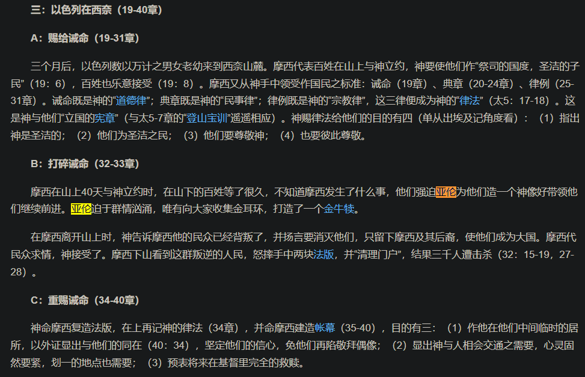

- “首先新建文件夹”
  id:: 65ddb2f4-c21f-4ae2-a577-842749bbcdb9
- 按“原创程度”和难度从大到小可以是：自己画、自己打（艺术字）；外部素材：抠图、现成的图/现成的视频（包括动图）
- 元素移动的动力因：自发、自然力（/“超自然力”）、人力
- 文本
	- 艺术字
- 背景
- 录屏
	- 飞书妙记（视频、音频转文档）
- 抠图
- ---
- 外部素材
	- 非文案成员是否要在文案基本完成前就开始准备，像是接力跑那样先往前跑起来再接过接力棒？如何沟通？
	- 真人出镜可能更快，准备虚拟素材的话可能文案还没开始改就要上了
	- TODO 批量搜索素材
	  id:: 6602b5d2-c3fe-43cd-a4af-0ce9e55b43cd
	  collapsed:: true
		- 要做某某主题，但找素材不能全靠突如其来的回忆或“主题+素材”关键词搜索这样模糊的试探
	- 素材库
	  collapsed:: true
		- [影视飓风](https://www.ysjf.com/materialLibrary)
		- [【宝藏素材库】UP主做视频必备的音效绿幕特效转场素材资源大全（分P整理好了）_哔哩哔哩_bilibili](https://www.bilibili.com/video/BV1Ut4y1y7iW)
		- [【良心推荐】10个UP主必备网站，轻松搭建素材库！视频素材|影视|动画|图片|字体_哔哩哔哩_bilibili](https://www.bilibili.com/video/BV12Y4y187rt)
		- 
			- ((66041a56-970e-4181-9b9c-77ba00ced28e))
	- 素材管理
		- 标签代替文件夹对素材进行管理？
		- 视频素材间隔重复（记忆以便联想）
	- ---
	- 医疗
		- [医疗 化验 体检 医生 手术 免费商用4K超清视频素材【合集】_哔哩哔哩_bilibili](https://www.bilibili.com/video/BV1ieYQe7EKC)
	- 用语
		- [inm圈可能会见到的一些用语 - 哔哩哔哩](https://www.bilibili.com/read/cv12780223/)
		- [凡是过往 皆为序章 有没有什么更深层的意思？ - 知乎](https://www.zhihu.com/question/264673130)
	- [【B站十年】九年前的B站都在刷些什么？骚话盘点九年前出现的10个弹幕梗_哔哩哔哩_bilibili](https://www.bilibili.com/video/BV1pt411b7rM)
	- 甲方
		- [哈哈哈，这人也太离谱了吧_哔哩哔哩_bilibili](https://www.bilibili.com/video/BV1nh4y177sH)
		  id:: 67b2b6a5-aefb-4d06-b7d2-5a06eb18c59d
	- 交通
		- 地铁
			- ((67b2b6a5-aefb-4d06-b7d2-5a06eb18c59d))
		- “龙卷风摧毁停车场”
			- [某考生科目二突然原地旋转2分半_哔哩哔哩_bilibili](https://www.bilibili.com/video/BV174411G7Pg)
			  id:: 65f99918-ea5d-4c3a-a7f0-b7525e53cb6d
	- 模拟（趣味：鬼畜等，趣味呈现不只鬼畜一种）、照片、动画，等
	- 空耳
	  collapsed:: true
		- [德国BOY原版 (空耳字幕版)_哔哩哔哩_bilibili](https://www.bilibili.com/video/BV1yx411A72S)
		  id:: 67b7dabd-334c-4a32-9880-262e6159c631
	- 鬼畜
	  collapsed:: true
		- 哲♂学
			- [过♂年_哔哩哔哩_bilibili](https://www.bilibili.com/video/BV1Qs411X7QR)
		- [鬼 畜 区 退（进）化 史（2023~2008）_哔哩哔哩_bilibili](https://www.bilibili.com/video/BV1yV4y1Y77x)
		- [【全明星】鬼畜退化史(2023-1969)_哔哩哔哩_bilibili](https://www.bilibili.com/video/BV1j44y1w7tt)
	- 宣传教育片
		- [杰哥不要 官方正版 高清重制_哔哩哔哩_bilibili](https://www.bilibili.com/video/BV1rA411g7q8)
		  id:: 665dbed9-83d3-4788-990b-daee1a28e2fe
	- 绿幕
	  collapsed:: true
		- [云中菜鸽-King投稿视频-云中菜鸽-King视频分享-哔哩哔哩视频](https://space.bilibili.com/34018302/video?tid=0&special_type=&pn=1&keyword=&order=click)
	- 舞蹈
	  id:: 66db8ac0-f2ef-47bb-8224-9492c1d93c5f
	  collapsed:: true
		- ((67402ac7-b47d-4e14-8517-3fa578246ca8))
		- [每天一遍，防止抑郁。走出阴霾，走出自卑..._哔哩哔哩_bilibili](https://www.bilibili.com/video/BV1tb411V7Wu)（“我真的很不错”）
		  id:: 66861e76-62e9-4c56-97ee-c18a91f7cab8
		- [《美 式 霸 凌》_哔哩哔哩_bilibili](https://www.bilibili.com/video/BV1sF411p7UA)
			- 未明子就896事件连线周日杰：“我们的对手怎么都这点”——后面忘了，前面也不确定，总之就这么想到了
		- [最终鬼畜蓝蓝路_哔哩哔哩_bilibili](https://www.bilibili.com/video/BV1xx411c7mu)
		  id:: 66833997-fbf6-467d-8d15-712ea7521672
		- ((6667d579-2b68-4376-a3c8-82692e0ad9aa))
		- ((6667ab34-643c-4b2c-97cf-e4e5db42dd33))
		- ((668b545f-f4d5-464f-abd3-3668e5575131))
		- [【苏喂苏喂苏喂】B站万恶之源的舞蹈片段汇聚在一起！前方高能踩点抖腿向！_哔哩哔哩_bilibili](https://www.bilibili.com/video/BV1it411A7iX)
		- [【洗脑 / 中字】超洗脑抖肩神曲！《Coincidance》抖一刻都停不下来！_哔哩哔哩_bilibili](https://www.bilibili.com/video/BV1hx411j7vN)
		  id:: 66f9576a-729b-4639-b7b0-db704823bc8d
		- [海口蹦迪王_哔哩哔哩_bilibili](https://www.bilibili.com/video/BV1Lx411B7X6)
	- 昊京
	  collapsed:: true
		- [任 何 男 人 都 要 穿 衣 服！_哔哩哔哩_bilibili](https://www.bilibili.com/video/BV19G4y1f79p)
		  id:: 66335be9-b70e-4f6e-94e6-8365f8b74ba0
			- >消费者教育是这样的，主人话语只需要附身在不同社会关系上重复重复再重复，消费者要考虑的就很多了
				- ((664ea37c-423b-4713-9e98-36648aa77535))
			- [任 何 男 人 都 要 答 辩！_哔哩哔哩_bilibili](https://www.bilibili.com/video/BV1NP4y1e71f)
	- 冬泳怪鸽
	  id:: 66335be9-1a36-462a-961b-ae0ac9063942
	  collapsed:: true
		- 奥利给
		- [【现实观察】我们要比冬泳怪鸽更怪！奥利给！_哔哩哔哩_bilibili](https://www.bilibili.com/video/BV1We4y157kZ)
		  id:: 661246c7-0158-4d24-905a-72fc33bba077
			- ((66332dd4-5c9f-4592-b729-ebbbe19aefe9))
	- 肛肠
	  id:: 66334291-214f-4052-b885-095f500c6ea9
	  collapsed:: true
		- 纲常
		  collapsed:: true
		- 松活弹抖闪电鞭
		- amongus
			- “谁放的屁好臭？！”
			- “我们中出了一个叛徒”
		- [Tom Cardy-H.Y.C.Y.BH【双语字幕】_哔哩哔哩_bilibili](https://www.bilibili.com/video/BV1x34y1Q71X)
		  id:: 66334296-54fa-4fd3-a33a-1b9ea4b9fb3e
			- 玩梗/说话的抑制、节奏；找东西/收纳
			- [今年最逆天的游戏，肛肠科医生进入病人的肠道_哔哩哔哩bilibili](https://www.bilibili.com/video/BV1tT4y1s7ij)
			- [【上海彩虹室內合唱團】雙城記現場版：张士超你昨天晚上到底把我家钥匙放在哪里了？官方首發_哔哩哔哩_bilibili](https://www.bilibili.com/video/BV1rs411R7Vz)
				- [【本尊发布】张士超 - 关于那26个电话_哔哩哔哩_bilibili](https://www.bilibili.com/video/BV1ws411a7j8)
		- [你的钢门比较松弛是什么梗【梗指南】_哔哩哔哩_bilibili](https://www.bilibili.com/video/BV1aH4y1J7w4)
		  id:: 6633474f-7b0e-4856-a9ce-5498d22efe1e
		- [Avast Your Ass - Kitsune² - 单曲 - 网易云音乐](https://music.163.com/song?id=1645644&userid=77770261)
		- [大型社死现场，肛肠科女医生直接被喷粪便_哔哩哔哩_bilibili](https://www.bilibili.com/video/BV13Y4y1T7Bd)
		- [根除痔疮最好的办法，竟然是……（不是提肛|丁香医生](https://dxy.com/article/173054)
		- ((65db409c-d3d1-4a54-b0e9-bdb754d34982))
	- 漫画
	  id:: 670d40e2-7936-47ca-98a9-cf3f9a8b1391
	  collapsed:: true
		- ((672abde8-b31d-46ad-a70b-63c1389d12d6))
		- ((6719fe4f-9b5f-4796-b750-f6fa42a991a8))
		- 刃牙
		  id:: 66e57425-01dc-40e5-8fd5-1b4b607335cb
			- [刃牙的世界观是属于低武、中武还是高武？ - 知乎](https://www.zhihu.com/question/301877035)
			- ((6718fea9-14d1-4869-ad97-c621c15a9fe3))
			- [在线播放范马刃牙 第一季 第01集-范马刃牙 第一季高清在线观看动漫网站-MuteFun动漫网站-无声乐趣-(゜-゜)つロ 干杯~](https://www.mute01.com/vodplay/2480-2-1.html)
			  id:: 6719ba11-14ac-4caf-8127-867198140971
				- [动漫《范马刃牙第二季》第01集免费在线观看-樱花动漫](https://www.nanhuyt.com/v/4818-1-1.html)
					- ((67889b8a-08e2-4a68-9581-693d15dba40c))
			- [【图片】从另一种角度分析本部的“守护道”【刃牙吧】_百度贴吧](https://tieba.baidu.com/p/6636269134)
			  id:: 679add85-7bc5-4780-8637-ecc230ccd145
			- ((669c792d-3122-4dcc-ae10-db2a70331c0d))
			- ((67c54840-acfc-4b26-bc8b-2fb6fb348411))
		- [超人气漫画《这就是物理》：5岁就可以开始翻，85%以上中学物理考点！ - 知乎](https://zhuanlan.zhihu.com/p/104854259)
		  id:: 672aedd4-ac12-4b84-b054-a284f4d412e6
		- [【悼念今 敏】作品的凝视与和解——关于《OPUS》的前前后后 - 知乎](https://zhuanlan.zhihu.com/p/79619947)
	- （预制）音效
	  id:: 66ade380-2cfc-4114-98f0-5cac420def6f
	  collapsed:: true
		- ((63bc2109-248e-4d11-a583-d91f3832fdf2))
			- 罐头哭声
			  collapsed:: true
				- 香蕉猫
					- ((66ade37f-66ed-422e-b994-c3baa99c304e))
			- 罐头喊声
				- 威廉尖叫
					- ((66ade3b4-b292-4854-b4e1-54ae4c0f4fde))
	- 音乐
	  collapsed:: true
		- [素材 - 歌单 - 网易云音乐](https://music.163.com/playlist?id=10163238695&uct2=U2FsdGVkX1/jEEwsFQduDZ6JUZyPnMfuhgWt6cT6s90=)
		  id:: 67221796-ad5b-4785-943c-3a80cbe00d57
			- “素材？又一个老爱听重新选歌单！”
		- ((67315376-e7d6-44df-be2e-752357a0bf17))
		- [【4K120帧 HiRes】神曲《Levels》 Avicii 艾维奇 无损音质_哔哩哔哩_bilibili](https://www.bilibili.com/video/BV16u4y1N7rb)
		  id:: 67402ac7-b47d-4e14-8517-3fa578246ca8
			- [【Avicii/收藏向】盘点《Levels》的神级Remix版本！！！_哔哩哔哩_bilibili](https://www.bilibili.com/video/BV1tN4y1e759)
			- 赏析：开头的电梯亮下键意为“down”，“悲伤的，低落的”
			  id:: 675eed5d-b6f1-46c7-a14f-e95018a930ed
			- [Levels – Avicii 大学生翻拍版_哔哩哔哩_bilibili](https://www.bilibili.com/video/BV1eJ411a7NK)
			  id:: 67810004-6a63-45f9-b4cc-08454d173511
		- [【蔡依林】JOLIN x R3HAB 新歌《Stars Align》MV_哔哩哔哩_bilibili](https://www.bilibili.com/video/BV1A64y1i7HA)
		  id:: 677008d7-47d1-449d-b6f6-6421510b12f6
			- 之前没注意，这下真是“蔡依林的美妙音乐了”
		- （有）人声
			- 华语
				- [【4K修复】陈慧琳 - 花花宇宙 MV_哔哩哔哩_bilibili](https://www.bilibili.com/video/BV1jJ411h7bU)
				  id:: 668509b4-8851-4ef4-aad4-79334e01f57e
				- ((66bacd3f-fcd9-4b7a-8dfb-6ba36144d040))
				- [【4K修复】林俊杰&By2 - 不潮不用花钱MV 修复版_哔哩哔哩_bilibili](https://www.bilibili.com/video/BV17t411j7Me)
				  id:: 677754c2-e9e3-45a9-b034-bdbacb2b7e4d
					- [林俊杰的《不潮不用花钱》唱的到底是什么？ - 知乎](https://www.zhihu.com/question/36915532)
					- ((6777540d-f596-40b0-8674-2a1570c47d4b))
					- ((67775525-4bd2-434d-81d5-b217111e0ac2))
			- [(少女时代)-Gee_哔哩哔哩_bilibili](https://www.bilibili.com/video/BV1fs411u735)
			  id:: 6667d579-2b68-4376-a3c8-82692e0ad9aa
		- [每个国家的刻板印象音乐_哔哩哔哩_bilibili](https://www.bilibili.com/video/BV1D24y1Y7VJ)
		  collapsed:: true
			- [世界各国刻板印象音乐_哔哩哔哩_bilibili](https://www.bilibili.com/video/BV1j44y1g7Gd)
		- [意大利曼陀铃演奏-Tarantella napoletana（那不勒斯）_哔哩哔哩_bilibili](https://www.bilibili.com/video/BV1Um411k7jU)
		  id:: 660e3772-9bdf-4a48-8368-3e6b5bd40620
		  collapsed:: true
			- [最快识别意大利人_哔哩哔哩_bilibili](https://www.bilibili.com/video/BV1ug411M7jv)
			  id:: 66ade380-1c2a-4930-82be-5084d5f36bac
		- 钢琴
		  id:: 669c8784-a3b8-4375-89a0-f3ea4a119a61
			- [《   出   埃   及   寄   》_哔哩哔哩_bilibili](https://www.bilibili.com/video/BV13g4y1P7fm)
			- [这么臭的谱子还能要吗（悲）_哔哩哔哩_bilibili](https://www.bilibili.com/video/BV19g411f7AZ)
			- [请  不  要  在  钢  琴  上  做  实  验_哔哩哔哩_bilibili](https://www.bilibili.com/video/BV1uQ4y1b7aU)
		- 时间
			- [Dying Light](https://music.163.com/song?id=1297742607&userid=77770261)
		- 夏日漱石
		  id:: 665a9b31-1ed1-4b6a-bcbd-8adb80b8ae01
		  collapsed:: true
			- 
			- 
			- [哪首歌让你单曲循环听好多遍？ - 枫叶的回答 - 知乎](https://www.zhihu.com/question/357376901/answer/954508748)
			  id:: 665a9afa-6319-4dde-a70b-f00ca99d659d
		- 毛毛歌
		  collapsed:: true
			- [每个人的身上都有毛毛完整版_哔哩哔哩_bilibili](https://www.bilibili.com/video/BV1wK4y1Q7jg)
			  collapsed:: true
				- [【万恶之源】尹光 - 毛毛歌_哔哩哔哩_bilibili](https://www.bilibili.com/video/BV1JU4y1x721)
		- 香烟二重奏
		  collapsed:: true
			- [【Princess Chelsea】The Cigarette Duet_哔哩哔哩_bilibili](https://www.bilibili.com/video/BV1ws411R74r)
			  id:: 65fef669-d80e-4348-8bfd-1757234ffcdf
		- 二创
		  collapsed:: true
			- [“今天妈妈不在家”一气呵成5分钟洗脑循环~~~_哔哩哔哩_bilibili](https://www.bilibili.com/video/BV1Fx411N7aZ)
			  id:: 6600f097-7c03-47ae-b9bc-b5fa87475896
		- 《你看到的我》
		  id:: 660e3189-5a74-4313-b097-464cc93adf92
		  collapsed:: true
			- [任浩铭&黄勇-《你看到的我》-MV_哔哩哔哩_bilibili](https://www.bilibili.com/video/BV1ur4y1M7wX)
			- [黄勇,任浩铭 - 你看到的我 (DJ版)_哔哩哔哩_bilibili](https://www.bilibili.com/video/BV1L5411J7BN)
			  id:: 678f0fef-9ae2-4f4b-99b5-0df59ceda8b1
			- 二创
				- [大哥只想保护人类有错吗？偶遇史上最强大哥！_穿越火线](https://www.bilibili.com/video/BV1kh411W76D)
				- [穿越火线130周年主题曲-《背背背，背起了行囊》_网络游戏热门视频](https://www.bilibili.com/video/BV1BS4y1R7GL)
				- [【AI未明子 X AI马督工】❤️你看到的我❤️~“你看到的我，是哪一种颜色？”_哔哩哔哩_bilibili](https://www.bilibili.com/video/BV1Va4y1r7s2)
		- [Amerika —— Rammstein 中德字幕版MV_哔哩哔哩_bilibili](https://www.bilibili.com/video/BV1xs411k7dD)（“美国模式”）
		  id:: 67613338-4a66-4a4f-b7fd-93cfa47252c1
			- ((676fc2c8-acfa-4cd9-92e8-7a20bbc9d6b0))
		- [Bonnie Tyler - Holding Out For A Hero (Official Video)【中英字幕】_哔哩哔哩_bilibili](https://www.bilibili.com/video/BV1w3411B7Sm)
		  id:: 660185ed-82ca-4fa9-9838-dc503e8bdeb2
		- 啊~
		  collapsed:: true
			- 群青
			- see you again
		- ((66334296-54fa-4fd3-a33a-1b9ea4b9fb3e))
		- 雨
		  id:: 66879ece-8135-4cce-b01f-a70bae67aba2
		  collapsed:: true
			- [Come Clean (Nightcore Edit) - Master Blaster - 单曲 - 网易云音乐](https://music.163.com/song?id=403310863&userid=77770261)
			- [Dancing In The Rain - FUTURECODE/Roxanne Emery - 单曲 - 网易云音乐](https://music.163.com/song?id=1355814875&userid=77770261)
			  id:: 6687b1e5-2d33-45e4-9423-cf057f850396
			- [Raindrops (Technikore Remix) - Ben Nicky/Stunt/Technikore - 单曲 - 网易云音乐](https://music.163.com/song?id=1454871881&uct2=U2FsdGVkX19SCgil1bKbWNW3ZxwoRRtnGFhzUmX3YXs=)
			- [冰雨(Live) - 刘德华 - 单曲 - 网易云音乐](https://music.163.com/song?id=110397&userid=77770261)（华为）
			- [心雨 - 毛宁/杨钰莹 - 单曲 - 网易云音乐](https://music.163.com/song?id=1952813659&userid=77770261)
	- 科普
	- [[影视]]
		- 动画
		  id:: 679add85-4334-42a1-96de-402e7d62a979
		  collapsed:: true
			- ((672cb264-cebb-475d-bd0b-8d9b9971e292))
			- ((66dba0bf-51e8-4492-a714-d8ee36454d6c))
			- [“老东西，我们走了以后也要保持童心噢”_哔哩哔哩_bilibili](https://www.bilibili.com/video/BV17x421U7QH)
			- 黑猫警长
				- [【4K修复】黑猫警长 (1984) 5集全【上美】_哔哩哔哩_bilibili](https://www.bilibili.com/video/BV1zB4y1v7Jz)
			- 日本动画
			  id:: 679add85-46a8-433f-aa9d-9ded910772b9
				- 奥特曼
				  id:: 66ade3ac-c13a-4d9b-b8e0-6698960562d5
					- ((64943908-f232-4f43-87bc-83248652231e))
					- >很多人为了适应现实就是会自缩舒适圈的，对奥特曼这类流行（“流行过了就不流行了”）文化不感兴趣，觉得奥特曼就是奥特曼，甚至是潜意识里想不起来的outman
				- [高达铁血的奥尔芬斯 OP3 RAGE OF DUST (回忆系列) AI 4K (MAD·AMV)_哔哩哔哩_bilibili](https://www.bilibili.com/video/BV1VV411Q7m8)
				- 七龙珠
				  id:: 664da4b4-91fc-4f0b-a1ae-3bf081842c01
					- [Super Kamehameha - song and lyrics by DJ Pygme | Spotify](https://open.spotify.com/track/2GL3pLtWZuU3FpA663zDMK?si=81dd9e43898842f8)
					  id:: 664da4b6-e1ed-482e-832c-f71c8a63615b
						- [DJ Pygme - Super Kamehameha - YouTube](https://www.youtube.com/watch?v=_4uazgbBH40)
						  id:: 6650780c-5fc9-463e-bca6-7d79642e3742
					- ((66335be1-4def-4ff7-8f3e-1e19070b229c))
					- [《七龙珠》中的贝吉塔为什么无法超越孙悟空？ - 知乎](https://www.zhihu.com/question/64737739)
					- ((66ade37e-101b-4c4f-bd7b-1cee82bfd1b4))
				- 数码宝贝
				  id:: 66668b83-6da9-47a7-a07c-5f91af8c3a25
					- 有元宇宙、AI、太一，二次元网哲们不看它看啥？
					- [brave heart（TV动画《数码宝贝大冒险》进化曲） - 宮崎歩 - 单曲 - 网易云音乐](https://music.163.com/song?id=29816860&userid=77770261)
					  id:: 666687f9-086e-4c4a-94ee-a61c17f379cd
					- [彷徨于两个时代——从数码宝贝和神奇宝贝说起（数码宝贝）剧评](https://movie.douban.com/review/15719421/)（“你疑似有点懂数码宝贝”）
					- [被选召的孩子 - 萌娘百科 万物皆可萌的百科全书](https://mzh.moegirl.org.cn/%E8%A2%AB%E9%80%89%E5%8F%AC%E7%9A%84%E5%AD%A9%E5%AD%90)
					  id:: 66dad1d4-db85-4a5e-8bc4-88c41848efc2
				- 口袋妖怪/（精灵）宝可梦/神奇宝贝/宠物小精灵
				  id:: 664df622-536e-43db-acb6-64e13dc5aba8
					- ((64a76bb9-6687-41d7-aca9-be574d8e4687))
					- [宝可梦为何不统治人类？ - 知乎](https://www.zhihu.com/question/23363567)
					  id:: 679add85-30d2-4e51-b37c-59e19fc906be
						- 宝可梦被多元主义“纵切”难以团结？
					- [神奇宝贝世界里的人吃什么肉？ - 知乎](https://www.zhihu.com/question/29679062)
					- ((64ae539d-ce0e-48cf-82bd-3af252cc8af8))
					- ((66335c20-a657-4c9f-9505-cf6d38f3bb94))
					- 超梦（另：赛博朋克2077的超梦）
					  id:: 664ea37d-2c6a-4970-a60b-85f04446ae76
					- ((664981c8-b251-4d47-bee9-a253ec501618))
				- 名侦探柯南
				  id:: 678b04b6-fba8-418b-9b03-5dffa5b06053
					- 二创
						- 搞笑配音
							- [声物课的个人空间-声物课个人主页-哔哩哔哩视频](https://space.bilibili.com/308693140)
					- ((678b04be-5209-42a6-87ea-59b4d2ed1e4b))
				- 蜡笔小新
				- EVA
					- [【EVA】EVA明朝体字体下载_哔哩哔哩_bilibili](https://www.bilibili.com/video/BV1f44y117Xc)
				- 进击的巨人
				  id:: 6699d14d-680a-4100-b1ba-06493e9bb41f
					- [进击的巨人搜索结果 - 路漫漫在线动漫](https://www.lmm52.com/vod/search.html?wd=%E8%BF%9B%E5%87%BB%E7%9A%84%E5%B7%A8%E4%BA%BA)
					- >What's the lie? What's the truth? What to believe?
						- [第三季op1  Red Swam_哔哩哔哩_bilibili](https://www.bilibili.com/video/BV1Mv4y1T7Pk?p=5)
						- id:: 66d5a41c-6440-4dc7-b3ba-b8dfa1131e88
						  >不管是相信自己，还是相信最信赖的队友，结果永远都是没人想得到的。 所以...嘛，还是自己选个不会让自己后悔的吧！——利威尔
						- {{embed ((66ade391-1eed-404c-9f96-219f8ba0c25d))}}
						- {{embed ((66ade390-ff3b-427d-a6d2-cb2b6d14bef2))}}
					- >学习鲁迅，永远进击
						- [《进击的巨人》与鲁迅的“《进击的狂人》” - 简书](https://www.jianshu.com/p/98eab7e76f51)
						- [进击的巨人与鲁迅 - 哔哩哔哩](https://www.bilibili.com/read/cv28486544)
						- “好果汁，你让我陷入疯狂！”
					- 身份认同
					- [《进击的巨人》完结：写在“记忆”中，循环往复的历史荒诞剧_澎湃号·湃客_澎湃新闻-The Paper](https://www.thepaper.cn/newsDetail_forward_12135613)
					- [进击的巨人 | “自由”的哲学意义(上篇) - 哔哩哔哩](https://www.bilibili.com/read/cv5981233)
					- [以谈之巨人阿尔敏为代表的和谈小队，悲观态度推测](https://www.douban.com/group/topic/220432745/?_i=1208892SPSFC4P)
					- [【谏山创密码】巨人：艾尔文团长父子的光与影（上）——历史的容貌（&amp;加餐：明朝为何 - 哔哩哔哩](https://www.bilibili.com/read/cv7588229/)
					- [忘记剧情？思维导图加文字，帮你梳理《进击的巨人》前三季内容 - 哔哩哔哩](https://www.bilibili.com/read/cv8787045)
					- [艾尔迪亚人和马莱人原型？谏山创最新访谈 - 哔哩哔哩](https://www.bilibili.com/read/cv21172260)
					- “青年耶格尔派”
					  id:: 66dba0bd-6edc-4eef-9003-de21e9af324c
						- [为什么我是坚定的耶格尔派（1） - 哔哩哔哩](https://www.bilibili.com/read/cv10001036)
						- “怎么才八成啊？”
					- ((66ade39a-45ed-4f03-a47e-256f27f3ae27))
						- ((669c7ec6-cc25-410d-bbb2-995e3cc18ac8)) （看词条提到摩西之外还有那个赶时间赶路的“亚伦”想到搜搜的）
						  id:: 669c8354-467e-41dd-9f4d-696254c9e0a9
							- [大家叫“艾伦”的多，还是“艾连”多？【进击的巨人吧】_百度贴吧](https://tieba.baidu.com/p/5195114739)
							- 
							- 
							- 罗马字Eren应该就是为了适配日语对“艾伦/亚伦”的发音
							- 三笠摩西？
							- ---
							- 
							- [《进击的巨人》剧情全解析 中篇：巨人起源](https://www.douban.com/note/538502517/?_i=1532701SPSFC4P)
						- [【剧情分析】进巨中的圣经意象及分析【进击的巨人吧】_百度贴吧](https://tieba.baidu.com/p/3739619614)
						- ackerman，archangel？
							- [有关阿克曼和恶魔的疑问](https://www.douban.com/group/topic/206576501)（“原来是这样啊，那没事了”）
					- 第三季
						- 海边螺壳：时间的螺旋
					- OAD
						- “什么蝴蝶效应？”
						  id:: 66c540d1-bf21-4cbc-93ba-e24aecc9231f
							- [关于进击的巨人ED《路上小心》最后那只蝴蝶的一点补充 - 哔哩哔哩](https://www.bilibili.com/read/cv27860857)
					- geek吉克
					  id:: 67774973-fdb2-4402-895c-9e124ec1e479
					  peek/peak皮克
					- 最终季
						- 车力巨人
							- ((668ce769-d3b9-40f9-b221-e02732d24960))
						- “克鲁格是一个潜伏在马莱的纯正的艾尔迪亚人！”
							- “要爱墙那边的人啊！”
						- 《艾尔迪亚人的最终解决方案》
					- 完结篇
						- 㺢㹢狓
							- [以防万一，你没见过㺢㹢狓吃西瓜👅_哔哩哔哩_bilibili](https://www.bilibili.com/video/BV1Mn4y1o7eq)
								- 
							- 始祖尤弥尔的舌头和沉默
								- 难以通过交流成长，更多靠听
									- “始祖尤弥尔擅长捏造未来，可她是个实证主义者？”
								- “大她者的沉默”
							- 殖民非洲
						- ((66ade37e-bf9e-49bf-8ba6-2e522e575ac4))（亚妮托阿尔敏）
						- “还是看看近处的螺壳吧！”
						- [进击的巨人部分结局猜想——“你是自由的” - 哔哩哔哩](https://www.bilibili.com/read/cv8838991)
						- [【分析】尤弥尔选中三笠的理由【进击的巨人分析吧】_百度贴吧](https://tieba.baidu.com/p/7295852541)
						- [进击的巨人：五十年科技赶超、安乐死、地鸣灭世，三种计划解读与评析 - 哔哩哔哩](https://www.bilibili.com/read/cv7266696)
						- [关于韩吉承认吉克的安乐死计划可能是最佳选择](https://www.douban.com/group/topic/284395403/?_i=4502944SPSFC4P,4542685SPSFC4P)
						- [进击的巨人：吉克认为“安乐死”没错，为什么还要帮助阿尔敏？ - 哔哩哔哩](https://www.bilibili.com/read/cv9787480)
						- [保姆级拉片分析最后艾伦和阿尔敏在路中谈话，艾伦为何要地鸣，他真正想看的景色是什么 - 哔哩哔哩](https://www.bilibili.com/read/cv27555584)
						  id:: 66ca79fc-499a-4cc2-8c52-84779ffcbfcc
					- ---
					- “我是自由哒！”
						- “傻孩子，快停下，那不是自由哒！”
					- [进击的巨人VR版来了！原班人马配音！人物建模还原！除了画质稀烂其他的我吹爆！_哔哩哔哩bilibili](https://www.bilibili.com/video/BV1Kf421B73t/)
					  id:: 66cbe004-7a4b-4aa1-a98f-3100422dc21e
					- 奇异人生
					  id:: 66cd9fd4-dd5e-47d2-a774-608d55ffa96d
						- >想到有回溯时间的法力的游戏，奇异人生
						  一个地鸣一个天啸，这下法力爆了
						  都是蓝黑蝴蝶（好像前几天就想到了，）
						  经典蝴蝶效应
							- ((66c540d1-bf21-4cbc-93ba-e24aecc9231f))
					- ((66a83398-045c-4a18-a1d2-715f16023f08))
					- ---
					- [正确认识《进击的巨人》的思想腐蚀 - 知乎](https://zhuanlan.zhihu.com/p/360547090)
					  id:: 67176a78-104a-4803-b244-4193cee6ae6e
						- [重评《进击的巨人》 - 知乎](https://zhuanlan.zhihu.com/p/362785757)
						- 之前看到没注意看，看《南京大屠杀》时想到了，除了“城墙”、“安全区”的意象（主要是联想而非直接对应）外还有意识形态教育
					- [巨人究竟是反战作品还是披着反战伪装的唯立场论作品? - 知乎](https://www.zhihu.com/question/419142867)
					- [为什么《进击的巨人》这么明显的反战思想还能被人曲解? - 知乎](https://www.zhihu.com/question/452841537)
				- 超时空要塞
					- ((67b42c4f-4658-4514-9f65-bd454b4c5b16))
			- 小马宝莉
				- [[MLP] 马力Voc：20% Tylenol（Rainbow Tylenol MAD）_哔哩哔哩_bilibili](https://www.bilibili.com/video/BV1ws411q7tb)
				  id:: 666a5c02-e610-4faf-8772-808a04ccf397
			- 猫和老鼠
				- “猫鼠队上大分”
				- 各种受伤
			- cyriak
		- 电视剧
			- [“吔屎啦，梁非凡”非凡哥原版片段_哔哩哔哩_bilibili](https://www.bilibili.com/video/BV1ix411c7mk)
			  id:: 67cade5c-4904-4a49-9338-7355f74cc29d
			- “谍战”
				- “谍战”会助长猜忌他人的社会风气吗？
				- [谈谈谍战电影对传统主流文化电影的影响? - 知乎](https://www.zhihu.com/question/361332646)
				- [谍战类型的拓展与社会价值的缺失_光明网](https://wenyi.gmw.cn/2021-06/02/content_34893838.htm)
				  id:: 67611daf-a711-48ea-b599-5d189e51456b
			- 激战江南
				- 鸡汤来咯！
					- [老 顽 童_哔哩哔哩_bilibili](https://www.bilibili.com/video/BV1wm4y1D71L)
			- 西游记
				- [解密西游|西游神秘五虫和八大神兽？如来佛祖道出三界玄机！](https://mp.weixin.qq.com/s/azW_PCY25GgSiT9u6ODCeQ)
				- [六小龄童老师教你如何正确理解西游文化，领会美猴王精神](https://www.bilibili.com/video/BV1fb411H7WC)
				  id:: 624a57b9-24e3-4866-83e3-d1de5aeb6370
				- [年少不懂孙悟空，读懂已不再少年_哔哩哔哩_bilibili](https://www.bilibili.com/video/BV1qr4y1Y7Fx/)
				- ((624a4d32-1e57-4179-bef8-a01960e50865))
				- [朝供制度是天庭的基本经济制度：1.朝供制度；2.天庭的双重含义；3.朝供制度的两层含义；4.天庭的两种经济模式。](https://www.bilibili.com/video/BV1H3411374g)
				  id:: 62b1bd2a-b8d2-49c0-82a9-18be08c4eda6
				- [毛泽东与《西游记》，最喜爱富有战斗意志的孙悟空_凤凰网](https://history.ifeng.com/c/8cMFqUbVg7A)
				  id:: 66cdaefb-7d4f-41c0-9633-3ec8c1d186d2
				- 二创
					- 搞笑配音
						- [【东北版】我叫你一声你敢答应吗_哔哩哔哩_bilibili](https://www.bilibili.com/video/BV18s411i72P)
						  id:: 66dba0bd-fc98-4c2b-a2ea-25bbeeb16bfd
				- 孙悟空火眼金睛，为什么还要用手遮光？
			- 快乐星球
			  id:: 660443b3-eb52-481c-98fe-0f129c83bddc
				- [《快乐星球》王英姿 - 《月亮船》_哔哩哔哩_bilibili](https://www.bilibili.com/video/BV13W411i7P2)
				  id:: 6604457c-c056-407b-8cea-940e9dd3a4bc
				- [如何评价少儿科幻剧《快乐星球1》？ - 知乎](https://www.zhihu.com/question/24907878)
				- [为什么《家有儿女》里的童星长大后光芒四射，而《快乐星球》里的童星却消失了？ - 知乎](https://www.zhihu.com/question/265490527)
		- 电影
			- [什么是电影的「导演剪辑版」？ - 知乎](https://www.zhihu.com/question/19928119)
			- 让子弹飞
				- [敢 杀 我 的 马？！_哔哩哔哩_bilibili](https://www.bilibili.com/video/BV1yt4y1Q7SS)
			- [好莱坞的末日什么时候到来？](https://mp.weixin.qq.com/s/mv_En-f-MWFa91vmjgNUEA)
				- #+BEGIN_QUOTE
				  艺术和文化已经死亡了，成为工业生产的一个门类。——霍克海姆
				  
				  晚期资本主义的文化注定是保守的，因为文化和艺术已经变成了资产阶级的财富表现形式——阿多诺
				  
				  大众文化阶段新的东西就是排除新的东西。——霍克海姆
				  #+END_QUOTE
				- #+BEGIN_QUOTE
				  id:: 6281b90b-f242-4b3a-a5bc-fc21258818ab
				  超级英雄片为什么能打动人，不是因为他们超能力有多强，而是其中的理想与精神、责任与力量、爱与希望等等诸多元素的体现。如果没有这些情感的铺垫和人物的升华，仅仅是单纯的爆武力值，手撕飞船跟手撕鬼子没有区别。
				  #+END_QUOTE
				- 血统论
				- ((62870a77-d563-4eec-8f79-7c24a0fc7d09))
				- ((62930316-bd31-4c95-8835-877c30c58cfd))
				- [壮志凌云2爆火：美国人也玩起了“手撕鬼子”](https://mp.weixin.qq.com/s/9_nJ998-gr9L93cjeXEe2g)
	- 广告
	  collapsed:: true
		- ((660f8b95-3e09-45a5-812d-0021c821b782))
			- [这是大哥给你申请的网贷原版_哔哩哔哩_bilibili](https://www.bilibili.com/video/BV1Wc411c7S5)
		- ((65d0ac85-1da4-4678-b0a9-66ddb798426c))
		- [iPhone就是个垃圾高清原版视频_哔哩哔哩_bilibili](https://www.bilibili.com/video/BV1pb411c7yd)
		  id:: 665d4010-2854-4fbf-a1a0-96ec4b419d74
		- 神医宇宙
		  id:: 65bcbf54-d048-4cb1-8a79-d8abd5d5b946
			- ((6602728d-d67f-4f6f-9e67-787b2b9b1c70))
		- [经典售房广告_哔哩哔哩_bilibili](https://www.bilibili.com/video/BV1mp4y1a7Ex)
	- 儿歌
	  collapsed:: true
		- 宝宝巴士（“宝宝巴适”）
		  id:: 65f39270-9bba-42d8-8987-1020f9f84484
			- [我会自己上厕所-宝宝巴士儿歌_哔哩哔哩_bilibili](https://www.bilibili.com/video/BV12x411E7xp)
			- [宝 宝 巴 适_哔哩哔哩_bilibili](https://www.bilibili.com/video/BV1aS4y1j7BM)
		- [亲宝儿歌《拉臭臭》_哔哩哔哩_bilibili](https://www.bilibili.com/video/BV1i7411b7za)
		  collapsed:: true
			- [【倒放】亲宝儿歌-拉臭臭_哔哩哔哩_bilibili](https://www.bilibili.com/video/BV1s7411V7oC)
	- 套娃help
		- [【禁止套娃】【素材】【lennoz】i n f i n i t e  DRAGON DREAM FEET_哔哩哔哩_bilibili](https://www.bilibili.com/video/BV1NJ411q7Fi)
		  id:: 65eff42f-8075-46a9-896c-eb42660a7f6e
			- >注意看，最后是help，不是系统故障啊，说明前面的能指给出了悬念，大家笑容满面、好顶赞是有原因的，那就是help
	- 交通
	  collapsed:: true
		- ((65bcbf56-88f7-4c54-99df-da1ef45729e4))
	- ((668ce769-ff5c-4471-bc88-db8b433bde97))
	  collapsed:: true
	- 丁真
	  id:: 679add85-226c-4370-bb91-f17b2f8d598c
	  collapsed:: true
		- [丁真新单曲《烟Distance》痛苦流说唱_哔哩哔哩_bilibili](https://www.bilibili.com/video/BV1N84y1P7en)
		  id:: 65f27739-b24f-4dea-a7f3-5c2cf59c2e69
	- 恋爱
	  id:: 670d40e2-74c0-4ab6-ba53-4f17b89250ac
	  collapsed:: true
		- [刀哥公交车点炸弹💣_哔哩哔哩_bilibili](https://www.bilibili.com/video/BV1Sz4y1g7yi)
		- >想要我的财宝吗？ 想要的话可以全部给你，去看未明子吧! 我把所有密码都放在那里。
	- 看片
	  collapsed:: true
		- [silence belle 原版视频（高清无字幕）_哔哩哔哩_bilibili](https://www.bilibili.com/video/BV1uv411s7iQ)
	- “你这背景太假了”
	- 媒体
		- 吕记者
	- “哥们”
	  collapsed:: true
		- 退钱哥
			- “日内瓦，退钱！”
			  id:: 66475db5-545f-4a4a-a218-78c86e8065b0
		- 结扎哥
		- 药水哥
		  collapsed:: true
			- [【药水哥】宁看我？那我也看宁！绿幕素材_哔哩哔哩_bilibili](https://www.bilibili.com/video/BV1wQ4y1K7uR)
			  id:: 65f70f24-3d4c-402c-9778-510f3556afd5
		- 面筋哥
		  collapsed:: true
			- ((66128093-ddc3-4f2e-8f32-4711f240d77d))
	- 卢本伟
	  collapsed:: true
		- ((666a451a-ff24-4094-8352-56d452e00c77))
	- ((66127979-8b16-4077-b9f6-f49245d6c0e9))
	- [月薪3200的大哥，说话就是不一样！充满了自信！_哔哩哔哩_bilibili](https://www.bilibili.com/video/BV1jr4y1z7qG)
	  id:: 6666e220-49c5-4655-a1c3-4f1eac37e9ba
	- 梅菜扣肉
		- [梅菜扣肉咬人事件_哔哩哔哩_bilibili](https://www.bilibili.com/video/BV1R341187wL)
	- [【识时务者为俊杰】高清/无水印/无字幕/鬼畜素材/原版_哔哩哔哩_bilibili](https://www.bilibili.com/video/BV14x4y1j71a)
	  id:: 65f7b798-a963-4f27-8df9-d8169703a12d
	- ---
	- 《明天会更好》
	  collapsed:: true
		- [4K超高清 修复版 《明天会更好》1985  60位歌星大合唱~_哔哩哔哩_bilibili](https://www.bilibili.com/video/BV1AK4y197GR)
		  id:: 65ebf8ea-5256-4e49-9a8a-fecb601e289e
			- [群星《明天会更好》，好多都没有情绪和轻重去唱#群星 #明天会更好_哔哩哔哩_bilibili](https://www.bilibili.com/video/BV1vgkMY4EKT)
			  id:: 679593fa-0787-4b6f-9aac-3b79a085d771
	- 国外
	  collapsed:: true
		- “向天堂奔去”
		  collapsed:: true
			- [天堂に駆ける_哔哩哔哩_bilibili](https://www.bilibili.com/video/BV1f34y1r7y8)
			- [YOASOBI 夜に駆ける (Yoru ni Kakeru) Official Music Video_哔哩哔哩_bilibili](https://www.bilibili.com/video/BV1Ph411C7S5)
			  id:: 678b04b6-7a05-45c1-a0d3-0ca13ca6624b
				- “梦游先生、跑酷”
		- 集体三轮拍脑门
			- [【名场面】拍脑门_哔哩哔哩_bilibili](https://www.bilibili.com/video/BV1v5411m74P)
		- [【名场面】no god please_哔哩哔哩_bilibili](https://www.bilibili.com/video/BV1ar4y187Z5)
		- “全世界都在讲中国话~”
			- [“全世界都在说中国话”_哔哩哔哩_bilibili](https://www.bilibili.com/video/BV1vL411375E)
			- 姜文
				- [【笑喷！普通话鬼才姜文教的中文】昆汀解释牛逼一词的来源_哔哩哔哩_bilibili](https://www.bilibili.com/video/BV1d4411j7FX)
				- [姜文不仅教了昆汀说“牛逼”，还教会了“傻逼”_哔哩哔哩_bilibili](https://www.bilibili.com/video/BV1K4411x7aW)
			- 外国集会现场乱入“他们都是sb啊”
				- [他们都是傻逼_哔哩哔哩_bilibili](https://www.bilibili.com/video/BV1Nv411y7AQ)
	- 真正有用的知识（“hamburger with no ham”）
	  collapsed:: true
		- 搬运的话，不清楚类似组织有没有
		- “什么是什么样”
			- 外部视频我看了一个B超，应该是全屏录屏YouTube视频，这样多了一层窗口，或许有种把观众往外推了一层、IMAX从全屏变成看到前排一堆光头的感觉，以及白色背景色调可能有点偏亮；截屏移动鼠标的操作也可以挑剔有些游移不定
				- youtube应该可以下载视频，然后剪辑，或者在清晰度足够的情况下截屏录屏
					- 参考一种比较主流的做法，可以在角落标上视频来源
		- “什么是什么原理”
		- 假装有用的知识
			- “假装教英语等”
				- [被知识侵犯是什么梗【梗指南】_哔哩哔哩_bilibili](https://www.bilibili.com/video/BV1xg4y1y7BS)
				  id:: 670d40e2-a11e-4a79-b58e-43688f7810c0
	- 中介形象
	  collapsed:: true
		- 分平台、分热度素材
		- 素材分类（生物分类、情绪分类、场景分类）
		- 红三角
		- 现实人类
		  collapsed:: true
			- 口播
			  collapsed:: true
				- ((659e91c5-e602-4cfe-9bf7-d1ba2d126489))
					- [【葛平】葛 平 复 刻 葛 平_哔哩哔哩_bilibili](https://www.bilibili.com/video/BV1se4y1H7b5)
				- 用好看好听的人，比如好看的服装模特、健身爱好者，比如“请静静介绍话题”
				- 目前有的视频听着音频本身有些拖沓（“2倍速还好”）、卡顿、发音不标准（、活力不足、没有激情......），收音不够清晰（“硬件上也要了解一下”），同时与字幕不是很对齐
					- 【【锻炼】运动后如何放松？拉伸与按摩（1）-互助按摩！】 【精准空降到 00:11】 https://www.bilibili.com/video/BV16w411k75q/?share_source=copy_web&vd_source=24175964b0df2fcc2c022cae23517fdc&t=11
						- 还有就是后面，人看视频赶时间的话，可能顺序上，先给个动作再讲注意事项会比较能维持注意力；如果一定要先讲完注意事项的话，可能片头加长一点摘要里有真人图像比较好（这样做的话可能又需要一个过渡的片头：可以是放中间的，可以是把几种按摩手法分屏旋转完过渡的）
						- 后面那个三个卡通女性运动的短片看着有点怪，比如左边那两张侧脸——当然右边也有点怪
						- “活动度”的意思不够明确，从视频中无法确定什么意思
						- 视频与音频、字幕有些不相关，同时卡通风格也没有真人视频那么具有可信感
				- 还有就是听起来有些小声（“像是怕大点声炸麦一样”）
			- 读稿
			  collapsed:: true
				- 律师叶戈罗夫助理与ai的配音
					- [DIY焦油蒸馏器/获取焦油、树脂、木炭_哔哩哔哩_bilibili](https://www.bilibili.com/video/BV1ZT4y1r7gp)
						- >之前一些朋友评论留言说，希望不要进行中文配音，只想听原始的声音。我不确定这是否可行，但是我乐于尝试，并听听你的建议。 本期视频是我在木屋营地附近，使用铁桶制作焦油蒸馏器，一次性获得树脂（松香）、焦油和木炭。树脂可以用来粘合木材，制作木屋的简易家具；焦油可以用作防水涂料，将来用于制作维京木船；木炭可以储存起来备用。
					- [独自荒野生活（bushcraft）21天_哔哩哔哩_bilibili](https://www.bilibili.com/video/BV1Tt4y1x7av)
						- >本期视频中的这些bushcraft项目，都是我在秘密的小木屋营地独自完成的。营地深藏在人迹罕至的北部森林之中…… BUSHCRAFT!!!!!!!!! 上期视频表现很普通，以后的视频还是要Molin配音比较合适。
			- 影流之主
				- ((65eb0d54-5de7-490b-90d4-6c15b23b5e8d))
		- 动物
			- [【【主义主义】理性动物主义（2-3-2-1）：比亚里士多德还要亚里士多德的托马斯·阿奎那】 【精准空降到 06:47】](https://www.bilibili.com/video/BV1Mh411m765/?p=2&share_source=copy_web&vd_source=24175964b0df2fcc2c022cae23517fdc&t=407)
			  id:: 65f39270-1b75-4ebf-9015-f95753f3a30e
			- [【生存论】尊重动物，领会动物性_哔哩哔哩_bilibili](https://www.bilibili.com/video/BV1Yq4y1Y7CS)
			- 猫
				- [日本原装进口猫meme绿幕素材_哔哩哔哩_bilibili](https://www.bilibili.com/video/BV1sm411Q7f2)
				- “有什么不如意的事直接说就是，为何要用猫猫作中介”
					- “但是你看，至少它们能用来看似温和无害地传播”
		- 游戏人物
			- 游戏人物分别有哪些健康特点和问题
			- 魔兽争霸
				- [侍僧_百度百科](https://baike.baidu.com/item/%E4%BE%8D%E5%83%A7/3331290)
			- [【毛子风味】Cheeki Breeki Hardbass Anthem_哔哩哔哩_bilibili](https://www.bilibili.com/video/BV1Cs411r7K2)
				- [Cheeki Breeki Hardbass Anthem - YouTube](https://www.youtube.com/watch?v=BnTW6fZz-1E)
				  id:: 65e46669-6e39-4e5e-9439-bdd30b833405
		- 虚拟人物
			- 静态纸片人（可能在讲比较夸张的故事时至少像那种带虚线框晃鼠标的一样动起来）
			  id:: 66dba0bd-3a6d-45cf-b954-5ce24dff9b43
				- 视频素材缺乏
				- [2人维保电梯1人竟是纸片人](https://www.bilibili.com/v/topic/detail/?topic_id=1178358)
				  id:: 66273c43-e287-4596-aef4-fea3ee58cb7f
			- 虚拟偶像（可以给读稿强化一下，可能部分受众看视频一定要看到一个人形生物）
				- 直接借用，掀起波澜
				- 初音未来
					- ((65f315fe-5bb9-4e8e-93e7-9d6878dfc55b))
	- 故事剧情
	  collapsed:: true
		- 可能需要编剧、导演，模仿广告视频和情景短视频
		- 是否需要“俗”或者说严肃活泼一点搞网梗
		  id:: 659e55e9-b7d0-4fe5-85ee-ec6463865e06
			- 
				- 54有些带流汗黄豆、资本家黄豆、流汗土豆的封面图，这当然有嘲讽不良资方的意思，那么58是否需要？
				- 梗指南
			- 是否需要（“像伊德格拉米那样看似破坏圣像实则强化传播”）为乐子人制造“红白脸”、“苦肉计”、“反衬”（“这个委员还是比那个哲人王实在的，再看一眼，欸怎么觉得有用呢？”）、“惊奇”剧情——但是可能没多少这样的素材（比如未明子直播骑行安全反例，但是能剪的镜头可能不够有冲击力——但回溯性地看，伊德格拉米大师剪成了有竞速游戏般连续加速特征的纯粹意识形态的开幕循环 ((65a1476f-1409-4aa3-9eac-1526d6cd2c83)) 等，后面直播中这类弹幕数量又多了种保证），而且后果难以预料（“但是既然可能没多少这样的素材”），且传播比例可能并不高
				- 为了传播而缩短视频而加速，客观上创造了新身份（“帅哥你谁”）
				- 这种视频可以直接做，或者自然地让人做那种“虎符咒”分屏对比
			- 目前看过的一些视频
				- 拉高调变成没啥识别度（一方面纯路人障碍小些，另一方面反而有点令人忍俊不禁）的罐头声音
				- 剪别人评未明子的视频
				- 电焊工要教未明子电焊
		- “大片感”
		- “扮演器官和系统的大型连续网剧”（“大英博物馆”）
		- “麦克阿瑟”
		- [爱尔兰酒局笑话大赏_哔哩哔哩_bilibili](https://www.bilibili.com/video/BV1xE411u7Tn)
	- ((659e4a63-8269-49e1-abb9-339b7b6db610))
	- 游戏
	  collapsed:: true
		- Minecraft
			- [Minecraft Sounds](http://o.xbottle.top/mcsounds)
				- >好（但是直接下载全部然后用播放列表一边放一边看名称效率可能更高，植物大战僵尸的不算多，一会儿听完了，或者它来个大纲列表，在线播放），听末影箱想到名侦探柯南的关门了
		- 植物大战僵尸
		  id:: 679add85-c37c-4462-9559-1e166b020232
		  collapsed:: true
			- [版权到期，所以只能用PVZ音效了_哔哩哔哩_bilibili](https://www.bilibili.com/video/BV1hg4y1S7Pz)
			  id:: 65dec59a-854d-499f-aebc-df433b917f0a
			- [植物大战僵尸1代史上最完整素材（指B站）含链接！_哔哩哔哩_bilibili](https://www.bilibili.com/video/BV1Lg4y1t7zE)
			- {{embed ((65dee784-6b5f-447b-b605-770accbac1fa))}}
			- [在游戏中学习：一口气学完马克思主义哲学_哔哩哔哩_bilibili](https://www.bilibili.com/video/BV1gnkYYoE8n)
			- ((67bc3aa0-9189-4406-90f8-7aa3584dd736))
		- 原神
		  id:: 66ade380-90b1-4cad-8b20-9652c53c9528
		  collapsed:: true
			- 门酱（“原神，启动”）
				- [原 来 你 也 玩 原 神 ？_哔哩哔哩_bilibili](https://www.bilibili.com/video/BV18X4y197tv)
			- ((6722d15c-36be-45b2-81cf-06988faf7600))
		- 英雄联盟/LOL
			- [战斗！爽！是什么梗【梗指南】_哔哩哔哩_bilibili](https://www.bilibili.com/video/BV1Mi4y1e7k5)
			  id:: 66db8ac0-85bf-442f-98ba-3fb8c01e4ea6
- ((65e81faf-9268-42ea-a803-e9997460937b))