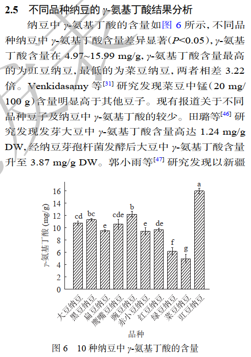

- 可能还是买几百克以上一份的成品既方便又足够便宜，回来用小袋分装
- [Effective management of atherosclerosis progress and hyperlipidemia with nattokinase: A clinical study with 1,062 participants - PMC](https://www.ncbi.nlm.nih.gov/pmc/articles/PMC9441630/)
- [纳豆激酶活性测定方法和膳食用量 Methods for Assay of Nattokinase Activity and the Dosage of Dietary](https://image.hanspub.org/Html/2-1740395_34946.htm)
	- >发酵豆制品最早起源于我国，其中豆豉制作历史可追溯到先秦时期。唐朝初期，鉴真东渡时将豆豉传至日本，因此纳豆在日本又被称为“日本豆豉”。大豆发酵品在日本不断进行工艺改良，后来出现了一种叫纳豆(Natto)的大豆发酵品。纳豆风味独特，具有很多功能性物质，如纳豆激酶、超氧化物歧化酶(SOD)、谷胱甘肽过氧化物酶、大豆异黄酮、血管紧张素转化酶抑制剂和小分子多肽等，具有溶解血栓凝块、降血压、抗氧化以及促进胃肠道健康等多种功能 [[1](https://image.hanspub.org/Html/2-1740395_34946.htm#ref1)] [[2](https://image.hanspub.org/Html/2-1740395_34946.htm#ref2)] [[3](https://image.hanspub.org/Html/2-1740395_34946.htm#ref3)]。随着全球人口老龄化问题的加剧，提高老年人的健康水平，增强其幸福指数，预防人类第一大杀手－心脑血管疾病显得尤为重要。世界卫生组织公布的资料显示，日本人的平均寿命84岁，中国平均寿命目前只有76岁。在55~64岁的男性中，日本心脑血管疾病发病率仅为0.4%，而中国为30%。在日本几乎90%的人群每天都在食用纳豆，因此，有学者认为，日本心脑血管疾病发病率低与日本国民长期食用传统发酵食品纳豆有很大关系。
	- >目前，市面上贩售纳豆产品含有的纳豆激酶活性数值参差不齐，例如日本盒装50 g的纳豆平均含有1400 FU/盒，活性较高的产品大约含有2000 FU/盒(数据来自日本纳豆激酶协会，网址http://j-nattokinase.org/cn/jnka_nattou_01.html)。
- [不同品种纳豆的多种功能活性成分比较](http://www.spgykj.com/cn/article/doi/10.13386/j.issn1002-0306.2023120296)
	- “纳，都可以纳”
	- 
	  id:: 66606c3f-0c61-429a-bee4-26d3c9422b9b
- [《心血管健康与纳豆激酶应用专家指引》发布_光明网](https://health.gmw.cn/2024-03/31/content_37236720.htm)
	- TODO [心血管健康与纳豆激酶应用专家指引 武留信 医疗保健事业 医药卫生管理 产业发展 研究报告 中国 2023-2024 【简介_在线阅读】 电子书_先晓书院](https://xianxiao.ssap.com.cn/catalog/7146190.html)
		- id:: 66606556-4f16-4e50-bd9b-d2556159d0b4
		  >心血管病风险评估可参照《中国心血管病一级预防指南》[5]，根据年龄、性别、腰围、居住地域、血压、血脂水平、是否患有糖尿病、是否吸烟、是否有心血管病的家族史，综合评估其在未来一段时间内发生心血管病的概率（利用网站http：//www.cvdrisk.com.cn/ASCVD/Eval或心脑血管风险手机App，通过输入个人信息和指标结果获得风险评估结果）。对于不满60岁的人，还需评估长期风险，即未来15～30年或者终身发生心血管病的概率。
- [The Anti-osteoporosis Effects of Natto on Bone Mineral Density in Perimenopausal Women - PubMed](https://pubmed.ncbi.nlm.nih.gov/32141414/)
- [自制纳豆 - 知乎](https://zhuanlan.zhihu.com/p/180191091)
  id:: 65139e14-b2e3-4779-820f-b1bee3fd4bd3
- 做法
	- 旧做法
		- 称豆250g，泡豆10小时，室温约24度，上压8分钟，上压（140kpa）蒸60/75分钟（差不多一样烂？），泄压22分钟，冷却15-20分钟（讲究的话可用红外测温枪测温，绝大多数测温点在50度以下即可出锅加菌粉搅拌）
		- 做了几次感觉黏液和软度暂时不如商业成品，可能是薄壳酸奶机保温不行温度不够
			- [我做的纳豆为什么沒有拉丝？ - 知乎](https://www.zhihu.com/question/296022197)
	- 新做法
		- 因为一层并不大，所以一次最多蒸125g黄豆（干重；人少可以50g起步），至少3.5倍水（确保后期膨胀后能浸没），冰箱里泡8小时以上，懒了忘了泡几天问题不大（
		- 自带蒸架比较低，中间也有洞，暂时懒得搞蒸垫（讲究是可以讲究的，但未必吃得出“不锈钢味”），一根手指塞住（所以不适合先加开水）然后倒黄豆，摊开，洞周围隔离
		- ---
		- 我妈买的大些的干黄豆大概2.3倍纳豆
		- 之前买纳豆送的辣根酱也很厉害，1小袋115g纳豆也少了，搅拌时眼睛得离远些
		  id:: 67ad8530-f6c1-4bab-972e-1f8485e4ca54
- 吃法
	- 在做其他食物间歇吃，比如 ((66335be5-6fcd-431b-ac7f-e94162e21df3)) 热锅时
	- 记得把餐具上的黏液吃干净
	- ---
	- 还没试的
		- 纳豆酱
		- 纳豆汁
			- >非常的新鲜，非常的美味
		- 纳豆牛奶
		- 香醋、奶酪、番茄酱
- 记录
	- 玻璃碗366g，红小豆50g