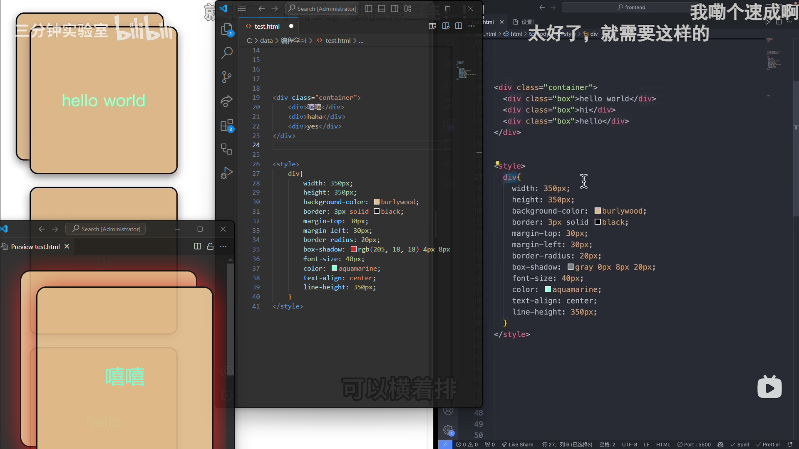

- [计算机学习最强技能树 照着这个路线不再迷茫_哔哩哔哩_bilibili](https://www.bilibili.com/video/BV1gL4y187Wg)
- [2019年世界编程大赛作品《神笔马良》是如何榨干你的电脑的？_哔哩哔哩_bilibili](https://www.bilibili.com/video/BV1PY411b7xV)
	- [dope on wax by Logicoma :: pouët.net](https://www.pouet.net/prod.php?which=81015)
- [开源编程工具大杂烩 - 庞业铭 - 一生一芯双周分享会_哔哩哔哩_bilibili](https://www.bilibili.com/video/BV1Ui421Y7DT)
- 编程语言与 ((67a1dc83-6075-4997-b377-d96e160a4109))
- AI辅助编程
	- [有没有哪个AI代码解释器能读取一整个项目（多文件），然后进行问答的？ - 知乎](https://www.zhihu.com/question/628855786)
	- GitHub Copilot
		- [如何评价 GitHub 的 Copilot？ - 知乎](https://www.zhihu.com/question/470873369)
- [什么是「中华田园敏捷开发」？](https://www.zhihu.com/question/328042540)
- 计算机语言
	- “你跟计算机说去！”
	- HTML
		- 用 ((66ade382-442e-4b75-8284-b0a0cbd49359)) 打开epub电子书后按Ctrl+D可打开编辑器查看HTML语言
- [菜鸟教程 - 学的不仅是技术，更是梦想！](https://www.runoob.com/)
- [[记录与闲聊] 我学图形学不是为了做游戏 | 最真实的个人代码（编程）自学路径分享 | 学习途径 | 学习感悟_哔哩哔哩_bilibili](https://www.bilibili.com/video/BV1jd4y1N7hE)
- 甘特图
  id:: 67a2f4f2-dac6-4ba4-a0b0-93cc87e751cb
	- [Python 生成 Gantt 甘特图_哔哩哔哩_bilibili](https://www.bilibili.com/video/BV1zj411w7Qf)
	  collapsed:: true
		- [多维度架构设计之甘特图_哔哩哔哩_bilibili](https://www.bilibili.com/video/BV1qs4y1w75e)
- # 冲刺！
  collapsed:: true
	- ((679adc89-621f-4dca-b378-402f31f22eb7))
	- [一口气从零到全栈开发_哔哩哔哩_bilibili](https://www.bilibili.com/video/BV1FPCzYdEeH)
		- 1:40前是快速展示，后面有详细得多的解说
			- >我以为刚才的是正常速度——弹幕
			- 《关于赶时间（加上一点点“知识的诅咒”）反被赶时间误这回事》
			- “作者这里没有提示，应该也算是百密一疏了吧？”
		- >视频提到资料： https://pan.baidu.com/s/1JNX44K4WMbzfyhYolbaDGQ?pwd=8xih 提取码: 8xih sealos地址：https://cloud.sealos.run/?uid=Kt1gH3_BTa ——视频简介
		- （“如何安装、新建文件、分屏、记忆窗口布局、上级看到前隐藏之类的问题等人问了我再更”）
		- 看视频+编辑+预览的窗口布局
			- 打开 ((65ab10fa-9bb1-4c11-8112-1d5744559b36))
			- 装个可预览html代码效果的插件（live preview、html preview好像都行，暂时没看出明显区别）
				- 好像这两个都无法预览html部分“linear radient”那的颜色，直到“todo-app”设置高度？（还是说赶时间没在开头把文件类型用`!`标上？）
			- 预览html文件并将预览窗口（标签页）拖到外面变成独立窗口
				- 我还不会**在单个窗口内**把预览窗口拖到或调整到左下角，以减少遮挡视频左上角的图形——试了下这种方法差不多得了
			- 用 ((659c9e71-570c-46ec-8f44-82c8af29f35e)) 置顶、透明并调整窗口形状
				- 
					- 不一定要完全一样（这字体大小和缩进量啥的就不太一样，我赶时间就不调了；“强迫症有种别学”），“代码能跑就行”
						- ~~不太明白时还可以不一样（比如颜色），夸张点（数值往大了填）、不对称（如果跟他一样对称，又不往输入框里输入，或许没明白padding、border-radius等的哪边是哪边就过去了）更明显直观~~
			- ((679f63ff-c170-44a1-ba4c-db145c302144)) 设置一下，可以限定在上10%左右或关闭
			- 可用 ((65d2b96f-a901-4642-b354-642fd07c3534)) 调整并保存窗口布局
		- ---
		- 选中后alt+方向键移动
		- 注意别丢了`>`（html部分那个add todo的placeholder那里的视频正好漏了一点，我说怎么按钮图案没出来......）
		- [CSS 盒子模型 | 菜鸟教程](https://www.runoob.com/css/css-boxmodel.html)
			- [CSS padding margin border属性详解 - Ruthless - 博客园](https://www.cnblogs.com/linjiqin/p/3556497.html)
			- [详述盒子模型（包含padding、border、margin的详细用法和描述） - 二森 - 博客园](https://www.cnblogs.com/Ersonnnn/p/14841722.html)
		- ((67a05930-00be-4b83-b3b7-24d75ab3c1d2))
		- ---
		- ((668ce734-0fe6-4091-a8c2-c63ec2d9a220))
- [下课时各班电子白板现状_哔哩哔哩_bilibili](https://www.bilibili.com/video/BV1tUqdYMEcS)
  id:: 679c54bd-e1b4-4cbe-8bdf-bacbc3984b32
	- 搜 ((679a3974-c998-42e9-93e4-64dc105addd6)) （当时搜的是“电子白板”）搜的
- [当一个会玩kali的学生在信息课找到了kali_哔哩哔哩_bilibili](https://www.bilibili.com/video/BV1o14y1e7SS)
- id:: 679adcb4-a5e3-4414-9a1f-aecef3cdaf7f
  ---
- [类似VLC，Ubuntu，ffmpeg等等这些软件究竟是什么人开发的？为什么是免费的？他们不求回报又何以生存？](https://www.zhihu.com/question/26251749/answer/2334803570)
- 记忆
  collapsed:: true
	- Piotr Wozniak博士
	  id:: 624d19df-dae2-4b1e-a254-6bef0bb804d8
		- ((6221b0d9-1369-4f26-960c-0ab96949d060))
		- ((6422bdbe-8d91-4b48-b4fd-42cf8262979e))
		- {{embed ((6422bdbe-6e6d-4606-9493-29da1f173fca))}}
	- Andy Matuschak
		- [【翻译】当一位独立研究者反思 2020 年](https://zhuanlan.zhihu.com/p/495642339)
		  id:: 62555cfe-c215-4bb0-9f65-b415b1aa030d
		- [Why books donʼt work](https://andymatuschak.org/books/)
		  id:: 679adcb4-2491-45b6-939b-26896fcc2e02
- 电子游戏
	- [黑心中间商乔布斯，搞出了世界第一个打砖块游戏。](https://mp.weixin.qq.com/s/4xYuj0aiEMsGGvbV1b5COQ)
- [奇人轶事：卖软件的小镇农民-36氪](https://www.36kr.com/p/1638457786369)
- [淘宝卖DeepSeek安装包一月赚数十万？？？我们免费教你本地部署DeepSeek-R1](https://mp.weixin.qq.com/s/f3B1rwBV_4LPZhqgVvR9Cw)
  id:: 67ac5265-d572-4098-82d6-8b39dc2ba276