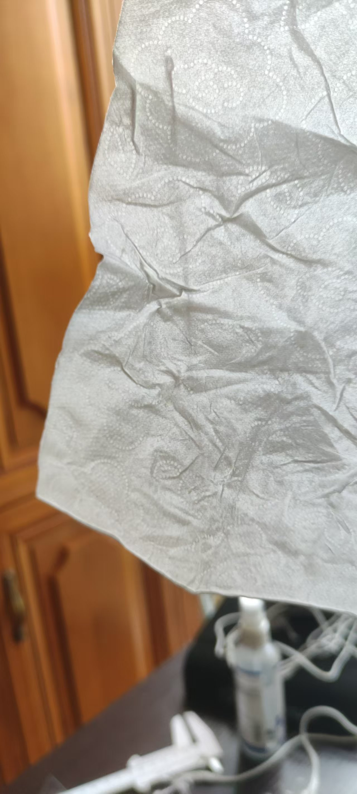
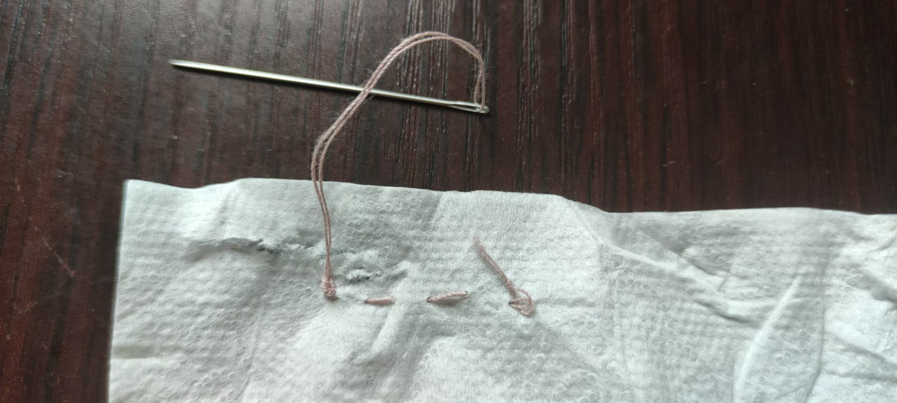

- 手缝
	- 先用线头穿过针孔（线头散开不好穿，用粗糙工具磨断线头会导致线头散开），需要穿多粗的、穿多少根就穿，然后靠近线头打结（结大于针孔，防止线脱离针导致缝不了；打结方法比普通粗线打结法方便，不然不方便），然后开始缝
	- [给线打结｜起针｜收针的方法_哔哩哔哩_bilibili](https://www.bilibili.com/video/BV17C411Y787/)
	  id:: 6869278a-6381-4c4b-a694-ee71c4954f48
	  collapsed:: true
		- 纸上任我缝，行，三层抽纸的余裕这一块，最后收针时盯着屏幕把抽纸也捏住拽裂了点 [[20250706]]
			- 
			- 
	- [手缝入门教程｜回针法缝纫_哔哩哔哩_bilibili](https://www.bilibili.com/video/BV1idSUYYEm2/)
	- [【缝纫向】手缝基础针法-干货满满_哔哩哔哩_bilibili](https://www.bilibili.com/video/BV1p5411W7ee/)
	- [给新手整理的：缝纫必备工具清单_哔哩哔哩_bilibili](https://www.bilibili.com/video/BV1Yx4y1s7fY/)
	  id:: 6869b1ff-ab6d-4b5b-8310-fb46506fae59
	- [顶针（缝纫用品）_百度百科](https://baike.baidu.com/item/%E9%A1%B6%E9%92%88/170677)
	  id:: 67f12912-7438-4e57-aeed-cd2d4607780a
- 缝纫机
  id:: 67eb285d-782e-4678-bbc5-e303a3196719
  collapsed:: true
	- [缝纫机的天才设计_哔哩哔哩_bilibili](https://www.bilibili.com/video/BV1Fg4y1r7wk/)
	  id:: 67d68523-c84a-4406-99d3-9dd0aff1f066
		- ((67d6d64f-7889-4919-9311-03e31dcfd155))
		- “针头怎么尖尖的？”
	- 美国的缝纫机
		- [【全能发明家为何受穷？【小约翰】】 【精准空降到 18:14】](https://www.bilibili.com/video/BV1dR4y1N7Qx/?share_source=copy_web&vd_source=24175964b0df2fcc2c022cae23517fdc&t=1094)
		- [【人物】10个“发明之父”（八）——缝纫机发明者埃利阿斯·哈威_美国](https://www.sohu.com/a/255169994_308511)
		  id:: 67de99e8-c277-421c-8b6d-9b4559486cc7
		- [美国史谈：缝纫机改革了服装业，19世纪美国成品服装业如何形成？](https://baijiahao.baidu.com/s?id=1655060483149216539)
		  id:: 67de9c22-1b3d-407a-b3a5-3d1a06b86440
	- [工具 | 怎么使用缝纫机？快速制作毛绒玩具_哔哩哔哩_bilibili](https://www.bilibili.com/video/BV1P54y1Q7kU/)
	- TODO 趴式缝纫机套件
	  id:: 67d6a615-14ec-438a-b40b-8b04c917c817
		- 看 ((67d6a86c-a69f-4cf4-a434-468dc184b62f)) 里缝纫机前的工人低头弓背看的
			- “或者，躺的呢？或者缝纫机倾斜会影响缝纫吗？”
			  id:: 67d6d64f-7889-4919-9311-03e31dcfd155
		- 脚
		- 大概不会比 ((67cea91e-352a-4b13-b002-377705d3de4b)) 复杂多少，或者可能更简单——不会比陆地蛙泳复杂多少，应该是这样
	- 缝纫机扎伤
		- [看着都痛！缝纫机扎穿女工食指......](https://m.thepaper.cn/baijiahao_23039289)
		- [缝纫机工被机针扎伤原因分析及整改措施 - 百度文库](https://wenku.baidu.com/view/1ea74d2c68d97f192279168884868762caaebbb7)
	- ((67e55582-c752-430e-b23e-5511ae881f7f))
	- 刺绣
		- [机绣是用机器绣制的刺绣，以代替手工的一种刺绣品。_哔哩哔哩_bilibili](https://www.bilibili.com/video/BV1hW4y1o7fE/)
	- ---
	- [白玉县 开展缝纫技能培训拓宽就业渠道 藏地阳光新闻网](https://www.zangdiyg.cn/article/detail/id/21434.html)
		- ~~“ 丁 真 尼 玛 ”~~
	- 缝纫机与自行车区别不大，都是很大程度上的机械设备，毕竟通过电磁力穿针还比较难
	  id:: 67eb285d-ae26-4ce0-8f81-0d4e7403b69b
	  collapsed:: true
		- 缝纫机有脚踏，自行车也有脚踏
		- 缝纫机走的是线，自行车走的是路
		- 缝纫机有不同线迹，自行车有不同档位，每一齿对应不同转动间距
		- 所以缝纫机和自行车都比较贵，就给人的体验相对而言
	- [我切病理片怎么像踩缝纫机_哔哩哔哩_bilibili](https://www.bilibili.com/video/BV1er421u7dw/)
- 设计
	- 人台
		- [人台太贵买不起？自制量身定制立裁人台_哔哩哔哩_bilibili](https://www.bilibili.com/video/BV19a4y1L7Au/)
	- ((686b8979-aede-4490-bffe-2011a3a38b1c))
- 缝纫行业
	- [康斯坦丁被我200块卖到安徽后_哔哩哔哩_bilibili](https://www.bilibili.com/video/BV17H4y1n7Wf)
- 制衣间坐垫
  id:: 675d2b81-bd86-4e7c-89f9-4c1a0b6a6d91