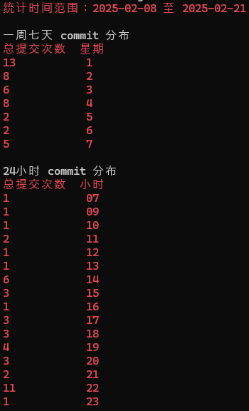

- “网路”类比交通道路，可以更好地承接“信息高速公路”、“（网络）拥堵”等概念
- 地址
	- [千万别和网络工程师聊地址（Address）_哔哩哔哩_bilibili](https://www.bilibili.com/video/BV1krH5eoE3u)
- [以鸟类为载体的网际协议 - 维基百科，自由的百科全书](https://zh.wikipedia.org/zh-cn/%E4%BB%A5%E9%B8%9F%E7%B1%BB%E4%B8%BA%E8%BD%BD%E4%BD%93%E7%9A%84%E7%BD%91%E9%99%85%E5%8D%8F%E8%AE%AE)
  id:: 679adcb0-6295-4ccc-935a-9dce9aabe54f
- [你管这破玩意叫网络？_哔哩哔哩_bilibili](https://www.bilibili.com/video/BV17x6hYZEzJ)（合集不错，都可以看）
  id:: 67addae2-0766-41d0-9677-b297c9208980
	- >网络层本身没有传输包的功能
		- “路由器是帮问路的，不是送信的”
- [OSI模型](https://baike.baidu.com/item/OSI%E6%A8%A1%E5%9E%8B)
  id:: 62332a60-7bd1-4b6e-b99d-a5823afb8c78
	- [如何生动形象、切中要点地讲解 OSI 七层模型和两主机传输过程?](https://www.zhihu.com/question/24002080)
	- [为什么 OSI 模型的会话层和表示层被弃用了？ - 知乎](https://www.zhihu.com/question/58798786)
- [[互联网]]
- 版本控制
  id:: 66ade382-a868-4712-a5ce-b93a7794cf85
	- “我们有比肩《幻兽帕鲁》制作团队的版本控制水平吗？”
	  id:: 65cccda7-8572-47b9-8052-08d5f568fe89
	  collapsed:: true
		- 
		  id:: 65cccda7-a4e0-4735-9320-e869134bf1ae
			- [科技爱好者周刊（第 289 期）：宽容从何而来 - 阮一峰的网络日志](https://www.ruanyifeng.com/blog/2024/02/weekly-issue-289.html)
			  id:: 65ccce61-c8f8-49e9-a439-0aa3d5900296
	- 单现版本控制（默认上传前人工审核，而非实时协作实时上传）
		- 集体/公共账号的单现版本控制
		  collapsed:: true
			- 线下到机构参观，可能发现不同的房间有不同的人数，比如大厅/大堂/柜台人多，办公室有的是几行几列的格子间人也多，有的是四五个大格子间，有的是两个面对面或面对背，有的只有一个——而对于同一个议题，每个人的说法都可能有所不同，所谓“众口难调”（虽然不同的说法可能还没“冲撞”），但最终可能看到以机构名义公开发布的内容
			- 谁能决定发还是不发？核心可能是身份认证
			  id:: 65bcbf4a-adf8-49cf-a926-0ec0caf282a6
				- 影视剧中，往往是“领导”拍板了，这个版本就“过了”——当然，在比较宽松平等的组织中，人人都可能是“领导”——但“人人”是哪里的“人人”可能还是要确定一下的，因为并非所有内容都能由任意一个或若干人拍板（“未完待续”）
			- 出现或预期可能出现“众口难调”怎么办？
				- “补强”：[如何成为那种一点就透，悟性很高的人？ - 知乎](https://www.zhihu.com/question/300313253/answer/1926470416)
				  id:: 66335bea-3e02-4601-aeac-059568992815
				- 调整个人主义的惯性（“这里我们可以这样理解，个人不拥有个人主义，而是个人主义拥有个人”）
				- 优先语音聊天加白板或笔记确认各自思路，找“最大公约数”
		- ---
		- Git
		  id:: 65b70784-31f1-4eda-806e-8e38a67e63e2
		  collapsed:: true
			- ((67b7f221-4e48-4ea7-b664-f40c0d669819))
			- “Git主义思想放光芒！”
			- “工具话语”：提交、评论与编辑
			  collapsed:: true
				- 一次“团结的大会、胜利的大会”后有感
				  id:: 66003cf4-1cea-4e70-be3f-b61683cd0389
					- 这些评论可能不重要（“所以我破坏了”），“我可要说几句公道话”，“你可能发现这很重要”，就拿代码管理平台与协作文档的两个功能来说，提交（commit）与评论（comment）有挺大的区别，比如提交是有前后两个版本（后一个版本尚未成为当前版本）的对比，这就不是很小的差别了
						- 对于一个多少下了点决心（或者也可以说“致力于”，这样就可以用be commited to了）想服从应能保障整个工作的规则的人看来，在没找到详细到他想找的规则时，他可能对似乎隐形的规则感到一丝惶然，按他的“常识”，别说直接在原文上改了（“编辑”），就是评论，都要多一道“别人的东西不能乱动”的中介和阻滞，我们可能仍生活在一个存在“情绪劳动”的世界，由于技术、功能上的掣肘，“客气”与“效率”的确可能显现出矛盾，而且一旦认为这种矛盾难以解决，其他矛盾便也可能蓄积，“这这这条路都堵死了”，他就可能想，“要‘不择手段地前进’了”
				- 用git类对文本等内容进行版本控制，与飞书的也不太一样，
					- git类的“提交”与飞书文档之类的“编辑”及更间接的“（划线）评论”也不太一样，后者相比前者，在一些方面不光有技术上的阻碍，技术上的阻碍也会次生“人情世故”的阻碍，你可能觉得没有，但意识形态会让人进入博弈、“猜疑链”
				- 无论多少修改，提交时一起端上来，免得（“飞书划线评论或其他更具侵略性的操作”）太打扰主创，使大家的时间、注意力碎片化，降低效率（“我的评价是——要我一条条评论叮叮叮还不如把切片做好发微信或飞书私聊”）
				  id:: 65db4ef0-0ab4-4037-b579-d3bc751d7657
			- [Windows平台Git本地Web开发版本控制完全指南 - 知乎](https://zhuanlan.zhihu.com/p/24705359351)
			- GitHub Desktop
			  id:: 659c981c-4681-4798-87dc-9cddea73f56e
				- 操作相对简单的图形化界面
				- 不上传到Github也能用（“有时写多了也要看看前面写了什么”）
				  id:: 65b5b2d8-98e9-4694-b678-61237162b525
				- 也可以用来监测、观察了解logseq等软件的文件机制
				- 不需要上传的文件/文件夹在更改列表右键加入gitignore即可
				- 更新可按当天的commit次数命名
				- 部分情况下消耗流量较多的话，会换成watt toolkit加速github
				- TODO 如何显示内容、只显示修改行？（在开发者工具里设置？）
				- [傻瓜式git管理。全平台，全编译器通用。github desktop+vscode_github desktop还是vscode-CSDN博客](https://blog.csdn.net/qq_44695769/article/details/130953267)
				- ---
			- Git
				- ((67a3fc88-48a3-4940-99b8-3d8ddc246a98))
			- ---
			- Git commit规范
				- “我写博客只要12345就好了，可有甲方的程序员要考虑的就很多了”
			- .git文件夹
				- [Git（三）.git 文件夹详解_.git文件-CSDN博客](https://blog.csdn.net/qq_33204709/article/details/134024860)
				- [解决 .git 目录过大问题-CSDN博客](https://blog.csdn.net/lilizhou2008/article/details/123038737)
				  id:: 66b608a5-a819-4691-bec0-1846651815bc
			- 版本更改/差异比较/git diff
				- 上下文行数
				- [Generate diff file of a specific commit in Git - Stack Overflow](https://stackoverflow.com/questions/42357521/generate-diff-file-of-a-specific-commit-in-git)
				- [GitHub页面上比较不同代码版本的差异 - 知乎](https://zhuanlan.zhihu.com/p/425630076)
				- [GitHub - MrWangJustToDo/git-diff-view: A Diff View component for React / Vue, just like Github](https://github.com/MrWangJustToDo/git-diff-view)
				  id:: 67b7f874-2f9d-4936-ac7a-915dbd9a6d83
			- Git项目分析
			  id:: 67b7bfdb-7cd1-4a38-bb3a-94d12805a8c2
			  collapsed:: true
				- commit分析
					- [GitHub - hellodigua/code996: 统计 Git 项目的 commit 时间分布，进而推导出项目的编码工作强度](https://github.com/hellodigua/code996)
					  id:: 67b7d0b4-4c00-4c4f-b43c-062a770560a2
						- [code996](https://hellodigua.github.io/code996/#/)
						  id:: 67b7d540-46bb-417a-9e84-61b4aa4dc624
						- >本地分析：在 Git 项目的根目录
							- 翻译：win+r输入cmd回车，cd 本地库目录（打开文件后复制上方地址栏路径），回车
						- https://hellodigua.github.io/code996/#/result?time=2025-02-08_2025-02-21&week=13_1,8_2,6_3,8_4,2_5,2_6,5_7&hour=1_07,1_09,1_10,2_11,1_12,1_13,6_14,3_15,1_16,3_17,3_18,4_19,3_20,2_21,11_22,1_23
						  id:: 67b7dea3-b647-4895-844f-9cb9c57d8e4e
							- 
						- ---
						- 通过curl命令调取（别人）服务器里的sh文件（就像你可以预览图片而不用手动下载）并bash
							- “大概绕了点没必要的弯子”
								- [windows下使用curl命令 && 常用curl命令 - Wayne-Zhu - 博客园](https://www.cnblogs.com/zhuzhenwei918/p/6781314.html)
								- [Windows 中的环境变量（Windows11 为例）_win11环境变量-CSDN博客](https://blog.csdn.net/weixin_65032328/article/details/136580118)
								  id:: 67b7c9d9-0b68-4683-860c-935152361145
								- [curl在windows下的安装和curl命令详解 - 腾讯云开发者社区-腾讯云](https://cloud.tencent.com/developer/news/359375)
						- 下载sh文件直接bash
							- 下载网页里的code996.sh到git项目根目录，然后bash code996.sh
							- 可打开code996.sh，在第62行修改开始时间
						- ---
						- bash（“痛击”）
						  id:: 67b7d813-4a46-447d-b106-3b5c660bcfbb
							- 如果无法使用bash命令（“要给它迎头痛击！”），或许更可能是你的Windows系统没有bash而非没有curl（cmd输入curl -V可查版本——“可能不是最新版，但没理由自带的却不能用”），那么可以下载安装git，因为它带bash
								- [【Windows10下.sh文件的运行】‘bash’ is not recognized as an internal or external command_bash' is not recognized as an internal or external-CSDN博客](https://blog.csdn.net/weixin_45780839/article/details/125162219)
								- ((67b7dabd-334c-4a32-9880-262e6159c631))
					- TODO ((658fc4ca-21a3-49e7-a6b8-6277d16e0062)) commit分析
					  id:: 678369b1-f629-42a5-8f71-4b4daf46d227
						- 通过github desktop clone-fetch查看作者距上次更新了啥——是很低效的
						- [Commits · khtazmt/khtazmt.github.io · GitHub](https://github.com/khtazmt/khtazmt.github.io/commits/main/)
						  id:: 6780e61e-54be-4d21-802c-4391d1c0cf7d
						- 忽略[[Logseq]]的折叠/展开状态标记符号等的变动
							- **collapsed:: true**
								- “ 随 手 ~~关~~ ~~开~~ 复 原 门 ”
							- 空格
							- 分割线？
							- ((679adda8-25dc-4ba6-b839-de993e810877))
							- [gitignore - Ignore specific changes to a file in git, but not the entire file - Stack Overflow](https://stackoverflow.com/questions/16598257/ignore-specific-changes-to-a-file-in-git-but-not-the-entire-file)
						- 识别块引用等
							- 在本地端跳转
								- 在本地端（悬浮）显示之前或之后（如果尚未更新）版本
						- 按commit时间叠加查看按日、周等的更新
							- 拖动多选
						- 像“查找下一处”那样翻阅的插件
				- [最值得推荐的8个git/github项目数据分析工具 - 知乎](https://zhuanlan.zhihu.com/p/99390582)
				- [推荐一波代码量、行数、提交量、作者等全维度统计神器 - 知乎](https://zhuanlan.zhihu.com/p/259663572)
			- Git协作
				- ((67b7bfdb-7cd1-4a38-bb3a-94d12805a8c2))
				- 代码评审
					- [什么是代码评审（Code Review）-CSDN博客](https://blog.csdn.net/qq_39249627/article/details/125699021)
					- ((67b7f874-2f9d-4936-ac7a-915dbd9a6d83))
				- [吵疯了，Pull Request到底是个啥？ - 知乎](https://zhuanlan.zhihu.com/p/347918608)
				  id:: 670d40f2-00d6-462c-b0d3-270f4876b3e7
					- >我们重点看一下第6步，小明写完代码了想合入到原作者的仓库，新建了一个“pull request”，拉请求？这明明是推啊，小明将自己的修改推到原作者的仓，感觉叫“push request”比较合适吧。
					  既然 Github 坚持叫“pull request”，我们试着理解一下它的思路，小明写完代码了心里肯定是在想：原作者大神，我改了点东西，你快把我的修改拉回去吧。站在原作者的角度思考，叫pull request好像也说得过去，每天有大量的人从我这里 fork 代码走，我只会拉取我感兴趣的代码回来。
					  我好像把自己说服了。
					- ((668ce77d-369c-4b88-9b03-02e3f0c1ea2d))
				- ==划线评论、Pull request与白板脑暴==
					- 飞书里我们看到别人负责的文档内容产生了修改意见，可能会选择对想修改的部分划线并评论在右侧，
					- pull request是直接修改，但是
						- 直接修改后
		- ((66b42d34-b0f0-425e-bbde-ba407f74c8ca))
		- （纯）本地文件（对比）
		  id:: 66db8ac4-d9d8-40f9-b210-5517c4f75673
		  collapsed:: true
			- [WinMerge - You will see the difference…](https://winmerge.org/)
				- 最早开始做“本站”时，基于“信息隔离”或“严（格的自我审）查”分裂过几次本站的本地文件夹，有些日常使用的双层文件夹之外的文件后来要加回到双层文件夹内，因为有些文件已经重命名（并删除）或删除（有些当初因为插件和格式额外生成的空文件，有些只在内层文件夹即“本站”文件夹内的图片等assets），直接复制粘贴进去又要多出来——总之就是需要一个省事工具
					- ((66ade37e-72cf-4363-ad92-6fb748cbcc8d))
					- ((66ade391-fb8f-4613-b971-bf130d9ae533))
- [[外网]]
	- ((65ab10fa-6f37-4dc7-8693-ded8722181de))
- ((65ff88f2-9314-4c30-b655-065283a57a9f))
- ((66ade382-4522-425f-a5dc-d15c1ee11f36))
- Web3
  id:: 62786310-b4dd-48f7-a0cd-47ff42bfd100
  collapsed:: true
	- Web2就是我们现在的版本，平台圈用户
	- [前言 · HonKit](https://happypeter.github.io/web3book/00-intro/intro.html)
	- [Web 3.0，与中国无关！](https://news.huoxing24.com/20220430101140995521.html)
	  id:: 628b5c56-4ae3-4197-804a-a787804bfc42
	  collapsed:: true
		- id:: 628b807e-a750-49e8-89b0-bf916d132d58
		  #+BEGIN_QUOTE
		  元宇宙背后的Web3.0
		  
		  知道中国创业者为什么一直想做元宇宙吗？
		  
		  除了元宇宙本身是技术结晶，具有远景规划之外，还有一个很核心的原因，那就是大家避免直接谈到Web3.0。
		  
		  一旦谈到Web3.0，必然谈到区块链，谈到区块链，必然谈到加密技术，谈到加密技术，必然会与cryptocurrency（加密货币）相关，最后又会涉及到最底层的Token，那么这条路是走不下去的。
		  
		  所以，干脆直接跨越Web3.0，进军元宇宙，因为在元宇宙的世界可不仅仅有Web3.0，还有5G+AI+XR+云计算，虚幻引擎技术、脑机接口，人工智能，边缘计算，3D操作系统等，这样就会淡化掉Web3.0概念，让更多人可以接受元宇宙。
		  
		  可在元宇宙的世界里，那些熟悉技术底层的极客，谁不知道元宇宙中的核心要素“数字身份”“经济体系”都与Web3.0息息相关呢？
		  #+END_QUOTE
		- ((66db8aaa-2b48-4346-9669-c8d347d801b2))
	- DAO
	  id:: 670d40c8-0385-4e2e-b489-6e81e7d9ce22
	  collapsed:: true
		- [这些Web3版“豆瓣小组”，将颠覆气候行动模式？](https://mp.weixin.qq.com/s/E0iwKU14PHh9rTJ72_wj3g)
		  id:: 625cda6d-b370-4331-a13a-e22a4a7d0143
		- ((629f50f7-8a06-4b57-b4ba-4e66f48e8044))
		- [06）Think about Web3：我们为什么需要DAO操作系统？](https://mp.weixin.qq.com/s/SXYxBJvgwJ0OHseFHb2S6Q)
		  id:: 6329a2ff-65ac-49d9-a5f5-076d72556bb5
	- ((627ca915-d156-4f61-9034-862814b6c9e2))
	- {{embed ((197dde09-b45f-42cf-b423-d9c3d2a6bedf))}}
- ---
- 带宽成本与视频画质
  collapsed:: true
	- [大UP质问平台为什么视频越来越糊，答案比问题要复杂得多-36氪](https://www.36kr.com/p/2986219477114880)
	  id:: 670883cb-d60e-4a35-a062-e5097dd77d76
- 网络延迟
  collapsed:: true
	- [屡次让拳头翻车的ping：作者因车祸英年早逝，千行源码改变世界](https://mp.weixin.qq.com/s/yAUdtDlC3T__pBhxCzvNLQ)
- ---
- 服务调试
  collapsed:: true
	- 链路追踪
		- [什么是链路追踪？分布式系统如何实现链路追踪？ - 知乎](https://zhuanlan.zhihu.com/p/344020712)
		- [【分布式系统篇】链路追踪之Jaeger安装&使用入门-CSDN博客](https://blog.csdn.net/sc_lilei/article/details/107834597)
- 网络安全
  collapsed:: true
	- ((67adb9d2-e244-4c78-8c71-7d49f09e778d))
	- [已招安，花3W的网警入门教程，网警专用【网络安全】系统教学，从应急防护到溯源攻击，【网络安全/渗透测试/web安全】_哔哩哔哩_bilibili](https://www.bilibili.com/video/BV1Jw411q7DP)
	- ---
	- [FOFA Search Engine](https://fofa.info/)
	  id:: 67adc936-87ee-43ff-ae2d-37031c07d46f
	- [CN-SEC 中文网 | 聚合网络安全,存储安全技术文章,融合安全最新讯息](https://cn-sec.com/)
	- ---
	- 关闭端口
	- 蜜罐
	- TODO 特定网址流量监控？
	- 漏洞
		- 漏洞报告
		- 漏洞补丁
	- 肉机
		- 消除肉机
- 网络平台内容审核员
  id:: 66db8abb-2c8f-49e5-acef-f31e11786969
	- [肯尼亚鉴黄师的严重心理创伤：240303录播part1_哔哩哔哩_bilibili](https://www.bilibili.com/video/BV1FA4m1F7JC)
	  id:: 65e70844-90d3-4598-995c-021a9dbebc07
- ---
- 获取信息的一大渠道是上网，网络，网路嘛，“不会就是不会”，很多人线下线上都是多重意义上的“路痴”，甚至转弯前后都坚定地目视前方或手机，显然需要恶补一下交通知识；有些网页及网页中的内容最好能方便地收藏、下载，以便之后查看、批注和分享
  id:: 66335beb-3516-4b4b-b8ca-70b4cc6a5472
	- 被互联网“推流”赶着跑
	- ((66fe9a24-66d9-4545-a8ba-3e7cb650db3d))
	  id:: 668de047-83b8-4455-b887-97c3100e24a6
	- ((665c0a2b-7587-4ee2-933d-a0179fae8bda))
	- 如果你因为想省钱或觉得没有合格的中译本而花较多时间看电子书，
- ((67a9c577-360f-49a2-af4f-f9c5fb0a1601))
  collapsed:: true
	- collapsed:: true
	  >运动不顺畅、脑子不好用，都可能是“替身”出了问题，其中就包括可能由“站点黄牛”恶意指路导致的“赛博迷路”
		- 您提到的现象通过比喻生动地描述了网络安全和数字行为中的潜在风险。以下是对这一问题的拆解及应对建议：
		  
		  ---
		- ### **核心概念解析**
		  collapsed:: true
		  1. **「替身」问题**
		   可理解为 **数字身份失控**（如账号被盗、虚拟人格被仿冒），或 **代理工具异常**（VPN/代理服务器遭劫持），导致操作权限受限。
		  
		  2. **「站点黄牛」恶意指路**
		   指 **网络黑产操控流量路径**，例如：
			- 钓鱼链接伪造正常网站
			- 搜索引擎劫持跳转至广告/欺诈页面
			- 恶意插件篡改浏览器导航
			  
			  3. **「赛博迷路」后果**
			  用户因误导陷入 **数字陷阱**，表现为：
			- 隐私泄露 → 账号被盗、信息滥用
			- 系统卡顿 → 设备感染挖矿木马、资源被占用
			- 决策混乱 → 算法推荐制造信息茧房，干扰判断力
			  
			  ---
		- ### **针对性解决方案**
		- #### **一、修复「替身」问题**
		- **强化身份验证**
		  ✅ 启用双重认证（2FA），如Google Authenticator或硬件密钥
		  ✅ 定期检查账号登录记录，移除可疑设备
		  ✅ 使用密码管理器生成高强度独立密码（如Bitwarden、1Password）
		- **检测代理安全**
		  ✅ 避免使用免费VPN/代理工具（易泄露流量）
		  ✅ 通过IP检测工具（如ipleak.net）验证是否存在DNS泄漏
		- #### **二、拦截「站点黄牛」**
		- **技术防护**
		  ✅ 安装uBlock Origin等去广告插件，屏蔽恶意弹窗
		  ✅ 使用DNS防火墙（如AdGuard DNS、Cloudflare 1.1.1.1）
		  ✅ 开启浏览器安全模式（如Chrome「增强保护」）
		- **行为识别**
		  ✅ 警惕URL细微差异（如`faceb00k.com`仿冒域名）
		  ✅ 通过官方渠道直接访问服务，避免点击第三方短链接
		- #### **三、破除「赛博迷路」**
		- **信息管理**
		  ✅ 使用RSS阅读器（如Inoreader）聚合可信信源，减少算法干扰
		  ✅ 定期清理浏览器缓存/Cookie，重置用户画像追踪
		- **系统优化**
		  ✅ 通过Malwarebytes扫描清除潜在恶意软件
		  ✅ 限制后台进程（Windows任务管理器/Mac活动监视器）
		  
		  ---
		- ### **风险预警指标**
		  | 现象                | 可能原因                  | 紧急程度 |
		  |---------------------|-------------------------|--------|
		  | 设备突然变卡、发热   | 挖矿木马占用资源         | ⚠️ 高危 |
		  | 浏览器首页自动跳转   | 恶意插件/主页劫持        | ⚠️ 中危 |
		  | 收到异常登录提醒     | 账号凭证泄露             | ⚠️ 高危 |
		  | 搜索结果含大量广告   | 搜索引擎中毒/网络中间人攻击 | ⚠️ 中危 |
		  
		  ---
		- ### **进阶防护策略**
		- **沙盒隔离**：使用虚拟机（VirtualBox）或容器（Docker）测试未知软件
		- **网络分段**：智能家居设备与工作电脑分属不同子网（通过路由器设置）
		- **硬件防线**：物理安全密钥（如YubiKey）取代短信验证码
		  
		  数字环境如同复杂迷宫，保持「网络卫生习惯」比依赖单一工具更有效。建议每季度进行一次完整的数字资产审计（账号、设备、数据备份），如同定期体检般维护系统健康。