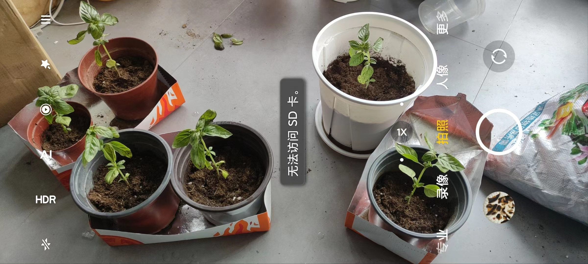

- [[迷迭香]]
- 记录
	- 买的是大叶甜罗勒
	- “种嘞！老想/香！”
	  id:: 65f30f62-34ca-4869-b71e-9753f8d96bd6
		- 
		- 买的拼多多的40L坤宁王通用型营养土（到手是这样的，本来买的是另一款销量更高的），实际重量5.7kg，实际密度约187g/L，算下来也就30L出头
			- ((65f70c55-f25c-463b-9ea7-2f06e7651cbd))
- TODO 真叶
- [贵为香草之王的罗勒，在它的原产地，却没有人敢吃它。 - 知乎](https://zhuanlan.zhihu.com/p/200736015)
- [只种经济作物之三－罗勒，从催芽，打顶到留种，给番茄找个“好朋友”](https://www.douban.com/note/764836448/?_i=0136077zITh3RA)
- [【一起种罗勒（已完结）的做法步骤图】兮兮DoubleC_下厨房](https://www.xiachufang.com/recipe/101719656/)
- ---
- [香草之王——罗勒养植完全指南：从撒种到收获 - 知乎](https://zhuanlan.zhihu.com/p/424374567)
- [3种方法来种植罗勒](https://zh.wikihow.com/%E7%A7%8D%E6%A4%8D%E7%BD%97%E5%8B%92)
- [罗勒种植方法和注意事项 - 花百科](https://wenda.huabaike.com/zwyh/96047.html)
- 摘顶
	- [罗勒怎样摘心和收割-百度经验](https://jingyan.baidu.com/article/e52e361568efd540c60c510f.html)
	- [让盆栽罗勒能够不断收获的技巧，叶子可以不断采摘](https://www.sohu.com/a/235101787_635970)
- 网购苗的问题
	- ((65ab10fb-f97f-4b56-a953-c8965262c4b2))
	- [网上刚买的罗勒(九层塔)回家种就蜷缩萎蔫了，什么原因怎么抢救? - 知乎](https://www.zhihu.com/question/412604197)
- [罗勒叶子边缘发黑，下层颜色变浅是为什么啊？ - 知乎](https://www.zhihu.com/question/481757045)