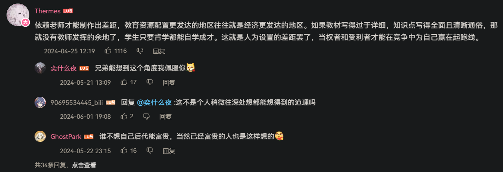
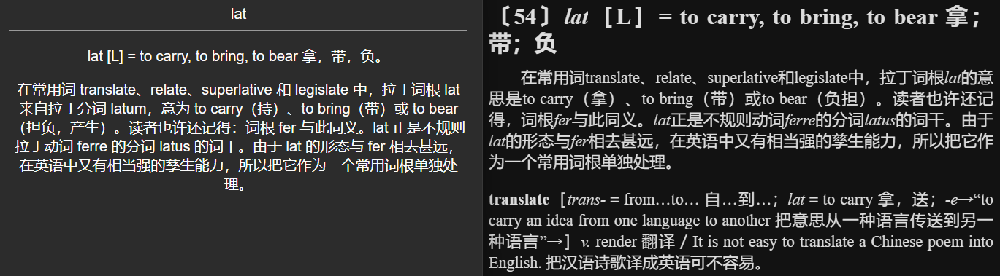

- “英语互联网的确有些值得学习的地方”，学魔法最好同时先学英语
- 资料
  id:: 657a53ee-20b6-4a1b-ac6f-97e410155b76
	- 目前比较能推荐的英语学习资料
	  id:: 6669621c-0e98-41ab-93f2-c278c6bb2292
	  collapsed:: true
		- 魔怔英语学爆班
		  collapsed:: true
			- [[impart]]
			- # “做最优质的应试！用我们西方国家的朋友们，做出回答！”
			  collapsed:: true
				- “离小升初/中考/高考/四六级（计算机、普通话、职业资格考试）、劳动技能学习、黑格尔/考研/学习、掌握生产资料、解放全人类......只剩XXXX天啦！”
				- 词库对接（重新）规划
				  id:: 66adb820-f4c8-4f4e-a848-9ab213775e34
				  collapsed:: true
					- “就那么多词，我有本事把课都翘了忙自个儿的，然后考试参与一下，作文扣一两分差不多满分，结果不一样么？”
					- 按顺序翻学校或课外班发的或建议买的纸质教材，里面连贯性不大的一篇篇文章缝一组组词，还有“虚拟陪学纸片人”——你能跟我保证对中考、高考这样关键的考试，它的学习效率能有玩原神那么高？！
						- 原神英语（“，！”）
							- [玩游戏学英语|原神英语第一期，风的序幕_哔哩哔哩_bilibili](https://www.bilibili.com/video/BV158411B7QE)
						- ((a6efa660-72c0-4f6e-937b-f649e786d096))
						- [【鸣潮】Wuthering Waves英配英字主线剧情（更新至第一章第四幕）｜男主视角_哔哩哔哩_bilibili](https://www.bilibili.com/video/BV1ZM4m1k7Ut)
						- 强制用英语玩（不然可以不给玩——这位小兄弟，你也不希望自己玩不到原神吧？）
							- 后台数据检验
				- “要不要把手机电脑带到学校学习？”
				  collapsed:: true
					- 学校不一定有钱给每个班配电脑，但学生应该是有的吧，至少可以有台手机
					- 你觉得手机不能用来学习
				- 刻意练习
				  collapsed:: true
					- ((66a41acb-8e8d-48b0-980d-ef81aced309e))
			- 学习资料
			  collapsed:: true
				- 教育观、考试观
				  id:: 66ae1956-48c2-45e0-8f06-369cd34c4329
				  collapsed:: true
					- “最醍醐灌饼的一集”
					- 为什么学习？考试。为什么考试？升学。为什么升学？找工作。为什么找工作？挣钱。为什么挣钱？结婚。为什么结婚？（“结婚，爽！”）生孩子。为什么生孩子？（“放羊”）
						- 全错！学习
					- 现在的教育体系是更不公平还是更公平了呢？
						- 教育的阶级性
							- 教材版本分配权
								- “不同地区有不同版本教材是为了‘因材施教’吗？”
							- 教辅 ((66adee71-01d4-4cea-b01b-ad0a969a21bd))
							- ((66ade371-f373-4570-8991-e11763018c52))
							- 学区房
							- 工作分配
								- “农村孩子只需要尽早进城打工——给家里提供现金流就可以了”
							- 考勤
								- “不来上课、开会是吧？考得好也不给你过、评优！”
							- 公立教育编制
								- “那是另外的价钱”/DLC
									- 超级中学
										- [扒光超级中学的底裤_哔哩哔哩_bilibili](https://www.bilibili.com/video/BV1d1421m7zL)
									- 名师外出讲课费
								- 
									- ((66af3d90-4c17-4771-a582-1d5617ade3df))
							- 高校的发证税
							  collapsed:: true
								- 相当于周期更长的 ((66ade397-90ef-46b1-a648-22e5e6f66b2b))
								- 大资本对小资本的竞争
									- 大雇主有余裕按需面试，小雇主对学历表皮穿透不能
					- 在学习上更上一层楼需要斗争
						- >既然我坐着背书你也听得清楚，那为什么非要我站起来背呢？——毛泽东，《毛泽东大传》
							- >东方翁曰：反抗压迫，追求平等，不唯少年毛泽东，人人如此，天性使然也。童年的毛泽东也像其他的孩子一样，不过是一个“顽童”而已。可一般孩童在经过长期的社会“历练”之后，基本上都已经被琢磨得没有棱角了，圆滑了。而毛泽东的不同于常人之处就在于，他以他那叛逆的个性，对父亲的打骂实行反抗；对老师的指责据理力争；对邪恶势力的压迫进行反击；在强大的陈旧的陈旧和影响面前，始终没有被驯服，没有被琢磨得像大多数人一样，反而把他那种可贵的理性的倔犟性格，即天生的斗争思想萌芽，随着自身素质的不断提高，一步一步地升华为马克思主义的斗争哲学——与天奋斗，其乐无穷；与地奋斗，其乐无穷；与人奋斗，其乐无穷。更为难能可贵的是，他还始终将这种斗争哲学作为自己的座右铭，终生实践，至死不悔。
						- [关于教育革命的谈话 · 毛泽东选集](https://liyandi.gitbooks.io/maozedongxuanji/content/guan-yu-jiao-yu-ge-ming-de-tan-hua.html)
						- [关于认真学习和坚决执行《毛主席论教育革命》的通知 - 维基文库，自由的图书馆](https://zh.wikisource.org/wiki/%E5%85%B3%E4%BA%8E%E8%AE%A4%E7%9C%9F%E5%AD%A6%E4%B9%A0%E5%92%8C%E5%9D%9A%E5%86%B3%E6%89%A7%E8%A1%8C%E3%80%8A%E6%AF%9B%E4%B8%BB%E5%B8%AD%E8%AE%BA%E6%95%99%E8%82%B2%E9%9D%A9%E5%91%BD%E3%80%8B%E7%9A%84%E9%80%9A%E7%9F%A5)
						- [学校教育革命的方向—要和工农兵结合 · 毛泽东选集](https://liyandi.gitbooks.io/maozedongxuanji/content/xue-xiao-jiao-yu-ge-ming-de-fang-xiang-2014-yao-he-gong-nong-bing-jie-he.html)
				- 学校发的
				  collapsed:: true
					- 英语教材
						- [中国英语课本有哪些偏差？ - 知乎](https://www.zhihu.com/question/38529020)
						- 示物
						  collapsed:: true
							- 板书
							- PPT
							- 视频
						- 听力（播放）
						- 听讲
						  collapsed:: true
							- 跟读
							- 听力（测试）
						- 对话
						- 朗读
						  collapsed:: true
							- [高中英语朗读教学的策略探究_参考网](https://m.fx361.com/news/2023/0916/22555066.html)
							  id:: 66adc811-154c-46d8-9e41-390713d36d62
							- 晨读
								- >高中英语晨读还存在一个不和谐现象，那就是英语教师进入教室，学生朗读声变得洪亮、铿锵有力，一旦教师走出班级，学生声音逐渐消沉甚至消失。这与教师的监督、检查有关，但是更需要学生的主动性和自觉性。
									- ((66adc811-154c-46d8-9e41-390713d36d62))
							- ((66adef89-87bc-4e2d-8a7b-9d8df403fc2c))
							  collapsed:: true
								- 现在的我转述当时的读法
									- https://pic1.zhimg.com/v2-73ed08cde666af375859caedb53089f0_b.jpg
									  id:: 66ade380-98b8-44ee-8e61-13eea7e7591c
									- （晨读）读啥课本？可以读读，但是后面（“好像是”）主要（“根据自己的需要”）（“自个儿”）读应试词典（我最终主要用的是《维克多英语》）背单词，考试时没几个不认识的词不香吗？
									- 我有语感啊，我会语法啊，我只相对缺“词汇量”，那我还不背单词？
									- 读教材记单词很高效吗？教材课文的单词密度高吗？教材单词表的释义、词组、例句等丰富吗？那我还不读词典？
									- 当然，我下课也读（忘了当时是大家都很忙还是我没啥好聊的），读了转过书去背，背了再转回来读
									- 大多数考试主要就是“在试卷上（“认识”）对答案和（“不完全认识，排除”）找答案”，==二十道左右的排序班上就我一个全对==（高亮突出一下重点，起缓解过度口语化的尴尬气氛的作用），作文看作文模板套公式，字丑没找到好的练法（可能也跟大概也不太能运动的老师们不太懂的“功能性/纠正性训练”有关）扣点分
									- 当然这是比较偏科同时不是最高效的方法，所以在多重因素叠加下，我只上了个当时的民办三本，最终沦落到了目前在家继续忙个不停的地步，现在还在“学怎么学”——更高效的方法或者说“投机取巧”应该是比努力重要得多，如果当时更多方法能更优化，说不定我就提前觉悟不上学不考大学了
						- 背诵
						- ((66ade374-4908-4477-b330-2bc5ef465e43))
						  collapsed:: true
							- ((66ade36f-a9b6-4f40-ab73-6236c2c07a86))
					- 试卷
						- 拼凑和“原创”
				- 学校内外可能推荐买的
				  collapsed:: true
					- 绘本（尤其是儿童）
					- 教辅（可能统一采购，但不保证没人另外学）
					- 应试词典
					  id:: 66adef89-87bc-4e2d-8a7b-9d8df403fc2c
				- 部分可能仍有异议的部分（“玩”VS“学”）
				  collapsed:: true
					- 漫画等图画
					- 动画、游戏等视频
						- 日语动漫也不是不可以看英配，可能从蜡笔小新就可以开始（？）
					- 外语歌
						- 歌词字幕只显示外文
						  id:: 66b723ac-fbba-4064-8b7d-ae4f4e5d0e31
							- ((669e2e36-54ef-43d1-85cd-6bf9e74f6d8d))
				- 不太普及的
					- “现实生活”
					  collapsed:: true
						- 你出了学校就不运动了吗？每天还是要走两步路吧？
							- [[城会玩]]
						- “顺带课堂”（不专门做的话可能效率不太高）
						  collapsed:: true
							- 外语学习者参与（碍事的话可以旁听）带指示性手语等指认动作的外语聊天，也可以录像、录屏
								- ((669e2e36-54ef-43d1-85cd-6bf9e74f6d8d))
								- 
								- 智能助理
								  id:: 66adaba5-77a8-4e52-ad0a-70758d6c260b
								- ((630e0d46-b661-4b23-ac2f-47f47c5c1e52))（需要更多接口和界面？）
						- 系统/软件语言
						- 英语新闻
							- “特朗普英语”
						- 图像识别
						  collapsed:: true
							- ((668ce780-d5d0-4885-96f0-2585a49a2e83))
							- “屏外”
								- MR眼镜/头戴
								- TODO 综合chatgpt、类pokemon go的平行实境游戏
								- ((66a22e1f-aae0-4481-8b55-2cc92cf21a64))
								- 手机支架/云台、激光瞄准（“哪里不会点哪里！”）
								- 先拍，然后回来一起识别
								  id:: 66adb12a-8f31-4a2a-aae6-a9e0df0e94cf
								- 更贴切的场景、更规律的顺序
									- 八目
										- ((66779add-c94a-45bf-97e3-a30ec7357917))
											- ((66a30160-d9e3-4b11-ae9d-d6f58e63f9a7))
										- 一屋不扫，何以扫天下？
											- [【合集】英语词汇学习——房屋、房间、家具、家电、工具、生活用品等等_哔哩哔哩_bilibili](https://www.bilibili.com/video/BV1wA411t7uL)
											- ((628ca85e-a5a7-4b0b-a963-0af01878668c))
										- 博物
											- [[观鸟]]
											- TODO 《DK博物大百科》拼接双语版
												- 图鉴化
										- “指点江山，积洋文字”
						- 录屏、录音
						  collapsed:: true
							- 后退
								- “怎么只能向前skip或快进啊？！”
							- 拆句
								- 寻例
								- [【obsidian】你发现了一种很新的外语学习(摸鱼)方法👻 【摸鱼向+youglish插件】_哔哩哔哩_bilibili](https://www.bilibili.com/video/BV1xY4y1f7iB)
							- 先录音（电脑、手机麦克风开着；录音笔）
							  id:: 66adb75d-2394-4d4e-9556-3e898db8322d
							- [有没有一种[背（听）句子的app]，原理类似于背单词app的？ - 知乎](https://www.zhihu.com/question/514988103)
							  id:: 6623753a-44e6-40bd-b6e4-d87758a222c3
					- ((66ae1956-48c2-45e0-8f06-369cd34c4329))
			- 自选（“自助”）学习材料
			  collapsed:: true
				- ((66adb820-f4c8-4f4e-a848-9ab213775e34))
			- “说句英语给我听”
			  collapsed:: true
				- 英语学得不太好往往有“社会性”原因
					- 很多人可能不愿为了运动而“脏”（包括自己身体里冒出来的汗）一点
					- 气虚
			- TODO 词物对应、再现（间隔重复）
			  id:: 66ad9e19-ce15-4f92-9783-0e97ea9e1a77
			  collapsed:: true
				- 查词后保留历史记录/加入“生词本”，同时复制文本（包含更完整的语境）、截屏、录屏、录音或精准链接，即时或稍后制作成含有静态图片或动态音视频的遮挡卡等记忆卡片加入间隔重复学习序列
					- 查词
					  collapsed:: true
						- 手写（无手机等电子设备或不想用时）
							- ((65c88759-d9ce-4137-ad25-b75ec2f268cc))
						- 悬浮查词
							- 可以设置直接加入生词本、默认难度、手动选择难度
						- 划词、标注监测
							- 不同颜色的标注
								- 批量删除
						- 自动 ((66ada0be-e051-4e60-a297-d17bab498901))
							- 按自然段等范围复制文本或截屏
					- 截屏制卡
					  id:: 66ada0be-e051-4e60-a297-d17bab498901
					  collapsed:: true
						- 截屏后在编辑窗口内添加遮挡
							- ((666a4a0b-d09d-4e41-8934-463344b5fc15))
						- TODO 截屏选择查词区域，实际截全屏、窗口或页面并自动生成遮挡卡
						- 手机截屏自动同步到电脑截屏文件夹或 ((668ce784-ad05-4d40-9ddf-107d94264be7))
					- ((65c88759-d9ce-4137-ad25-b75ec2f268cc))
					  collapsed:: true
						- 添加为记忆卡片信息
					- 自动或练习拆词根词缀
		- 学习模式
			- 纯外语整体输入（克拉申）
			  id:: 66ad81a5-50b3-4529-8127-ed54d304630d
			  collapsed:: true
				- ((66ade371-fee1-4650-805e-ce6920f1b442))
				- ((66ade380-757d-4061-b816-bd544ff33978))
					- >如果词汇量还行，可能看到生词再加上去比较高效，平时图书报纸论文看看，再真题看看就完事了——可能这种方法也可以说是比较省脑子
						- >如果“平时图书报纸论文看看”，几件事一起做了，效率大概会更高
						- id:: 6717a9b2-3b8e-4cbf-abe6-2fbf6c181940
						  >可能搞些书摘乃至创作拼个readier、ideological jungle比较好
					- [GitHub - hehonghui/awesome-english-ebooks: 经济学人(含音频)、纽约客、卫报、连线、大西洋月刊等英语杂志免费下载,支持epub、mobi、pdf格式, 每周更新](https://github.com/hehonghui/awesome-english-ebooks?tab=readme-ov-file)
					- 先读，识别到不会的类型再有的放矢突击学习一下，然后继续冲刺就完事了
					- ((66b742ed-e750-4e6a-b8f7-bb09c08c6819))
				- 跟读shadowing
				  collapsed:: true
					- [影子跟读法究竟要如何操作？ - 知乎](https://www.zhihu.com/question/277003417)
					- [为期一个月对Shadowing(影子跟读)方法测试 - 知乎](https://zhuanlan.zhihu.com/p/142845817)
					- [用影子跟读法（shadowing）和听抄练习听力的区别？ - 知乎](https://www.zhihu.com/question/28772979)
				- ((66d8e609-ab06-4fb1-9acf-268e4f3a4445))
				- ((66ade383-4436-4ba7-8d88-0348eec6e4a1))
				- [外语习得 - 知乎](https://www.zhihu.com/column/c_1537015147880669184)
				  id:: 67173559-b307-4996-8373-cb45c04ee65d
				- 软件
					- ((6708727b-7644-4b4f-ad61-f503138db203))
					- “阅读、搜索、间隔重复，训练有素”
					- ((67173559-b307-4996-8373-cb45c04ee65d))
					  id:: 67173541-136e-494a-acc0-c31971666997
						- [外语学习工具推荐（长期更新） - 知乎](https://zhuanlan.zhihu.com/p/556277936)
						- [LingQ——外语阅读与词汇记忆的沉浸体验](https://zhuanlan.zhihu.com/p/455244274)
						  id:: dc2fdd59-5573-4c79-b093-3d564edddcc8
							- >我在咸鱼花150买了6个月会员，非常划算
							- >看到一个开源的软件，基本跟文中软件的功能差不多，能结合anki使用
								- [Milkyway-Cloze-Plus：对Milkyway-Cloze 的 功能升级 【双语阅读，生词辅助】 - 软件经验交流展望 - FreeMdict Forum](https://forum.freemdict.com/t/topic/16422)
									- [GitHub - Mingri159/Milkway-Cloze-Plus: 静态网页版【Milkway-Cloze-Plus】](https://github.com/Mingri159/Milkway-Cloze-Plus)
									- https://forum.freemdict.com/uploads/short-url/f6TDMHpVjFVFeBqjmJT7u4OuzlE.zip
									- 可按 ((6717a2de-a3c3-49ad-81de-4dede28baa31)) 分级标注（不同颜色高亮）
									- 已会词库
							- >感觉这个可以用anki+hyperlink插件实现，就是开始摸索成功可以需要先时间
							- >类似的Chrome 插件：Readlang Web Reader. 可以实现基本相同（甚至更好）的功能，同时订阅费是一个月5$整年便宜点，但免费也可以查单词和复习，付费可以查词组。制卡的原文和翻译都可以自己修改，叶哥去看看。
							- >我这里提供一个穷版的电子学习方案，Word+Qtranslate软件
							  首先先从网上获取你需要学习的文章，比如高考真题，四六级题目，嫌麻烦上tb有电子版，复制到Word。
							  下载好Qtranslate，点击鼠标模式，可以直接选中出对话框的词意解析
							  再根据自己的需要选择电子笔记或实体笔记即可
							  如果需要朗读，可以将Word转化为PDF，复制到edge浏览器选择机器朗读即可
								- >更新, 不需要自制文本文档朗读了, qtranslate自带朗读, 不过可能目前百度和有道的接口有点问题, 要爬墙选择QTranslate谷歌翻译
							- [LingQ有什么使用技巧？](https://www.zhihu.com/question/520956397)
							- [听阅：我的英语沉浸阅读体验神器 - 知乎](https://zhuanlan.zhihu.com/p/582836173)
								- >什么，你问 LingQ怎么不用了？半年订阅到期了，太贵用不起（雾），另外 LingQ 对 PDF 的支持不佳，同时离线使用的体验也不是很好。不过这些问题在听阅中都解决了！
								- [听阅安卓版-英阅 - 知乎](https://zhuanlan.zhihu.com/p/585861634)
									- [英阅阅读器- 英文小说、外刊杂志轻松读懂！](https://ereader.link/)
									- [EReader-App-Demo 英阅阅读器功能演示_哔哩哔哩_bilibili](https://www.bilibili.com/video/BV1WZ4y1A79k)
									- [英阅阅读器和静读天下(Moon Reader)相比哪个更好用? - 知乎](https://www.zhihu.com/question/565243069)
									  id:: 6717a2de-ef53-4f77-bcef-a9bd0b3f0204
							- TODO 对文本自动按词汇库批量搜索、链接（词典、anki自动制卡）插件
				- [什么是Krashen 假说? - 知乎](https://www.zhihu.com/question/27269636)
				- [【高能干货】这个视频将会颠覆你对英语学习的认知——听说篇_哔哩哔哩_bilibili](https://www.bilibili.com/video/BV1tf4y1s7NN)
				  collapsed:: true
					- [【罗肖尼】如何永远学会一个单词？](https://www.bilibili.com/festival/jzj2023?bvid=BV1ns4y1A7fj)
				- [【语言学习】为什么你学了十几年还是没能把英语学明白？（中文/英文字幕）【健康科普WIL】_哔哩哔哩_bilibili](https://www.bilibili.com/video/BV1Ct411K7uj)
				  id:: 669e2e36-54ef-43d1-85cd-6bf9e74f6d8d
				- [【中英双语字幕】史蒂芬·克拉申 谈语言习得的条件 最佳输入   外语学习的最好方法 （Stephen Krashen） Optimal Input_哔哩哔哩_bilibili](https://www.bilibili.com/video/BV1Hh411W7Bs)
				- [这个历时50年的研究可以解答你90%学任何语言的问题（克拉申语言习得五大假说）_哔哩哔哩_bilibili](https://www.bilibili.com/video/BV1AP4y137HM)
			- 分解
				- ((666a2d18-eaf0-4cd5-b61a-dedeecaf51bd))
				- 词（在台湾也叫“字”——从统一省事的角度看我是资瓷的）
				  id:: 66b18ec0-c709-4bc0-a37f-07bc8c1ee0fc
					- 字母（不是“词母”）
					- 发音
					  collapsed:: true
						- 识别和记忆的重要角度，重要性在于听、说等的兼容性（与长辈、推销电话等各用各的方言或普通话而无停顿说明兼容性没问题）、一致性（部分相似的单词在相似处发音有基本的一致性，不然是怎么发音的？），以及说出口的信心（可能与老师等的“标准”发音不一样会怯于发音，晨读很多人声音小可能不光是“没吃早饭”）和整体信心（“一处不会，处处不学”、“一道题没做出来就硬被控，后面题的分也不管了”）
						- 单音/音标发音
						  collapsed:: true
							- 方便你在不用手机电脑时“确认”发音是否“标准”，以及在此环境中帮助掌握（词根、词缀等的）“标准”发音，以便帮助直接拼写出你听到的可能还没见过的“生词”，或者直接读出“生词”
							- [【赖世雄】48个英语音标朗读示范，美音英音对照版_哔哩哔哩_bilibili](https://www.bilibili.com/video/BV1NZ4y187A5)
						- 口语发音
						  collapsed:: true
							- 除了提升日常对话能力，也能提升口语输入识别率，包括经常“略读”、不看歌词/字幕“听不清/懂”（偏个题：“口水音”）的英文歌、“生肉”——也可以将其作为学习材料
							- [（合集整理）美式连读-发音-语音-语调（从简单的常用句型着手）have a look at the comments!!English for everyone_哔哩哔哩_bilibili](https://www.bilibili.com/video/BV1UL4y1G7Gj)
							  id:: 669e14c1-0b08-45ae-976e-1d4e18681c5f
							  collapsed:: true
								- 在家跟家人说家乡话也可能连读
					- 构词
					  id:: 66ade380-d212-46d3-a546-39e0dce17bca
					  collapsed:: true
						- 或者说，“拆词”
						- 主要是词根词缀等词素
						  collapsed:: true
							- “见得多了”、有“语感”的话大概能知道是什么词性，等等
						- 词根与词源
						  collapsed:: true
							- 看地图，经过古希腊、古罗马、古法国才能到古英国，所以一部分拉丁语又转为古法语传入古英国，于是存在同义的拉丁语词根和古法语词根
						- [赵铁夫讲单词全集--教你科学牢记过万单词【22.3.9已更新全集】_哔哩哔哩_bilibili](https://www.bilibili.com/video/BV1n4411V7y3)
						  collapsed:: true
							- 通过符号内部变换位置创造新词新符号
							- [赵铁夫（英语词汇讲师）_百度百科](https://baike.baidu.com/item/%E8%B5%B5%E9%93%81%E5%A4%AB/5535831)
							  collapsed:: true
								- collapsed:: true
								  >当时的他又做出一个常人不理解的方式，就是看电影的方式来学习英语。别人都认为他已经不再上进了，看电影根本学不好英语。可是他说兴趣是最持久的动力，电影中的英语才是真正的英语。后来，他成功了，一年之后，他能跟外国人流利的交流；两年之后，能够无障碍的做英语口译。
									- ((669e2e36-54ef-43d1-85cd-6bf9e74f6d8d))
								- ((66695efa-3791-4587-a174-0c407d3d4886))（应该不是同一个人）
						- [【搞定四六级考研托福雅思词汇】韦小绿高分权威词根教材×英专老师爆笑讲解×独家课后检测×插播美剧推荐歌曲【也适用于专四专八SATGRE词汇扩充】_哔哩哔哩_bilibili](https://www.bilibili.com/video/BV1RJ411T7Qx)
						  collapsed:: true
							- [词狂-疯狂刷单词](https://cikuang.me/)
						- [李平武单词解密套装新版（共2本）（《英语词根与单词的说文解字》+《英语词缀与英语派生词》） | 李平武 | download on Z-Library](https://zh.1lib.sk/book/11834136/10afa6/%E6%9D%8E%E5%B9%B3%E6%AD%A6%E5%8D%95%E8%AF%8D%E8%A7%A3%E5%AF%86%E5%A5%97%E8%A3%85%E6%96%B0%E7%89%88%E5%85%B12%E6%9C%AC%E8%8B%B1%E8%AF%AD%E8%AF%8D%E6%A0%B9%E4%B8%8E%E5%8D%95%E8%AF%8D%E7%9A%84%E8%AF%B4%E6%96%87%E8%A7%A3%E5%AD%97%E8%8B%B1%E8%AF%AD%E8%AF%8D%E7%BC%80%E4%B8%8E%E8%8B%B1%E8%AF%AD%E6%B4%BE%E7%94%9F%E8%AF%8D.html)
						  collapsed:: true
							- [English Roots - AnkiWeb](https://ankiweb.net/shared/info/1426285493)
							  collapsed:: true
								- 与书相比缺少紧接着的包含其他词根释义的较详细的例词分析，缺例词相对不容易想到，建议至少先看一遍书对应部分
								  collapsed:: true
									- （翻页还有两个例词）
								- 词根词缀真的需要单独记住吗？
							- [对于有一定基础、想迅速扩大词汇量的学生，学习词根的必要性？李平武《英语词根与单词的说文解字》怎么样? - 知乎](https://www.zhihu.com/question/31984945)
							  collapsed:: true
								- [词根、词缀、词源、记忆法在线查询【词根词缀词典，记忆字典】](https://www.dicts.cn/)
								  id:: 66b56a45-432a-4ff2-bed1-2b1840441d73
								- >**（2）学习本书需要有什么样的基础？**
								  我觉得本书主要是给我们讲述了一种记忆单词的方法论，让我们对词根以及构词的基本规律有所了解，并不属于很高深的理论。它只会简要提及一些词根的基本知识，并不会像什么词源学一样跟你列一坨希腊神话故事。换句话讲，就是实用主义。所以，如果真想学习，四级水平足矣。（鉴于有一些初高中生问我自己能不能学，我的观点是，高中生肯定没问题，因为现在CET-4的水平，实际上就是高中英语的水平，而现在什么国际班啊之类的班，很早就让一些初中生拥有好的英语底子，对于这种同学，当然是约早学会背单词的方法越好咯！）
								- 赶时间可以看下脑图，然后从目录跳转到常用词根等开始记，可以新建书签
						- [一本台湾人写的单词书（字源大挪移）书评](https://book.douban.com/review/6146163/)
						  id:: 66b742ed-e750-4e6a-b8f7-bb09c08c6819
						- [词源在线 | 英语词源词根词典](https://www.etymonline.com/cn)
						  id:: 66b9596b-d5b9-4d0b-ae29-3c6253cac198
						- [为什么我国不向小学生普及英语的词根词缀法？ - 知乎](https://www.zhihu.com/question/28194936)
					- 专业词汇
					  collapsed:: true
						- 缩写
					- ((668ce734-0fe6-4091-a8c2-c63ec2d9a220))
					- [[软件/记忆]]
					  collapsed:: true
						- “更智能的词典”
						- ((66335beb-5386-4ebc-bdf5-fbe417f5a46c))
					- ((6713bbdd-2953-4047-b796-bad70887bcac))
						- 可视化词汇库
					- 应试词库
					  id:: 6717a2de-a3c3-49ad-81de-4dede28baa31
						- 不同应试词库/词汇的区分/分级
							- [六级词汇包括四级词汇吗？ - 知乎](https://www.zhihu.com/question/324764042)
							- [考研英语词汇和四六级有什么区别？ 同时备考再也不纠结单词该如何背了~ - 知乎](https://zhuanlan.zhihu.com/p/147199982)
						- 考频/应试词频
						  id:: 6717a2de-9acf-4499-81f5-06d710fa6e0a
							- >可能先记“高频词”并不提升记忆效率，只是在有限时间（尤其是“来不及”记忆完时）内提升应试效率
							  而且这种分类还可能增强对现用软件的依附
							- [考研英语：近5年考过的632个重点词汇！ - 知乎](https://zhuanlan.zhihu.com/p/405861140)
							- [COCA词频表 | 积累20000词汇克服英语阅读障碍 - 知乎](https://zhuanlan.zhihu.com/p/493477822)
								- [词频背单词](https://www.cipindanci.com/)
				- 语法
				  collapsed:: true
					- 或者说，“拆句”
					  collapsed:: true
						- 一般可以用括号、竖线标记
					- [英语魔法师之语法俱乐部 (豆瓣)](https://book.douban.com/subject/1014914/)
					  collapsed:: true
						- [语法进阶：彻底搞定语法❤英语语法(10章) | 视频版(附资源)_哔哩哔哩_bilibili](https://www.bilibili.com/video/BV1i64y1v7gL)
					- [英语语法精讲合集 (全面, 通俗, 有趣 | 从零打造系统语法体系)_哔哩哔哩_bilibili](https://www.bilibili.com/video/BV1XY411J7aG)（英语兔）
		- 参考过的b站收藏夹
		  id:: 65fe6d18-78c9-44d4-b19b-99ec89dbc8dd
		  collapsed:: true
			- [楼秦皓的个人空间-楼秦皓个人主页-哔哩哔哩视频](https://space.bilibili.com/33080086/favlist?fid=1458165386&ftype=create)
			  id:: 66695cae-fad7-4b5f-b6c2-ed8f44284146
			- [讲实话大师的个人空间-讲实话大师个人主页-哔哩哔哩视频](https://space.bilibili.com/259962022/favlist?fid=1337121222&ftype=create)
	- 细分领域英语
	  collapsed:: true
		- 国外就医
		  id:: 66d8fac6-cf75-42f1-942c-ac8f219fc183
			- 实时翻译，双语字幕，疑问处人工复核
			- 翻译出来了直接播放，直接展示图片，“医生，我要吃这个药！”
			- [在国外就医 英语单词大全（收藏贴） - 知乎](https://zhuanlan.zhihu.com/p/25319251)
			- [在美国看病？看这篇就够了 | 2023年最新版 | Student Medicover](https://smcovered.com/cn/%E7%BE%8E%E5%9B%BD%E7%9C%8B%E7%97%85-see-a-doctor-in-us/)
	- ---
	- 方法
		- !(../assets/微信图片_202106171518581_1623914664918_0.png)
		- ![../assets/微信图片_202106171518582_1623914693238_0.png]]
		- [[../assets/微信图片_202106171518583_1623914726751_0.png]]