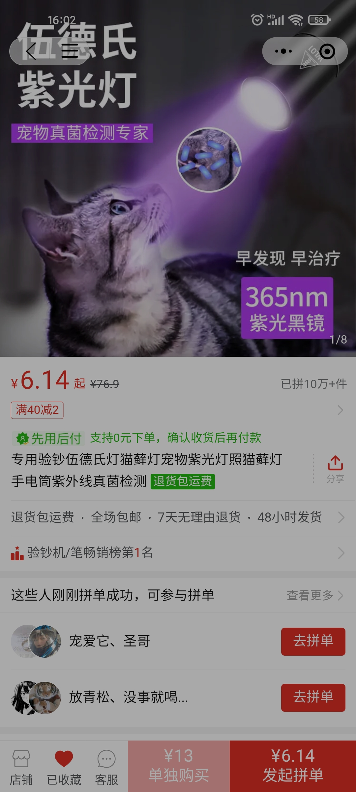

- 由来
  id:: 65435db7-33bb-4579-835b-961be0c4e793
	- {:height 1741, :width 780}
	- 这种黑镜伍德灯能照出红杠
	- 照100元纸币是黄色，照身份证国徽面长城是绿色（验钞灯照不出来）
	- 可以放公共场所测，也能在放学下班时借人照猫
	- 风、阳光、荧光抗原、伍德氏灯、猫藓、新冠宠物感染、狗咬人、生态伦理
	- 容易想到的可能方向是：让防疫者把抗原散出去；照猫需要找猫，促进领养
	  至于宠物生病了测抗原，进而让人生病了测抗原，就稍微有那么一点科幻了
	  当然下面那串的可能方向可能更多
	- 如果连花清瘟实际上更好，那么大规模发药相比更个人的买卖的优势会凸显一些
	- [新冠病毒也会感染狗，对狗的大脑造成影响，这是美国CDC前阵子，刚公开的研究。[#狗主人责任#]](https://m.weibo.cn/status/4959270754582675)
	- 想办法蹭嗷
	- 主子不吃猫粮了、对才玩几天的玩具心不在焉了怎么回事？宠物医院会测新冠吗？养猫多的个人和机构如何进行混检？宠物店里的猫狗有没有得过新冠？如何不把新冠传染给主子？新冠感染对宠物寿命的影响？新冠感染更容易导致猫藓吗？我哪都没去，怎么又生病了，宠物会反向传染给人吗？
	- 新冠感染会增加宠物的攻击性吗？
	- “大有可为”
	- 早发现，早治疗
- 安全性
- [犬窝咳_百度百科](https://baike.baidu.com/item/%E7%8A%AC%E7%AA%9D%E5%92%B3/2103554)
- 痛点
	- 宠物不会说话
- 你不关心主子，你只......你甚至自己都不关心
- 流浪——非常贱的说法，流浪是呼唤乃至苛责我们这些局外人吗
- 概念
	- “宠物混检”
	- 人与动物在卫生、营养等方面统一，打破不必要的人为限制
		- “谁赞成？谁反对？”r
		- 人与自然的交点
			- [[喻]]
		- 人畜共患病
			- 其实很多，不光新冠病毒和这里的肺炎支原体
			- ((654714e8-4e92-4775-b6f3-8d7b7e3a26c8))
				- “发动群众逗群众”
		- 人到动物
			- 荧光抗原
			- 宠物陪玩
				- [全网首个自动熬猫系统！AI终于对猫出手了_哔哩哔哩_bilibili](https://www.bilibili.com/video/BV1eu41147ok)
		- 动物到人
			- 牛磺酸
			- 农业养殖技术（温室、鱼菜共生用的自动化控制技术）
		- 人到动物再到人
			- GlyNac
			- 伊维菌素
		- {{embed ((6525f068-6d59-4651-a856-4149b09072ff))}}