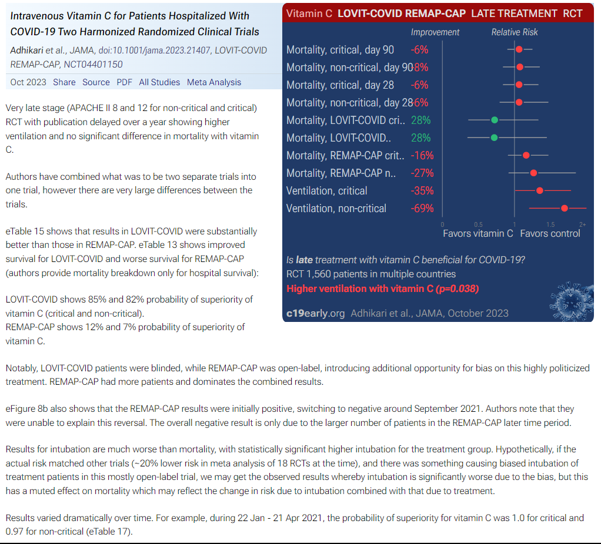
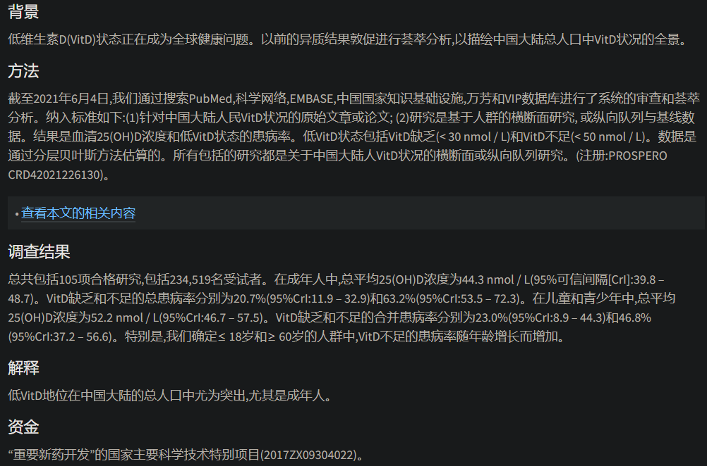
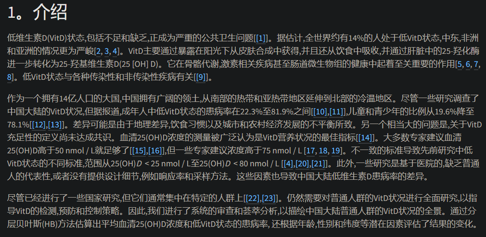
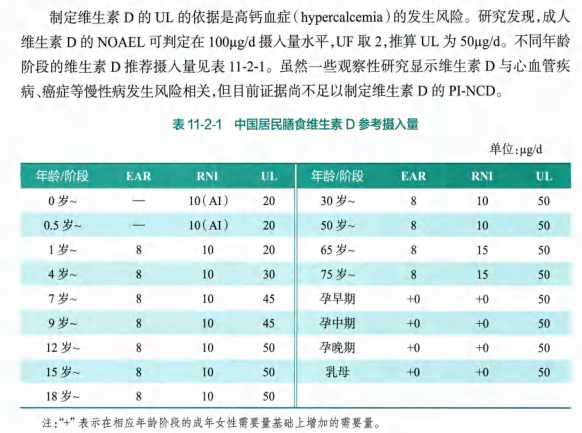
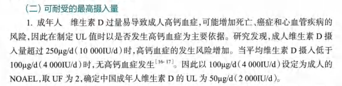
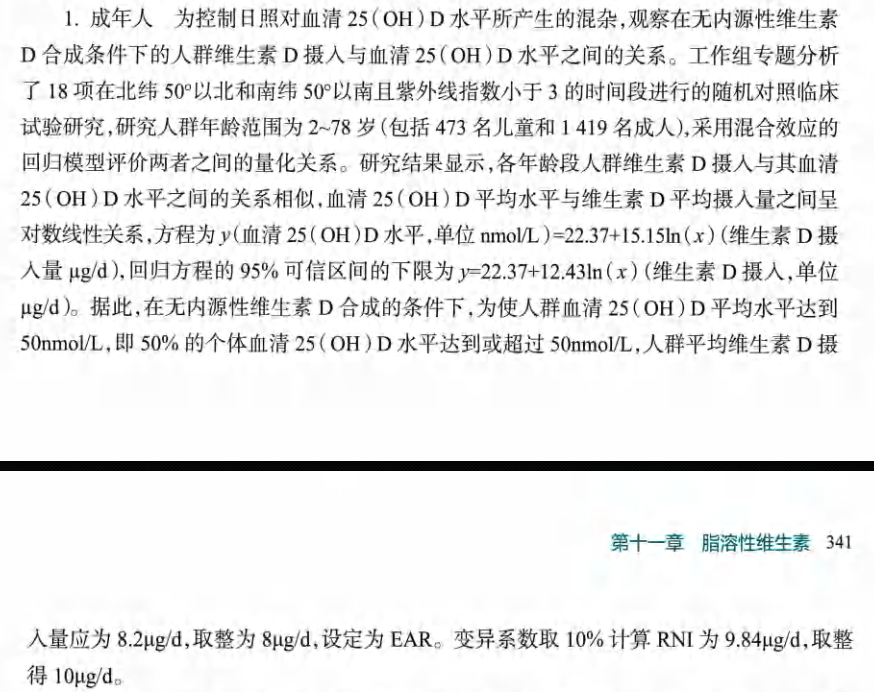
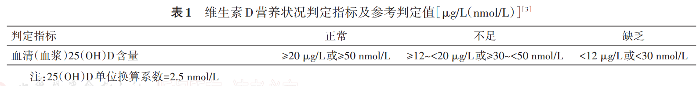
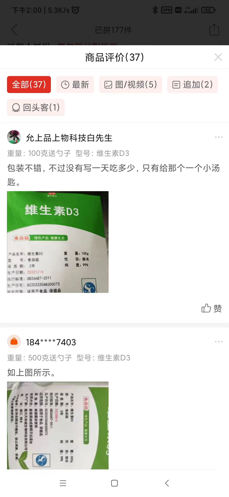
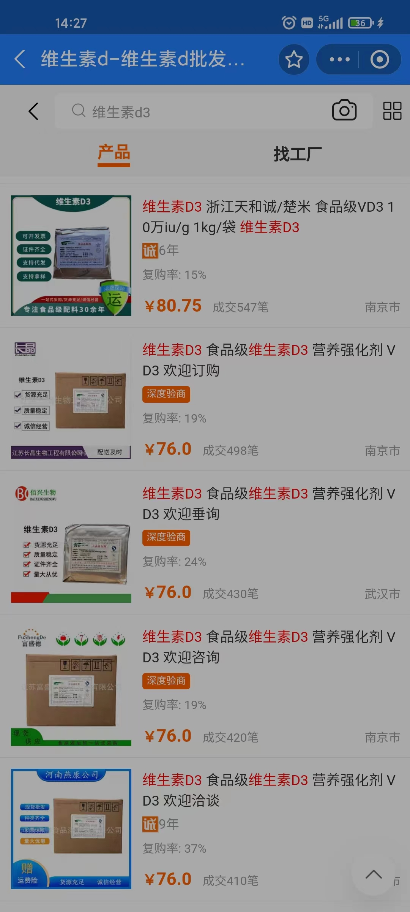

- [[好果汁]]
  id:: 65672e89-e5a6-4e22-b828-58f99a84ad4f
- TODO 中外品牌点评
- ((65d2f23e-0cb1-4dd3-b027-10af7b4cd166))
- “国内市场现状”
	- 食品添加剂
		- >一般卖这种分装的都会送“1g勺”，至于买家会不会吃，他们可能真没想那么细
- 健身补剂（增加运动耐力、运动后加快恢复）
  id:: 65a1ff43-7569-4dab-9544-70cb589954de
- 营养强化剂（与食物混合）
- 来源
	- 从药品“降级”或申请药品失败
- 方便取用
	- 溶解度低的做成片剂
	- 放在餐桌上或水具旁的易开易取容器内
- 需要的剂量
	- 参考
		- RDI、NRV
			- ((659b89ca-9904-42fd-ae98-491758214d0f))
- 保健食品
  id:: 65bcbf49-5341-419a-95c7-adcedd7f4a63
	- >保健食品分为增强免疫力、辅助降血脂、辅助降血糖、抗氧化、辅助改善记忆、缓解视
	  疲劳、促进排铅、清咽等功能类别保健食品和营养素补充剂。
		- ((653cb218-5d1f-4340-9470-ab792cfe043b))
	- ((65cc3acf-fa5f-4994-b4e7-c06dfc86a95c))
	- [保健食品产品说明书，你真的看懂了吗？ - 知乎](https://zhuanlan.zhihu.com/p/201036358)
	- 保健食品功能检验与评价
		- [时隔5年，保健食品功能评价方法终落地！ 5项新文件的主要变化总结 - 法规资讯 - 食品 - 瑞旭集团](https://www.cirs-group.com/cn/food/bao-jian-shi-pin-gong-neng-ping-jia-fang-fa-zhong-luo-di)
		- [ 保健食品功能检验与评价技术 指导原则（2023 年版）](http://www.cnhfa.org.cn/file/upload/file/20230831/[230831]%E3%80%8A%E4%BF%9D%E5%81%A5%E9%A3%9F%E5%93%81%E5%8A%9F%E8%83%BD%E6%A3%80%E9%AA%8C%E4%B8%8E%E8%AF%84%E4%BB%B7%E6%8A%80%E6%9C%AF%E6%8C%87%E5%AF%BC%E5%8E%9F%E5%88%99%EF%BC%882023%E5%B9%B4%E7%89%88%EF%BC%89%E3%80%8B.pdf.pdf)
		- [ 保健食品功能检验与评价方法（2023 年版）](http://www.cnhfa.org.cn/file/upload/file/20230831/[230831]%E3%80%8A%E4%BF%9D%E5%81%A5%E9%A3%9F%E5%93%81%E5%8A%9F%E8%83%BD%E6%A3%80%E9%AA%8C%E4%B8%8E%E8%AF%84%E4%BB%B7%E6%96%B9%E6%B3%95%EF%BC%882023%E5%B9%B4%E7%89%88%EF%BC%89%E3%80%8B.pdf.pdf)
	- 动物实验
		- [已上市药品或医疗器械的动物实验数据在哪里查？ - 知乎](https://www.zhihu.com/question/466473744)
	- 保健功能声称
		- [国家食药监总局：未经人群食用评价保健食品应增加“经动物实验评价”字样_政策与法规_食品安全_食品科技网](https://www.tech-food.com/news/detail/n1381269.htm)
	- 食品生产许可
	  collapsed:: true
		- 查询
			- [食品生产许可获证企业信息查询平台](https://spaqjg.e-cqs.cn/spscxk/)
			  id:: 65ce1a4b-97a2-456d-9673-8a4658a11394
		- [食品生产许可管理办法_国务院部门文件_中国政府网](https://www.gov.cn/zhengce/zhengceku/2020-01/14/content_5468959.htm)
			- >第五十九条  各省、自治区、直辖市市场监督管理部门可以根据本行政区域实际情况，制定有关食品生产许可管理的具体实施办法。
		- [重庆市市场监督管理局关于印发食品生产许可实施办法的通知_重庆市市场监督管理局](https://scjgj.cq.gov.cn/zfxxgk_225/zcwj/xzgfxwj/202301/t20230112_11493863.html)
			- [食品生产许可证过期未超过1个月，经营者可整改后重新提交延续申请_重庆市市场监督管理局](https://scjgj.cq.gov.cn/zfxxgk_225/zcjd/mtsj/202301/t20230104_11453597.html)
		- ((65ce11d8-1f43-471d-a949-3e65eae7c02f))
		- [有没有公文高手说一下办法、实施办法、标准的区别及应用场景，意见、指导意见、实施意见和实施方案的区别？ - 知乎](https://www.zhihu.com/question/473275437)
	- 多维元素片
		- >复合维生素上次去我姑爹家，看我姐买的过期那几种国外常见牌子的（看起来高端她大概不知道），先不说这类特色成分，有些常规的营养素就有点洒水的意思，当然国内的保健食品可能还不如
		- >讲究一个看起来好像挺全，大部分都一本正经地洒水
		-
- 特殊医学用途配方食品
- 婴幼儿配方食品
- 味道
  collapsed:: true
	- [氨基酸都是什么味道的？ - 知乎](https://www.zhihu.com/question/21346655)
	- [什么型的氨基酸多数带有甜味，甜味最强的是什么？ - 知乎](https://www.zhihu.com/question/59575542)
	- 可使用薄膜
		- [Amazon Live - How To Take Citrulline Malate with No Taste: Edible Film!](https://www.amazon.com/live/video/0cebd448ed144bcf85f024f40e850a2f)
- 容器
	- 透明塑料罐（优点是透明、潮结了便于从外壁挤压破碎）
	- 硅胶干燥剂（防止和缓慢逆转粉末受潮结块，光是拧紧盖子不够哦；可以用自测抗原检测卡包装里的硅胶干燥剂；如果因为没用不比硅胶干燥剂的干燥剂导致潮结，可以先把硅胶干燥剂放进去几天，再从外壁挤压破碎，之后几天大块粉会干燥成较小的粉末）
		- 重复使用（10g硅胶干燥剂连小袋放入家用微波炉中火单次加热30-60秒，尽量不要时间长到发出噼啪声，不需要每次都把所有颗粒都弄干）
- 服用方式
	- 时间（例如在健身前后间隔多长时间。不赶时间的话，可以在tmax之后，一般需要45分钟-1小时）
	- {{embed ((653a1c64-39ab-4b7c-bcc0-f3b749c2f353))}}
- 镁
	- 甘氨酸镁
	  id:: 65225815-9788-4ef2-b223-cec2f25f49e6
- 锌
  id:: 65334e3f-7680-4f8b-af0d-a1d9a78abd58
  collapsed:: true
	- 味觉
		- TODO 老年人口味重可能缺锌？
		  id:: 65bcbf49-8e56-4e3e-8ecf-73b99f591c2a
	- [Treatment of SARS-CoV-2 with high dose oral zinc salts: A report on four patients - ScienceDirect](https://www.sciencedirect.com/science/article/pii/S1201971220304410)（治疗，含片，元素锌200mg/d剂量水平）
		- [Acetate-encapsulated Linolenic Acid Liposomes Reduce SARS-CoV-2 and RSV Infection - PMC](https://ncbi.nlm.nih.gov/pmc/articles/PMC10385125/)
- 锰
  collapsed:: true
	- 香辛料一般富含锰
	- [饮用水中过量锰的危害和症状有哪些？ - 知乎](https://zhuanlan.zhihu.com/p/394566348)
	- [餐具中的“锰超标”有多危险？| 果壳 科技有意思](https://www.guokr.com/article/98760)
- ((65ab10f9-0233-4880-97c2-27ca79860a1b))
- [Veni Vidi Vici - Highland - 单曲 - 网易云音乐](https://music.163.com/song?id=2701394)（“Vc、Vd、Ve”）
- 维C
  collapsed:: true
	- [一天补充3000毫克维生素C可以吗？ - 知乎](https://www.zhihu.com/question/392007206)
	- [Lipid and Vitamin C: Preventing and Treating Mycoplasma Pneumoniae Outbreaks - A Comprehensive Guide - Archyde](https://www.archyde.com/lipid-and-vitamin-c-preventing-and-treating-mycoplasma-pneumoniae-outbreaks-a-comprehensive-guide/)
	- [Adhikari: Intravenous Vitamin C for Patients Hospitalized With COVID-19 Two Harmonized Randomized Clinical Trials](https://c19early.org/adhikari2.html)
		- 
- # DOING 维D
  id:: 65ae0905-914f-4d3d-a1de-f9419083a2ac
  :LOGBOOK:
  CLOCK: [2024-02-22 Thu 12:21:24]
  :END:
	- ## 你很可能缺维D
		- 更早看的可能突出“地理差异”的四项体检人群研究
			- {{embed ((65ab10fb-0c31-4115-bc4e-bcb13c9afd74))}}
			- ==注意：这四项体检研究与下文的荟萃分析和中国营养学会对“维生素D水平充足（正常）”的分组标准或判定指标分别为血清25(OH)D含量大于等于30ng/mL（或75nmol/L）和血清25(OH)D含量大于等于20ng/mL（或50nmol/L）==
				- 如果前者的标准换为后两者的，则前者的维生素D水平充足（正常）率分别为==23.83%/22.90%、18.45%/15.92%、50.84%==（对应广州研究的未分男女；对应南宁研究的未知），平均年龄范围约为48~56岁，参考长沙研究中的“随着年龄的增长,维生素D的平均水平呈逐渐上升趋势”，较年轻的年龄组维生素D水平充足（正常）率可能更低
				- TODO 20-30分层依据，选择分层的依据
		- [Vitamin D status in Mainland of China: A systematic review and meta-analysis - eClinicalMedicine](https://www.thelancet.com/journals/eclinm/article/PIIS2589-5370(21)00297-2/fulltext)
			- 
			- 
	- ## 中国营养学会制定的维生素D的RNI（推荐摄入量）为10\mu\g/d（400IU/d），UL（可耐受最高摄入量）为50\mu\g/d（2000IU/d），尚未制定PI-NCD（降低膳食相关非传染性疾病风险的建议摄入量）
		- ((65c589fa-9da8-48e0-add1-8ef5a3baed74))
			- {:height 441, :width 582}
			  id:: 65d445dd-b7f2-4a4a-a2f5-71ee037d87a0
			- >描述食物或补充剂中维生素D含量的常用单位有国际单位（IU）和微克（\mu\g），1\mu\g维生素D相当于40IU维生素D。
			- >目前我国缺乏系统的食物维生素D含量的数据，难以评估来自普通食物的维生素D的摄入量，可以通过膳食评估方法评价维生素D强化食物或者维生素D营养补充剂的摄入。
			- >目前尚无充分证据表明维生素D与特定的慢性病预防存在因果关系，因此本次修订过程中，仍然以骨骼健康指标为依据。
			- 
			- >对于夏季户外活动较多、皮肤暴露面积大、暴露时间长和较少使用防晒用品的个体，即使膳食维生素D摄入量未达到推荐摄人量，其维生素D营养状况仍可能维持正常。
			- 
		- [维生素D营养状况评价及改善专家共识](https://v1.cecdn.yun300.cn/100001_2205185072/%E7%BB%B4%E7%94%9F%E7%B4%A0D%E8%90%A5%E5%85%BB%E7%8A%B6%E5%86%B5%E8%AF%84%E4%BB%B7%E5%8F%8A%E6%94%B9%E5%96%84%E4%B8%93%E5%AE%B6%E5%85%B1%E8%AF%862023.pdf)
		  id:: 65d6e13f-a388-4ef7-87db-f2473a9c754d
			- 
				- 此处参考文献链接中的文件：[人群维生素 D 缺乏筛查方法](http://www.nhc.gov.cn/fzs/s7852d/202005/46557f1d399249989b294c5775bdfdc0/files/64f4c0443cad42a98a8209e5235c9398.pdf)
	- ## 推荐补充方式
		- ### ((65a9d480-f240-4ff5-9072-8ed1d4e334d6))
			- 晒太阳及其他接触阳光方式的其他可能的健康益处见 ((65d6e13f-a388-4ef7-87db-f2473a9c754d)) 和[[阳光]]
		- {{embed ((65d69eb5-c2cb-4833-ae67-f5b49a10792f))}}
		  id:: 65a7b397-87a3-4478-8c75-a909670a031c
		- ### 强化食品
			- TODO 维生素D3粉（分装小包装那种，单价比1688上1kg起的高些，但是否掺假不清楚；也推荐与脂肪同时摄入）
				- 
			- ((65ab10fb-eed7-4e39-8364-9a3eb804f542))
				- ((659b89ca-fc16-4528-b5f0-a1bd37a0bd9c))
					- 
		- ((65dc2b84-d453-41cc-a821-4b20a31bc37b))
- 维K2
	- [[纳豆]]
- 乙酰半胱氨酸（NAC）
  collapsed:: true
	- [NAC：被遗忘的高效抗氧化支持补充剂 - 知乎](https://zhuanlan.zhihu.com/p/594146488)
	- 食物中的含量
		- [Food Sources of N-Acetyl Cysteine | livestrong](https://www.livestrong.com/article/531520-food-sources-of-n-acetyl-cysteine/)
	- 各种用途
		- [Medical and Dietary Uses of N-Acetylcysteine - PMC](https://www.ncbi.nlm.nih.gov/pmc/articles/PMC6562654/)
	- 抗衰老
		- [Supplementing Glycine and N-Acetylcysteine (GlyNAC) in Older Adults Improves Glutathione Deficiency, Oxidative Stress, Mitochondrial Dysfunction, Inflammation, Physical Function, and Aging Hallmarks: A Randomized Clinical Trial - PMC](https://www.ncbi.nlm.nih.gov/pmc/articles/PMC9879756/)
		  id:: 65224f69-5f1d-4821-a43c-22e97b0082ba
			- [GlyNAC (Glycine and N-Acetylcysteine) Supplementation in Mice Increases Length of Life by Correcting Glutathione Deficiency, Oxidative Stress, Mitochondrial Dysfunction, Abnormalities in Mitophagy and Nutrient Sensing, and Genomic Damage - PMC](https://www.ncbi.nlm.nih.gov/pmc/articles/PMC8912885/)
			  id:: 65326bc1-9504-4505-bcb8-60c7b70d2851
				- [C57BL/6J小鼠介绍 - 知乎](https://zhuanlan.zhihu.com/p/654913039)
					- [常用实验小鼠品系介绍 - 知乎](https://zhuanlan.zhihu.com/p/555111318)
					- [仓鼠与老鼠有什么区别？ - 知乎](https://www.zhihu.com/question/318890410)
					- [64年前一只出生在美国的中国小仓鼠，至今还在为人类制造疫苗和药物_澎湃号·湃客_澎湃新闻-The Paper](https://www.thepaper.cn/newsDetail_forward_12213618)
				- >At the age of 65-weeks, one group of 16 mice (8 male, 8 female) were switched to a diet supplemented with glycine and N-acetylcysteine (protein 23.5%, 3.0 kcal/g feed, N-acetylcysteine (NAC) 1.6 mg/g feed and glycine 1.6 mg/g feed; Harlan Teklad, Indianapolis, IN, USA) *ad libitum.*
					- >饲料里两种配料含量各1.6mg/g，低成本轻松延长48周（“......大半年！”）寿命（并提高总饲养成本——“......还我血汗钱！”）
						- >不准确，应该是两组最长寿小鼠寿命的差值
						- >宠物食品厂商不带头掺和，我是不理解的
				- >实验小鼠吃GlyNac延寿24%，那么宠物鼠呢？
			- [GlyNAC improves multiple defects in aging to boost strength and cognition in older humans | ScienceDaily](https://www.sciencedaily.com/releases/2021/03/210329122746.htm)（英文报道）
			- [谷胱甘肽：美白效果一般，抗衰老效果惊人 - 知乎](https://zhuanlan.zhihu.com/p/369313473)
- 甘氨酸
  id:: 6522580b-9d06-4ff0-912e-1bc2f8af16fa
	- ((65225815-9788-4ef2-b223-cec2f25f49e6))
	- ((65224f69-5f1d-4821-a43c-22e97b0082ba))
- 牛磺酸
  id:: 65bcbf49-78bc-4443-9bfe-477b7f61e3e8
  collapsed:: true
	- 杂色蛤子496，鸡腿肉379，鲫鱼205，猪心201，羊前腿肉166-259
	- 抗衰老
		- [(PDF) Taurine deficiency as a driver of aging](https://www.researchgate.net/publication/371444398_Taurine_deficiency_as_a_driver_of_aging)
		  id:: 65335728-8896-4906-86a9-85fd6e3c7bde
			- >To determine whether the observed drop in taurine concentration contributes to aging, we orally administered control solution or taurine at 1000 mg per kg body weight (T1000), once daily at 10:00 am, to 14-month-old (middle-aged) C57Bl/6J WT female and male mice until the end of life.
			- [《科学》重磅：牛磺酸或可助对抗衰老_科学中国](http://science.china.com.cn/2023-06/27/content_42423114.htm)
			- [Science：能量超乎你想象，牛磺酸能够逆转衰老，延长寿命？_澎湃号·湃客_澎湃新闻-The Paper](https://www.thepaper.cn/newsDetail_forward_23432599)（运动也可提高牛磺酸水平）
	- 视觉健康
		- ((64631f13-b243-4ed6-8b4c-40138802f55f))
		- [Taurine: A Source and Application for the Relief of Visual Fatigue - PMC](https://www.ncbi.nlm.nih.gov/pmc/articles/PMC10142897/)
			- id:: 6544fe7d-1c28-4532-84b7-3c8d243545c1
			  >Li et al. [[16](https://www.ncbi.nlm.nih.gov/pmc/articles/PMC10142897/#B16-nutrients-15-01843)] found that the intervention of a 28 g wolfberry diet 5 times per week for 90 days in healthy people can significantly increase the retinal eccentrics of MPOD at 0.25 and 1.75, indicating that regular intake of wolfberry in healthy middle-aged people can increase MPOD, which is helpful to prevent or delay macular injury.
		- [Taurine and oxidative stress in retinal health and disease - PMC](https://www.ncbi.nlm.nih.gov/pmc/articles/PMC7941169/)
		- [How Taurine Supports Eye Health - The Nutrition Insider](https://thenutritioninsider.com/wellness/how-taurine-supports-eye-health/)
	- [应该主动摄入牛磺酸吗? - 知乎](https://www.zhihu.com/question/366638993)
- 精氨酸
  collapsed:: true
	- [Nutrients | Free Full-Text | Effects of l-Arginine Plus Vitamin C Supplementation on Physical Performance, Endothelial Function, and Persistent Fatigue in Adults with Long COVID: A Single-Blind Randomized Controlled Trial](https://www.mdpi.com/2072-6643/14/23/4984)
		- https://c19early.org/tosato.html
		- >Participants were randomized 1:1 to receive twice-daily orally either a combination of 1.66 g L-arginine plus 500 mg liposomal vitamin C or a placebo for 28 days.
	- [Combining L-Arginine with vitamin C improves long-COVID symptoms: The LINCOLN Survey - ScienceDirect](https://www.sciencedirect.com/science/article/pii/S104366182200305X)
		- https://c19early.org/izzo.html
			- >Long COVID trial comparing L-arginine + vitamin C with multivitamin treatment (vitamin B1, B2, B6, B12, nicotinamide, folic acid, pantothenic acid), showing significant improvement in symptoms with L-arginine + vitamin C treatment.
		- >The first group included patients who had received 2 vials/day of L-Arginine 1.66 g in association with 500 mg of liposomal Vitamin C.
		- 治疗30天
	- TODO 抗体
	- [ISH 2022丨高精氨酸与心血管保护、难治性高血压的患者特征](https://mp.weixin.qq.com/s/wm86aPk-xloclPz6FEtwVw)
	- ((65ae08fe-7f9b-4c1a-b827-6a4792ab10db))
- 瓜氨酸
  collapsed:: true
	- 瓜氨酸比精氨酸好在哪？味道好很多，肠胃副作用小，首过代谢（相当于前置/前需反应）、用量少
	- [黑人问号？瓜氨酸苹果酸是什么？科普时间到！ - Myprotein中国](https://www.myprotein.cn/blog/supplements/citrulline-malate-what-is-benefits/)
	- [瓜氨酸真的能提高运动表现吗？](https://www.chemicalbook.com/NewsInfo_20525.htm)
	- [【精氨酸与瓜氨酸如何工作】如何储氮长肌肉_哔哩哔哩_bilibili](https://www.bilibili.com/video/BV1wE411p78m)
	- [L-Citrulline Supplement Benefits and Side Effects – Cleveland Clinic](https://health.clevelandclinic.org/citrulline-benefits/)（报道）
	- [Oral L-citrulline supplementation enhances cycling time trial performance in healthy trained men: Double-blind randomized placebo-controlled 2-way crossover study - PMC](https://www.ncbi.nlm.nih.gov/pmc/articles/PMC4759860/)
		- 运动、骑行：2.4g/d连服8天，第8天服后一小时骑行4km，与安慰剂相比提速1.5%，骑行后肌肉疲劳和专注的主观感觉立刻改善
		- [公路车手是否需要补充肌酸 新研究揭示了潜在的益处 - 野途网](https://www.wildto.com/news/44100.html)（120km长途骑行）
			- >正如预期的那样，肌酸的补充在120公里的长时间试验中没有提升骑行表现(在所有小组中，大约花了3小时10分钟)。
	- [Oral L-citrulline supplementation improves erection hardness in men with mild erectile dysfunction - PubMed](https://pubmed.ncbi.nlm.nih.gov/21195829/)
		- 勃起障碍ED：平均年龄56.5周岁的男性服用瓜氨酸1.5g/d、30天后，由3级的Mild ED/轻度ED转为4级的正常硬度——“你想想看，怎么可能只会增加阴茎的充血勃起硬度，别的肌肉应该也行吧？全体起立！”
		- >In the present single-blind study, men with mild ED (erection hardness score of 3) received a placebo for 1 month and L-citrulline, 1.5 g/d, for another month.
		- >**Results: **A total of 24 patients, mean age 56.5 ± 9.8 years, were entered and concluded the study without adverse events. The improvement in the erection hardness score from 3 (mild ED) to 4 (normal erectile function) occurred in 2 (8.3%) of the 24 men when taking placebo and 12 (50%) of the 24 men when taking L-citrulline (P < .01). The mean number of intercourses per month increased from 1.37 ± 0.93 at baseline to 1.53 ± 1.00 at the end of the placebo phase (P = .57) and 2.3 ± 1.37 at the end of the treatment phase (P < .01). All patients reporting an erection hardness score improvement from 3 to 4 reported being very satisfied.
	- [Pharmacokinetic and pharmacodynamic properties of oral L-citrulline and L-arginine: impact on nitric oxide metabolism - PMC](https://www.ncbi.nlm.nih.gov/pmc/articles/PMC2291275/)
		- 瓜氨酸与精氨酸的口服剂量与次数对应的代谢物的比较，一天两次0.75g瓜氨酸的效果等同于一天两次1.6g缓释精氨酸和一天三次1.0g速释精氨酸
		- >After 1 week of oral supplementation, l-citrulline 0.75 g twice daily increased *C*max for plasma l-arginine and AUC for plasma l-arginine to the same extent as did l-arginine SR 1.6 twice daily and l-arginine IR 1.0 g tid (Table 2).
		- [Therapeutic potential of citrulline as an arginine supplement: a clinical pharmacology review - PMC](https://www.ncbi.nlm.nih.gov/pmc/articles/PMC7274894/)（先看到的）
- 肌酸
  collapsed:: true
	- [Timing of Creatine Supplementation around Exercise: A Real Concern? - PMC](https://www.ncbi.nlm.nih.gov/pmc/articles/PMC8401986/)
	- [(PDF) Pharmacokinetics of the Dietary Supplement Creatine](https://www.researchgate.net/publication/10719069_Pharmacokinetics_of_the_Dietary_Supplement_Creatine)
	- 一水肌酸
		- 肌酸是健身常用补剂，一水肌酸是最常用的肌酸形式
		- [阳后容易累？最新研究：补充这种氨基酸可改善大脑功能有效缓解新冠后遗症！](https://mp.weixin.qq.com/s/jrQuonXxXkAsQ3BFKEeaqA)
			- 随早餐4g一水肌酸用250ml温水搅拌送服，补了6个月
- 叶黄素
  id:: 65ae0905-bf45-4911-a80a-63005bcc7943
  collapsed:: true
	- ((6559d65b-81f0-44e7-ad3c-dfd6100b733d))
	- [Dietary Sources of Lutein and Zeaxanthin Carotenoids and Their Role in Eye Health - PMC](https://www.ncbi.nlm.nih.gov/pmc/articles/PMC3705341/)
		- 欧芹、罗勒、玉米、开心果、蛋黄
	- [如何通过食物补充叶黄素？ - 知乎](https://www.zhihu.com/question/580024868)
	  id:: 65c04781-6c58-43e5-8c7a-ae1703e4279a
		- 韭菜、芹菜、红薯叶
		- [如何看得韭菜农药杀菌剂残留限量上调，从原来的0.2mg/kg上调到5mg/kg? - 知乎](https://www.zhihu.com/question/592257252)
		- [为什么大多数大超市都不卖韭菜？ - 知乎](https://www.zhihu.com/question/454728654)
	- 甘栗南瓜
		- 与普通南瓜的叶黄素是与碳水含量成线性关系吗？
		- id:: 65c064d0-bebd-481a-b884-178d04e822e6
		  >收获：甘栗南瓜既可采收嫩瓜也可采老瓜。一般坐果后20天左右，果实大小达到0.5～1千克时即可采收嫩果上市。坐果后40～50天左右，瓜皮墨绿色，瓜蒂变黄时可采收完熟果。如放在室内20天后食用，其甜度更高，品质更好。
			- TODO “放在室内20天后食用，其甜度更高，品质更好”？
	- id:: 65c03bd9-3f52-4f75-bdff-5af7512e22e6
	  >发酵乳是叶黄素的良好载体，长时间储存对叶黄素的含量及生物活性影响不大，但乳制品经过加热，叶黄素的含量可能会大量减少。——《中国营养科学全书：全2册（第2版）》
- 番茄红素
  id:: 65bcbf49-2e34-48c8-be91-611fe023f4f6
	- ((65672e88-7c91-42d6-826b-9f5551b8d99b))
- 辅酶Q10（CoQ10）
	- [辅酶Q10，是智商税吗？](https://mp.weixin.qq.com/s/svwkpovMgPQ_5iNe6UiP7A)
- D-核糖
	- [诚志股份——全球垄断的新冠特效药原材料企业 诚志股份 —1倍PE的新冠药原料/工业大麻/氢能源企业D-核糖广泛应用于 食品饮料 、营养保健、临床营养等领域。在医药领... - 雪球](https://xueqiu.com/2279287528/215488691)
- 咖啡因
	- “（有的人）不吃/补就是补”