- 先重新定义一下：食谱不光是一段时期/一个周期内摄入的食物/食材种类/品种及对应数量/重量的一个“谱”，还统括性地包含把食材做成一般认为是“一道菜”（“营养便宜好吃方便安全有慧根的微波炉烤红薯算是一道菜吗？”）、“一个套餐”等的菜谱，以及分具体情况的操作步骤/解决方案
- 看（攻略、库存）买提（提货），洗（洗菜）削（削皮；之后可能还要洗）切（之后可能还要洗）倒（倒入炊具）煮
	- 看
	  collapsed:: true
		- “煮艺煮艺”
		- （可能）通过库存学习——看冰箱
	- 买
		- [[买菜]]
		- 记录[[物价]]，价格合适了就买
		- 量大的可以先买起来，一开始看清自提点，别手拎几十斤徒步几公里
	- 提
	  collapsed:: true
		- “哈哈，大家平时都在哪提菜啊？”
		- 徒步买菜/提菜时，可能会遇到一次提较多（10~20斤以上——“谁叫它打折？！”）菜，回程勒手、提不动的情况
			- 对此除了“左中右（肩）后轮换”、平时的力量和耐力训练外，可以用硅胶提袋把手缓解勒手，带够大的背包、够结实的快挂（以免）背大量
				- TODO ((65ca2639-65ef-43ff-9e2d-6c77bad01810))？
			- 注：雨雪天气，因为不想保养沾水沾泥后的自行车或怕出现滑倒之类的事故而不想骑自行车，同时没有其他合适的交通工具或就是想徒步运动一下
		- 自提点可能因为“天气原因”（“这气温不和冰箱里差不多么？虽然没有冷冻”）、实际上没有冷冻乃至冷藏设备、有也不够放或就是懒得放而把冷冻食品放在冷藏区乃至“小店外面”，如果你预期发生这种事，要么尽早拿冷冻，要么看冷冻食品来不来得及完全化完当天做了吃，要么就是接受现状，解冻较多也拿回去给它冻上——当然还可以友善地问一下自提点是否实际上没有冷冻/冷藏服务
	- 存
	- 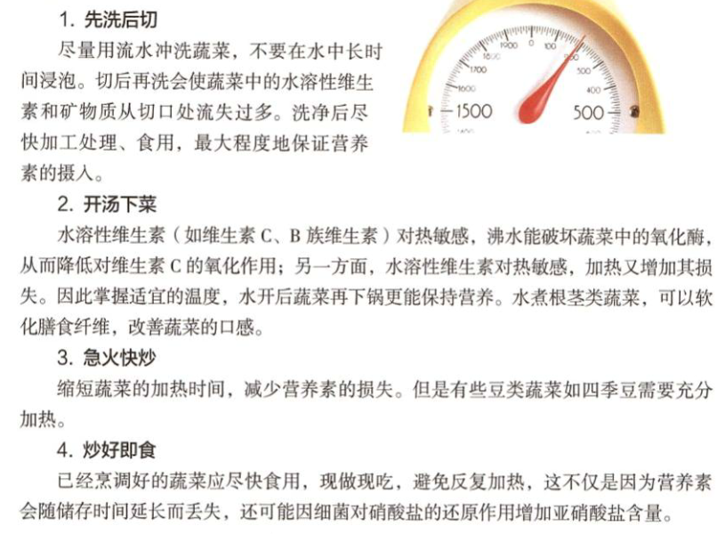
	  collapsed:: true
		- ((65bf90a3-741e-4409-9ec4-80e51f9f7435))
	- 洗
	- 削
		- TODO 陶瓷削皮刀与不锈钢削皮刀削皮后的可食率
	- 煮
		- 先把
- # 设计营养食谱的维度
  id:: 65d40ddd-c951-4403-837f-ab54efba5d4b
	- 营养（能量吃饱，营养吃好，知识学爆）
	  collapsed:: true
		- ==易知，营养维度为首要的维度，它是“硬的实在性”，必须从它出发抵达其他维度==
		- 你高度重视“健康饮食”和“营养”，但你真的吃得健康、吃够营养素了吗？
		- 疾病预防与治疗（“食补”、“食疗”——“食养”）
		  collapsed:: true
			- 传染病
			- 慢性病
				- ((65c1fc81-28d3-4811-adc1-35cf31bf92bb))——“膳食善终”
				- 糖尿病
					- ((65b8a1b4-0710-49cc-b3a1-38f81f06bf18))
						- 可能正常人也应该参考
					- [2024版《中国老年糖尿病诊疗指南》提出“简约治疗理念”和“去强化治疗策略”](https://mp.weixin.qq.com/s/hD837_mG_7esRonLwJkTKw)
				- 高尿酸、痛风
				- 钠
		- 不同工作条件
			- 高温工作、出汗量大
		- 知识/文化
			- 未明子讲课时不时有些奇妙比喻
	- 便宜（食材价格、储存/烹调成本低，能量/营养价格比较高）
	  collapsed:: true
		- 地区菜价分布不均衡
			- 受交通基建和地理环境影响，部分地区可能没有便利的服务和便宜的价格
			- 听口音宰外地人（乃至不会当地话的本地人）
		- 同城买菜群（信息更精准）
		  id:: 65b85c7f-959d-40d8-8f33-cb45b8b77949
			- ((65ae0900-17b4-48bc-83c9-222e17c71d89))
		- ((65c1edc3-daa0-4642-8fd3-1a068b4e8986))
			- 进口冷冻牛羊肉最低能有20元左右一斤，每天吃100g的话4元，与10元一斤的猪鸡价差不过2元，如果只吃50g那就是1元
		- 营养价格比
		  collapsed:: true
			- {{embed ((6437d18f-1248-46df-a840-eee68ba56dab))}}
		- 食物部位、形态与价格（排骨、筒骨贵；尤其是网购，可能带骨切好的>带骨没切好的，肉糜<肉丝<肉块）
		- 热量消耗少
			- 肉汤面条榨菜（燃料费、能量、亚硝酸盐、钠）
		- 可食率
		  collapsed:: true
			- 冻品包冰
		- 促销
		  collapsed:: true
			- 讨价还价（“它有血条！”）、清仓秒杀、领券、办卡
			- 超市促销信息获取、关闭不需要的通知
		- 节假日错峰购买
		- 食谱日均
			- ((65bf5114-7e7c-4181-8621-46b69c2b36e1))
			- 食谱日均
	- 好吃（食物味儿不差，甚至能调剂心情）
	  collapsed:: true
		- 挑选
			- 牡蛎（网购天冷缩水？）、花蛤（超市盘）、鱼眼、（实体市场）“冻化鲜”反复卖、生鲜灯未跟上新国标、猪肝（“黑亮油滑”为佳）
		- 网购退款、评价
			- 有时货品质量不稳定
				- 例子：牡蛎缩水，花蛤沙多，土豆黑心，红薯腐烂
			- 质量差退款、如实评价是我们的义务（也许不能在短期倒逼商家改进，但至少自己强化维权意识，学会不怕麻烦、不忍气吞声）
			- 部分坏能不能吃？要不要退款？退款退多少？
		- 其他
			- 口味（色香味；香型；菜系）
			- 造型（“鲤鱼跃龙门摆盘”、“热饮拉花”、“刺身塑料青草帘”）
	- 方便（便于购买/制作/食用/携带）
		- 考虑到很多人工作繁忙、膳食艰难，如何节省时间尽快吃到营养餐，如何改善不甚营养的班中餐（更广义的“工作餐”），等等
		- 缩短买菜时间
			- 低频率买菜（一次买多天食材，减少通勤时间精力金钱消耗、配送费消耗、等爱吃的清仓消耗，另一方面也可能受限于工作日没有空闲时间买菜）
			  id:: 65c1edc3-daa0-4642-8fd3-1a068b4e8986
				- 增加非鲜品比例冻品（一次通常买较多）
			- 线上买菜（减少通勤时间、精力）
			  collapsed:: true
				- ((65ae0900-17b4-48bc-83c9-222e17c71d89))
				  collapsed:: true
				- “团长？二摊主！”
				- 网购
					- 品种尝试（按质量和偏好筛）
						- ==剩余保质期==（规划饮食）
						- ==食物成分表（可能不明确给出，然后买回来是合成肉）==
					- [[物价]]记录
					- ==杀熟？==
					  id:: 65b865b9-ab57-4bcf-b6e0-558ba2073164
					- 促销（淘宝买菜“幸运购”等）
					- 开卡值不值？
						- ((65b865b9-ab57-4bcf-b6e0-558ba2073164))
			- 节省（通过聚合一锅端）的时间干什么？
				- >学习，学习，再学习！
		- 缩短制作时间/（主要的）营养时间比
			- 纯粹个人意见：如果不是出于闲暇时间的美食爱好或是培养“平战结合”的生存技能（而能包饺子、做面包的面粉是耐储的），不建议在还不如同类有营养、甚至也没好吃多少的菜上消耗过多的时间精力，比如蒌蒿薹之类的蔬菜摘菜要浪费大量时间还有相对食材能量而言可观的能量
			- 洗菜
				- 什么菜需要洗、怎么洗？（有渗出的）包装肉要不要洗？“血水”要去除吗？
				- 如何洗菜对营养损失最小？
				- 提前洗好菜？
			- 赶时间
				- 微波炉、水煮、速冻、高压锅、预约加热
				- 汆汤
			- 便于购买（比如熟悉并能快速抵达菜市场、超市、APP等市场及对应的购买位置；购买不拥挤，超市不排队）
			- 备菜
				- 装在一起还是分在盘子、格子里
			- 薄的食材
				- 肉片、金针菇
			- 预制菜（包括自制的，可能包括[[罐头]]）
			  id:: 65b863eb-4848-416c-b501-f88a08bf2b93
				- 真空包装（塑料包装是否安全？）
			- [在保证营养的前提下，如何极尽简化饮食？ - 知乎](https://www.zhihu.com/question/325540666)
				- [在保证营养的前提下，如何极尽简化饮食？ - 木木鸟的回答 - 知乎](https://www.zhihu.com/question/325540666/answer/1523013196)（食物种类数）
				  id:: 65b888f5-7e44-4400-8b18-2ee649252510
			- TODO 简易保温箱（可能直接用外卖保温箱；泡沫箱加冰袋，装提前做好了的熟冻食物；吃前用附近的微波炉或自带户外气炉、生石灰等加热）
			  id:: 65c1a60a-c424-44d5-9abd-63575619bdb7
		- 缩短食用时间
		  collapsed:: true
			- 以烤红薯为例，烤完先去皮是否更省时？剩下贴皮肉如何处理？手抓着吃的话，洗手时间多久、是否可以省？能不能不洗盘子和勺子？
			- ((65c0de9c-ac0c-4b38-b732-4f27325bd3be))
	- 安全（环境污染、潜在有害农残、亚硝酸盐、无接触配送、刀具、油烟、防火防爆）
	  collapsed:: true
		- TODO 拼接肉好不好（吃）？
		- TODO （不同颜色的）猪肉印章安全吗？
		- 环境污染
		- 潜在有害农残
		  collapsed:: true
			- [有哪些蔬菜水果是我们平时不太注意但农药残留很多的？ - 知乎](https://www.zhihu.com/question/291683392)
				- [EWG's 2023 Shopper's Guide to Pesticides in Produce | Summary](https://www.ewg.org/foodnews/summary.php)
				- [哪些菜生长不需农药，或者需要较少农药？ - 知乎](https://www.zhihu.com/question/21061414)
			- 韭菜
				- {{embed ((65c04781-6c58-43e5-8c7a-ae1703e4279a))}}
		- “隔夜菜/水/茶”和亚硝酸盐
		  collapsed:: true
			- “反正及时放冰箱、尽量当天吃完就完事了？”
			- [隔夜的饭菜到底能吃吗？央视权威回答来了_实验](https://www.sohu.com/a/488280833_120071858)
				- [隔夜蔬菜有毒？宁波食检院用450个数据告诉你答案-辟谣网-浙江在线](https://py.zjol.com.cn/rdgz/201907/t20190724_10651911.shtml)
					- [隔夜菜中的亚硝酸盐真的“严重超标”了吗？| 果壳 科技有意思](https://www.guokr.com/article/62900)
			- [实验告诉你：荠菜怎么吃更安全--健康·生活--人民网](http://health.people.com.cn/n1/2021/0428/c14739-32090631.html)
			  id:: 65c750ba-3472-4867-840f-600b75eeca9d
		- 野菜
		- 流行病高峰期，建议隔着门对骑手说“请放门口”
		  id:: 65c1a326-64a0-495f-b593-52a079e46362
		- 刀具切手
		- 煎炒炸的油烟防护
		- 颠锅费力，回家手麻手臂酸可能没力气颠锅了
		- 食物储备
			- 应对买菜没货、价高（比如春节期间）——“吃饱”
			- 食物储存方法
			  id:: 65b863eb-79ad-4d1a-b7f3-69b44b98a763
			  collapsed:: true
				- ==葱姜蒜==
					- https://nvvkdqimzw9.feishu.cn/docx/BCN7d8IC7oU2y7x7kLgcbjNTnqg#doxcngm8rBU39zqox96uPh1iZUb
				- TODO 根茎储存时间、条件
					- 土豆可能相对容易坏，尤其是要避光，因此冰箱空间够的话建议直接放入冰箱
					- 南瓜、红薯
					- ((65c064d0-bebd-481a-b884-178d04e822e6))
						- ((65de9fc8-d169-454b-b324-882092023c2f))
							- [有没有高手指点一下生红薯如何糖化？ - 知乎](https://www.zhihu.com/question/281989597)
							- [没想到让红薯“服个软”，还挺周折……_腾讯新闻](https://new.qq.com/rain/a/20201205A01CNF00)
							- [在南方，红薯怎么样保存才能够保持新鲜不腐烂？ - 知乎](https://www.zhihu.com/question/428559397)
								- TODO 用报纸接触会导致有害物质渗入红薯皮乃至果肉吗？
				- 冰箱
					- 保鲜（厨房用纸？）
						- ((65ae0902-a5b1-456f-8002-1da81cd74b46))
			- 长短保搭配储备
			  collapsed:: true
				- collapsed:: true
				  | 短保 | 长保 |
				  | --- | --- |
				  | 鲜面条 | 冻面条、面粉 |
				  | 鲜荠菜 | 冻荠菜 |
				  | 鲜肉 | 冻肉 |
				  | 鲜奶、酸奶 | 奶酪、常温奶 |
					- {{renderer :luckysheet, 长短保搭配储备@1707917557685}}
			- 食物过期
				- 注意检查冰箱库存
				- TODO 如何看食物坏了没有？
					- [必看保命小常识——看起来没坏的食物可能也要命？！_哔哩哔哩_bilibili](https://www.bilibili.com/video/BV1sw41117ev)
			- 宠物食物
				- 喂鸟的干谷干豆（真打算储备的话可以买人吃的；我爸妈问过两三次我买来喂珠颈斑鸠的干玉米粒和白豌豆能不能吃——珠颈斑鸠更爱吃的红高粱落泪，当然它也可以酿高粱酒）
				  id:: 65ccc14f-629a-4650-b1f7-b95efb98896e
					- ((65bd9f1a-d0a5-47bf-a2ef-a6814a719550))
	- ((65bf46a1-b650-46e9-aba1-7fda180d07cd))
- # 设计营养食谱的参考信息
	- ## 怎样的营养素是合适的？
		- 《中国营养科学全书》
			- 从特殊需求看一般/其他特殊需求的潜在提升空间
			  collapsed:: true
				- 雷达操纵人员，为了维持对应的暗适应能力所需的维生素A更多，那么普通人是否有类似的场景？是否也可以需要那么多？
					- >外界环境的光照强度用照度来表示，其定义为单位被照面积上接收到的光通量，单位为勒克斯（lux，简写为lx）。一般晴天和黑夜的照度分别约为100 000lx和1/3000lx；低照度环境定义为低于30lx照度的环境。
					  
					  >随着现代科学技术的发展，除了传统的井下和隧道作业外，从事仪器仪表、电脑等操作的作业人员越来越多，平板电脑、智能手机也进入千家万户，这些工作和生活场所均可能涉及低照度问题。另一方面，现代战争为减少伤亡，也常常利用夜幕做掩护，夜幕下作战需要具有良好的视力，一些军兵种如空军飞行员、海军舰艇人员、雷达操纵员、侦察员也需要良好的视力。因此，研究维护暗适应能力、提高低照度环境下的视觉功能具有重要意义。
					- id:: 65c0de9c-22e5-4e2f-b9f9-4e46bbee8ee1
					  >相对剂量反应（relative dose response，RDR）可用来检测人体肝脏维生素A储存量，为评价维生素A营养状况的灵敏指标。采用RDR的方法研究低照度作业人员——雷达操纵人员的维生素A需要量，结果显示雷达操纵人员维生素A需要量为1590μgRE，供给量为1920μgRE，显著高于一般成年人维生素A推荐摄入量。
					- 未超过UL，没毛病
					- TODO 花色苷等其他有助暗适应的营养素
					- 夜间交通
						- 不是所有路段都有充足的照明，突然从亮到暗也制造了暗适应问题
						- 下班走夜路的上班族、夜间送菜送外卖的骑手
					- 需要黑暗环境的质检员（屏幕玻璃？）
					- 夜间（低照度）足球 #俱乐部
					  id:: 65db157f-f9ea-463e-b834-cdc4f4dd405d
					- 黑暗环境不开灯且不采用其他补光手段的电脑用户
					  id:: 65dc867d-b8ba-4bf3-8970-2b87b48e08a9
						- “别人家客厅的灯光设计感觉不太护眼，自家台灯又没带”
							- 带鱼屏面积大，似乎覆盖视域更多会好些；亮度0，对比度20，写作OK
		- 《中国居民膳食指南科学研究报告（2021）》
		  id:: 65c3260e-f2bb-4525-a4c5-75ce2e5199d6
		- 《中国居民膳食指南（2022）》
		  id:: 65bf90a3-741e-4409-9ec4-80e51f9f7435
		  collapsed:: true
			- （余处可能简称“膳食指南”）的准则及相关细节
			-  (Z-Library).pdf)
			- [《中国居民膳食指南2022》帮您把吃吃喝喝这些事搞的明明白白_中国居民膳食指南](http://dg.cnsoc.org/article/04/x8zaxCk7QQ2wXw9UnNXJ_A.html)
			- 但膳食指南可能也需要向“人民群众的饮食习惯”妥协
			- 根据实际情况调整（“五八膳食指南”，“边际改善”）
				- “都是观察来的，为什么要那么多普通人，而不是重点参考长寿老人？”
				- ((65bf90a3-741e-4409-9ec4-80e51f9f7435))（“量达标了就别管通过什么达标的”）
				- 多年龄段建议摄入量取交集
				- 与 ((65ae0909-ac24-42f7-a830-180caec7b592))之类的大人口观察研究取交集
					- ((653c80ec-8087-48a1-860a-86ff8b55ccb3))
						- ((65b88a43-9fb6-4e9f-8468-8aebbea0cc64))
							- 成品纳豆大多40-50g一盒，一天20g
				- 各国膳食指南
				  collapsed:: true
					- [Dietary Guidelines for Americans, 2020-2025 and Online Materials | Dietary Guidelines for Americans](https://www.dietaryguidelines.gov/resources/2020-2025-dietary-guidelines-online-materials)
					  id:: 65bf931a-c463-4b0b-9bae-fc183ad55446
					- [「食事バランスガイド」について：農林水産省](https://www.maff.go.jp/j/balance_guide/)
					  id:: 65bc7c2e-6bd4-46d8-b479-91e99099fa44
					-  (Z-Library).pdf)
					- ((65bc7a41-1838-4502-bc40-cc44e30eb9ee))
						- 实际上，在日本膳食指南中，薯类不是主食
							- [关于膳食指南的那些事儿——中日膳食指南对比 - 知乎](https://zhuanlan.zhihu.com/p/467608023)
							  id:: 65ba004e-8cd5-4f94-ad06-1a18923df940
								- 某种意义上，日本的推荐量没有中国的健康
									- ((65bc7c2e-6bd4-46d8-b479-91e99099fa44))
				- 少数民族观察（当然， 也可能与生产生活方式和遗传因素有关）
					- ((65b888f5-7e44-4400-8b18-2ee649252510))
				- 实际烹饪和选购过程中==适量==乃至隐身的油盐
				  collapsed:: true
					- 控油控盐容器
					- 菜的重量可以买时大致确定，但油倒进锅里后不用厨房秤称油壶差额就继续“适量”着
					- ((65b07306-8570-4e4b-9135-910183a8950f))
					- ((65ae0908-e3e0-4752-ab67-49463e8c201a))
				- 品种要这么多吗？
					- 首先理解“不确定”
					- 相关研究？
					- ((65b888f5-7e44-4400-8b18-2ee649252510))
				- 蔬菜要这么多吗？
					- 因为很多居民买的很多蔬菜在营养（包括热量）上比较“水”？
					- 蔬菜涉及农业收入？
					- 不过深色蔬菜胡萝卜还行
				- 薯类要这么少吗？
				  collapsed:: true
					- 膳食指南“恰恰可能”是为了保证膳食建议的一致性而更多基于现有科学研究的分类对食物进行了分类，所以淀粉含量较高的薯类单独拎出来，不算（淀粉质）蔬菜
					- “薯类”疑似有点偏小了，就国外膳食指南（先看的那个“2021科学研究”的表格再搜的，那表格有点蛇皮）而言，它在日本算蔬菜，在美国算淀粉质蔬菜
						- 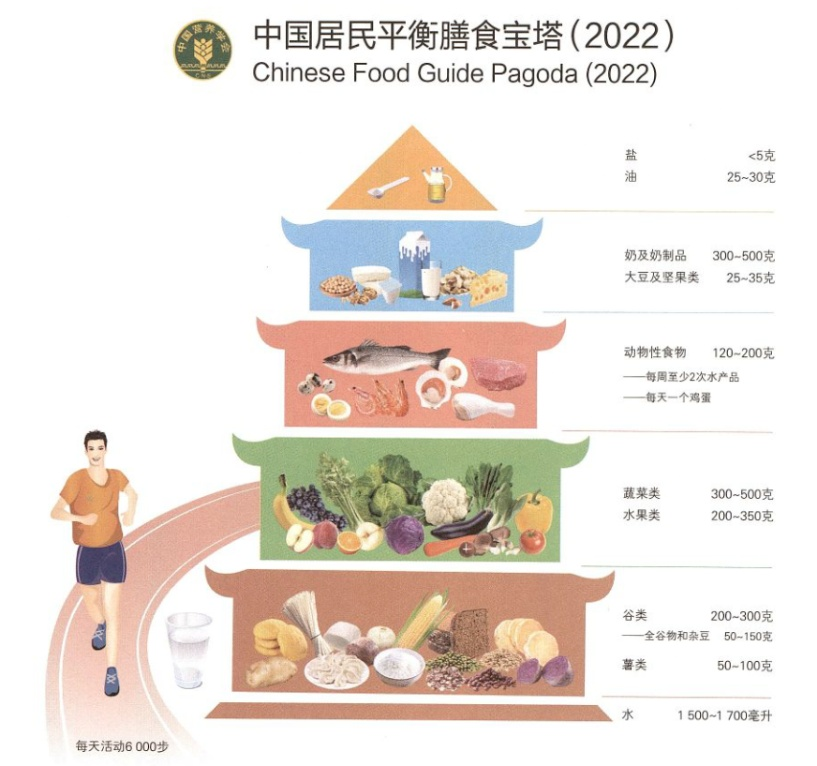
						- 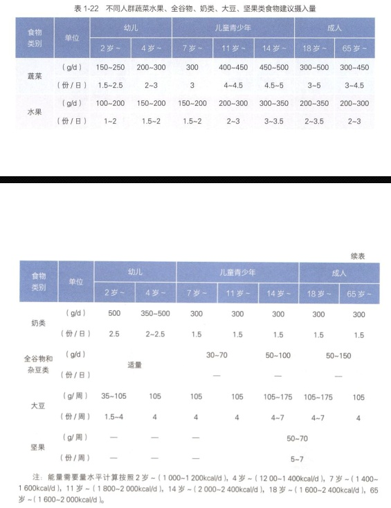
						- ((65bc7c2e-6bd4-46d8-b479-91e99099fa44))
						- ((65bf931a-c463-4b0b-9bae-fc183ad55446))
					- >常见的薯类有马铃薯（土豆）、甘薯(红薯、山芋)入、芋头、山药和木薯。我国大多数居民的饮食中常将马铃薯、山药和芋头作为蔬菜食用。
					- 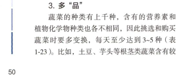
						- “百密一疏啊！”
					- “薯类50-100g的建议摄入量疑似有点小了，一个小红薯就轻易超过了，一次吃半个？小红薯分你一半？”
					  id:: 65b88951-8b27-4820-ba3d-8151059d7cb8
					- 能不能少点谷类，多点薯类？
						- >谷类包括大米、小麦、玉米、大麦、小米、高粱、燕麦、荞麦等。淀粉是谷类食物的主要成分，占40%~70%，是==最经济==的膳食能量来源。谷类蛋白质含量为8%~12%,因其==摄入量较多==，所以谷类蛋白质也是膳食蛋白质的重要来源。谷类脂肪含量较少，约2%，玉米和小米中的脂肪含量可达到4%，主要存在于糊粉层及谷胚中，大部分为不饱和脂肪酸，还有少量磷脂。谷类所含维生素和矿物质的种类和数量因品种不同而有差异，由于==食用量大==，谷类是膳食B族维生素，包括维生素B、维生素B和烟酸的重要来源。
						- ((65ba004e-8cd5-4f94-ad06-1a18923df940))
							- 按日本的分类，土豆、红薯等属于蔬菜，很容易就妥妥吃够了——“什么谷薯过量？我这是吃了两斤多蔬菜！”
				- 肉类要这么少吗？
					- “膳”食？如“膳”！“有肉才叫善！”
					- 肉吃少了可以吃可能更好的牛羊肉
				- 烹调油限量是因为植物油不好还是动物油不好？不如细胞内脂肪吗？
				- 动物内脏
					- 猪肝
					- 内脏怎样处理？
						- TODO 猪肝大血管拿水管怼自来水一分钟不到没血了，也没味了，里面真的都是网上传的有害物质吗？
		- 《中国居民膳食营养素参考摄入量（2023）》
		  id:: 65c589fa-9da8-48e0-add1-8ef5a3baed74
		  collapsed:: true
			- （参考PI-NCD、SPL、UL等DRIs）
			- 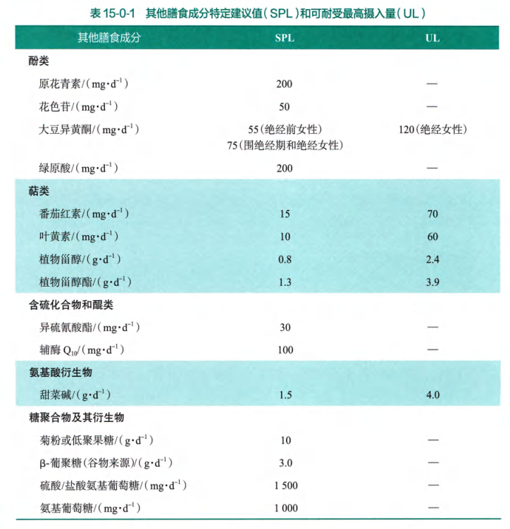
			- 中国成年人膳食（下同，省略）钾的PI-NCD为3600mg/d
				- >如果肾功能正常，从日常膳食中摄入的钾不会引起代谢异常。目前尚未见到因膳食摄入钾引起高钾血症的报道。由于资料不足，因此不设定UL。
			- 不锈钢制品含铬，承装酸性食物（醋、番茄等）可增加溶出
			- 膳食纤维
			- 钠的PI-NCD为≤2000mg/d
			- 维C的PI-NCD为200mg/d
			- n-3多不饱和脂肪酸的AMDR为总能量的0.5~2%，1800千卡对应1~4g
			- 原花青素的SPL为200mg/d
			- 花色苷
			- ((65ae0905-bf45-4911-a80a-63005bcc7943))的SPL为10mg/d
			- ((65bcbf49-2e34-48c8-be91-611fe023f4f6))的SPL为15mg/d
			- 甜菜碱的SPL为1.5g/d
				- TODO 海贝含量
			- ((65bcbf49-78bc-4443-9bfe-477b7f61e3e8))暂无SPL，
			- GABA暂无SPL，南瓜371~1553
			- 左旋肉碱暂无SPL，
			- 绿原酸的SPL为200mg/d
	- ## 食物营养成分查询、饮食记录、饮食营养分析
	  collapsed:: true
		- 能查询，不能（或不方便）记录、分析的
			- [食物营养成分查询平台](https://nlc.chinanutri.cn/fq/)（只能查询，而且不太全，搜索框下的“营养小助手”和“我的餐盘”疑似有点难用）
			- [食品成分データベース](https://fooddb.mext.go.jp/)（日本文部科学省的，以前搜过鮟鱇鱼肝等海鲜）
			  collapsed:: true
				- [日本食品標準成分表（八訂）増補2023年：文部科学省](https://www.mext.go.jp/a_menu/syokuhinseibun/mext_00001.html)
			- [FoodData Central](https://fdc.nal.usda.gov/)
			  id:: 65c0de9c-6284-4414-8d6e-85a56dfeb647
		- 能差询，能记录、分析的
			- 有些食物有多条记录的，一般需要对比一下，选取营养素种类较全、与其他来源的数据较接近的一条
			  id:: 65ddf4f3-9e98-4996-bdc9-fa121cc2eecc
			- 薄荷营养师（有微信小程序，电脑微信也可使用；别的不用多看，因为它的旧版本似乎存在争议）
				- [薄荷健康(app)是暴食的元凶吗？ - 知乎](https://www.zhihu.com/question/333713729)
				- ((65b88951-8b27-4820-ba3d-8151059d7cb8))
				- 点开具体食物可查看数据来源
				- 其他营养素，“点击这里”自定义，可以添加维生素、矿物质
			- [Nutritional Values For Common Foods And Products](https://www.nutritionvalue.org/)
				- 算是能用，但可能不容易大规模应用，且中国与美国的食物营养成分可能有些差异
				- >Data from USDA National Nutrient Database.（译：数据来源于美国农业部国家营养素数据库。）
					- 前几年有个nutrition data网站在有些地方更好用，现在不知道去哪了
- # 使用微信小程序“薄荷营养师”设计食谱
  collapsed:: true
	- ==（注：图片暂时可能不及时更新）==
	- 它参考了一些信息，做出了一个生意，就目前的版本而言，用起来还好
	- “能量”与“热量”辨析
		- “热量”可以说是燃烧测得的热量，但食物除了可能燃烧外，最主要的用途好像还是给人吃
		- 食物下肚后并不是全都用来“发热”了，人并非自己不能动的“暖宝宝”，所以我觉得这个词，至少在本文中，可以主要用“能量”而不是“热量”
	- 用它可以查询、比较食物营养，也可以记录、设计食谱和菜谱并分析。
		- 此外，在实际生活中，还可参考它提供的“身份证/银行卡”比较图示（膳食指南中好像主要是用手比划），以便在没有或不便使用厨房秤时估计食物重量——我个人认为没必要
	- 打开注册登录微信小程序后，首先在“我的”-“个人信息”调整年龄、性别、体重可以调整推荐热量，
	  collapsed:: true
		- 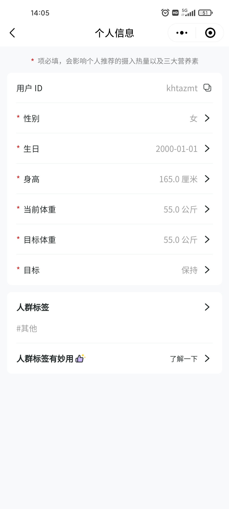
			- “这体重是不是还稍微轻了些？不确定”
	- 常规使用就是搜索食物，“比一比”
		- 黑米、纳豆、藜麦等食物好像要只打第一个字才能搜到
	- TODO 确认对应食物的营养数据的完整性、合理性（“别给我漏了、错了”）
	- “营养分析”
		- 其他营养素
			- >（食物部分数据可能会有缺失，仅供参考）
		- 点击“营养分析”后，可在“其他营养素”下点“点击查看”添加“营养分析”中要显示的营养素，一般把维生素、矿物质和n-3脂肪酸（也就是“omega-3”）、DHA、EPA（“二十碳五烯酸”；还可以有“EPA+DHA”，虽然可以加减自己算——但它DHA显示了，别的不显示）、等营养素点上
		  collapsed:: true
			- 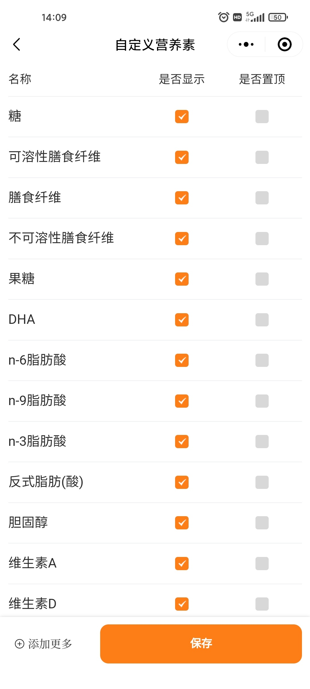
		- 在不同类别点击对应的“摄入食物排行”，可以看不同食物在该类别的“贡献值”，有助进一步调整食谱
	- “饮食建议”
	  collapsed:: true
		- 它这个“食物种类建议”不是所有分类都完全依据膳食指南，比如水果
			- 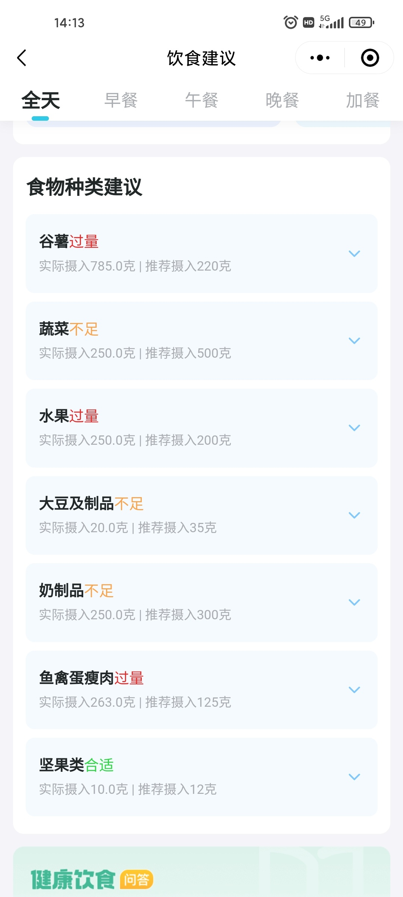{:height 1604, :width 718}
	- 缺点
		- 有些营养素在“营养分析”前不显示，连数据缺不缺都没法预先确定
- # 我设计的营养食谱
  id:: 65c328d2-2221-417a-8e15-ee55c55a4d2c
	- 【腾讯文档】营养食谱
	  id:: 65d955ef-abca-4a40-b268-b6d4b52ec6d4
	  https://docs.qq.com/sheet/DZVZjUlRYUnVlY0JT?tab=zywsvq
		- 对应的有些小出入的美国农业部国家营养素数据库版：[营养食谱 recipe nutrition value and analysis](https://www.nutritionvalue.org/public_recipe_175429.html)
		- [[十元食谱]]
	- ## 食物
	  id:: 65c42e62-516f-422a-bca2-8af342c27b2d
		- ((65bcbf55-e32a-44b6-b028-a13d2ea26a08))
		- （点“饮食建议”能滚动截长屏，别的页面好像不能）
		- 综合日均支出和单价，显得比较贵的有牡蛎（“海中牛奶是吧？”）、牛奶和开心果
		- 兽肉100g，种类自选，推荐的有
		  collapsed:: true
			- 羊腿（“营养能没有羊吗？”）
				- 澳洲冷冻去骨羊腿肉，20斤约21/斤，草饲肉哦
			- 猪心/牛心（虽然不足以达到CoQ10的SPL值，但综合看，此外买冻品的话也可能降低成本；可以算“内脏”，也更是肌“肉”；牛心比较大，可能会没见过几斤肉的人一点小小震撼）
			- 猪梅花肉（主要是好吃——“喜不喜欢吃牛排？牛排贵？吃猪排！”）
		- 海鸭蛋65g
		  collapsed:: true
			- 每天一个海鸭蛋（可能营养比普通鸭蛋和鸡蛋更全面均衡，比如n-3/n-6脂肪酸比例；“海鸭蛋”数据看着异常，可能测的是腌海鸭蛋，不确定）
				- [小小海鸭蛋 展现大作为_北海_广西壮族自治区农业农村厅](http://nynct.gxzf.gov.cn/xwdt/gxlb/bh/t16257025.shtml)
				- [产量占全国海鸭蛋70%！广西这个地方海鸭养殖吸引全国农牧巨头聚焦_网易订阅](https://www.163.com/dy/article/F1MAIHLC0514E1NL.html)
		- 香蕉60g（国产小高山香蕉可食率约62%）
		  collapsed:: true
			- 每周骑自行车时吃，也可以平时吃，一小根也可能有50g，也可以去皮后表面撒点盐冷冻，吃起来更甜
			- 便宜的往往比较生，加速催熟要放一个我不爱吃的苹果，这还是有点烦的
		- 荸荠50g
		  id:: 65cdda67-dee2-465d-a95a-b3a61547c443
		  collapsed:: true
			- 此处原为某种意义上也算是凑数的山药（也有中医的影响，“浓煎山药赛人参”，但是怀山药比较贵，且山药削皮也不太方便，作罢），改为荸荠更多是为了好吃（“马蹄，爽！”；煮熟荸荠像甜玉米味的藕），以及“私下把它当水果”（“你认为它是水果还是蔬菜？——我认为它是薯类，听懂掌声！”），但除了寄生虫风险总觉得有点不太确定外，最主要的也还是削皮麻烦（可能还不太安全）及相关的价格问题
				- 山药25g（炖、炒都可能放，再加上中医中“浓煎山药/冬吃山药赛人参”和传统文化中陆游等诗人爱吃山药粥等，算它一个）
			- 可食率约60%（“迪拜刀法/削皮刀”）
			- TODO 高压锅煮荸荠，然后冷藏或冷冻？
				- TODO 荸荠罐头？
			- 也可以做沙拉、甜点，包括冰激凌，都有可能
				- ((65deb4e6-2f19-40fb-beb1-d3ec20bf7796))
			- [荸荠的营养价值 - 知乎](https://zhuanlan.zhihu.com/p/259996605)
			- TODO 能不能生吃？
			  collapsed:: true
				- 姜片虫
				- [荸荠有营养，但不要生吃_新闻频道_央视网(cctv.com)](https://news.cctv.com/2021/11/26/ARTItbJWa4BYOiVLiU1fQyxZ211126.shtml)
					- >荸荠含糖量高，容易腐烂变质，不耐久贮。通常在1℃或者5℃条件下贮藏时，可保持较高的新鲜度；而在10℃的条件下，球茎还会变得更甜。如果带泥一起贮藏可放更久，但因荸荠外皮中可能携带寄生虫，如果要放入冰箱冷藏，建议单独用保鲜袋包装，并与熟制食品分开存放。(来源：科普中国)
				- [荸荠生吃真的容易得寄生虫吗? - 知乎](https://www.zhihu.com/question/381530700)
				  id:: 6f124093-acc0-4744-8ad6-699f5548cd6b
				- [荸荠虽好吃？但最好别生吃！【餐桌保命指南】_哔哩哔哩_bilibili](https://www.bilibili.com/video/BV1ku411x7DP)
			- 我不熟练地削，七个125g出了75g，可食率60%
		- 鮰鱼块28g（斑点叉尾鮰，耐储方便无鳞无刺带皮淡水鱼肉，大概一周吃200g，除了鱼块还可吃开背鱼。此外推荐江团/长吻鮠，根据所在地区，可能买到菜场现杀或快递活鲜。巴沙鱼柳不含皮，比较嫩，但可能有点贵，有带皮鱼块的话也可以尝试）
		  collapsed:: true
			- “膳食，这个膳字都告诉你要有肉了，那么吃鱼是不是要吃鳝鱼这种无鳞鱼？” #上海燎原
			  id:: 65d968f5-993a-4dd1-9743-36c353323dba
		- 牡蛎25g（富含硒、铜、锌、甜菜碱等）
		  collapsed:: true
			- 建议每7~10天吃一次蒸牡蛎（可以用高压锅蒸）或[[海蛎煎]]（约需三斤带壳牡蛎，冷冻原汁牡蛎肉大多不如带壳冰鲜的新鲜，能接受也可以吃），有条件可以吃更多，不方便购买的话可以换成去壳熟制品，如牡蛎罐头
				- TODO 或者换一种有相似优势营养的食物
					- ((65c21e29-cc61-43d7-a120-709181052296))
					- 贻贝
		- 藜麦25g（富含甜菜碱，可能用花蛤、牡蛎等海贝替换；暂未找到不同颜色籽粒的甜菜碱含量，可能大致相同，因为它们生长要应对同样的高盐环境，需要的保护用的甜菜碱应该是大致相同的；考虑到消化难度，建议全部或主要食用白藜麦）
		- 稻米油16g（米糠油）
		  collapsed:: true
			- 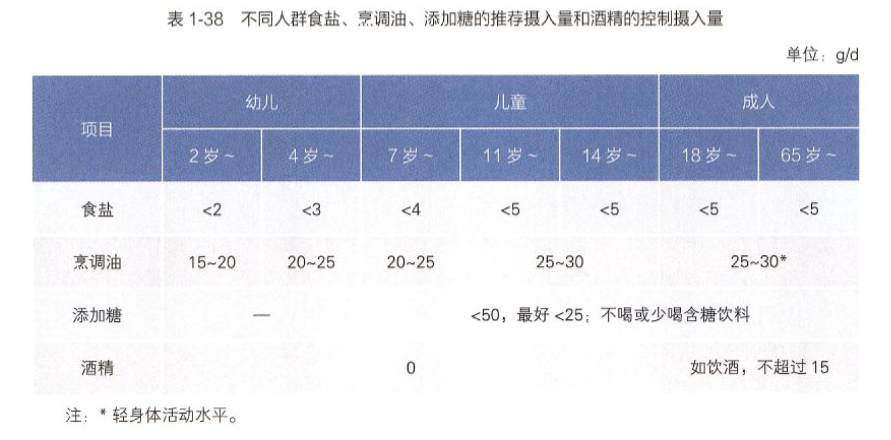
			- 选择理由
				- 烟点高（比压榨花生油高），不易产生油烟附着于食物或被或多或少吸入（可能大部分家庭的油烟机的整体效果是不太行的，减少油烟吸入摄入要从多环节着手）
				- 杂味少（有些人可能不太喜欢花生油的味道）
				- 不算贵（比好点的猪油便宜）
				- 含有谷维素等营养
			- 如果不喜欢用稻米油，可以换成其他油（猪油、山茶油、山核桃油，偏凉拌的芝麻香油、橄榄油，都可以），也可以把对应的脂肪用偏肥的肉代替
			- [油讯 - 稻米油技术创新联盟在赣成立 我国米糠利用率五年将增20% - 导油网—食用油行业网站，服务食用油、油脂产业](https://www.oilcn.com/article/2023/05/05_88027.html)
		- 酸奶
			- 奶200-300mL或等量钙的奶酪
			  id:: 65c4480c-bb88-4287-8987-bc119fc868b5
			  collapsed:: true
				- | 商品名 | 钙含量 | 体积/重量 | 价格 | 钙价比 |
				  | --- | --- | --- | --- | --- |
				  | 长江牛奶玻璃瓶装2.9巴氏杀菌乳 | 100 | 1.95 | 3.7 | 52.70 |
				  | 伊利舒化奶常温奶（标准版，220mL*12盒） | 100 | 2.2 | 3.5 | 62.86 |
				  | 叮咚V5娟姗4.0高温灭菌乳（2件25.9） | 130 | 7 | 12.95 | 70.27 |
				  | 蒙牛每日优鲜4.0巴氏杀菌乳（叮咚买菜随心订） | 130 | 7.2 | 13.18 | 71.02 |
				  | 蒙牛特仑苏常温奶（标准版，250mL*12盒） | 120 | 2.5 | 4.16 | 72.12 |
				  | 光明浓醇优倍3.6 | 120 | 9 | 13 | 83.08 |
				  | 光明新鲜牧场高温灭菌乳 | 115 | 9.5 | 12 | 91.04 |
				  | 格巴尼新鲜马苏里拉奶酪（临期） | 410 | 3.9 | 16.8 | 95.18 |
				  | 君乐宝鲜牛奶巴氏杀菌乳 | 120 | 9.5 | 11 | 103.64 |
				  | 夏进常温奶（多多买菜） | 105 | 10 | 8 | 131.25 |
				  | 塞浦路斯ALAMBRA哈罗米奶酪（临期） | 664 | 4.5 | 20.6 | 145.05 |
					- {{renderer :luckysheet, workbook@1707746037982}}
				- 奶的（标示）钙含量一般约为蛋白质含量的$\frac{1}{30}$
				- 100g半硬质奶酪大致对应500~600mL奶，马苏里拉奶酪偏软，对应较少的奶
					- 奶酪添加了食用盐，可对应减少含钠调料用量。可以计算一元能买到含多少钙的奶或奶酪，即“XXmg钙/元”，临期奶酪相对便宜，换算后可能比这里列举的鲜奶更便宜，而且可能使用更多样化、更好的奶源
					- 但奶酪吃起来可能更方便，毕竟不用自制和添加
					- 奶酪用的奶一般最高是巴氏杀菌乳
					- 马苏里拉之类比较新鲜的奶酪乳糖含量仍较高
				- 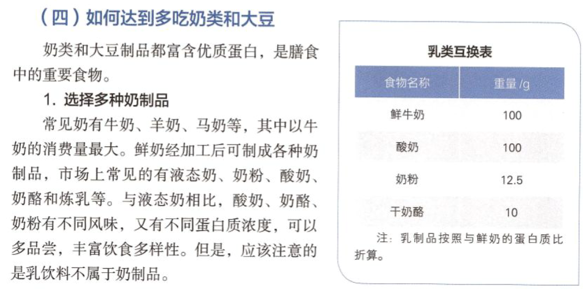
					- 这个“干奶酪”可能指的是属于硬质奶酪的帕玛森干酪，磨起来有点费力
			- 百香果40g（可以加到酸奶里，一个紫皮百香果大概这么多籽，嫌多应该可以冷藏分次吃，不喜欢也可以不吃）
			- 椴树蜜12g（对应“蜂蜜（白蜜）”；加入酸奶）
		- 秋刀鱼10g（富含n-3多不饱和脂肪酸、DHA，作为内陆花钱不多也能吃到的刺比带鱼更少、营养密度更高的中高脂海鱼的代表）
		  collapsed:: true
			- 每周一条约100g的中大号（大概是二级）秋刀鱼（一般煎、烤、梅煮/糖醋煮，油炸没试过），或 ((64631f0a-88bf-4ed7-b5c2-1a8949e5a7b4))，吃其他海鱼（多春鱼、挪威青花鱼等）也行，总之不常吃海鲜的人要有不少于日均10~20g的中高脂海鱼，可以适当多吃
			- 膳食指南给的
		- 板栗10g
		  collapsed:: true
			- 坚果推荐量就这个范围，国外的研究一般是一盎司28g，多吃可能要减少其他食物摄入
			- 推荐理由：板栗便宜，含油量不高（“这坚果吗？”），入菜难度低
				- ((65cd9de6-2c05-4087-8f6d-7f7b2d9e7221))
					- “我们的栗子真的太坚果啦！”
			- 原本推荐我吃过的开心果，因为营养比较好，但也有点贵，板栗可以随便吃吃，偶尔买些当零食或做菜挺好的
			- 有点像栗子的榛子也贵些，但可以做酱
				- [榛子的一生｜现代农业种植和收获榛子｜坚果之王_哔哩哔哩_bilibili](https://www.bilibili.com/video/BV1ZB4y1w7jL)
				- [吃过我这个最强焦糖榛子巧克力酱，Nutella什么的你就还是赶紧扔掉吧！_哔哩哔哩_bilibili](https://www.bilibili.com/video/BV1WN41147Xm)
		- 洋葱10g
		- 酱油5~6mL（约6g，鲜味剂，食物之外主要的钠来源）
		- 猪油4g（每周一次海蛎煎约用20g油，剩下的可以用来煎肉）
		- 紫菜2g（碘等矿物质和一点海藻多糖，同时是普遍比较容易接受和方便烹调的海藻制品）
		- 豆类
			- [碗豆算坚果吗？ - 知乎](https://www.zhihu.com/question/439271318)（过年吃的嘎嘣脆的蒜香青豌豆感觉还不错，我觉得比油炸花生米强）
			- [花生是坚果还是豆子？ - 知乎](https://www.zhihu.com/question/22368931)
			  id:: 65cd9de6-2c05-4087-8f6d-7f7b2d9e7221
	- ## 营养分析与论证
	  id:: 65c328d2-9905-4113-9f8f-92abbb18a353
		- ==“薄荷营养师”中达标的营养素暂不细查是否因而实际（包括与额外的饮食合并）超过UL的情况==
		- 从设计营养食谱的角度看，只要不超过UL，就不是“营养过剩”
		- 食物种类数（不含食用油和酱油、香料等调味料）
			- 中国膳食指南建议每天12种以上，每周25种以上
			  collapsed:: true
				- 纯纯的番茄酱不算蔬菜，在我这算的
				- ，本食谱26种，赶时间先不想还能吃什么了（，好，28种了，收工）
				- 其他备选：黄瓜、青菜、苋菜、红薯苗、罗勒、黑米、鲜玉米/冷冻玉米粒/干玉米粒、作为坚果的生可可粉或黑巧
				-
		- 食物种类重量
		  collapsed:: true
			- 蔬菜不够，除了“薯类”其实可以算作或折算为蔬菜外，番茄酱可以算浓缩番茄，至少算五倍，那就是100g，那就有300g了
		- 宏量营养素
		  collapsed:: true
			- 根据那个美国研究，碳水供能50-55%全因死亡率最低，53%看起来又是区间中最低的（拿Power Toys的“屏幕标尺”功能测过了，约52.85714%，熟悉的1/7，四舍五入就是53%）
			- 蛋白质20%以下，同时有约1.4g/千克体重
			- 脂肪没超过30%
		- 其他营养素
			- 所有营养素均未超过UL
			- 钾达到了3600mg/d的PI-NCD，钠在超出PI-NCD前还可摄入约1g盐
			- 膳食纤维31g/d，超出25~30g/d的AI范围，据膳食指南引用论文中的曲线模型（下图中的红色曲线，另有量大时更好看的虚线的线性模型），唯独冠心病风险在25g/d之后在缓缓上升（但仍低于10g/d以下的水平），但我们看全因死亡率和2型糖尿病和结直肠癌的风险仍在继续降低
				- 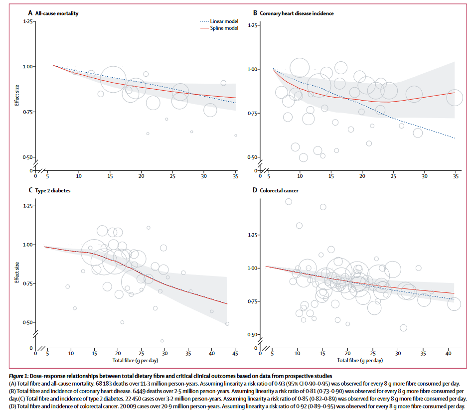
			- 维C达到了200mg/d的PI-NCD
			  :LOGBOOK:
			  CLOCK: [2024-02-07 Wed 11:50:09]
			  :END:
				- “不这么吃的建议至少吃两粒OTC”——
			- 叶黄素应该达到了10mg/d的PI-NCD
				- 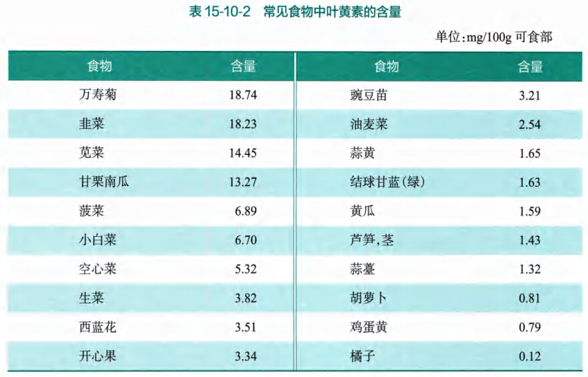
					- 贝贝南瓜属于甘栗南瓜，甘栗南瓜的叶黄素含量为13.27mg/100g，那么50g贝贝南瓜的叶黄素含量可能有6.635mg
					- 深绿叶菜含量可能普遍在5mg/d以上，那么50g荠菜、红薯叶可能有2.5mg以上
					- 再算上杂七杂八，大概达到了10mg/d的PI-NCD
			- 维A达到了雷达操纵人员的供给量
				- ((65c0de9c-22e5-4e2f-b9f9-4e46bbee8ee1))
			- 甜菜碱
			  collapsed:: true
				- 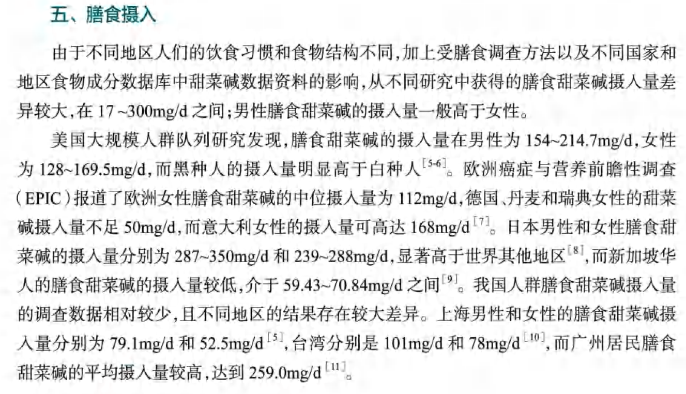
				- 达到1.5g/d的SPL有点难，我们退而求其次，先达到日本水平
				- 烤红薯400g含140mg甜菜碱
			- 需要注意的
			  collapsed:: true
				- 碘
				  collapsed:: true
					- 共241.2\mu\g碘，其中，番茄酱20g含105.4\mu\g碘，紫菜（干）2g含86.5\mu\g碘
					- 如果每日食用偏多（当然也是“相对的”）的5g加碘食盐，那么还会再摄入70~195\mu\g（据GB 26878—2011），共约311.2~436.2\mu\g——如果你担心与之相关的潜在的健康风险，那么可以将加碘盐换为无添加盐，或者也可以不用紫菜和/或番茄酱
					- 孕妇、乳母的RNI与UL之间的区间更窄，为230/240~500\mu\g
						- >我国多项流行病学调查结果显示，孕妇尿碘浓度超过250μg/L时。会出现亚临床甲状腺功能减退(TSH升高)15。以往研究数据显示孕妇尿量约为1.8L,根据膳食摄入碘约90%经尿排出，换算膳食碘摄人量约为500μg/d(250x1.8/0.90-500μg/d)。最近，基于我国长期不同水碘暴露的744名孕妇碘营养流病调查结果，在精确测定和综合评估24小时尿碘排泄量和甲状腺功能相关指标的基础上，进一步证实当碘摄人量大于500μg/时，孕妇甲状腺功能紊乱患病率显著增加。综上结果，孕妇的每日碘摄入量不应超过500μg，设立UF为1，得出我国孕妇的碘UL为500μg/d。乳母尚无直接研究数据，暂设定其UL水平与孕妇相同。
							- 该研究显示，膳食碘摄入量100~200\mu\g/d组的孕妇甲状腺功能紊乱患病率最低
			- ### 在“薄荷营养师”中显示的数据未达RNI或AI的营养素
			  :LOGBOOK:
			  CLOCK: [2024-02-07 Wed 11:01:04]--[2024-02-09 Fri 23:10:53] =>  60:09:49
			  CLOCK: [2024-02-09 Fri 23:10:55]--[2024-02-09 Fri 23:12:02] =>  00:01:07
			  :END:
				- [[营养食谱/？]]
				- 牛奶换成特定品种奶酪后的硒等矿物质
				- DOING 氯
				  collapsed:: true
				  :LOGBOOK:
				  CLOCK: [2024-02-16 Fri 12:48:13]
				  :END:
					- >目前尚缺乏充足的研究资料确定氯的EAR值，部分国家基于氯化钠的分子组成，推算出氯的AI值。本次氯AI值的修订也采用该方法，成人氯AI值为2300mg/d。
					- >膳食中的氯绝大部分来源于氯化钠，仅少量来自氯化钾。酱油，盐渍、腌制或烟熏食品，酱咸菜以及咸味食品等都含有丰富的氯化钠，也是氯的食物来源。一般天然食物中氯的含量差异较大。天然水中也含有少量氯，从饮水中获得的氯约为40mg/d。膳食氯摄入不足或过量均不常见。
					- >目前报道的膳食氯摄入不足，与给婴儿喂以含氯低(1~2mmol/L)的配方奶粉有关，导致低氯血症。在婴儿中，低氯血症可导致生长障碍、嗜睡、易怒、厌食、胃肠道症状和虚弱以及低钾代谢性碱中毒和血尿等。
					- 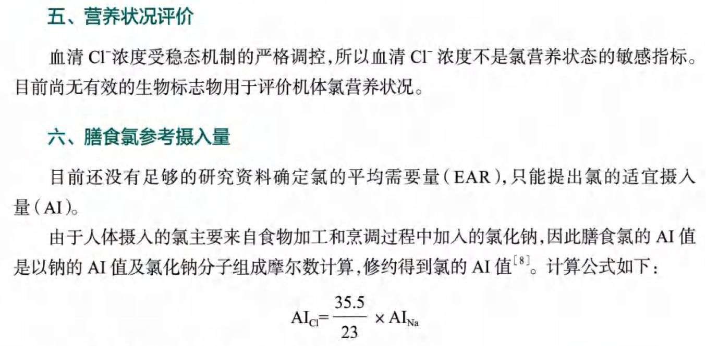
					- 那么问题来了，钠的AI值1500mg/d可能并不主要来自氯化钠，而未添加氯化钠的食物的钠氯比例大多高于氯化钠，这“由于因此”显得有点潦草了——我的建议是，这AI不制定也罢
					- 非要勉为其难地制定的话，好像一般应从实际生活中的“膳食摄入量”入手，需要较大的样本量，但目前似乎至少没有中国的数据，那么先来看看这个食谱
						- 已有590.3mg
						- 酱油等调味料可能只显示了钠，但其钠的来源绝大部分是氯化钠，假设90%的钠源于氯化钠，其余10%的钠不含氯（其实是有发酵生成的谷氨酸钠等其他化合物的），可估算6g酱油约含氯405mg
						- 25g牡蛎约含氯160mg
						- 10g开心果约含氯105mg
						- 1g食盐约含氯600mg，
						- “其余是自由发挥空间”
				- ((65ae0905-914f-4d3d-a1de-f9419083a2ac))
					- 未达AI，也没必要达到，居民膳食摄入普遍不及AI，（通过“天然食物”摄入）效率不高，达到了大概也不够，应该多晒太阳，或者通过强化食品、膳食补充剂摄入等途径补充，详见[[阳光]]
				- 泛酸
					- 食谱中的食物的对应数据大多缺失
					- “烤红薯”生物素数据缺失，“红薯”425g含3.4mg，“蒸红薯”425g含2.6mg，取后者的值的话，约有6.5mg，达到了5.0mg的AI
				- TODO 生物素（40）
					- 食谱中的食物的对应数据大多缺失
					- “烤红薯”生物素数据缺失，“红薯”425g含8.5\mu\g，“蒸红薯”425g含6.4\mu\g，取后者的值的话，约有
					- 与头发稀疏？
				- TODO 胆碱（450/380）
					- 食谱中的食物的对应数据大多缺失
					- >膳食胆碱摄入量包括来源于天然食物以及补充剂的各种胆碱（游离胆碱、PC,PCol、GPC和SPM)的总和，正常膳食可提供约300mg的胆碱。
					- 鸭蛋65g含胆碱171.2mg（USDA）—— ((65c0de9c-6284-4414-8d6e-85a56dfeb647))
				- TODO 氟（食物数据大多缺失）
				- TODO 铬（食物数据大多缺失）
					- >膳食铬的主要来源是谷类、肉类、鱼贝类、坚果类和豆类，我国居民膳食铬的主要来源为谷类和蔬菜类。食物精制过程中铬丢失严重，用不锈钢制品烹调和盛装酸性食品时，铬可以溶出并增加食物含铬量。
	- ## 菜谱
		- 以前我在饮食上更非主流，在大学在家都是自己做了独自吃，图省事一般就是一锅（几盘）搞定，在锅里吃
			- 如果习惯围一桌吃饭，也可以提前装好菜分餐吃，现在已经二十一世纪了，桌面一般够大，容得下
		- TODO 营养食谱对应菜谱
			- 用白板或导图连接食物和菜谱
			- 或删去食物的多余字，菜谱下块引用食物
			- 实物图上标注食材和数量，做法，营养，等
		- （去皮去壳后可）直接吃的
			- 芦柑、香蕉、（加工好的）南瓜子
		- 根据蔬菜是否需要焯水、土豆加热前还是加热后去皮可以分为两类
		- {{embed ((65bf58dd-8ca6-4678-9bb7-0c7f2e5a965e))}}
		- 煎炒
			- DONE [【鸡蛋的各种演绎法：茴香炒鸡蛋的做法步骤图】麦当娜约了麦当雄_下厨房](https://www.xiachufang.com/recipe/100463848/) >[2024-02-26](#agenda://?start=1708946570000&end=1708948370000)
			  id:: 65db02e4-09bd-40b0-96fc-4e46a8a7a0cc
			  SCHEDULED: <2024-02-26 Mon>
		- ### DOING 一锅端
		  id:: 65c22be5-8774-4ff5-9a38-e94eda1ff343
		  :LOGBOOK:
		  CLOCK: [2024-02-27 Tue 19:00:06]
		  CLOCK: [2024-02-29 Thu 21:20:34]
		  CLOCK: [2024-03-01 Fri 22:48:12]
		  :END:
			- 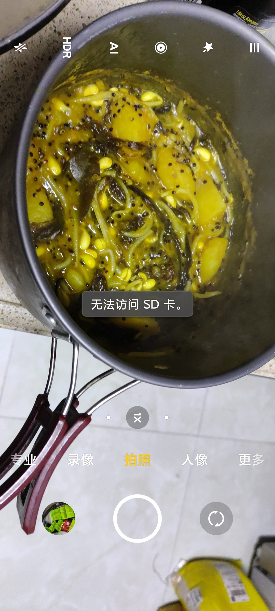
			-
			- 可以先做肉，爆香花椒等香料，然后可以煎肉，接着（有可能换锅）加汤底，可以只用水，可以用其他不太咸的汤，奶酪乃至奶都可以是汤底的一部分，先煮耐煮的，再煮不耐煮的。关火后，锅里还可以放入剥好的水果、烤红薯，浇上酸奶——比“朱元璋的八宝粥”营养多喽！
			- 我想味道肯定能找到办法，至于番茄酱如何与其他味道融合，这个还不太清楚
			- TODO 水250g？重量、深度？
			  id:: 65c22be5-a65d-4e64-9b21-74f361567d68
			- 土豆200g
			- 海鸭蛋一个（可食部约65g）
			- 贝贝南瓜50g（富含叶黄素；可食率约70%？199g）
			  id:: 65c2025e-3825-497e-960c-d3767887f99a
			- 藜麦25g（“比小米还要有营养，还要养人”）
				- 甜菜碱
			- 胡萝卜
			- 番茄酱（富含番茄红素）
			- 洋葱10g
			- TODO “黄蚬子”（“多多买菜买的”）
			  id:: 65c21e29-cc61-43d7-a120-709181052296
				- [花蛤、蛏子、蚬子、蚶子、蛤蜊、海瓜子、贝壳都有什么区别？ - 知乎](https://www.zhihu.com/question/25165185)
				- [花蛤与蚬 | 那些好吃的小贝壳们~ - 知乎](https://zhuanlan.zhihu.com/p/62070227)
		- ### TODO “一切泥/一起泥”
		  id:: 65d36e2e-6220-43c3-8d3f-c63439ad3389
			- “创作背景”：随便想的名称，反正没用“妮可妮可妮”；“一切泥”是想到土豆泥，那么红薯泥，南瓜泥，一切泥，然后想到我之前看着名字有点咋呼但当时没太听懂的《万物死》（“橙汁是吧？”），“一起泥”则与周杰伦的《忍者》有关
				- [《万物死》巴主席与yumbi乐队[弹幕付补档]_哔哩哔哩_bilibili](https://www.bilibili.com/video/BV1hk4y147uX/)
				- [【4K顶级修复】周杰伦 - 忍者MV HiRes无损音质封装 爷青回！_哔哩哔哩_bilibili](https://www.bilibili.com/video/BV1mM411T72k)
			- 基于根茎类的熟泥，
			- [[土豆泥]]，加入其他
				- ((65d4b5ba-2c61-4ee2-8199-f4773223ac22))
				- TODO 煮带皮土豆时蒸其他食材（叶菜烫熟再沥水会损失一部分营养素，而贝贝南瓜、胡萝卜等食材则不易烫熟）
				  id:: 65d6b049-e7ac-477c-a6b2-fadd5242bcf5
		- “今天我来烤烤你”
		  id:: 65e1eac1-ae97-4bb3-8ce9-b425359d6c89
		  collapsed:: true
			- {{embed ((65e1d266-4598-47a3-a476-7492eb6b7597))}}
			- 南瓜子（“可以进烤箱捎一程”）
				- [4种方法来吃南瓜籽](https://zh.wikihow.com/%E5%90%83%E5%8D%97%E7%93%9C%E7%B1%BD)
		- “肉夹馍”
			- 肉糜、蔬菜、黑米、面饼/面包
		- 肉汤（比如煮肉圆的汤）用来下面或做其他的
			-
	- ## 食谱价格
	  collapsed:: true
		- 一般购买的
		- 含明确品牌的
			- 酱油 0.18元
				- ((65bef01c-f5b3-4f31-b6ce-77628f1e12b7))
- # 评价现有食谱质量
  id:: 65c0de9c-c8f9-4501-8917-b01d5023ae8e
	- “热门”食物对比
		- “一般外卖/预制菜、大拇指龙虾、Geist牛肉面、小屋面包、万国零食营养哪家强？”
	- “10/X元餐/一顿”
	  id:: 65db60ec-c107-42e1-a9a4-687da5e5f421
		- “盖浇饭范式是吧？”
		- [小罗一餐不超10元的个人空间-小罗一餐不超10元个人主页-哔哩哔哩视频](https://space.bilibili.com/2144498517)
		  id:: 65db61bb-97ca-4799-bfdb-bc95cd053b3a
		- [周怡日记 • 小红书 / RED](https://www.xiaohongshu.com/user/profile/61626e10000000001f03fedc)
	- 食物数量
	  collapsed:: true
		- 厨房秤
			- 买一个十块钱、精确到g、最大量程5-10kg的厨房秤（建议将电池盖或充电接口贴上胶带防水），就可以开始精细化记录
			- 秤面小，可以用漏盆、果盘、锅盖之类的东西先放上去“去皮”，再放食物即可
			- 称量食物实际重量也可以先去皮，进一步从包装取出食物后再放上包装读数，或是先称出总重，再称包装重量
		- 估计食物数量（“原来如此，有时不方便拿出厨房秤称量，我天天用厨房秤自己做就想不到这一点，虽然我还有点怀疑如此估算的必要性”）
			- 可以用厨房秤、毫克秤大致确定个人的“手抓量”
			- 膳食指南提供了
			- 微信小程序“薄荷营养师”提供了以身份证/银行卡为参照物的对比图示
	- 日均用量/摄入量（食用油、调味料的钠等）
	  collapsed:: true
		- 首次用前（去除包装塑料膜、封口等连容器；袋装调味料可称重）称重（食用油可根据密度估算，可不称），若干天后或用完时再称重，计算日均用量/摄入量；多人共用共餐比例较低的（“你吃你的，我吃我的”），可以分开计算兼顾精准和覆盖
			- DOING 酱油912g，2.7
			  :LOGBOOK:
			  CLOCK: [2024-02-07 Wed 12:23:42]
			  :END:
		- 钠
			- （春节期间的）香肠等“咸货”
			  id:: 65c974d2-d45c-4ba6-9b45-cbd56c9c5f17
				- 不要买或收咸货，不用吃完，倒掉，实在要吃的人，吃不完放冷藏，不要还放餐桌上
				- 直径约3.5cm的煮熟的苏式香肠（在镇江灌的）1cm约9g，苏式香肠的钠含量约为2583mg/100g
					- TODO 一根约cm？
				- [我感觉贴吧不太讨论香肠腊肉一类的东西【生存狂吧】_百度贴吧](https://tieba.baidu.com/p/8895694700)
	- 预包装食材
	  collapsed:: true
		- 能否为了均衡营养，适当增减单种食材数量，像鸡杂、海贝那样搞个多种食材的拼盘？
	- 预包装食品
	  id:: 65af1e71-1eb3-47f5-bab2-c243c93f0b23
	  collapsed:: true
		- 营养成分表、配料表（“网络热门食品鉴定”、食品化学）、执行标准
		  id:: 65af09a6-6b42-41af-b08b-bdee259c4bab
		- 不行的少吃
	- 膳食指南未覆盖中到高活动水平对应参考能量的食谱
	- 班中餐（更广义的“工作餐”，可能更多是午餐，996也含晚餐）
	  id:: 65c0de9c-ac0c-4b38-b732-4f27325bd3be
	  collapsed:: true
		- 雇主提供/“包饭”的
			- 环卫工围坐在人行道地面上吃泡沫盒饭
		- 食堂
		- 不包饭、自己花钱或报销（可能按每天或每月固定金额报销，可能需要本地的发票/电子发票）的
			- 点外卖
			- 到附近看看
				- 校内（零食）超市
				- 沿街餐饮店、便利店（预制菜、“中食”）、烘焙店、超市
					- 外面的份量不够吃不饱，没什么蔬菜乃至薯类，光续米面又有点不太营养
					- TODO 如何找到一家既能开票又相对合适的餐饮店？
			- 自带食物和厨具
				- 车载冰箱/便携保温箱
					- 有没有可能搞个类似海钓保温箱的车载冰箱？
					- TODO 泡沫箱加冰袋，再加个背带？
- ((65b84e29-7334-44d3-88c9-c62691e98b8f))