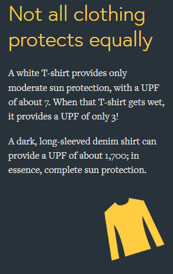
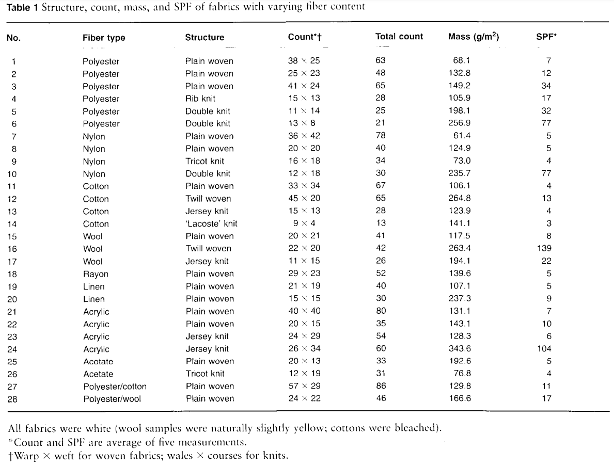
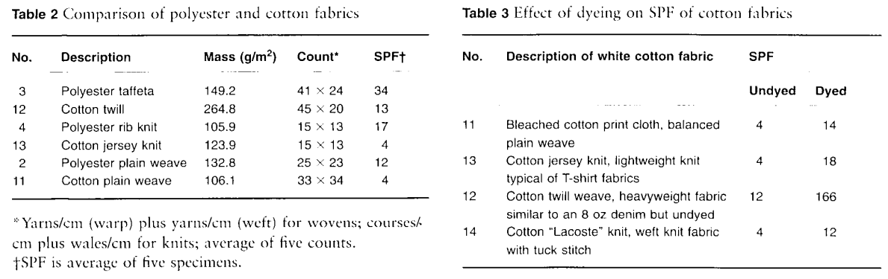
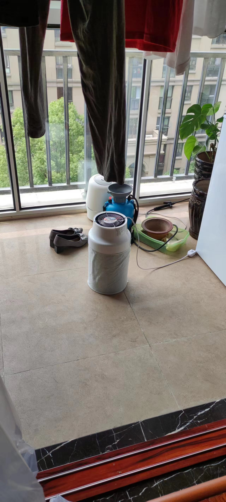

- 添衣
  collapsed:: true
	- ((67052083-77d2-414d-a976-aeb4a4d803e6))
	- 衣物摩擦
		- 手臂刮腋窝、下摆发声？
	- 纺织
	  collapsed:: true
		- 纺纱
		- 织布
			- [织布机-机械原理-织布机是如何工作的？飞梭原理，如何进线，通过DIY迷你电动织布机详解（原理分析剪辑版）_哔哩哔哩_bilibili](https://www.bilibili.com/video/BV1GD4y147qj/)
			- [老祖宗的智慧有多牛？汉代就有“计算机”！来自2000多年前，有硬件系统，还有算法！_哔哩哔哩_bilibili](https://www.bilibili.com/video/BV1VZNXekE6o)
			  id:: 67d03aad-0797-4c0c-b107-bd6cbcdcbb20
		- 缝纫机
		  id:: 67c41a77-968e-4373-b660-10ac327459f7
			- [缝纫机的天才设计_哔哩哔哩_bilibili](https://www.bilibili.com/video/BV1Fg4y1r7wk/)
			  id:: 67d68523-c84a-4406-99d3-9dd0aff1f066
				- ((67d6d64f-7889-4919-9311-03e31dcfd155))
				- “针头怎么尖尖的？”
			- 美国的缝纫机
				- [【全能发明家为何受穷？【小约翰】】 【精准空降到 18:14】](https://www.bilibili.com/video/BV1dR4y1N7Qx/?share_source=copy_web&vd_source=24175964b0df2fcc2c022cae23517fdc&t=1094)
				- [【人物】10个“发明之父”（八）——缝纫机发明者埃利阿斯·哈威_美国](https://www.sohu.com/a/255169994_308511)
				  id:: 67de99e8-c277-421c-8b6d-9b4559486cc7
				- [美国史谈：缝纫机改革了服装业，19世纪美国成品服装业如何形成？](https://baijiahao.baidu.com/s?id=1655060483149216539)
				  id:: 67de9c22-1b3d-407a-b3a5-3d1a06b86440
			- TODO 趴式缝纫机套件
			  id:: 67d6a615-14ec-438a-b40b-8b04c917c817
				- 看 ((67d6a86c-a69f-4cf4-a434-468dc184b62f)) 里缝纫机前的工人低头弓背看的
					- “或者，躺的呢？或者缝纫机倾斜会影响缝纫吗？”
					  id:: 67d6d64f-7889-4919-9311-03e31dcfd155
				- 脚
				- 大概不会比 ((67cea91e-352a-4b13-b002-377705d3de4b)) 复杂多少，或者可能更简单——不会比陆地蛙泳复杂多少，应该是这样
			- 缝纫机扎伤
				- [看着都痛！缝纫机扎穿女工食指......](https://m.thepaper.cn/baijiahao_23039289)
				- [缝纫机工被机针扎伤原因分析及整改措施 - 百度文库](https://wenku.baidu.com/view/1ea74d2c68d97f192279168884868762caaebbb7)
			- ((67e55582-c752-430e-b23e-5511ae881f7f))
			- 刺绣
				- [机绣是用机器绣制的刺绣，以代替手工的一种刺绣品。_哔哩哔哩_bilibili](https://www.bilibili.com/video/BV1hW4y1o7fE/)
			- ---
			- [白玉县 开展缝纫技能培训拓宽就业渠道 藏地阳光新闻网](https://www.zangdiyg.cn/article/detail/id/21434.html)
				- “丁真尼玛”
			- 缝纫机与自行车区别不大，都是很大程度上的机械设备，毕竟通过电磁力穿针还比较难
			  collapsed:: true
				- 缝纫机有脚踏，自行车也有脚踏
				- 缝纫机走的是线，自行车走的是路
				- 缝纫机有不同线迹，自行车有不同档位，每一齿对应不同转动间距
				- 所以缝纫机和自行车都比较贵，就给人的体验相对而言
		- 飞梭
			- 木梭机
				- [发明这机器的简直就是个天才_哔哩哔哩_bilibili](https://www.bilibili.com/video/BV16W421P7XN/)
				- [提花木梭机+电子送经卷取_哔哩哔哩_bilibili](https://www.bilibili.com/video/BV1FC4y177AC/)
		- ((67052083-77d2-414d-a976-aeb4a4d803e6))
		- ---
		- 制衣间坐垫
		  id:: 675d2b81-bd86-4e7c-89f9-4c1a0b6a6d91
	- 衣物颜色
	  id:: 665beb6b-140a-46c2-95ba-744a32ff738c
	  collapsed:: true
		- 夏季宜穿“红与黑”
		  id:: 665c0839-ef78-4553-830c-58bb09da6815
		  collapsed:: true
			- [夏日防晒，宜穿深色棉质衣服_时尚台_央视网(cctv.com)](https://style.cctv.com/2022/06/21/ARTIR8LEBU6e8UX2TWszMsZb220614.shtml)
			  collapsed:: true
				- >深色服装更凉爽。美国哈佛大学曾做过一项实验表明，夏季穿深色服装比穿白色服装更凉爽。因为黑色衣服比白色衣服吸热多，吸收的热量可在衣服内形成对流的动力，将皮肤表面的汗液和部分热量带走，人体自然就会感觉凉爽。**当然，衣服应选宽松一些的，可以使“对流”加强。**
					- [Why do Bedouins wear black robes in hot deserts? | Nature](https://www.nature.com/articles/283373a0)（贝都因人的黑袍比较宽松，黑袍之下的气流有较好的烟囱效应带走热量——但是我们的T恤乃至防晒衣有那么宽松吗？）
						- [Strange but true: science's most improbable research | Science | The Guardian](https://www.theguardian.com/science/2012/aug/19/most-improbable-scientific-research-abrahams)
						  id:: 665bf3fe-0845-479f-a9f1-a01c4503d344
						- [(PDF) WHY DARK CLOTHES CAN PROVIDE BETTER THERMAL COMFORT IN HOT CLIMATE THEN CLEAR CLOTHES](https://www.researchgate.net/publication/264200556_WHY_DARK_CLOTHES_CAN_PROVIDE_BETTER_THERMAL_COMFORT_IN_HOT_CLIMATE_THEN_CLEAR_CLOTHES)
							- >在这项研究中，使用了一个物理模型模拟一个穿着不同颜色外衣的人，他穿着内衣并受到辐射加热，通过实验测定了该服装系统中的传热和传质情况。实验中使用了一种薄的聚酰胺纳米纤维无纺布作为人造皮肤，卤素灯泡作为辐射源。为了实现模拟皮肤所需的对流冷却，纳米纤维织物被持续浸湿。相关传递过程的简单数学模型已经建立，数值模拟正在准备中。实验结果表明，黑色衣服吸收了更多的太阳辐射，包括可见光和红外线，从而导致外层布料温度升高。由于烟囱原理，这种效应导致衣服缝隙中的自由对流速度加快。因此，内衣或皮肤上的水分（汗液）的对流蒸发量也会增加，从而产生所需的冷却效果。与预期相反，结果表明黑色无纺布也能提供强烈的体冷，从而为穿着者提供令人满意的热舒适度。测量结果证实，穿黑衣服的人比穿白衣服的人更聪明，因为只要外层布（或皮肤）和内层布（或皮肤）之间的缝隙足够大，足以支持缝隙中的自由对流，他们的黑衣服可能比白衣服更能冷却身体。
				- >另外，在室内或阴天时穿黑色衣服，此时阳光少，黑色反而会发挥其散热快的本领，快速排走皮肤表面的热量，让人感觉凉快不少。
					- >另外，在室内或是阴天时穿黑色衣服，会发挥它散热快的功能，能快速排走皮肤表面的热量，让人感觉凉快不少。陈老师指出，黑色衣服在没阳光的时候穿是最凉快的。可以在室内穿，或者阴天的时候穿，因为这个时候阳光少，黑色不会发挥吸热快的本性，反倒只发挥它散热快的本领，这样就能快速排走皮肤表面的热量，自然要比其他颜色的衣服感觉凉快不少。
						- ((665c0595-5a47-46f2-92b9-c45f8379e7fb))
						- “这把铁柱大导演既视感了”
							- [铁柱大导演的个人空间-铁柱大导演个人主页-哔哩哔哩视频](https://space.bilibili.com/489618859)
							  id:: 665c0a2b-7587-4ee2-933d-a0179fae8bda
				- >而红色光波较长，可大量吸收日光中的紫外线，如果长期在阳光下，穿红色衣服会更凉快。
					- [夏天什么颜色衣服最防晒？红色衣服防晒效果最好_央广网](https://health.cnr.cn/life/20150729/t20150729_519346077.shtml)（“原来前面那篇基本上是复制这里的”）
					  id:: 665c0595-5a47-46f2-92b9-c45f8379e7fb
						- https://health.cnr.cn/life/20150729/W020150729319472922225.jpg
				- >棉质衣服防紫外线效果更好。衣服的防紫外线作用不仅取决于颜色，还跟衣服的质料有关。**夏天人体出汗量大，化纤布料虽然比较轻薄，但吸水性、透气性差，皮肤很难通过汗液蒸发进行散热**，汗液过多滞留会使皮肤分泌物腐败、发酵，加之合成纤维在生产过程中会混入单体氨、甲醇等化学成分，对皮肤刺激较大，容易诱发过敏和皮炎。而棉、麻、丝等天然纤维则是夏天的首选，丝绸亲肤性好、更加轻薄，穿上通体凉快；棉质衣物吸汗，透气性好；亚麻材质孔隙大，透气性和吸水性好。此外，棉质衣服防晒值为15—40，浅色聚酯纤维衣服防晒值为7—10，浅色针织衣服防晒值为4—9。因此防紫外线，最好穿深色棉质衣服。
					- 目前速干衣的主要原料大多是改性聚酯纤维，性能比棉好很多，“时代变了”
					- >衣服的防紫外线能力不仅取决于色泽，还跟质料相关。**棉质衣服的SPF值（防晒值）为15~40**；浅色聚酯纤维衣服的SPF值为7~10；浅色针织衣服的SPF值为4~9；裸露的臂部肌肤最好用纱质披肩以及套袖保护。所以，如果你想防紫外线，最好穿深色棉质衣服。
						- ((665c0595-5a47-46f2-92b9-c45f8379e7fb))
						- [防晒类化妆品人体功效测试标准对比及法规解读-CTI华测检测官方商城](https://www.ctimall.com/journalismDetails/958)
						- （目前） ((665c1f1e-fba1-4086-8176-e4c4bf93e667)) 的指标为UPF而非SPF
							- 
								- [Sun Protective Clothing - The Skin Cancer Foundation](https://www.skincancer.org/skin-cancer-prevention/sun-protection/sun-protective-clothing)
								- “但是有多少人穿白T恤（导致覆盖范围内）**晒伤**？”
							- [Clothing as protection from ultraviolet radiation: which fabric is most effective?](https://sci-hub.st/10.1046/j.1365-4362.1997.00046.x)（“是SPF，但是先看看”）
								- >Polyester fabrics offered increased protection over cotton. The presence of dyes increased protection considerably.
								- 
								- 
									- “哈哈哈”
								- [🆚What is the difference between "weave" and "knit" ? "weave" vs "knit" ? | HiNative](https://hinative.com/questions/24300932)
								- “综上易知”，深色聚酯纤维织物的SPF值很可能不低于12
								  id:: 665c2518-3fb9-4b51-b556-b812cb7c073d
							- ((65ab10fb-d826-45c5-8ada-2dc9a1704823))
								- ((665c2518-3fb9-4b51-b556-b812cb7c073d))
									- 应该也很不容易晒伤——==普通衣服应该就够防晒伤了==
								- 很可能就安全地接收UVB进而提升维生素D水平而言，UPF15已相当足够（“笑死，没得卖”；而且防晒衣不一定单独贴身穿，配合其他衣物，总UPF会更高）
							- ==较高UPF（比如市面上常见的UPF50+，较低的倒很不常见）的防晒衣的主要市场优势可能在于不涂防晒霜时就防晒黑（UVA）而非晒伤（UVB）==
							  id:: 665c4965-006a-42c8-8db4-c77f94272c4a
								- 轻薄的防晒衣适合“糙活”吗？
							- 如果要综合防晒和热量控制，可能 ((664d77c1-1409-4394-9020-98988eca47de)) 就是很好、可能比 ((665c1f1e-fba1-4086-8176-e4c4bf93e667)) 更好（因为可能防晒衣的速干性能往往不如速干衣）的选择
			- “蚊子也可能更喜欢这样穿的你”
				- {{embed ((665d5245-2c5a-49de-9d1e-933b043d1dc6))}}
		- 冬季室内穿深色也更保暖
		  collapsed:: true
			- [Effects of the clothing colors on heat transfer and thermal sensation under indoor solar radiation in winter - ScienceDirect](https://www.sciencedirect.com/science/article/pii/S2214157X23012054)
		- [Clothes make the leader! How leaders can use attire to impact followers’ perceptions of charisma and approval - ScienceDirect](https://www.sciencedirect.com/science/article/pii/S0148296320307797)
		  id:: 65f78b91-b64c-4be3-adef-b6e78f9c33fe
		  collapsed:: true
	- ((677ce53e-584e-4132-b2d1-8c74b885b130))
	- 夏装
	  id:: 668ce772-dad0-43b5-9eec-6b84d4c69a7b
	  collapsed:: true
		- 速干衣
		  id:: 664d77c1-1409-4394-9020-98988eca47de
		- 凉感
		  collapsed:: true
			- [夏季服饰面料大排雷，如何买到一件凉快的衣服？【三亿】_哔哩哔哩_bilibili](https://www.bilibili.com/video/BV1sS421d7R7)
			- {{embed ((6669aea4-0c0f-4cd8-b7e2-54ed7bb98484))}}
		- 胸罩
		  id:: 6669903e-b75f-4006-b24e-9cb3d9de1020
		  collapsed:: true
			- 减少依赖
				- [长期不穿内衣，会发生什么？|丁香医生](https://dxy.com/article/102687)
				- [[赤足跑]]减少垂直跳动进而减少乳房晃动？
				- [[筋膜]]训练限位？
			- [冰丝没那么凉快！夏天真正舒服的内衣，其实长这样......|丁香医生](https://dxy.com/article/176187)
		- ((67d6aa05-2d6f-4f1d-9ae9-df8d142f12ac))
		  collapsed:: true
		- 薄底人字拖
		  id:: 6678b409-5501-404a-83d7-0095f2cf2afd
		  collapsed:: true
			- [[赤足跑] 自製人字拖鞋 | Fitz 運動平台](https://fitz.hk/sports/running/%E8%B5%A4%E8%B6%B3%E8%B7%91-%E8%87%AA%E8%A3%BD%E4%BA%BA%E5%AD%97%E6%8B%96%E9%9E%8B/)
			  id:: 666d59f7-6420-46a4-a306-66ef63eee821
			- [台灣好多人改著人字拖跑步 | Fitz 運動平台](https://fitz.hk/sports/running/%E5%8F%B0%E7%81%A3%E5%A5%BD%E5%A4%9A%E4%BA%BA%E6%94%B9%E8%91%97%E4%BA%BA%E5%AD%97%E6%8B%96%E8%B7%91%E6%AD%A5/)
		- ((665c1f1e-fba1-4086-8176-e4c4bf93e667))
		- ---
		- 比基尼
			- [比基尼与核爆简史](https://mp.weixin.qq.com/s/N_FrvdyehbkrLWrDbsj6nA)
			- ((6289ba01-f095-43f7-89c0-c855cf13f13e))
		- 人体彩绘
			- [【BuzzFeed】穿一天人体彩绘出门是什么体验 @柚子木字幕组_哔哩哔哩_bilibili](https://www.bilibili.com/video/BV1qs41167Kb)
			- “给赤膊小男娘画对乳房”
	- 冬
	  id:: 66db8aba-5a1f-48ce-91c7-76ea90c0bba2
	  collapsed:: true
		- ((65ab10fb-9acf-48a8-9562-b322fc793432))
		- ((65ae0909-05ee-4c98-8114-0dec2408bd95))
		- TODO 轻薄低耗电热手套
		  id:: 675acdb2-5549-4478-8088-a5b8423feebf
			- ((65ab10fb-9acf-48a8-9562-b322fc793432))
	- 网格衫
	- [[武术]]练功服/表演服为什么（至今还有点）流行用那种发亮的化纤？
	- 户外
	  collapsed:: true
		- ((665985ce-8b50-4a04-a91b-a167f62b7dd6))
		- [Patagonia和始祖鸟，是金融街的格子衬衫](https://mp.weixin.qq.com/s/-G45AR6dZzCPB8QZMA4Z1w)
	- 职业服装
	  collapsed:: true
		- [护士服的变迁 | 科学人 | 果壳网 科技有意思](https://web.archive.org/web/20171006082552/https://www.guokr.com/article/181583/)
	- 服装文化
	  collapsed:: true
		- （现代摆拍——“新古典是吧？”）民族服饰中的现代成分（金属）和火器
	- ---
	- 帽
		- 防风帽绳
			- [要不是被拍到了，你都不敢相信这是真的！_哔哩哔哩_bilibili](https://www.bilibili.com/video/BV14r4y1F7gN)
			- 交警帽能挂载这样的配件吗？
	- TODO 手抓火锅
	  id:: 6778b193-18e6-4c93-98ec-24390e8e4a4e
	  collapsed:: true
		- “经典中式印度笑话”
		- “妙脆角”、“金刚狼”——“还是手抓对吧？”——“手上绑筷子”（“抓筷子，是什么意思？”）
		- ((65db1962-3ee4-4e8d-b56e-8c02a329c2f1))
	- 吊带
		- [如何评价最近军训吊带姐视频？_哔哩哔哩_bilibili](https://www.bilibili.com/video/BV1Cy4y1F7kZ/)
	- 乳贴
	  collapsed:: true
		- 贴在衣服内侧（而非身上）的
			- 自带乳贴的衣服
		- ((67402b19-5931-4b11-8100-379f37357b1d))
	- 胸垫
	  id:: 675d2785-26d3-4034-bcd6-74f427a82194
	- 内裤
		- >你看到的我~~ 你看到的我~~ 是哪一种颜色~~ 悲伤或快乐~~ —— ((660e3189-5a74-4313-b097-464cc93adf92))
		- [中国服饰极简史：古人穿内裤吗？_腾讯新闻](https://new.qq.com/rain/a/20220407A090UA00)
		- 减少依赖
			- [[赤足跑]]减少垂直跳动进而减少阴囊晃动？
		- 凉爽内裤
		  id:: 67d6aa05-2d6f-4f1d-9ae9-df8d142f12ac
			- 站姿
				- 粗筒（宽松）低裆裤
			- ((65bcbf46-0a4d-44e3-9f6b-afcac5cb834d))
			  id:: 6669ae95-b96c-42b4-b447-b676f90e5419
			  collapsed:: true
				- 痛点：大腿（尤其是较粗的大腿）和阴囊容易接触，影响散热，造成热量堆积，尤其是更“憋屈”的 ((67402ab6-67e8-4c2b-90b8-911e1d25c315)) ，男性裆部可能闷热黏湿
				- 在腹股沟隔开大腿和阴囊
					- 贴身内裤
						- 里料：薄（网孔）（凉感）冰丝、冰丝（面料莫代尔）、莫代尔（面料冰丝）
						  id:: 6669aea4-0c0f-4cd8-b7e2-54ed7bb98484
							- [凉感纺织品标准有哪些？接触凉感系数要求是多少？_纤维](https://www.sohu.com/a/458596673_182917)
						- “泳裤”
							- ((66335c3c-96f2-4ea9-8030-dde9654ec5a2))
							- “哈哈，小伙子又练跑游两项啦？”
							- [【罕见影像】丘吉尔在泳池滑水时弄掉了他的泳裤(1934)_哔哩哔哩_bilibili](https://www.bilibili.com/video/BV19v411p75n)
							- [日本恶搞综艺，遇水就溶解的游泳裤_哔哩哔哩_bilibili](https://www.bilibili.com/video/BV19a411A7At)
						- 阴茎朝向
						  id:: 66ade374-d2aa-4557-b98b-a77736a17d98
							- 可能从最大化阴囊散热的角度看，应该朝上
							- [【官方MV】LMFAO - Sexy And I Know It_哔哩哔哩_bilibili](https://www.bilibili.com/video/BV1tZ4y1N7aR)
							  id:: 66766a35-7197-4c5c-b1a0-56572cc64851
							- [男士，骑行裤应该怎么穿？大象鼻子应该如何摆放？_哔哩哔哩_bilibili](https://www.bilibili.com/video/BV17s421K7Nr)
					- ((6669aee4-6617-443c-877e-d43d55d4b6da))
				- ((6658475b-8d23-41eb-992a-df196913c08f))
		- 一次性内裤
			- [#一次性内裤爆雷！ #315曝光不杀菌不消毒的一次性内裤 #一次性内裤徒手制作不灭菌 #315晚会_哔哩哔哩_bilibili](https://www.bilibili.com/video/BV1oQQmYPED8/)
			  id:: 67d6a86c-a69f-4cf4-a434-468dc184b62f
		- ---
		- 长下摆，小平角/三角
	- ((66495e64-191b-4dc9-bcb9-ffd54fd1d112))
	  collapsed:: true
	- ---
	- [[套装]]
	  id:: 67946e3b-a746-4bd0-b726-609b67492fd2
- 洗衣
  id:: 678b04b8-0025-405e-a044-28f96cb7f00c
  collapsed:: true
	- 洗涤剂
	  id:: 66ade371-1f23-4cec-9baa-860412080918
	  collapsed:: true
		- TODO 对皮肤安全吗？如果能造成皮肤疾病，是否在更频繁换洗衣服时会更频繁造成皮肤疾病，比如在夏季？（“我妈都觉得我说的道理”）
		- 气味遮盖与面对面社交有关的体味进而影响社交？
	- 洗衣机
	  id:: 6613c61c-eb37-40d2-a13c-b3fa3a869442
	  collapsed:: true
		- 洗衣袋
		  id:: 67591087-170c-4605-b9a0-758633351fe4
		  collapsed:: true
			- 避免缠绕，袜子等小件衣物洗后直接开袋倒在晾晒网上
			  collapsed:: true
			- [用烘干机烘干衣服需要套洗衣袋吗？ - 知乎](https://www.zhihu.com/question/306862320)
			- [洗衣袋避坑指南_什么值得买](https://post.smzdm.com/talk/p/axzr6g8d/)（选择塑料的拉链拉环而非金属的）
			- TODO 较少 ((6645c052-7bce-4b03-9f0d-6354d964b588)) 等问题的洗衣袋
			  id:: 677a5664-fc68-4f02-9789-b9ef42e665c2
		- 滚筒洗衣机、洗衣袋、烘衣机快速装填
		  id:: 67774277-9cfb-4b73-a877-01f27ed113c9
		  collapsed:: true
			- 不知道大家家里的衣服会不会攒几天攒一篮子再洗，我直接把大篮子对着滚筒洗衣机开口倒是有点对不上的，手抓塞进去感觉又有点浪费时间（可能“就多几秒”，但我是讲究赶时间的人——还有，“干净”的手再抓一遍“脏”衣服，这不好吧？）——至少相比波轮洗衣机那么大可以直接倒进去的开口，滚筒洗衣机应该有对得上的装填设计吧？
			- ---
			- 脏衣篮开放式网兜
				- 两手捏住四角像载物吊床一样抬起，然后往里塞）
				- 开口带限位（在洗衣机桶口）的软袋/兜
			- 带“铲”（可以滑）软底（可以推，或者弄个“大针筒”）脏衣篮
			- ((67591087-170c-4605-b9a0-758633351fe4))
			- 滑轨
			- 带轮，可以拉到洗衣机前，再拉一下进去（？）
		- 滚筒洗衣机门边泡沫残留
		  collapsed:: true
			- 洗涤剂泡太多？还是洗涤剂加得太多？还是洗衣机不好？
			- 垫
		- ((6790b09a-82da-47ec-bb7e-00e18eebf56b))
		- 洗衣机臭氧
			- 可能本身就有点多余，清水洗足够消毒
			- 洗衣机柜影响安装
		- ---
		- [3月5日，山东威海。高校推出“一人一桶”洗衣机，学生可“随身携带”洗衣机的内胆桶。网友：干净又卫生！_哔哩哔哩_bilibili](https://www.bilibili.com/video/BV1BX4y1U7sz)
	- 干洗
		- [干洗店洗衣真的“干净”吗？浦东消保委体察20家洗衣店，近五成有四氯乙烯残留 - 今日头条](https://www.toutiao.com/article/6728330257666933259/)
		  id:: 67df62bf-84a9-4c0c-a6fb-e3c1b5bac147
- 干衣
  collapsed:: true
	- 晾衣
	  id:: 676cce0b-de76-4f96-97cb-eff29c64aaa5
	  collapsed:: true
		- （手动）晾衣法
		  collapsed:: true
			- 没钱买或身边人不同意买烘衣机可能令人沮丧，但既然不行，那么也可以在晾衣中得到一点运动乃至“道进乎技”
			- 如果要室外晾晒，应当综合天气预报、空气质量预报、经验（可能包括楼上下邻居的晾晒习惯，别滴水影响别人晾晒）等判断洗衣时机，提升晾晒效率、质量，减少晾晒过程中生成或附着的霉菌、空气污染物等
			  id:: 6709d0e8-7484-4f6a-b6f5-777a5de330f3
				- 如果床单等大件已经洗好，但室外空气不佳，可以用夹子、衣架、杆子等晾在室内
					- ((6664f6cb-d62c-4322-9e5e-933bca821acb))
			- 衣服多用大深盆，放在（滚筒）洗衣机开口下，掏衣服捞进去，滚筒转一圈看看还有没有游离的袜子啥的，把盆放在阳台中间小桌上
			- 我身高够，比较习惯把衣架先放在升降晾衣架上，然后把衣服套上去
			- 在不难取出（或带出袜子等）的情况下，顺序一般是衣架>夹子（胸罩、内裤等）>晾晒网（袜子、真丝、羊毛等）
			- 衣服正过来（这里主要还是迁就照顾一下无意识家人的懒惰，替他们“正衣冠”，而不是讲究什么洗衣晾衣法）
			- 成就
				- 寸步不移：不移动脚晾10件以上衣物
				  id:: 67591087-fe2f-4b1a-a956-cac8cc7605cc
				- ((66ea29bd-4ae8-4d4a-a6c9-80ec450f86dc))
		- ---
		- 吊顶之外的高于地面的晾晒结构的固定点
		  id:: 677b4531-dda3-41c5-a68d-96ad73f9d156
		  collapsed:: true
			- TODO 吊顶夹
			- 原晾晒架
			- 墙上的升降钢丝转角块
			- 墙角转角（？）
			- 洗衣机
				- 上部后部配重
				- 底部
			- 洗衣机柜
				- 夹
				- 下表面可能有凹槽
			- 洗衣机上的烘衣机
			- 纱窗网孔
			  id:: 67bf134a-a0ca-404d-8b74-e210a5cace58
			- 窗护框
				- ((67cd5726-f8a8-4931-a212-769651106a27))
				- “上面也有”
			- 较重的花盆
			- （落地窗）护栏
				- 开窗可用，或者只开一点点
			- 推拉门
				- 可能在非阳台侧的门把手
				- 锁定插槽
				- 门侧面可能有的孔
				- 可能有的钉子
			- 窗帘相关
			  id:: 67cd5726-f8a8-4931-a212-769651106a27
				- 窗帘杆
				- 窗帘挂钩
				- 窗帘挂钩间的窗帘上边
				- 窗帘杆后挡墙板
					- ((67960091-8e1f-4e71-ac07-6741f2d240db))
			- 树干
				- 室外晾晒树干缓压带（有些户外吊床有这样的设计）
		- ---
		- 晾衣夹
		  collapsed:: true
			- 晾衣夹组
				- 其中品质较差的晾衣夹会裂，可以用不锈钢的晾衣夹
		- 晾晒架（竖直的）
		  id:: 679add8c-3bfd-4555-a20e-d1f1dfb821dd
			- 衣架
			  id:: 678b04b8-568e-4d03-952a-065991a379dc
				- 塑料微绒布衣架
				  id:: 670b0dee-4218-4f2a-b957-17130fc24ed3
					- ((6645c052-7bce-4b03-9f0d-6354d964b588))？
			- “一个衣架配一个小洞，这是什么意思？”
				- 现有的升降晾晒架通常有间距相同的衣架挂孔，但是有点不够大，还要先转一下衣架让衣架挂钩尖大致对着挂孔，我哪有那么多时间精力浪费在这些重复的精密操作上？对一个孔多花一秒，对十个孔就是十秒，一年晾100次，就是1000秒，全国......（请跳转 ((67402aa3-b889-4af0-acd2-ccd4d88b504e)) ）
				- 还没不锈钢夹孔大，不如从不锈钢夹的夹柄孔穿绳
				  id:: 678f504c-61dd-4da1-bcff-fa3492cbaeaa
			- 晾晒架和晾晒挂孔的形状和方向也会限制衣架、衣物在水平面的旋转角度
				- 衣架长轴面更对着、更接近晾衣者，进而在操作中，虽是小孔，但被往往并非虎背熊腰的晾衣者顶到时该掉还是掉
					- 当然可以把衣架挂钩搞成弹簧快扣式的，但操作时碰到就是很烦（“烦内！”）很低效
				- 需要对部分衣物垂直照射阳光时，可能不够垂直
					- 如果用晾衣夹等补救，则操作额外繁琐
			- ---
			- ((677b4531-bdc3-4b42-861e-898a44245e6c))
			- ((677c86f9-2797-4281-a300-70cbb370266f))
			- ((677c90eb-d0da-4e69-825f-b28248dcb2c5))
			- ((677c90eb-5cd4-4457-9371-fe2ecfad7c4a))
			- 螺旋晾晒架（？）
			- ---
			- 室外晾晒架
			  id:: 679add8c-b0b5-497d-b99c-cf0dd099f080
				- 球场晾衣
					- 出汗湿透了脱下来晾一下
				- ((67402b07-ee2b-4965-a575-99dec024f9fe))
					- 衣物掉落
						- 晒鞋掉落
		- 晾晒网（水平的）
		  id:: 67591087-b9b2-4997-89f0-763639b794ca
		  collapsed:: true
			- （常见的）可多层悬吊圆形晾晒网
			  collapsed:: true
				- 只剩袜子了可以拿盆往里一倒
				- 收衣物时可以拥到一边带走，或者把整个晾晒网取下倒出衣物
				- 网上卖得多的竖直带子可能比较偷工减料容易断（可能尤其是那些参考图放的东西轻的），我是等它们断了差不多后用捆扎绳绑的，如果礼盒、蛋糕盒带子够长也可以（后来我妈又换了下）
				- 材质？
					- 更耐用的
			- “凑合用下”
				- 大开口容器（如脏衣篮、洗衣盆、大花盆、阳台水槽）上架 ((678b04b8-568e-4d03-952a-065991a379dc)) 、冰柜置物筐，可以晾袜子、小内裤等，可用 ((679cc9b6-b785-4ead-ba8f-b917b0dbfbc8)) 等固定
		- ((675ada4f-4884-46e9-830d-0fff0adee88d))
		- 衣物湿度管理
		  collapsed:: true
			- 可用[[空净]]吹风加速衣物水分蒸发（“上升气流，启动！”）
			  id:: 6664f6cb-d62c-4322-9e5e-933bca821acb
			  collapsed:: true
				- 
			- 没完全干的衣服先不放入衣柜
	- 烘衣机
	  id:: 65e3ec4c-c589-46b3-ab26-07a9aec32547
	  collapsed:: true
		- {{embed ((65e3ea59-d273-4552-9719-55a2bb5ed2cd))}}
		- 腾出的晾衣架用于吊挂芳香植物等
- 穿衣
  collapsed:: true
	- ((6778b0ed-e962-407b-9298-61e0cae7006a))