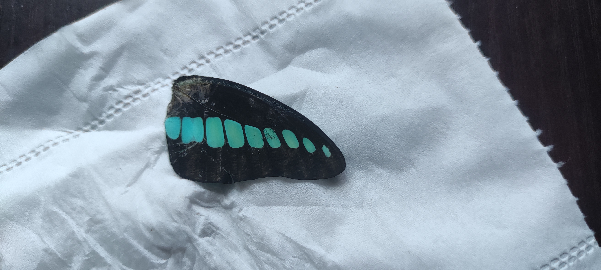

- 地点、时间、鸟种、记录（观察、疑问、新动态的时间等）
	- 性别（雄雌）年龄（亚成）羽色（繁殖羽）
	- 看过的用“背景颜色”/“（高亮）标注”等方式做好记录，见过的鸟在每个区都这么标记，因为这样也是通过重复回忆来强化记忆
	- 待观察（已学习，可以专门新建个收藏夹）
	- 某个区鸟种和记录次数明显比同市其他区域少的话，除了湿地等资源在不同区的不均匀分布，主要就是观鸟者少，所以要参考同市比较多（不一定要最多，新手悠着点——“前面的区域以后再来探索吧！”）的区的观鸟记录看
	- 视频或图鉴必看其一
	- 相邻地点的同种鸟的记录可以复制或移动到一个地点
- 观鸟记录的地区差异
	- 镇江
	  id:: 670d40f0-2b17-4f33-80cf-96a113776ae1
		- 我在镇江的家在京口区比较靠近润州区的地方（“坏了，还带栋号和小区内方位，还可以用排除法”），更具体点比较靠金山湖、焦山、京江路绿道和焦北滩长江湿地，而京口区与润州区的划界按逆时针看是基于焦山（京口区）、金山湖（大致对半分）、古运河（边界，具体怎么管？）和南山东北段的京沪铁路（润州区）的，京口区的诸如比长江窄得多、被市政道路和商业区包围的古运河湿地的小而散的生态资源（倒是在河面上方第一次确认了须浮鸥）是不比焦北滩长江湿地加上南山、“依山傍水”的润州区的
		  collapsed:: true
			- [【行政区划第二期】谈谈镇江各市辖区的区划问题 ——警惕地图软件的错误行政区划！ - 知乎](https://zhuanlan.zhihu.com/p/619481712)（“谢谢你，蒙鼓人！”）
			  id:: 670d40f0-38fa-4c28-baa8-d69d8980ce75
			  collapsed:: true
				- [政区地图](https://jiangsu.tianditu.gov.cn/staticServer/site/atlas/index.html)
		- 此外，京口区虽然大，但它是由市区部分和更东边的新区（主要是大港，主要是农业区和工业区）组成，润州区的市区部分比例则大得多，对城市先发展起来的地区人民的经济水平往往更高，有闲暇有兴趣的观鸟者可能更多
		- 平均而言，润州区生态资源和观鸟群体都比较占优势
		- 更西边的句容市则是公认的南京后花园，一方面本地经济水平较高，另一方面面积大（未破坏的生态较多）、观鸟者多，数据上最相似的也是西边接壤最多的南京江宁区
	- 沿海
	  collapsed:: true
		- 连云港、盐城、南通这三个沿海城市鸟种数较多，可能与海鸟与鸟类迁徙有关，其中盐城最多，可能是因为面积大加上沿海滩涂面积大
- 数据异常
	- 句容市记录次数前十五都是鹰和隼，也许是专门找猛禽的猛禽爱好者，
	- 记录着玩的（“没钱吃糖的小孩捡糖纸收集起来”）
	  id:: 66dba0be-38cf-435b-93e5-f74f2d46155b
- ---
- b站
	- 喜鹊
		- [干饭小喜鹊_哔哩哔哩_bilibili](https://www.bilibili.com/video/BV1dx4y1r75D)
		  id:: 65f84ab9-6c9d-41c4-87b8-b74278bed7d3
			- 喜鹊羽毛白斑连起来像只鹅
			  id:: 65f84ab9-54e6-4b97-8b1b-e17c0a41287a
		- [Oi！拍到喜鹊了！Oi！拍到喜鹊了！Oi！拍到喜鹊了！Oi！拍到喜鹊了！Oi！拍到喜鹊了！Oi！拍到喜鹊了！Oi！拍到喜鹊了！Oi！拍到喜鹊了！_哔哩哔哩_bilibili](https://www.bilibili.com/video/BV1EdZ3Y7EsS/)
- 京口区
	- 小区
	  collapsed:: true
		- 小区地面（我在地面，鸟不一定）
		  collapsed:: true
			- 灰喜鹊
				- 晨练，靠草坪和石柱的步道中间的一棵大树上聒噪，每有一只灰喜鹊从别处飞入便又是一阵更响的聒噪 [[20240805]]
			- 白头鹎
				- 幼鸟，物业门口
				- 晨练绕到石柱另一面靠近（30~40cm内）攀在柱角旁竖枝上的白头鹎，（“wu~”，同时鸟略回头看了眼）飞走 [[20240805]]
			- 鹊鸲
				- 雌鸟
			- 金腰燕
				- 幼鸟，140栋
			- 乌鸫
				- 140栋
				- 飞着冲向树上喜鹊（旁边外墙上还有一只），喜鹊闪开 [[20250521]]
			- 黑脸噪鹛
				- 在（148栋东偏南）灰喜鹊群旁边，四期楼栋外围与游泳池之间的栅栏及两侧高于栅栏的蜡叶树上树下，噪声比也许是灰喜鹊的警报声小得多（可能没到时间），挺机警，朝我这看了一眼就跳进小树林 [[20230806]]
				  id:: 64cf5d11-392b-41b7-9dc7-d63af119752f
				- 大草地北边小梯台树上 [[20250114]]
			- [[20230811]]（？）
			- 山斑鸠
				- 大草地北边树上 [[20250114]]
			- 戴胜（我妈在上半年在草地上拍到）
			- 虫
				- 蟋蟀
					- 白天暗的灌木丛等到处都在叫 [[20230831]]
				- 青凤蝶
					- 风吹下来一片不太新的右前翅 [[20240724]]
						- 
		- 电梯
		  collapsed:: true
			- 瓜绢螟（可能是某亚种，三角大白斑形状不同，尾部发香器看着不那么大） [[20230905]]
		- 客厅/窗内
		  collapsed:: true
			- 异色瓢虫（黑底，四个黄斑） [[20230905]]
			- ((68eb4696-d88b-4fc0-a0e1-bd00758f4160))
			  id:: 68340dd1-4a6b-4fe6-8601-8d0ba2e8b881
				- 窗边墙纸上 [[20250526]]
				- ((69019517-93c0-4a71-8391-ae7817e374bd))
		- 阳台
		  collapsed:: true
			- 蜜蜂
				- 边晒太阳边吃午饭时蜜蜂飞进来，头上也嗡了两阵子，最近的一次飞到鼻孔边上停了不到一秒
				  id:: 660e2e26-5959-48a9-b44a-fd8d7ccdc09e
		- 小区小高层窗外
		  collapsed:: true
			- 割草
			  collapsed:: true
				- 开始 [[20230904]]
			- 灰喜鹊
			  collapsed:: true
				- “停在外面的垃圾桶、电瓶车、自行车，我都跳跳”——所以垃圾桶内面可能有白色鸟屎
				- 雨后较多灰头亚成鸟在楼下草坪跳跳啄食 [[20230806]]
				- ((64cf5d11-392b-41b7-9dc7-d63af119752f))
				- 发现大概是灰喜鹊拉了一点在电瓶车踏板上，可能因为停得比较靠近它们较常活动的草坪和树 [[20230809]]
				  id:: 64d343d6-afdc-44f3-adb5-831b2d368e2c
					- ((64cc4b22-1a90-4d03-a043-e594f9aab7cd))
				- 今天尤其是下午雨后天晴后叫得挺欢腾 [[20230817]]
				- 草地聚集，啄一亮黄色物体 [[20230823]]
				- 10：00左右和之前就叫得挺欢腾 [[20230825]]
				- 雨后14：30十只或更多聚集 [[20230830]]
					- 树台上也许是一小摊棕色的喂小区猫的猫粮（没主题，也许是灰喜鹊聚集后放的，所以难说那位邻居是想喂谁），灰喜鹊群（亚成尤其会向吃得更自然的成鸟叫唤乞食，可能不太吃得惯，或者就是看成鸟吃得香的就是好东西）和雌（叼起一片飞走落地吃掉）、雄鹊鸲（黑，在雌鸟之后过来）偷吃贡品了，一对珠颈斑鸠从树台下的附近地面路过，没看见吃
					  id:: 64eee5eb-4def-4197-8677-817221c9679a
				- 灰喜鹊似乎会压制和干扰邻近（应该是）其他鸟的叫声 [[20230902]]
				  id:: 64f2d3fd-29e6-4255-9c4d-cc9e39386623
				- ((64f41180-f70f-40e3-889d-1b55ddced9bb))
				- 三只，明显更爱之前喜鹊没啄完的火腿肠，而不是昨天下午放在旁边的、可能只被珠颈斑鸠吃过些的玉米、豌豆、红高粱；剩下一些被一只叼起飞到树上，其余两三只尾随 [[20240215]]
				- 靠外墙旋转较慢垂直降落 [[20240610]]
				- 灰喜鹊也会像麻雀一样垂直攀墙，在厨房窗边对看了几秒 [[20241110]]
				- 听到很近，一动身大概从落地窗外墙边飞走（“显示器垫高挡头真好啊，桌下无遮挡真不好啊！”） [[20250521]]
				  collapsed:: true
				- 在厨房窗口看到在外墙边叫了几声 [[20250522]]
				- 可能一两只两次以上向上掠过窗外花台到达楼上外墙，掠过时也许没有特别在意、害怕“窗内现象” [[20250623]]
			- 白头鹎
			  collapsed:: true
				- （在南边花台、阳台晾衣杆和空调外机上一层层地跳，偶尔来落地窗外边小平台歇脚处理叼过来的虫子，有一次目击一对中的一只落到水桶上喝了口雨水，我准备录像时飞了；对人的静态视力和麻雀差不多差）
				- 经常叫得像定点火力压制
				- 两爪攀附在带细孔的粗糙垂直外墙 [[20230803]]
					- [动物界的“攀岩大师”，爬悬崖绝壁如履平地，它们为何爬那么高？ - 知乎](https://zhuanlan.zhihu.com/p/623036428)
					  id:: 64cb7289-10c7-407a-bb95-28230fe083eb
				- 在共享单车车座上喳喳喳 [[20230810]]
				- 带虫飞跃花台 [[20230811]]
				- 雨后若干亚成鸟和一只左右亲鸟在树上，亲鸟似乎啄了什么蕾；之后有像是大杜鹃（四声杜鹃？）的 ((64e447a9-7425-4d92-b04c-5b9f5eae326f)) 落到旁边树枝上停留，亲鸟更主动地与其喳喳对峙了一阵 [[20230822]]
				- 白头鹎飞上对面楼中央空调外机架，像是要喝空调冷凝水 [[20240825]]
				- 前几天两只来过几次窗外花台，啄花、看了好几会儿 [[20250623]]
			- 珠颈斑鸠
			  collapsed:: true
				- ((638206d2-7310-4e7f-9331-ddf7eca3a422))
				- 亚成鸟
					- ((64ce1c57-2aea-48f7-b653-8d722fe4a2f1))
					- ((64e42b32-427a-425b-aca0-a60eadf1a980))
					- ((64e85747-5523-4930-92f8-a747257304be))
				- （常来的是一对，大概是雄鸟来得比较多，取食时会呼叫雌鸟，下午和傍晚会一起来）
				- 窗外投喂花台，可距离不到半米观察——“我往窗边电脑前一坐开始看鸟类视频，您猜怎么着？虚实结合！”对环境变化比较戒备，容易与空气和新食物或容器等斗智斗勇，望远镜里一看它对同伴“硬拉”就知道会发出什么声音
				- 有次起床发现可能因为客厅和阳台窗户至少一处没关，竟然进来了一只，被挡在旁边开着的玻璃窗前扑扇着出不去，离谱
				- 在别栋后院水槽上喝水
				- 有时直接卧在外墙腰线表面上
				- 有次两只落到落地窗外墙互相用喙理毛
				- 也许紧张时还会跳过去把同伴挤开——“置换反应”
				- 除生谷物、生杂豆外也吃藜麦粥、被大雨打散后的汉堡面包胚
				- 有次从楼上飞下来还给我扇了风
				- 平均而言没有同等常见的灰喜鹊灵动，比较懒钝沉闷
				- 傍晚吃饭会比较不怕人
				- 靠近了还可以朝它吹气——老变态了
				- 两只一对的经常一起来，是因为还没孵蛋吗？
					- 孵过了，也许孵蛋也不影响一起用个餐？
				- 亚成鸟见过一两天，最后一天确认后之后就没来了，可能正好也彻底被亲鸟赶跑了 [[20230729]]
				  id:: 64ce1c57-2aea-48f7-b653-8d722fe4a2f1
				- 小区绿化除草后吃挺欢 [[20230804]]
					- 两斑鸠17：36取食
				- 似乎在挑选树枝筑巢，之后两只一起出现啄草坪 [[20230805]]
					- 下午啄草坪边缘和有一层薄泥土的路边缘，是啄砂还是草坪内部草籽吃完了？
					- 两斑鸠16：23上窗台查看是否有食物
					- 一斑鸠17：10上北边楼顶
					- 两斑鸠17：18取食
				- 增加了粉色薄塑料盆浴池，带皮西瓜片，小鱼尸体（我妈从花盆舀水浇花，把小鱼舀进去了），碎鸡蛋壳（煮鸡蛋剥下捏碎，带卵壳膜） [[20230806]]
					- 17：43客厅窗台可视5只，一只在左边楼道（塑料盆先移到花台左边后可能主要还剩带皮西瓜片让它害怕，未能手喂；之后可能是呼叫了伴侣，但没来，最后在初落的夕阳中向西飞走），两对分别在最右边草坪啄食和酒店楼顶柱子上休息
				- 雄鸟在适应今天放回大花盆上的粉色薄塑料盆浴池，14：03落到了上面 [[20230807]]
					- 17：18两斑鸠过来，大概还在适应中，我走过来飞走
					- 过会儿雄鸟飞到盆上方时略微悬停，之后又一次短暂接触两次跳飞
					- 17：31雄鸟侧对花盆而背对我取食，翅膀交替保持整体半开的态势，之后剩下一些小颗粒食物，也许是风险取食赶时间
					- 18：00雄鸟还在左右横飞
				- 7：40一鸟从右楼（150栋）一个比较空的西花台转向右前楼（148栋？），飞到有几盆花的南花台（可能有花有吸引）之后向上跳到的腰线上行走，通过腰线可以跨户跨窗台、阳台 [[20230808]]
					- 7：56一雄鸟在对面楼楼顶左边对雌鸟求偶，另一只鸟（许是雄鸟）飞来
					- 9：15 ((64d1997a-f1a9-4b70-8487-2fea62dfa52d))
					- 12：30雄鸟在窗台外的腰线上向雌鸟求偶，雌鸟不得已从右向左走，求偶停止后，两鸟飞走
				- ((64d2ea13-0cfc-4408-beed-862d7e5119cd))
				- 17：40一鸟取食后，在对面楼顶观察一会儿后，飞到上一层楼外墙，过了半分钟不到，一片黑白渐变的羽毛横着旋转了下来，大概在理毛 [[20230810]]
				- 一鸟在塑料桶上举左翅晒太阳，之后两鸟在含水的水盘中啄食，没吃完，剩些高粱和少得多的略大的小麦仁 [[20230811]]
				- 一鸟啄石榴，啄得果肉凹陷接近石榴籽了，但是并没有继续吃，之后又试了两三次；在盘沿顺时针转着走然后下嘴啄食，被扰动到中间的可能确实难啄到；多次主动伸手过去喂；最后倒扣一些豌豆在食盘下 [[20230812]]
				- 雄鸟在食台上向塑料桶上的雌鸟咕咕；开心果整颗吃不了，一半也不行，更碎能吃 [[20230814]]
				- 塑料桶拿到主卫窗外花台，之后今天好像没见鸟来 [[20230815]]
				- ((64dc088e-8dd4-4583-9a80-e6ed155ae4d6))
				- 9：00晾衣时飞到阳台外墙，后飞走，俯视鸟背多是一件美事 [[20230817]]
				- 至少这两天就一只来，感觉比之前大胆好动欢腾不少，它们又孵蛋了（但好像早上来过，间隔不到换班的半天）还是其他鸟？ [[20230820]]
				- 11：25小雨中亚成鸟落地后短暂走过老头乐车底，然后继续略低频啄食，旁边飞来一只成鸟，之后路过垃圾桶；亚成鸟额部毛竖起，不知是打架被欺负还是下雨 [[20230822]]
				  id:: 64e42b32-427a-425b-aca0-a60eadf1a980
				- 从窗槛短暂站上靠着窗槛但低6-7cm的瑜伽垫卷上的布制黑色外卖箱啄食 [[20230823]]
					- ((64e5bc3b-8f4f-4875-ad97-078d89001aa7))
				- 15：20对面楼顶一亚成鸟和一成鸟 [[20230825]]
				  id:: 64e85747-5523-4930-92f8-a747257304be
					- 成鸟16：23飞来啄食为吸引前一条的亚成鸟放在外食台的白藜麦
				- 成鸟12：20来外食台啄食 [[20230826]]
					- 两成鸟来，一鸟怕而飞，另一鸟呼唤
				- 成鸟7：20来 [[20230827]]
					- 14：10来
				- 人坐电脑桌边把左手架外卖箱内食台上，鸟试探几次后开吃，翅膀打得略有劲 [[20230828]]
				- 这两天来的鸟左眼前、喙后端有个黄点，是什么？外卖箱食台已经渐进地移到电脑桌上，在靠边缘踩上弄翻一次后，另一鸟也来在旁边观看，第一只鸟在食台靠内后前几次飞近空中悬停折返，放食，最后成功降落开吃，没啥吃的又悬停折返 [[20230829]]
					- ((64ed59c1-6d16-49df-911d-bb5cb361fa5f))
				- 8：50今天好像没黄点了，关窗状态下先到外窗框啄食（“抠啊抠啊”）再到花台垫子上啄食 [[20230830]]
				- 14：00外食台理翅膀发出声音 [[20230901]]
				- 8：40阳台落地窗台上呼唤，我走近后飞走 [[20230905]]
					- 9：15（？）对面楼下草坪觅食时两次较长时间停顿，不知为何
					- 13：45雌鸟飞至对面七楼阳台落地窗台，雄鸟先后追至六楼和七楼窗台，之后沿腰线从左向右经过左边这户（702？）阳台内的宠物白猫和右边这户（701？）地上的玄凤鹦鹉（经过时吓得它往家内部飞了），向雌鸟求偶，成功，看了鸟片，如果它是之前觅食停顿的雄鸟，那么它这次的停顿也比较久，两鸟在阳台的右边转角的腰线上看了好一会儿（14：20还在，之后不见）地面
					  id:: 64f6c288-64a2-4279-a8ab-e7ebb107c184
				- 早上和下午在主卧花台叫过，可能是看花台上靠外放的木制花台比较高有屏障，所以也许是雄鸟在呼唤雌鸟看房准备筑巢孵蛋，但是暂未看到雌鸟过来 [[20230907]]
				- 8：26落到阳台晾衣杆上呼唤 [[20230908]]
				- 12：24两鸟两三分钟内先后来同台 [[20230911]]
				- 8：18展翅接近垂直下降后转到北边楼东边看不见的窗台 [[20230915]]
					- 吃完窗槽里的发出其他叫声，wuin [[20230915]]
				- ((6507f85e-daa8-4708-8191-0e172c9781b0))
				- 你见过一只从天而降的斑鸠吗？我见过 [[20240212]]
				- 珠颈斑鸠疑似不太确定穿着袜子的脚是躺在地上的我的身体的一部分，或者至少认为足够有威胁，脚敲了几下落地窗才飞走 [[20250116]]
			- 金腰燕
			  collapsed:: true
				- 阵雨天一只飞得比较近，看到了后腰颜色；影子掠过多是燕子。飞得高的不一定是猛禽，肉眼看不到的小黑点望远镜里会看到的；可能偶尔停楼顶歇歇理毛？可能通常比家燕飞得更高？
					- [“燕子低飞蛇过道，大雨不久就来到。”这句话中的燕子低飞指的是燕子飞多高？ - 知乎](https://www.zhihu.com/question/611654551)
				- 这两天都有近到在窗边略过的，很快嗷，还好我光学跟踪正常，小看了十几二几秒 [[20250426]]
				  collapsed:: true
			- 麻雀（窗外投喂花台，似乎对比较静止的人不太敏感，隔玻璃再隔纱窗就更看不清了；各种被其他更大的鸟赶）
			  id:: 67eb285e-b761-45eb-acab-0d45ed2e1661
			  collapsed:: true
				- 两只啄花台上的花盆草本叶芽，隔着玻璃窗加纱窗更看不清人了 [[20230805]]
				- （像灰喜鹊一样）也会跳到车上（但停留时间可能比较短） [[20230805]]
				- 一麻雀站上食台观察，可能是食台上的食物和前面的水盘 [[20230810]]
					- 11：50又来，叼走了小鱼尸体
					- 听到食盘声音，食盘和食台发生了变化，可能吃了些小麦仁、高粱
			- 家鸽（说远不远的一个老小区有家人在自建的阁楼鸽舍里养的，有时八只以上群，甚至整齐三排飞过，绝大多数下方白色；有时单只还会落在楼上休息，然后再起飞）
				- >比赛飞不回去的一般主人都不会要了，让你捡到的自行处理。—— [近亲过来看望鸠鸠一家了_哔哩哔哩_bilibili](https://www.bilibili.com/video/BV1Lu411p73w)
				- 鸽群自东向西两楼间的上方 [[20230828]]
				- ((67a82933-3f9f-47cd-a64a-ceef2e512568))
			- 鹊鸲
				- 超市那条路路边停车位靠灌木丛一只雌鹊鸲 [[20230729]]
				- 也像白头鹎那样一层层地往上飞 [[20230806]]
				- 雨后翘尾 [[20230822]]
				- 15：10（小）黑猫缭绕，雄鹊鸲持续警报，珠颈斑鸠二楼露台观叫 [[20230918]]
				  id:: 6507f85e-daa8-4708-8191-0e172c9781b0
				- ((64f2d3fd-29e6-4255-9c4d-cc9e39386623))
					- 其实是鹊鸲的两种叫声，之前刷到鹊鸲视频知道，今天看到确认了 [[20230922]]
				- 听到相对悦耳的叫声，发现飞到窗外花台，一起身就飞走了，后面有只飞到下一层 [[20250218]]
				- 雌鹊鸲飞到窗外花台左边花盆上，看了两秒向前飞走了 [[20250224]]
				- 阳台左前方相对悦耳鸟鸣，开窗后雄鹊鸲飞到下方树上 [[20250227]]
			- 八哥（比乌鸫大些，羽冠，两翅靠外侧一大块白斑，经常草地啄虫，有时也会飞到居民楼外墙上）
				- 9：20看见，在小区喷药后也像珠颈斑鸠那样上了饭店顶楼？因为有嗅觉乃至知道喷药不好？ [[20230809]]
				  id:: 64d2ea13-0cfc-4408-beed-862d7e5119cd
			- 白鹡鸰（亚成鸟：午后看到三只在小区觅食）
			  id:: 64acdb2e-0add-4a9c-b3d5-b856a1069e56
				- 绕着左边方形草地边缘顺时针走，时不时啄一下[[20230813]]
				- 上150栋楼顶叫，149栋楼顶回应，之后飞过去 [[20230814]]
			- 乌鸫
				- 换羽到后部黑色的亚成鸟在灌木丛内外活动，亲鸟在附近 [[20230806]]
				- 识别乌鸫叫声，间或叫个不歇，在西边树间飞 [[20230808]]
				- 哈哈，来花盆上对上眼飞走了 [[20240324]]
				  id:: 65ff925e-0656-4b54-ad80-4c7df15a71df
				- 飞到窗外花台左边框上，这次人鸟静止对视了三五秒飞走（“我没有飞走”） [[20250517]]
				- 草地啄食蚯蚓 [[20250522]]
			- 喜鹊（在小区里比灰喜鹊少见得多，冬天好些）
				- 8：00左右叫，飞上对面楼外墙腰线短暂停留后转弯向北飞走 [[20230818]]
				- 17：10对面楼顶，可能看到鸽群飞来后飞走 [[20230825]]
				- 8：15听声然后在右边楼顶看到，似乎看到我就往回绕了个小圈又出来看 [[20230905]]
				- 8：20右前楼最高楼角上向西边同伴对叫 [[20230915]]
				- 12:30对面草地戳穿火腿肠塑料外皮取食；下午在树上拽细枝似想拿来筑巢 [[20240214]]
				- 这几天一对喜鹊前后来回飞（每次飞过来大概是看到我就不下降了），飞回一处楼的外墙腰线角的空调外机后、下，像是用四处储存的食物育雏——好像是筑巢，在白色空调外机前看到细枝了（那可能还在室外花台的花盆里衔枝）——一只喜鹊往楼下一处开着点窗帘的玻璃窗飞了好几次，之后放弃，衔枝去搭，掉了 [[20250510]]
				  id:: 681ea9b5-79c2-41ac-9c4f-4b23b55f0c36
			- 黑脸噪鹛
				- 对面楼下快七点大量鸟鸣，珠颈斑鸠成三两小队飞离，疑似亚成鸟扎堆树上窜来窜去 [[20240918]]
			- 红隼
				- 飞行范围比燕群小，有时旋转俯冲（？）
				  id:: 67a82933-3f9f-47cd-a64a-ceef2e512568
				- 远些的楼顶八倍镜看不清，似乎高跨，也许不是游隼，因为游隼可捕食成体珠颈斑鸠等，而它在屋顶瞭望时隔着烟囱不远就有珠颈斑鸠和更近更小的白鹡鸰，这里也没有游隼的观鸟记录（？）
				- 近楼楼顶看到一只肚子白的，但红隼游隼肚子都可以白 [[20230721]]
					- [红隼：你疑似有点近视了_哔哩哔哩_bilibili](https://www.bilibili.com/video/BV1h8411S7CV)
				- 对面楼上方盘旋，像是 [[20250208]]
				- 楼间巡察，中间落在外墙边上观察过几次，之后看到珠颈斑鸠像是躲避绕回来 [[20250424]]
				- 盘旋 [[20250503]]
				- 翱翔滞空一段时间后飞到斜对面顶楼上方腰线（“那很高腰了”）上观察，之后起飞像是袭击飞过的麻雀大小、燕子之类（“不太想信”）的小型鸟类，好像未得手，飞过楼上方 [[20250717]]
				- 楼间转了一圈飞到对面楼侧边腰线上啄食不确定鸟种的雏鸟，听到灰喜鹊持续嘶叫，一只灰喜鹊飞到下两楼处向上观察，红隼飞走后上去查看了一会儿 [[20250728]]
			- 大杜鹃（四声杜鹃？）
				- 亚成鸟 [[20230822]]
				  id:: 64e447a9-7425-4d92-b04c-5b9f5eae326f
			- 棕背伯劳
				- 下楼帮妈妈拿菜时看到，指给她看，屁股翘翘 [[20231003]]
			- 小白鹭
				- 向北后向东楼间飞过 [[20231010]]
				- 向西楼间飞过 [[20240111]]
				- 绕过前楼 [[20250515]]
			- 红头长尾山雀
				- 两只，一只飞到盆栽枝条上了，还不太怕人（还是说比麻雀更近视？） [[20240425]]
			- 红嘴蓝鹊
				- >“喜加一”，对面楼顶一次连叫四下（“谁家鹦鹉？”）
				  一开始花样比较多，像是懂鸟里的“imitation, song” [[20241015]]
			- 丝光椋鸟
				- 草地衔枝（干草）大概是筑巢 [[20250510]]
			- 四声杜鹃
				- 听到 [[20250521]]
			- 山斑鸠
				- 外墙边飞来一只山斑鸠或山斑鸠与珠颈斑鸠杂交（没看出啥珠颈斑鸠特征，但如果不是吃过几次我家的投喂为什么来我这还很淡定地跟我对视？）？旁边一只珠颈斑鸠 [[20250701]]
			- 达乌里寒鸦？
				- 右前楼顶 [[20230907]]
			- 中/大白鹭？（黑脚）
			- 雁？
			- 比较大、不是白鹭和雁的
				- 黑鸢/黑卷尾/金腰燕？
				- （须浮？）鸥群略带盘旋地往外飞？ 16：05 [[20230822]]
				- 一只高空向小区外缓慢盘旋（不够卷尾，可能不是黑鸢，翼指可能没充分展开，看不清） [[20230825]]
					- 17：20乍一看像是须浮鸥翼羽的更像是猛禽的鸟飞到右边楼右边顶上看不见
					- 约14：00一只先飞到像是左边楼中间楼层花台，之后另一只飞过，前只跟上飞走，翅膀较长方 [[20230904]]
				- 西伯利亚银鸥/红嘴鸥/小黑背银鸥？
					- 仰视下部约白色，也许上部也至少大部分白色，尾巴可能收得比较窄，比较短，脚没看清，向西北飞） [[20230807]]
						- 两只从西向东略向南偏穿过这两排楼，翅膀比较长方，翼尖羽色似乎偏深
						- 8：10，翅膀好像没上次看那么长方，可能翼指没怎么展开展开，其他同上一条 [[20230817]]
					- 黄昏略往后从西向东略向南飞越一只 [[20230815]]
			- 灰椋鸟/雌鹊鸲/乌鸫亚成鸟？（斜俯视，树间树下树荫下，黑色？、稍淡色穿眼横条、约乌鸫大小？）
				- ((64acdb2e-0add-4a9c-b3d5-b856a1069e56))亚成鸟？
			- 白鹭/雁？（六只之字形队列，队长拍打更快，有时前收一足；羽后黑边？）
			- ？（穿眼横条，轮廓也许类似鱼鹰？）
			- 丝光椋鸟/灰椋鸟/北椋鸟？（手喂珠颈斑鸠时发现，对面和右前楼顶，对面一排三五只站着，至少略大于白头鹎，看起来有一两只正面偏白，也许它们在迁徙？） [[20230805]]
			- 疑似猛禽
				- 一只大的宽翅的高空盘旋，然后一只较小的从略上方接近像是飞扑（下意识以为是什么燕子之类的挑衅），大的转向，然后小的跟着飞——也许是一家的 [[20241122]]
			- 兽
				- 猫
					- 有时在楼下灌木后靠墙的草地趴着午睡，或“臭猫”般自成一团，或对称侧躺接掌按头
					- 傍晚可能会团建，小的玩大的看
					- 有时爬树，树上不一定有鸟巢
					- 室内白猫
					  id:: 679add8d-629e-407d-8f25-9229ff284f84
						- ((64f6c288-64a2-4279-a8ab-e7ebb107c184))
						- ((67a07516-9b62-4eeb-bcd4-796f2071686d))
					- 白猫
						- 15：20左右开始爬右边一棵树，我下楼拍了视频 [[20230722]]
						- 吃着也许是日常饲养者摆在地上的有点像是南京烤鸭的剩菜，我下楼拿东西回来，警惕地看着我 [[20230808]]
						- 大概是较远地笔直朝一只白头鹎走去，白头鹎飞走时它转头一直盯着，白头鹎开始警报，之后回到楼下 [[20230814]]
						  id:: 64d9ba15-d85e-4a42-b4cb-a50bf536d7af
						- ((64e46a9b-12f9-4992-a902-93066731ea3f)) 之后白猫走向其 [[20230822]]
						- 右边草地上白猫（还是小白猫？）奔向一只珠颈斑鸠，一会儿后珠颈斑鸠起飞 [[20230823]]
						  id:: 64e5b745-48ad-40f7-a800-7ba431bc9e25
						- 18：00似乎又在对面南边草地上试图捕鸟（之后不太确定是不是小白猫），后有白橘猫跟进 [[20230825]]
						  id:: 64e87e39-bc15-4db9-ab49-72f426669429
						- 19：00左右在后面看着与小白猫和白橘猫聚餐人类的喂食物 [[20230830]]
					- 小白猫
						- ((64d9ba15-d85e-4a42-b4cb-a50bf536d7af))
							- 向白头鹎飞停附近的灌木丛稍快地跑去，之后出来，没看到它逮到鸟
							  id:: 64d9ba66-da86-4ef6-8593-7aad299c63d6
						- 18：50一大妈拎着一个装着大多为红色汤汁的食物的两层塑料袋投喂对面草坪左边的小白猫，在草坪边缘放下塑料袋后返回，小白猫开始想办法吃；之后橘猫来了，不确定赶还是帮它先吃，小白猫到旁边两米左右自己滚着舔着玩了 [[20230815]]
						  id:: 64db58c3-bf9e-43ea-b7fb-3d22081a416c
						- 15：10小些的橘猫和小白猫在草地上往一处看，我没看到鸟 [[20230824]]
						- 18：25在草地上吃有人喂食的方形塑料盒里的食物 [[20230825]]
							- ((64e88203-50ef-46e8-8b06-0f3ff1a5448c))
						- 12：05探入灌木丛，灰喜鹊警戒声 [[20230903]]
						  id:: 64f41180-f70f-40e3-889d-1b55ddced9bb
					- 黑猫
						- ((64d9ba66-da86-4ef6-8593-7aad299c63d6))
							- 在楼下走了段后向右走出
							  id:: 64d9babd-9a71-45ed-b26d-0305a8ececc6
						- ((6507f85e-daa8-4708-8191-0e172c9781b0))
					- 黑灰（蓝？）斑纹（中华狸花猫？似乎不太精神）母猫
						- 楼下草地上侧卧 [[20230627]]（和下条记录同一只？）
						- 路过北边内部别墅区、接近快递站，大概是母猫，肚子有点下垂，也许是前几天晚上叫出来的？[[20230809]]
					- 小上黑灰下白猫
						- 快递西边路上 [[20230822]]
						  id:: 64e46a9b-12f9-4992-a902-93066731ea3f
					- 黑灰条斑尾白猫
						- 楼下草地上在橘猫附近睡觉 [[20230812]]
						- 靠近草地边缘躺和滚？ [[20230822]]
					- （胖）橘猫
					  id:: 64d345b9-0429-4f5f-aa68-52c208fa1a9c
						- 204栋快递站玻璃柜上侧躺着 [[20230728]]
						- 取快递时发现一只比较大的步行 [[20230822]]
					- 白橘猫
						- 楼下树台上睡觉，不太胖然后穿过西北绿化带，听到猫叫声 [[20230812]]
						- ((64db58c3-bf9e-43ea-b7fb-3d22081a416c))
						- ((64e87e39-bc15-4db9-ab49-72f426669429))
					- 小白橘猫
						- 148栋一楼南边窗户栅栏内的窗台上趴着 [[20230717]]
						- ((64cf5e84-f18b-4750-a1cc-28a4175bbbaa))
						- ((64db5a17-350a-4e4f-9c1e-cf6a65c18fbe))
					- 待分离
						- 148栋猫群
							- 148栋北边对面（146栋？）绿化和路上6只（较小可能被树挡着一只是7只）趴着，成猫在树下草地聚集，一只小橘猫在路上盯着我看
							  id:: 64cf5e84-f18b-4750-a1cc-28a4175bbbaa
						- 猫嚎（像是交配时的声音？）
							- 雨中 [[20230813]]
								- ((64d9babd-9a71-45ed-b26d-0305a8ececc6)) 过了一阵子午后猫嚎 [[20230814]]
							- 20：40 [[20230824]]
							- 20：17 [[20230910]]
				- 狗
					- 一楼大白狗
						- 目击一楼经常在门口趴着睡觉的大白狗（可能有一把年纪了）屁颠屁颠到了对面的右边草坪拉了黄色的多条屎 [[20230808]]
							- 随时间流逝变得越来越黑
					- 黑狗
						- 楼下趴着 [[20230822]]
					- 18：25楼下遛狗时一只小狗对其他狗吠，可能吓得小白猫看了会走进了灌木丛（但也可能已经吃完了） [[20230825]]
					  id:: 64e88203-50ef-46e8-8b06-0f3ff1a5448c
					- 狗嚎
						- [为什么我家小狗听到消防车/救护车的警笛会跟着学狼嚎？ - 知乎](https://www.zhihu.com/question/265656033) [[20230817]]
						  id:: 64dda653-4583-41d9-a46c-eb0a94ac14be
				- 黄鼬（黄鼠狼，看过穿越绿化带，在小区能做的应该主要是灭鼠，所以也是我的动物朋友）
				- 蝙蝠（ [[20230728]] 两楼间借助台风裙边风力悬停升降，肉眼奇怪这是不是什么大黑蝴蝶）
			- 虫
				- 烟管螺（窗台西侧外墙上的常客）
					- ((64ee9fb8-6306-4445-bb87-1edf118a767c))
				- 重阳木锦斑蛾
					- ((64db5a1b-c7ec-443c-9b59-69e2b88fc657))
					- 落地窗栅栏下部横杆上一只的口器上下卷动了一阵子
					- 搜时知道了这个“黑蝴蝶”的名称 [[20230905]]
				- 蒙古寒蝉
					- 之前在主卫的窗框角外墙，和妈妈一起发现
					- 南边十一楼两窗中间的外墙上扒着鸣叫 [[20230831]]
					  id:: 67402ac9-f330-4aba-8cf4-c334b12ed69c
				- 白蠕虫（妈妈看到的）
				- 蛞蝓
				  id:: 67402ac9-3d36-404d-b77a-ea87493cb88f
					- 大花盆沿 [[20230626]]
				- 暗黑鳃金龟？（远看黑色，雨后在楼顶角上聚集飞飞飞，有一只飞到我窗台了）
				  id:: 668ce782-c5f1-4775-a82d-d3ff77f2f932
					- [2023-2-22 南开大学 | 香香鸡捕食鳃金龟幼虫_哔哩哔哩_bilibili](https://www.bilibili.com/video/BV1mR4y1v7fH)
					  id:: 64f7248e-4543-4820-943e-9a859b35b205
				- 蜜蜂（飞进窗晃悠了一阵）
				- ？飞虫（落地窗内的干尸，显微镜看个刺激嗷）
				- 黑白伊蚊（并不罕见，但我是说，在积水花盆里看到一只正在产卵，同时花盆里已经有更早的幼虫在蠕动，最后它飞进我在实验全开时会落脚踱步的珠颈斑鸠的半开的纱窗后一个连击压扁）
				- ((64ee899c-5137-4274-9d58-15b48597b9cf)) [[20230829]]
				- 几种孑孓（雨后，拿起水盆后的大花盆水中发现） [[20230830]]
				- 蜘蛛
					- ((64f424b0-face-4f3c-8471-7397f4e08616))
					- 前两天抓的小毛虫扔到网上投喂，就扔到它身旁，先往里拽了点拉丝捆缚，棕色、腹部白斑、足透光，然后开吃，我把左边一只小飞虫缠上网时惊动了它，立刻脱网坠地抱团装死，还挺有耐心，赢，我做饭去了 [[20230911]]
					- 昨晚那只还不确定是原来落地窗下那只，但是落地窗下的蛛丝基本没看到了，大概是吃了回收了 [[20230921]]
					- ((65127669-db2b-4068-a909-f6b6f5bad3c0)) [[20230926]]
					- 发现长大了一些，在吃蜕皮 [[20231004]]
				- [[蟋蟀]]/油葫芦（转入室内，电脑桌上或附近地面）
					- 大概至少前阵子开始晚上小区里就有在叫
					- 雌蟋蟀
						- 22：30在电脑前听到弹跳碰撞声逮到，先放鞋盒养 [[20230824]]
						- ((64e951fe-b858-41a4-a5ff-da14f91c2f84))
						- ((64ee9f97-33e1-421a-8722-7a1e316e3ed8))
						- ((64ee8f03-8859-4f03-b74d-ea298db517ac))
						- ((64eea083-0255-48d6-a05e-5210bb44eedb))
						- 21:35在头朝内、脚朝外、大半身子扒拉在鞋盒通风孔外缘（也许是觉得盒内通风不够凉爽，或是外面虫鸣听得更清楚，或是盒内湿度比雨后略低温开窗室内更高？之后因为外面较亮所以不敢往外跳？）一段时间后，重新跳了进去，开盖后发现大概对抽纸上的煮白藜麦粒感兴趣；过了几分钟又到盒口了，之后因为开窗有蚊子进来叮我所以开了灯，但它依旧扒拉着，甚至照亮了看着似乎还更往外了点；10：15又重新爬入；最晚10：40又重新爬出到外缘，之后又回去；23：10，头冲外，之后又冲内 [[20230830]]
						- 晚上似乎也开始吃胡萝卜还是附近的食物 [[20230831]]
						- 20：37开盖发现正在南瓜皮片上吃，盖盖 [[20230902]]
						- ((65084935-bc44-4560-8312-6b570f5a3f51))
					- 雄蟋蟀
						- ((6507c3cb-5f0a-47aa-8375-3c5d83043767))
						- 21：06叫了几下 [[20230918]]
						- ((65099031-6d91-411c-9585-4586d160aafa))
						- ((650aba7d-da9a-4a28-b724-10eb19eb769e))
						- ((650c0b86-fd1f-44dc-8f5e-b8fe8df12bc6))
						- 先后将开心果和白藜麦带入蛋壳下（还没看见是怎么带的） [[20230921]]
						- ((65138140-bac2-4328-a75a-cc7bd4fe8f30)) [[20230926]]
					- 雌飞翅
						- ((65249544-d350-49a7-802c-8979c142ef4a))
				- 赤拟谷盗（？）
					- ((64efeae0-5d56-409b-98bf-22a1d7adb1fa))
				- 中华婪步甲
					- 11：30左右晾衣时在阳台水槽里发现，像是黄粉虫成虫，用塑料瓶逮住放到蟋蟀鞋盒里一起养，过会发现在啃胡萝卜条，蟋蟀躲在垫底抽纸下，不清楚是否被吓的还是单纯换个地方躲 [[20230831]]
						- 后来主食开心果，两种食物都在附近吃出了一些细粒；把开心果搬到了靠鞋盒内壁的盛水瓶盖旁吃
					- 晚上第二次逃跑（第一次逃跑的一个直接原因可能是音响较大音量放了重金属音乐）成功，目前还没找到 [[20230901]]
					- [中华婪步甲为什么成批出现？ - 知乎](https://www.zhihu.com/question/413944291) 确认 [[20230923]]
				- 丽蝇（丝光绿蝇？）
					- 晚听到看到间或在天花板上乱撞飞，之后没来得及逮就不见了 [[20230901]]
					- 早上上厕所听声，已经不咋能飞了，在地上用透明塑料罐逮着 [[20230903]]
						- 上午再看，不咋动了，复眼似乎也由红转黑，趁没完全死，放到蜘蛛网上，过了一阵子看到蜘蛛带到内部吃起来了
						  id:: 64f424b0-face-4f3c-8471-7397f4e08616
				- 麻皮蝽
					- 下午快五点飞来逮着 [[20230903]]
					- 14：00前因为不吃剩点果肉的水蜜桃核和完好猕猴桃且在鞋盒内开始试图逃跑而放到花台花盆沿，静态观察一阵子后不经意间飞走（应该是） [[20230904]]
				- 白斑蛾蚋
				  id:: 68eb469a-b15a-4a7d-bb22-e63d11dcd92b
					- 透明塑料罐捕捉 [[20230904]]
					- [厕所里近期突然有许多小飞虫/蛾蠓，找不到源头，怎么根除? - 知乎](https://www.zhihu.com/question/532560503)
					- [拍死这种常见的小虫子后，他被迫摘下了眼球](https://m.thepaper.cn/baijiahao_18342309)
					  id:: 64f5c2cc-981c-478a-bb41-0ac12d8dad0f
				- 食蚜蝇？
					- 上午飞入室内，塑料罐捕捉后感觉有点急，看视频大致辨识后放飞 [[20230909]]
				- 鼠妇
					- 捉到在吃落地窗底部旁边的红高粱粒的两只有点小的鼠妇，之后把昨天捉的小蜘蛛也放进塑料罐，暂时未能被捕捉 [[20230922]]
				- 皮蠹幼虫？
				  id:: 679add8c-8e83-4132-933b-c4333a82ad98
					- 气垫和蚊帐上发现几只，除了灰尘，气垫上像是有一些我的皮屑 [[20230922]]
					- 喂了两只蜘蛛
			- 闪电
		- 浴室
		  collapsed:: true
			- 虫
				- 少棘蜈蚣（淋浴间里看到的，当时我大便完了到淋浴间蹲下来用花洒冲洗，看到后本着物尽其用的原则想了一下现有的食物链该怎么分配，后来日常怠惰就不考虑抓了，过了两三天被我爸在其他房间看到当大大的威胁踩了几脚踩死了，但他也有道理，我妈看了很可能吓到，而我没想到它会出现在其他房间） [[20230716]]
		- 卧室
		  collapsed:: true
			- 梦
				- 蓝鸲姬鹟（搜时脑子里蹦的词，可能之前就想着“姬鹟”）、蓝歌鸲（忘了有没有看到脸黑不黑了）、灰蓝姬鹟（忘了是更灰蓝还是更蓝了）？ 2024年9月末或10月初 [[20241004]]
					- 后面在梦里跑起来，在略有起伏的落叶土地上跑时，看到几处成双成对的蓝背小鸟（“搞基是吧？”），最后一伸手发现握住一只（“一鸟在手是吧？”）
	- 沧浪桥北-聆江桥河道
	  collapsed:: true
		- 须浮鸥？（骑车路过时瞥见上午才认识的）
		- 夜鹭/绿鹭亚成？ [[20240213]]
	- 宝鼎东边水上栈道
	  collapsed:: true
		- 夜鹭
			- 捕鱼成功，飞过 [[20240518]]
			- [全自动夜鹭拉屎机_哔哩哔哩_bilibili](https://www.bilibili.com/video/BV19D9dY9Exz)
			  id:: 67cbac1f-6614-46d2-a23c-6ebd51379211
			- [活爹你动啊😡，活爹你动啊😡，活爹你动啊😡，活爹你动啊😡，活爹你动啊😡，活爹你动啊😡，活爹你动啊😡，活爹你动啊😡，活爹你动啊😡，活爹你动啊😡，_哔哩哔哩_bilibili](https://www.bilibili.com/video/BV1GSZAYJEvX/)
			  id:: 68089360-1c34-4d28-842c-fe781a40bbf8
	- 滨江路焦山旧西大门附近草地
	  collapsed:: true
		- 戴胜
			- 下午啄地啄地 [[20240214]]
	- 清河路
	  collapsed:: true
		- ((68219fed-1fe7-4f2e-b061-9f4e047528ab))
			- 河边人行道靠车道侧草地看到一条中等粗细、近两米的蛇向前爬行 [[20240518]]
			  id:: 664d7aa0-cbc5-427f-baef-a0b2e57c2265
		- 白头鹎
			- 早晨在车道中间一只可能比较近视，略急刹了三四下没撞上，飞走了 [[20250627]]
	- 古运河虎踞桥东的北临水步道（京口区、润州区交界处）
	  collapsed:: true
		- 须浮鸥（红嘴红脚，胁部灰黑而非白色，三只在东西两公路桥之间的水上两米到四米来回飞，频繁低头，一只有时飞越西边的路桥，可能因视野有限、观察别处或它们捕食我没看到的飞行昆虫而没看到捕鱼）
		  id:: 68a69d03-3f7a-4c5a-97fb-4aab1b98250c
		- 小白鹭（黄脚）
		- 乌鸫（南岸雌鸟带看着有点像小猛禽的亚成，飞来北岸在找食飞回去喂前像是躲在灌木后看亚成会不会飞过来）
		- 白头鹎（在桥外侧垂下来的爬藤植物边悬停和嵌附其中）
	- 古运河杜墅湖路北临水小广场
	  collapsed:: true
		- ((649cd73d-9cf4-4a0c-b213-864bd24dab3b))（成小群在小灌木间来回跳飞）
	- 古运河湿地
	  collapsed:: true
		- [镇江秋天的古运河湿地](https://baijiahao.baidu.com/s?id=1746917155155120687)
	- 丁卯高架下江南世家路口
	  collapsed:: true
		- 麻雀（等空调冷凝水滴下喝）
		- 黑脸噪鹛（懂鸟听音识别）
		- 某种雁（同样底部白色，似乎平尾）
- 润州区
  collapsed:: true
	- 镇江京江路北绿道（和上面的非机动车道；润州区；南绿道有一段如果不走下面绿道，向东会并入机动车道；汽车也可能从北绿道的绿化带缺口下来，部分是可能离得远或没有自行车开车过来跑步，部分是来草地露营，也可能在绿道边野采一些粽叶什么的）
	  id:: 648e6398-8cfb-4e86-ba5d-7f2d2183b5d0
	  collapsed:: true
		- 很多分支是为了让长途骑行不那么无聊，从而能较轻松地完成，比组队骑行，而观鸟更是单人，骑行一百公里，是不是有点枯燥累人，那么骑行找鸟呢？
		  id:: 64a521cf-5238-45a7-9d5f-6aa139719f50
			- 新增和疑似都有利于爱欲再生产，也就是说会让你对“下次”充满期待
		- [中国观鸟记录中心 - 鸟种记录](https://www.birdreport.cn/home/search/taxon.html?search=eyJhcmVhX2lkIjozMjExMTEsIm5hbWUiOiLmtqblt57ljLoiLCJyZXBvcnQiOjM4LCJ2YWx1ZSI6MTIzLCJsZXZlbCI6ImRpc3RyaWN0IiwicHJvdmluY2UiOiLmsZ/oi4/nnIEiLCJjaXR5Ijoi6ZWH5rGf5biCIiwiZGlzdHJpY3QiOiLmtqblt57ljLoiLCJhZCI6ImhvbWVtYXAiLCJzdGFydFRpbWUiOiIiLCJlbmRUaW1lIjoiIiwib3V0c2lkZV90eXBlIjowfQ==)
		- 见得多、辨识度高的
		  collapsed:: true
			- 灰喜鹊（在绿道比喜鹊常见，虽然其他地方也是灰喜鹊更常见，在这样的非居民区似乎比珠颈斑鸠更不怕人，有一次绿化带里靠路牙的一只大概就隔着半米多骑过去）
			- 麻雀（更多是集群上下树）
			- 珠颈斑鸠（大片草地上有时有较松散的小群）
			- 八哥（多两三只出现，内翅黑包白，有的喜欢上路牌和红绿灯的横杆）
			- 白头鹎（我认得的主要特征就是白头，所以我不太确定是不是就是）
			- 戴胜（“啄地鸟”，草地较多见，“可远观而不可亵玩”的香香鸡；有一次近距离惊起——“WOW”）
				- ((64c90040-7ade-466e-801a-35ca48191fb3))
			- 喜鹊（雨后绿道未干时在上面非机动车道看到更多，更多喜欢上机动车道旁的路灯，听着爪子搭灯顶声）
				- [〖七夕〗关于喜鹊，你可能不知道的几个冷知识| 果壳 科技有意思](https://www.guokr.com/article/448466/)
			- 乌鸫（多单只出现，叫声丰富而相对好听）
		- 中频
			- 鹊鸲（不是喜鹊，不是鹡鸰）
				- [“我认识！这是喜鹊！” “不你不认识。”| 果壳 科技有意思](https://www.guokr.com/article/455027/)
			- 金腰燕
			- ？燕（不太确定是家燕还是金腰燕。看到的多数飞得都比较高，很可能比白鹭更高）
			- 黑脸噪鹛（虽然记性差，但这地方看到黑脸而周围不黑的不多）
			- 灰椋鸟（头部黑包白，对我来说对与黑脸噪鹛辨认可能有一点干扰，稍远处看头想到“企鹅”）
			- 灰头麦鸡（非机动车道看到的更多，叫声类似“叽叽”，没多少常见鸟这么叫）
			- 白鹭（？不确定是小白鹭还是其他，好像主要是在非机动车道看到，在天上往北边湿地飞）
			- 棕背伯劳？（还是北红尾鸲？）
			- 黄腰柳莺（树上、树旁地上成小群起飞，腰部黄绿色）
			- 黑尾蜡嘴雀
			- 小嘴/大嘴乌鸦/黑卷尾？（有次在北绿道东入口不远处树顶见过几只）
			- 普通鸬鹚？
		- 低频
			- 雉鸡（三次左右，有一次近距离惊起一阵强而有力、事后让我联想到重型武装直升机的扑扇，尾巴像一个窄长的飞天扫帚根——“WOW”）
				- “WOW” [[20240110]]
			- 山斑鸠（两三次）
			- 火斑鸠（？特征是身体红，翅膀外侧也红，然后我注意到珠颈斑鸠身体也红，就不确定记忆正误了）
			- 远东山雀（？）
			- 小灰山椒鸟（？）
			- 棕头鸦雀（只是在绿道没看到，之前在古运河南岸看过，也在上面非机动车道看过疑似被汽车撞的疑似尸体，它们更喜欢在小树、灌木间超短途跳飞）
			  id:: 649cd73d-9cf4-4a0c-b213-864bd24dab3b
				-
		- 兽
			- ？兔（一次，前方横穿小树林；六月中下旬小树林也装上荷兰网了，也许看到野兔的概率又将大幅降低）
		- 虫
			- 蜈蚣（偶见小群）
			- 白蝴蝶（菜粉蝶？）
			- 蜜蜂
			  id:: 649c3159-c1f8-49a8-8c94-5a1a07861129
				- 停车时较常看到绕着挂在车把上的头盔还有握把飞，原来是为了盐
					- [人类忠实的老舔狗（中华蜜蜂）_哔哩哔哩_bilibili](https://www.bilibili.com/video/BV1n14y1J7Ke)
				- [世界蜜蜂日 | 联合国](https://www.un.org/zh/observances/bee-day)
				  id:: 6655b4d8-7e59-4537-9103-fe07cebb5ecd
					- [【专题报道】世界蜜蜂日：联合国彰显保护大自然甜蜜使者不可替代的重要作用 | | 1联合国新闻](https://news.un.org/zh/story/2019/05/1034781)
					  id:: 66541ac9-3c29-4189-8908-63ba98bf9881
					- [人口基金：经期卫生不仅是健康问题，还是人权问题 | | 1联合国新闻](https://news.un.org/zh/story/2023/05/1118317)
			- 黄蝴蝶？
			- 蜻蜓（“撞过，也许是头碰头”）
			- 蚂蚁（偶见小群大黑蚂蚁）
			- 低频
				- 蚯蚓（因为不雨骑，偶见尸体）
				- 蜱虫（第一次骑绿道就被叮了）
				- 中华萝蘑叶甲（小型蓝色甲虫）
				- 槐尺蠖？
					- ((64bf836b-6eb9-4010-adee-db06de26bded)) 差不多同时在靠路亚的草地上看到
	- 长江路水中小码头（金山一号游轮酒店上看到，地面上应该也行）
	  collapsed:: true
		- 夜鹭（以前在长江路的水中小码头旁边吃饭时看到过，小码头上大概一角一只多少有点奇怪的水鸟，都在非常认真地略低着头看水，后来骑绿道时看图鉴找雉鸡时顺带在约半年后帮网友鉴定了这鸟，又过了大概半个月在写这里再次确认灰椋鸟时从灰椋鸟视频刷到夜鹭视频时想到好像看过
	- 金山湖临水亭子
	  collapsed:: true
		- 池鹭/黄苇鳽？
- 丹徒区
  collapsed:: true
	- 八哥、黑卷尾、斑鸠、金翅雀、白头鹎、领雀嘴鹎 [[20240515]]
	- 世业洲
	  collapsed:: true
		- 院子里（农家乐，铁锅炖鹅火锅、锅边缘烙玉米饼）及附近 [[20250518]]
			- 丝光椋鸟（大概在翻土后的耕地上找食）
			- 家燕（一只常来水上电线中间梳毛；周围麦田上空可能不到半米有多只低空飞掠捕虫）
			- 白头鹎
			- 乌鸫（亲鸟采桑葚回来喂树上的幼鸟；有些矮行道树上幼鸟站得不高，看到一只排便）
			- 珠颈斑鸠（一开始一只落到细电线上“啊摇啊摇啊摇”反复前俯后仰找平衡最后飞离）
				- 比这个一开始的幅度还大不少：[【观鸟日常】我拍视频一般不笑出声，除非忍不住_哔哩哔哩_bilibili](https://www.bilibili.com/video/BV12AAjedEoV/)
			- 喜鹊（像是有固定航线，有时看到衔蠕虫大概回巢）
			- 麻雀
			- 黑卷尾（一开始看到像是在空中打架争抢食物？）
			- 只看到一只的
				- 黑水鸡
				- 戴胜
				- 小白鹭
				- 雉鸡（听到叫声后看到）
				- 山斑鸠（？空中飞了几秒感觉不太一样）
				- 蓝背略宽翼鸟（？飞过水上，可能像鸥，不像夜鹭）
				- “黄背鸟”（黑枕黄鹂？）
			- 灰喜鹊（？忘了看没看到）
- 丹阳市
  collapsed:: true
	- [速来围观！丹阳“一湖九库”，你都去过吗？](https://www.sohu.com/a/129566485_645355)
	- 亿润农庄
	  collapsed:: true
		- 八哥（挺多）
		- 棕背伯劳
		- 白鹭？
	- 大湾水库（比上湾水库大，在它西边，水面相对宽阔，离得远8倍有点看不清）
	- 上湾水库
	  collapsed:: true
		- 牛背鹭（斜后方看到背羽黄）
		- 黑水鸡（临水步道旁的草地上正往树林里走）
		- 中白鹭？（黑脚？）
- 无锡市
  collapsed:: true
	- 鼋头楮
	  collapsed:: true
		- 红嘴鸥
			- ((65f4614f-9f03-475e-b533-7911e6b17443))
			  id:: 65672e95-6b16-49ad-adab-4fd5b3e0c350