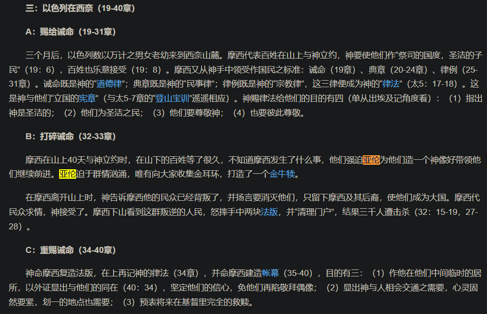

- 应该有什么样的视频？
	- 有充分社交互动的
		- [婴儿真的能从电视和视频中学到东西吗？](https://mp.weixin.qq.com/s/mi3YvX-_eDRseOy83SVCsA)
		  id:: 683f8331-694d-4371-939b-55f492707f8e
			- “成年人呢？”
- 没有经济激励，人们还会拍有害视频吗？
  collapsed:: true
- 内容
  collapsed:: true
	- “文案到视频的惊险一跃”
	- [[音乐]]
		- 儿歌
			- 宝宝巴士（“宝宝巴适”）
			  id:: 65f39270-9bba-42d8-8987-1020f9f84484
				- [我会自己上厕所-宝宝巴士儿歌_哔哩哔哩_bilibili](https://www.bilibili.com/video/BV12x411E7xp)
				- [宝 宝 巴 适_哔哩哔哩_bilibili](https://www.bilibili.com/video/BV1aS4y1j7BM)
			- [亲宝儿歌《拉臭臭》_哔哩哔哩_bilibili](https://www.bilibili.com/video/BV1i7411b7za)
			  collapsed:: true
				- [【倒放】亲宝儿歌-拉臭臭_哔哩哔哩_bilibili](https://www.bilibili.com/video/BV1s7411V7oC)
	- [[性行为视频]]
	- 炫富
	  collapsed:: true
		- [月薪3200的大哥，说话就是不一样！充满了自信！_哔哩哔哩_bilibili](https://www.bilibili.com/video/BV1jr4y1z7qG)
		  id:: 6666e220-49c5-4655-a1c3-4f1eac37e9ba
	- 科普
	- ((681ae832-9e8c-49dc-ae7b-f02355193ee5))
	- ---
	- 真人
		- 卢本伟
		  collapsed:: true
			- ((666a451a-ff24-4094-8352-56d452e00c77))
		- 丁真
		  id:: 679add85-226c-4370-bb91-f17b2f8d598c
		  collapsed:: true
			- [丁真新单曲《烟Distance》痛苦流说唱_哔哩哔哩_bilibili](https://www.bilibili.com/video/BV1N84y1P7en)
			  id:: 65f27739-b24f-4dea-a7f3-5c2cf59c2e69
		- ---
		- 绰号
		  collapsed:: true
			- （疑似）自己起的
				- 冬泳怪鸽
				  id:: 66335be9-1a36-462a-961b-ae0ac9063942
				  collapsed:: true
					- 奥利给
					- [【现实观察】我们要比冬泳怪鸽更怪！奥利给！_哔哩哔哩_bilibili](https://www.bilibili.com/video/BV1We4y157kZ)
					  id:: 661246c7-0158-4d24-905a-72fc33bba077
						- ((66332dd4-5c9f-4592-b729-ebbbe19aefe9))
			- 别人起的
				- 昊京
				  collapsed:: true
					- [任 何 男 人 都 要 穿 衣 服！_哔哩哔哩_bilibili](https://www.bilibili.com/video/BV19G4y1f79p)
					  id:: 66335be9-b70e-4f6e-94e6-8365f8b74ba0
						- >消费者教育是这样的，主人话语只需要附身在不同社会关系上重复重复再重复，消费者要考虑的就很多了
							- ((664ea37c-423b-4713-9e98-36648aa77535))
						- [任 何 男 人 都 要 答 辩！_哔哩哔哩_bilibili](https://www.bilibili.com/video/BV1NP4y1e71f)
				- “哥们”
					- 面筋哥
					  collapsed:: true
						- ((66128093-ddc3-4f2e-8f32-4711f240d77d))
					- 退钱哥
						- “日内瓦，退钱！”
						  id:: 66475db5-545f-4a4a-a218-78c86e8065b0
					- 结扎哥
					- 刀哥
					- 虎哥
					- 药水哥
					  collapsed:: true
						- [【药水哥】宁看我？那我也看宁！绿幕素材_哔哩哔哩_bilibili](https://www.bilibili.com/video/BV1wQ4y1K7uR)
						  id:: 65f70f24-3d4c-402c-9778-510f3556afd5
			- “姐们”
				- 东北雨姐
		- ---
		- 套娃help
		  collapsed:: true
			- [【禁止套娃】【素材】【lennoz】i n f i n i t e  DRAGON DREAM FEET_哔哩哔哩_bilibili](https://www.bilibili.com/video/BV1NJ411q7Fi)
			  id:: 65eff42f-8075-46a9-896c-eb42660a7f6e
				- >注意看，最后是help，不是系统故障啊，说明前面的能指给出了悬念，大家笑容满面、好顶赞是有原因的，那就是help
	- 非真人
		- ((66127979-8b16-4077-b9f6-f49245d6c0e9))
	- ---
	- ((681b515d-2446-41f4-8c39-edb267d67033))
	- [影视剧审查制度到底审查什么？ - 知乎](https://zhuanlan.zhihu.com/p/260288637)
- 时长
  collapsed:: true
	- TODO 单个视频如何做到十秒内？（“以简单操作内容为例”）
	  id:: 6855ecd7-c996-4961-b420-12b3eda21ee7
		- ((678a4e03-a3e6-4edc-b9ac-726bb7b73d5c))
		- “流亡族标准”
			- [【【CDDA】再次剧透警告！！ 大灾变劫后余生派系设定（下）】 【精准空降到 24:49】](https://www.bilibili.com/video/BV1Le4y1H7NZ/?share_source=copy_web&vd_source=24175964b0df2fcc2c022cae23517fdc&t=1489)
		- “比你们的插播广告还短”
		- “十秒到底”
			- ((66fbb383-fd40-49f4-a913-09d2286ea289))
		- solid 10，坚实的10
		- 十秒内能看完的来不及刷走，习惯刷走的不是我们受众
		- >如果内容短小精悍，可能发在哪都是好的，比方说十秒的DIY、成品直接用的小妙招、拉不出微信“最近”界面等常见问题，一系三千六百转，十个小时才播完
		- ---
		- 封面
			- “盯着封面没点开时不算时间”
			- 前最多1秒至少保持封面大部分不变（避免直接切换视频过来的一头雾水）
		- 完成状态演示
		- “一帧不留地（从（狭义）视频中）全部驱逐出去”
			- 图人分离
				- 可以不露脸
			- 图话分离
				- 可以不说话
				- 可以另发说话的说明
				- ((67eb283d-40bc-4d91-b61b-317e27541998)) ？
			- 图文分离
				- 文放简介
				- 图文对应
					- ~~“人会自行找对应模式”~~
					- 提示
						- 顺序（大小、空间关系等）
						- 标记（“ABC”、“画个圈圈”）
		- 高密度
			- 空降助手
				- “请（截图）选择你的XX”
				- 空降精确到秒匹配
				- 空降后不播放
		- 主体稳定
			- 固定或灵活机位
			- ---
			- 细分内容的时间间隔
				- 定格
					- “人会看懂固定间隔”
					- 当然关键处不能丢
			- 画面整合
				- 背景可能固定
					- ((6832d0af-d9cf-46be-bba4-d60369d349cf)) ？
				- 半透明叠加
					- ((67eb2841-8667-4cd5-aa02-d64ba343d023))
					- 不同颜色标记
					- 淡入淡出
				- 分层
					- “抓扑克牌”
				- ((670d40f3-43d2-465c-a0ee-3a734cd95cd1))
				- 组件、操作向主体汇聚
					- 布置、路径
			- 相对“正常”过程的时间顺序
				- 正放倒放
		- 关键处突出
			- 放大
				- ((678a4de5-d0c9-4643-919e-bdf343d7aa32))
			- 标记
		- 多视频链接、嵌套
			- “前置配方”
			- ((6840f5bb-ee12-475d-8ee2-8b1021b8bb18))
			- 避免弹出视频卡片遮挡必要信息
		- 噱头
			- 直接英文创作伪生肉
	- 单个时长
		- [[短视频]]
		- 长视频
			- 电影
				- [什么是电影的「导演剪辑版」？ - 知乎](https://www.zhihu.com/question/19928119)
				- Alan Becker
				  id:: 62dccfef-ac2a-44ae-b7c1-0acac440d849
					- [我的十年动画师生涯故事，感谢一路上大家的支持！](https://www.bilibili.com/video/BV1Ak4y1B7hB)
				- [查理·卓别林](https://baike.baidu.com/item/%E6%9F%A5%E7%90%86%C2%B7%E5%8D%93%E5%88%AB%E6%9E%97/269676)
				  id:: 68eb469a-761e-441d-8f0c-37e2ed396984
					- [摩登时代-电影-高清在线观看-bilibili-哔哩哔哩](https://www.bilibili.com/bangumi/play/ss26258)
					  id:: 625d71f2-25b2-410d-8496-3da65b76d587
					- [卓别林的演讲永不过时](https://www.bilibili.com/video/BV13a4y1H7rk)
					  id:: 6222ebed-a761-415d-90bf-d08a2e072235
					- [周恩来曾请卓别林吃饭，卓别林破例表演鸭子步，还打包菜回家](https://www.163.com/dy/article/G140MP230543OOAT.html)
				- 让子弹飞
					- [敢 杀 我 的 马？！_哔哩哔哩_bilibili](https://www.bilibili.com/video/BV1yt4y1Q7SS)
					  id:: 679add85-898b-47f9-aedf-67270dd608c3
				- 李杨
				  collapsed:: true
					- [《盲山》导演李杨：少有人走的路](https://mp.weixin.qq.com/s/Dp2HN-DUa_g8JCqJCDKMJA)
					- [被低估的《盲山》和导演李杨](https://new.qq.com/omn/20220219/20220219A09DVG00.html)
					  collapsed:: true
						- id:: 627731ee-5c0c-4bd5-b6f6-6b1edb368eba
						  #+BEGIN_QUOTE
						  我拍电影没想过能不能赚钱，多想了就拍不了了。——李杨
						  #+END_QUOTE
				- [好莱坞的末日什么时候到来？](https://mp.weixin.qq.com/s/mv_En-f-MWFa91vmjgNUEA)
				  collapsed:: true
					- #+BEGIN_QUOTE
					  艺术和文化已经死亡了，成为工业生产的一个门类。——霍克海姆
					  
					  晚期资本主义的文化注定是保守的，因为文化和艺术已经变成了资产阶级的财富表现形式——阿多诺
					  
					  大众文化阶段新的东西就是排除新的东西。——霍克海姆
					  #+END_QUOTE
					- #+BEGIN_QUOTE
					  id:: 6281b90b-f242-4b3a-a5bc-fc21258818ab
					  超级英雄片为什么能打动人，不是因为他们超能力有多强，而是其中的理想与精神、责任与力量、爱与希望等等诸多元素的体现。如果没有这些情感的铺垫和人物的升华，仅仅是单纯的爆武力值，手撕飞船跟手撕鬼子没有区别。
					  #+END_QUOTE
					- 血统论
					- ((62870a77-d563-4eec-8f79-7c24a0fc7d09))
					- ((62930316-bd31-4c95-8835-877c30c58cfd))
					- [壮志凌云2爆火：美国人也玩起了“手撕鬼子”](https://mp.weixin.qq.com/s/9_nJ998-gr9L93cjeXEe2g)
		- ---
		- [短视频、中视频、长视频有哪些区别？ - 知乎](https://www.zhihu.com/question/426402918)
	- 总时长
		- 电视剧/剧集
			- [“吔屎啦，梁非凡”非凡哥原版片段_哔哩哔哩_bilibili](https://www.bilibili.com/video/BV1ix411c7mk)
			  id:: 67cade5c-4904-4a49-9338-7355f74cc29d
			- 动画
			  id:: 679add85-4334-42a1-96de-402e7d62a979
			  collapsed:: true
				- ((672cb264-cebb-475d-bd0b-8d9b9971e292))
				- ((66dba0bf-51e8-4492-a714-d8ee36454d6c))
				- 宫崎骏
					- 红猪
						- [“我到死都是一个赤化分子”](https://mp.weixin.qq.com/s/K8JkBA36XvEpBMduAo911w)
				- [“老东西，我们走了以后也要保持童心噢”_哔哩哔哩_bilibili](https://www.bilibili.com/video/BV17x421U7QH)
				- 黑猫警长
					- [【4K修复】黑猫警长 (1984) 5集全【上美】_哔哩哔哩_bilibili](https://www.bilibili.com/video/BV1zB4y1v7Jz)
				- 日本动画
				  id:: 679add85-46a8-433f-aa9d-9ded910772b9
				  collapsed:: true
					- 奥特曼
					  id:: 66ade3ac-c13a-4d9b-b8e0-6698960562d5
						- ((64943908-f232-4f43-87bc-83248652231e))
						- >很多人为了适应现实就是会自缩舒适圈的，对奥特曼这类流行（“流行过了就不流行了”）文化不感兴趣，觉得奥特曼就是奥特曼，甚至是潜意识里想不起来的outman
					- [高达铁血的奥尔芬斯 OP3 RAGE OF DUST (回忆系列) AI 4K (MAD·AMV)_哔哩哔哩_bilibili](https://www.bilibili.com/video/BV1VV411Q7m8)
					- 七龙珠
					  id:: 664da4b4-91fc-4f0b-a1ae-3bf081842c01
						- [Super Kamehameha - song and lyrics by DJ Pygme | Spotify](https://open.spotify.com/track/2GL3pLtWZuU3FpA663zDMK?si=81dd9e43898842f8)
						  id:: 664da4b6-e1ed-482e-832c-f71c8a63615b
							- [DJ Pygme - Super Kamehameha - YouTube](https://www.youtube.com/watch?v=_4uazgbBH40)
							  id:: 6650780c-5fc9-463e-bca6-7d79642e3742
						- ((66335be1-4def-4ff7-8f3e-1e19070b229c))
						- [《七龙珠》中的贝吉塔为什么无法超越孙悟空？ - 知乎](https://www.zhihu.com/question/64737739)
						- ---
						- ((68d74d13-975f-4ebc-aae2-dd40ab9b9297))
					- 数码宝贝
					  id:: 66668b83-6da9-47a7-a07c-5f91af8c3a25
						- 有元宇宙、AI、太一，二次元网哲们不看它看啥？
						- [brave heart（TV动画《数码宝贝大冒险》进化曲） - 宮崎歩 - 单曲 - 网易云音乐](https://music.163.com/song?id=29816860&userid=77770261)
						  id:: 666687f9-086e-4c4a-94ee-a61c17f379cd
						- [彷徨于两个时代——从数码宝贝和神奇宝贝说起（数码宝贝）剧评](https://movie.douban.com/review/15719421/)（“你疑似有点懂数码宝贝”）
						- [被选召的孩子 - 萌娘百科 万物皆可萌的百科全书](https://mzh.moegirl.org.cn/%E8%A2%AB%E9%80%89%E5%8F%AC%E7%9A%84%E5%AD%A9%E5%AD%90)
						  id:: 66dad1d4-db85-4a5e-8bc4-88c41848efc2
					- 口袋妖怪/（精灵）宝可梦/神奇宝贝/宠物小精灵
					  id:: 664df622-536e-43db-acb6-64e13dc5aba8
						- [めざせポケモンマスター（目标是宝可梦大师） - 松本梨香 - 单曲 - 网易云音乐](https://music.163.com/song?id=620282&uct2=U2FsdGVkX1/8ded/58eZ631P5orIrUVVZtRjjpT4/cM=)
						- ((64a76bb9-6687-41d7-aca9-be574d8e4687))
						- [宝可梦为何不统治人类？ - 知乎](https://www.zhihu.com/question/23363567)
						  id:: 679add85-30d2-4e51-b37c-59e19fc906be
							- 宝可梦被多元主义“纵切”难以团结？
						- [神奇宝贝世界里的人吃什么肉？ - 知乎](https://www.zhihu.com/question/29679062)
						- ((64ae539d-ce0e-48cf-82bd-3af252cc8af8))
						- ((66335c20-a657-4c9f-9505-cf6d38f3bb94))
						- 超梦（另：赛博朋克2077的超梦）
						  id:: 664ea37d-2c6a-4970-a60b-85f04446ae76
						- ((664981c8-b251-4d47-bee9-a253ec501618))
					- 名侦探柯南
					  id:: 678b04b6-fba8-418b-9b03-5dffa5b06053
						- 二创
							- AI柯南三杰
								- [嘴硬的鸭子27的个人空间-嘴硬的鸭子27个人主页-哔哩哔哩视频](https://space.bilibili.com/12552812)
								- [只说动漫的果果的个人空间-只说动漫的果果个人主页-哔哩哔哩视频](https://space.bilibili.com/3546812818393478)
								- [吟游诗人AT的个人空间-吟游诗人AT个人主页-哔哩哔哩视频](https://space.bilibili.com/3546914666580171)
							- 搞笑配音
								- [声物课的个人空间-声物课个人主页-哔哩哔哩视频](https://space.bilibili.com/308693140)
						- ((678b04be-5209-42a6-87ea-59b4d2ed1e4b))
						- [《名侦探柯南》小百科 道具篇](https://baijiahao.baidu.com/s?id=1583098847655084503)
						  id:: 67d8ec59-53e3-4485-89ec-193ed638a500
					- 蜡笔小新
					- 新世纪福音战士（EVA）
					  id:: 68a69d04-06bc-4cb2-bfc1-6d319a6008a4
						- [【EVA】EVA明朝体字体下载_哔哩哔哩_bilibili](https://www.bilibili.com/video/BV1f44y117Xc)
					- 进击的巨人
					  id:: 6699d14d-680a-4100-b1ba-06493e9bb41f
						- [进击的巨人搜索结果 - 路漫漫在线动漫](https://www.lmm52.com/vod/search.html?wd=%E8%BF%9B%E5%87%BB%E7%9A%84%E5%B7%A8%E4%BA%BA)
						- >What's the lie? What's the truth? What to believe?
							- [第三季op1  Red Swam_哔哩哔哩_bilibili](https://www.bilibili.com/video/BV1Mv4y1T7Pk?p=5)
							- id:: 66d5a41c-6440-4dc7-b3ba-b8dfa1131e88
							  >不管是相信自己，还是相信最信赖的队友，结果永远都是没人想得到的。 所以...嘛，还是自己选个不会让自己后悔的吧！——利威尔
							- {{embed ((66ade391-1eed-404c-9f96-219f8ba0c25d))}}
							- {{embed ((66ade390-ff3b-427d-a6d2-cb2b6d14bef2))}}
						- >学习鲁迅，永远进击
							- [《进击的巨人》与鲁迅的“《进击的狂人》” - 简书](https://www.jianshu.com/p/98eab7e76f51)
							- [进击的巨人与鲁迅 - 哔哩哔哩](https://www.bilibili.com/read/cv28486544)
							- “好果汁，你让我陷入疯狂！”
						- ((688dafc4-2fc8-429c-9fea-113f5cc1c1f6))
						- 身份认同
						- [《进击的巨人》完结：写在“记忆”中，循环往复的历史荒诞剧_澎湃号·湃客_澎湃新闻-The Paper](https://www.thepaper.cn/newsDetail_forward_12135613)
						- [进击的巨人 | “自由”的哲学意义(上篇) - 哔哩哔哩](https://www.bilibili.com/read/cv5981233)
						- [以谈之巨人阿尔敏为代表的和谈小队，悲观态度推测](https://www.douban.com/group/topic/220432745/?_i=1208892SPSFC4P)
						- [【谏山创密码】巨人：艾尔文团长父子的光与影（上）——历史的容貌（&amp;加餐：明朝为何 - 哔哩哔哩](https://www.bilibili.com/read/cv7588229/)
						- [忘记剧情？思维导图加文字，帮你梳理《进击的巨人》前三季内容 - 哔哩哔哩](https://www.bilibili.com/read/cv8787045)
						- [艾尔迪亚人和马莱人原型？谏山创最新访谈 - 哔哩哔哩](https://www.bilibili.com/read/cv21172260)
						- “青年耶格尔派”
						  id:: 66dba0bd-6edc-4eef-9003-de21e9af324c
							- [为什么我是坚定的耶格尔派（1） - 哔哩哔哩](https://www.bilibili.com/read/cv10001036)
							- “怎么才八成啊？”
						- ((66ade39a-45ed-4f03-a47e-256f27f3ae27))
							- ((669c7ec6-cc25-410d-bbb2-995e3cc18ac8)) （看词条提到摩西之外还有那个赶时间赶路的“亚伦”想到搜搜的）
							  id:: 669c8354-467e-41dd-9f4d-696254c9e0a9
								- [大家叫“艾伦”的多，还是“艾连”多？【进击的巨人吧】_百度贴吧](https://tieba.baidu.com/p/5195114739)
								- 
								- 
								- 罗马字Eren应该就是为了适配日语对“艾伦/亚伦”的发音
								- 三笠摩西？
								- ---
								- 
								- [《进击的巨人》剧情全解析 中篇：巨人起源](https://www.douban.com/note/538502517/?_i=1532701SPSFC4P)
							- [【剧情分析】进巨中的圣经意象及分析【进击的巨人吧】_百度贴吧](https://tieba.baidu.com/p/3739619614)
							- ackerman，archangel？
								- [有关阿克曼和恶魔的疑问](https://www.douban.com/group/topic/206576501)（“原来是这样啊，那没事了”）
						- 第三季
							- 海边螺壳：时间的螺旋
						- OAD
							- “什么蝴蝶效应？”
							  id:: 66c540d1-bf21-4cbc-93ba-e24aecc9231f
								- [关于进击的巨人ED《路上小心》最后那只蝴蝶的一点补充 - 哔哩哔哩](https://www.bilibili.com/read/cv27860857)
						- geek吉克
						  id:: 67774973-fdb2-4402-895c-9e124ec1e479
						  peek/peak皮克
							- 皮克对现代世界的几何等特征的观察（？）
						- 最终季
							- 车力巨人
								- ((668ce769-d3b9-40f9-b221-e02732d24960))
							- “克鲁格是一个潜伏在马莱的纯正的艾尔迪亚人！”
								- “要爱墙那边的人啊！”
							- 《艾尔迪亚人的最终解决方案》
						- 完结篇
							- 㺢㹢狓
								- [以防万一，你没见过㺢㹢狓吃西瓜👅_哔哩哔哩_bilibili](https://www.bilibili.com/video/BV1Mn4y1o7eq)
									- 
								- 始祖尤弥尔的舌头和沉默
									- 难以通过交流成长，更多靠听
										- “始祖尤弥尔擅长捏造未来，可她是个实证主义者？”
									- “大她者的沉默”
								- 殖民非洲
							- ((68c25139-1ff1-4982-9ed7-937924c9efd1))
							- GRIS（亚妮托阿尔敏）
							- “还是看看近处的螺壳吧！”
							- 朋友与陌生人
								- 自恋狂是这样的
							- [进击的巨人部分结局猜想——“你是自由的” - 哔哩哔哩](https://www.bilibili.com/read/cv8838991)
							- [【分析】尤弥尔选中三笠的理由【进击的巨人分析吧】_百度贴吧](https://tieba.baidu.com/p/7295852541)
							- [进击的巨人：五十年科技赶超、安乐死、地鸣灭世，三种计划解读与评析 - 哔哩哔哩](https://www.bilibili.com/read/cv7266696)
							- [关于韩吉承认吉克的安乐死计划可能是最佳选择](https://www.douban.com/group/topic/284395403/?_i=4502944SPSFC4P,4542685SPSFC4P)
							- [进击的巨人：吉克认为“安乐死”没错，为什么还要帮助阿尔敏？ - 哔哩哔哩](https://www.bilibili.com/read/cv9787480)
							- [保姆级拉片分析最后艾伦和阿尔敏在路中谈话，艾伦为何要地鸣，他真正想看的景色是什么 - 哔哩哔哩](https://www.bilibili.com/read/cv27555584)
							  id:: 66ca79fc-499a-4cc2-8c52-84779ffcbfcc
						- ---
						- “我是自由哒！”
							- “傻孩子，快停下，那不是自由哒！”
						- [进击的巨人VR版来了！原班人马配音！人物建模还原！除了画质稀烂其他的我吹爆！_哔哩哔哩bilibili](https://www.bilibili.com/video/BV1Kf421B73t/)
						  id:: 66cbe004-7a4b-4aa1-a98f-3100422dc21e
						- 奇异人生
						  id:: 66cd9fd4-dd5e-47d2-a774-608d55ffa96d
							- >想到有回溯时间的法力的游戏，奇异人生
							  一个地鸣一个天啸，这下法力爆了
							  都是蓝黑蝴蝶（好像前几天就想到了，）
							  经典蝴蝶效应
								- ((66c540d1-bf21-4cbc-93ba-e24aecc9231f))
						- ((66a83398-045c-4a18-a1d2-715f16023f08))
						- ---
						- [正确认识《进击的巨人》的思想腐蚀 - 知乎](https://zhuanlan.zhihu.com/p/360547090)
						  id:: 67176a78-104a-4803-b244-4193cee6ae6e
							- [重评《进击的巨人》 - 知乎](https://zhuanlan.zhihu.com/p/362785757)
							- 之前看到没注意看，看《南京大屠杀》时想到了，除了“城墙”、“安全区”的意象（主要是联想而非直接对应）外还有意识形态教育
						- [巨人究竟是反战作品还是披着反战伪装的唯立场论作品? - 知乎](https://www.zhihu.com/question/419142867)
						- [为什么《进击的巨人》这么明显的反战思想还能被人曲解? - 知乎](https://www.zhihu.com/question/452841537)
					- 超时空要塞
						- ((67b42c4f-4658-4514-9f65-bd454b4c5b16))
					- 死亡笔记
						- [其他人做得到吗是什么梗【梗指南】_哔哩哔哩_bilibili](https://www.bilibili.com/video/BV1Fb4y1f7cM/)
				- 小马宝莉
					- [[MLP] 马力Voc：20% Tylenol（Rainbow Tylenol MAD）_哔哩哔哩_bilibili](https://www.bilibili.com/video/BV1ws411q7tb)
					  id:: 666a5c02-e610-4faf-8772-808a04ccf397
				- 猫和老鼠
					- “猫鼠队上大分”
					- 各种受伤
				- cyriak
				  id:: 690847bd-35fc-4345-9e1d-4239fba9905f
				- ((67e55d6b-e963-4493-b8bd-d6b64614425a))
			- 神魔
				- 西游记
					- [进入社会才懂《西游记》：菩提祖师对孙悟空的嘱咐，暗藏深意 - 知乎](https://zhuanlan.zhihu.com/p/667875316)
					  id:: 68707354-d1ee-4d29-a914-932c5efda6bc
					- [解密西游|西游神秘五虫和八大神兽？如来佛祖道出三界玄机！](https://mp.weixin.qq.com/s/azW_PCY25GgSiT9u6ODCeQ)
					- [六小龄童老师教你如何正确理解西游文化，领会美猴王精神](https://www.bilibili.com/video/BV1fb411H7WC)
					  id:: 624a57b9-24e3-4866-83e3-d1de5aeb6370
					- [年少不懂孙悟空，读懂已不再少年_哔哩哔哩_bilibili](https://www.bilibili.com/video/BV1qr4y1Y7Fx/)
					- ((624a4d32-1e57-4179-bef8-a01960e50865))
					- [朝供制度是天庭的基本经济制度：1.朝供制度；2.天庭的双重含义；3.朝供制度的两层含义；4.天庭的两种经济模式。](https://www.bilibili.com/video/BV1H3411374g)
					  id:: 62b1bd2a-b8d2-49c0-82a9-18be08c4eda6
					- [毛泽东与《西游记》，最喜爱富有战斗意志的孙悟空_凤凰网](https://history.ifeng.com/c/8cMFqUbVg7A)
					  id:: 66cdaefb-7d4f-41c0-9633-3ec8c1d186d2
					- 二创
						- 搞笑配音
							- [【东北版】我叫你一声你敢答应吗_哔哩哔哩_bilibili](https://www.bilibili.com/video/BV18s411i72P)
							  id:: 66dba0bd-fc98-4c2b-a2ea-25bbeeb16bfd
					- 孙悟空火眼金睛，为什么还要用手遮光？
			- 抗日题材
			- “谍战”
				- “谍战”会助长猜忌他人的社会风气吗？
				- [谈谈谍战电影对传统主流文化电影的影响? - 知乎](https://www.zhihu.com/question/361332646)
				- [谍战类型的拓展与社会价值的缺失_光明网](https://wenyi.gmw.cn/2021-06/02/content_34893838.htm)
				  id:: 67611daf-a711-48ea-b599-5d189e51456b
			- 激战江南
				- 鸡汤来咯！
					- [老 顽 童_哔哩哔哩_bilibili](https://www.bilibili.com/video/BV1wm4y1D71L)
			- 快乐星球
			  id:: 660443b3-eb52-481c-98fe-0f129c83bddc
				- [《快乐星球》王英姿 - 《月亮船》_哔哩哔哩_bilibili](https://www.bilibili.com/video/BV13W411i7P2)
				  id:: 6604457c-c056-407b-8cea-940e9dd3a4bc
				- [如何评价少儿科幻剧《快乐星球1》？ - 知乎](https://www.zhihu.com/question/24907878)
				- [为什么《家有儿女》里的童星长大后光芒四射，而《快乐星球》里的童星却消失了？ - 知乎](https://www.zhihu.com/question/265490527)
			- [双峰 第一季_哔哩哔哩_bilibili](https://www.bilibili.com/video/BV1JbNnzQE29/)
- 开播延迟
  collapsed:: true
	- 流媒体
		- 直播
			- “坏了，我（观者）成片段了！”
		- [这可能是全网最全的流媒体知识科普文章 - 知乎](https://zhuanlan.zhihu.com/p/384625487)
		- [流媒体的无限战争——哔哩哔哩B站 vs Netflix奈飞（上） - 知乎](https://zhuanlan.zhihu.com/p/113476332)
- 播放速度
  collapsed:: true
	- 滚轮调节播放速度
		- “就像阅读”
		- ((67eb287a-f8e4-465b-b7e3-aa4c2cce7e4e))
	- 滚轮调节播放进度
		- [想使用Master3s的拇指滚轮实现"在B站和MP4文件下调整播放进度条"的功能，不知道有没有可能实现。 - Quicker](https://getquicker.net/QA/Question/18584)
- （预制）音效
  id:: 66ade380-2cfc-4114-98f0-5cac420def6f
  collapsed:: true
	- ((63bc2109-248e-4d11-a583-d91f3832fdf2))
		- 罐头哭声
		  collapsed:: true
			- 香蕉猫
				- ((66ade37f-66ed-422e-b994-c3baa99c304e))
		- 罐头喊声
		  collapsed:: true
			- 威廉尖叫
				- ((66ade3b4-b292-4854-b4e1-54ae4c0f4fde))
- ---
- 视频压缩（？）