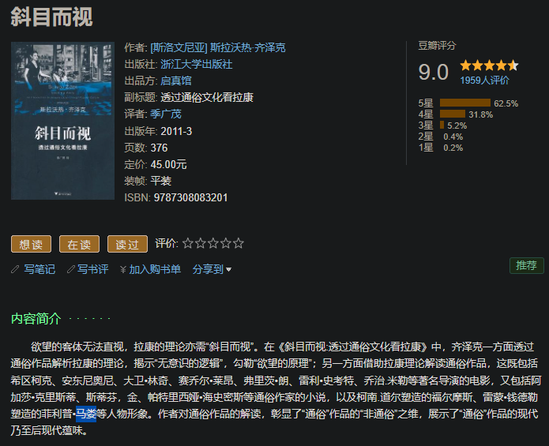
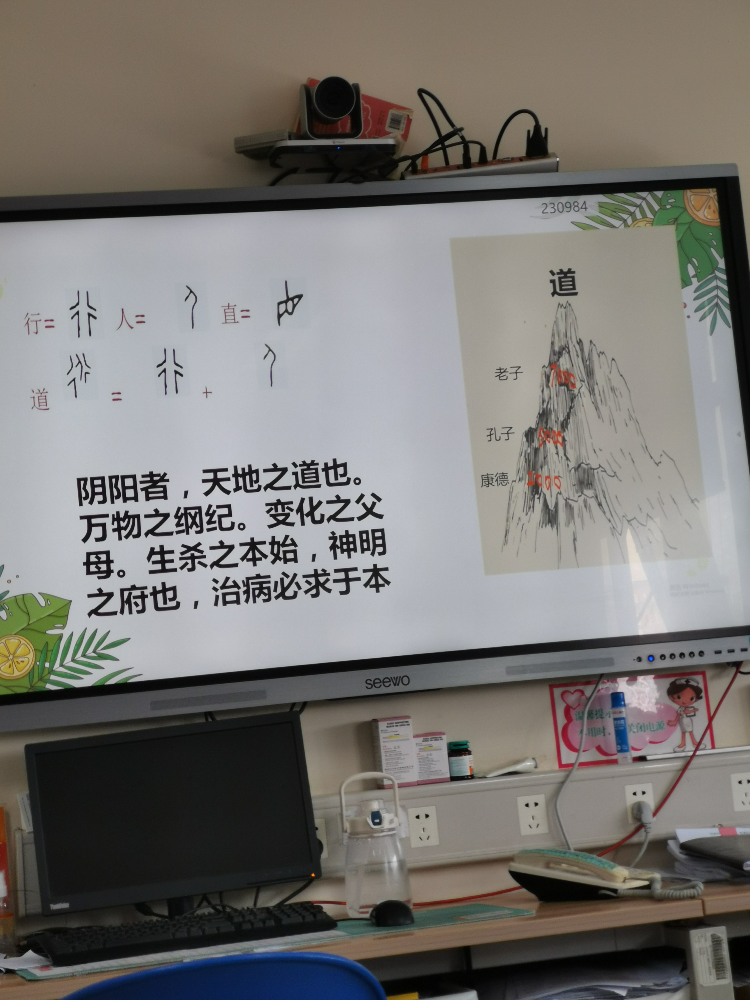

- “给语言集团考古很爽？”
- 嘲讽词语的温和化的推动力量？
  collapsed:: true
	- 神金
	- ((661cf307-5ee0-4f96-8794-69eeb4ad02b4))
	- ((6644ba07-68f3-4a5c-8b3e-2ab62c8786df))
- ((6694a1cd-934d-473b-bb39-549cab87e4fe))
  id:: 6694a537-d329-46ae-a567-e5732e7240b1
- 话题
	- 滑梯
		- ((669b2e37-661d-42af-be76-f5ed99d2f3f5))
- 数字
  collapsed:: true
	- 60%
		- ((669a4217-d978-499f-b3bc-17c4dfe63b9d))
		- ((668ce769-8ab7-4d62-a18a-741564a74a77))
	- ((66911e8d-2f0d-47f3-b3b6-a8ab36cf72fe))
	- 1
		- [【语言学】“X不了一点”中的语言学_哔哩哔哩_bilibili](https://www.bilibili.com/video/av826105335)
	- 26
		- “二十六个字母”
		  collapsed:: true
			- “工厂招聘是吧？”
				- ((6645b76d-67fa-4cd7-8154-addd64ce174b))
			- A
				- AAB
					- 背背佳
					- ((66808fef-f5e5-46e5-899c-067a344169f6))
			- B
				- Biden
					- ((668ce782-9b75-4c5e-8b47-3526a4a90da8))
			- C
				- contro-
					- control vs controvercial
				- cp
					- ((66335bd2-313b-4884-b94c-74f79c617422))
					- cp值
				- cup
				  id:: 669b8546-a795-4be9-bf41-3ae8ece1302c
			- NPNG
				- ((63fb4fe2-f08c-458c-968c-2823dfea6146))
					- 还可以是（自我）“零和”博弈范式
			- O
				- ((669b7441-06e9-4a3a-aa87-369e8bcf688d))
				- Open Source开源
			- Y
				- YYDS
					- ((6699c64c-937a-408d-a2bb-d7abb086dbe0))
			- Z
	- 50
		- “五十音”
		  id:: 65ea7f7a-5d05-4430-91e2-8fb6eec0ef02
		  collapsed:: true
			- Daddy&Mummy？（“Dungeon Master”、德国DM超市）
			- 阿姨
			  collapsed:: true
				- “阿姨压”
					- [【幸运星】こなたのテーマ、インドバージョン（阿姨呀~阿姨呀~）_哔哩哔哩_bilibili](https://www.bilibili.com/video/BV1zp411R7c4)
					- “飒飒/萨萨”
						- “salsa”
							- ((66236f84-8d98-4ba5-85f4-6ee9c39cc777))
				- “阿姨压抑呀”
					- [【4K修复神级舞曲】《Butterfly》— Smile（4K超清重置 中英字幕）_哔哩哔哩_bilibili](https://www.bilibili.com/video/BV1vi4y117Lx)
					  collapsed:: true
			- 嗒嘀嘟嘚哆
			  collapsed:: true
				- dadadida
					- 嗒哒
						-
					- 嘀
				- 嘟（输入法立大功，顺手打错，省力加可爱？好像显得比嘀更呆更无害）
					- 嘟嘟噜
					  id:: 65ea813f-5a9c-41f2-9d04-1073cc415a9b
						- [你能忍受香菜的嘟嘟噜洗脑么_哔哩哔哩_bilibili](https://www.bilibili.com/video/BV1Sx411c7oz)
					- 嘟嘟嘴
				- 嘚
					- der~
				- 哆
					- 哆啦A梦
			- 妈咪木么（“短路了！”）摸
			  collapsed:: true
				- 咪
					- 咪咪虾条
					  id:: 65ea8578-9540-4c89-a044-ef1fe283052b
						- 下头男？
					- ((65ea850a-798e-47cc-9fa4-79ea4aab40a3))
						- ((65ea8578-9540-4c89-a044-ef1fe283052b))
					- 嗷
					  id:: 65ea854a-f5b2-4f0f-9de6-4a83ae45ca36
						- 喵
							- 奥妙
							- [短笛・大王・喵帕斯_哔哩哔哩_bilibili](https://www.bilibili.com/video/BV1Bs411o7ra)
				- 美和米——美国和米国，咪咪
				- 么么哒：么么·哒
				- momo
				  collapsed:: true
					- “你说，这世上真有momo吗？”
					- [小红书上为什么那么多momo？ - 知乎](https://zhuanlan.zhihu.com/p/606864608)
					- [研究生网上吐槽，被认出后删帖改名「 momo 」，如何看待网上的 momo 大军？ - 知乎](https://www.zhihu.com/question/649178779)
					- “陌默无闻”
					- “匿名的主体性”
						- ((6624c802-26f8-4826-9937-6258cda67604))
				- mortal
					- [0与400万](https://mp.weixin.qq.com/s/JkY1IOCGXV2eI5D8X8iSVg)
			- 啦哩噜嘞啰
			  collapsed:: true
				- 拉拉
				- 拉拉队
					- “错！”
					- [为什么拉拉队叫“拉拉队”？ - 知乎](https://www.zhihu.com/question/272163182)
				- ((65ea813f-5a9c-41f2-9d04-1073cc415a9b))
			- mono
			- {{embed ((65f27fc0-8e80-4ab7-b677-631d90b641de))}}
			- 连音，舌头的连续技？
			- uni
				- uniform、university、union不够uni
				  id:: 66482680-a379-4859-a648-ceccd8ef1acb
					- ((669c4125-3fd4-48e0-b525-93e9d8596622))
	- 85
		- [Ocho Cinco - song and lyrics by DJ Snake, Yellow Claw | Spotify](https://open.spotify.com/track/7LWPWw7PtYHrDn194kNCPA?si=3a575ab61e3e4201)
		  id:: 664ffac5-e128-4ec6-8e2c-08b5a6c95c97
		- [Chad Johnson - Wikipedia](https://en.wikipedia.org/wiki/Chad_Johnson)
	- 54
	- 58
	- 93
		- ((668ce76a-2f73-4d0d-a1a6-ef2b2d576819))
		- 九三学社
			- [与九三学社的渊源关系_光明日报_光明网](https://www.gmw.cn/01gmrb/2005-09/15/content_304816.htm)
	- 150
		- [实时通信和大众传媒的发展会改变邓巴数吗？ - 知乎](https://www.zhihu.com/question/380253362)
			- 会更小吗？比如头像的同质化？
- 卦
  collapsed:: true
	- [【主义主义】历史符号主义（2-2-3-1）——以《周易》为代表的形而上学范式_哔哩哔哩_bilibili](https://www.bilibili.com/video/BV1154y1b7Bb)
- 度
  collapsed:: true
	- [高度！速度！跨度！精度！深度！力度！厚度！密度！广度！温度！](https://m.thepaper.cn/baijiahao_20262795)
- 天
  collapsed:: true
	- 天花
		- 天花板
- 地
- 口
  collapsed:: true
	- 回
		- 回答
			- 不要回答！
			- 做出回答！
- 日
  collapsed:: true
	- ((665a9b31-1ed1-4b6a-bcbd-8adb80b8ae01))
	- 早
		- 过早
			- ((66335c32-1621-441c-a858-39b4a9a76fb0))
	- 午
		- 过午不食
	- ((66335bd5-a2b8-453c-884e-eb2805a95de6))
	  collapsed:: true
		- 节目
			- 多邻国译为“活动”
			- [节目_百度百科](https://baike.baidu.com/item/%E8%8A%82%E7%9B%AE/1384977)
	- 时
		- 时间
			- ((66852e55-0dde-4f6f-8ea9-7c40574df159))
- 月
  collapsed:: true
	- ((665536c4-a2ce-40d9-a758-bdc470a46e71))
		- “月经贴/帖”
			- “卫生巾是吧？”
- 阴阳
  collapsed:: true
	- 采阴补阳/采阳补阴
		- “双修”
	- 阴蒂
		- “太蒂了姐妹”
			- “泰迪”
- 水
  collapsed:: true
	- 淡水
	  collapsed:: true
		- “两个火才出三点水，效率疑似有点低了”
	- 杯
		- ((669b8546-a795-4be9-bf41-3ae8ece1302c))
			- ((6669903e-b75f-4006-b24e-9cb3d9de1020))
				- 罩杯
			- 世界杯
		- 飞机杯
- 火
  collapsed:: true
	- 烟
		- [大型纪录片：《一中百醇烟传奇》_哔哩哔哩_bilibili](https://www.bilibili.com/video/BV1at42157Lr)
		  id:: 66834bff-ef10-475b-920e-f8e35d35efec
- 木
	- 格
		- 格格
			- 格格不入
		- 出格
			- 出格子间
				- [出走格子间，去做“体力活”的年轻人怎样了？｜有数_澎湃号·湃客_澎湃新闻-The Paper](https://www.thepaper.cn/newsDetail_forward_22775961)
				  id:: 669c6313-6008-4123-a812-98eb980ed68f
		- 格子间
- 夏
  id:: 6657c27f-ef13-493e-87aa-9295edf6d5ff
  collapsed:: true
	- summer
	  id:: 6657c28c-5c2e-4549-a9f8-f068b05a4439
		- sumer
- 春
  collapsed:: true
	- [春点_百度百科](https://baike.baidu.com/item/%E6%98%A5%E7%82%B9/1499170)
		- ((66933e15-a8fa-4b5b-a5bf-812a929ee00d))
		- “春卷？哪里有春卷？！点心？哪里有点心？”
- 眼
  collapsed:: true
	- {{embed ((66650e67-3f0b-413c-a4f3-7750f1e06ad2))}}
- 男
  collapsed:: true
	- 宅男Otaku Boy
		- [Otaku Boy - S3RL - 单曲 - 网易云音乐](https://music.163.com/song?id=1893753347)
	- 屌
		- 傻屌
			- [元朝就有“傻屌”这个词了_哔哩哔哩_bilibili](https://www.bilibili.com/video/BV1A64y1U73t)
		- 屌丝
		  id:: 66449cc9-d97f-448d-b2f1-7fc1c608a221
			- [从何时开始“屌丝”一词成了贬义? - 知乎](https://www.zhihu.com/question/334979864)
			- “极霸矛”（“史诗级加强版”）
			  id:: 6644ba07-68f3-4a5c-8b3e-2ab62c8786df
- 女
  collapsed:: true
	- [“不是女王女神节，是38劳动妇女节！”_哔哩哔哩_bilibili](https://www.bilibili.com/video/BV1pt421t75Z)
	- 妇女
	  id:: 65eaa0de-8eb7-4dd6-94d3-d0320dc338f1
	  collapsed:: true
		- [「妇女」一词到底经历了什么词义和词性，内涵与外延的变化？ - 知乎](https://www.zhihu.com/question/268303584)
		- 妇女节
			- “三八”
			- 国际妇女节
				- [国际妇女节 - 维基百科，自由的百科全书](https://zh.wikipedia.org/zh-cn/%E5%9B%BD%E9%99%85%E5%A6%87%E5%A5%B3%E8%8A%82)
			- 国际劳动妇女节
		- [三八节特辑：女性一生会听到多少种噪音_哔哩哔哩_bilibili](https://www.bilibili.com/video/BV1i2421T7mg)
		  id:: 65fa808e-d4bd-40c2-a4a8-8629fcf11bc0
	- ((65ec51b3-7c45-413e-9c97-1bb5ec1f8b6b))
	- 女生
		- 3.7女生节
		- 生？
	- 公主
		- “公的主”？
	- 女王
		- “姐就是女王，自信放光芒~”（“所以为什么不是女王节？”）
			- >穿最喜欢的衣服，化最精致的妆。女人要气质悠扬，活得漂亮
			- “甜言或蜜语，去哄**小姑娘**”
	- 女神
		- ，启动！——坏了，
		  id:: 65ea8174-7b97-48a7-93c3-391758b2b46e
		- “男性凝视”
	- 媛
	  collapsed:: true
		- ((65ea8174-7b97-48a7-93c3-391758b2b46e))
		- ((64631f0c-2973-4219-b842-cf0b3e7fee63))
		- 爱媛橙
		- 攀援
			- ((65ea7179-e224-4c2e-9ef7-5caeda88b645))
	- 妈
	  collapsed:: true
		- 宝妈
		  id:: 65bcbf67-f39d-4354-ac45-ee1802fbd5e0
			- 比“家庭主妇”好听、轻快些，但建议你生和照料你的被附属物，而不是主“家庭”
			- “宝母”
			- “妈宝”
			- “宝马（女）”——“坐在宝马车里哭”
			- 家务的工业化解决方案（包括选择，进一步解放宝妈？）
			- 独立带孩子与独自带孩子
	- 入赘
	  collapsed:: true
		- ((65ea854a-f5b2-4f0f-9de6-4a83ae45ca36))
		- 贝
			- [贝（汉语文字）_百度百科](https://baike.baidu.com/item/%E8%B4%9D/84241)
				- 西周（3,4）的“贝”像猫头？
			- 双壳纲
		- ((65ea7179-e224-4c2e-9ef7-5caeda88b645))
	- 胸器
		- [胸器_百度百科](https://baike.baidu.com/item/%E8%83%B8%E5%99%A8/11065293)
		- [胸器 - 维基词典，自由的多语言词典](https://zh.wiktionary.org/wiki/%E8%83%B8%E5%99%A8)
		- 凶器
- 色
  collapsed:: true
	- 红
		- 红灯
			- 红灯区
				- “（老）司机”
	- 白
	  collapsed:: true
		- 白色恐怖
		- 白色污染
		- 白色恋人
		- 白皮
		  id:: 6670f61f-516a-495e-902b-681a1ec21c51
		- 白色天使
			- “天使是天鹅翅膀？”
			- 天使是白色的，不光是刚出生的白色婴儿
		- 白衣天使
	- 青
	  collapsed:: true
		- ((66714453-ef30-4660-8a53-2e9f5d0803a1))
		- 青年
			- 小镇青年
				- 集集小镇
	- 蓝
	  id:: 66714453-ef30-4660-8a53-2e9f5d0803a1
	  collapsed:: true
		- 蓝血
		  id:: 6670f5f7-c157-4146-a165-bf35747b9b18
			- [蓝血人 - 维基百科，自由的百科全书](https://zh.wikipedia.org/zh-cn/%E8%97%8D%E8%A1%80%E4%BA%BA)
			- 蓝血与贵族未晒黑的白皮、未锻炼增粗的肌肉而易看到的蓝色静脉血
		- 蓝星
- 香
- 味
	- 辛苦
		- “辣椒拌黄瓜”
- 象
  collapsed:: true
	- 象棋
	- 炮
		- 老炮
			- [什么北京老炮？无非就是老流氓！50岁北京大哥讲述门道_哔哩哔哩_bilibili](https://www.bilibili.com/video/BV1aE421G7JQ)
	- 马
	  collapsed:: true
		- 马桶
			- ((66335c3c-be42-494d-83bf-648ec8793c73))
		- 马赛克
			- “这么看，人类不是哺乳动物咯？”
	- 印象
	  collapsed:: true
		- 第一印象
			- “它壮吗？”
	- 像
- 肺
  collapsed:: true
	- 肺活量
		- “有没有肺死量？”
- 病
	- “生病”
	- “得病”
		- “得了”
		- “得道多助，得病多住”
- 他
  collapsed:: true
	- {{embed ((6661bf92-785b-4efd-bba4-054ec1be6fbd))}}
- 科技
  collapsed:: true
	- 剪刀石头布
	  collapsed:: true
		- ((66335ba3-833d-44f5-8c05-2cf21215fac5))
			- {{embed ((66449311-e8b5-465d-b63d-54600199c21d))}}
- ((66335bd7-d403-4895-af28-0a04f2ebac74))
- ((665e585b-f301-4c19-9363-57f6a0701018))
- 阶级
  collapsed:: true
	- 工人
		- 干部
			- 骨干
		- ((66432f3a-2ccb-4c1e-88cd-882ed1925ee9))
		- [社畜_百度百科](https://baike.baidu.com/item/%E7%A4%BE%E7%95%9C/9695843)
		- 打工人
	- 资本
	  collapsed:: true
		- capital
			- 咔疲偷（在重复的机械性的撞击中，工人疲劳，被偷）
			- 卡批头（指卡住使历史螺旋前进或上升的批头等生产资料；亦可指卡住批判的头头）
			- 卡比多
				- “欲与天公试比多”
				- “卡/力比多”
	- 布尔乔亚
		- 小布
			- ((66449311-e8b5-465d-b63d-54600199c21d))
			- ((66662f70-41b1-47c1-b69a-18294fb9d857))
- 神话
  collapsed:: true
	- 古希腊神话
		- 赫尔墨斯
			- 爱马仕
- 亏
  collapsed:: true
	- 亏贼
		- crazy
- 草根
  collapsed:: true
	- 墙头草
- 老逼登
  id:: 668ce782-9b75-4c5e-8b47-3526a4a90da8
	- [老逼登是什么意思？ - 知乎](https://www.zhihu.com/question/437478216)
	  collapsed:: true
	- 老登
		- 中登
			- “中国证券登记结算有限责任公司”
- 霸凌
  collapsed:: true
	- bullying
		- [欺凌 - 维基百科，自由的百科全书](https://zh.wikipedia.org/wiki/%E9%9C%B8%E5%87%8C)
- 货
  id:: 6664dd49-57f5-4e5e-b38d-3a003461e6bf
  collapsed:: true
	- 货色
	- [干货（电子商务术语）_百度百科](https://baike.baidu.com/item/%E5%B9%B2%E8%B4%A7/7797438)
	- [水货（名不符实的人）_百度百科](https://baike.baidu.com/item/%E6%B0%B4%E8%B4%A7/2675496)
- ((66335c07-15c9-46ec-a5cc-7147930713ce))
  collapsed:: true
	- “喧宾夺主必胜客”
		- “独在异乡为异客”
- 段子
  collapsed:: true
	- [段子手_百度百科](https://baike.baidu.com/item/%E6%AE%B5%E5%AD%90%E6%89%8B/9190078)
- 复读机
  id:: 6649847a-3776-4b07-8ce5-28e7de475490
  collapsed:: true
	- >没事做？不如跟我一起做复读机，复制这段话再发出去，每天收入0元，我和身边的朋友都在做，反正闲着也是闲着，吃饱了也是撑着，不如挨顿骂。
	- id:: 6649847b-b8a4-4702-8f22-b64fe8e199ba
	  >他背的是从短视频还是哪看来的书啊，这不就是没啥文化、抱着不知哪来的大他者不放的体现，头像也是整整齐齐有条有理的
		-
		- 模仿领导讲话引经据典？
- ((6661b945-f7fd-48b6-a9c5-c923a69d03d7))
- 我们人类的离谱比喻
  collapsed:: true
	- [[喻]]
	-
- [“若”和“如果”有什么词源上的关系吗？ - 知乎](https://www.zhihu.com/question/282209137)
- 金
  collapsed:: true
	- 从锡罐头到锡纸（“铝箔！”）
	  id:: 6560776d-4eba-4ca0-9d62-37c94398ef5c
- 食
  collapsed:: true
	- 蜂蜜
	  id:: 65eae6fd-9c93-4791-9100-09b72c3b26ce
	  collapsed:: true
		- “哈基米”
		  id:: 65ea850a-798e-47cc-9fa4-79ea4aab40a3
			- 哈哈
			- 集美=姐妹
			- 米=美
			- ((65c32c2c-caa8-40c0-a618-04a960ee7df8))
			- [(补档)无人机火烧哈基_哔哩哔哩_bilibili](https://www.bilibili.com/video/BV15K421i74M)（“搜神医无人机搜的”）
			  id:: 66026ff6-4930-421d-9f83-33375b30ae39
			- [哈基米必看之爱人tv_哔哩哔哩_bilibili](https://www.bilibili.com/video/BV1xt421j7x3)
			- >自然保护区之外的猫的生活很大程度上是人创造的，每只哈基米都值得过上更先进的生活
			- “这哈基人也太不懂事了，跟人哈基米较劲干啥捏？”
			- [当雌二醇遇上乙二醇，哈基米和小男娘之间会发生什么呢？_哔哩哔哩_bilibili](https://www.bilibili.com/video/BV1hZ421q7Yj) #伊德格拉米
		- “宝贝，你是我的甜心”
	- [[食品添加剂]]
	- ((65fd1dfd-73cb-4593-a8f2-8079289ece4d))
	- [[面食]]
		- 面团
		  collapsed:: true
			- dough
				- doughter
			- ((65f55f61-2b26-47d6-920c-d0b477b868ca))
		- gluten
		  collapsed:: true
			- glute
		- ((662361ba-0f68-47a9-b607-6154071963aa))
	- [[三明治]]
	  id:: 661cf307-7d9e-45f3-a893-358c0b92492c
	  collapsed:: true
		- 福建三明
		- 三日月
			- 月牙
				- [[可颂]]
					- ((661cf62b-2ad3-47df-89b5-391a04a62559))
					  id:: 661cf714-2dd4-459a-bf19-0c34aea36a4b
			- “不可能治愈的创伤”
				- >三日（月），我终于明白了。我们的目的地根本不重要，只要继续前进就好了，只要不停下脚步，道路就会...不断延伸！
		- “三明主义”
			- “明有明治明享”
				- 翻译
					- 一位名“明”的人有（一）明治，明天/天明享用
					- 明天/天明有（一）明治，明天/天明享用
					- 明天/天明有一位名“明”的人治，明天/“明”享用
			- 中间环节，过渡阶段
		- “明治维新”
			- ((661cf714-2dd4-459a-bf19-0c34aea36a4b))
		- “黄马骊牛三”
			- [【【主义主义】惠施哲学精讲：“方中方睨”“方生方死”到底是什么意思——原始的现象学/分析哲学（2-2-4-4）】 【精准空降到 45:29】](https://www.bilibili.com/video/BV1864y1m7Xt/?p=4&share_source=copy_web&vd_source=24175964b0df2fcc2c022cae23517fdc&t=2729)
			  id:: 661cf341-d8e5-4c3e-b890-4b9f652dcb7f
	- “营养过剩”
	- “（更）附魔食品”
		- [[平安果]]
		- “蛋糕摆件”
			- ((663cb6db-60f1-4fca-a994-7a1a6bf215a4))
			- 糯米（？）麻将
- 屎
  collapsed:: true
	- “食/吔屎啦你！”
	- "HOLY SHIT! "
	  id:: 660e5640-7bf3-4568-8542-61727c4bdcbd
	- “尸米”
- 尿
  collapsed:: true
	- 尿性（“类似水性吗？”）
	- “尸水”
- 屁
  collapsed:: true
	- “尸比”
- 衣
  collapsed:: true
	- ((6669903e-b75f-4006-b24e-9cb3d9de1020))
		- 文胸
			- [Bra为什么叫文胸而不叫武胸? - 知乎](https://www.zhihu.com/question/632095278)
			  id:: 660b7c97-b4c8-48d8-824a-d17a2bf3fe69
		- “小背心”
- 核
  collapsed:: true
	- 核心家庭/核家庭
	  collapsed:: true
		- >想到个词，“核（核心家庭——“nuclear family”；大点的核心，氢弹包原子弹，那才叫爽！）废（失去劳动等能力，之前想到个“削废die”）料（liao，i-lao，自我中心的老）”——“有价值之处在于提醒我们生活中不只是阳光花草，还有难以自然降解和人为处理的危险”——“这下被迫原子化了”
	- 核燃料
	- 核废料
		- [核废料_百度百科](https://baike.baidu.com/item/%E6%A0%B8%E5%BA%9F%E6%96%99/2465098)
- ((664ea37d-2c6a-4970-a60b-85f04446ae76))
- 中医
  collapsed:: true
	- 气
		- 脚气
		  id:: 664d7681-888c-46c8-afc0-a045cb053e8d
		- 地气
		- 电气
			- 接地（气？）
	- 治未病
		- “治未病是吧？”
		- ((664d78ae-7a23-4cc4-9f88-1549fa3ec976))
			- 冬天的病夏天就治了，没生（复发）的病就治了——“治未病”
			- 也可以是冬病夏防
				- 比如通过养成健康生活习惯
				- 比如通过在夏季晒太阳进行的维生素D等营养素的积累
					- ((66335bec-af06-4f8f-94eb-dca3cb103ce2))
	- 冬病夏治
	  id:: 664d78ae-7a23-4cc4-9f88-1549fa3ec976
		- ((664d6cd2-0320-4b18-98d7-83904c46fc3b))
		- “冬天有的病，就是冬病”
			- “怕不怕冷？抑不抑郁？”
- 配速
	- pace？
- 困扰
  collapsed:: true
	- “（给XX造成了）困扰”
		- ((66449311-e8b5-465d-b63d-54600199c21d))
			- >“卫生路本来就比较窄，之前路况也不好，后来修缮了就好很多。但是我们这一段路就像是被遗忘了一样，没人管，整条路坑坑洼洼的，下雨天骑车路过积水会溅我一身。”家住省石油公司家属院的市民赵先生告诉记者，此处的道路狭窄及坑洼问题已经给附近市民的出行造成了困扰，存在一定的安全隐患。
- xx管理
  collapsed:: true
	- 自我异化、剥削的说法
	- “大家都在自我管理，而有的人是成功的管理者，有的人是失败的管理者”
- 软件
  collapsed:: true
	- RPO
		- “你这个PRO是我们Proletariat的意思吗？”
- 解剖学
  id:: 667b89e7-68be-4dc5-9663-84063ca34ce0
	- [解剖学中人体的三个面即冠状面、矢状面和水平面的命名？ - 知乎](https://www.zhihu.com/question/19879418)
	  id:: 662b5ada-76a1-4c68-8a3d-9e6116ed93fa
	- [贵要静脉、头静脉的命名来历？_百度知道](https://zhidao.baidu.com/question/53409780.html)
	  id:: 6674b07b-d105-4b69-9a19-44429200344e
	- “大隐隐于静脉”
	- 关节
		- [屈戌_百度百科](https://baike.baidu.com/item/%E5%B1%88%E6%88%8C/11046571)
		- 打通关节
- 做题家
  collapsed:: true
	- 做题机（啊？）
- 踏青
	- “小草青青，踏之何忍”
		- 绿化带是编制草吗？
- 主人
  collapsed:: true
- 奴隶
	- 奴
		- [“华伦天奴”这个品牌的汉语译名为什么令人感觉恶心？ - 知乎](https://www.zhihu.com/question/510797368)
			- ((65bcbf60-6ec1-4f15-961f-98369b74c11f))
	- 隶
		- 隶书
		- “都市隶人”（小约翰可汗视频）
- 福祸
  collapsed:: true
	- “俘获”——“俘虏”——“腐乳”——“臭豆腐”——“奥利给”
	- 祸
		- ((65ebd5fb-a9bd-4943-b8d2-ca2da3b5248c))
- 黑话
  id:: 660d5981-cfba-4deb-837f-6028bf4dd15e
  collapsed:: true
	- 制造“困难的上升之路的存在与合理性”的假象
- ((66495c23-13cc-4a4d-a8b5-c5b76a009df3))
- TODO [吐槽_百度百科](https://baike.baidu.com/item/%E5%90%90%E6%A7%BD/5589457)
  id:: 65f85098-bfc4-4497-9efe-b5b595770f88
- 加速
	- 加速幻觉/错觉
		- 我们都知道波
		- 曲风：nightcore（“夜核”）
		- 音乐与其他领域的加速——“实际上是压缩，或者压榨——降维”压缩别人是为了自己生存
			- 与其他领域的 ((66430fa9-d734-422b-bbb9-d7cb29c0c4d3)) 是如何匹配的？
- 服务超市
- 入关与过关
- 反切音
	- [吗喽_百度百科](https://baike.baidu.com/item/%E5%90%97%E5%96%BD/63418198)
	  id:: 661cf307-8e3b-48ae-81ad-16a7344525d9
		- [马骝（粤语指猴子）_百度百科](https://baike.baidu.com/item/%E9%A9%AC%E9%AA%9D/96137)
		- 
		  id:: 664df622-f6bd-45ac-a2a0-29344106a9a5
			- [菲利普·马洛（《长眠不醒》中人物）_百度百科](https://baike.baidu.com/item/%E8%8F%B2%E5%88%A9%E6%99%AE%C2%B7%E9%A9%AC%E6%B4%9B/185808)
- 短信与微信
  id:: 660f8b5e-d050-4a16-adbc-cebdc06b472a
- “宵禁”
  id:: 65f7b22e-79e4-49be-88c3-b598c3d2de8d
	- “萧敬腾”
	- ((65f7b1f0-8f1b-4b28-a96a-dd3259204cc5))
- “小红花”
- “费拉不堪”
- 消费贷
  id:: 660f8b95-3e09-45a5-812d-0021c821b782
	- “削废die”
- 线人
- 说法
	- “你不干有的是人干”
	- “不要大国尊严，只要小民幸福”
	- “无知者无畏/罪”
	- “穷则独善其身，富则兼济天下”
	- “放下助人情结，尊重他人命运”
		- “一开始说这话劝诫他人的人是怎么回事呢？这可以是合法的例外吗？”
- 倒装
	- “XXX一点”
- 外来语
  collapsed:: true
	- id:: 66455f86-8b62-4832-a76d-35d9dd48eeca
	  >粤语是个古今中外文化传播/交流记录的窗口（“以空间换时间”），比如“鱼露、ketchup、茄汁、番茄酱”好像是有联系的，还有不少直接从海外和间接从香港等地来的外来语
	  duolingo可能让用户的节奏叮叮叮得比较快，直接记下来能用了交到朋友了当然很好，但匀出时间其实也可以进一步在“词源”上享乐，比如好奇搜搜节目与节日有什么关系，等等，然后搞一堆不一定有啥用的语言（污染）游戏
		- >一个软件会用了就挺爽的，但是要搞alteration，还得看看里面的代码
	- [粤语中有哪些从英语音译的词汇？ - 知乎](https://www.zhihu.com/question/20874028)
	- goddame
	- ((660e5640-7bf3-4568-8542-61727c4bdcbd))
		- “厚礼蟹！”（“疑似正向强化，但更凸显物化”）
		  id:: 661cf307-5ee0-4f96-8794-69eeb4ad02b4
	- lingual
	- 食物
		- [[可颂]]
	- [汉语外来语词典 (岑麒祥) (文字版) (1月26日更新) - 汉汉 - FreeMdict Forum](https://forum.freemdict.com/t/topic/18644)
	- 打call
	  collapsed:: true
		- 可达鸭call duck？
		- [如何评价「打 call」一词被错用的现象？ - 知乎](https://www.zhihu.com/question/67049675)
		- [突然爆红的流行词“打call”到底是什么意思？ - 知乎](https://zhuanlan.zhihu.com/p/28783398)
			- >**三、反馈。**试想一下，因为你的喊call，小偶像在原本的舞蹈动作中与你产生了一个互动（比如比心、wink、飞吻之类）……是不是会更加激发打call的热情和趣味性呢？
				- “这下前现代求神祈雨了”
		- “警惕荧光棒企业污染汉语言生态”
		- 荧光棒与击鼓？
		- 日本荧光棒与欧美电音节？（hakken）
		- “打尻？”打尻舞？（“你的发音是什么？”）
	- “出口转内销”
	  collapsed:: true
		- [生物领域的「拮抗」一词词源为何？是日本人对「颉颃」进行简化的结果吗？ - 知乎](https://www.zhihu.com/question/31828845)
	- 尼采
		- 凡杀不死
			- 凡杀死
- 幻想御手（imagine breaker，可能“碎手”比较好）
	- 穿越幻想，最终有个基本幻想，就是没有超能力等级（或等级较低者）的人无法战胜超能力者
	- 上条当麻
		- 意为大他者、绝对律令就是个屁
- 外语谐音
  collapsed:: true
	- 钱
		- “马内”
			- 以“马内”利
	- sausage
		- sawsage
			- 看见/锯 智者
- 泼天（富贵）
	- 水发天——“看来是大洪水”
- 人行道
  collapsed:: true
	- “人道主义的人行道”
	  id:: 664964d5-476b-4b99-aa21-6783d7176542
	- 
		- 看这个（“壁画小人？”）图解想到“人行道”会不会是这样的词源
		- [《甲骨论道》第四篇：解读《道德经》的“德”字 - 知乎](https://zhuanlan.zhihu.com/p/587393415)
- “代用词”（加“”的也算哦）
  id:: 65b7560a-82c3-4411-aa9b-cfbb17bd9c54
  collapsed:: true
	- ((65b74714-e970-46bb-adaa-dac650a53ecf))
	- ((65a9ccae-5cc1-4c0e-9117-d8bd38bab167))
	- 性
		- 丁丁、豆豆
			- 为什么叫丁丁？
			- 豆丁
			- 欧金金、欧豆豆？
- 科学
	- 科学xx（“科学谁啊，满世界到处跑说话”）
	- [科学网—王扬宗：汉语“科学”一词的由来](https://news.sciencenet.cn/htmlnews/2012/5/264017.shtm)
	- 中成药杂交词
		- [[亚健康]]
- [世界各地语言有哪些匪夷所思的同源词？ - 知乎](https://www.zhihu.com/question/67119315)
- 学生
	- 小学生
		- [姐妹们还记得这句话吗——“”因为所以，科学道理！”](https://www.douban.com/group/topic/192241383)
		- [“因为所以，科学道理”这句话怎么传播开的？ - 知乎](https://www.zhihu.com/question/361849451)
- 网络流行语
  collapsed:: true
	- [愿你出走半生，归来仍是少年的出处？ - 知乎](https://www.zhihu.com/question/47689407)
- 轮子
  id:: 66476acb-56e3-47d5-a8bf-5726759bd62c
  collapsed:: true
	- {{embed ((7c9666a8-4f81-41da-b3df-0b405bd6c892))}}
	- 轮子与时间
	  id:: 66476b12-f071-4e74-b56a-32592fc403d1
		- [Ride on Time (Nightcore Edit) - Dancetech/Tune Up! - 单曲 - 网易云音乐](https://music.163.com/song?id=403310891)
- 管
	- 管线
		- pipeline