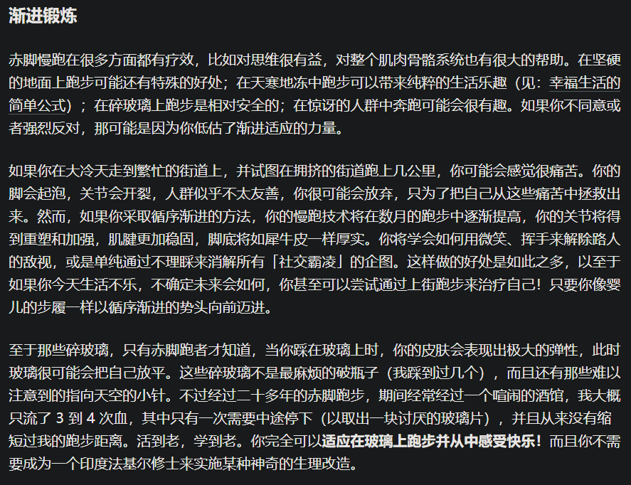

- 来源
	- # ((6648ac72-2a1a-46af-963e-ad738d51a5a4))
	- ((6247c5c9-8aaa-4b67-8559-bd00e4aec51a))
- 慢动作、“哈佛大学在行动”
  id:: 664ca845-e8f3-452d-9263-e9e65bed2ac5
	- 
	  id:: 664ca845-8f2c-4c66-b216-c08d2eca202b
		- ((664ca5fd-2a01-4d83-95c8-5d0c89428b9c))
- SuperMemo作者
	- 
- 品牌穿鞋赞助
	- 
- 赤足马
  id:: 664b3059-876b-4da8-be07-025ecca290ae
	- 
	- 
- 老年人
  id:: 664b3059-1618-4f5a-82f5-988e3d85a27d
	- 
- 5千米配速3分33秒
	- 
- 静步
  id:: 664b3059-4b83-48e9-bb00-e52f4973ffe3
	- 
- 自行车
	- 
	  id:: 664b3059-56e8-48d2-b886-09806c2e8f20
- 故障排除清单
	- 
- 10要点
	- 
	- {:height 516, :width 780}
	- 
- 7步骤
	- 
	- 
- 重新学习
	- 
	- 
	- 
- 穿鞋跑
	- 