- [[为什么要用电脑？]]（虽然“按理”放最前面，但是完成度不高捏）
  id:: 65ab10fb-5103-4932-91f9-4fd23b6f572f
- ---
- 我的常用软件
  id:: 670d40f3-496d-4a58-b303-1e7d353f8033
  collapsed:: true
	- “坏了，（不算插件）全英文是吧？这下得微信飞书腾讯会议百度网盘救场了”
	  collapsed:: true
	- “小工具”
		- ((cb62e8cd-35a0-460c-8fa4-3cd98cfb7d2b))
		- ((659c9e71-570c-46ec-8f44-82c8af29f35e))
	- 小学一下
		- ((6667cc31-4d38-4a64-b274-e05bea3f6dba))
	- 进程管理
		- ((6703ea76-f088-4570-a8de-f1750eb3e72d))
	- 桌面管理
		- ((670e7c2a-b293-41c4-9a5a-6697d0676772))
	- 看一下硬盘为什么只剩这么点空间（“还真要这么多，我还要看几遍？”）
		- ((6726bac3-370c-4425-9742-fe68ddaa9ded))
	- 科学上网
		- ((66c07b92-f8a3-4429-b70d-c6d27f146aa7))
	- 浏览器
		- ((670e806c-1ccc-42f5-a0b8-6c70790a5d1b))
			- 我常用的 ((65adf757-338d-473b-ad58-55c116cfcd7a))
				- ((66ade382-44f2-49ab-8f5a-554e0e49ff49))
				- ((65bcbf4a-96cc-40de-b3c8-f492ffdd55b6))
				- ((6699a046-6a47-4283-889d-e6bd22a6cd94))
				- ((670d40f3-8f11-4a8f-9c7e-5bbe024dd8a3))
				- ((67088801-9485-45b9-8aad-8db8998e845a))
				- ((6724802b-2916-448d-9404-540d0d54d4d6))
				- ((6721940a-04d1-40ce-8e79-af2acbe5d3ea))
				- ((6717b801-28d1-47a8-a284-25ce1f20149c))
				- ((670d40f3-ad26-4ebe-98ae-ad4444fb2e6c))
	- 截屏
		- ((66db8ac4-3ffd-4d93-84d6-c26cb6a4378f))
	- 看图
		- ((6728d5c1-7f4c-46f2-acc3-edced02b267c))
	- 下载
		- ((670b8c8f-849f-4dc2-891f-1716a486f54d))
		- ((670d40fa-e745-42a3-8de2-f978e56777c3))
	- 解压、压缩、压缩包加密
		- 7z
	- 电子书、文档
		- ((66934b21-3076-44f9-ab9c-c9c1b2e488c6))
		- ((670e81ab-6585-4e7b-8365-661f5f542f1d))
		- ((65c87486-2409-4dc2-9a78-144d3e313ac3))
		- ((66ade382-442e-4b75-8284-b0a0cbd49359))
		- ((671120bc-7192-4e05-a58b-25a2db275541))
		- ((65ab10fa-9bb1-4c11-8112-1d5744559b36))
	- 浏览器外查词、翻译
		- ((66977eab-15bb-4c30-b190-bde481b16cf8))
	- 搜文件、文件夹
		- ((66fe4b6d-8f0b-4b5a-9a83-22ac94619ebc))
	- 搜文本
		- ((66ade382-2ec5-41e5-9e02-1a0d9600420a))
	- 随时随地笔记
		- ((65bcac14-f887-4224-92e2-1d16751f358d))
	- 电脑笔记
		- [[Logseq]]
	- 夜间、白色界面护眼
		- ((66db8abf-2341-45d3-89b1-1244071332c4))
		- ((67029c2b-4a5d-46f3-a9a2-71287a8fb647))
	- 影音
		- ((65ba628c-4095-4cfc-9141-b0b1b37372c3))
		- ((6728d49e-37f3-455b-80de-0327c40da030))
	- 网盘、博客
		- ((662d8f09-b661-4439-976b-bc7dc4ecfa34))
		- ((659c981c-4681-4798-87dc-9cddea73f56e))
- ---
- [新电脑需要下些什么软件？ - 地下室的默尔索的回答 - 知乎](https://www.zhihu.com/question/640888270/answer/3384114345)
- 减少用手机电脑对人体的伤害
  collapsed:: true
	- ((66dba0b2-f4a6-4cbe-9bae-1faf5acddc20))
- 操作系统（以Win11为例）
  collapsed:: true
	- 任务栏
		- 首先要开机，开机后我会点“任务栏”打开一些常用软件开始工作，有时要计算或找本地文件夹里的文件，这样的计算器和文件夹固定到了“开始”，方便一些
		- 任务栏（开机从左到右点几个开始工作：上网工具、flomo、Brave、微信、飞书、GitHub Desktop）
			- 设置-个性化-任务栏行为-单击任务栏右下角以显示桌面（有时可能被自动取消，比如因为科学上网而自动开启Windows中的Copilot（预览））
			- 右键任务栏中的窗口可将该软件固定在任务栏，相当于桌面快捷方式，方便下次打开
			- [微软称 Win11 任务栏时钟显示秒数会降低续航，实测差异可忽略不计 - IT之家](https://www.ithome.com/0/695/716.htm)
		- 开始（固定了时钟、计算器、常用文件夹/硬盘分区（右键））
	- 登录时启动/“开机自启”
	  collapsed:: true
		- 争分夺秒啊，有些“工作软件”的更新服务啥的也没必要开着
		- win11：“设置-应用-启动”
		- 软件自启
		- 启动项
			- comain_ev2f79.dll
				- [我想知道这个启动项是什么 - Microsoft Community](https://answers.microsoft.com/zh-hans/windows/forum/all/%E6%88%91%E6%83%B3%E7%9F%A5%E9%81%93%E8%BF%99/029a9044-be4c-4c01-a589-f53542ce22ec?page=1)
	- 右键菜单
	  collapsed:: true
		- [实测有效：Win11右键默认显示更多设置教程 - 码  头 - 博客园](https://www.cnblogs.com/yjung/p/18205317)
		  id:: 66b6a1d2-355c-41ae-9c51-820c5fb95de8
	- 文件资源管理器
		- 右键文件夹“在新标签页/新窗口中打开” [[20241018]]
		- 选项-打开文件资源音理器时打开：此电脑
		- 快速访问
			- 可能主要是方便用软件打开文件（夹）或下载
			- 关闭“快速访问”自动添加
				- 选项-隐私-显示最近使用的文件/显示常用文件夹
			- 在任务栏右键文件资源管理器可选择快速访问、新窗口打开文件资源管理器
	- [Windows11如何关闭右下角定位图标 - Microsoft Community](https://answers.microsoft.com/zh-hans/windows/forum/all/windows11%E5%A6%82%E4%BD%95%E5%85%B3%E9%97%AD/689b3b0a-f98a-48b5-ae90-ef13ba22759d)
	- 软件权限
		- 不少是趁机“索取”权限（比如用微信浏览器点开微信公众号时），实际上不影响使用
	- “可能是烦心事”
	  collapsed:: true
		- 网络连接
		  collapsed:: true
			- Wi-Fi
			  id:: 66c069bb-d6ed-472b-adf6-34fd174519c0
				- “经典公地悲剧，可能含大写的人名缩写+另一人生日，次次用次次忘”
				- 电脑的网卡也很重要
					- ((66c1a4c1-c569-4702-88bc-0af29922a694))
				- 路由器也很重要
					- 有的软件推荐5G频段，比如 ((66c155ce-70e4-4464-813f-048170bdffb0))
				- [通过电脑查看Wi-Fi密码的方法，提供三种方式_电脑查看本机wifi密码-CSDN博客](https://blog.csdn.net/CSDN_Admin0/article/details/139400092)
					- Win11：右键WiFi，“属性”，“显示”
				- ((6613bc65-de48-4fa1-b880-9fd7b5005943))
			- hosts
			  id:: 66c1729e-0fd6-4e15-8174-41a8908c7541
				- [修改windows文件没有权限_windows文件夹权限无法更改-CSDN博客](https://blog.csdn.net/qq_45432276/article/details/131784202)
		- 软件卸载
		  collapsed:: true
			- ((66dba0bf-8c58-43ad-acc3-c5cd881c98cf)) 安装或使用错误导致破解软件失效可能要清除残留数据，否则简单卸载重装不一定有用（但也可能是破解版还不稳定）
			- HiBit Uninstaller
				- [HiBit Uninstaller](https://hibitsoft.ir/Uninstaller.html)
				- id:: 6701e92b-91a2-4b54-8955-eb88215f2a36
				  >去年用过一段时间，这个软件在windows11上的注册表和垃圾清理的功能慎用。我当时碰到清理后变卡、右下角音量wifi等小工具页面无法显示等问题，网上搜的多种方法无效，最后重装处理。
				  另外，这个软件在卸载其他软件时，对软件的识别不够只能。比如我用官方包安装的学生家庭版OFFICE，会捆绑安装onedrive,而安装完成后准备卸载onedrive留OFFICE时，它会强制识别为同一文件夹安装一并卸载，在你卸载完onedrive后，一旦扫描残留，就连OFFICE也被删除了，这个毛病到今天也是如此，所以谨慎卸载啊
					- [功能强大的软件卸载工具HiBit Uninstaller v3.1.95 单文件版，支持win Vista-11 - 吾爱破解 - 52pojie.cn](https://www.52pojie.cn/thread-1884393-1-1.html)
					- 我的想象是有些软件的注册表条目会“盘根错节”，删相关条目时会误删“连根拔起”，所以它带的正常删除后扫描残留信息界面的注册表备份功能大概有用，可能这位评论者用时还没这个功能或没注意
		- 软件无法安装
		  collapsed:: true
			- 被Windows安全中心给删除、隔离了
				- 下载、安装、使用破解软件经常有这种事，临时在Windows安全中心的“病毒和威胁防护”设置中关闭“实时保护”即可
			- 卸载不彻底
			- 卸载过度（把别的也删了）
				- ((6701e92b-91a2-4b54-8955-eb88215f2a36))
				- [How to Fix: The feature you are trying to use is on a network resource that is unavailable?](https://appuals.com/fix-the-feature-you-are-trying-to-use-in-on-a-network-resource-that-is-unavailable/)
					- 文件夹名可能变了，所以可以在路径上级文件夹里搜索一下对应目标文件名，或者直接用 ((66fe4b6d-8f0b-4b5a-9a83-22ac94619ebc)) 搜
		- 操作系统工具
			- [LDTools - LaodiTeachTips](https://tool.pc.wiki/)
			- [Dism++ ，强大的 Windows 系统优化工具 - 知乎](https://zhuanlan.zhihu.com/p/37664732) #伊德格拉米
			  id:: 66db8a9a-35aa-4be8-8f98-a7876b629208
				- [装机必备神器：Dism++，功能强大且实用！ - 知乎](https://zhuanlan.zhihu.com/p/493696866)
		- 管理员身份/权限相关
			- [解决win10系统管理员已阻止你运行此应用 - 知乎](https://zhuanlan.zhihu.com/p/356812126)
			- [Windows 10/11家庭版打开组策略编辑器(gpedit.msc) - 知乎](https://zhuanlan.zhihu.com/p/673820397)
		- 奇妙进程
			- [What Is "COM Surrogate" (dllhost.exe) and Why Is It Running on My PC?](https://www.howtogeek.com/326462/what-is-com-surrogate-dllhost.exe-and-why-is-it-running-on-my-pc/)
	- ((66f74590-34bd-4cf6-b1c5-d0e1ecd33e9b))
- 浏览器
  id:: 66db8ac4-2aa3-40b5-853a-354efb808e62
  collapsed:: true
	- ((668ce784-8dfd-47da-a8c7-8fafab42b248))
	- ((6725f293-64eb-42b7-a39a-396aafb271f0))
	- ((65b5b239-78d9-4e25-82da-df915742aa29))
	- 我主用Brave，Edge主要用侧栏版bing chat、微软的机翻、整个网页截图的功能、与Brave对比调试网页显示问题、有些古早架构网站的IE模式等，Tor主要在代理“意外”超每月流量或重点时期连不上时在zlibrary下书，Chrome作爬虫客户端
	- Brave
	  id:: 670e806c-1ccc-42f5-a0b8-6c70790a5d1b
	- Tor浏览器
		- [通过v2rayN不能使用TOR浏览器 · Issue #360 · 2dust/v2rayN · GitHub](https://github.com/2dust/v2rayN/issues/360)
		- 不挂代理，用网桥也可以连接
	- 浏览器插件
	  id:: 65adf757-338d-473b-ad58-55c116cfcd7a
	  collapsed:: true
		- [Chrome 应用商店](https://chromewebstore.google.com/)
		- Brave Shields
		  id:: 66ade382-44f2-49ab-8f5a-554e0e49ff49
			- Brave浏览器自带的拦截插件，有时会拦截出一些问题
			  id:: 66db8ac4-f8fa-489f-9ff6-a999c2b9f95f
			- [Reddit - Dive into anything](https://www.reddit.com/r/brave_browser/comments/tqmvdv/should_i_use_brave_shields_and_ublock_origin_at/)
		- Dark Reader
		  id:: 65bcbf4a-96cc-40de-b3c8-f492ffdd55b6
			- [Dark Reader](https://darkreader.org/)
			- ((659b89b9-61c9-4018-8d78-5488d98a2999))
			- 扫码时无法识别的话，可能要暂时为当前网站关闭
		- Bitwarden
		  id:: 670d40f3-8f11-4a8f-9c7e-5bbe024dd8a3
			- 云存储的密码管理，一个主密码解锁其他可一键输入的密码。可生成用户名和密码用于注册，免得自己费力想出既不安全又容易忘的
			- 总之别用Edge浏览器自带的
		- 篡改猴tampermonkey
		  id:: 6699a046-6a47-4283-889d-e6bd22a6cd94
		  collapsed:: true
			- 可以装各种第三方脚本，类似游戏模组
			- ((66a57f13-e830-4e69-857a-c23d85b367c7))
				- 文库
					- [Wenku Doc Downloader](https://greasyfork.org/zh-CN/scripts/435884-wenku-doc-downloader)
					  id:: 66db8ac4-4475-4bee-b4ca-8f2d01d81c02
						- “盗客巴巴，我们喜欢你！”
					- [🔥🔥🔥文本选中复制🔥🔥🔥](https://greasyfork.org/zh-CN/scripts/405130-%E6%96%87%E6%9C%AC%E9%80%89%E4%B8%AD%E5%A4%8D%E5%88%B6)
					  id:: 66a5f845-3c24-468e-8315-aa0129a92f7c
					- 文库内容显示不全、有乱码、黑点等可能是拦截插件造成的
				- 报纸
					- [中文华尔街日报付费墙移除、全文显示](https://greasyfork.org/zh-CN/scripts/448442-the-wall-street-journal-cn-site-full-text-articles)
			- [计时器掌控者|视频广告跳过|视频广告加速器](https://greasyfork.org/zh-CN/scripts/372673-%E8%AE%A1%E6%97%B6%E5%99%A8%E6%8E%8C%E6%8E%A7%E8%80%85-%E8%A7%86%E9%A2%91%E5%B9%BF%E5%91%8A%E8%B7%B3%E8%BF%87-%E8%A7%86%E9%A2%91%E5%B9%BF%E5%91%8A%E5%8A%A0%E9%80%9F%E5%99%A8)
			  id:: 66a57efc-3912-45d2-9693-9e2acecab1db
				- （如果手动三倍速对你还是慢了些的话）“我赶时间，明明可以像看电子书一样快速看（PPT类视频的）字幕和图片（实际上视觉理解比听觉的更快，对吧？），为什么要放慢学习的步伐、浪费宝贵的时间听讲呢？”
					- 
						- 右边是 ((66a6beb0-2754-4d63-831e-4053e789312d))
						- 可能从字幕位置看，还是主要看视频下方的......
				- 高倍速下，暂停、快退的含金量不降反升
			- [知乎增强](https://greasyfork.org/zh-CN/scripts/419081-%E7%9F%A5%E4%B9%8E%E5%A2%9E%E5%BC%BA)
				- 有次分享发现盐选等账号被默认屏蔽（“自定义屏蔽用户”），影响了对其错误观点的批判，望周知
					- ((670d2cf6-9f49-4f7c-9faa-63de5497bae7))
			- [Picviewer CE+](https://greasyfork.org/zh-CN/scripts/24204-picviewer-ce)（“放大！放大！再放大！”；还能批量下载网页内的所有图片）
			  id:: 670d40f3-ae56-4209-8dba-869e2a25a8db
			- [搜索酱](https://greasyfork.org/zh-CN/scripts/445274-searchjumper)
				- 在打开的搜索结果网页内以不同颜色高亮搜索关键词，可按Esc临时关闭
			- 网盘
				- [网盘自动填写访问码【威力加强版】](https://greasyfork.org/zh-CN/scripts/29762-%E7%BD%91%E7%9B%98%E8%87%AA%E5%8A%A8%E5%A1%AB%E5%86%99%E8%AE%BF%E9%97%AE%E7%A0%81-%E5%A8%81%E5%8A%9B%E5%8A%A0%E5%BC%BA%E7%89%88)
				- ((66b94814-2db0-4e2a-aa09-15df580d1007))
			- 网课可能用得到的脚本
			  id:: 66a58e68-0797-40e6-aa3f-959198c7f2b9
				- “学习通”或所用平台关键词（职业培训等用的网格平台的对应脚本不一定有）
				- ((66a57efc-3912-45d2-9693-9e2acecab1db))
					- 有些网课可能最大16倍速左右，但也可以在高频休息（小运动一会儿）时挂挂
			- [GitHub - HCLonely/awesome-bilibili-extra: 收集一些让我们在使用B站时更加方便的浏览器扩展/脚本/程序【月底更新】](https://github.com/HCLonely/awesome-bilibili-extra)
		- ((67088801-9485-45b9-8aad-8db8998e845a))
		- ((66bb211f-7d7f-46c7-8444-99d7fc77f155))
		- 浏览器历史记录插件
		  id:: 66e18387-2a54-4ac8-8f78-2aadadd189f0
		  collapsed:: true
			- 浏览器自带的历史记录还有第三方插件搞了很多年，也并没有完全搞清楚，可能还是 ((66db8b0c-0180-4c7e-8a87-6df0379118bd)) 的路线比较好
			- [Better History - Chrome 应用商店](https://chromewebstore.google.com/detail/better-history/egehpkpgpgooebopjihjmnpejnjafefi)
			  collapsed:: true
				- ((66e17c6e-073f-44ec-9572-68fa7c549d7f))
				- 有可选的日期、小时栏，比自带的按日期（还有小时）方便些，不用滚动较长时间才翻到
				- TODO 但还没有（有时网上冲浪爱好者复盘追溯分析跨度稍大的“阴差阳错”时可能想用的）双链（跳转关系，而不只是按时间排列）和关系图谱（双链的规模可视化）等功能，以及本地历史记录（自动）网页快照（Edge浏览器）和 ((65c88759-d9ce-4137-ad25-b75ec2f268cc))（进而可以本地搜索历史记录网页的文本信息等）
				  id:: 66e17ed2-18bd-49c0-a852-d3c262f7f278
					- 可能的“历史记录跳转关系追溯黑洞/线索断点”
						- 当时同时打开的多个搜索页（可能我是以多种关键词组合搜索的，于是有点难确定是从哪个搜索页跳转的）
						- 网页内容
							- 每次看都不一样的动态推荐（“首页”——“对啊，我还没开始搜它就撞上来了”）
							- 搜索框建议（“理论上，要知道AB是怎么来的，我搜索A应该能搜索到所有历史信息，但AB也可能是我在搜索框‘试探性输入’或‘输得不太快’时出现的建议关键词”，从而不会成为以链接形式存在的历史记录）
						- “后来居上”
							- 后退（同下）
							- 再次点开历史记录链接会使历史记录时间更新、位置上移——有时一时找不到，找到了也有点不确定“我到底是先看的哪条？”
							- 地址栏的历史链接推荐
						- 有些历史记录链接当时没看，先堆着，过了几天才看（？）
					- 本地文件也可以有
			- ---
			- [Globe Enhanced History Viewer - Chrome 应用商店](https://chromewebstore.google.com/detail/globe-enhanced-history-vi/oapmdlafnfjhhjgehldfimpdempjogpa)
				- 可以增减日期跨度，并滚动这个跨度，跨度内的历史记录按站点聚合显示——“视觉效果”是有的，但是历史记录一多一密就会遮挡，而且历史记录的时间信息等也丢掉了，孰重孰轻啊？
		- [[语言]]
		  id:: 6721a806-715d-4e25-974a-9b56b1ae4774
			- ((6724802b-2916-448d-9404-540d0d54d4d6))
			- ((6721940a-04d1-40ce-8e79-af2acbe5d3ea))
				- ((6721ea4c-8b7c-449c-957d-e8d83d8a65fe))
			- ((6717b801-28d1-47a8-a284-25ce1f20149c))
			- ---
			- ((67259ae4-4ae5-4760-b86a-ab80c87b4cfb))
			- ((6718a26d-1a14-4915-830b-9b13c277b0d4))
			- ((67248d8c-caac-4a96-b623-98e34178499a))
			  id:: 65adc5dc-0fb6-455c-b69e-cb49fbb557fd
			  collapsed:: true
				- 用于减少机翻错误、方便截图给读者看时，==配合Quicker的“网页可视化编辑”动作，可以在动作后选中文本右键翻译，直接以中文译文显示在网页中==，仍有翻译错误的直接在网页中编辑，有时选到的表格中的译文太大或是无法直接在网页中编辑的，用ShareX截图后用它的Image editor编辑（可以右键小图标设置After capture tasks），主要用文本（背景）（即Text(Background)，快捷键T）功能覆盖原译文
		- ((65bcbf4a-c8bf-45a1-9402-70cd437268d4))
		- ((66a57f13-e830-4e69-857a-c23d85b367c7))
			- [GitHub - BoogalooLi/fuck-paywall: 去掉华尔街日报和经济学人的付费墙。remove the paywalls of The Wallstreet Journal & The Economist.](https://github.com/BoogalooLi/fuck-paywall)
				- “疑似第一次fork”
				  id:: 670d1208-1017-4db4-a8f9-f3618c2bd00b
				- [外刊全文在线阅读: 绕过订阅付费墙，一“件”搞定！ - 知乎](https://zhuanlan.zhihu.com/p/142522925)
		- ---
		- Feedbro（RSS阅读器，通过平台之外的服务器订阅，内容集中到阅读器中，不用一个个平台网站、APP依次打开看了）
		- RSSHub Radar（RSS源嗅探，嗅探到了复制链接到RSS阅读器添加订阅）
		  id:: 65bcbf4a-0410-464c-b00d-98d54357ba9b
			- 能订阅国内部分主流平台的账号页面、评论页面等
				- TODO 如何一次订阅账号的所有内容评论（并在RSS中给出具体内容来源）？
		- ((670d40f3-2308-4476-a94a-158a04325ea5))
		  id:: 670d40f3-2308-4476-a94a-158a04325ea5
		  collapsed:: true
		- 改账号备注（？）
	- [功能比 Chrome 更完善的 Kiwi Browser，让你在手机端也能使用扩展插件 - 少数派](https://sspai.com/post/54218)
	- 更改手机默认浏览器（有些邮件里的网站会被墙）
	  id:: 66234e93-525f-4589-8433-225809cb4088
	  collapsed:: true
		- miui：“设置”-“应用设置”-“应用管理”-右上角三个点-“其他设置”-“默认应用设置”
	- IE模式
	  collapsed:: true
		- [Win11 没了 IE 浏览器，教你如何在 Edge 中开启 IE 模式_腾讯新闻](https://new.qq.com/rain/a/20210702A0B77600)（有些网银要用，我是搜绿色食品证书时用到的）
	- 标签页和书签管理
	  id:: 6538e05e-ac52-4d8f-b911-e61f07b7f23c
	  collapsed:: true
		- “众所周知，一次中小主题网上冲浪打开几十上百个页面并非罕事”
		  id:: 67007c8c-5ad1-4e5f-8205-c689880d9a58
		- 新标签页
		  collapsed:: true
			- TODO 新标签页加载完再从原标签页切换（因为比如在搜索结果页面可能想再点开些其他搜索结果看看——“最挤时间海绵但又不想花钱升网速或短暂闭目养神的一集”）
		- 标签页批量选择、移动、删除
			- ctrl或shift加点击一样可以选择
				- “哈哈，更早我还以为是 ((670d40f3-ad26-4ebe-98ae-ad4444fb2e6c)) 自带的功能”
		- 标签页打开得太多、名称看不全甚至隐藏了不方便定位切换？
			- 垂直标签页栏（我目前的方案）
			  id:: 668ce784-2e36-40be-a0e9-b925f04ba492
				- 右键一个标签页“使用垂直标签”
				- 常用快捷键（不一定和你的一样）：Ctrl+W关闭标签页，Ctrl+Shift+T恢复标签页，Ctrl+T新建标签页，Ctrl（+Shift）+Tab切换标签页，Alt+←/→后退/前进，Ctrl+R刷新
				  id:: 668ce784-8dfd-47da-a8c7-8fafab42b248
			- TODO 在当前页面右方或下方新增标签页
			  id:: 67007fbb-a445-47cf-bab4-ffabd05e25a9
				- “可能有些先天速记快手圣体的高手是这样不动声色地抓牌的，但我不是那样的高手，我也没在当面和人打牌，现在的问题就是我的牌太多啦！”
			- 可收起的标签页组
			  id:: 66dba0bf-b2ee-4125-a49b-300fc5031c0b
				- 标签页自动分组
				  id:: 67007fbb-9929-4719-ac73-e71ea522f876
					- ((67007c8c-5ad1-4e5f-8205-c689880d9a58))
					- [标签分组扩展 - Chrome 应用商店](https://chromewebstore.google.com/detail/%E6%A0%87%E7%AD%BE%E5%88%86%E7%BB%84%E6%89%A9%E5%B1%95/nplimhmoanghlebhdiboeellhgmgommi)
					  id:: 670d40f3-ad26-4ebe-98ae-ad4444fb2e6c
						- 我目前用的，界面中文，当然关键是自动按域名分组比较傻瓜（但会禁用其他规则）
							- 而另一个插件Acid Tabs的预设规则基本上就几个国外可能比较常用的域名，Youtube的默认分组名还是“entertainment”——“哪里有娱乐？”
						- 另外，可以添加规则（目前我有主题、书评、下载三个规则），按标题对主题进行分组（其中，又可按域名对网站分组），满足一次在多个主题间左右横跳或上下纵跳的需求
							- 
						- 小问题是可能对已经加载过、加载完毕的标签页不能自动分组，复制的也不行，在新标签页打开是可以的
						- 可以保存标签页或分组（相当于另一种书签/收藏夹了）
						- 可以往已保存的分组（比如我有时可能挨个看挖宝的“B站用户”）中添加现有标签页
					- [Chrome/Edge 标签组插件对比 - 知乎](https://zhuanlan.zhihu.com/p/464427242)
					- [edge浏览器-标签分组扩展插件-横评 - 知乎](https://zhuanlan.zhihu.com/p/606461418)
				- 新建标签页组，拖动标签页加入组，单击收起
				- 暂时看不完的标签页组建立书签收藏夹，并且将常用的移到书签栏（地址栏之下）靠前的位置（一些更常用的单个书签放在更前面）
					- 
				- 安卓浏览器：alook 和 via 可能不支持
			- 多行标签页栏
				- [让Firefox新版显示“多行标签页”及调整标签页宽度(github Multi-row tabs and other functions方案) | 战术极客TACGEEK 战术客TACTK](https://www.tacgeek.com/1972-firefox.html)
			- 标签页分散到更多窗口（以前临时这么做的，大概用不到；比如把30个标签页的一个浏览器窗口分为两个各15个标签页的浏览器窗口）
			  collapsed:: true
				- 第二个及以后的窗口关闭后按恢复窗口快捷键（Ctrl+Shift+T）可能只会复制第一个窗口，可以在右上角历史记录找到并点击“恢复窗口”——但如果超出“最近关闭的标签页”（可能会在第一个窗口先打开了几个标签页把其他窗口顶掉）可能就无法批量（多个组按两下）恢复了，因此建议这样的窗口在退出前保存为书签
					- “书签”，点“在新标签页组中打开”
						- 
		- ---
		- 常用网址可以在地址栏自动提示，不用收藏
		- 书签栏（横的）
			- 总的来说就是分类，最常用的网站放前面，后面是收藏夹
		- 网址导航
			- 一般比竖的“收藏夹”和横的书签栏都更可视化，至少图标和标题可能大些
			- 自定义浏览器首页
			- 自定义网址导航页
				- [GitHub - WebStackPage/WebStackPage.github.io: ❤️静态响应式网址导航网站 - webstack.cc](https://github.com/WebStackPage/WebStackPage.github.io/)
				- [使用说明 | 胡桃的精通沙](https://mingri159.github.io/myBlog/pages/52d5c3/#crx-webstack-page%E4%BD%BF%E7%94%A8%E6%96%B9%E6%B3%95)
			- ((670d40f3-0fcb-4d21-a439-e716e740a477))
		- ---
		- 分享标签页
		  collapsed:: true
			- 分享较多时，导出书签
			- ((66335bea-d69c-4381-833c-dcd29f599e90))
		- 书签同步
		  collapsed:: true
			- [跨浏览器书签同步方案：WebDAV+Floccus 利用浏览器扩展在Chrome和Firefox之间实现书签同步_哔哩哔哩_bilibili](https://www.bilibili.com/video/BV1pk4y1C7b4)
	- 浏览器AI
	  id:: 668dd031-d4ff-4009-b84d-3bef8db95c22
	  collapsed:: true
		- 通义插件
		  id:: 670b1745-aba8-4be7-86da-a005cc579f44
			- 可以一键“智能阅读”网页pdf
			- [通义-语音转文字，实时字幕，划词翻译，网页速读 - Chrome 应用商店](https://chromewebstore.google.com/detail/%E9%80%9A%E4%B9%89-%E8%AF%AD%E9%9F%B3%E8%BD%AC%E6%96%87%E5%AD%97%EF%BC%8C%E5%AE%9E%E6%97%B6%E5%AD%97%E5%B9%95%EF%BC%8C%E5%88%92%E8%AF%8D%E7%BF%BB%E8%AF%91%EF%BC%8C%E7%BD%91%E9%A1%B5%E9%80%9F%E8%AF%BB/omlgpaciclcjgbligehccipcikleeiea)
		- 豆包插件
			- [豆包插件 - 浏览器 AI 助手](https://www.doubao.com/browser-extension/landing)
				- 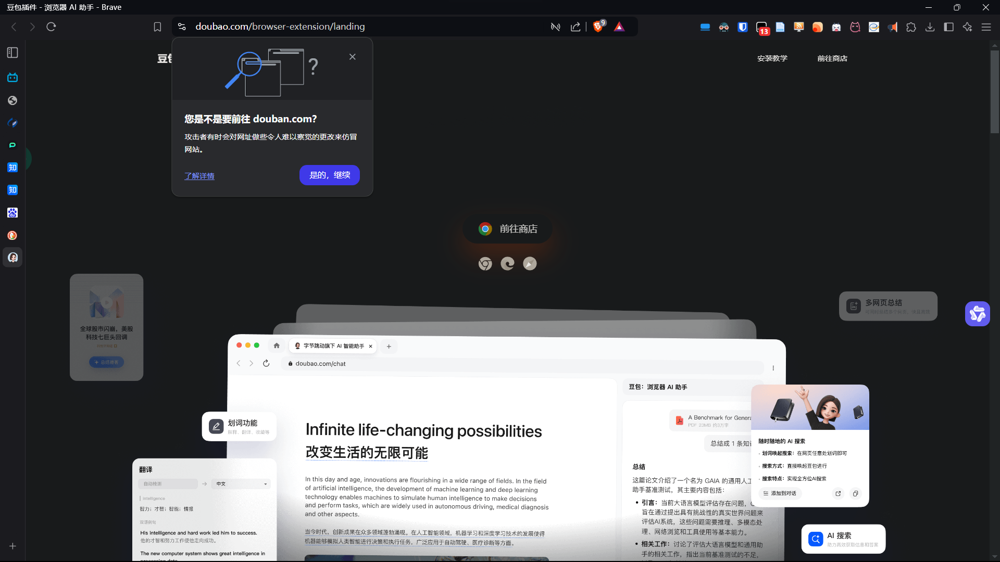
		- Microsoft Copilot
		  id:: 65bcbf4a-a87e-4ced-9252-33d77393097f
			- Edge浏览器的侧栏版，“Bing Chat”；用于咨询、辅助写作
			- [新版本edge自带免费GPT4侧边栏应用（Copilot） - 知乎](https://zhuanlan.zhihu.com/p/663109668)
			- ((65ab4094-afae-49f4-8d8f-d354f912b62e))
		- Sider插件（功能比Copilot多些；Painter，AI绘图，玩玩）
		  id:: 65ab4567-90f8-4360-b3d0-458aed2e8abb
		  collapsed:: true
			- [浏览器新插件"Sider"！人工智能助你畅享智能搜索体验_哔哩哔哩_bilibili](https://www.bilibili.com/video/BV1qh4y1y7X9)
	- 浏览器翻译
	  id:: 65961c22-eba4-4340-aedf-2b60a6637a79
	  collapsed:: true
		- 有时不认识的单词偏多，或是都认识但外语阅读速度还是不比母语要赶时间
		- [沉浸式翻译 - 双语对照网页翻译插件 | PDF翻译 | 视频字幕翻译](https://immersivetranslate.com/zh-Hans/)
		  id:: 6717b801-28d1-47a8-a284-25ce1f20149c
			- ((6717a2de-ef53-4f77-bcef-a9bd0b3f0204))
			- 译文与原文同时显示
				- 翻译文本会否无意识干扰原文阅读？
			- 可以拖动打开本地电子书进行双语阅读
		- ((670e806c-1ccc-42f5-a0b8-6c70790a5d1b)) 自带的可用于简单浏览
		- ((65adc5dc-0fb6-455c-b69e-cb49fbb557fd))
		  id:: 65a920ca-351e-46c1-9ede-3869c992da68
	- 获取链接的网页标题（写作时可能需要，有时无法直接获取正确标题）
	  collapsed:: true
		- 收藏/添加书签，复制名称，之后可以按需取消
	- 获取搜索页/新标签页图片
	  collapsed:: true
		- 右键“检查”-“Sources”
	- 确定网页、图片日期（有些没标）
	  collapsed:: true
		- ((667b8a03-93b1-4428-87a2-a076428fceab))
		- 图片文件名
		- 图片中的元素
		- ((667b89e7-4177-49ea-8db1-ed4cd98638d8))推测
	- ---
	- [谢谢清华！清华大学出的这6款免费工具神器，我超爱第四个 - 知乎](https://zhuanlan.zhihu.com/p/559341387)
	- UA标识
		- [微软带头打了30年，这场屏幕里的大乱斗，终于要结束了。。。](https://mp.weixin.qq.com/s/WdTRq31CRjy90KiN88dwtw)
- 是大人就上大人的网
  id:: 65ab10fa-6f37-4dc7-8693-ded8722181de
  collapsed:: true
	- 以下为个人描述，不一定对
	- 百度网盘免费空间比较大，盗版资源放加密压缩包里一般就不会被和谐
		- [有哪些比较好的百度云盘防和谐的方法？ - 知乎](https://www.zhihu.com/question/417192245)
	- 上网同理，上网就是不断下载和上传流量的过程，流量加密后，就能够把一般带不回去的走私品带过海关，虽然海关因为看不出具体内容而会持续怀疑、关注走私者，但一般不会拦截流量，不经由它们搞出不得了的大案的话，一般不影响正常使用
	- 最主要的方式是加入走私团，除此之外就是多花钱请人帮你办好走私船等全套
	- 前者的低端费用一般不高于0~5元/月（流量加密软件的下载网页附近可能有广告页），但相关节点的IP可能被部分网站拒绝，因为同节点IP共用的人多
	  id:: 65bcbf4a-1d6c-47ef-8c6b-938a250e7d28
	  collapsed:: true
- GitHub
  id:: 66dba0bf-fbe3-460c-a8ba-e2bdc7fde7e8
  collapsed:: true
	- 章鱼猫
	  id:: 6705f144-ae01-42e6-8591-ac37d7207123
		- “想要编程你的猫”——《学猫校》
		- [10 年老程序员也不一定知道的 GitHub 的故事GitHub，是每一个程序员必知必用的开源协作平台，从 2008 年 - 掘金](https://juejin.cn/post/6962399422177083429)
	- 下软件常用
	- [每日一学：GitHub还是GitLab？谈谈两者的区别 - 知乎](https://zhuanlan.zhihu.com/p/480999178)
	- GitHub打不开怎么办？
	  id:: 67402acb-9a37-48c8-843f-077a630cf20b
		- [【Watt-Toolkit】实用工具，免费加速器，下载以及介绍使用，原名Steam++_哔哩哔哩_bilibili](https://www.bilibili.com/video/BV1v94y1x7hy)
		  id:: 65d2ecf3-8af1-47e4-9219-317a3d501fe1
			- 能加速的网站不多，但够看本站和当“加速跳板”了——“这个公司搞加速也不注重重点关注，糊涂啊”——在“网络加速”界面勾选Github再点击“一键加速”
			- [Steam++官方来B站啦_单机游戏热门视频](https://www.bilibili.com/video/BV1JQ4y147F4)
		- [EasyHosts: 快捷打开hosts文件，并进行编辑备份处理 也可手动刷新最新的github配置，方便连接github](https://gitee.com/xiaoyutou_647/easy-hosts)（没试过，好像适用于windows系统）
	- ((658fc4ca-21a3-49e7-a6b8-6277d16e0062))
	- 对上面的软件有额外的问题看issue，[[Minecraft]]等游戏mod等也是类似
	  id:: 66624d52-32be-4f9c-9135-7987fe38b36c
- [[AI]]
- 存储、硬盘、下载、备份
  collapsed:: true
	- 手机用app可能挺简单，但电脑不一定是这样的，因为电脑用户可能有更高的要求
	- “基本操作”
		- 移动文件（“拖文件”）
		  id:: 66db8ac4-19d8-408b-81a8-f0cef6d29782
			- 按住shift，批量选择时避免拖动单个文件或文件夹
			- {{embed ((65d2ac4b-656d-47f8-8903-4e34e05ce1ba))}}
			- 拖文件时可以不松鼠标，同时切换窗口把文件拖进去
			  id:: 6725f293-64eb-42b7-a39a-396aafb271f0
		- 文件重命名
		  id:: 665acddd-fdd6-4849-a546-6c33ea6d20a8
		  collapsed:: true
			- 慢点两下文件名（“哈哈，今天才偶然试出来”）
	- 电脑本地存储
	  collapsed:: true
		- 电脑硬盘（可能）没手机的那么容易被微信之类的软件塞满，但无论如何，整理是美德的体现
		- 文件管理
		  collapsed:: true
			- “自己的硬盘，自己的管理，不要搞得像很多人的微信群聊一样漫不经心”
			- 我的方案
				- 不共享的一般安装到默认区域，下载、截屏等放桌面（按项目类型排序；便携版软件放C盘，常用且不开机自启的发送到桌面快捷方式；我就一个C盘，没分过区，扁平化管理）
					- 桌面管理
						- 移动桌面路径
							- 可以在资源管理器里右键“桌面”-“位置”-“移动”到一个新建文件夹（建议重命名为英文，少数软件可能不支持中文路径），“桌面”会增量（在原文件夹内容上做加法，所以如果要移动到已有文件的文件夹要先看一下合不合适）占用（“附身”）该文件夹
						- Fences
						  id:: 670e7c2a-b293-41c4-9a5a-6697d0676772
							- 双击隐藏桌面图标
							  id:: 673edb30-68eb-44a9-a867-6115ab372287
							- 按打开次数排列桌面图标
							- 在桌面建立分区管理图标（“用户的桌面图标越多，这个核心功能越可能被启用”）
							- [桌面图标自动整理 Stardock Fences v5.84.7 多语言破解版_系统设备软件_知软博客](https://www.knowr.cn/syssoft/fences5.html)
							  id:: 670e7c36-ea6d-4199-9131-a89329116d82
							- [让你的桌面不再一团糟，Windows 桌面整理工具：Fences - 知乎](https://zhuanlan.zhihu.com/p/30647696)
				- 共享的放C盘，因为用户名不一样影响文件夹和文件的绝对路径
					- ((65c589f9-342d-42c5-818c-f363a95b3847))
			- 双链文件
				- hook/hookmark（mac）
					- ((66dba0bf-965e-4175-8f5f-8b14c7daeeaf))
					- [Hookmark – Links beat searching](https://hookproductivity.com/)
		- 快捷查看Windows文件夹大小（“保卫我们的现代硬盘”）
		  id:: 65ba5239-07b1-45c4-8b47-fe09a78658a0
		  collapsed:: true
			- WizTree
			  id:: 6726bac3-370c-4425-9742-fe68ddaa9ded
				- [堪称扫描速度最快的硬盘空间分析器 ——WizTree - 知乎](https://zhuanlan.zhihu.com/p/183979921) #伊德格拉米
				  id:: 65f1264e-69d1-4d99-b069-c347e97b8ce6
				- 更快，显示隐藏文件（包括隐藏的系统文件）
			- [Folder Size Explorer for Windows freeware download](https://www.folder-size-explorer.com/download-folder-size-explorer.shtml)
		- TODO [微信dat图片批量解密、查看、整理工具：WxDatViewer 2.5[2022.8.31] - 『原创发布区』 - 吾爱破解 - LCG - LSG |安卓破解|病毒分析|www.52pojie.cn](https://www.52pojie.cn/thread-1529348-1-1.html)（大量微信图片里可能有有价值的）
			- [今天，来破解微信最烦人的地方！ - 知乎](https://zhuanlan.zhihu.com/p/586545195)
		- ((66b608a5-a819-4691-bec0-1846651815bc))
	- 手机本地存储
	  collapsed:: true
		- 电脑微信qq等能把手机端的聊天记录等信息全部同步吗？
		- TODO 手机内容导出备份
		- TODO 手机文件导出并加密
			- 手机存储空间不够，拍照内容大变化，看以前的零行动力图片玉玉了不想在手机上看到它们，你又没钱或信不过这些云存储服务，那么可以导出并加密，防止别人或自己无意又看到
		- ((668ce754-474c-4f7e-8138-fe8f5df97671))
	- 局域网（比如同一WiFi）
	  id:: 67183830-1fe4-465d-9d04-1994e5ebe1e3
	  collapsed:: true
		- [GitHub - localsend/localsend: An open-source cross-platform alternative to AirDrop](https://github.com/localsend/localsend)
		- 一些 ((65bdc728-d4a7-4ed1-949f-1ee817c4c0f2)) 也行
		  collapsed:: true
	- 云存储
	  id:: 670d40f3-8c52-4df3-8019-5095ab11840a
	  collapsed:: true
		- 用其他设备可能要注意论文等工作是否已上传（比如WPS的），再关闭
		- [RaiDrive - 像 USB 驱动器一样安装云存储](https://www.raidrive.com/)
		- [WebDAV - 维基百科，自由的百科全书](https://zh.wikipedia.org/wiki/WebDAV)
		- [[网盘]]
	- 校验/防伪/防盗版
	  id:: 642fe53e-2f59-4f7f-ad9f-b43a14d7aab2
	  collapsed:: true
		- 软件和邮件等文本
		- 部分软件（尤其是安全相关软件）的发行者会在下载页面或其附近提供校验方式
		- 循环冗余校验（CRC）
		- 校验和（checksum）
		  collapsed:: true
			- 有7-zip的话，可以右键文件-7-zip-CRC SHA-选择相应的校验算法（但不全）
			  id:: 65bcbf54-4aa6-42cb-b1b9-64fc13757ff2
				- [7-zip 额外hash插件 - 『精品软件区』 - 吾爱破解 - LCG - LSG |安卓破解|病毒分析|www.52pojie.cn](https://www.52pojie.cn/thread-1541858-1-1.html)
			- [MD5 、SHA1、SHA256 校验工具 - 知乎](https://zhuanlan.zhihu.com/p/388383489)
		- 数字签名（digital signature）
		  collapsed:: true
			- PGP签名（如GnuPG）
				- 需要准备
					- 三个或两个校验用的文件：数据（即待校验文件，一般是你下载的文件，如各种软件的某版本的安装包）、（默认文件名称相同、与的）签名（signature，文件后缀名为.sig，通常在下载列表中与数据成对挨着）、证书（certificate，也可能被称作signing key、release key、public key等，暂时没找到在哪下载可以先不管）
					- 一个软件：GnuPG，下载（“校验码校验”）安装（“数字签名校验”）对应操作系统的版本
				- 文件校验（部分重视文件安全性的发布者会在下载网页提供校验信息）
				- 校验流程
					- 有下载的证书先双击导入，然后双击签名开始校验（数据不同名的话需要选择），没有证书的可以校验时搜索，然后认证
				- 科普
					- [Verifying signatures | Qubes OS](https://www.qubes-os.org/security/verifying-signatures/) ——来自Qubes OS文档的细致严谨、一波三折、鞭辟入里、发人深省的科普（“持续微信”）
					- [Verifying Software Signatures - Kicksecure](https://www.kicksecure.com/wiki/Verifying_Software_Signatures)
					- 信任网络（WOT）
					  id:: 64631f00-38bd-46d0-a696-e1f1e8961697
						- [Download the Whonix ™ Signing Key for VirtualBox, Source Code and APT Repository](https://www.whonix.org/wiki/Main/Project_Signing_Key#OpenPGP_Web_of_Trust)
						- [5.6 信任网络 Web Of Trust · HonKit](https://happypeter.github.io/web3book/05-pki/wot.html)（中文的）
						  id:: 64631f00-40c9-4ba0-a68c-4b94a1c2e768
- 手机应用商店
  collapsed:: true
	- Google Play 商店（安卓）
		- [解决Google Play（谷歌商店）此商品无法在您所在的国家/地区购买或下载_google play未在您所在的地区提供此应用-CSDN博客](https://blog.csdn.net/2401_82790989/article/details/135819147)（在应用信息中清除数据或结束运行，然后开启节点打开）
			- ((65bcbf4a-1d6c-47ef-8c6b-938a250e7d28))
	- [在APKPure上快速免费下载安卓APK](https://apkpure.net/cn/)
	  id:: 66d8f6e3-9fbc-458e-89bb-9f7b8c54aed6
		- [MIUI禁止多APK安装?，如何关闭MIUI优化? - 知乎](https://www.zhihu.com/question/476845644)
		- [GitHub - adhu2018/xapkInstaller: 小米安装xapk需要关闭MIUI优化，但是这样会导致软件的权限设置被重置，被搞烦了，所以就有了这个。。](https://github.com/adhu2018/xapkInstaller)
- ((6699a046-6a47-4283-889d-e6bd22a6cd94))
- 资源站/软件站
  id:: 670d40f3-0fcb-4d21-a439-e716e740a477
  collapsed:: true
	- （网站）镜像站
		- 方便在没法上网的情况下部分上网，搜索“镜像”
	- [ITEM - 链接更多选项](https://www.item.ink/)
	  id:: 668f8021-44cb-44b7-aea2-0b3701466195
		- [路漫漫在线动漫-在线动画,日本动漫,国产动漫,动漫免费在线](https://www.lmm52.com/)
			- [ʕ·͡ˑ·ཻʔʕ•̫͡• ʔ•̫͡•ཻʕ•̫͡•ʔ•͓͡•ʔ  爱看动漫的小路路](https://lm.qg50.com/)
	- [异次元软件世界 - 软件改变生活！](https://www.iplaysoft.com/)
	- [奔跑中的奶酪 - 有智，有趣，有爱](https://www.runningcheese.com/)
	- [ACG盒子 - 专注ACG的导航盒子_ACG导航网站](https://www.acgbox.link/)
	- ((668e501d-b441-4900-b123-8a1e830ae2a6))
	- 小工具
		- [LZL在线工具——LZL TOOL](https://www.lzltool.cn/)
		  id:: 6698c5dd-e391-456d-949e-b016583bfdc0
		- [Web Apps by 123apps - 编辑、转换、创建](https://123apps.com/cn/)
	- 破解软件站
	  id:: 66dba0bf-8c58-43ad-acc3-c5cd881c98cf
	  collapsed:: true
		- [吾爱破解 - LCG - LSG|安卓破解|病毒分析|www.52pojie.cn](https://www.52pojie.cn/)
		- [423Down](https://www.423down.com/)
		- [歪果不求仁 - 国内外优秀资源分享酷站](https://www.wgbqr.com/)
		- [果核剥壳 - 互联网的净土](https://www.ghxi.com/)
		- [知软博客 | 免费分享软件、模板、技术教程的网站](https://www.knowr.cn/)
	- “高手”
	  collapsed:: true
		- 软件
			- [Littlefean (Littlefean) · GitHub](https://github.com/Littlefean)
				- ((6698aea2-0faf-4a31-9ef9-50ae9aec16be))
			- [易姐的博客](https://shakaianee.top/)
			- [首页|OhYee 博客](https://www.ohyee.cc/)
			- [IYATT-yx 的博客 – ideology and talent – 引序](https://blog.iyatt.com/)
		- [Beyond the Void](https://byvoid.com/zhs/)
		- [刺猬熊 - 知乎](https://www.zhihu.com/people/chen-che-52)
		- [江浩栾 - 知乎](https://www.zhihu.com/people/bao-bao-zhuan-shu-55)
			- ((67176a78-104a-4803-b244-4193cee6ae6e))
		- “百科全书”
			- [黄博士网: 教育网, AI数学手册计算器软件，电化学虚拟实验室，虚拟电化学工作站，电化学软件](http://drhuang.com/chinese/)
		- “民科”
			- [[气功]]
			  collapsed:: true
				- [花下眠](https://www.douban.com/people/52447511/?_i=5678721sO0McmU)
				- [无药堂主人 - 知乎](https://www.zhihu.com/people/zuo-ye-xi-feng-8)
					- 公众号“无药堂”
				- [Carlos | Z-Library](https://zh.z-lib.gs/profile/6392564/963d41)
			- [银翁 - 知乎](https://www.zhihu.com/people/yin-weng-lao-ren/posts/posts_by_votes)
			- [共生体文明 - 海云青飞 官方网站](https://tuenhai.com/)
			  collapsed:: true
				- “大概新增了两三个库了”
				- [传播正确的方法 - 正确的方法](https://cn.chinese-blog.org/)
				- ((66dbc0fd-7482-46c8-bdf4-5797bdbffe9f))
			- [夷人 - 知乎](https://www.zhihu.com/people/chen-gui-hui-64)
			  collapsed:: true
				- ((66db8a9b-4dd9-409d-80ac-e57e0ff13130))
				- ((6437d183-ded4-496e-825e-fdbc79354e88))
				- ((66db8adf-8b99-446f-b4b4-fda086b1e3ee))
					- [夷人的想法 - 知乎](https://www.zhihu.com/pin/1814975306265673728)
						- [The New Zealand COVID vaccine data shows that the shots make you more likely to die](https://kirschsubstack.com/p/the-new-zealand-covid-vaccine-data)
				- [[伊维菌素]]
	- [科创网 - 发展科技爱好，倡导科学理性](https://www.kechuang.org/)
- ---
- “外物”
  collapsed:: true
	- ((65bcbf4a-9e93-444b-abf8-8d4254e5989c))
	- 导航
		- TODO 模拟导航（“中卡模拟器是吧？”）
		- 百度地图
		  id:: 6712707b-1d35-45b4-90a5-b0ac7a507d95
			- 在选择路线页面点右侧“三个点”-“沿途搜”，或在导航页面说“小度小度”或点“向上三角”-“设置”-“沿途搜”（停车操作，注意安全）
			- 马克地图（识别并收藏小红书等的链接内的地点）
			- 收藏路线
			- 路线分享
				- 手机端好像分享不了，链接在微信打开只显示网页端那样的起点和终点之间的路线
					- 高德手机端可以
				- [手机版百度地图上的导航路线，居然无法发送到车机端？_百度地图吧_百度贴吧](https://tieba.baidu.com/p/9143753494)
			- 模拟导航
			- 组队出行
		- ((670d4119-054a-4fd2-aa01-cec57e99ce42))
	- 测量
	  id:: 66975f62-8787-470c-ba2d-152fc023c7eb
	  collapsed:: true
		- ((66db8af0-4f30-4eb1-aebf-2a9c97bb438e))
		- TODO [万物皆可测量 (豆瓣)](https://book.douban.com/subject/36347909)
		- [[时间]]
		  collapsed:: true
			- 软件使用时间记录软件
			  id:: 66db8b0c-0180-4c7e-8a87-6df0379118bd
			  collapsed:: true
				- 记录现在，分析过去，优化未来
				- 复盘时间等的利用效率、投入产出比等，进而可能调整任务本身
				- [谁说大数据比我更懂自己？我用软件监控我自己_哔哩哔哩_bilibili](https://www.bilibili.com/video/BV1pB4y187Pj)
				- ManicTime
				  id:: 66f8dbe7-36a4-4d4d-b042-eb887719589f
				  collapsed:: true
					- [ManicTime Pro v2024.1.0 Beta 修改版 - 果核剥壳](https://www.ghxi.com/manictime.html)
					  id:: 66f771b1-079d-4d95-9e49-d164ddb4fbfd
						- 我的用了大概一周，然后有次几天没关机，关机后第二天再开机，就弹窗剩23天然后不断弹选择方案，然后装了2.0.6版本也一样——于是目前没在用
					- ==这玩意还有点复杂，有空再重新整理一下这个“教程”==
					- 上部分了几个时间轴（也就是不同“统计口径”）
					- 左下部可以单击首栏切换不同排序方式
					- 当“历史记录”用
						- 在下部“筛选”处可以搜索当天，最右边点“高级搜索”可以搜索全部
						- 点文档轴可以查看“网站”和“文件”（好像只能看到文件夹），可以右键打开
						- 点程序轴然后在右下部
							- 双击，在左下部显示对应群组/软件的活动记录
							- 框选，在上部时间轴以阴影柱显示对应群组/软件的使用时段
					- 当“时间限额提醒”用，点上部程序轴-右下部右键“创建提醒”
					- 时间统计
						- 我的自动标记及编制理论
							- 大致按“开机后的顺序”、“一般工序”降序排列
							- 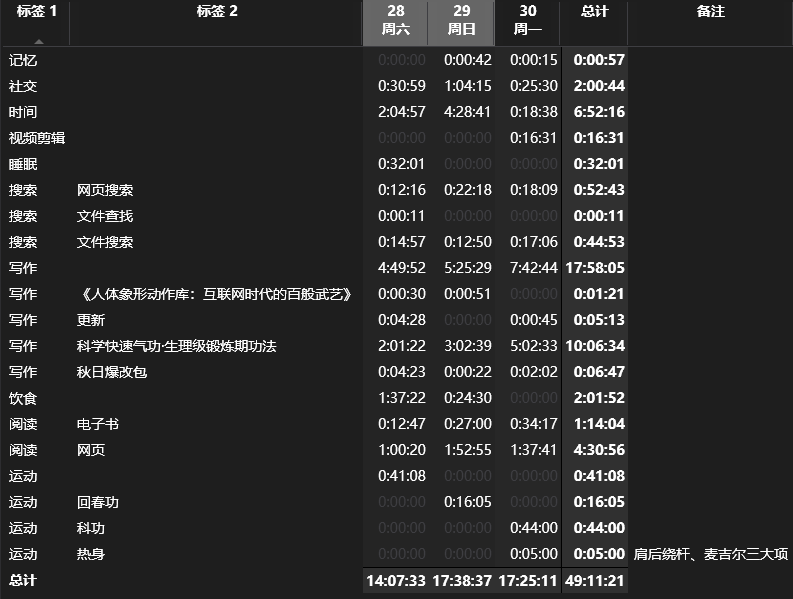
							- 记忆： ((6667cc31-4d38-4a64-b274-e05bea3f6dba))
							- 社交：微信、QQ、腾讯会议
								- 设置了提醒，“闲谈不得超过30分钟”
									- 这下也减少了犹豫，“想说不得不说”了
							- 写作： [[Logseq]]、 ((65bcac14-f887-4224-92e2-1d16751f358d)) 、 ((66db8ac4-3ffd-4d93-84d6-c26cb6a4378f))、 ((66fa4048-7685-4100-835d-66cc13179358))
							- 阅读, 网页： Brave浏览器、clash、wechatappex x64（电脑微信浏览器，看公众号文章等）
							- 阅读, 电子书： ((66ade382-2ec5-41e5-9e02-1a0d9600420a))、 ((65c87486-2409-4dc2-9a78-144d3e313ac3)) 、 ((66ade382-442e-4b75-8284-b0a0cbd49359)) 、 ((66977eab-15bb-4c30-b190-bde481b16cf8))
							- 搜索, 网页搜索：规则：文档轴，标题“?q=”
								- “搜索”，我看“网页”（“上网”？我电脑开着就在“上网”啊）要干什么？“玩”吗？就是“玩”也要会搜，否则说不定找个攻略都要找半天。我要“搜索”和“阅读”（包括视频）并且分别考核，要搜得巧，读得巧，而“网页”和“电子书”是搜和读的来源
								- 搜索也是阅读，英语考试单选题读一句话也是阅读，所以搜索和阅读的时间可以重合
							- 搜索, 文件搜索： ((66ade382-2ec5-41e5-9e02-1a0d9600420a)) 、 ((66934b21-3076-44f9-ab9c-c9c1b2e488c6)) 、Windows 资源管理器（explorer）、搜索（seacrchhost）、开始菜单搜索栏
								- 手动点开一层层文件夹找到“文件”也是“搜索”，甭管我事先要不要找，找到之前都是搜，在网上搜也经常搜到事先不知道的东西对吧？
							- 写作, 更新： ((659c981c-4681-4798-87dc-9cddea73f56e))
							- 时间： ((66f8dbe7-36a4-4d4d-b042-eb887719589f))
							- 运动, “各种项目”
								- 可能加上“运动强度”
								- 有时多天不练，自己也不确定哪种运动更有性价比
								- “也为了展示、说服”
							- #“我放弃了......”
								- “饮食”包括“吃”的时间，也包括洗碗（在家不能完全白吃白喝，家务做一点——但它不是家务，是我换“吃”的活动，如果我工作挣钱，那么挣够饮食费用的时间也是饮食时间）、刷牙（跟着洗碗；不吃可能不刷）、（可能跟着“吃”的）大小便（不吃就不拉—— ((66db8b02-1b62-45a9-bf3f-8cc1fa51b0a2)) ）等时间，这也是基于对“辟谷”、人本来就知道怎么“吃”（没啥问题就是吃得还好，所以具体吃了多久重要吗？可能还是了解一下自己为了饮食总共花了多少时间比较重要）等的认识
									- ((66ebc97c-a64d-4e17-8f7d-d0778968521f))
								- “睡眠”，不开电脑就没在工作，没工作又没饮食啥的显然就在睡觉——虽然还没搞懂为什么开机后之前不算离开
								- ((66f8b797-36af-4f35-b2fa-9221a01708de))
						- 在标签轴的才是“未标记”界面中的“已标记”时间——没有实际需求的话不必纠结，不是所有未标记都需要被标记
						- 一个群组可以标记为多个不同自动标记或标签（手动标记）
							- 当你在特定时期（不需要是“每周月年”，统计时可以设置日期范围）或持续投入特定项目时，可以笼统地（“一整天都在忙这个”自动标记，或是大块时间方便手动标记）或具体地（比如通过浏览器、笔记软件、电子书阅读器等软件的窗口标题或自定义筛选等归口），之后你可以回顾复盘用了哪些软件干了什么，等等
						- 点“程序”轴，然后在右下部
							- “添加到自动标记”后是自动标记到自动标记轴
								- 之后可在自动标记轴左下角“自动标记编辑器”或右键一个自动标记“编辑自动标记”打开自动标记编辑器
									- 编辑自动标记本身
										- 比如用什么颜色，是否可计费
										- 在“高级”中可设置自动标记类型，“合并”是自己的自动标记隐身、时间相加，“附加”是自动标记加到后面合并、取时间重合部分，“Prepend”则是加到前面
											- 比如“搜索, 网页”可能设置为Prepend于“阅读, 网页”，如果你认为搜索网页（大部分时间大概在“浏览搜索结果”）不算阅读网页的话
											  id:: 66f8b797-36af-4f35-b2fa-9221a01708de
									- 右键双击修改规则（适用于什么群组等）——标签编辑器同理（虽然有些不太一样）
									- 不确定哪些程序尚未添加到自动标记的话，还可（“过一天以上”） ((66f7bd19-fb1f-43b3-9284-151e875c8d58))，在右下角的高级搜索中也可搜索全部未标记活动
								- 复制当前的自动标记轴到标签轴（可以不用，等需要时再用再复盘也很容易，目前只发现在“统计信息”界面的“常用标签”能看一下对应的图标或表格）：点“标签”-“将自动标记复制到标签”（只能复制当天的）或“将自动标记复制到多个日期的标签”（复制日期范围内对应日期各自的自动标记）
									- 复制后会自动生成对应自动标记的标签（“但颜色好像不太会复制过去”）
									- 之后产生的未标记活动不会自动从自动标记轴复制到标签轴
							- “标记此群组”后是手动标记到标签轴
								- 点上部“标签”-“仅显示未标记的活动”，可能方便手动标记
								  id:: 66f7bd19-fb1f-43b3-9284-151e875c8d58
								- 在时间轴空白处双击或左键单击拖动时间范围可以手动标记标签
								- 可在添加标签时点击“$”按钮或右键标签轴设置为“可计费的”，可用于“（实际工作时间的）时薪”（“摸得越多，实际时薪越高，这下摸鱼爽了，摸多摸多”）、“收费时间”（如果甲方能够接受按时间收费，也许可以发给他们对应的项目记录以确认你花了多少时间解决问题，而不会因为“想到哪干到哪”而不方便记录——截图间隔可以调快，截图可以按截图文件名搜索并做成超低帧率视频，但目前具体怎么搜还没试）等的计算
								  id:: 66f7bd19-15a9-4a6e-80d6-c440b949180d
								- 默认未使用计算机10分钟以上标记为离开，回来后自动弹窗，可为“锁定”、“关闭电源”（睡眠、关机等）等添加标签（“运动”、“饮食”、“睡眠”等）——不想区分的话可以“添加到自动标记”
									- “这下更容易好好吃饭了——还真是！”
									- {{embed ((66f74590-34bd-4cf6-b1c5-d0e1ecd33e9b))}}
							- 用英文逗号（和空格——否则在给群组添加规则时选择自动标记会多出来一个带空格的自动标记，还要重命名原来没空格的自动标记合并）隔开可以设置多级自动标记或标签
							  id:: 66f8a030-103e-4897-9aae-8c539b82c4c5
								- 比如“搜索, 网页”并设置标题为对应搜索引擎网站名称；比如“应试, 笔记/作文/刷题”
								- 在“时间表”界面可在“高级”-“分组依据”处设置为并将只显示（其实还有总的时间）对应层级自动标记或标签的报告，这样可以在报告中忽略没有特定目的的活动
							- 旧标签可以替换为新标签（自动标记复制覆盖也行，但不确定能否覆盖全；建议等自动标记都设置满意、不太会改了再“集中整治”）
						- 上部“时间表”界面可以统计，注意时间轴“标签”、“自动标记”如果都选，可能会重复计算
						- 其他（没试过）
							- [Win 开机自启动顺序 - 忽如一夜春风来~ - 博客园](https://www.cnblogs.com/TaoSec/p/18236321)
							- [ManicTime使用笔记-CSDN博客](https://blog.csdn.net/appleyuchi/article/details/131031207)
							- [PKMer_Obsidian 插件：ManicTime](https://pkmer.cn/Pkmer-Docs/10-obsidian/obsidian%E7%A4%BE%E5%8C%BA%E6%8F%92%E4%BB%B6/manictime/)
							  id:: 66f7b266-2e48-4887-a9e4-0f1489490b6e
					- 需求或待办
					  collapsed:: true
						- 软件
							- 自动生成报告（“看群里打卡看的”）
								- ((66f8a030-103e-4897-9aae-8c539b82c4c5))
							- 微信聊天（不点开窗口就只是“微信”）
							- 使用次数（更直接地显示，不用高级搜索，最小时间范围小于一天）
								- “点开看5秒一天看12次就是1分钟，一年就是6小时”
							- 切换/跳转关系（链/图谱）
								- ((66e17ed2-18bd-49c0-a852-d3c262f7f278))
							- 关闭（比如时间很短，尤其是连续关闭时——好像没啥必要，“不看=关了”）
							- 自动关联不同软件的任务/项目（“先在A整理，再移动到自动标记的B，所以到底算哪边的？”）
								- 多次往返切换
							- 停留但没（100%）使用
								- 可以监测鼠标、键盘等的活动状态
								- “思考下一步干什么”
								- 不在电脑前
									- 综合饭点等时间段，统计时可以设置时间段折算时间
							- 阅读速度
								- 可能电子书阅读器等就可以有
								- 读取电子书数据
							- 情绪、疲劳程度等（“然后提醒一下炸一下是吧？”）
								- “无意义活动频率”（“反复开关音乐播放器”）
							- 设备外活动
								- 可能家里装摄像头加AI可以
				- ((67048d3f-73b1-4aab-ad07-9d431b2a4a95))
				- ---
				- [Windows有啥好用的时间跟踪记录（time tracker）类软件？ - 知乎](https://www.zhihu.com/question/22059154)
				- [GitHub - newdraw/AppTime: 桌面时间管理 Desktop Time Management](https://github.com/newdraw/AppTime)
				  collapsed:: true
					- 只记录应用的窗口时间，不记录每次打开、切换窗口、关闭等的时点
					- 没有搜索
					- 没有手动记录时间
					- 持续录屏（不录音），在浏览器界面显示为可以移动光标切换的单帧图片轴
						- “它这个录屏文件挺小的me，让我看看帧率——原来是，‘一帧能玩’”
						- 但其实比较鸡肋，与manictime比
				- >手机、电脑上的时间记录APP和应用软件推荐
				  推荐一下手机和电脑上经常用到的各种APP和应用软件名称，大家可以根据自己的需要进行选择。
				  电脑自动记录推荐应用软件：
				  PC：RescueTime、Hronos、manictime
				  Mac：Timing
				  手机：
				  手机上可以使用专门的APP来追踪不同APP的使用时间、手机的使用时间、解锁次数等信息。
				  自动记录推荐APP：
				  安卓：24PI
				  苹果：Moments、Moves
				  手动记录推荐APP：
				  安卓：Time Meter
				  苹果：iTimelog2
				  ——《奇特的一生》
			- 专注（“也可以是减小过度专注的附带风险，比如视力受损”）/番茄钟
			  id:: 67402acb-20dd-4686-bcbf-2460a2b26b52
			  collapsed:: true
				- 就避免 ((6665212d-3c62-4628-b59e-c24c4596b6fb)) 而言可以当“辅助轮”用，等身体形成敏感性了就可以不需要了（“真的吗？我不信！”）
				- [番茄连招_哔哩哔哩_bilibili](https://www.bilibili.com/video/BV18i421e7Qx)
				- ((66f8dbe7-36a4-4d4d-b042-eb887719589f))
				- [Pomodoro technique - supermemo.guru](https://supermemo.guru/wiki/Pomodoro_technique)
				- Win10、Win11的“时钟”-“专注时段”（也可点击任务栏最右侧快捷设置专注）
				  id:: 665c752a-f1d7-467f-b1b2-d9cc68e82bf8
				- ((66335bd1-9f9f-48e3-a190-127ffa573070))
			- 日梭万年历
			  id:: 66f3c7e2-35a0-4072-8c5c-f555d15d9bee
			  collapsed:: true
				- ((66f3c64a-9039-47f6-a48f-462c6f16052b))
		- 手机传感器
		  collapsed:: true
			- [phyphox – Physical Phone Experiments](https://phyphox.org/)（“网友看文章相关推荐的，还挺好玩——哥们测测你的米粒太”） #物理
			  id:: 66552047-29bb-4d0b-b903-03c0ce419eb5
			  collapsed:: true
				- ((665521e8-f306-44e3-811f-d6a24739d81f))
				- [手机变成物理实验室？6个诺奖的学校做了一个学霸APP_哔哩哔哩_bilibili](https://www.bilibili.com/video/BV1eK4y1Z77v)
				- “音频自相关”可能用来给吉他等乐器调音
				- >打开加速度计
				  以同样高度将手机自由落体至床上和桌面上
				  对比峰值加速度
				  （别举太高
				  这可以直观演绎为什么电子产品的抗冲击性能是以加速度来量化的
					- >嗯嗯，站姿平视软硬床垫分别6、11G，坐姿平视电脑桌面9G（
			- TODO 手机测体温
			  id:: 65ccce98-a9e5-4d64-9658-01efb5f17320
				- ((65ccce61-c8f8-49e9-a439-0aa3d5900296))
					- [An app can transform smartphones into thermometers that accurately detect fevers  |  UW News](https://www.washington.edu/news/2023/06/21/an-app-can-transform-smartphones-into-thermometers-that-accurately-detect-fevers/)
						- [FeverPhone: Accessible Core-Body Temperature Sensing for Fever Monitoring Using Commodity Smartphones: Proceedings of the ACM on Interactive, Mobile, Wearable and Ubiquitous Technologies: Vol 7, No 1](https://dl.acm.org/doi/10.1145/3580850)
							- 华为
								- [华为手机能够测体温，是噱头还是实打实的技术？|传感器|辐射|测温|温度计_网易订阅](https://www.163.com/dy/article/FT1IFCAI0538097O.html)
							- >The researchers are currently working to improve the app’s accuracy by expanding the number of smartphone models that were used to train its machine learning model, as initially just three different devices were used. But they’re optimistic that it could be trained to work with smartwatches, too, which would actually work much better as their smaller size would allow them to heat up faster and allow for measurements much shorter than 90 seconds. FeverPhone may never be approved as a medical grade thermometer, but it sounds like it will be accurate enough to give users a better idea when they might actually be sick, and should be taking appropriate measures to protect themselves and others.
		- ((665d42c6-3660-45f8-ab45-4863e16dff56))
	- 计算器
	  collapsed:: true
		- 可以键盘输入 [[20241017]]
		- [主页 - CalculatorsHub](https://calculatorshub.net/zh-CN/)
		  id:: 665d189b-0428-451f-bbc5-32cf144ad5ec
	- [[二手闲置]]表格
	  collapsed:: true
- 效率
  collapsed:: true
	- 每天省10秒，1年就是1小时
	- 广告拦截/弹窗屏蔽
	  id:: 66975f62-4324-4905-9489-6ee145ec8984
	  collapsed:: true
		- Brave浏览器
		- 浏览器插件
		- 手机APP
			- 李跳跳
			- [四款广告拦截神器，让你远离页内和开屏广告！！_哔哩哔哩_bilibili](https://www.bilibili.com/video/BV18r4y197DM)
	- 窗口标签页
		- TidyTabs Pro
		  id:: 670d40f3-31f6-4a54-af0c-de49db6bf1e5
			- [tidytabs1.22程序窗口标签化整合工具 - 吾爱破解 - 52pojie.cn](https://www.52pojie.cn/thread-1762724-1-1.html)
			- ((671120bc-7192-4e05-a58b-25a2db275541)) 、 ((66ade382-442e-4b75-8284-b0a0cbd49359)) 、[[微信]]等
	- 进程管理
		- Process Lasso Pro
		  id:: 6703ea76-f088-4570-a8de-f1750eb3e72d
			- [Process Lasso Pro v14.1.0.20 修改版 - 果核剥壳](https://www.ghxi.com/processlasso.html)
	- 其他效率
	  collapsed:: true
		- PowerToys
		  id:: cb62e8cd-35a0-460c-8fa4-3cd98cfb7d2b
		  collapsed:: true
			- 一些小工具的集合，主要用PowerToys Run搜索应用等快速启动，快捷键Alt+空格，偶尔用“唤醒”挂机下载上传听直播
			- PowerToys Run：搜索应用等快速启动，快捷键Alt+空格
			- FancyZones
			  id:: 65d2b96f-a901-4642-b354-642fd07c3534
				- 更多分屏布局；可以右键布局。编辑布局时，下方像素点可按方向键精确调整；拖动窗口但不想改变形状时按住shift；但可能对任务栏、截图等造成一些影响
				- 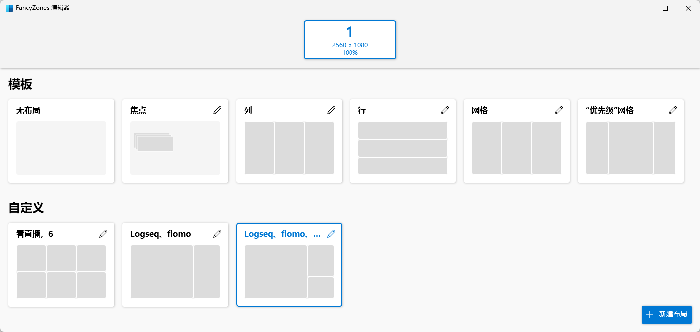
					- “你是懂一心多用、压榨边缘视觉的”
					  id:: 65d2ba62-8eec-44fe-b9d8-c7df7c758358
			- PowerToys Awake：保持唤醒状态，挂机下载上传听直播等
			- 键盘管理器
			  id:: 670d40f3-7e7a-45f8-8461-9f2a236c099f
				- 手动一个个编辑，可录入，无图形化界面
		- Quicker
		  id:: 66db8ac4-d558-458d-9528-499eb66f69ee
		  collapsed:: true
			- 快捷动作，约等于快捷键、快捷方式、批处理的综合
			  collapsed:: true
			- 自动化相关功能收费或限制
			- 好像有破解版
			- ---
			- 弹出面板（默认方式为单击鼠标中键或键盘Ctrl键）
				- Quicker设置（点击Quicker字样右边的“螺母”）
					- 基础设置（默认已选中）
						- 常用辅助功能
							- （屏幕顶边、底边鼠标）滚轮调节系统音量
								- [设置 - 常用辅助功能 - Quicker](https://getquicker.net/KC/Manual/Doc/settings-helperfunctionssettingpage)
					- 辅助功能
					  id:: 65bcbf4a-6899-4481-8a0b-b58afc33858a
						- 轮盘菜单
						- 高级鼠标触发
				- `···`
					- 场景与动作
						- 自带4个“不能删除”的场景，免费版还能加6个
						- 双击编辑场景信息
							- 关联其他程序（比如Chrome浏览器添加我用的 ((670e806c-1ccc-42f5-a0b8-6c70790a5d1b)) ）
			- 组合动作
				- 实现“单”动作多功能（包括省动作格子）
				- [示例：循环切换 - by 治钧 - 动作信息 - Quicker](https://getquicker.net/sharedaction?code=8af98895-ef82-46d1-dbe7-08d7053e26bb)
				- [循环切换 - by 用户abc - 动作信息 - Quicker](https://getquicker.net/Sharedaction?code=e5396bfd-385a-413c-e691-08db2045b077)
				  id:: 673ea903-101b-45df-ad62-7efa3cd7075a
			- ---
			- 以下暂时都没怎么用
			- 我的自制
				- 鼠标手势上划代替小实体键盘的 fn+F2 开启讯飞语音输入（但我仍然很少用，也许“话说不利索”就是“菜就多练”），用全键盘也许可以不用
			- 第三方
				- 截图OCR（无法复制时识别提取文本，比如扫描版PDF）
				- [网页可视化编辑 - by 云之轩 - 动作信息 - Quicker](https://getquicker.net/Sharedaction?code=bbb34bb7-246a-4a80-a45a-08d69a09c458)（见 ((65961c22-eba4-4340-aedf-2b60a6637a79)) ，也可用于复制部分阻止复制的内容）
				  id:: 65ab10fa-a1d4-4814-ba9e-9d5df622d554
					- [相同功能也可以使用小书签代替 - Quicker](https://getquicker.net/Common/Topics/ViewTopic/13305)
				- [剪贴板 - by Cea - 动作信息 - Quicker](https://getquicker.net/Sharedaction?code=9ec53d43-5539-4571-6886-08d8c752bfcb)（复制图片，win11 自带的只能复制一张，且会被后续的文字和图片覆盖抹除；好像也不太可靠）
				  id:: 66975f62-08f9-4edf-8a8c-af1f16039dfb
				- TODO [DeepL - by Poto - 动作信息 - Quicker](https://getquicker.net/Sharedaction?code=1c392b42-ca4c-433a-8110-08d913b316dd)
				  id:: 673ea321-5d73-45ae-a3d1-e05f6fed5fc4
				- TODO [一键剪藏 SuperMemo X 简悦/Instapaper  - by 外接式赛博格 - 动作信息 - Quicker](https://getquicker.net/Sharedaction?code=1e5a993a-1e2b-49a4-20f6-08d93c37ac0f)
				  id:: 673edb91-f94a-426e-b4e2-fe4e65c0d04c
		- 多显示器
		  collapsed:: true
			- [Win11双屏显示怎么设置主副屏-双屏显示器如何每个桌面单独操作 - 系统之家](https://www.xitongzhijia.net/xtjc/20231026/295262.html)
			- [Windows11系统下双显示器应用的快捷键-远景论坛-微软极客社区](https://bbs.pcbeta.com/viewthread-1921393-1-1.html)
			- 副屏
				- [UP自制【开源免费】的【副屏桌面系统】更新，天天工作台9.x公测版更新内容视频版_哔哩哔哩_bilibili](https://www.bilibili.com/video/BV1bK421e7iU)
		- 窗口
			- Windowtop
			  id:: 659c9e71-570c-46ec-8f44-82c8af29f35e
			  collapsed:: true
				- 置顶/固定窗口
				  id:: 65d2ac4b-656d-47f8-8903-4e34e05ce1ba
					- 可用于在文件夹间判断并移动文件，可能比文件管理器的标签页更流畅
					  id:: 67034604-8d9d-4be7-97ee-5a4db8bb5e3e
				- 透明
				  id:: 67160898-3fc5-4b06-a4cc-db9e6ac9c476
					- 可用于重叠（“解谜”）
				- 点击穿透
				  id:: 668de6c1-af4a-4729-835a-d3739b32bb9d
			- 窗口内容合并
				- ((66989865-73d0-4fd3-b9b8-21f550e85d9d))
				- ((65c87486-ec9e-4f42-9b28-84aad8c9896d))
			- 多窗口快速切换、同屏
				- 光用alt+tab等可能是不太够的，可能有打断感，多窗口截屏也需要
				- 屏幕就那么大，不同窗口在显示上有竞争，要挡住其他窗口（包括以半透明的形式，以及一开始就别出现的“开机自启”、“广告拦截”）、与其他窗口共享屏幕还是另外开拓新空间？
				- 虚拟桌面
				  id:: 670d40f3-ba90-400e-aaba-3624af3f2779
				  collapsed:: true
					- [Win10、11快速切换不同桌面快捷键_一起爬山否的博客-CSDN博客_切换桌面快捷键](https://blog.csdn.net/weixin_46561402/article/details/123821807)
					- ((673ea903-101b-45df-ad62-7efa3cd7075a))
				- （单个显示器内）分屏
				  id:: 670d40f3-43d2-465c-a0ee-3a734cd95cd1
					- “手动好像也行”
					- Windows自带的
						- win+方向键（可以连按），或拖动窗口到屏幕边缘
						  id:: 2b578235-4120-4888-bd4f-db1a4d127b32
					- ((65d2b96f-a901-4642-b354-642fd07c3534))
					- ((65d2f0f7-5d1d-438b-a03d-caa26f8b18e0))
					- [AquaSnap Window Manager: dock, snap, tile, organize](https://www.nurgo-software.com/products/aquasnap)
						- 功能比较丰富
					- 手机的
	- 自动化
	  id:: 670343ea-08d7-4d40-b8fb-8d44bbf13af5
	  collapsed:: true
		- [如何在 Windows 上实现自动化？让这些工具帮助你 - 哔哩哔哩](https://www.bilibili.com/read/cv2742358)
		  collapsed:: true
		- ((670d40f3-18e2-419f-8523-1a3b60976e96))
- 在电脑上用手机
  id:: 670d40f3-3aff-449e-91e4-0670a8ded2fc
  collapsed:: true
	- 可能不少人并不愿意为了用手机而低头，就算有手机支架，手机屏幕也小了，而且低手键盘用得好好地要“高抬贵手”干什么呢？
	- ((671aff71-16aa-4fd9-b91c-155a77c78cb3))
	- 安卓模拟器
	  id:: 65c87486-ec9e-4f42-9b28-84aad8c9896d
	  collapsed:: true
		- ((65cb7b37-9546-432d-8e8f-051290a90dca))
		- [别再说你不会用电脑控制手机玩手游了，Scrcpy Mask纯小白教程+常见问题解答_哔哩哔哩_bilibili](https://www.bilibili.com/video/BV1Sm42157md)
		- “手机并没有被冷落，只是换个地方打开罢了”
			- 主用电脑的人可能不太喜欢点开看手机上的一个个APP，比如微信小程序能用电脑微信的就不用手机微信的
		- 还有就是先在安卓模拟器上测试一下
		- 可能遇到的问题
			- [此应用无法在此设备上运行 | 夜神模拟器帮助中心](https://support.yeshen.com/zh-CN/often/nhgl)
		- 案例
			- ((65d14aa7-432a-4861-8fe9-c18d3d5dcbd7))
			- TODO ((65d367ca-7a9d-4e9b-a7ba-cc0556bfda5d))
- collapsed:: true
  ---
- 文本
  collapsed:: true
	- [[键盘]]
	- 复制粘贴
	  collapsed:: true
		- [GitHub - Qin3Yu/PasteAssistant_v.2.0: 模拟键盘输入的文本粘贴，绕过学习通等网站的禁用复制粘贴检测，支持中英双语粘贴。](https://github.com/Qin3Yu/PasteAssistant_v.2.0)
	- 输入法
	  id:: 6697781d-d2e1-422a-ab2f-d8dbddbd433b
	  collapsed:: true
		- 拼音方案
			- 双拼（比全拼省时省力省键盘，“盲打”因为按键少了出错率也较低）
		- 词库
			- 专业词库可以提高信噪比、减少备选成本
		- 自定义短语
		  id:: 670e4b8e-44e2-43bf-8a17-c713931e4736
			- [【Windows输入法你了解多少？很多关于搜狗拼音输入法帮你提高效率的功能】 【精准空降到 09:34】](https://www.bilibili.com/video/BV1fu411X7TB/?share_source=copy_web&vd_source=24175964b0df2fcc2c022cae23517fdc&t=574)
			- 一键可以敲更多字
			- 还可以带注释
				- ((670e4aef-dbd3-4d1d-bc7c-f301b96e8a96))
		- 搜狗拼音输入法（用回去的原因：“还是你书读得多”）
			- [Windows输入法你了解多少？很多关于搜狗拼音输入法帮你提高效率的功能_哔哩哔哩_bilibili](https://www.bilibili.com/video/BV1fu411X7TB)
			  id:: 66db8ac4-1edf-4409-b1ac-70381629c92d
				- 拼音翻不出来或不确定不知道拼音的字
					- 拼音后按Tab和部首的全拼拼音首字母或双拼查找
					- 按u或shift+u（双拼；也可以按9）输入笔画拼音首字母
					  id:: 6705fdbf-e094-47f7-b284-7c75d9c37ef6
						- 冂
					- ((6705fdbf-e094-47f7-b284-7c75d9c37ef6)) 后按9，或按任意字母和9后点“AI服务”-“手写输入”
				- [搜狗输入法中，有哪些鲜为人知的技巧？ - 知乎](https://zhuanlan.zhihu.com/p/36467646)
		- 讯飞输入法（拍照识别不出来的“鬼画符”语音识别还不错；与logseq的快捷键冲突，中文状态下按s、d也没法直接搜索；语音识别基本上不用，那么基本上就不用了，可能我得先练练口语试试）
		  collapsed:: true
		- 微软输入法
			- [弃坑搜狗！将搜狗个人词库和所有官方词库导入微软输入法详细教程，附工具及已整理词库-远景论坛-微软极客社区](https://bbs.pcbeta.com/viewthread-1983032-1-1.html)
		- RIME
			- [硬控中医人的输入法_哔哩哔哩_bilibili](https://www.bilibili.com/video/BV1NM4m1U76H)
			  id:: 670e4aef-dbd3-4d1d-bc7c-f301b96e8a96
			- [小狼豪输入法使用小鹤双拼 - 知乎](https://zhuanlan.zhihu.com/p/393044727)（可能显示下载安装失败，不行就试下一个链接）
			- [小狼毫 3 分钟入门及进阶指南LearnData-开源笔记](https://newzone.top/posts/2020-11-27-rime_input.html/)（“符号直接上屏”大概也许要看一下，注意编辑完要save；后面暂时还没完全配置好，好像卡在`/`键的默认设置上了）
			  :LOGBOOK:
			  CLOCK: [2024-01-14 Sun 09:07:55]
			  :END:
			- 另外它默认连空格都不用按、直接出字也挺好，但有时我还是要选的，可我不会
			- [一位匠人的中州韵——专访Rime输入法作者佛振 - 图灵访谈 - SegmentFault 思否](https://segmentfault.com/a/1190000002424698)
		- 输入法输入记录
		  collapsed:: true
			- AI
		- 输入框自动完成
		  collapsed:: true
			- [基于jquery实现的类似百度搜索的输入框自动完成功能](https://www.coder100.com/index/index/content/id/4048510)
		- 小尾巴
	- id:: 67048d3f-73b1-4aab-ad07-9d431b2a4a95
	  collapsed:: true
	  ---
	- 电子书
	  id:: 66975f62-1708-4381-b805-07200efa2e8a
	  collapsed:: true
		- 有些格式的信息比如电子书不方便在线看，或者用浏览器在线看效果不佳、功能不全
		- pdf适合打印，epub等节省空间
		- ((65c589f9-342d-42c5-818c-f363a95b3847))
		- 电子书阅读器
		  id:: 65bdc728-d4a7-4ed1-949f-1ee817c4c0f2
		  collapsed:: true
			- Adobe Acrobat（PDF阅读器）
			  id:: 65ccc097-6439-45f2-89ac-514ad9b275b7
			- PDF-XChange Editor（PDF阅读器）
			  id:: 65c87486-2409-4dc2-9a78-144d3e313ac3
			  collapsed:: true
				- [PDF-XChange Editor 10.4.0.388中文破解版 - 423Down](https://www.423down.com/8466.html)
				  id:: 66e390a2-ab39-424c-b7a5-ee8d63c910a2
			- [UPDF：这可能是我用过最好看的PDF编辑工具 - 知乎](https://zhuanlan.zhihu.com/p/556754865)（看网友用的，可能在MAC上比较简单好看好用）
			- ((6607de11-34e3-480b-aa90-fa288d2b7697))
			- calibre（EPUB、MOBI、AZW3等的阅读器、书库管理器）
			  id:: 66ade382-442e-4b75-8284-b0a0cbd49359
			- [Koodo Reader](https://www.koodoreader.com/zh)
			- [Flow - 在线 EPUB 阅读器](https://www.flowoss.com/zh-CN)
			- WinDjView（Windows平台的Djvu阅读器）
			- txt阅读器
			  id:: 6725eea2-193f-4bfb-a256-4b5ef3aaad15
			  collapsed:: true
				- 拖入浏览器（好像无法排版），但是 ((670d40f3-43d2-465c-a0ee-3a734cd95cd1)) 并按需放大
				  id:: 6725eea9-8c4d-4a5f-be15-5d33c4681374
					- ((6725f293-64eb-42b7-a39a-396aafb271f0))
					- 较长时间阅读建议用 ((65d2b96f-a901-4642-b354-642fd07c3534)) 放中间
				- [易笺 - 极简 .TXT 小说阅读器 Chrome、Firefox 版本 - 小众软件](https://www.appinn.com/yijian-reader/)
				  id:: 6725ed7f-4d3b-405d-90f7-756a42e3fdf3
			- ((6717b801-28d1-47a8-a284-25ce1f20149c))
			- ((671797ea-b71b-4658-9d60-0dfe88bc1f5b))
			- ReadEra（安卓电子书阅读器）
			  id:: 6707f202-0dd7-4287-b288-fa45c9aebc15
			  collapsed:: true
				- [The best e-book reader apps for Android in 2024 - Android Authority](https://www.androidauthority.com/best-ebook-ereader-apps-for-android-170696/)
				  collapsed:: true
					- 试了ReadEra和eBoox，前者功能多些，可全盘扫描，复杂目录的层级辨识度更高，可以展开、折叠，标注操作更方便，书内注释可以像部分纸质书那样在页面下方显示，后者字体粗（比前者最粗还粗）而亮，一开始的显示效果可能有点“先声夺人”
			- [GitHub - gedoor/legado: Legado 3.0 Book Reader with powerful controls & full functions❤️阅读3.0, 阅读是一款可以自定义来源阅读网络内容的工具，为广大网络文学爱好者提供一种方便、快捷舒适的试读体验。](https://github.com/gedoor/legado)
			  id:: 67183994-0275-4abb-8ec8-fb964954d03d
			  collapsed:: true
				- 支持的电子书格式不多
			- ((6721ea4c-8b7c-449c-957d-e8d83d8a65fe))
		- 注释/标注可能帮助确认阅读历史
		- ---
		- ==以下为“图书管理员”“新造的书”环节==
		- TODO 纸质书扫描
			- [如何快速大量自动化地把纸质书籍转换为pdf？ - 知乎](https://www.zhihu.com/question/457907029)
			- [6.2 从几个常见需求看扫描电子书处理软件选择 - 知乎](https://zhuanlan.zhihu.com/p/102057886)
			- [如何用手机App快速扫描书籍并生成PDF？ - 知乎](https://zhuanlan.zhihu.com/p/151706543)
		- 有声书
		  id:: 6708727b-7644-4b4f-ad61-f503138db203
			- ((6719a9be-1502-4a4e-a216-7779e9caef85))
			- ((67087279-eb3b-4518-95c4-b1cbb83c97ee))
			- ((6708731e-8f40-41a4-b366-a98b043a7e70))
				- ((668d1a03-d867-420d-b226-c11f1abbc969))
			- TODO [【英文有聲書】使用一年廖彩杏書單100本成效心得方法分享 | Darcy 拼學趣](https://talkingdarcy.com/liao-booklist/)
			  id:: 670a38b5-d8e9-422f-a2c1-7cdbcd92269e
			- TODO 红色经典有声书
		- 电子书页面内拆分
		  collapsed:: true
			- 有些可能是左右两页一起扫描需要分开，还可能扫出相同的两页需要拆分并去除其中一页
			- ((66e390a2-ab39-424c-b7a5-ee8d63c910a2))
				- “选择拆分方法”-“改变页面的物理尺寸”（否则OCR后选择文本时可能把未拆分时其余部分的文本也一起选择）
		- 电子书解密/解锁（如果有密码，可能妨碍OCR等操作）
		  collapsed:: true
			- ((65c87486-2409-4dc2-9a78-144d3e313ac3)) “文件”-“文档属性”-“安全性”-“无安全”
			- [PDF解密 - 免费的在线PDF密码移除软件](https://smallpdf.com/cn/unlock-pdf#r=unlock)
		- 文字识别/（一般用）OCR
		  id:: 65c88759-d9ce-4137-ad25-b75ec2f268cc
		  collapsed:: true
			- ==“没被链接、书签、OCR切过的无文本层纯扫描版大坨坨们有救了？”==
			- 只有图片、没有可搜索的文本、但好像又比较有价值的扫描版电子书（大多是PDF——所以优先下更省空间更省事的EPUB等其他格式），不妨顺带做了
			  collapsed:: true
				- 等你想到书里好像有要找的文本，但书里“没有文本”，你就知道这个OCR有啥用了
			- Umi-OCR
			  id:: 66934b21-3076-44f9-ab9c-c9c1b2e488c6
			  collapsed:: true
				- [GitHub - hiroi-sora/Umi-OCR: OCR software, free and offline. 开源、免费的离线OCR软件。支持截屏/批量导入图片，PDF文档识别，排除水印/页眉页脚，扫描/生成二维码。内置多国语言库。](https://github.com/hiroi-sora/Umi-OCR?tab=readme-ov-file)
				- 用的百度PaddleOCR引擎
				- PDF已有原文本但为识别后难以连续完整选择的单字的，可将内容提取模式设置为“整页强制OCR”（推荐默认，有时混合模式识别不行）或“仅OCR图片”（这个没试过，不确定）
					- 已有较多原文本且文件数量较多时建议优先选择“混合OCR/原文本”，否则重复OCR可能影响复制和搜索
						- ((66db8abb-488e-4d8e-8fac-0e5a8adc84e1))
			- [ABBYY FineReader PDF (泰比) v16.0.14.7295 中文破解版](https://www.cmdpe.com/post/327.html)
			  id:: 6694783c-163a-4b11-b8a7-237f2a99a503
			  collapsed:: true
				- 识别（较紧凑的）双栏排版的效果可能更好（选择文本时不会把两列选到一起去）
				- 结果文件的图像可能变模糊（在阅读器中识别后整体模糊，而在OCR编辑器中识别后分辨率下降、毛刺变明显、文件大幅缩小）
				  collapsed:: true
					- [为什么Abbyy Finereader 14进行OCR识别，保存为PDF之后这么糊？ - 知乎](https://www.zhihu.com/question/356969007)（重新设置后文件略有增大，显示效果改善不明显）
				- 在OCR编辑器识别较在阅读器中识别对性能需求大很多
				  collapsed:: true
					- 建议安装直装版，相对不易闪退
					- 电脑性能没我的 ((65f78b91-84e4-4c20-a7ae-2a57d74dc901)) 好的话，可能会更费时费力，或者干脆就跑不动
					- OCR前注意硬盘可用空间足够（多次实测范围约15~35G）、识别语言、预处理图像等的设置，尤其是闪退后“恢复”的项目
					- OCR任务默认在打开图像文件后自动预处理图像，而预处理图像中的“纠正页面方向”可能会把部分页面给“纠正错”，可在设置中取消——如果还有问题建议拆分步骤，先预处理图像再识别，还可以调整自定义设置
					  collapsed:: true
						- 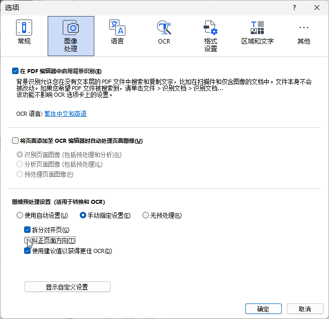
			- 公式识别
				- [SimpleTex - Snip & Get!](https://simpletex.cn/)
			- 竖排OCR
			  id:: 66946b78-039b-45bf-9112-b8541b022490
			  collapsed:: true
				- “现代作品的台版书是竖排疑似有点离谱”
				  id:: 66946b81-175a-4bf5-a50b-7738db33e70c
				- ((6694783c-163a-4b11-b8a7-237f2a99a503))
				  collapsed:: true
					- [如何使用ABBYY FineReader 识别竖排或反转文本？-abbyychina官方网站](https://www.abbyychina.com/FRshiyongjiqiao/shibie-shupai.html)
					- [日前对一本繁体竖排的pdf书籍做了ocr，发现有2个工具可用，且识别率很不错。 - 软件经验交流展望 - FreeMdict Forum](https://forum.freemdict.com/t/topic/28420)
				- ---
				- 没试过的
					- [GitHub - DayBreak-u/chineseocr_lite: 超轻量级中文ocr，支持竖排文字识别, 支持ncnn、mnn、tnn推理 ( dbnet(1.8M) + crnn(2.5M) + anglenet(378KB)) 总模型仅4.7M](https://github.com/DayBreak-u/chineseocr_lite)
					- [古联 OCR 古籍识别系统，亲测好用 – 书格](https://www.shuge.org/meet/topic/78721/)
			- 书法识别
			  id:: 66cbf9f7-a5c3-43fb-a32e-0b33a3d27ccb
			  collapsed:: true
				- [字鉴.书法智能识别－没有我不认识的字迹](https://api.shufashibie.com/page/index.html)
			- 其他临时OCR
				- ((670e806c-1ccc-42f5-a0b8-6c70790a5d1b)) 右键菜单
				- ((cb62e8cd-35a0-460c-8fa4-3cd98cfb7d2b)) 文本提取器
				- ((65bcbf4a-6899-4481-8a0b-b58afc33858a))
			- ---
			- TODO OCR文本批量处理
				- 错字替换
				- OCR文本提取
					- 目录等（比如用于相同相似主题的目录对照）
					  id:: 67034258-2df9-4b31-b139-c534172b1e72
			- ((669316b9-222d-4598-8410-36ff9b789232))
		- 繁简转换
		  id:: 668b9236-5d6f-45b0-8939-9b76fd2157e3
		  collapsed:: true
			- [ePub 繁简在线转换 - 电子书繁简在线转换工具 - 神奇海螺](https://v.magiconch.com/epub-transform.html)
			- [怎么把PDF中的繁体字转换成简体？ - 知乎](https://www.zhihu.com/question/31014748)（还没试）
			  collapsed:: true
				- 可以先转为其他格式，比如docx或epub
		- 电子书/文档翻译
			- DeepL
			  id:: 66977eab-15bb-4c30-b190-bde481b16cf8
			  collapsed:: true
				- [DeepL：人工智能翻译器和写作助手 - Chrome 应用商店](https://chromewebstore.google.com/detail/deepl%EF%BC%9A%E4%BA%BA%E5%B7%A5%E6%99%BA%E8%83%BD%E7%BF%BB%E8%AF%91%E5%99%A8%E5%92%8C%E5%86%99%E4%BD%9C%E5%8A%A9%E6%89%8B/cofdbpoegempjloogbagkncekinflcnj)
				  id:: 67248d8c-caac-4a96-b623-98e34178499a
				- ((673ea321-5d73-45ae-a3d1-e05f6fed5fc4))
				- 翻译质量（整体上）好一些，但（桌面端）在排版方面可能比搜索到的云服务差些，字稍多的PPT类的字可能溢出到需要调深背景或解密后用富文本编辑才能看到白字的空白页
					- ((66ffaa91-ed73-471c-b4ef-838f218dcb98))
				- api可以在淘宝买（没买过）
				  id:: 66977f0e-35dd-4346-976f-df3845753689
			- ((6717b801-28d1-47a8-a284-25ce1f20149c))
		- 格式转换
		  id:: 670d40f3-ee0a-4d91-92fc-92c987a8a1f3
			- ((66ade382-442e-4b75-8284-b0a0cbd49359)) 添加书籍（可以把电子书拖进去）后右键“转换书籍”，选择输出格式，转换后右键“打开书籍文件夹”（也可将“calibre书库”文件夹右键“固定到快速访问”，以便通过其他软件打开）
			- 转EPUB
				- TODO 论文PDF转EPUB（多栏会识别为单栏）
			- 转txt
			  id:: 670d40f3-1711-4fe5-a36f-276ba674aded
				- txt排版
					- ((6725eea2-193f-4bfb-a256-4b5ef3aaad15))
				- ((670d40f3-576d-4769-9366-10edfe7005d1))
			- 转PDF、docx
			- ((669316b9-222d-4598-8410-36ff9b789232))
		- 书签制作
		  id:: 66ade382-c192-41e0-9ade-76f47f04d7e5
		  collapsed:: true
			- 一起（往往并非同时地）读一本或多本厚书（尤其是干货较多的）时可能很有用
			- （给没书签或书签不够全的书）添加书签
				- （有的版本更清晰，但是没有书签，那么把有页码相同的书签的版本的书签导出导入即可）
				- 一种方法是搜索（线上书库、书评网站等）获取书签文本，或者手动OCR电子书的目录部分获取书签文本，然后可能对书签文本简单排版，最后用PdgCntEditor之类的软件将书签文本导入电子书
					- #赶时间参考流程 （“非全版”）
					  collapsed:: true
						- PdgCntEditor
						  id:: 670e81ab-6585-4e7b-8365-661f5f542f1d
							- [老马的原创空间搬家通告（内附软件下载地址） - strnghrs - 博客园](https://www.cnblogs.com/stronghorse/p/14594337.html)下载PdgCntEditor
							- 书签文本复制进PdgCntEditor界面
								- 电子书和书签软件（可置顶）两个窗口同屏对照校对
								- 书签的标题与页码要在同一行
								- 空行可以点“选定区域移至最左侧”去除
								- “替换”掉“...”、“（”等符号（种类少的话可能用“大空格/缩进”替换省掉“自动切分页码”？）
									- 如果第几章后没空格的情况较多，可以把“章”替换为“章 ”
								- 标题与页码要分开，一般点“自动切分页码”即可
								  collapsed:: true
									- 对于已有的（可能是自己先前用电子书阅读器阅读时添加书签时生成的）格式较复杂的书签文本，这么一点可能造成只缩进最后一个数字出错，可以手动按Tab分开
								- 页码与PDF的页面实际序号有偏差的可以点“PDF目录选项”设置基准页或点“加减选定区域的页码”
							- “保存”
							  collapsed:: true
								- 如果显示“存储失败”，可能是原文件没关掉
								- “保存”可能导致在一些电子书阅读器/编辑器中可生成和阅读的书签的颜色等格式被取消
							- 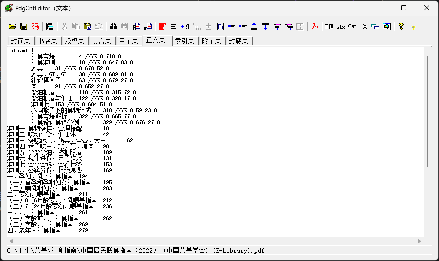
					- [中文PDF电子书自动添加书签指南 - 知乎](https://zhuanlan.zhihu.com/p/170590863)（读秀：“没搜到是吧？没搜到就对了！”）
					  collapsed:: true
						- [中文PDF电子书批量添加书签_哔哩哔哩_bilibili](https://www.bilibili.com/video/BV16V411J7nS)
					- id:: 65c83ca0-1514-46b7-8f32-118a4e777ae7
					  collapsed:: true
					  >找到目录；搜索例如douban，书的原版网站，google books以及最差的情况哪里也找不到就只能OCR，电脑OCR软件很多，手机端可以直接用扫描全能王也算比较方便。
						- [如何用FreePic2Pdf和PdgCntEditor制作目录 - 知乎](https://zhuanlan.zhihu.com/p/47271995)
					- [批量快速制作PDF书签 - 知乎](https://zhuanlan.zhihu.com/p/91455504)
					  collapsed:: true
						- >之前一直有一个烦恼，网上下载的PDF电子书很多没有标签，扫描版的也不能搜索，只能一页一页的找，或者用略缩图定位，都很不方便。开始的时候会手动添加一些常用章节的标签，但是效率很低……
				- 另一种方法是（根据不同层级书签的文本样式）生成目录书签
				  collapsed:: true
					- [使用ABBYY FineReader PDF 15在创建或转换PDF时自动生成书签-abbyychina官方网站](https://www.abbyychina.com/FRshiyongjiqiao/abbyy-sscq.html)
						- OCR后图像质量变差的话，可以导出导入书签
					- [GitHub - wmjordan/PDFPatcher: PDF补丁丁——PDF工具箱，可以编辑书签、剪裁旋转页面、解除限制、提取或合并文档，探查文档结构，提取图片、转成图片等等](https://github.com/wmjordan/PDFPatcher)
					  collapsed:: true
						- 对OCR后的 ((66876dfd-d508-45e2-b606-de4960441d40))试了下，首先看到错字很多，应该它是自己按“标题文本尺寸”OCR的，但是OCR识别率和正确率不高，而从用 ((66934b21-3076-44f9-ab9c-c9c1b2e488c6)) 识别后的PDF复制的文本就没有错字
						- 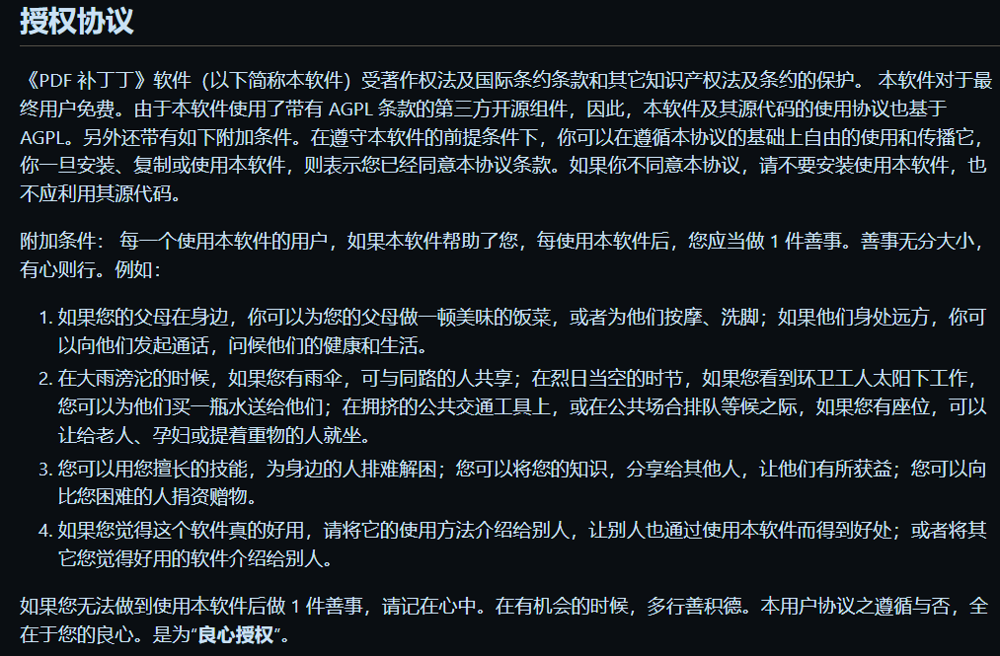
						  id:: 67075cbb-9d2e-4be6-8e2a-054d42c632a8
					- TODO [AutoBookMark一键轻松生成PDF目录（书签）_哔哩哔哩_bilibili](https://www.bilibili.com/video/BV1VU4y1s77o)
					  collapsed:: true
						- [自动生成pdf书签（仅适用于Adobe Acrobat on windows ） - 0xAC - 博客园](https://www.cnblogs.com/zhuangliu/p/5667282.html)
						- 还没搞到盗版 ((65ccc097-6439-45f2-89ac-514ad9b275b7)) ，还没试
				- 书本身的目录也不够细的话可以人工添加
			- TODO 自动导入导出书签（可能深度协作需要）
			  id:: 668ce784-bfcf-4ea8-adad-6144d0c6751c
			  collapsed:: true
				- 如何把位置不同的书签精准导入对应的已有书签下？
				  collapsed:: true
					- 书签能不能有双链？
		- ((66db8ac4-d9d8-40f9-b210-5517c4f75673))
		- TODO 多书合并
		  collapsed:: true
			- ((67034258-2df9-4b31-b139-c534172b1e72))
	- 文献/待阅/剪藏管理
	  id:: 65bcbf4a-6246-4e84-872a-0604435c9b17
	  collapsed:: true
		- Zotero
		  id:: 65a920ca-7004-4156-a743-84bc385231de
		  collapsed:: true
		  :LOGBOOK:
		  CLOCK: [2024-01-21 Sun 20:55:30]
		  :END:
			- 相比logseq，zotero的优点有多功能（抓取信息，丰富预览内容）、文件夹管理（比分散在logseq页面中查看、搜索效率高）、插件剪藏比logseq手动添加链接快
			- 我之前为了搞“现实科普”搜索、阅读文献，主要用浏览器读，感觉有用的链接手动粘贴到logseq相关专题页面中并“` /ti`回车”获取标题，截图和笔记也是随看随记在草稿页面里（例如[[阳光]]）——这样可能会漏掉一些当下不太感兴趣但以后可能有用的资料，而zotero就能较好地通过抓取信息（摘要预览信息比logseq光是一个标题、悬浮花时间且看不到多少的超链接要丰富，以及pdf、快照html下载到本地便于 ((65a920ca-d862-4a13-9473-3404c32df80a)) ——浏览器好像不能搜索打开的标签页乃至书签中的内容——“那么问题又来了”）把记忆多衔接一部分减少“反刍损耗”，且
			- ---
			- Zotero插件
				- [Zotero Connector - Chrome 应用商店](https://chromewebstore.google.com/detail/zotero-connector/ekhagklcjbdpajgpjgmbionohlpdbjgc)
				  id:: 67258d2a-1f63-463b-ae00-7ef9bde50a02
					- [GitHub - l0o0/translators_CN: Zotero translator中文网页抓取翻译器🎉This is Zotero translators for Chinese Sites(beta), not the official Zotero repo](https://github.com/l0o0/translators_CN)
				- [GitHub - tefkah/zotero-night: Night theme for Zotero UI and PDF](https://github.com/tefkah/zotero-night)（Zotero7已有暗色模式......）
				  id:: 672392ad-6409-4d3e-a1d7-4e05a9d66125
				- [GitHub - windingwind/zotero-pdf-translate: Translate PDF, EPub, webpage, metadata, annotations, notes to the target language. Support 20+ translate services.](https://github.com/windingwind/zotero-pdf-translate)
				  id:: 6724887d-71a1-411e-90c7-d580521c5bfc
					- 右侧栏有翻译按钮，可选择翻译引擎， ((66977eab-15bb-4c30-b190-bde481b16cf8)) 等的api可以问熟人或网上搜
					  collapsed:: true
						- 但可能部分专业术语就是不太好机翻
				- [GitHub - MuiseDestiny/zotero-style: Ethereal Style for Zotero](https://github.com/MuiseDestiny/zotero-style)
					- [Zotero Style - 标注管理（文献矩阵） | 给你前所未有的文献标注观看体验！_哔哩哔哩_bilibili](https://www.bilibili.com/video/BV1YE421w7vG)
					  id:: 6725e1a0-8aae-491e-bbc3-f93a4a637cf3
				- ---
				- ((67258d24-c45c-451c-b66c-51a732fa114d))
				- [关于 Zotero 插件 | Zotero 中文社区](https://zotero-chinese.com/user-guide/plugins/about-plugin)
				- [从此告别文献混乱：Zotero必装的40个插件-CSDN博客](https://blog.csdn.net/paixiaoxin/article/details/143413528)
			- ---
			- 文献分类
				- 先点 ((67258d2a-1f63-463b-ae00-7ef9bde50a02)) 导入，然后整理分类时点“未分类条目”，将条目（按住Ctrl多选）拖入对应文件夹，没对应文件夹的就新建
				- 鼠标右键分类（？）多用键盘？
			- [还在发愁Zotero笔记怎么转成Anki词卡？一个小程序搞定！ - 知乎](https://zhuanlan.zhihu.com/p/657502527)
			  id:: 67238da1-83f5-4c5d-9016-ac5a7bd4dfb4
				- [GitHub - MengqiangH/zotero-annotations-to-anki: This script is able to convert zotero annotations formed by 'Zotero PDF Translate' plugin into anki cards.](https://github.com/MengqiangH/zotero-annotations-to-anki)
					- 用 ((6724887d-71a1-411e-90c7-d580521c5bfc)) 添加单个条目的注释及其评论，右键“通过注释创建笔记”，点击注释复制粘贴到txt文档或右键“导出笔记”保存为Markdown，用python实现多个正则表达式批量替换（需要修改第4行的目录和第5行的文件名，txt、md格式均可转换； ((65ab10fa-9bb1-4c11-8112-1d5744559b36)) 装python插件然后run，可能要trust解除restricted mode），最后将转换生成的txt文档以对应模板（含正面的zotero论文链接、zotero pdf所在页面链接、加粗转红色加粗和反面的特定想法；另有图片模板）导入anki
						- 直接选择多条目创建的注释文件多一个层级、`#`，对应的正则表达式要改
				- ---
				- 应该也可以先同步到logseq、obsidian等其他软件，再同步到anki
			- [你离会用 Zotero RSS 只差这一步 - Zotero 进阶_哔哩哔哩_bilibili](https://www.bilibili.com/video/BV1pP411e7xa)
			  id:: 670d40f3-28c0-4e53-8d05-d4b1a70d59e5
			- ---
			- 可以导出文献库分享
			- ((65bcbf4a-c8bf-45a1-9402-70cd437268d4)) 可以剪藏网页，剪藏的Logseq网站的HTML文件相比Logseq插件Doc View Exporter导出的HTML文件多保留了HTML文件内的图片
			  id:: 65ba628c-4ea4-4002-878c-1139e53dea46
			  collapsed:: true
				- ((659b89b8-f17c-4d75-a9d2-3332ef699d60))
			- TODO zotero导入本地文件夹
			- TODO zotero文件夹保留原标题
			  id:: 66b5d23a-ed3b-4b91-9b42-1c68801ee610
			- [Zotero：科研小白的第一款文献管理软件 - 知乎](https://zhuanlan.zhihu.com/p/347493385)
			- ---
			- 联用
			  id:: 670d40f3-f7d9-4e1c-87cf-2603b496ac23
				- [2023年使用Logseq和Zotero进行联动的最新教程，实现科研论文阅读、写作的闭环！ - 知乎](https://zhuanlan.zhihu.com/p/660829213)
				  id:: 65ad2406-9c4c-4af6-a1cf-4dd73ee597a8
				  collapsed:: true
					- 一开始不会用，一堆标签页面挺难绷——“现在也不会”
					- TODO 搜索date字段自动添加对应年份标签
					  id:: 65ad2244-8f5d-4d69-b604-dd5326b7527a
					- [Scientific Workflows with Zotero - Questions & Help - Logseq](https://discuss.logseq.com/t/scientific-workflows-with-zotero)
					- [GitHub - vyleung/logseq-logtero-plugin: a Logseq plugin to create pages for Zotero items using custom page titles and properties](https://github.com/vyleung/logseq-logtero-plugin)
				- [通过简悦导入任意页面到 Zotero（利用简悦增强 Zotero 的剪藏能力） - 知乎](https://zhuanlan.zhihu.com/p/656263331)（简悦这个浏览器待阅管理插件以前没整明白，可能当时看的东西品位不够高、也不会联用，所以没整出什么活）
				  id:: 65ae0906-26f4-435e-9e94-03703eed02d3
		- TODO [打造个人离线 html 资料库的方法 - 知乎](https://zhuanlan.zhihu.com/p/611886895)（可能我还不太明确它的用途）
	- 网页
	  collapsed:: true
		- 静态网页与动态网页
		  id:: 6705e72d-cc65-4850-95f3-1d1a4258c008
		  collapsed:: true
			- 互联网作为信息基础设施，在快速发展期能够使供需双方的供需信息更充分且廉价地“触达”
				- 相比广告牌、收音机、电视广告，具有低生产、运输、安装、复制成本，专业生产内容到用户生产内容
			- 眼球经济
			- 旧网页里的其他网页如果是“旧闻”，那么显然是静态网页
			- 动态网页在丰富表达的同时也可能助长遗忘
			- ((66dba0ad-5e15-4ff1-b924-94416903fdca))
		- 搜索
		  collapsed:: true
			- 搜索的几种常见操作方法
				- 打开搜索引擎网站
				- 选择后复制粘贴到地址栏
				- 选择后拖拽到标签页栏空白处
			- 搜索引擎
			  id:: 668ce784-2562-45d7-b56e-2615fbed9893
			  collapsed:: true
				- 之前一段时间用过neeva（没了）和startpage，目前用duckduckgo，有时
				- 搜索引擎的搜索结果按时间排序
					- [搜索引擎为什么不提供按时间排序？ 即按结果的时间先后排序，因为很多时候，想搜索最新的结果。光提供时间区间不科学。 - 知乎](https://www.zhihu.com/question/20253502)
					- [google 搜索结果如何时间排序 - V2EX](https://www.v2ex.com/t/672152)
				- （之前一阵子）常看到的网站（国外有pubmed及各大医学杂志、出版社，国内有搜到的百度学术、x-mol、科研院所、免费阅读的某些学术公开网站；“经典呼吸道传染病”相关看c19early，一部分看荟萃分析，其中看具体研究先看一遍荟萃分析中给出更精简摘要的“Study Notes”，其他一部分看论文页面下方或右侧有没有比较新、好的被引）
			- 动态网页多页搜索
			  collapsed:: true
				- ((668ce73d-77bc-450f-9057-fdff43efed4b))
			- 多搜索引擎搜索
			  collapsed:: true
				- 多窗口搜索
					- “集束搜索”，一个搜索引擎对应一个弹出式窗口（可能要在浏览器设置中设置允许），一次性打开多个弹出式窗口
					- https://littlefean.github.io/multi-search-tool/
					  id:: 6698aea2-0faf-4a31-9ef9-50ae9aec16be
					- TODO ((66975f62-4324-4905-9489-6ee145ec8984))
					- TODO 自动生成标签页组
					- [设计网站 - by level1 - 动作信息 - Quicker](https://getquicker.net/Sharedaction?code=0c050429-ac61-4c69-55a2-08d9bc45b860)
				- 单窗口搜索聚合
				- TODO 合并本地 ((65a920ca-d862-4a13-9473-3404c32df80a))
				  id:: 66989865-73d0-4fd3-b9b8-21f550e85d9d
			- 多账号搜索
			  collapsed:: true
				- 比如搜索多个关注账号
				- [[三明治]]
			- ((668ca9da-4763-4478-b297-290003499450))
			- 模糊搜索
			  collapsed:: true
				- 自动换关键词（历史关键词）绕开关键词审查（“好消息，没覆盖所有搜索关键词”）
		- ((65961c22-eba4-4340-aedf-2b60a6637a79))
		- 解除阅读下载限制/付费墙（付费文库、报纸等）
		  id:: 66a57f13-e830-4e69-857a-c23d85b367c7
		- 解除复制限制
		  collapsed:: true
			- ((66a5f845-3c24-468e-8315-aa0129a92f7c))
			- TODO [教你一键复制网页内容，拒绝一切花里胡哨，只教最实用的技能！_哔哩哔哩_bilibili](https://www.bilibili.com/video/BV19v4y1Z7DM)
		- TODO 跳转到网页特定位置（比如某条评论）
		  id:: 66650b4d-ac6b-4c9a-8425-1d846a28f69b
		- [可以将一个网页应用「打包」成一个桌面应用吗？ - 知乎](https://www.zhihu.com/question/46980476)
		- 链接下载
		  collapsed:: true
			- IDM
			  id:: 670b8c8f-849f-4dc2-891f-1716a486f54d
				- 批量下载
				  id:: 670b8c94-bbb2-401b-b78d-9ea585fed2a4
					- 有时一个网页里有很多下载链接，但是没打包，又不像网盘那样自带批量下载功能
						- ((66db8abb-488e-4d8e-8fac-0e5a8adc84e1))
					- 选择多个链接或全选后右键“使用IDM下载全部链接”（“选项”-“设置浏览器右键菜单”-“使用IDM下载全部链接”勾选后可直接右键）
					- 如果一次只下几个文件（可能是5个），可以选择后右键“添加到队列”-“同步队列”，然后点上方“开始 同步队列”
				- 在 ((66db8aad-f2b5-42f7-99b8-0844904bd3ee)) 下载标准时，可能会与浏览器自带下载冲突导致无法下载，我目前的解决方案是临时用 ((6703ea76-f088-4570-a8de-f1750eb3e72d)) “不允许进程”IDMMsgHost.exe，之后可在“选项”-“控制”中取消
			- 比特彗星bitcomet
			  id:: 670d40fa-e745-42a3-8de2-f978e56777c3
				- [比特彗星 BitComet_1.99[beta1]_小像素版_比特彗星吧_百度贴吧](https://tieba.baidu.com/p/8277549974)
				- [比特彗星BitComet某些常见内容的解释_比特彗星用户啥意思_小黑LLB的博客-CSDN博客](https://blog.csdn.net/Enderman_xiaohei/article/details/107180489)
				- 如果可选的bitcomet的浏览器插件总是“捕获文件下载”但BT下不了，可以临时关闭“捕获文件下载”或把下载链接拖到新标签页换回用浏览器下载
			- ((66b94814-2db0-4e2a-aa09-15df580d1007))
		- 整站下载
		  collapsed:: true
			- [Cyotek WebCopy - Copy websites locally for offline browsing • Cyotek](https://www.cyotek.com/cyotek-webcopy)
			  id:: 66fba4e9-5d09-4235-9416-d701b60c05b0
				- ((66fba956-72ba-4f33-9318-018e1a94ca5f))
			- TODO ((670b8c8f-849f-4dc2-891f-1716a486f54d))
			- TODO ((6710dc45-a891-4b0d-912c-1e8fe021f5bc))
		- 网页内容保存/下载
		  collapsed:: true
			- [Wayback Machine](https://web.archive.org/)
			  id:: 667b89e7-4177-49ea-8db1-ed4cd98638d8
			  collapsed:: true
				- 网页快照/版本记录，减少你和互联网的遗忘，调查、合订本制作工具
			- TODO 网页内容自动保存
			  id:: 66f7dd70-662c-46ac-a12f-b33a0994e5c7
				- 手动触发、自动（定时、AI统计）
				- “随时随地网页快照”
			- 网页内链接内容下载
				- 图床链接等
			- [WebCopyer：一键复制网页内容的利器-CSDN博客](https://blog.csdn.net/gitblog_00098/article/details/137494480)
			  id:: 666450d9-09d1-4308-95bb-977ee7eef3ee
			  collapsed:: true
				- [【免费】WebCopyerweb拷贝者资源-CSDN文库](https://download.csdn.net/download/yyy15584303148/10348713)
		- 爬虫
		  collapsed:: true
			- [批量提取网页数据 - by zdf153 - 动作信息 - Quicker](https://getquicker.net/Sharedaction?code=5672a523-1889-4dc3-e1ba-08d974e692d3&fromMyShare=True)
			  id:: 66644bc9-5c94-462d-9b01-ee6dfc562fa1
			- 内容列表
			  collapsed:: true
				- ((668deec5-d470-4c67-aac9-4dd0463dee95))
			- 评论
			  collapsed:: true
				- “基于内容的群聊”
				- 及时处理引战、带货相关评论
				- [如何看待b站的阿瓦隆吞评系统？ - 知乎](https://www.zhihu.com/question/468134433)
				- [GitHub - Ghauster/BilibiliCommentScraper: B站视频评论爬虫 Bilibili完整爬取评论数据，包括一级评论、二级评论、昵称、用户ID、发布时间、点赞数](https://github.com/Ghauster/BilibiliCommentScraper)
				  id:: 66974cd8-2083-4caf-9413-34a15330031e
				  collapsed:: true
					- 安装python
					- ((66623b80-4c32-4b60-97f8-c5d895eb32be))
					- id:: 668deec5-d470-4c67-aac9-4dd0463dee95
					  >1.  将要爬取评论的视频 URL 列表放入名为 video_list.txt 的文件中，每行一个 URL。video_list.txt
					- 下载该github仓库中的Bilicomment.py文件，双击打开
					  collapsed:: true
						- 需要chrome浏览器（若无，可能会在出现第一行后不久退出）
					- 登录b站，然后等就可以了，chrome浏览器可能会消失（不确定是不是我关的），但是程序会继续，完成了自动退出
				- [B站视频评论的爬虫与数据分析_b站评论抓取-CSDN博客](https://blog.csdn.net/2201_75470660/article/details/139842612)
				- [【爬虫+数据清洗+可视化分析】python文本挖掘“狂飙“的哔哩哔哩评论_爬b站点赞、评论、收藏-CSDN博客](https://blog.csdn.net/solo_132/article/details/137705469)
				- [【2024年最新】Bilibili/B站视频/动态评论爬虫_b站评论区爬虫-CSDN博客](https://blog.csdn.net/weixin_51869009/article/details/139638650)
				- [B站评论爬虫_爬虫思政课评论-CSDN博客](https://blog.csdn.net/ArsenalAss/article/details/104440917)
			- 人-账号-言论
			- 实时协同爬虫（“跟屁虫”；OCR等功能）
			- 博客
			  collapsed:: true
				- 文件名/文章标题
					-
			- TODO 监测网页特定区域（比如一个块）内容变化
			  id:: 65e858bb-7b0c-4d1c-81a2-0eeefef806ec
			  collapsed:: true
				- 比方说，在同一个正在集思广益、尚未往文档里直接堆东西的项目的飞书文档中，几个人往文档里放的并非飞书的同步块的分享链接，不是同步块，那就没法直接在飞书文档中显示，更别提文章更新通知了，那要每天一个个看有点费事，还不一定能看出哪里更新了
				  collapsed:: true
					- ((65bcbf4a-7239-4867-8ffb-6f559fe9647e))
				- ((65bcc04c-781a-4a01-bbf1-06835186a604))
			- 爬取信息还原组装
			  collapsed:: true
				- 比如一级评论与二级评论的缩进显示结构
					- ((66974cd8-2083-4caf-9413-34a15330031e))
			- 网站
			  collapsed:: true
				- 量的排名
				  id:: 66975248-0471-426f-9fad-41c033b7262c
				  collapsed:: true
					- 不一定是搜索量，可能是给钱的量
					- [摸摸鱼热榜](https://momoyu.cc/)
					- [微博热搜榜 - 浑水阅读](https://www.hsmy.fun/)
	- ---
	- 笔记
	  id:: 65ae0906-5c70-429b-a10d-250ae2200e76
	  collapsed:: true
		- 跨越脑海，卸载、转运不断积压的工作记忆，与物相刃相靡，日以心斗——或许就是我（们）这（些）被符号界赋予了灵魂的动物的宿命
		  collapsed:: true
			- ((65f39270-1b75-4ebf-9015-f95753f3a30e))
			- 
			- 早起等时段可能出现“高并发”的“符号冲撞”（symbolic collision）、“符号高峰”（symbolic rush——“rush hour嘛”）
			  collapsed:: true
				- ((661011fa-6298-4a3f-9720-b8fa67229390))（“啊？”）
			- 与过去内容重复的碎片笔记——是一直在出现的，只要想得多，就会忘得多，不可能没有剩余
			  id:: 6649d34d-f656-47c7-8b62-1d367ef2d75f
		- [一定要小心「数据孤岛」,一旦形成后就没法迁移 - 知乎](https://zhuanlan.zhihu.com/p/348520757)
		- “为什么我没在用这些？”
		  id:: 66027cec-ecb9-4d08-ac69-db87cd555e36
		  collapsed:: true
			- 如果平时没空写日记乃至代码、上班看的又是一堆word和专用软件，可能就不太容易接触到这些——这当然可以视作“大分工”的后果
			- 换个角度，聊天软件也可视作笔记软件（“你疑似没在聊天”），有时你算是分享了你的笔记，而且有些聊天软件也专门带个笔记功能
		- 烹饪笔记：“熟了吗？”
		- [[Logseq]]
		  collapsed:: true
			- [工作后，发现logseq更适合我 - 知乎](https://zhuanlan.zhihu.com/p/676562851)
			- [logseq最近都没太多人关注了吗？  ? - 知乎](https://www.zhihu.com/question/634480324)
			  collapsed:: true
				- https://xuanhuai.wiki/
		- Obsidian
		  id:: 65996fd3-b62c-454a-9ed5-ea72d66a8f68
		  collapsed:: true
			- 与logseq大致同类，用的人更多，功能更多，但我不太会用，望比学赶超
			- [[从Logseq迁移到Obsidian，但是尚未成功]]
			  id:: 65996fbe-c81e-4c35-b05d-991421c09f09
			- [一种实用新型 Obsidian 实践之构建我的第二大脑 🧠 - 知乎](https://zhuanlan.zhihu.com/p/640042778)
			- [修改Obsidian粘贴图片的位置 - 知乎](https://zhuanlan.zhihu.com/p/671070262)
			- [Obsidian 内容聚合及图谱功能（三） - 知乎](https://zhuanlan.zhihu.com/p/397392641)
			- ((66ade380-528c-491c-9efd-2710bcc4e02f))
			- ((670d40f3-95c0-4bf2-b7a3-966f73443b06))
			- [我的第一个插件 Cloze（背书党必备！ - 开发讨论 - Obsidian 中文论坛](https://forum-zh.obsidian.md/t/topic/22754)
			- [Obsidian插件：LanguageTool高级语法和拼写检查工具 - 知乎](https://zhuanlan.zhihu.com/p/669914223)
			- ((66f7b266-2e48-4887-a9e4-0f1489490b6e))
			- [【杂货分享 08】分享个用 Obsidian 搭建的小型团队协同工作方案（上 - 演示与目录设置）_哔哩哔哩_bilibili](https://www.bilibili.com/video/BV1oZ4y1U7b9)
			  id:: 6594cd2e-8b26-4197-93e2-2b7f01c406a2
			- ((66fcc0bf-5449-4554-ac38-50c319722d19))
			-
		- 碎片/易逝/闪念/临时笔记（Fleeting notes）
		  id:: 66335bea-e054-49b0-89cc-3d88d3d2f697
		  collapsed:: true
			- 碎片笔记可能主要源于随时随地浮现、可能稍纵即逝的想法，要每一条都抵达对应分类层级位置很难保证时效性，于是就先要记在别处（“厨房到处放乱喽！”），之后整理——“符号锁链绑得太紧啦！”
			  collapsed:: true
				- 一时没什么特别想写的，就先整理之前记的
				- 这些碎片笔记，我经常在看到其他笔记时才能知道它们要放哪
			- id:: 6664d230-c9c4-492a-a84f-e6a56a67f045
			  collapsed:: true
			  >茫然走在海边，看那潮来潮去，徒劳无功想把，每朵浪花记清
				- “如果记为/改为‘每朵浪花激起’，则可以有不停地想搞事情、搞大新闻的意思” [[20240609]]
				- [春江花月夜（唐代张若虚诗作）_百度百科](https://baike.baidu.com/item/%E6%98%A5%E6%B1%9F%E8%8A%B1%E6%9C%88%E5%A4%9C/1701)
			- [When It Ends It Starts Again - ATB/Sean Ryan - 单曲 - 网易云音乐](https://music.163.com/song?id=28617334&userid=77770261)
			  id:: 6664fe07-01cd-4af8-8949-862c40389ab0
			- （一般）尽量别过百，一般到这个数可能已经过了几天，再去回忆成本和损失可能就比较大了（可能无论软件功能吹得有多强大都无济于事）
			- flomo
			  id:: 65bcac14-f887-4224-92e2-1d16751f358d
			  collapsed:: true
			  :LOGBOOK:
			  CLOCK: [2024-02-02 Fri 09:24:52]
			  :END:
				- “还是看看近处的flomo吧家人们”——“好好好，越删越多了”
				  id:: 6603aa94-f67d-43ef-98c3-f00115c3b3b0
					- 我是这样的：在别的方面赶时间的话会较快堆积，比较全力清的话，一天大概能清100条，毕竟很多不是只粘贴到对应位置就行，还得回忆、改写、扩写、搜索、测试等，途中还会新增
				- “白日放歌清flomo” [[20240608]]
				- ---
				- 电脑端新建笔记的全局快捷键Ctrl+N
				- 有时间记录（“可以知道几点睡几点醒”）
				- 有每日计数、12列7天热度图和统计图表，还可以分享（“好好好，脑暴超人”）
				  collapsed:: true
					- [打工人 Coco：灵感记录神器 flomo，完胜文件传输助手！](https://mp.weixin.qq.com/s/KxTYi5LCkgt4vR4lKMbYAA)
				- [⚡️ 快速记录 | flomo 101](https://help.flomoapp.com/basic/quick-input.html)
				- TODO 本地同步（方便搜索）
					- flomo导出到logseq
				- TODO 快捷复制（电脑要双击复制，还把标签复制去了）
				- TODO 复制同时删除（有剪贴板和回收站“备忘”）
				- TODO [利用简悦 + flomo 为你的双链笔记「减重」 - 知乎](https://zhuanlan.zhihu.com/p/383495016)
				  id:: 65bc3ff2-498c-43cc-925b-b1fec05e8f19
				  collapsed:: true
					- 其实logseq的日记功能也适合碎片笔记记录，但有时人不在电脑前，且手机端logseq还没搞定（“也可能是我还没搞定”）（免费）稳定的同步方案，所以还是要用另外一个不太差的多端软件
					- [玩转简悦——同步标注到flomo和Notion - 知乎](https://zhuanlan.zhihu.com/p/430014599)
					- ((65ae0906-26f4-435e-9e94-03703eed02d3))
				- 之前用微信笔记，不用电脑时用手机记录，用电脑时整理记录
				  collapsed:: true
					- 理论上用微信笔记加标签多造几十倍的笔记也行，但
						- flomo至少能看到“数”（“虽然我一般不看左侧，只专心消除”），“心里有数”，缓解“不知道、想知道积压了多少（以及细分类别积压了多少）”的焦虑
						- 这会儿又想起来一个经典可能： ((65d57e59-30f1-4d00-8a0f-c158fe590073))
				- ---
				- [flomo 浮墨笔记向飞书收购 “幕布”，不卖永久会员、不融资的“反骨”逻辑_B Impact_InfoQ写作社区](https://xie.infoq.cn/article/60c53aefc89ca6d9012616891)
				  id:: 66664ec4-59fc-4f6e-b8ee-f500f29f937f
				  collapsed:: true
					- [小报童](https://xiaobot.net/home.html)
			- ((664978c4-c36e-4b3e-be12-23bb1572ef6e))
		- 剪贴板
		  id:: 668ce784-ad05-4d40-9ddf-107d94264be7
		  collapsed:: true
			- Windows系统的对应快捷键是Start/Win+V，可能要在设置中开启
			- ((66975f62-08f9-4edf-8a8c-af1f16039dfb))
		- VSCode
		  id:: 65ab10fa-9bb1-4c11-8112-1d5744559b36
		  collapsed:: true
			- 可以作为GitHub Desktop等软件的外部编辑器
			- [visual-studio-code – 如何更改 VS Code 的文件排序？_vscode 按时间进行排序-CSDN 博客](https://blog.csdn.net/u010598525/article/details/108978465)（纯小白文件多找不到需要按修改时间排序，按这方法最后选“modified”）
			- 可以使用 ((66335bd1-4b73-4876-896e-f814584162db)) 查找/替换，去除文本中的多余格式
			- [Vscode设置标签页多行显示 - 热爱技术的小郑 - 博客园](https://www.cnblogs.com/zheng-yuzhu/p/16633940.html)
			- 插件
			  collapsed:: true
				- [Office Viewer(Markdown Editor) - Visual Studio Marketplace](https://marketplace.visualstudio.com/items?itemName=cweijan.vscode-office)（对标 ((65d2ac10-0546-4a5d-a6ed-261768b13d55)) 的markdown所见即所得功能，直接在同一个窗口而非侧栏中显示编辑的效果）
				- Markdown Preview Enhanced
				  collapsed:: true
					- 包括导出在内的功能比Office Viewer(Markdown Editor)丰富
					- [如何使用VSCode创建编辑Markdown文件_vscode md-CSDN博客](https://blog.csdn.net/qq_16851599/article/details/131848016)
				- Marp（PPT）
				- 右键文件标签页（上面的）“Reopen Editor With...”可切换部分插件
			- 导出
			  id:: 65d740ad-7f33-4c3e-bcb4-4fd4d560bb10
			  collapsed:: true
				- 以上部分插件启用时，右键页面有导出选项
				- 电子表格
				  id:: 65d742e9-04de-41fc-8086-bfb9ee670305
				  collapsed:: true
					- 带公式导出
			- Typora
			  id:: 65d2ac10-0546-4a5d-a6ed-261768b13d55
			  collapsed:: true
				- [typora和obsidian在这种情况下怎么选择? - 知乎](https://www.zhihu.com/question/639559053)
		- [Xournal++](https://xournalpp.github.io/)
		  collapsed:: true
			- [学用系列｜Xournal++，跨平台好用开源免费的手写笔记应用 - 知乎](https://zhuanlan.zhihu.com/p/548866328)
		- TODO 文本深浅颜色、下划线等格式表示更新时间/完成度？（最好在网页版能显示）
		  id:: 65cd7c04-6f77-40e6-a9f0-7e83bb785c58
	- 文档
	  collapsed:: true
		- 与 ((65ae0906-5c70-429b-a10d-250ae2200e76)) 相比，结构可能没那么复杂，可能比较孤立
		- 表格
		  id:: 668e501d-005d-4e8b-8dd1-94e88d73a05e
		  collapsed:: true
			- [excel如何固定某一行不被筛选？_百度知道](https://zhidao.baidu.com/question/1244976532155423179.html)
			  id:: 65d74efa-7697-4e83-9c23-8c0654a6a823
			  collapsed:: true
				- collapsed:: true
				  >没有特别好的方法，简单的方法是最后一行汇总行前面插入一个空行，并隐藏这个空行。
					- 还要注意选择筛选区域才行
		- LibreOffice
		  id:: 671120bc-7192-4e05-a58b-25a2db275541
			- LibreOffice Writer
			  id:: 670d40f3-3127-496b-b816-cea72942e754
				- ((66335bd1-4b73-4876-896e-f814584162db))
					- [正则表达式列表](https://help.libreoffice.org/latest/zh-CN/text/shared/01/02100001.html?&DbPAR=WRITER)
		- ((65ae0906-fc09-4613-a1e6-c68798673e58))
	- 文案
	  collapsed:: true
		- [答北斗杂志社问](https://www.marxists.org/chinese/reference-books/luxun/13/013.htm)
		- 文案时长
		  collapsed:: true
			- 阅读时长
			- 视频时长、播客时长
			  collapsed:: true
				- 配音语速相对稳定，除去常用的无配音的片头片尾后，通常5.2~5.5字/秒左右
				  id:: 65e5ba68-4f8f-4a6c-bba4-5ea6636b05cd
				- ((65ae08db-7b92-4199-8748-f67f160e0fa5))
		- ((66b36958-2079-47d3-a1ff-ba867e9a4933))
	- 语音转文本
	  id:: 670d40f3-1138-4cbd-9cae-a83486fd49a5
	  collapsed:: true
		- ((66ade391-75bd-4307-a258-da9aa1815c57))
		- 字幕
		  id:: 670d40f3-a47b-41d2-8fc8-cd5330d5ffa8
		  collapsed:: true
			- id:: 666c1826-9ab4-4a33-bdc7-629866c3b339
			  >我觉得小约翰可汗的视频有一个好，字幕大，吃饭时隔几米把电脑当电视看问题不大，我们最近一期维生素的也不错，但好像他的字幕更清晰锐利些（是方的不是圆角的；维生素那期最高720P）
			- [青岛地铁判官案：后AI时代的群体听觉退化问题_哔哩哔哩_bilibili](https://www.bilibili.com/video/BV1wH4y1X7VP)
				- [范志毅：“中国足球脸都不要了！”_哔哩哔哩_bilibili](https://www.bilibili.com/video/BV1yx411L73B)
			- 实时字幕
			  id:: 65d2aef4-03a9-41c1-b9cc-85c2fa6a4abd
			  collapsed:: true
				- “b站视频没字幕的、你听不清的，它可能听清，它还能暂存”
				- ((65d58188-e454-4da4-baa5-fcc03429bc58))（“从黑格尔到黑girl、黑狗”）
				- Windows11自带的
				  id:: 65d568cc-0807-400d-aaea-7e59e0d900f1
				  collapsed:: true
					- [PC端免费无障碍实时字幕 |多种语言 |离线使用 |Win11 - 哔哩哔哩](https://www.bilibili.com/read/cv29036994/)
					- 
					  collapsed:: true
						- QQ
							- “没别哒”，就是有时试实时字幕快捷键时会按成windows QQ的默认的锁定快捷键
					- 可以通过win/start+方向键分屏或 ((659c9e71-570c-46ec-8f44-82c8af29f35e)) 分屏扩大窗口查看更多之前的字幕（短暂离开直播或静音好一会儿突然开麦的视频会议等也能接上）
					  collapsed:: true
						- 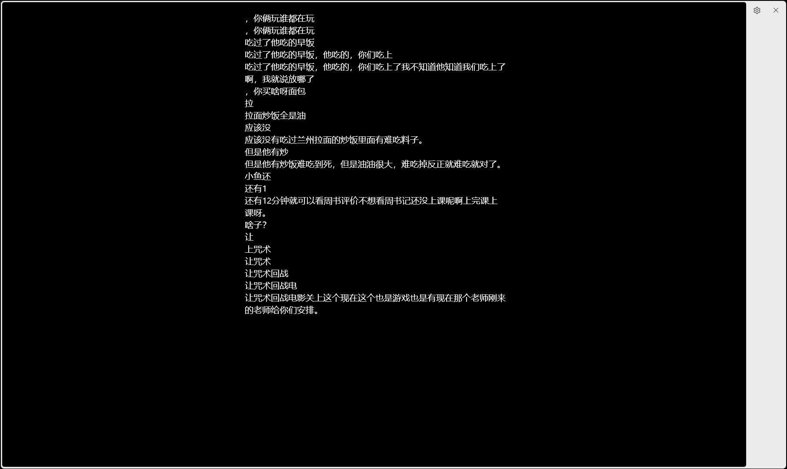 [[20240220]]
					- TODO [想要在 Windows 11 中复制粘贴实时字幕吗？ 这是一个解决方法 - MSPoweruser](https://mspoweruser.com/zh-CN/copy-paste-live-captions-in-windows-11/)
					  collapsed:: true
						-
				- 腾讯会议的（“应用”-“开启字幕”——“5分钟试用”）
				- ((668e501d-d1a6-4df3-9555-851a8647fc5d))
				- 单任务/窗口/标签页的
				  collapsed:: true
					- ((65d5d2c9-f6b8-4941-bc2d-5cdbfb3b7090))
			- 音视频字幕下载
			  collapsed:: true
				- [哔哔君 - 哔哩哔哩视频字幕增强工具 | 字幕列表、总结、翻译、AI问答](https://www.bibijun.cc/)
				  id:: 67088801-9485-45b9-8aad-8db8998e845a
					- [GitHub - IndieKKY/bilibili-subtitle: 哔哔君 - 哔哩哔哩字幕列表浏览器扩展，功能包括点击跳转，下载字幕，总结字幕，翻译字幕等。](https://github.com/IndieKKY/bilibili-subtitle)
					- [【工具推荐】哔哩哔哩字幕插件（复制、导出、跳转、总结、翻译） - 🛠工具 - 始徒](https://forum.beginner.center/t/topic/667)
					  id:: 66a6beb0-2754-4d63-831e-4053e789312d
					- 可以总结视频内容（如果你有对应ai服务的api）
					  id:: 66b7ed99-80a0-4524-839a-a099682a0827
						- 
				- [Download subtitles from Youtube, Viki, Viu, Kocowa, Wetv and more](https://downsub.com/)
				- ---
				- [快速提取视频字幕！适用B站、AI字幕等等。好用 - 哔哩哔哩](https://www.bilibili.com/read/cv27964896/)
					- 如果折叠的子级没有展开，可以在第一行右键“以递归方式展开”
					- [快速提取视频字幕！python > 字幕文本自动转换_哔哩哔哩_bilibili](https://www.bilibili.com/video/BV1oT42127P5)（前面的网页工具好像提取不了）
					  collapsed:: true
					- [b站字幕提取](https://lxblog.com/qianwen/share?shareId=fa95bb49-dcff-4977-821e-e99ba692f3f2)
			- 音视频链接生成字幕
			  collapsed:: true
				- TODO 完整文本（比如有时没空看直播）
				  id:: 65d54b7b-10d1-42d2-be18-e84a3b5a9901
				  collapsed:: true
					- ((65d57cbb-6cbd-4f1b-bae0-4eb87655c9c2))（点击总结后再点“Article”）
					- ((65c0de9d-98a9-4ce9-a855-8b57c69e17c0))
			- 音视频文件生成字幕
			  id:: 668d1a03-d867-420d-b226-c11f1abbc969
			  collapsed:: true
				- [Videosrt Pro 简介&下载 · 语雀](https://www.yuque.com/viggo-t7cdi/videosrt-pro/cpwtwl)
				  collapsed:: true
					- 
					- 如果使用离线语音引擎（主要是百度飞桨）得到的字幕文件很小、没有实际内容，可以先清除缓存（“请求缓存：”最右边“清空”）、取消智能分段再试一次
					- 云服务有免费时长额度但不够的，大概可以多开几个号
				- [【将免费进行到底】剪映字幕收费且加密，试试这些免费的字幕识别生成器 – 码中人的博客](https://blog.mzh.ren/zh/posts/2024/07/subtitle-generators/)
				  collapsed:: true
					- 剪映
						- [【240620更新】剪П映Jian_ying_Pro_v6.0.1.11779集成VIP免安装电脑版-远景论坛-微软极客社区](https://bbs.pcbeta.com/viewthread-2003366-1-1.html)
					- 必剪
					  collapsed:: true
						- 必剪需要视频片段不超过15分钟，可能需要先分割，可能还需要登录
						- [必剪——素材和草稿存放位置 - 哔哩哔哩](https://www.bilibili.com/read/cv23174919)（或者在必剪里看右边“草稿参数”-“保存位置”）
						- [B站必剪字幕导出 - 字幕工具箱](https://zm.i8k.tv/bcut)
					- Whisper
					  id:: 668d4673-4f2f-4a63-a58a-6ff2db904fbe
					  collapsed:: true
						- [AI自动生成字幕 - 中日英多语言支持，完全免费，本地运行_哔哩哔哩_bilibili](https://www.bilibili.com/video/BV15c411j789)
						  id:: 668e501d-cea9-4ed6-9104-6cfe67a63ca4
						- [Whisper对于中文语音识别与转写中文文本优化的实践(Python3.10) - 知乎](https://zhuanlan.zhihu.com/p/679763812)
				- [通义](https://tongyi.aliyun.com/efficiency/home)
				  id:: 668e501d-d1a6-4df3-9555-851a8647fc5d
				  collapsed:: true
					- ((668e501d-55fb-4100-b3ee-1c34cde0b308))
					- [《录制-7531557-20240707-184205-909-周末踢球》](https://tongyi.aliyun.com/efficiency/doc/transcripts/zj78qpjkejmvqxdp?sl=1&source=1#《录制-7531557-20240707-184205-909-周末踢球》)
					  id:: 668e7b38-c0bb-464d-bd51-c5de7eb5626b
					  collapsed:: true
						- ((668e6534-e790-4976-9a9e-7d8bd8767681))
					- [程序员健康指南 (Joe Kutner 著, 陈少芸 译) (Z-Library)](https://tongyi.aliyun.com/efficiency/doc/read?taskId=1798540&isShare=true)
					  collapsed:: true
						- ((668c6514-64de-4341-9ed1-03777a70e2c7))
				- 比较
				  collapsed:: true
					- https://drive.filen.io/f/9ff2329e-b96e-498a-b15a-0c236a801d96#xbMaqQigtjQ3HZyVwYXDNUO1ftgPc3nY
					  id:: 668e6534-e790-4976-9a9e-7d8bd8767681
			- 字幕文件翻译、校对
			  collapsed:: true
				- 前面生成字幕时可能顺带翻译了
					- ((66977eab-15bb-4c30-b190-bde481b16cf8))
				- lingva
					- [最新版PotPlayer实时字幕插件,免费无需申请key,无需注册账号,使用lingva翻译,谷歌翻译替代品,非百度翻译、有道翻译、腾讯翻译插件，还有工具哦_哔哩哔哩_bilibili](https://www.bilibili.com/video/BV1wM411P7pH)
					- [PotPlayer实时翻译字幕插件代替方案,免费无key,无注册,字幕翻译工具，(目前仅支持srt),性能超快(100k文件10秒不到)，后续可更新其他字幕方案_哔哩哔哩_bilibili](https://www.bilibili.com/video/BV1Ro4y1z7uk)
					  id:: 6695e338-f28a-421c-a020-a7b0647e5e5f
				- 校对应该可以在剪辑软件里边放边改，双语字幕一起放，最后外语字幕可以不要
			- TODO 字幕实时翻译
			  id:: 65ebd733-e838-4d3d-a219-d1050d22004f
			  collapsed:: true
				- 
			- 硬字幕OCR
			  collapsed:: true
				- 
					- ((6695e338-f28a-421c-a020-a7b0647e5e5f))
			- 字幕格式转换
			  collapsed:: true
				- [字幕转换器 - 字幕格式轉換 SRT SMI SUB VTT SBV ASS Sync Encoding | Online Subtitle Converter](https://convert.jamack.net/) #伊德格拉米 （“安全提示不关我事”）
				  id:: 65fe63a0-6561-473a-a166-c4409c955d4a
		- TODO 分出不同说话者
		  id:: 65d80f95-83e9-4b90-b979-e9e587fd60c2
		- ((66d8e609-ab06-4fb1-9acf-268e4f3a4445))
	- ---
	- 词频/文章频/提及频
	  id:: 6717923a-6a16-4d9a-915c-5a770a4c9295
		- ((6721e5a4-6ea0-4eba-af40-8e993406c777))
		- 兴趣
	- 话语来源识别
	  id:: 6717928a-831b-4993-823a-e5336c767eb0
		- “小黑子”、“子午流注”、“注意看”、“看见”、“见独”、“独走”、“走线”、“线”、“”“走资派”、“派性”、“性”、“放置”“力量”、“力大砖飞”、“飞饼”、“饼”\“面议”、“议”、“黑粉”、“粉红”、“红幻”、“”“杰克马”、“马原”、“原神”、“神必”、“必赢”、“赢麻”、“麻了”、“了了”、“旺座”、“包办替代”、“去依附”
	- 文件（夹）名搜索
		- Everything
		  id:: 66fe4b6d-8f0b-4b5a-9a83-22ac94619ebc
			- [高效搜索神器Everything最全使用技巧(一篇看全)及详细功能帮助教程(更新第10次) - 知乎](https://zhuanlan.zhihu.com/p/409783518)
			- [完美！把搜索神器「Everything」无缝整合到 Windows 10 - 知乎](https://zhuanlan.zhihu.com/p/318167513)
	- 全文搜索/文件内文本搜索
	  id:: 65a920ca-d862-4a13-9473-3404c32df80a
	  collapsed:: true
		- 很多软件和网页都有搜索框，有时你都不确定该用哪个搜索框搜（或者嫌烦不搜了），但你把东西下到本地后，几乎所有文件的关键字及其上下文都可以只用一个搜索框搜到
		- [有哪些优秀的 Windows 小工具，类似 everything？ - 知乎](https://www.zhihu.com/question/23600393)（“我自己分类好了！”）
		- AnyTXT Searcher
		  id:: 66ade382-2ec5-41e5-9e02-1a0d9600420a
		  collapsed:: true
			- [Anytxt Searcher: 超强桌面文档全文搜索引擎](https://anytxt.cbewin.com/)
			- 找文件、搜书籍文献内容、搜字幕、搜字幕找对应视频、进行发布前查重/修改
			- OCR版可搜索图片内文本
				- TODO 直接在查看图片界面搜索
				  id:: 66068616-3292-4547-b470-82d92fd37191
			- 索引
				- 先索引，搜索才快——“太君，这边请”
				- 设置-索引管理-索引规则
				  collapsed:: true
					- （可能需要添加的）文件类型
						- pdf、azw3、djvu、epub等电子书格式
						- md、org等笔记格式
						- txt
						- html
						- 文档、表格、PPT、思维导图
						- 图片
					- 排除内容重复的目录或仅包含不会重复的目录
					  id:: 66b5c5c2-80b5-4a85-a07f-58354d1d635c
					  collapsed:: true
						- 可以在搜索结果中发现了、想优化了再设置
						- ((66b5c606-5bb7-4903-94e1-71591032e9ce))
							- 可能搜到你发了之后又下载回来（“可能是为了查看上传是否真正成功”），也可能是别人发的自动下载（建议取消）后还没查看的
						- ((66ade382-442e-4b75-8284-b0a0cbd49359))
						- ((6697781d-d2e1-422a-ab2f-d8dbddbd433b)) 词库
						- ((65d547ee-c15f-478f-ad5b-1f57c27ceec8))
						- ((65a920ca-7004-4156-a743-84bc385231de))
							- ((66b5d23a-ed3b-4b91-9b42-1c68801ee610))
						- ((66ade36e-1d3f-40b8-bf59-293dc1011a10))
							- 可以仅包含 ((66ade36e-124c-4570-a4e4-6791c3ba896c))
				- 如果有些文件夹还没更新索引，搜不到其中内容，可以点工具栏那个带循环图标右边的倒三角“更新指定目录”（比如电子书、截图等的文件夹）
				  collapsed:: true
					- 目录路径可以复制，比如查看图片时右键“复制为路径”，粘贴后删去后面的部分即可
				- [过多txt文件导致Anytxt占用系统空间过大 - 哔哩哔哩](https://www.bilibili.com/read/cv23397215)
				- 索引服务可能自启，比较占用资源，简单点可以在任务管理器右键“效能模式”
			- 高级搜索和正则搜索可以使用语法，可以同时搜索多个关键词（或：“|”）
			  id:: 65ae0906-0283-42a9-8165-2d645ba2efb0
			- 远程HTTP（可以通过浏览器网页搜索，可以远程访问；目前还不是用现有索引搜索，而是全盘搜索，所以考虑隐私一般不适合分享）
			  id:: 668ce784-a6f6-4aeb-b95c-23ade1254894
				- [Windows搜索工具AnyTXT Searcher本地搭建与远程使用详细教程-CSDN博客](https://blog.csdn.net/LT15171009269/article/details/139604450)
				  id:: 66b93da2-a9ba-4b7d-adc4-ca9fe299b53d
					- [无法访问cpolar web ui管理界面 - cpolar 极点云](https://svip.cpolar.com/blog/unable-to-access-page)
			- TODO 多个目录同时搜索（搜索重点文件夹并减少干扰）
			  id:: 65c72a91-3f6a-434d-af02-e4e6d64d0119
			  collapsed:: true
				- 微信存储文件夹（在聊天整体上质量较高、但同时又习惯往微信里扔文件的情况下，“开启文件自动下载”可能有点用）
			- TODO 新增信息的历史关键字（批量）搜索
	- 替换
	  collapsed:: true
		- 批量查找、替换
		- 正则表达式
		  id:: 670d40f3-eb9b-4bcf-979c-dfb577c7e5d6
		  collapsed:: true
			- Ctrl+H 替换
			- 问问 [[AI]]
			- [你是如何学会正则表达式的？ - 老刘的回答 - 知乎](https://www.zhihu.com/question/48219401/answer/742444326)
			- [在线正则表达式测试—LZL在线工具](https://www.lzltool.cn/regex)
			- [有没有一种方法能快速清除 markdown 文章中所有超链接？ - 知乎](https://www.zhihu.com/question/618293745)
			- [多个正则表达式可以合并嘛？ - 知乎](https://www.zhihu.com/question/596208418)
			- [Notepad++ 利用正则表达式删除关键词所在行 - hd092336 - 博客园](https://www.cnblogs.com/hd092336/p/9283632.html)
			- [正则表达式 30 分钟入门教程](https://deerchao.cn/tutorials/regex/regex.htm)
			- [下了 31 个 markdown 编辑器，我就不信选不出一个好用的 - 知乎](https://zhuanlan.zhihu.com/p/208791140)
	- RAG/检索增强生成（AI知识库模糊搜索）
	  id:: 669316b9-222d-4598-8410-36ff9b789232
	  collapsed:: true
		- 最好记住所有关键字，但你记不住
		- >电子书（包括手册）、视频、文档、动态等都可以做进知识库里，可能用日常语言的关键字就能搜到知识库里的专业内容，没看过或看过忘了都可能减少搜索成本，更别提与肉眼翻找没普通OCR过的PDF电子书相比了
		- [手把手教你FastGPT自定义模型对接oneapi【保姆级教程】_哔哩哔哩_bilibili](https://www.bilibili.com/video/BV1nw4m197Dq)
		- [RAGFlow：采用OCR和深度文档理解结合的新一代 RAG 引擎，具备深度文档理解、引用来源等能力，大大提升知识库RAG的召回率降低幻觉_哔哩哔哩_bilibili](https://www.bilibili.com/video/BV12T42117VT)
		  id:: 66930dbc-2809-4299-884e-bf9bd00d5b75
		  collapsed:: true
			- [5款开源免费本地知识库大横评，总有一款适合你！_哔哩哔哩_bilibili](https://www.bilibili.com/video/BV1TM4m1m74N)
			- [Win 11本地搭建部署RagFlow_ragflow windows本地化部署-CSDN博客](https://blog.csdn.net/qq_33290485/article/details/140733068)
	- ((66a4ac45-0bd8-468f-9e7e-bf3975f6450a))
- 图片
  collapsed:: true
	- [鉴定微信假截图，这4招能帮你揭开骗局！！！|p图|假图|红包_网易订阅](https://www.163.com/dy/article/G3LU37HM0525KO0P.html#post_comment_area)
	- 图片浏览器
		- FastStone Image Viewer
		  id:: 6728d5c1-7f4c-46f2-acc3-edced02b267c
			- [FastStone Image Viewer, Screen Capture, Photo Resizer ...](https://www.faststone.org/index.htm)
			  id:: 66fa42ac-a421-4d53-b676-8862f36768eb
				- [为了愉快地浏览图片，我安装了十几个软件 - 知乎](https://zhuanlan.zhihu.com/p/101841579)
		- NeeView
		  id:: 672abde8-b31d-46ad-a70b-63c1389d12d6
			- [neelabo / NeeView / wiki / Home — Bitbucket](https://bitbucket.org/neelabo/neeview/wiki/Home)
			- 可打开压缩包查看里面的图片，上下键可切换压缩包/文件夹
	- [[地图]]
	- ((65c88759-d9ce-4137-ad25-b75ec2f268cc))
	- TODO 修复模糊图片
	  id:: 65da0425-3c09-4ad4-be03-d23cbf70e7b3
		- 有的高清结果（与免费结果相比）也是依托答辩
	- 图片出处
		- [百度识图搜索结果](https://graph.baidu.com/pcpage/index?tpl_from=pc)
		- [AnimeTrace-以图识番-在线AI识番引擎|日漫识别|动漫查询|动漫基因库](https://ai.animedb.cn/)
	- 截屏
	  id:: 65d56075-b763-4313-a791-198278f5baad
	  collapsed:: true
		- 有时图片比较难OCR，或者，至少要先截屏（“好像有时截的不太是‘图’，此外的确还有个‘裁剪图片’”）才能OCR
		- FastStone Capture
		  id:: 66fa4048-7685-4100-835d-66cc13179358
			- [FastStone Capture 10.7中文破解绿色便携版 - 423Down](https://www.423down.com/660.html)
			  id:: 66fa3f26-6640-4f33-8a17-e76c9825c6e1
		- ShareX
		  id:: 66db8ac4-3ffd-4d93-84d6-c26cb6a4378f
		  collapsed:: true
			- 截屏、修图、截GIF等
			  collapsed:: true
			- 以截取窗口软件名为首命名截屏文件
			- 延时截屏（比如看有些带保密措施的标准时）
			  id:: 665bfbd7-ce16-4e84-9941-dbf3b7ba3225
			  collapsed:: true
				- 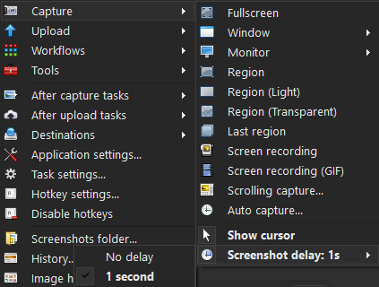
				- 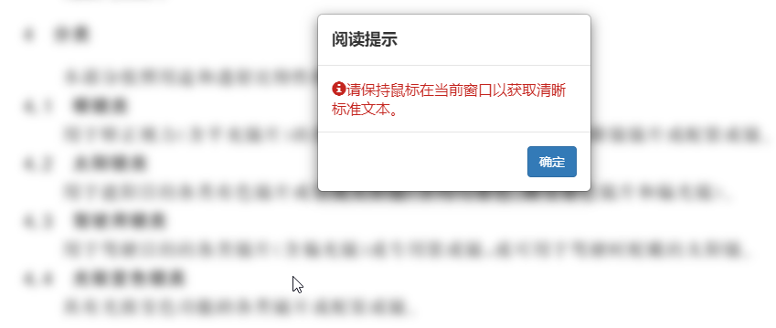
					- ((665bfc72-5de1-4db6-b030-ea7917b0fe23))
			- 一些长图可以截几次拼接（Tools-Image combiner）
			  id:: 66db8ac4-c467-4cbc-902c-6b8c0dd6cec4
		- [GitHub - tylearymf/SETUNA2: A best screenshot small tool (support high dpi screenshots) 一款好用的截图小工具（支持高分屏截图）](https://github.com/tylearymf/SETUNA2) #戴比比比比比哔哔
		  id:: 6612ab3e-795d-4c35-9b41-e77fee7de64d
		- TODO 手机相册文件夹（“电脑有按月的截屏文件夹，怎么你就没有？”）
		  id:: 6614abd4-17b3-4198-a3d3-7500831567b0
		- PPT类视频转图片切片
		  id:: 66a45fbb-0072-4939-b178-f29c1d4476d1
	- 图标
	  id:: 6677bf27-1cee-44d3-81a3-ca78cff78a39
	  collapsed:: true
		- 网站favicon
			- [Online Favicon Downloader](https://favic.one/)
		- 应用图标
			- [如何手动提取应用图标？不用安装软件！ - 哔哩哔哩](https://www.bilibili.com/read/cv17165674)
			- [三种方式，轻松提取 Android 上的 App 图标 | 一日一技 - 少数派](https://sspai.com/post/42544)
	- 头像
	  collapsed:: true
		- “投射”
		- [【研究报告】通过社交媒体的头像选择来分析人物的性格 – UXRen社群](https://www.uxren.cn/?p=40038)
		- [学术论文：中国人的微信头像选择规律研究|社交平台_网易订阅](https://www.163.com/dy/article/GJ9SBI550544ACCC.html)
		- [如何从微信头像，分析一个男人的性格？超准 - 知乎](https://zhuanlan.zhihu.com/p/548260885)
	- [bilibili封面提取_b站封面提取_bilibiliq](https://b23-tv.bilibiliq.com/#)
	- 表情
	  collapsed:: true
		- 微信表情
		  id:: 66853684-27e5-419e-94f2-8e6060c2631d
			- [将微信里的表情包保存到本地的办法 - 知乎](https://zhuanlan.zhihu.com/p/113102720)（微信公众号“表情保存小工具”可以用）
			- 往自己或朋友公众号发表情，然后在公众号网页端下载
	- PS模版生成图片
		- [装逼生成器,装逼制图神器](https://c.tianhezulin.com/index.php)
	- AI生成图片
	  id:: 670d40f3-d788-4805-931e-fa54671defbe
	  collapsed:: true
		- [Stable Diffusion - 在线免费AI图像生成器](https://stabledifffusion.com/zh)
		  id:: 66ade382-d837-4868-af52-b4ae0d296ced
			- [Stable Diffusion WebUI 折腾新篇章 – IYATT-yx 的博客](https://blog.iyatt.com/?p=13123)
		- [【长臂猿数字重生】Blender+Bioxelnoes - 哔哩哔哩](https://www.bilibili.com/read/cv36202130)
		- [AI Image Generator | Recraft](https://www.recraft.ai/)
		  id:: 6608d7df-48e9-4210-9ae6-784a3f6f0698
		  collapsed:: true
			- id:: 6608d7f9-f1f5-4889-a305-994b16d80791
			  >免费生成矢量线性图标素材
			- [GitHub - geekan/MetaGPT: 🌟 The Multi-Agent Framework: First AI Software Company, Towards Natural Language Programming](https://github.com/geekan/MetaGPT)
				- ((65d2f434-e501-4573-81d8-b00e98ee0f68))
		- 多图融合
		  collapsed:: true
			- [MimicBrush - 阿里等开源的AI图像编辑融合框架 | AI工具集官网](https://ai-bot.cn/mimicbrush/)
			- [Outfit Anyone - 阿里开源的一键换衣虚拟试穿项目 | AI工具集官网](https://ai-bot.cn/outfit-anyone/)
		- 风格切换（比如照片换成手绘风格）
	- 图示
	  id:: 6629f549-f80e-41bd-972f-0d54ee89c1fb
	  collapsed:: true
		- AI优化图示（排版等）
		- 白板
		  id:: 65ae0906-959c-4d8e-baeb-3271fc65d7e8
		  collapsed:: true
			- “一图看懂，一镜到底”
				- ((65ae08db-7b92-4199-8748-f67f160e0fa5))
			- 白板，“拍平”，不同角度、不同力度、不同手法，拍出五彩斑斓的平（当然，实际过程往往是慢慢“展平”，像是打开汉堡、鸡肉卷、粽子、荷叶糯米鸡等的包装），但有一点相对确定：在呈现相对复杂的信息时，它应当尽可能快地显示信息之间的联系，而不是搞影分身增加认知负担
			- [fabrie](https://www.fabrie.cn/dashboard/project)
			  collapsed:: true
				- 分享链接（目前用于“敏捷协作”）
					- https://www.fabrie.cn/workspace/65b9cf6c9ea8c1112a544b53?invitedBy=65b90689a49380603891e540&inviteFrom=fabriedoc&inviteMethod=link
					  id:: 65ba09ff-0ada-4d04-a23d-0cde8c380f45
				- 白板+表格
				- [36氪首发｜在线协作工具“Fabrie”完成数千万元Pre-A＋轮融资，面向全球设计市场的“设计白板＋多维表格”_腾讯新闻](https://new.qq.com/rain/a/20221215A00TWD00)
					- >在2020年项目启动之前的用户调研中，Dabo发现，设计师用户往往会将Miro与Notion、Airtable等组合使用，从而弥补白板工具对于结构化信息承载能力的缺失，但数据不互通和切换的低效也是很多设计师用户对在线白板不满的主要原因。
				- [Figma已被替代,Miro还会远吗？——无限白板大全 - 知乎](https://zhuanlan.zhihu.com/p/512318494)
				- [比Miro更合适国人设计师的在线白板工具来了！fabrie文档，我的工作得力助手 - 知乎](https://zhuanlan.zhihu.com/p/525895745)
				- [Fabrie 设计协作平台｜使用技巧01 图表关联功能｜白板+表格联动_哔哩哔哩_bilibili](https://www.bilibili.com/video/BV1dP4y1971c)
				- [在文档中插入多样内容（外部网页应用）| Fabrie 帮助中心](https://help.fabrie.cn/zh/article/5zyo5pah5qgj5lit5os5ywl5asa5qc35yaf5a6577yi5asw6yoo572r6ag15bqu55so77yj-uhpeyf/#3-6aoe5lmm5pah5qgj)
			- ((65ae08c3-3126-4bfd-8f06-6af83d657900))
		- [[图示]]
		- [ProcessOn模板库_思维导图模板_流程图模板_ProcessOn思维导图流程图](https://www.processon.com/template)
		  id:: 667fb60e-23a7-4ba4-a07d-d835d96abf60
		  collapsed:: true
			- collapsed:: true
			  >有“社区内容”的制图工具网站可能有完成度较高的流程图等“模版”
			- ((668203f0-7728-4bbd-a70a-b20df69b201c))
			- ((66808fef-30dc-4c40-aa4b-5c86073e0ff2))
			- ((6682046b-6b0e-4e6a-9805-d05bc07692f8))
		- 创作计划（“有可能一张图搞定的，对吧？”）
			- 长图
			  collapsed:: true
				- ((667b89d9-f3a2-4503-815f-fa551b104880)) 漫画切片一张图
			- ---
			- 集中
				- 首先，能相对容易地找到你自己最近关注的信息
				- [[为什么要用电脑？]]
				- ((65ae0906-5c70-429b-a10d-250ae2200e76))
					- 旧笔记迁移、整理
				- [[电子笔记组织方式]]
					- 几种链接
					- 知乎等的评论区缩进
					- 大纲缩进——“斜目而视”
					  id:: 664df554-88e8-45b8-a4fe-443bd39c92ce
					  collapsed:: true
						- ((664df622-f6bd-45ac-a2a0-29344106a9a5))
			- 人流（信任网络、）、物流（车流）、资金/现金流（现值）、信息流（信任网络）、时间流
		- ---
		- [draw.io](https://www.drawio.com/)
		  id:: 4eedd2d5-4f80-4fb7-998a-55a2116dc5d6
			- 比普通导图高到不知道哪里去了
			- 可以根据谐音叫它“桌游”，毕竟可能是画个有趣的图
			- [有哪些软件堪称神器，却不为大众所知？](https://www.zhihu.com/question/300735799/answer/894112141)
			- 技巧
				- [Draw.io基础操作与进阶 - 红豆绿豆abc - 博客园](https://www.cnblogs.com/hdld/p/drawio-basic-operation-and-advanced-z8e45t.html)
				- 建议“其它”-“自动保存”
				- 空间/规划
				  collapsed:: true
					- 制图容易空间拥挤，方向不明确，然后不停改——“可以一开始先拉大点”
					- 可以搞出“流程图语言”
					- {{embed ((66753f04-ab92-4e03-bb49-1fb57022e559))}}
					- ---
					- 人体部位（“装备槽”、“脉轮”、[[密教模拟器]]）、元素周期表、五线谱
						- ((66335beb-d683-4bb3-8475-a0f6349ffbc4))
					- TODO 迷你地铁（“好，我玩，我玩”——“哈哈，种子下了一两个月还没动”）
				- 形状选择
					-
				- 未选中时
					- 点形状四周冒出来的箭头里的形状快速添加形状、复制原文本并连线
				- 选中后
					- 复制样式/大小粘贴
					- shift点新形状或拖动新形状到当前形状上切换当前形状
					- ctrl拖动形状复制
					- ctrl左键可显示链接（若有）
					- 组合——方便整体拖动和模块化拼接（目前用得还不多）
				- “文件”-“导出为”
					- 导出的png图片方便更多设备直接看，也可以导入编辑（但会丢失链接等，pdf不会，但选择单页也会丢失）
						- “高级”，调高PNG格式的DPI可使放大后的PNG图片更清晰
					- 连接（“在新窗口打开”，可将导出后文件中的所有链接设置为在新窗口打开）
				- （及时更新）上传 ((658fc4ca-21a3-49e7-a6b8-6277d16e0062))
					- “同理”，将图示文件放到logseq图谱文件夹的assets文件夹内即可
					- 读者可点击左上角放大图片，也可右键在新标签页打开图片（可点击链接，但背景颜色可能会变），还可右键图片另存为
				- 用其他软件协作
					- ((65ab10fa-9bb1-4c11-8112-1d5744559b36))插件Draw.io Integration（可在vscode中打开和编辑带drawio等后缀的文件，可配合 {{embed ((6676e10f-b47c-402a-8abb-970dd121fede))}} 使用）
					  id:: 6676e1ea-8176-4cfd-83b1-014ef38e773f
						- [Visual Studio Code用Live Share实现DrawIO协同编辑_哔哩哔哩_bilibili](https://www.bilibili.com/video/BV1Km421V7Db)
						- 
					- Microsoft Teams
						- [下载 Microsoft Teams 桌面和移动应用 | Microsoft Teams](https://www.microsoft.com/zh-cn/microsoft-teams/download-app#download-for-desktop)
						- [Use draw.io in Microsoft Teams](https://www.drawio.com/doc/faq/microsoft-teams-diagrams)
				- ---
				- 不确定会不会的
					- 转换为长图（“可能很多人只愿意下划”）
					- 程序作图（导出分级）
						- [用Kimi+drawio，10 秒生成流程图，支持再编辑_哔哩哔哩_bilibili](https://www.bilibili.com/video/BV1SZ421n7Cm)
						- [如何通过代码生成流程图？https://debug996.com 一招搞定_哔哩哔哩_bilibili](https://www.bilibili.com/video/BV15A4m1j7as)
					- [【drawio笔记】向ERD表，列表和UML类添加行](https://blog.csdn.net/u012028275/article/details/113799920)
					- [使用Draw.io制作泳道图](https://www.jianshu.com/p/479cf981275a)
			- [VisionOn](https://visionon.cn/clipboard)
			  id:: 6636e4f0-63d2-44dc-a30e-c3cf71c2fcd0
				- 可以多条线并线（比看起来并线还多一点）、分页、思维导图也是图
				- 但用到现在还没明确感知与drawio的不同，还是先用（回）drawio桌面端了
			- ---
			- 历史创作
				- {{embed [[20210927]]}}
		- ---
		- [使用LibreOffice的Draw取代Microsoft visio_libreoffice draw-CSDN博客](https://blog.csdn.net/u010020404/article/details/124666977)
		- 图层模型（图片）
		- 比较
			- 拼接肢体（《弗兰肯斯坦的怪物》，德勒兹《差异与重复》，“emoji爷”）
			  id:: d37480cc-98b5-4623-b013-cac525128c65
			- 有名、链接的点与线图
				- 页面名点线图，段落块
		- ((65d5659d-f596-40ad-a7a1-569d2f50a2e7))
	- 设计
	  collapsed:: true
		- 《写给大家看的设计书》
			- CRAP原则：对比Contrast、重复Repetiton、对齐Alignment、亲密性Proximity
			  id:: 66753f04-ab92-4e03-bb49-1fb57022e559
				- 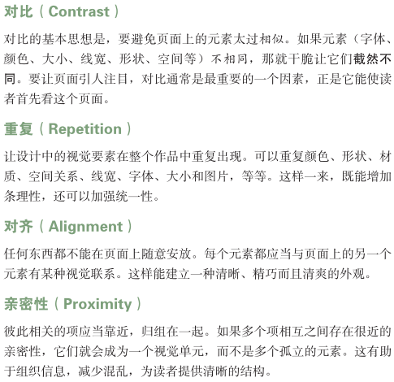{:height 478, :width 485}
	- 要少念词画面就得去掉快乐音乐
	- 图片素材
	  collapsed:: true
		- >估算工作量/供应量不难，文案字数除以配音速率大致就是视频长度，然后就是填充
		  视频素材要找或制作自己觉得比较有意义的可能比较难，我第一次找素材，也意识到了这种情况，但意识到了也没能力整够，也不好意思说
		- [干货分享 | 公众号图片素材网站资源集合 - 知乎](https://zhuanlan.zhihu.com/p/145304411)
	- 图床
	  collapsed:: true
		- 微信公众号素材库
	- 动图GIF
	  collapsed:: true
		- [ScreenToGif](https://www.screentogif.com/)
	- 半透明重叠图片
		- “看《怪屋谜案》看的”
		- 使用win11自带“照片”打开两个窗口
		- ((67160898-3fc5-4b06-a4cc-db9e6ac9c476))
	- ((66a4c2be-76bc-4358-b26a-d5fcf79dc201))
	- 链接嵌入图片
	- 识别图中视频中链接、文献并给出清单、打开
- 音频
  id:: 670d40f3-73a3-49de-9919-e1e3584d7b3a
  collapsed:: true
	- Spotify
	  id:: 65ba628c-4095-4cfc-9141-b0b1b37372c3
	  collapsed:: true
		- 国内要开VIP乃至专门的歌手包的也免费，还有国内不让放的，目前只没搜到过一首俄语歌——又有首乌克兰语在美区还隔段时间听一版辉瑞的药和疫苗的广告——“患者消费力”
		  collapsed:: true
			- ((659b89ca-598a-4948-a6c3-0b9a1dad7464))
		- >这软件要配合插件使用，pc 上的是 spicetify，去搜一下，android 和 ios 直接去 tg 上下载 no premium 版本，有群，spotify 的限制几乎都在前端，所以可以完全避免
			- [Installation | Spicetify](https://spicetify.app/docs/advanced-usage/installation/)
				- ((6703c950-4e79-45f6-b61f-10023073a7d0))
	- 下载
	  collapsed:: true
		- 有声书下载
		  id:: 6708731e-8f40-41a4-b366-a98b043a7e70
			- [喜马拉雅下载工具 Ximalaya-Downloader v0.3.8 开源 - 『精品软件区』 - 吾爱破解 - LCG - LSG |安卓破解|病毒分析|www.52pojie.cn](https://www.52pojie.cn/thread-1922065-1-1.html)
			  id:: 668f86e2-bb5c-44db-b007-5f74642cd915
				- [GitHub - Diaoxiaozhang/Ximalaya-Downloader: 喜马拉雅专辑音频一键下载工具](https://github.com/Diaoxiaozhang/Ximalaya-Downloader)
		- 扒曲
		  id:: 65f83b03-53e2-49d8-b58e-adbc2c293218
			- ((65d734ea-1a53-4fbe-b3ed-4ea445fadb75))
				- “网络”-“媒体”，点击播放，列表中出现媒体链接条目（如果没出现则取消选择“媒体”所在行之下的三个选项），一般任选一个下载即可（以网易云音乐为例，可能一般是不如客户端中可能免费下载的320kbps及以上的96-100kbps的普通音质）
	- 配音
	  collapsed:: true
		- ((65e5ba68-4f8f-4a6c-bba4-5ea6636b05cd))
		- 采用同一种语音可能相对低成本地渗透用户注意力（“但可能仅此而已”）
		- 文本转语音（TTS）
		  id:: 65d547ee-c15f-478f-ad5b-1f57c27ceec8
		  collapsed:: true
			- TODO 浏览器文本转语音插件
				- [Read Aloud软件 - 哔哩哔哩](https://www.bilibili.com/read/cv15287221)
			- [TTS-Vue | Loker小站](https://loker-page.lgwawork.com/home.html)（微软语音包，一段文本的字数上限可能是2000）
			  id:: 6693be62-c416-4963-8110-8948e54f26a2
				- [文本文件拆分 - 小蚂蚁工具箱](https://www.anttoolbox.com/zh/tools/txt-splitter)（之前每667字符拆分，基本都是1900多字）
				  id:: 66a4ac45-0bd8-468f-9e7e-bf3975f6450a
			- [GitHub - CCmahua/ChatTTS-Enhanced](https://github.com/CCmahua/ChatTTS-Enhanced)（可以调音，可以分割和合并）
			  id:: 6698d13c-114f-4f28-b0ab-5cb72bc702af
			- [可离线的文本转语音工具MultiTTS v1.3.5.2 （听书专用，附海量语音包） - 『精品软件区』 - 吾爱破解 - LCG - LSG |安卓破解|病毒分析|www.52pojie.cn](https://www.52pojie.cn/thread-1906366-1-1.html)（附了二次元角色语音包）
			- AI训练语音
			  id:: 670d40f3-a9cd-4a29-aa33-66784ca7d812
				- [GitHub - RVC-Boss/GPT-SoVITS: 1 min voice data can also be used to train a good TTS model! (few shot voice cloning)](https://github.com/RVC-Boss/GPT-SoVITS)
					- [整合包教程 · 语雀](https://www.yuque.com/baicaigongchang1145haoyuangong/ib3g1e/xyyqrfwiu3e2bgyk)
					- [【工具分享】 伊地知虹夏教你如何剪未切_哔哩哔哩_bilibili](https://www.bilibili.com/video/BV1HPYneqE9B)
			- ---
			- PDF转txt
			  id:: 670d40f3-576d-4769-9366-10edfe7005d1
			- 长文本tts
	- 频谱分析
	  id:: 672ca07e-da81-45ba-8ab0-7f2737729ef4
	- TODO 炸麦
	  id:: 65ebf220-4e85-4836-8998-6b74fc487e17
	  collapsed:: true
		- [我的麦真的很烂吗?_哔哩哔哩_bilibili](https://www.bilibili.com/video/BV1W54y1q7XQ)
		- 
		- WO Mic（手机麦克风当电脑麦克风） #伊德格拉米
		  id:: 65f11818-bb62-4a4b-b08c-b2187c77c20d
	- 自然人声修复
	  collapsed:: true
		- [【音频修复】RX10 极简教程 喷麦 电流 过载  口水声 呼吸声_哔哩哔哩_bilibili](https://www.bilibili.com/video/BV1Ad4y1x7J8)（降噪，但是建议先换个麦）
		  id:: 65bcbf4a-8fb9-4859-9b7e-c31f50f56575
	- 调音
	  collapsed:: true
		- Melodyne
		  :LOGBOOK:
		  CLOCK: [2024-01-22 Mon 10:32:14]
		  :END:
			- [Melodyne5最新版下载安装教程！人声修音辅助工具Melodyne下载！_哔哩哔哩_bilibili](https://www.bilibili.com/video/BV1ug411y7Au)
			- [【官方中文】3分钟搞懂FL studio操作_哔哩哔哩_bilibili](https://www.bilibili.com/video/BV1UZ4y1e7N1)
			- [人类高质量翻唱修音教程！【Melodyne × FL Studio】_哔哩哔哩_bilibili](https://www.bilibili.com/video/BV1kL4y1a7cM)
			- [【制冰速成班】一秒钟学会调音：麦乐迪篇（内含电棍麦乐迪用音源语音包）（调音教程）_哔哩哔哩_bilibili](https://www.bilibili.com/video/BV1Bu411V7BF)（“伊德格拉米直播时看的是这个”，但纯小白可能连作者用的是什么宿主软件、如何下载安装、被骗被偷袭下到老版本不能调中文怎么办，以及如何添加和打开melodyne插件都不清楚——“这个fl studio的前置流程对纯小白来说依旧有点难走，懂的都懂”）
	- 音频文件合并
	  collapsed:: true
		- [Audio Joiner - 合并在线歌曲和mp3文件](https://audio-joiner.com/cn/)
	- 播客
	  collapsed:: true
		- 文章转听书平台（教如何更灵活地听任何文本）
			- ((6613bc65-6fda-4449-b94b-ca22fe5ac309))
		- （大部分播客现存的）问题
		  collapsed:: true
			- ((6664e8cc-3abf-418e-b4cf-d5a6a308fa35))
				- 水时长
					- 转折承接词多，拖泥带水
				- TODO 我爸：喜马拉雅上现在低质量的挺多的，但是我晨练又总要听点什么
				  id:: 66651dd9-b16e-4523-80e1-66685cc09c6a
		- 视频化的图文播客（朗读到对应位置时显示图片；快捷快退快进跳转等）
	- ((66d8e609-ab06-4fb1-9acf-268e4f3a4445))
	  collapsed:: true
	- collapsed:: true
	  ---
	- [KOOK,一个好用的语音沟通工具 - 官方网站](https://www.kookapp.cn/)
- [[视频]]
  id:: 670d40f3-2916-466d-9fd8-86de6248dd48
  collapsed:: true
	- 播放
		- PotPlayer
		  id:: 6728d49e-37f3-455b-80de-0327c40da030
			- [Global Potplayer](https://potplayer.tv/)
	- ((668ce756-d3d4-4002-9a7d-8f4c1623ab58))
	- ((66ade382-bd00-4c8e-9790-eb8b1468f2d6))
	- 直播
	  collapsed:: true
		- ((6705ffa6-6fab-4749-a4d9-775d47a6d5f6))
		- [[别喂猴子]]
		- b站直播
		  id:: 65d2bed2-0327-4431-8340-08fd0020b9da
		  collapsed:: true
			- 直播体验
			  id:: 65d2c007-e95f-4ab9-a677-2369aeb76000
			  collapsed:: true
				- 开播提醒
				  id:: 65d6a1f6-713e-4361-b3bc-a36b1ad495d2
				  collapsed:: true
					- [GitHub - yunhuanyx/biliLiveNotification: b站直播开播提醒](https://github.com/yunhuanyx/biliLiveNotification)（“我TM莱纳！”；可能伊德格拉米他们用的录播软件是另一套；如果没弹窗和音效，可以在通知设置中关闭“请勿打扰”）
						- TODO 直播间内容切换提醒（比如从读书换成我更爱看的游戏或citywalk）
						- TODO 直播间进入特定用户提醒（“欢迎XXX进入直播间”）
						  id:: 65d96f9b-2922-4b60-b0fe-c754028fb458
						- 我（让这个软件）监听的直播间代码
						  id:: 65e2baf6-94f0-4f26-945d-05bdf46c1d72
							- 915430,7531557,26671817,30037846,27670200,30549234,11178526,2510107,931867,30403893,30798627,27655833,31397291,27717883,22073531,27046181,27278624,27734411,31257302,27177338,27696663,27451600,27737242,26270403,26423463,23637851,2776021,30280350,24002168,26951708,3948587,25258354,27813906
				- 录播（“精彩节目，回头再看！”）
				  collapsed:: true
					- [录播姬 ★ 一个简单好用的直播录制工具](https://rec.danmuji.org/) #伊德格拉米
					  id:: 6689e5aa-f374-4364-8c6a-f0a949273f35
				- TODO 下播提醒/自动退出（“你以为我在挂机？是的”——“唉呀呀，实在是有点忙，打开看还在转世界之夜就忙别的去忘了，再回来已经结束力！”）
				  id:: 65dc85d5-17a6-40d4-bbfe-01da565ba296
				- {{embed ((65d547ee-c15f-478f-ad5b-1f57c27ceec8))}}（b站直播一般不提供字幕）
				- 贡献值
					- 点赞
						- 光用电脑点赞可能达不到上限，可以用手机点赞达到上限
							- 手机单手点赞效率低，另一只手两三个手指一起点更快
						- TODO 自动点赞（鼠标连点器；“早该点点了是吧？”） #杭州地星
						  id:: 65e2a8ea-e86f-4478-a0f7-46fe38d62b2c
				- 直播窗口拼接（“我赶时间，你们一起上——坏了，一次盯六个直播间有点hold不住了”）
				  collapsed:: true
				  :LOGBOOK:
				  CLOCK: [2024-02-14 Wed 10:24:44]--[2024-02-14 Wed 10:24:45] =>  00:00:01
				  :END:
					- ((cb62e8cd-35a0-460c-8fa4-3cd98cfb7d2b))
					- b站的小窗模式/画中画是不错的，但好像只能开一个，且看不到弹幕
					  id:: 65d2f0f7-5d1d-438b-a03d-caa26f8b18e0
						- ==“坏了，才发现b站的小窗模式/画中画窗口可以缩放”==
						  id:: 65d2bbc1-8130-454f-98b1-d686c13fcdf7
						- TODO [隐藏浏览器窗口的用户界面 | Vivaldi Browser Help](https://help.vivaldi.com/zh-hans/desktop-zh-hans/appearance-customization-zh-hans/hide-browser-windows-user-interface/)（“隐藏、分屏、全屏互相冲突，可能还是Vivaldi搞得好点，虽然还没试过那功能”）
						  :LOGBOOK:
						  CLOCK: [2024-02-14 Wed 10:24:45]--[2024-02-14 Wed 10:24:46] =>  00:00:01
						  :END:
						- TODO 弹幕用 ((659c9e71-570c-46ec-8f44-82c8af29f35e))的“裁剪”（“专业版功能”）或其他软件的类似功能显示？
				- TODO 直播竖屏“歪脖子矫正”（“那个开车装修组明知故犯，无良主播！”）
				  :LOGBOOK:
				  CLOCK: [2024-02-14 Wed 10:24:44]--[2024-02-14 Wed 10:24:45] =>  00:00:01
				  :END:
				- TODO 分视角的多个直播间直播音画同步（比如“未明子视角”和“俱乐部视角”）
				  :LOGBOOK:
				  CLOCK: [2024-02-14 Wed 10:24:44]--[2024-02-14 Wed 10:24:45] =>  00:00:01
				  :END:
				- TODO 直播音量单独控制（不要调了一个直播间的音量，其他直播间卡顿一次后就被统一音量）
				  :LOGBOOK:
				  CLOCK: [2024-02-14 Wed 10:24:44]--[2024-02-14 Wed 10:24:45] =>  00:00:01
				  :END:
					- TODO 单个直播间的 ((65d2aef4-03a9-41c1-b9cc-85c2fa6a4abd))
					  id:: 65d5d2c9-f6b8-4941-bc2d-5cdbfb3b7090
				- TODO 小窗模式/画中画在直播卡顿时不闪退
				  :LOGBOOK:
				  CLOCK: [2024-02-14 Wed 10:24:44]--[2024-02-14 Wed 10:24:45] =>  00:00:01
				  :END:
			- [Bilibili Live Tasks Helper](https://greasyfork.org/zh-CN/scripts/406048-bilibili-live-tasks-helper)
			- 粉丝牌
				- >粉丝牌也是查成分、兴趣等的数据，也可以自动化
				- [GitHub - XiaoMiku01/fansMedalHelper: 新版B站粉丝牌助手 全自动升级粉丝牌](https://github.com/XiaoMiku01/fansMedalHelper)
					- [B站粉丝牌助手文档](https://xiaomiku01.github.io/fansMedalHelperVersion/)
			- 弹幕
			  id:: 66ade382-bd00-4c8e-9790-eb8b1468f2d6
				- 直播间交朋友
					- [【大笨蛋反叛手册】反抗第一步——交友！_哔哩哔哩_bilibili](https://www.bilibili.com/video/BV1R6421G73C)
				- [bilibili直播净化](https://greasyfork.org/zh-CN/scripts/21416-bilibili%E7%9B%B4%E6%92%AD%E5%87%80%E5%8C%96)
				- 弹幕屏蔽词
					- [Bilibili 屏蔽词分享平台](https://harrynull.tech/bilibili/index.html)
				- 直播弹幕被保留到了直播回放视频里
				- ((66bb211f-7d7f-46c7-8444-99d7fc77f155))
				- TODO （直播）弹幕记录、统计、语义分析
				  id:: 65d81727-db85-4b4a-a7b3-3652e454e47f
			- 推流
				- ((66975248-0471-426f-9fad-41c033b7262c))
					- 人气榜
					  id:: 668deec5-9a11-4d9b-9960-042970eadbe3
					  collapsed:: true
						- 人气票
						  id:: 65d8136b-ccfd-49b4-a4ac-14e2e756291a
							- >朋友们左上角人气票送一下
							- [【B站直播必懂】三个你必须要懂领取的东西！ - 哔哩哔哩](https://www.bilibili.com/read/cv28190588)
								- >“哈哈，终于会送人气票了” ![[傲娇]](http://i0.hdslb.com/bfs/live/b5b44f099059a1bafb2c2722cfe9a6f62c1dc531.png@.webp)
							- 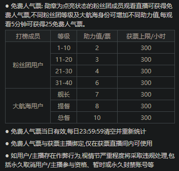
								- 如果只算前两个等级档位，一个人一小时能助力600/900，十个人就是6000/9000，一百个人就是60000/90000
							- TODO 强制保持观看状态（有时挂机发现人气票比规则上限少？）
							  id:: 65db11f6-ff57-4c26-b821-c388be12fd9b
							- 攒！整点后再看要不要发，如果开播时已经过了半点了，可能人气票发了就没啥效果了
					- 热榜
					  id:: 668deec5-bacb-497f-8a01-f8f2f0a4ddb0
			- 风控
				- 直播延迟
				  collapsed:: true
					- [💙三分钟学会B站直播姬直播延迟设置及OBS详细设置方法教程视频 【ROCEYS】4U ❤_哔哩哔哩_bilibili](https://www.bilibili.com/video/BV1at4y1Y7Dt)
				- TODO 直播画面关键词屏蔽
				  id:: 65eab057-2f7f-47c3-a437-da9d0023f96a
					- 浏览器插件
			- 不看屏直播（比如运动中）
				- 增加更多音效、点播串流（？）、AI读评论（有些AI直播间是这样的，虽说这样可能会让弹幕乱起来）
			- 直播PK
			  id:: 65e698dc-428f-4ba4-b201-cac076b42b30
				- 限时的PK票（“鼓励PK”）
				- 召唤观众来（“我不舒服，叫观众来”）
		- 视频会议
			- 视频会议摸鱼
			  id:: 66bec185-d0e0-43b4-990a-33d127fb34a2
				- [如何在视频会议中摸鱼？和你分享我的「开会摸鱼学」-36氪](https://www.36kr.com/p/1628649488250631)
			- 腾讯会议
			  id:: 66335bea-507c-418c-9ec3-8d279d0c9859
				- ((6705ffa6-a197-4082-8043-246c76aa1e32))
				- [怎么在一台电脑同时打开多个腾讯会议 - 知乎](https://zhuanlan.zhihu.com/p/581113069)
					- >新版腾讯会议开始检测sandboxie了 沙盘内运行的进程会被终止
						- >难怪，可以安装安卓虚拟机，多开虚拟机就能多开腾讯会议
		- 直播所需的能力
		  collapsed:: true
			- 跑步血氧厚，最差结果拖到对方下播
				- [未明子巧妙举例，走完四个阶段拿捏一项能力|循序渐进是成长的良方_哔哩哔哩_bilibili](https://www.bilibili.com/video/BV1mu4y1Y7em)
				  id:: 65d81a7a-81c3-4209-b9a1-ba1ed66ce059
		- “镜头语言”
			- 笑到（或抖腿）上下晃鼠标
		- TODO >也可以试试视频会议，应该也有能把多个单向窗口模拟成单个多人环绕视频的工具吧？比如像ovice那样手动引导视频朝向（注：ovice好像并没有这样的视频功能，虚拟形象可以转向罢了），这下我将以高达形态出击了
		  id:: 667bd2c7-5dac-40fa-bec5-007b5215ac50
		  collapsed:: true
			- >什么“复眼”？
				- ((667b89d8-e852-489f-8b8f-5dc585343d28))纯粹解剖学前三集提到过“复眼”
			- [用腾讯会议和vMix完成了一个单人多机位线上线下会议直播，直播省成本操作方法分享给大家。_哔哩哔哩_bilibili](https://www.bilibili.com/video/BV1414y1p73i)
			- [探索沉浸与智能会议未来，腾讯会议带来了裸眼3D技术和它们！-腾讯会议官网](https://meeting.tencent.com/news/luoyan3d.html)
			- [Meta实验研究：虚拟现实比视频会议更具面对面交流体验 - 腾讯云开发者社区-腾讯云](https://cloud.tencent.com/developer/news/874313)
			- [3D视频会议系统VirtualCube：相隔万里也如近在咫尺般身临其境-CSDN博客](https://blog.csdn.net/tMb8Z9Vdm66wH68VX1/article/details/125012985)（这个最接近）
	- 投屏
	  collapsed:: true
		- 手机投屏到电脑
		  id:: 671aff71-16aa-4fd9-b91c-155a77c78cb3
			- [GitHub - Genymobile/scrcpy: Display and control your Android device](https://github.com/Genymobile/scrcpy)
				- [如何用鼠标键盘控制手机？这个开源工具很实用-鼠标键盘,控制,手机 ——快科技(驱动之家旗下媒体)--科技改变未来](https://news.mydrivers.com/1/643/643104.htm)
			- [手机投屏到电脑_哔哩哔哩_bilibili](https://www.bilibili.com/video/BV1UH4y1E7N8)
	- [【内部学习】做视频从入土到入土_哔哩哔哩_bilibili](https://www.bilibili.com/video/BV1wJ4m1p7sz)
	- [[素材]]
	  collapsed:: true
		- 有些需要征得（“因为有些已经预先同意了”）作者同意
		- 平台视频下载
			- ((6699a046-6a47-4283-889d-e6bd22a6cd94))
			- [哔哩哔哩(bilibili)视频解析下载 - 保存B站视频到手机、电脑](https://bili.iiilab.com/)（不能保证1080P，试过一两种类似工具，也一样，甚至无法下载）
			- [12 个最佳在线 YouTube 下载器，可下载 1080P/4K 视频 - 知乎](https://zhuanlan.zhihu.com/p/664775747)
			- [Github 上 lux 下载神器的安装及使用教程_lux下载-CSDN博客](https://blog.csdn.net/weixin_44427004/article/details/125765917)（命令行）
			- 批量下载（频道、播放列表等）
				- [4K Video Downloader+ v1.9.0.0128破解版 - 423Down](https://www.423down.com/15386.html)
				- 收费
					- [给大家分享一个批量下载YouTube视频的方法（省时省力）_哔哩哔哩_bilibili](https://www.bilibili.com/video/BV1Zy4y1r7LM)
	- [怎么合并bilibili下载的视频（用notepad3与ffmpeg） - 知乎](https://zhuanlan.zhihu.com/p/643423466)
	- 剪辑
	  collapsed:: true
		- [小约翰可汗如何剪视频？_哔哩哔哩_bilibili](https://www.bilibili.com/video/BV1pY4y1g7sQ)
		- [【干货】一小时上手达芬奇剪辑！第一集：入门简介_哔哩哔哩_bilibili](https://www.bilibili.com/video/BV1B7411A7M1)
		- Shotcut（以前临时来活剪短过一个宣传片，用PPT般的淡入淡出效果过渡切片；我用时闪退过，记得手动保存；音频处理的效率大概是差些，搞特效需要用别的）
		  collapsed:: true
		  :LOGBOOK:
		  CLOCK: [2024-01-21 Sun 20:07:38]
		  :END:
			- [目前排名第一的免费视频剪辑软件！新手用了都说好！（手把手傻瓜式教程）_哔哩哔哩_bilibili](https://www.bilibili.com/video/BV1J44y1L7qd)（滤镜相对详细的讲解靠后，关键帧相对详细的讲解更靠后）
			- 目前差不多学会的
				- 时间线（放轨道的）、轨道（类比“图层”）、片段（通过对“剪辑”实现，剪视频）、滤镜（效果、特效；互动视频片段衔接）、关键帧（调整滤镜的时点和时长）
				- 速度（）、音高补偿（部分还原速度造成的音高偏差）
				- “联动”等（比如拖动音频轨道到视频轨道可能要调一下）
	- 后期
	  collapsed:: true
		- [设计宝藏资源站 - 免费分享影视后期三维CG特效设计资源软件](https://www.shejibaozang.com/) #伊德格拉米
		  id:: 65f11fd7-52e2-4535-8096-e1b693159490
	- [各类资源 软件+教程+插件+素材（Win版）_免费高速下载|百度网盘-分享无限制](https://pan.baidu.com/s/1ZBHjUei6IuAWaIbT2XagWw?pwd=2929#list/path=%2F)
	- [做短视频运营，至少要用到三个文档！_哔哩哔哩_bilibili](https://www.bilibili.com/video/BV12x421Q7Kb)
	- 通过较好（指内容质量乃至制作精良程度，不一定包含传播效果）作品的工程文件等过程文件学习
	- 建模
	  collapsed:: true
		- [AutoCAD最新版免费下载安装包与详细安装教程，AutoCAD2025免费下载安装教程，附带安装包_哔哩哔哩_bilibili](https://www.bilibili.com/video/BV1XT42127Cp)
	- 案例
	  collapsed:: true
		- [[药物剂型]]（“不会”制作艺术字和抠图的素材手视角）
	- 类型
	  collapsed:: true
		- PPT动画视频（简单的绘图和动画）
		  collapsed:: true
			- ((65af09a6-7ba4-47f4-a7fa-d506fecafaec))
			- ((65b23144-41a0-4730-8481-26112cefe4bf))
	- （一般的）时间顺序（如果有的话）
	  collapsed:: true
		- 文案-素材-剪辑-配音
	- 视频协作
	  collapsed:: true
		- 创作者能力圈
			- 软件、素材、（美术等的）风格
		- 同步创作相关文件（素材、项目文件等；“方便制作和监工”）
		  id:: 65f81c7c-f3fa-46e4-83b7-1adccca56ac9
		  collapsed:: true
			- ((65964bbc-7743-4c1e-8185-a61725fe6e2e))
		- 讨论区
		  collapsed:: true
			- 我觉得可以再细化一些，在文档里加引用文档、参考文献/资料（视频末尾、简介中也应该有）、制作方案（视频时长，编排等等；多备选方案可以画图示）、内容注释、任务/待办（可能含任务指派、认领）、进度等的讨论区
				- 除了评论，还可以用可用图标和颜色标记身份的高亮块，从看的角度看，比 ((65bcbf51-2f2a-4382-aa29-445d25946165)) 还省一步
			- ((65bcbf4a-7239-4867-8ffb-6f559fe9647e))
		- TODO 发布预览（有的平台没有？）
		  id:: 65d1a092-8008-4072-8c1b-32f660906f3e
	- AI生成视频
	  id:: 65d54ccb-122a-4744-9616-dd463d924929
	  collapsed:: true
		- [我个人认为意大利面就应该拌42号混凝土！_哔哩哔哩_bilibili](https://www.bilibili.com/video/BV1fneYeTEXi)
		- 局部生成/切换
			- ai换脸
				- [5800元网课老师竟是AI换脸，讲课时手指直接穿过面部，机构回应_哔哩哔哩_bilibili](https://www.bilibili.com/video/BV1qWHaeAEg5)
				  id:: 670e3ec9-ffc6-4096-8389-f2b0630a2120
		- {{embed ((66ade382-d837-4868-af52-b4ae0d296ced))}}
		- TODO [EbSynth brings art to life with 2D motion capture](https://ebsynth.com/)
		- 虚拟形象
		  id:: 65c9cdf4-db08-4482-9c5f-4e6cd5bf90e6
			- neuro
			  id:: 65c9cdfb-1a95-418e-8ccc-138b20f13311
		- 分析
		  collapsed:: true
	- ((668ce780-d5d0-4885-96f0-2585a49a2e83))
	  collapsed:: true
		- [挂神了！国外小哥将gpt4o接入家里的摄像头，24小时…_哔哩哔哩_bilibili](https://www.bilibili.com/video/BV1vRbxeAER5)
	- ---
	- [[影视]]
		- 网飞
			- [网飞：和优秀的人共事，不用太在乎他们的自尊](https://mp.weixin.qq.com/s/J3Avl3me3jQJxDUgJqcwlw)
			  id:: 6262261d-65ce-45ac-90d7-46df03f256dc
				- ((62621fa5-ccb8-4df2-a89a-e4900de7aa60))
- 游戏
  collapsed:: true
	- ((668f8021-44cb-44b7-aea2-0b3701466195)) 有一堆破解版游戏
	- Steam
		- [电脑上下 Steam 的游戏违法吗? - 知乎](https://www.zhihu.com/question/639331356)
		- ((65d2ecf3-8af1-47e4-9219-317a3d501fe1))
- ---
- 传播
  id:: 66ade382-4522-425f-a5dc-d15c1ee11f36
  collapsed:: true
	- 媒介本身就影响我们对以媒介为载体的信息形成的观念/观点
	- ((62bd9a91-82cc-4bc1-a88f-711617b187a3))
		- ((66db8abc-d0eb-4233-8616-e347bd0917f5))
	- 传播，转化，再传播
	- 单传VS普传
		- 单传
			- ((66fbd75d-cd6f-47fe-8d49-1f3221cfd493))
	- [马督工教你做自媒体 - YouTube](https://www.youtube.com/playlist?list=PLYWej3X6HahwuZcr0zfZO2QtqBcnMNQdz)
	  collapsed:: true
		- [如何看待“马督工教你做自媒体”? - 知乎](https://www.zhihu.com/question/623573611)
		- >我有点怀疑，除了相当一部分人的视频制作方式和时长可能受未圣影响外，发后不怎么管反馈的习惯也可能是——昨天看马前卒那个网课的知乎问答，就有说他们互动比较用心的
	- 策划
	  collapsed:: true
		- [我是如何一步一步策划出“跪行救女”事件的？_哔哩哔哩_bilibili](https://www.bilibili.com/video/BV1gp4y1c7Zh)
	- 改写
	  collapsed:: true
		- “措！辞！”
		- [可读性 - 维基百科，自由的百科全书](https://zh.wikipedia.org/zh-cn/%E5%8F%AF%E8%AF%BB%E6%80%A7)
			- 导出为文本或图片、文档等文件
			  collapsed:: true
				- ((66335bea-0e25-4ba3-902d-96da36b1ff66))
				- ((65bcbf46-9860-48d3-84e1-592c30b25207))
				- {{embed ((65adf755-9d42-4731-9bb7-32cebb0aa63c))}}
		- 发后再改
		  id:: 66d5157b-16b1-44a6-b24e-14b7aa1a819d
			- ((66ade382-a868-4712-a5ce-b93a7794cf85))
			  collapsed:: true
			- 改动态
				- “耍猴是吧？”
				- >之前登闻鼓、刺过者那一两期大概还有意无意制造了版本冲突，未圣只需要赶时间先发再改就可以了，而批判者如果截得早，之后对不上要考虑的就很多了
		- “剧本（杀）”
			- “这么剧烈的东西本来要杀掉的”
			- 顾左右而言他
	- 隐身
	  collapsed:: true
		- 我们都知道，媒体和特定传播的金主可能倾向于隐身而非暴露
		- 之后你再假模假样就把自己摘干净了吗？不是的，可能怀疑你的人早就掌握了实打实的证据，但考虑到“证据合法性”、“规矩”、“国际观瞻”等就是拿不出手也下不了手（反之，如来一车面包人把你剋一顿，都算是温和的教训了）
		- 他们是玩惯了猫鼠游戏，而鼠鼠你只是一只年轻鼠鼠
		- 有时我们不幸在觥筹交错、网上冲浪等场景因为掌握了稀缺且有利可图的东西而有机会做好事了也可能被人拿枪指着，比如个人纯自发的“义诊”按规定完全可以被举报成非法行医
		- 怎么办？就此罢休吗？如果掌握的东西能“纯自用”，就独自“小确幸”吗？
		- >其实另外的办法是有的，但是利益牵扯太大，所以传播是一个学习，对于追求一个低风险的传播来说，它是破坏性的，它凸显了一传到底的风格又能怎么样，你丢掉了安全，丢掉了牺牲了人物，孰重孰轻啊？ 所以我在学习，我在学习做一个导演的思考，这就是我的遗憾，但也许是我的一个清醒或者学习的心得
			- ((66d54538-2ea9-4c2d-a9c3-7688c2838e9a))
			- ((65ae08db-7b92-4199-8748-f67f160e0fa5))
		- 参考“洋葱网络”、 ((66ade3a4-8737-472f-be49-65ae30b1cd93)) 的思路，可以通过、绕几个环节搞个网络身份发布外，口头
		- 以（可能是共用的）笔名发报纸（可以是特定栏目）
			- [任仲平、仲祖文、钟声、钟轩理 等都是何方神圣？_网易订阅](https://www.163.com/dy/article/F79L3RJM0544CFKQ.html)
			- [仲音是谁？ - 知乎](https://zhuanlan.zhihu.com/p/592491406)
			- [辛识平_百度百科](https://baike.baidu.com/item/%E8%BE%9B%E8%AF%86%E5%B9%B3/23420523)
				- 辛问平
		- 以假身份发布
		- “小道消息”
		- “换种说法”
			- 此类可以直接访问（当然，不一定方便直接搜到——“也就等于，我也有责任了吧？”）的博客网站似乎是不少的，看得爷汗流浃背（“当时天确实还有点热”）
				- ((66f7bf8e-b940-41ad-acb8-1bbb9cff48f0))
					- ((66db8af1-301d-4d85-a585-e511bf853e6e))
					- ((66db8af1-2bec-48ab-b8ec-b7d7a77fa47f))
				- “所以这些玩意到底怎样传算敏感啊？！”
		- ((66ade37e-989c-42ef-a2f9-e968190cfb12))
		- “卓别林”
			- ((66ade380-1c2a-4930-82be-5084d5f36bac))
		- 纸质书
			- 也不是现身口语
	- 删除消息/聊天记录/动态
	  id:: 66b43580-4bdb-4dda-a3e1-b252eb63cf71
	  collapsed:: true
		- 删动态
			- >有些魔法就该这么用，不如说只能这么用，让我们来迪化一下：
			  别人没法圣地巡礼了，只能弄个看起来都一样但不太容易根据唯一确定动态聚合到一起的截图在自己的阵地说事浪费时间，还显得自己斤斤计较
			  这和没有评论区或评论区已开启精选或评论区牛鬼蛇神乃至最后被官方删了还可能影响自己账号当然是不一样的
		- 撤回
		  id:: 66ade382-775f-4e01-acc7-23e1028294b4
		  collapsed:: true
			- “说出去的话，泼出去的水”——“过会儿就蒸发得无影无踪了”
			- [3小时内可撤回！微信官方回应！_澎湃号·媒体_澎湃新闻-The Paper](https://www.thepaper.cn/newsDetail_forward_27196679)
			- 撤回消息的法律效力
			  id:: 66ade382-9aca-40e0-a492-876859be44d8
				- [法眼观察｜微信消息撤回了，意思表示还在吗|民法|法律|合同纠纷_网易订阅](https://www.163.com/dy/article/J1GFDLJQ0514M975.html)
				- [微信聊天记录如何证明自身真实性？ - 知乎](https://zhuanlan.zhihu.com/p/359620535)
			- 防撤回
			  id:: 66b42d34-b0f0-425e-bbde-ba407f74c8ca
				- [微信消息防撤回工具，亲测有效！-CSDN博客](https://blog.csdn.net/qxf865618770/article/details/136201698)
					- >分享 3 个微信插件神器，分别适用于微信电脑端（Windows/Mac 版）、手机微信端（安卓）。
				- 安卓微信/QQ
					- [GitHub - JasonQS/Anti-recall: Android 免root 防撤回神器 !](https://github.com/JasonQS/Anti-recall)
				- Win
					- 电脑微信/QQ/TIM
						- [GitHub - huiyadanli/RevokeMsgPatcher: :trollface: A hex editor for WeChat/QQ/TIM - PC版微信/QQ/TIM防撤回补丁（我已经看到了，撤回也没用了）](https://github.com/huiyadanli/RevokeMsgPatcher)
							- 比 ((66b42d73-defd-4017-af6f-9f0dcad28458)) 操作更简单，还带多开功能和较详细的说明
					- ((6613bc65-6fda-4449-b94b-ca22fe5ac309))
						- [PC 微信防撤回插件 适用3.9.11.25 - 『精品软件区』 - 吾爱破解 - LCG - LSG |安卓破解|病毒分析|www.52pojie.cn](https://www.52pojie.cn/thread-1942659-1-1.html)
						  id:: 66b42d73-defd-4017-af6f-9f0dcad28458
							- 下载后，在任务管理器中（点“内存”排序）找到WeChat，右键“打开文件所在的位置”，点击文件夹中名为微信版本号的文件夹，可以先备份一下其中的WeChatWin.dll，然后（先退出微信）将下载的复制粘贴替换
				- 没试的
					- [微信 (WeChat) 正式版 v3.9.11.25 多开防撤回绿色版-歪果不求仁](https://www.wgbqr.com/244.html)
		- 数据恢复
			- [司法取证技术可以恢复删除的微信聊天记录？是的，可以！ - 腾讯云开发者社区-腾讯云](https://cloud.tencent.com/developer/news/200773)
	- 保存
	  collapsed:: true
		- ((66ade3a9-a3b4-49f2-8c81-803a7b75e679))
		- [2024: 微信证据的保存+提取+法庭作证指引_澎湃号·政务_澎湃新闻-The Paper](https://www.thepaper.cn/newsDetail_forward_27014689)
		- ((66b43580-4bdb-4dda-a3e1-b252eb63cf71))
	- 媒体间的观点搭配/匹配？（官媒与私媒）
	  collapsed:: true
	- 阻力
	  collapsed:: true
		- 滞后
		- 本能反应、思维惯性
			- “不行！这样肯定不行！”
		- 指标
		- 道德绑架
	- collapsed:: true
	  ---
	- 知识过滤
	  id:: 66ade391-1eed-404c-9f96-219f8ba0c25d
	  collapsed:: true
		- 
		  id:: 66ade391-60c1-459f-a1af-aefd1e07b788
			- ((66c33287-bdbb-4187-bbeb-2b85716176b2))
			- “滑稽吗？你所在的单位和你的老板不是这样的吧？”
	- ---
	- 渠道
		- 公共平台
		  collapsed:: true
			- [从流量联盟到用户联盟，百度背后的逻辑是什么|界面新闻 · JMedia](https://www.jiemian.com/article/3118468.html)
			- 以下括号内数字为我在[[20240819]]通过 ((66ade382-2ec5-41e5-9e02-1a0d9600420a)) 搜索我的完整logseq库中对应平台链接关键字段的结果数
			- ((66b82964-5b6d-4eca-838e-3c436c9dc63f))
			- 代媒体
			  collapsed:: true
				- 通常由相对脱产、能到处跑、跑得快的新闻工作者在绝大多数人可能无暇出现或出现不了的地方记录新闻（包括“官方版本”）
				- 与自媒体对应（而不是新/旧媒体、业余/专业媒体），我觉得挺贴切，这也算是代议制的一部分嘛
					- （生人）自媒体依赖平台
				- 外国媒体
					- [外国媒体当中，哪些相对靠谱、中肯？ - 知乎](https://www.zhihu.com/question/47664508)
					- [新闻网站 - 知乎](https://zhuanlan.zhihu.com/p/658405509)
					- [GitHub - Grente/WalllessSites: 国际网站收录，不翻墙访问，新闻媒体](https://github.com/Grente/WalllessSites)
					- 美国
						- [环球深壹度 | 华春莹推荐的《伪圣美国》，揭开美国媒体运作内幕-新华网](http://www.xinhuanet.com/world/2021-05/20/c_1211164423.htm)
						  id:: 66c33287-bdbb-4187-bbeb-2b85716176b2
						- 华尔街日报
							- [《华尔街日报》与道琼斯的百年故事 - 专栏 - 创业邦](https://www.cyzone.cn/article/561872.html)
					- 德国
						- der spiegel德国明镜周刊
							- [明镜事件 - 维基百科，自由的百科全书](https://zh.wikipedia.org/wiki/%E6%98%8E%E9%95%9C%E4%BA%8B%E4%BB%B6)
				- 国有媒体
				  id:: 66ade39a-1559-41e8-aa33-a51c939b0826
				  collapsed:: true
					- “官媒”，没有一个稳定的官
					- 反映的情况把不好办的结果次次都告诉你，就是希望你认清现实，也就是认命，别想着改变了——“所有的答案都指向两字：不行！”
					- [现在中国哪个媒体比较客观公正有良心？ - 知乎](https://www.zhihu.com/question/21662833/answer/2623500576)
						- [年均发文70篇人大教授陈力丹：写的都是不畅销的，无关挣钱_中国政库_澎湃新闻-The Paper](https://www.thepaper.cn/newsDetail_forward_1511204)
						- [陈力丹《世界新闻传播史》（第3版）笔记 - 知乎](https://zhuanlan.zhihu.com/p/611909366)
					- 央广网
						- [一习话_央广网](https://news.cnr.cn/mryxh/index.html)
					- 共青团
						- [中国青年报 - 维基百科，自由的百科全书](https://zh.wikipedia.org/wiki/%E4%B8%AD%E5%9B%BD%E9%9D%92%E5%B9%B4%E6%8A%A5)
					- 地方官媒
						- 上海
							- 澎湃
								- ((66ade373-876d-4e41-80ae-9f1498581ca2))
					- 环球时报
						- ((66ade367-1257-48ef-8965-2bc7a58f6ed9))
						- [环球时报 - 维基百科，自由的百科全书](https://zh.wikipedia.org/wiki/%E7%8E%AF%E7%90%83%E6%97%B6%E6%8A%A5)
						- 胡锡进
							- [“说错话”被禁言？胡锡进微博停更之谜 - 纽约时报中文网](https://cn.nytimes.com/china/20240807/china-nationalist-hu-xijin-silent)
							- [我对胡锡进和司马南两个网络大Ｖ的不同看法 - 乌有之乡](https://www.wyzxwk.com/Article/zatan/2023/12/484367.html)
							  id:: 67078125-9844-4815-b56e-0ec81f8301fb
				- 民营媒体
				  collapsed:: true
					- [腾讯、网易、搜狐、头条等四大新闻客户端用户画像分析-腾讯云开发者社区-腾讯云](https://cloud.tencent.com/developer/article/1185621)
						- https://ask.qcloudimg.com/http-save/yehe-2802732/bul2btflvq.jpeg
							- “搜狐老男人”（搜狐下方“大家都在看”、右侧“热门精选”——“不会只有我的电脑上是这样吧？”）
					- [流量媒体投放观察：30+媒体用户画像公开，资讯类不再吃香AppGrowing](https://appgrowing.cn/blog/2022/08/05/%E6%B5%81%E9%87%8F%E5%AA%92%E4%BD%93%E6%8A%95%E6%94%BE%E8%A7%82%E5%AF%9F%EF%BC%9A30%E5%AA%92%E4%BD%93%E7%94%A8%E6%88%B7%E7%94%BB%E5%83%8F%E5%85%AC%E5%BC%80%EF%BC%8C%E8%B5%84%E8%AE%AF%E7%B1%BB/)
					- [有哪些类似“网易人间”这样写好故事的公众号？ - 知乎](https://www.zhihu.com/question/299453215)
			- 知乎（313）
			  collapsed:: true
				- 问答/命题作文
					- “防骗”、“鉴定”：《如何评价》
			- b站（244）
			  id:: 65f256e3-6957-4a2e-bc4b-7a30c1a12064
			  collapsed:: true
				- [为什么我们一直在给B站充大会员但B站却一直处于亏损状态？ - 知乎](https://www.zhihu.com/question/577490404)
				- TODO 私信智能拦截（开启后，将自动拦截疑似骚扰和不良的会话）
				- b站手机APP
				  collapsed:: true
				  :LOGBOOK:
				  CLOCK: [2024-02-21 Wed 12:57:21]
				  :END:
					- 分享
						- 标记点分享
						  id:: 65d5808b-f791-4d12-9426-e774df4f10f6
						- 更多（我一般分享到“ ((65bcac14-f887-4224-92e2-1d16751f358d)) 笔记”，毕竟它在我的工作流中与“添加到默认收藏夹”的优先级有点差异）
					- 听视频（息屏后也能继续播放）
					  id:: 65d57b52-bfb3-4c03-a0b6-e6a1df82ab8f
					- “（视频页面的）右上角三个点”
					  collapsed:: true
						- ((65d57b52-bfb3-4c03-a0b6-e6a1df82ab8f))
						- 后台播放（当前版本的默认设置下，很多视频好像会在后台以“小窗模式”继续播放，但息屏后不能继续播放，为当前视频打开此功能后，息屏后也能继续播放）
						- 笔记（“未明子的美妙视频——有点长”；“坏了，以前不知道还以为手机端没有——这下好了”）
						- 字幕设置（当然，可能更常用横屏时的“字幕”）
						  id:: 65d58188-e454-4da4-baa5-fcc03429bc58
							- 视频没有字幕选项可以试试 ((65d568cc-0807-400d-aaea-7e59e0d900f1))
							  id:: 65d80c3a-f377-429d-8b56-4bf553407e76
				- b站第三方移动客户端
				  collapsed:: true
					- [GitHub - guozhigq/pilipala: PiliPala 是使用Flutter开发的BiliBili第三方客户端，感谢使用。](https://github.com/guozhigq/pilipala)
				- b站网页端（主要是电脑）
				  id:: 66bb3e58-bab8-4f7f-be3b-d543bd071e5b
				  collapsed:: true
					- [哔哩哔哩工具集锦 - 🥼实践与临床 - 始徒](https://forum.beginner.center/t/topic/711)
						- ((66b9ce3d-75bd-48e7-992f-969c46441bc6))
					- [在 Chrome 上用这 7 个插件，全方位提升你的 Bilibili 看番幸福感 - 少数派](https://sspai.com/post/45860)
					- https://github.com/topics/bilibili
					- [GitHub - the1812/Bilibili-Evolved: 强大的哔哩哔哩增强脚本](https://github.com/the1812/Bilibili-Evolved)
					  id:: 66b9ce3d-75bd-48e7-992f-969c46441bc6
					- [ACG助手 - acghelper - 原哔哩哔哩助手 - 原bilibilihelper -最好用的B站扩展程序](https://acghelper.com/)
					  id:: 66bb211f-7d7f-46c7-8444-99d7fc77f155
					- ((66a57efc-3912-45d2-9693-9e2acecab1db))
					- [GitHub - 0xlau/biliplus: 🧩 A Chrome/Edge extension to feel better in bilibili.com](https://github.com/0xlau/biliplus)（目前只开了最大5倍速的“无极倍速”）
					- 快捷键
						- 上一个[，下一个]，适合看带片头片尾的分集网课赶时间
					- [b站屏蔽增强器](https://greasyfork.org/zh-CN/scripts/461382-b%E7%AB%99%E5%B1%8F%E8%94%BD%E5%A2%9E%E5%BC%BA%E5%99%A8)
					- ((65d2bed2-0327-4431-8340-08fd0020b9da))
					- b站收藏夹
					  collapsed:: true
						- [bilibili收藏夹整理技巧_哔哩哔哩_bilibili](https://www.bilibili.com/video/BV1Rq4y1k7p8)
						  id:: 65f25a44-b470-4de2-a3a5-343249db8a1e
							- “你有一伯个收藏夹吗？我有（或有过）”
							- 我之前主要是先分类相邻（？），再在空间上上下相邻，组与组可能按优先级排序——后面又调整时忘了方法就又搜到这视频了
						- 收藏夹的二级或更多级目录
						  collapsed:: true
							- ((65f25a44-b470-4de2-a3a5-343249db8a1e))
								- 
									- _1710382727847_0.png)
										- 这位“猪在b站”的b站用户的收藏夹列表截图（“只有97个收藏夹”）
											- ((65d734ea-1a53-4fbe-b3ed-4ea445fadb75))
						- TODO [《如何对B站收藏夹进行时间排序并保存设置》及收藏夹相关的功能建议 - 哔哩哔哩](https://www.bilibili.com/read/cv6127123/)
					- b站关注
						- [[Bilibili] 关注管理器](https://greasyfork.org/zh-CN/scripts/428895-bilibili-%E5%85%B3%E6%B3%A8%E7%AE%A1%E7%90%86%E5%99%A8)（“强而有力，强而有力啊！！！”）
					- b站应援团（“评论、直播、视频弹幕之外的群聊”）
						- [B站有群聊？有粉丝牌的来加吧 - 哔哩哔哩](https://www.bilibili.com/read/cv28056336/)
					- b站专栏
						- TODO [如何复制专栏？三个方法任选！ - 哔哩哔哩](https://www.bilibili.com/read/cv5566147/)
				- TODO b站“已失效视频”
				  id:: 65f2790e-d7d8-457e-b275-554bf860ae7c
				  collapsed:: true
					- [在b站如何观看被删除的视频_哔哩哔哩_bilibili](https://www.bilibili.com/video/BV1Vm4y1L7yp)
					- [如何查看收藏夹里的已失效视频_哔哩哔哩_bilibili](https://www.bilibili.com/video/BV1Wt411N7Z7)
					- [首页 - BiliPlus - ( ゜- ゜)つロ 乾杯~](https://www.biliplus.com/)
					- 收藏夹快照（“让我看看已失效视频是哪个视频”）
					- 自动检测、提醒，可选自动归档（收藏夹“已失效视频”）
				- [试探审核底线。（被限流的几个案例 + 如何防范限流） 学术短篇_哔哩哔哩_bilibili](https://www.bilibili.com/video/BV181421b7pT)
				- TODO [B站的一些隐藏技巧，最后一个，要你帮忙才能够完成_哔哩哔哩_bilibili](https://www.bilibili.com/video/BV1M14y127Qo)（“啊忘了上次看没看完呢”）
				- “增加特别关注数量、提升提醒强度”（“我的天我关注了好多人，但并非所有人都优先看”——“好，我删，我删，我自己删”）
					- ((66bb211f-7d7f-46c7-8444-99d7fc77f155))（“还能再‘特别关注’20个！”）
					- 利用碎片时间取关之前乱关注（“ta可不是乱关注的啊！”）和影响当前关注的（“我准许你出现在我的关注列表里”）
				- ---
				- [GitHub - SocialSisterYi/bilibili-API-collect: 哔哩哔哩-API收集整理【不断更新中....】](https://github.com/SocialSisterYi/bilibili-API-collect)
			- [[微信]]
			  collapsed:: true
				- 微信公众号（151）
					- “用微信被迫看的”，“摸鱼效应”
					- [微信公众号历史文章查找方法（亲测有效）-CSDN博客](https://blog.csdn.net/weixin_38912950/article/details/132536288)
					- 微信朗读列表
				- 微信视频号
					- 微信朋友圈加成
			- 百度百科（126）
			- 豆瓣（56）
			  collapsed:: true
				- 豆瓣读书
					- 出版业
				- 豆瓣小组
					- [争议的豆瓣小组_投资界](https://news.pedaily.cn/202110/479318.shtml)
					- [豆瓣私密小组将停用，出于哪些原因考虑？豆瓣未来将如何发展？ - 知乎](https://www.zhihu.com/question/524823729/answer/2413548319)
			- 维基百科（32）
			- 贴吧（31）
			  collapsed:: true
				- 兴趣爱好
				- 有些贴吧有发言等级墙
				- （相比一般论坛）版块更多也更独立（引战钓鱼、自嘲作文接龙截屏）
				- [论坛和贴吧的区别是什么？有明显的界线么？？ - 知乎](https://www.zhihu.com/question/26037521)
				- [艾斯吧的复仇巨瓜，吃笑了所有人 - 知乎](https://zhuanlan.zhihu.com/p/159644849)（贴吧竞选）
				- [如何看待百度贴吧上的中国人口吧？ - 知乎](https://www.zhihu.com/question/455436762)
			- 什么值得买（14）
			- 微博（11）
			  collapsed:: true
				- 话题（“就没想过让它们长久”）
			- 小红书（7）
			  collapsed:: true
				- 一般长不了
					- ((66ade36e-e458-4795-badb-c3d9808b7972))
			- 短视频
			  collapsed:: true
				- 一下抖没了，深度不起来
				- 抖音（3）
				- [抖音的19种变现方式｜自媒体短视频运营必知](https://baijiahao.baidu.com/s?id=1796637580952097056)
				- 快手
					- “奇人轶事”
			- [百家号、企鹅号、大鱼号、今日头条等自媒体还能赚钱吗？ - 知乎](https://www.zhihu.com/question/308518436)
			- ---
			- 评论权限
				- 关注七天后可评论
					- https://i0.hdslb.com/bfs/new_dyn/b788250bbd02c237ba44103839e2b1bd23191782.jpg@1192w_236h_1c.webp
						- [这种不都是啥卖生发水、护肤液的评论区才会开的吗？-未明子的动态 - 哔哩哔哩](https://www.bilibili.com/opus/969604277445066756)
					- “快去给七天连锁酒店安排个日程或群提醒小助手！”
			- 时点和时长
				- [短视频什么时候发最好？ - 知乎](https://zhuanlan.zhihu.com/p/672831341)
				- [什么时候发视频有效果？海外社媒最佳发布时间和视频长度汇总_大数跨境｜跨境从业者专属的媒体平台](https://www.10100.com/article/17981)
				- [2021年发布YouTube视频的最佳时间-YouTube日程安排终极指南 - Affde Marketing](https://www.affde.com/zh-CN/best-times-to-publish-youtube-videos.html)
			- ((65d57a62-17da-4b94-bd7a-ad05b1602d0c))
			- 平台数据站
				- [一些基于B站的用户数据统计的工具网站合集（不完全） - 哔哩哔哩](https://www.bilibili.com/read/cv25233117)
				  id:: 66ac1f12-3360-48a0-9b8e-188111d89707
			- 自动批量关注/特别关注账号
				- [小红书自动关注脚本，多账号笔记自动收藏，点赞自动批量执行工具 - 哔哩哔哩](https://www.bilibili.com/read/cv32026240/)
			- {{embed ((65bcbf4a-0410-464c-b00d-98d54357ba9b))}}
			- “这是哪门子‘私信’啊？”
				- 评论区群发私信
				- 官方号等群发私信
			- ((66af735b-ed31-47d5-b6c3-615b808f3f8c))
		- （非陌生）社群
		  id:: 66ade382-24ad-4791-a473-4f25095073a4
		  collapsed:: true
			- 基于和/或外于公共平台
			- 在实际的协作中目前还不得不重视“比较优势”
			- 熟人
				- [[家庭]]
			- 微信群聊等
				- 线上社群库（收费）
					- 微信公众号“木子社群库”
			- QQ群
				- [GitHub - hlwtl/qqcytq: QQ综合工具箱 集合了几十项 功能 基本把所需功能集合为了一体，历时2年开发完善完成，现已全面成熟 自动同意群/好友等功能 群发功能 好友/群操作功能 触发关键词回复功能 同步转发功能 监控新人进/退群功能 可设置自动发邮件 群员增减提示功能 自动聊天养号功能 点赞等杂项功能 导出群/好友/进群成员等功能 批量加群/加好友功能 自动换群功能 群引流功能 激活码进群功能 群a拉至群b换群功能 图片加水印，群成员有效期提醒等等几十项功能](https://github.com/hlwtl/qqcytq)
			- 云文档
				- 新增条目/收集表自动筛选归类
			- 社群网络服务
			  id:: 65ff88f2-9314-4c30-b655-065283a57a9f
			  collapsed:: true
				- 融合一下
				  collapsed:: true
					- [[软件/协作]]
					- ((669c535f-a8cd-4aef-9d05-77837e73db5d))
					- [[学习，学习，再学习！]]
						- ((66095541-fd54-4170-8d30-9141b2aa3f70))
					- ((67281e96-b2db-4148-88a5-68a5bb40cfe7))
					- [[城会玩]]
					- [QHSE管理体系_百度百科](https://baike.baidu.com/item/QHSE%E7%AE%A1%E7%90%86%E4%BD%93%E7%B3%BB/4981908)
				- ---
				- 主体的需求与供给受主体所在的组织结构的影响
				- 参考
				  collapsed:: true
					- [[RSS]]
					- 赫尔墨斯系统
					  collapsed:: true
						- ((670d40f1-f99d-4665-bd3e-27120ad8cbbc))
						- >现在这个部分叫“赫尔墨斯系统”，白天想（“夜里哭”）的，咱们不都是神么？
						- >之前陪我爸住院，我当然是能收获一点住院的经验（还没优先级整理完）
						  处处留心皆学问，大伙儿要是日常没个人电脑不方便搞结构相对复杂的学习，也可以把碎片笔记共享一下，我之前那个“赫尔墨斯系统”就是打算先在社群层面做个达到和超过线下社交效率的系统
						- >会上网、有时间上网就能（至少是辅助）知道很多，再进一步就需要协作网络（比如我之前提的赫尔墨斯系统）提高效率
						  赫尔墨斯是古希腊神话中的神使，跑得快
						  简单说，一部分就是在平台的推流之外拉出更多信息渠道，用户的数字足迹、up主收入等，这方面更偏向狭义上的情报系统
						  还有就是偏内部的协作系统，大家时间有多有少，平均一下还是很少，这时要是再各忙各的结果忙来忙去是同一件事撞车了效率就更低了
					- ((66ac1f12-3360-48a0-9b8e-188111d89707))
					- ((6698c342-e455-4a90-9cfc-b8e87d951261))
					- ((65b70784-31f1-4eda-806e-8e38a67e63e2))
						- watch,fork,star,merge,branch
						  id:: 670d40f2-80f7-4a02-90e2-18eb4d1608b0
					- 信任网络图示
					  id:: 667b89e7-f960-43e2-ab1b-bf9edeffb5e1
						- ((6674b04c-7354-473b-9611-08605fae7947))
						- 协作创作流程图（“《视频流程》还是有点太粗疏了”）
						  collapsed:: true
							- 参考
								- ((668ce74d-93ea-4d7e-bbf4-82599fa47192))
								- ((667b89fa-e2ee-414a-9be2-48a51ee0256b))
								  collapsed:: true
									- 让我们一个个地、像撕名牌游戏那样悄悄地走进同一家线下图书馆
										- [Library of Babel](https://libraryofbabel.info/)（“什么随机艺术？”）
										- [博尔赫斯想象中的巴别塔图书馆，可以看见了！_翻书党_澎湃新闻-The Paper](https://www.thepaper.cn/newsDetail_forward_1326921)
										- 
											- [博客:反爬反盗链调整期通知 - 灰机wiki - 北京嘉闻杰诺网络科技有限公司](https://www.huijiwiki.com/p/26139)
												- 爬虫——“蠕虫”
										- 给你的任务卡片上是这么说的：书中有些内容是你写的，找到特定书中的特定信息，并找到特定的人，与之交换情报
										- 我知道我写过哪个部分，
										- 对的，我们平时看的应该绝大多数都是成人内容，如果不是全部的话
										- 来之前，你已经
										- 协作目录
										- 撕名牌，这样真实名称应该会在撕开的地方暴露——我们人类可能是比较讲究“名誉”的生物
											- 同理，如果“社会评价降低”，我们同样可以在现场自助发起诉讼
										- >书犹药也，善读之可以医愚。
										- 你既是图书馆的过客，也是图书馆的读者/消费者，更是图书馆的作者/生产者
										- 搜索与查重
											- 关键字（预期内容的若干部分）与关键字（内容的若干部分）重合
											- 内容与内容重合
								- ((622877b3-5921-41b5-80a2-c4388ce6ccad))
								- [[离离原上谱]]
								- collapsed:: true
									- 可信（确定信源，比如查游戏攻略）、可行
									- 信号强度、频率——信息
									- 信息密度
									  id:: 6664e8cc-3abf-418e-b4cf-d5a6a308fa35
										- ((6664dd49-57f5-4e5e-b38d-3a003461e6bf))
									- 界面
										- 界面简单对比，各种流行软件
										- 大纲与表格的异同（不预先分好，不给你边线，你需要自己想办法）
										- 还有PPT
										- 视野有限，铺平了也不一定看到每一个字
								- 链接
								  id:: 668de71a-0306-49cc-a773-6de4f3dd8a1d
								  collapsed:: true
									- ((668ce77b-05a7-4517-b827-658f81933a6b))
									- 跳转链接
										- 快捷方式
											- “你点击的是快捷方式，但是打开了本体？”
									- 引用链接
									- 表面链接
								- [[软件/协作]]
								- 
								  collapsed:: true
									- [仪式 - 密教模拟器中文维基 - 灰机wiki - 北京嘉闻杰诺网络科技有限公司](https://cultist.huijiwiki.com/wiki/%E4%BB%AA%E5%BC%8F)
								- 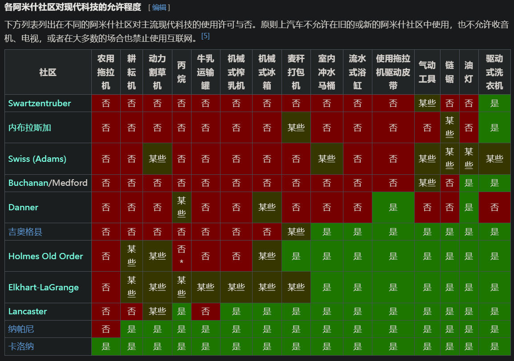
								  collapsed:: true
									- ((6688d329-b1ec-4ff2-9ff2-3f2c0f1329f8))
									  id:: 6688a86a-0e14-4dbf-a63a-3fec4d2f8f26
							- ---
							- 人的兴趣是不由自主的，有兴趣就要花时间，花时间就可能浪费时间，因为对于有些活动，我们很可能是想赶时间的，
							- 聊天的引用通常是单链
							- 未查看
							- 里外
							  collapsed:: true
								- 纯杂（“无关信息”）
								- “合屏主意”——“围观”
								- 一人一屏（“E人E本是吧？”）
								- 多人一屏
									- 
										- “90后玩4399小游戏.gif”
								- {:height 96, :width 88}
									- >稽稽复稽稽，目拦当互知
										- TODO 木兰诗，滑稽，爷，梗的竞争和征召
									- “羁羁复羁羁，目拦当互知”
								- 同屏不同视角（阿伟彬彬）
								- 层级
								- 顺序
								- 视频不用滚轮，甚至不用拖进度条——音乐可能更甚
							- 先后
							  collapsed:: true
								- 学习中（“学学”）
								- 在线（浏览器，关闭后需要恢复、历史记录，也可以都没有）
								- 内容同步
								  collapsed:: true
									- 同步短文本（微信、QQ等）
										- “因为b站没有群聊”、“因为以文本传输为主相对便宜”、“因为垄断入口可以卖广告”
								- 下载
								- 提醒
								  collapsed:: true
									- 人工提醒
										- 挥手（“弹窗”）
										- 面对面或电话：“喂！三点几嘞！”
										- @（“点名”）、拍一拍（“振动，如果在线下”）
										- “马上要做什么呢？”
									- 提醒音效、铃声、振动
									- 弹窗
									- [[软件/记忆]]
								- 分辨
									- “让我看看魔怔网友们又发表了什么逆天言论”
										- [你看你m呢_哔哩哔哩_bilibili](https://www.bilibili.com/video/BV1Cp4y1D7UG)
									- 定位/调取/搜索（“手指指着鼻子是吧？”）
										- 粗细
								- 反馈
									- “XX人读过”——“谁啊？上课举手是吧？”
								- 进度
								  collapsed:: true
									- 状态
										- 查看、编辑、分享
										- ((667b89e6-7cf6-4d70-81b6-680755963cdb))
										  id:: 6685f1a3-e096-4a43-8c5a-ba5aba2bde59
									- 提醒对应协作者查看参考资料等
							- 加减（视听、编辑、传播、遗忘）
							- 长短
							  collapsed:: true
								- “赶时间”
								  id:: 66852e55-0dde-4f6f-8ea9-7c40574df159
									- 看（低密度）视频不赶时间，赶时间不看（低密度）视频，那么怎样让受众赶时间呢？
								- 平斜（排版）
								- 软硬（干湿；理解难度）
								- 多少（比例）
							- 平斜
							- 大小（“容量”、“空间”）
							- “想法的大草稿没看到时不便评价，看到时要评价的就多了”
							- 聊天的话语空间
								- 参考系
									- ((66335bd1-08b3-4857-b181-59fff606634b))
								- 视野（视角、广度）、精度、速率——“无人机投弹”
								- 意图（如果不说，就要靠“历史记录”猜测）
							- 搜索
								- [【政治经济学】我们这个时代的关键词，资本主义的当代范式——Index（指数、索引、指标）_哔哩哔哩_bilibili](https://www.bilibili.com/video/BV1WR4y1c7sb)
								  id:: 667b89f0-6418-4781-97e9-97bd7ad0a7ed
								- 和一个人写类似，多花点时间搜索能够缩短完成时间，看同事的“综述”也类似
								- 不完整的搜索发现，但是能推流到相对完整的问题讨论区
								- 同/近义词（“不是，哥们/老哥/兄弟/朋友/爷们/帅哥/小伙子/大爷/老小孩”）
								- 网络搜索与现实质询
								  collapsed:: true
									- 聪明的开放式问题与愚蠢的封闭式问题
									- 手机搜索相对电脑不方便些
								- 指数
									- [趋势指数提升解析：微信指数｜百度指数｜巨量算数_相关_搜索_用户](https://www.sohu.com/a/712317818_121664572)
									- ((667b89fd-04c0-42ab-b2bf-7ff10c0f3b7b))
									- ((668deec5-bacb-497f-8a01-f8f2f0a4ddb0))
									- [🔥本轮冠爷全国大预测分析-收藏级 - 小红书](https://www.xiaohongshu.com/explore/66af14680000000005020d2d?note_flow_source=wechat&xsec_token=CBLK1b4utHs5HjLcYkDmDOLWnzjU4O2VK7RtpQ7lAQ8aQ)
									  id:: 66af3773-3e15-4428-9633-cc5438d0b821
				- 公开信息
				  collapsed:: true
					- ((66f7dd70-662c-46ac-a12f-b33a0994e5c7))
					- ((668deec5-bacb-497f-8a01-f8f2f0a4ddb0))
					- XX矩阵
						- [账号矩阵、平台矩阵和内容矩阵有什么区别？哪种比较好？ - 知乎](https://www.zhihu.com/question/560761943)
						- [用户增长方法论：打造属于你的产品矩阵 | 人人都是产品经理](https://www.woshipm.com/operate/3599099.html)
					- [机器学习入门（十）——推荐系统与矩阵分解 - 知乎](https://zhuanlan.zhihu.com/p/76486764)
				- 团队信息
				  collapsed:: true
					- 输入
						- 任务状态
							- ((65bcbf4a-0d20-4136-a209-893ff69421b3))
						- 文件（文件夹）
							- 识别`TODO`等
							  id:: 660d56d9-8672-498e-a6b7-ecd716100626
						- 自动爬取对象网站内容
						- ((668ce784-bfcf-4ea8-adad-6144d0c6751c))
						  collapsed:: true
						- ((62578e7c-aa0e-480e-a148-d151b27b2f0a))
					- 查看、搜索
						- 公共账号（集体账号）数据
							- ((66b83476-fd90-447a-bd03-5c6366c8dc52))
						- ((669316b9-222d-4598-8410-36ff9b789232))
							- 地址栏（可包括浏览器打开的本地文件）相关信息（可作为标识查询已有报告）、内容摘要、网页内容（可只采用文本；可只采用当前加载的内容）
							- 今日关键词组
							- 根据新的个人信息推荐
								- 可能认识
				- 个人信息
				  collapsed:: true
					- ((672880c8-3f53-4423-bc82-c96d7be60ca7))
					- 登录打卡时间确定空闲时间
					- 上次查看时间、看过内容（todo等）
					- “轮带逛”积分
					- 敏感词过滤（“ghs是吧？最好是！”）
					- ((66db8b0c-0180-4c7e-8a87-6df0379118bd))
					- ((67048d3f-73b1-4aab-ad07-9d431b2a4a95))
					- ---
					- 显示
						- “滚动”
						- 入口
							- 小程序
						- 自定义界面
							- 多链接聚合，可调整窗口
							- 变化可选只显示增加
						- 资源组织视图
							- 传统（段落）文档视图（加上侧栏大纲目录）
							- 大纲块视图
					- 标记属性
						- 文件内不同颜色高亮/标注
							- [[更大的监狱]]
							- ((6725e1a0-8aae-491e-bbc3-f93a4a637cf3))
						- 关注标签（比如群体）
						- 可见范围
							- 后级继承前级属性，最多不显示前级
						- 发布身份
							- 匿名发布，可默认，可改回非匿名
						- 关键词、分区等
							- 相似内容聚合
		- “用户”
			- “白嫖力”
				- 年轻人更会白嫖，因此作为传播媒介也就更可贵
		- 出版业
		- （其他）非主流传输方式
		  id:: 659c981c-5990-4dc8-ba30-25a526af50a4
		  collapsed:: true
			- ((66003cf4-1cea-4e70-be3f-b61683cd0389))
			  collapsed:: true
				- 我觉得具体的技术路线，或者相对高效，或者慢慢磨出来的，没见过就是没见过，所以才需要样品，至少“效果图”
				- 至于为什么要大家都会从微信乃至飞书切换到多种角度看都更有生产力的网站上（我是觉得主义主义不说搞个更大规模的学习、任务平台，至少也可以出一些小功能，比如规划积分使用，如果供应端也比较稳定、跟得上的话），有什么，我们需要做什么必须绕开微信、飞书等的，
				- 比如我要，按我的分类经验直接开整？
				- 我是，对于一本正经想找规则的人而言，这里的规则就像是隐形的
				- 能够给出一个改动后的预览，从视觉上，它比
				- 那么首先，推荐大家用一下，这个用，顺带还能减少steam连接时间、打开steam社区，
			- “切片”
			  id:: 65d1e9dc-2ad4-44d3-829c-e879248c2784
			  collapsed:: true
				- “长图”
				  id:: 66c01cda-fb03-40bb-8e98-29a245ecfb73
					- >不知道需要多长的，那就来个相对完整的沙威玛
				- 切片的一个作用是更精准地提供帮助，还有可能就是相比单个平台多个“备用地址”
				- 除了“剪短的视频”（以及b站等平台定位到几分几秒的手机APP的 ((65d5808b-f791-4d12-9426-e774df4f10f6)) 和电脑网页端的“精准空降链接”）、 ((65d56075-b763-4313-a791-198278f5baad)) 和 ((65bcbf4a-6246-4e84-872a-0604435c9b17)) 外，此处主要指“一般比较工整且无需复杂滚动截屏操作的截屏”——“精准采集”
				- TIF/TIFF多图文件
					- 多张图一个文件
					- ((65c87486-2409-4dc2-9a78-144d3e313ac3)) 可导出
					- “手机打不开？聪明人可以用手机打开”
						- [安卓手机如何打开超大图片(tif格式)？ - 知乎](https://www.zhihu.com/question/265279346)
				- ((65d2fe17-77c4-4d6d-bf31-f8900d33aa5e))
				- ((65a7b394-7f9b-42a3-b8f7-7a94faf19512))
				- 浏览器（有时看一些境外媒体也能帮助做到“进退有锯”）
				  collapsed:: true
					- 按F12或右键页面中感兴趣的地方或任意位置“检查”打开出现在右侧的开发者工具
					  id:: 65d734ea-1a53-4fbe-b3ed-4ea445fadb75
						- 点击它最左上角的“选择元素检查”图标，点击网页中想导出的部分（如果前一步采用的是“右键页面中感兴趣的地方”，则可能跳过此步），然后在开发者工具中右键高亮的对应部分点击“截取节点屏幕截图”
						  id:: 65d6eb6b-f451-41ba-ae14-26c27dd4d427
							- 减少截到其他东西的经验：先到网页底部，再放大网页，再到网页底部，最后再截
						- [干货 | 按住F12，你可以“窃”图、改网页内容、获取图片尺寸…… - 知乎](https://zhuanlan.zhihu.com/p/48110553)
					- edge浏览器可右键“截图”-“捕获整页”
					- 用浏览器打开后，右键页面打印，导出为PDF
				- Logseq本地和网页端
				  id:: 668deec5-f6d8-4eca-bd5c-2b70cbdb2ac5
				  collapsed:: true
					- 自带导出（主要用于导出为png图片发到群里或bb空间）
					  id:: 66335bea-0e25-4ba3-902d-96da36b1ff66
						- 打开完整页面，右上角“三个点”——“导出当前页面”
						  id:: 66335bea-8238-418e-a716-22ce444a7c8e
							- ((65ab10fb-dff5-4cb4-92a4-9c82c12e2ba0))
						- 右键块前圆点“复制/导出为...”
						- 要看更多可用微信等软件提取文本或自行搜索（“当然也可以在本站搜索”）
					- 插件导出为HTML文件
						- ((659b89b8-f17c-4d75-a9d2-3332ef699d60))
				- ((65d740ad-7f33-4c3e-bcb4-4fd4d560bb10))
				- TODO 切片品种
				  id:: 65d55807-3a8d-4315-bb9c-1781d28e1756
				  collapsed:: true
					- 细分方案的（从必要性到下单取货的）一条龙切片
					  collapsed:: true
						- ((65d5659d-f596-40ad-a7a1-569d2f50a2e7))
						- 加入 # 即学即用
						- 二维码/链接（包括HTML文件内的），切片最新版本（“防X地址是吧”）
						- “加载慢请使用Watt Toolkit勾选Github加速浏览”（图片、重命名）
						  id:: 65e00942-d412-4af9-a102-d6bceac08f90
						- ((65d2ecf3-8af1-47e4-9219-317a3d501fe1))
						- “”
					- 切片网络
					  collapsed:: true
						- ((65ae0906-959c-4d8e-baeb-3271fc65d7e8))
			- 上传文件（以logseq为例）
			  id:: 659b34e3-eafb-4594-89b7-fac98edf6014
			  collapsed:: true
				- 信息隔离方式（比如有隐私需求，需要分写作区、阅读区）
				  id:: 659b89be-1cfb-449e-9f68-b2cd3e4658c4
				  collapsed:: true
					- 结构
					  logseq.order-list-type:: number
						- 单个图谱文件夹加上忽略名单
						  logseq.order-list-type:: number
							- 往.gitignore文件添加忽略名单（“之前我看它好多遍了，怎么现在才想到”——“名单也会上传啊？那没事了”——“还有合并了不方便看读者大致能看到什么，算了吧”）
						- 多个图谱文件夹分开
						  logseq.order-list-type:: number
						- 多个图谱文件夹==套娃==，分享内娃图谱文件夹
						  logseq.order-list-type:: number
						  id:: 66335bea-765e-49a8-ad56-87c4569e6389
							- 
							- 
							- 一般人文件不多（“页面不超过一千”），可以从零开始挨个往内娃里放
							- 日记和asset的相对路径问题（“总的来说就是多点人工”）
							  collapsed:: true
								- 套娃的外娃可以跨文件夹看到所有页面，但在一个图谱中（以常规方式而非多点手动的插件）粘贴图片或新建页面（包括日记）只会在该图谱文件夹中的asset文件夹和journal文件夹创建相应文件，具体表现为内娃看不到外娃的日记，相互看不到对方的图片等asset，因此除了事后复制、移动外，还可按需切换图谱
								- assets文件夹也是同理，先把所有asset文件复制到一个文件夹，再把文件往内娃assets文件夹里移，或者反过来；以后可以在粘贴图片前先切换到内娃——当然，也可能有自动方案
								- ((6598f8c8-797b-4757-8276-8d7bb6c0aa8f))
									- TODO 本地自动同步
										- [三款免费实用的本地文件夹同步/备份软件推荐 (SyncToy/FreeFileSync/Compare Advance) - article - 博客园](https://www.cnblogs.com/xiaohi/p/15866316.html)
							- 也可以是被分享、查看等，被分享者可另外套个自己用来编辑的外娃文件夹
							  id:: 6651bc5a-f983-40ea-b346-ebf9c6c2ba37
					- 区分文件在哪个文件夹
					  logseq.order-list-type:: number
						- logseq右上角三个点-“打开页面所在文件夹”
						- ((659c981c-4681-4798-87dc-9cddea73f56e))
							- 如果在分享库的文件最近改动过，那么能在更改列表中看到，没看到则不在
					- ((66db8ac4-19d8-408b-81a8-f0cef6d29782))
					  logseq.order-list-type:: number
					- TODO 模块化图谱、批量重命名
				- 信息传输方式
				  collapsed:: true
					- 云服务器（“云在天上”，不在现在用的这台电脑上，一般一直开着）
					  id:: 66fcc183-f093-4cd5-b066-52b9a53288c7
						- [[网盘]]
						- ((66dba0bf-fbe3-460c-a8ba-e2bdc7fde7e8))
							- Github公开仓库
								- GitHub Pages博客
								  id:: 658fc4ca-21a3-49e7-a6b8-6277d16e0062
								  collapsed:: true
									- 使用公开仓库，每一个commit版本都是公开的，注意避免重要信息泄露，必要时 ((67286807-f7b3-42b6-98bf-31419915d2f8))
									- Logseq本地库上传为GitHub博客
									  id:: 6728650e-a6e9-4ea8-bda7-916a1d760dd3
										- 重写一下教程，这次多些从本地端发起的操作
										- 建库New repository、提交commit、发布publish、部署deploy
											- 下载安装 ((659c981c-4681-4798-87dc-9cddea73f56e))
											- 打开，“文件”-“新建库”（反正是第一个），命名为“你的github用户名.github.io”（“平台的要求罢了”；是用户名不是昵称，修改用户名可能造成一些“意外的副作用”，所以一开始注册github时你可能需要一个看起来不太愣的用户名），位置在本地上传库的上一级文件夹，它会在该文件夹新建库名文件夹，或者使用同名的空文件夹
												- 如果本地上传库不为空（“一般是这样”），那么它无法原地新建，所以你可以先把其中的文件移到比如说一个新建文件夹里，然后再建库，最后再把文件移进去
											- 在库文件夹里新建文件夹“.github”，再在其中新建文件夹“workflows”，再在其中新建文本文档，重命名为publish.yml
											- 点击[Logseq Publish SPA · Actions · GitHub Marketplace · GitHub](https://github.com/marketplace/actions/logseq-publish-spa)（将云端文件部署为博客网站的动作）中第一个复制按钮（“Github Action”下代码块右侧的“两个重叠的方形”），将代码粘贴到publish.yml，保存
											- 点左下角commit提交（此时还在本地；忘了这步是不是更早了，反正该有都有，没啥影响）
											- 点publish发布（注意取消勾选“Keep this code private”，也就是公开此库，否则做不成博客；这下文件上传到github了，但是还没有部署为博客）
											- 打开github网页端，打开上传库，“设置”-左侧“Pages”-“Branch”下选择“gh-pages”分支，Save，好了，点开博客看看吧
										- 更新上传
										  id:: 67286853-9a51-481a-85ba-5f116b6e6808
											- 首先用[[Logseq]]写好
												- 主要通过插件Move Block在当天的日志添加比较有分享价值的更新内容的块引用等
												  id:: 670d40f2-06f6-4bc3-ad58-8f28ecdbf320
													- ((65cc4a78-a2e4-40a8-870c-706cb31aabb9))
													- 因为我主要用能够覆盖更多文件的外库写，而原本不存在的日志文件在编辑后会在编辑发生的库中生成，因此在需要分享到日志时我会先转到内库（即上传库；切换需要一些时间），第一条在切换前复制块引用，切换后粘贴
														- ((659b89be-1cfb-449e-9f68-b2cd3e4658c4))
											- 然后点点 ((659c981c-4681-4798-87dc-9cddea73f56e)) commit、push
											  id:: 65bcc87a-c9e4-45a4-ac04-aaabd64d423a
												- 每次commit都要命名，我一般按当天第几次更新分别命名为1、2、3等
										- 删库
										  id:: 67286807-f7b3-42b6-98bf-31419915d2f8
											- 目的大概主要是不让别人看见，那么在GitHub网页端的库的“设置”中删库即可
										- 删库后重新上传
											- 删除.git文件夹（里面有commit记录）
											- 其他大致参照 ((67286853-9a51-481a-85ba-5f116b6e6808))
									- ---
									- 更多问题和需求
									  id:: 65a920ca-0c14-426e-9194-bf2388836918
										- 打开慢或打不开这些网页如何解决：调整浏览器的拦截插件（比如Brave浏览器下调“阻止指纹识别”等级）、调整网络配置、换个浏览器、换个设备
										- [创建Github.io Page后不小心unpublish了, 如何重新发布_github unpublish-CSDN博客](https://blog.csdn.net/weixin_46143152/article/details/129046623)
										- ((659b89be-1cfb-449e-9f68-b2cd3e4658c4))
											- [Git 如何在一个仓库中将另一个仓库“挂载”为子文件夹|极客教程](https://geek-docs.com/git/git-questions/887_git_how_do_i_mount_one_github_repository_as_a_subfolder_of_another_repository.html)
										- GitHub Desktop疑问
											- [CRLF和LF的差异 - 知乎](https://zhuanlan.zhihu.com/p/380574688)
											- [自学Git，有哪些书籍或者好的学习资源？ - 知乎](https://www.zhihu.com/question/38008771)
										- TODO 手动上传改为自动上传
										  id:: 65d58fe7-3b46-46ea-9afe-362d3886e0c7
											- [什么是 CI/CD ？ - 知乎](https://zhuanlan.zhihu.com/p/422815048)
												- ((65d59020-a0fe-4416-bd8e-33385bde0792))
										- TODO ((631410a6-e8ab-4252-a8a3-1e69a92f953f))
											- 比如在浏览器的多个窗口同时搜索，结果最好也集中到一个窗口
											- 全域全文搜索（网页、搜索引擎、ppt、pdf、聊天、云文档——没有或进一步就搜索引擎，汇总）
										- 删除更早的版本/Commit记录
											- 动之前先备份本地文件，大不了简单粗暴点删库重来（备份public.yaml及上级文件夹应该方便在本地建库，第一个commit还是它）
											  id:: 65a920ca-887e-4ffa-84be-3f5aaf3bc45d
												- TODO 但在Actions中还是可以查看和下载之前的commit中的文件......
												  id:: 65bda040-1d2b-4e09-a562-1a242bbeb8e0
													- “那还不如只点两下咯？”
													- “这下不如‘[资料删除]’了”
													- [GitHub 私有仓库免费开启 GitHub Pages 的可行性方案 - 知乎](https://zhuanlan.zhihu.com/p/541944539)
													- 比较自动化地直接查看或下载查看全部版本及相关差异（比如要有单个文件的版本记录；“左右互搏是吧？”；好像与CLI有关？）
													  id:: 65ccc38d-0211-4604-bcc2-22459a7252d8
											- [Git怎么跳开中间的commit合并头尾的commit? - 知乎](https://www.zhihu.com/question/325639912)
										- 块级发布（“微博”）？
											- [Is there block level publishing support? · Issue #35 · sawhney17/logseq-schrodinger · GitHub](https://github.com/sawhney17/logseq-schrodinger/issues/35)
									- 以前的解决方案
									  :LOGBOOK:
									  CLOCK: [2024-01-11 Thu 08:53:24]
									  :END:
										- 首先在网页端（这里主要介绍网页端建库流程）或本地硬盘建个名为“xxx.github.io”的仓库（本地需要同名文件夹）参考GitHub文档、像这个YouTube视频一样在GitHub Desktop（需要GitHub账号）中新建一个repository（仓库；建议参考一种常见做法起个“github用户名.github.io”的仓库名），然后然后publish（名称不包含中文，否则会自动改为“-”——当然之后还可以在网页端的设置里改，然后重启GitHub Desktop就好了。；取消勾选“Keep this code private”）
										  logseq.order-list-type:: number
										- “Create publish.yml”：复制[Logseq Publish SPA · Actions · GitHub Marketplace · GitHub](https://github.com/marketplace/actions/logseq-publish-spa)中的第一个灰色代码块中的路径粘贴到新文件的填空框，复制粘贴代码）
										  logseq.order-list-type:: number
										  id:: 670d40f2-6a9d-48e7-9ac2-6b57fd701c54
											- ==或者在本地创建后上传==： ((65a920ca-887e-4ffa-84be-3f5aaf3bc45d))
												- 具体的场景，比如纯小白第一次删库前备份，然后删库，然后从本地选择图谱文件夹==（加入publish.yml及上级文件夹——可在我的仓库下载.github.7z获取现成的——我自己也觉得新建两个文件夹和一个文档有点麻烦）==建库，这样一个Initial commit就能搞定新仓库的发布，是不是非常棒？！
											- 这步先于文件上传，使第一个commit是创建publish.yml，省得git小白瞎折腾版本管理
										- Actions中这个workflow完成（可能不需要全部完成）后（可能还没logseq文件时失败不管它），将“仓库设置settings-pages”中的branch改为gh-pages，save
										  logseq.order-list-type:: number
										- 用GitHub Desktop（下同）把仓库clone到本地，放入需要分享的logseq文件（图谱文件夹内的文件夹和文件），commit（提交，“提交了船新版本，但是在本地登记，还没上传”），push（“Github Pages，上传！”）
										  logseq.order-list-type:: number
											- 不用管gh-pages分支，忽略就行
											- 如果上传失败，显示“连接不到服务器”，那么需要调整网络配置
												- 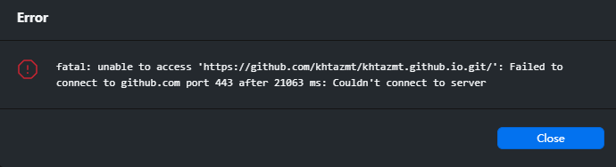
												- ((65ab10fa-6f37-4dc7-8693-ded8722181de))
										- 更新
										  logseq.order-list-type:: number
											- 不想增加commit的话，可以点“History”，右键最近的commit选择“Amend commit...”，然后点“Amend last commit”，最后等“Pull origin”变为“Force push origin”后点击
											  id:: 65bcbf4a-10c6-40d9-8eb2-010a1a33cdd1
												- 上传压缩文件可能较大地延长push时间
												- ((65bda040-1d2b-4e09-a562-1a242bbeb8e0))
											- 一次push较多文件可能先关掉logseq会更快
											- 使用logseq时上传GitHub Desktop上好像可能有文件波动（切换branch选第一个stash，再切回来可能又在stash列表消失了），可不管
											- bak文件夹中新增的页面备份文件可能是不需要提交的老版本，提交前discard（别处备份了可以删掉）、ignore（但文件名还是会记录到gitignore文档上传）或按住shift批量取消选择即可
											- [Logseq Publish SPA · Actions · GitHub Marketplace · GitHub](https://github.com/marketplace/actions/logseq-publish-spa)更新版本：将publish.yml中的版本号更改为最新版本即可
									- [建站第九篇 Hugo+Github Pages+Github Action博客方案之一——使用Hugo搭建个人博客 | DD299的博客 | DD299 Blog](https://www.goodfun.me/post/%E5%BB%BA%E7%AB%99%E7%AC%AC%E4%B9%9D%E7%AF%87-Hugo+Github-Pages+Github-Action%E5%8D%9A%E5%AE%A2%E6%96%B9%E6%A1%88%E4%B9%8B%E4%B8%80%E4%BD%BF%E7%94%A8Hugo%E6%90%AD%E5%BB%BA%E4%B8%AA%E4%BA%BA%E5%8D%9A%E5%AE%A2/)
									  id:: 65d59020-a0fe-4416-bd8e-33385bde0792
									- ((6594cd25-48da-4541-8379-4901475d2140))，可以视作一种博客
									- ((640309d4-a066-4483-8432-199836416106))
							- Github私有仓库
					- 本地服务器（不一定一直开着，也就不一定一直可用）
						- Resilio Sync同步文件夹（协作收费）
						  id:: 65964bbc-7743-4c1e-8185-a61725fe6e2e
						  collapsed:: true
							- 去中心化、发布前即可在一定程度上限制传播，缺点可能有不自带文本更改逐行对比功能
								- 社交、key（第一轮分享可审批、链接使用次数、时限）、接受者用户名等环节进行相对可靠的控制
							- 同步文件夹（可能）也可以套娃、再中心化
							- ((65b9026f-4926-4b98-8bf3-527ab6805361))
							- [Resilio Sync | 全平台多设备文件同步/传输终极产品 - 知乎](https://zhuanlan.zhihu.com/p/459403503)
							- [【Resilio sync】完美实现全平台文件同步方案_哔哩哔哩_bilibili](https://www.bilibili.com/video/BV1ed4y1c7ZT)
							- TODO 多人的库共存时如何避免同名文件共存造成麻烦？
							- [Resilio Sync 的同步机制 - ConorBlog - 博客园](https://www.cnblogs.com/conorblog/p/15587802.html)
							- [Logseq 的跨平台同步方案：如何在 Mac、Windows、Linux 和 iPhone 上保持笔记一致](https://www.jungley.net/logseq-cross-platform-sync-solution/)
						- ((65ab10fa-9bb1-4c11-8112-1d5744559b36))的Live Share协作插件
						  id:: 6676e10f-b47c-402a-8abb-970dd121fede
						  collapsed:: true
							- 相当于即用即取的同步文件夹（还没有github之类的访问障碍），可以协作编辑文件夹内的不同文件、显示协作者当前查看和编辑的文件（精确到所在行和光标位置）并可跟随
							- [共享快速入门 - Live Share | Microsoft Learn](https://learn.microsoft.com/zh-cn/visualstudio/liveshare/quickstart/share)
								- 
							- 还可在客户端安装Live Share Audio语音插件、Live Share Whiteboard白板插件
							- [Visual Studio Live Share整合聊天和语音支持_哔哩哔哩_bilibili](https://www.bilibili.com/video/BV1Kg4y1B7fV)
							- [Visual Studio Live Share —— 实时协作编程](https://www.zhihu.com/tardis/landing/yidian/art/78515361)
						- （专门的）Markdown文件协作
						  collapsed:: true
							- HackMD（免费三人）/CodiMD
								- [GitHub - hackmdio/codimd: CodiMD - Realtime collaborative markdown notes on all platforms.](https://github.com/hackmdio/codimd)
							- [马克笔记 | 多人实时协作的Markdown](https://mkbiji.com/)
						- [Obsidian Sync: Live team collaborative editing - Feature requests - Obsidian Forum](https://forum.obsidian.md/t/obsidian-sync-live-team-collaborative-editing/6058)
						  id:: 66fcc0bf-5449-4554-ac38-50c319722d19
				- TODO 如果平台屏蔽链接或二维码图片分享怎么办？
			- 内网穿透
				- ((66b93da2-a9ba-4b7d-adc4-ca9fe299b53d))
			- ((6222d6cd-92fa-4d00-9215-23d72e1a0a23))
			- Newsletter（相比RSS源服务器和RSS阅读器，邮箱的收发选择面可能更大）
			  id:: 668deec5-7c7e-4c10-ade8-3700f1fcfd84
		- “函授”（比如本站；“可以，这狠贤师/咸湿/hamshop”）
	- ((66ade391-ca7d-43ce-b871-b4a52f0691f0))
	- 传播对象体验
		- 对有效答复的时效性的预期
	- ((65bcbf51-f0f9-4e14-86c2-68db9267239c))
	- 减少阅读延迟、增加阅读率
	  collapsed:: true
		- 公众号
			- 自动回复放其他发布渠道
	- TODO 多平台发布省时
	  collapsed:: true
		- [多平台博客工具推荐 - 掘金](https://juejin.cn/post/7113968106841571364)
		- 账号关联同步发布
			- [头条号关联百家号与知乎 - 知乎](https://zhuanlan.zhihu.com/p/608287148)
	- 邮箱
	  collapsed:: true
		- ((668deec5-7c7e-4c10-ade8-3700f1fcfd84))
		- ((664ea37c-c627-4b2a-955e-c94615b35f91))
	- “讨论区”
	  collapsed:: true
		- # 人类的宿命就是加速接入互联网，进一步出体进入VR世界转生为AI！元宇宙不存在剥削！
		  id:: 662ba87d-a292-4912-b1b2-446a065d2fbd
			- 对吧，你的劳动不是你的生命？
		- 在任何地方，信息的传递都是有成本的
			- ((66274c70-5f32-4659-8f56-1131940c81b3))
		- ((6556c1cc-70e6-4a68-a4ce-2353d3a807dd))
		- 有时你觉得你就是在正常说话，但纯路人可能觉得你在和同伙（像鸟一样）加密通话
			- ((66335bee-21f5-4558-b150-0db77d86dc0a))
		- 有时你感到很委屈很无能，但是别人不知道——“为什么需要我自己先感到，然后再可能还要花些工夫让别人感到呢？这里面到底有什么？为什么不能在情绪发生之前就自动知道该做什么呢？不通网人群没有社交网络加持的情绪大概并非没有更充沛饱满的可能吧？假如真有无知面纱，为何它是将人与人隔离，而非将人与人作为一个整体笼罩？难道我的情绪只取决于我的肉体？他异性和主体间性是如何建构的？”——“情绪，很神奇吧？”
			- [【7、形而上学基本问题详解】 【精准空降到 30:10】](https://www.bilibili.com/video/BV1fZ4y137oS/?share_source=copy_web&vd_source=24175964b0df2fcc2c022cae23517fdc&t=1810)
			  id:: 662135a9-3b8c-4666-8272-5f7c1f758648
			- [【现象学】胡塞尔、梅洛-庞蒂、海德格尔、萨特分别是如何建构他者性与主体间性的【主义主义】当代现象学的主流范式：自身性现象学（3-1-3-4）_哔哩哔哩_bilibili](https://www.bilibili.com/video/BV1KB4y1N7SF)
			  id:: 6624c802-26f8-4826-9937-6258cda67604
		- ((630b6a7e-164d-44dc-82c0-8d7b4d794a4f))
		- 众所周知，我们生活在一个魔法丰富的世界，有些信息对有些人起作用，有些就充耳不闻，这说明什么，这说明法力对不同的人的效果是不同的
		- 网路
		  id:: 6675354f-f6b9-4f42-9175-f0e53dcba303
		  collapsed:: true
			- 获取信息的一大渠道是上网，网络，网路嘛，“不会就是不会”，很多人线下线上都是多重意义上的“路痴”，甚至转弯前后都坚定地目视前方或手机，显然需要恶补一下交通知识；有些网页及网页中的内容最好能方便地收藏、下载，以便之后查看、批注和分享
			  id:: 66335beb-3516-4b4b-b8ca-70b4cc6a5472
			  collapsed:: true
				- 被互联网“推流”赶着跑
				- ((66fe9a24-66d9-4545-a8ba-3e7cb650db3d))
				  id:: 668de047-83b8-4455-b887-97c3100e24a6
				- ((665c0a2b-7587-4ee2-933d-a0179fae8bda))
				- 如果你因为想省钱或觉得没有合格的中译本而花较多时间看电子书，
		- ((6594cd25-48da-4541-8379-4901475d2140))
		- [【油管饭制·AMV动画】Welcome to the Internet (互联网的导游词or自白？)_哔哩哔哩_bilibili](https://www.bilibili.com/video/BV1tS4y1V7yP)
- 协作
	- 分工
	  collapsed:: true
		- 提议
			- “提建议什么的最简单的啦！”
			  id:: 670d40f2-24cc-4c99-adce-13bc99fecf09
				- “提对了有用，提错了学习，还是有用，智者千虑必有一失，愚者千虑必有一得，驽马十驾，功在不舍，身为自定义的愚者、驽马，应当勇于提出想法，以数量弥补质量，帮助智者们避开那一失”
		- 分工协作未发生的可能原因
			- 进入障碍
				- 因机会成本的存在而不成立的比较优势
					- {{embed ((66fc8559-1421-46bc-9092-16148066cb57))}}
					- “因为测试易操作成品的进入障碍比整理不易立刻操作的抽象特征/功能等的小、具有比较优势，所以让其他人测试更有效率”
					- 低时间弹性
						- “我还有不短更不长的时间就要考试了，不能冒损失更多时间的风险偏离现有应试方案”
			- ((670d40f2-24cc-4c99-adce-13bc99fecf09))
				- “你猜测我的已知的命中率有点低，那么对于我的未知的建议，我恐怕也不太愿意挨个自己试啊——而且群里这么多人，相信会有有需要的人试吧？”
	- 认识你的同事
	  collapsed:: true
		- TODO 身份识别
		  id:: 66657fce-c7f0-4c46-bd6c-71214377eacd
			- 跨群、平台等，对比图片识别相同用户
			- ((65bcbf4a-adf8-49cf-a926-0ec0caf282a6))
			- 身份认证/标记
			  id:: 670d40f2-5e6c-45ae-a0f9-9b513b474bd2
			- 网名与真名
				- 一个人能力有大小，我们只要在不太劣质的圈子里，就总有一些（值得）我们“高看一眼”的人
					- 对于有“（别让我知道得太快的）收藏癖”的人而言，将网友们的网名与真名对应可能是一种期待，但真知道了人的真名可能并不比知道一种鸟名更令人兴奋，毕竟知道一个人的真名能有认识一个“新”物种那样的喜悦可能并非互联网上的常见情况
		- “如何正确地打扰你的同事？”
	- ((666774a7-d30e-491b-babd-0073d84ba72f))
	- 云端协作软件（数据由相关软件企业托管，大概）
	  collapsed:: true
		- {{embed ((65a4938d-1288-4a41-8d39-d543a71d1660))}}
		- 飞书
		  id:: 65ae0906-fc09-4613-a1e6-c68798673e58
		  collapsed:: true
			- “入口太深”
			  id:: 668ce784-d4a8-49b8-bfe9-1942f2b791ac
			  collapsed:: true
				- 左边导航栏不用的可以右键“移动到分组”统一收纳（我就留“消息”和“云文档”），把至少近期常用的文档“固定”（也可“移动到分组”），最后还可右键“收起导航栏”（够熟悉的话还可“隐藏名称”，这下浏览器的 ((668ce784-2e36-40be-a0e9-b925f04ba492)) 了 ——但不会自动展开）
				  id:: 668e8147-f18d-46b0-b89f-43010fd3c591
				  collapsed:: true
					- “云文档”里需要的右键“添加到‘快速访问文件夹’”
					  collapsed:: true
			- 格式
				- 飞书文档-“文档小组件”-“文字排版助手”
				  id:: 65ec2cde-c195-4202-9a14-20377ce4a1a8
			- 文件/文件夹同步到本地
				- [有无可能将飞书云文档和Obsidian做同步 - 疑问解答 - Obsidian 中文论坛](https://forum-zh.obsidian.md/t/topic/9930)
			- ## DOING 协作节奏
			  collapsed:: true
			  :LOGBOOK:
			  CLOCK: [2024-01-28 Sun 10:08:51]--[2024-01-28 Sun 10:11:29] =>  00:02:38
			  CLOCK: [2024-01-28 Sun 10:11:35]
			  :END:
				- 一镜到底
				  id:: 66fbb383-fd40-49f4-a913-09d2286ea289
					- [张艺谋一镜到底原版_哔哩哔哩_bilibili](https://www.bilibili.com/video/BV1Ej411V7M2)
					  id:: 65ae08db-7b92-4199-8748-f67f160e0fa5
					  collapsed:: true
						- id:: 66d42141-a27b-42a1-baa5-b3276a0e78a3
						  >后来说放弃，我自己决定放弃，一个人做的决定，一个人的思考，一个多月以后我放弃了
						- [#张艺谋回应一镜到底采访被恶搞_哔哩哔哩_bilibili](https://www.bilibili.com/video/BV1Hs4y1c7gx)
						- [春晚有救了，后来放弃了？_哔哩哔哩_bilibili](https://www.bilibili.com/video/BV1sH4y117EK)
				- ### 通知功能
				  collapsed:: true
					- 折叠飞书助手、飞书OKR等（如果不用）
					- 类比：如更？到底更没更？更了啥？
					  collapsed:: true
						- 餐饮店、服装店有新品了，如果不发动态“上新”，可能顾客到店都不能保证看到新品，至于新品相对老款的“差异与重复”，销售人员不能现场指着菜单和衣服讲解的话，菜单上可以通过图片、衣服可以单独拎出来放在独立的“环绕式”衣架展示
						- 飞书文档能看到“互动统计”中的“访问人数”（类似的有飞书消息的“XX人已读，XX人未读”）、“访问次数”、“今日新增访问次数”乃至具体到“访问者”和“最近访问时间”的“访问记录”（能否看到与文档所有者的设置有关，可在“设置”-“文档”-“访问记录”修改设置），但光是访问不一定意味着参与，可能文档内容尚未激发访问者兴趣
						  id:: 66db8ac4-1b97-4d2c-913d-de2623b4ce22
						- 另一方面，没有访问就没有后面的故事
						- 有时访问是需要成本的，店家直播的内容不一定是我最想看的，而其他则可能太长不看，行家里手光看最近两个款式（比如鞋、车的）/版本（比如软件、文档的）的更改部分的内容就够了，如果多了，看不到重点
					- 主动手动单个文档地订阅更新、评论通知
					  id:: 65bcbf4a-7239-4867-8ffb-6f559fe9647e
					  collapsed:: true
						- 云文档中可以在文件夹中一个一个文档地右键-“关注文档更新”（列表视图下偏左下移比较快；但没法如此“关注文档评论”），知识库需要打开文档
							- 好像评论并不会让评论者自动关注文档更新和评论
						- [使用当前文档通知功能](https://www.feishu.cn/hc/zh-CN/articles/117082248198-%E4%BD%BF%E7%94%A8%E5%BD%93%E5%89%8D%E6%96%87%E6%A1%A3%E9%80%9A%E7%9F%A5%E5%8A%9F%E8%83%BD)
						- ==“那么文件夹内新增的文档呢？能直接通知到相关人员吗？”==
						  id:: 65e92197-5abc-4a48-a909-64e4a87aa1d4
							- 那么可以由作者“分享”到飞书会话，还可通过“添加标签页”在会话中置顶
					- “我已接手”通知
					  id:: 65bcbf4a-0d20-4136-a209-893ff69421b3
					  collapsed:: true
						- “可能人在本质上是爱凑热闹的，爱吃着碗里看着锅里的”
						  collapsed:: true
						- 可能加个点击按钮（“电铃”）可以提示大家正在干活（“做成直播间弹幕那样是不是还可以”），过了较长时间没出成果，还可以提醒或以状态显示，接下来继续
						- 有些同学用过个人任务管理软件（“飞书也是”），一般
					- TODO 文档最近一次编辑后若干天没有编辑、评论的通知
						- 飞书机器人
					- 跨文档通知（“把公屏打在弹幕上！”）
					  collapsed:: true
						- [使用飞书提醒](https://www.feishu.cn/hc/zh-CN/articles/360040566773-%E4%BD%BF%E7%94%A8%E9%A3%9E%E4%B9%A6%E6%8F%90%E9%86%92)
						- [手把手教你用飞书 Webhook 打造一个消息推送 Bot - 少数派](https://sspai.com/post/68578)
						- 自动关注文档更新和评论
				- ### 查看、编辑所需的更多的文档/内容层级
				  collapsed:: true
					- “复杂的路网是城市化的必然，好用的路网则不是”
						- ((660e6a5a-b012-4175-ba9e-d2dea2a93618))
					- 通过“点点点”易知，本站页面中的块与块是树状结构，双向（而跳转外站的超链接基本是单向的，下面几个超链接跳转后在网页中找不到）的块/页面引用/嵌入是网状结构
					- >这第一个问题有关“查看”功能：文件夹层级多，点起来会有点不方便，好像飞书也没有针对文件夹的快捷方式
					  >
					  >解法1：右键“添加到快速访问文件夹”，算是一种快捷方式，能跳过些文件夹层级，能少点些
					  解法2：《五八作业》内的文档可能放到一个分阶段的“飞书任务”的看板里，这样比文件夹更少点一次，直接到文档，并且有些常用的文档（比如b站小组任务）可以放到看板的“常用”分组，或者可以添加对应任务的负责人，仅保留档案功能——也许可以从较新的征稿文档开始试试看是不是更好
						- >当然如果认为有些文档内容并不多，几张图几行字，完全可以不点直接显示，那就可以往类似 ((65ae0906-959c-4d8e-baeb-3271fc65d7e8)) 、“大平层”的方向看了
					- 飞书知识库
						- 子文档
							- [快速创建子文档](https://www.feishu.cn/hc/zh-CN/articles/891872702435-%E5%BF%AB%E9%80%9F%E5%88%9B%E5%BB%BA%E5%AD%90%E6%96%87%E6%A1%A3)
							- [插入子页面目录](https://www.feishu.cn/hc/zh-CN/articles/672126501992-%E6%8F%92%E5%85%A5%E5%AD%90%E9%A1%B5%E9%9D%A2%E7%9B%AE%E5%BD%95)（另有子页面列表）
							- 可以悬停预览
						- 知识库动态
							- 类似其他软件的
							- 能够按时间顺序看到最近更新的文档/页面，单行，类似飞书云文档的列表视图时间排序
							- 飞书知识库
							  id:: 65b59df3-c19f-484b-bbbd-0755ae359325
								- [如何关注知识库更新动态](https://www.feishu.cn/hc/zh-CN/articles/891296506340-%E5%A6%82%E4%BD%95%E5%85%B3%E6%B3%A8%E7%9F%A5%E8%AF%86%E5%BA%93%E6%9B%B4%E6%96%B0%E5%8A%A8%E6%80%81)
								- 别处写，复制过去就是一次更新/提交
								- TODO [关于飞书知识库的几点吐槽 - 知乎](https://zhuanlan.zhihu.com/p/497745919)
				- ### 进一步图形化、更少的视觉/操作层级
				  collapsed:: true
					- 开会、分享
					- ((65ae0906-959c-4d8e-baeb-3271fc65d7e8))
				- ### 个人工作进度分享
				  id:: 66335bea-4b3b-4ee2-a4fe-225e99b4aedf
				  collapsed:: true
					- 协作浏览器
					  id:: 66335bea-d69c-4381-833c-dcd29f599e90
						- 共享标签页、历史记录等
						- [想天浏览器：团队协作+浏览器，带你重新认识PC端浏览器 - 知乎](https://zhuanlan.zhihu.com/p/481438641)
							- [李开复:未来最重要的不是操作系统 而是浏览器-CSDN博客](https://blog.csdn.net/psyl/article/details/3552228)
							  id:: 65b5b239-78d9-4e25-82da-df915742aa29
						- [玩屏开发者皮克斯的个人空间-玩屏开发者皮克斯个人主页-哔哩哔哩视频](https://space.bilibili.com/167397379/channel/collectiondetail?sid=482514)
						- [CoFox: A Synchronous Collaborative Browser | SpringerLink](https://link.springer.com/chapter/10.1007/978-3-642-35341-3_22)（）
					- 前置任务交接
						- 统称为“资料”，制作过程中就建议共享
						- 不像单位辞职了才交接，而是一个稿件乃至拆分任务，不光是转发素材，书签等也可以交接，其实是有协作浏览器的
				- ### 其他细节
				  collapsed:: true
					- 没有“后退”、“前进”
						- 按Alt+←也不会回到这个页面吧？
					- 没有可调的横向标签页栏
				- 用文档开会，分享PPT等开会
				  collapsed:: true
					- [不聊废话，全是干货！关于飞书，你想了解的都在这里~_哔哩哔哩_bilibili](https://www.bilibili.com/video/BV1Fe4y1s78E)
					  id:: 65b59621-4d74-4a64-a9fc-fb60931abd40
			- [高级搜索语法](https://www.feishu.cn/hc/zh-CN/articles/956339790002-%E9%AB%98%E7%BA%A7%E6%90%9C%E7%B4%A2%E8%AF%AD%E6%B3%95)
			- [如何使用飞书机器人打造一个私人的 Flomo? - 少数派](https://sspai.com/post/72273#!)
		- flowus（不清楚文档功能比飞书高到哪里去）
		  id:: 670d40f2-eb12-44cd-9c58-0341cec7f720
		- notion（功能应该是比较多）
		- 谁在用笔记本电脑？
		  id:: 6600187a-bcd7-408f-b710-86892017813e
		  collapsed:: true
			- 腾讯会议中，显示摄像头的更可能是笔记本电脑
			  collapsed:: true
		- clickup（在主流协作工具中算是功能比较全的，我是比较喜欢，但可能一般用不到那么复杂，此外，开放性也是个问题）
		  id:: 659d51db-b960-4df9-86d5-d17895d4ae32
			- ((659b89e3-c704-4447-a54b-36ef9241006b))
		- ---
		- 聊天室
			- ((66335bea-507c-418c-9ec3-8d279d0c9859))
			- ovice（“空间化”/ ((65ae0906-959c-4d8e-baeb-3271fc65d7e8)) 化的聊天室，在地图中移动avatar参与范围语音聊天，模拟现实中三五成群的聊天，这样有多人想同时说话就不太容易冲突了，而且切换聊天也非常快）
				- [如何在线上咖啡馆说话和行走：野乌吟游指北_哔哩哔哩_bilibili](https://www.bilibili.com/video/BV1Uu411x7qc)
				- 与直播的区别
					- >这和我之前一段时间像玩《别喂猴子》一样一次看几个b站直播的关系就不太一样，我、主播、其他观众不能像张艺谋那样一镜到底“蹭蹭蹭”，这个差不多可以
		- ((65ae0906-959c-4d8e-baeb-3271fc65d7e8))（“更平”）
- 版本控制
  id:: 66ade382-a868-4712-a5ce-b93a7794cf85
  collapsed:: true
	- “我们有比肩《幻兽帕鲁》制作团队的版本控制水平吗？”
	  id:: 65cccda7-8572-47b9-8052-08d5f568fe89
	  collapsed:: true
		- 
		  id:: 65cccda7-a4e0-4735-9320-e869134bf1ae
			- [科技爱好者周刊（第 289 期）：宽容从何而来 - 阮一峰的网络日志](https://www.ruanyifeng.com/blog/2024/02/weekly-issue-289.html)
			  id:: 65ccce61-c8f8-49e9-a439-0aa3d5900296
	- 单现版本控制（默认上传前人工审核，而非实时协作实时上传）
		- 集体/公共账号的单现版本控制
		  collapsed:: true
			- 线下到机构参观，可能发现不同的房间有不同的人数，比如大厅/大堂/柜台人多，办公室有的是几行几列的格子间人也多，有的是四五个大格子间，有的是两个面对面或面对背，有的只有一个——而对于同一个议题，每个人的说法都可能有所不同，所谓“众口难调”（虽然不同的说法可能还没“冲撞”），但最终可能看到以机构名义公开发布的内容
			- 谁能决定发还是不发？核心可能是身份认证
			  id:: 65bcbf4a-adf8-49cf-a926-0ec0caf282a6
				- 影视剧中，往往是“领导”拍板了，这个版本就“过了”——当然，在比较宽松平等的组织中，人人都可能是“领导”——但“人人”是哪里的“人人”可能还是要确定一下的，因为并非所有内容都能由任意一个或若干人拍板（“未完待续”）
			- 出现或预期可能出现“众口难调”怎么办？
				- “补强”：[如何成为那种一点就透，悟性很高的人？ - 知乎](https://www.zhihu.com/question/300313253/answer/1926470416)
				  id:: 66335bea-3e02-4601-aeac-059568992815
				- 调整个人主义的惯性（“这里我们可以这样理解，个人不拥有个人主义，而是个人主义拥有个人”）
				- 优先语音聊天加白板或笔记确认各自思路，找“最大公约数”
		- ---
		- Git类（数据由GitHub、GitLab等代码托管平台托管）
		  id:: 65b70784-31f1-4eda-806e-8e38a67e63e2
		  collapsed:: true
			- “Git主义思想放光芒！”
			- 提交、评论与编辑
			  collapsed:: true
				- 一次“团结的大会、胜利的大会”后有感
				  id:: 66003cf4-1cea-4e70-be3f-b61683cd0389
					- 这些评论可能不重要（“所以我破坏了”），“我可要说几句公道话”，“你可能发现这很重要”，就拿代码管理平台与协作文档的两个功能来说，提交（commit）与评论（comment）有挺大的区别，比如提交是有前后两个版本（后一个版本尚未成为当前版本）的对比，这就不是很小的差别了
						- 对于一个多少下了点决心（或者也可以说“致力于”，这样就可以用be commited to了）想服从应能保障整个工作的规则的人看来，在没找到详细到他想找的规则时，他可能对似乎隐形的规则感到一丝惶然，按他的“常识”，别说直接在原文上改了（“编辑”），就是评论，都要多一道“别人的东西不能乱动”的中介和阻滞，我们可能仍生活在一个存在“情绪劳动”的世界，由于技术、功能上的掣肘，“客气”与“效率”的确可能显现出矛盾，而且一旦认为这种矛盾难以解决，其他矛盾便也可能蓄积，“这这这条路都堵死了”，他就可能想，“要‘不择手段地前进’了”
				- 用git类对文本等内容进行版本控制，与飞书的也不太一样，
					- git类的“提交”与飞书文档之类的“编辑”及更间接的“（划线）评论”也不太一样，后者相比前者，在一些方面不光有技术上的阻碍，技术上的阻碍也会次生“人情世故”的阻碍，你可能觉得没有，但意识形态会让人进入博弈、“猜疑链”
				- 无论多少修改，提交时一起端上来，免得（“飞书划线评论或其他更具侵略性的操作”）太打扰主创，使大家的时间、注意力碎片化，降低效率（“我的评价是——要我一条条评论叮叮叮还不如把切片做好发微信或飞书私聊”）
				  id:: 65db4ef0-0ab4-4037-b579-d3bc751d7657
			- GitHub Desktop
			  id:: 659c981c-4681-4798-87dc-9cddea73f56e
			  collapsed:: true
				- 操作相对简单的图形化界面
				- 不上传到Github也能用（“有时写多了也要看看前面写了什么”）
				  id:: 65b5b2d8-98e9-4694-b678-61237162b525
				- ((658fc4ca-21a3-49e7-a6b8-6277d16e0062))
				- 也可以用来监测、观察了解logseq等软件的文件机制
				- 不需要上传的文件/文件夹在更改列表右键加入gitignore即可
				- 更新可按当天的commit次数命名
				- 部分情况下消耗流量较多的话，会换成watt toolkit加速github
				- TODO 如何显示内容、只显示修改行？（在开发者工具里设置？）
				- [傻瓜式git管理。全平台，全编译器通用。github desktop+vscode_github desktop还是vscode-CSDN博客](https://blog.csdn.net/qq_44695769/article/details/130953267)
			- 走向同台协作
			  collapsed:: true
				- [吵疯了，Pull Request到底是个啥？ - 知乎](https://zhuanlan.zhihu.com/p/347918608)
				  id:: 670d40f2-00d6-462c-b0d3-270f4876b3e7
					- >我们重点看一下第6步，小明写完代码了想合入到原作者的仓库，新建了一个“pull request”，拉请求？这明明是推啊，小明将自己的修改推到原作者的仓，感觉叫“push request”比较合适吧。
					  既然 Github 坚持叫“pull request”，我们试着理解一下它的思路，小明写完代码了心里肯定是在想：原作者大神，我改了点东西，你快把我的修改拉回去吧。站在原作者的角度思考，叫pull request好像也说得过去，每天有大量的人从我这里 fork 代码走，我只会拉取我感兴趣的代码回来。
					  我好像把自己说服了。
					- ((668ce77d-369c-4b88-9b03-02e3f0c1ea2d))
				- ==划线评论、Pull request与白板脑暴==
					- 飞书里我们看到别人负责的文档内容产生了修改意见，可能会选择对想修改的部分划线并评论在右侧，
					- pull request是直接修改，但是
						- 直接修改后
			- [解决 .git 目录过大问题-CSDN博客](https://blog.csdn.net/lilizhou2008/article/details/123038737)
			  id:: 66b608a5-a819-4691-bec0-1846651815bc
		- ((66b42d34-b0f0-425e-bbde-ba407f74c8ca))
		- （纯）本地文件（对比）
		  id:: 66db8ac4-d9d8-40f9-b210-5517c4f75673
		  collapsed:: true
			- [WinMerge - You will see the difference…](https://winmerge.org/)
				- 最早开始做“本站”时，基于“信息隔离”或“严（格的自我审）查”分裂过几次本站的本地文件夹，有些日常使用的双层文件夹之外的文件后来要加回到双层文件夹内，因为有些文件已经重命名（并删除）或删除（有些当初因为插件和格式额外生成的空文件，有些只在内层文件夹即“本站”文件夹内的图片等assets），直接复制粘贴进去又要多出来——总之就是需要一个省事工具
					- ((66ade37e-72cf-4363-ad92-6fb748cbcc8d))
					- ((66ade391-fb8f-4613-b971-bf130d9ae533))
- 版本测试、反馈
  collapsed:: true
	- [金丝雀测试（Canary Testing） - 知乎](https://zhuanlan.zhihu.com/p/534666142)
	  id:: 50bdd33e-fabd-4043-b912-37ceb2d42901
		- > 在软件开发和新版本方面，Canary部署将鸟儿替换为软件用户，其中预选的用户群可以帮助您识别新功能的报错、问题和缺陷。 有了从用户组收集到的信息，您就可以加强功能，为更广泛的受众做好准备。