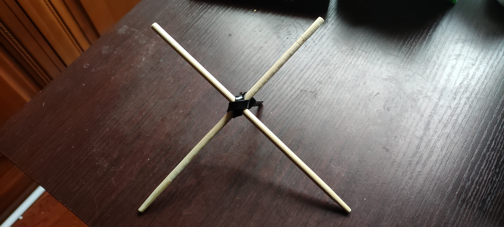
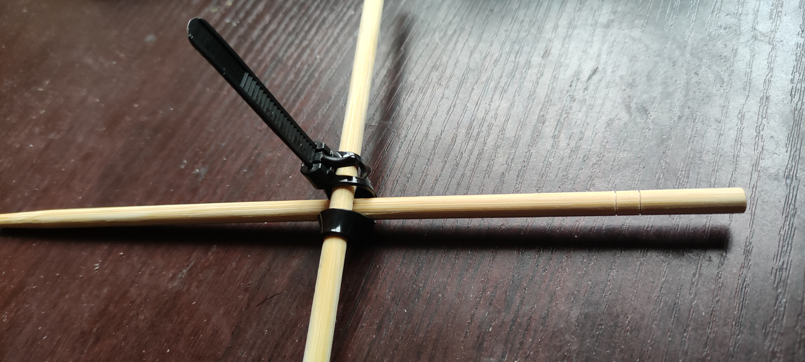

# 发明家天然不是人（），但人天然是发明家
- [[速成发明家/？]]
- 有时需要的东西还没有怎么办？——造它就完了！
  collapsed:: true
- 发明家的心态/精神状况
  collapsed:: true
	- “端正心态、奇妙开关是成功的一半——不信你随便找个人鸡同鸭讲、对牛弹琴试试？他们可能觉得他们做儿子当员工挣得蛮好的，小发明人搞发明高风险低收益，狗都不干！”
	- >青年人要敢想、敢说、敢干，要振奋大无畏的创造精神，不要被名人、权威吓倒。——毛泽东
	- [对共青团九大的指示（一九六四年）](https://www.marxists.org/chinese/maozedong/1968/5-078.htm)
	- [“世界是你们的”——毛主席对青年期望什么、寄托什么？ - 红歌会网](https://m.szhgh.com/Article/wsds/youth/2022-11-18/315755.html)
	- ---
	- “发明真简单！”
	  collapsed:: true
		- # “我上我也行！”
		- 不必“原创”什么“实物”
		  collapsed:: true
			- >发明涉及装置和方法，装置之前已有人做过，而方法则是我首创的。——《特斯拉自传》
			- ((67cc4b87-03ab-4e36-bcfa-f9ad847da97a))
		- 不必先“实测”
		  collapsed:: true
			- 专利申报都不用“实测”
			- 实际的长期发明过程更需要考虑效率
		- 不用已知第一个发明——“第一名”了不起啊？
		  id:: 679addab-a1bb-48c1-b0e2-734978b0c3c5
		  collapsed:: true
			- 有时我们可能懒得先搜自己有没有“重复造轮子”（事后可能又痛心多花了不少时间本可以整出更多发明），或许更多情况下我们的确是，但处理人生各种各样问题的乐趣的一个关键源泉就在于不（总是）先看答案
			  id:: 679addab-24ba-45b8-8a3a-9f56a51393aa
				- [有哪些你想发明却已经被人发明了的东西？ - 知乎](https://www.zhihu.com/question/31937124)
				  id:: 67bdb4bd-2441-46bf-976f-ab4b67be9b39
			- 有时——可能确实是“第一名”，甚至“天不生老子，万古如长夜”对吧？以下为可能的原因（“主要是低效分工”）
			  collapsed:: true
				- “知道问题的人不知道答案，知道答案的人不知道问题”
				  id:: 679addab-0fe8-4bcd-9a96-a01ddb996e0e
				  collapsed:: true
					- id:: 67595d2b-a52b-4019-a9a1-6ef8f40bb242
					  >很多简单的小商品（可能只是熟悉物品的不常见用法，可能因为分工、“没有时空交集”等因素没有跨场景，发现了可能会想“太简单了这能赚钱吗怎么没人赚这个钱啊”）可以做成各种场景的套件、整合包、大礼包，而通常为对应的使用方法等知识的免费部分则与其相辅相成，一些比较有市场价值的商品也可能需要通过专利等手段应对有复制、传播优势者的竞争
					- >巫医乐师百工之人，君子不齿——韩愈《师说》
					- 很多家庭的家庭成员各有各的分工侧重，至少以前主要是妻子做家务，尤其是饮食家务，妻子很可能因为职业上也有差异，不一定操作更多工具、机器，在家务中用来用去就是这么多工具乃至方法（“菜谱”），相对缺少想到新办法的经验材料——而很多丈夫因为下班时间晚正好没看到妻子做饭、累了躺先、“君子远庖厨”、夫妻生活不和谐等因素不太管妻子的家务，要关注也主要关注结果而非过程，明天还要上班，周末要看电视、钓鱼、打牌，等等——因此，如果他是“工人”，他也不一定把自己了解的工具、机器等的知识迁移到妻子日常使用的[[厨具、餐具]]上来
			- [牛顿定律不是牛顿先发现的，你被骗了很多年](https://mp.weixin.qq.com/s/tqG8e0sPTP7oWKuSpJWN9Q)
			  id:: 688cc988-569a-41b6-9f9c-8fa7b5914070
		- 不一定要学理科，甚至不一定要上学
		  id:: 677cbc7e-840f-49d9-8b47-80ed68462119
		  collapsed:: true
			- ((67c4f816-2da1-4acf-83ae-bb801cefe201))
			- collapsed:: true
			  >你是否缺乏大学教育？这不要紧。看看爱迪生、林肯或莱布尼兹就知道自学的力量。
				- ((6221b0d9-1369-4f26-960c-0ab96949d060))
			- 我目前的这些研发想法，好像没用到什么（“势能”——“初中物理”；“虹吸”——“初中物理”）——呃，气压、水压这些用不着学吧，有些魔法在日常生活中也能学到，随便刷视频也能学到好多魔法
			- 既然是“速成”，那么我以己度人（但不排除各位天才只是恰好缺点这里的参考信息），假设你的学校知识的最高可能水准是高数及格，别的科目都没了，因此此处建议的方向基本上只有“新用途”、“新工艺”（包括“原工艺外物品的新用途”），搞出“新理论”、“新模型”、“新元器件”等更前端、或许更具革命性的发明不在此处讨论范围内
			  collapsed:: true
				- ((679addab-5cc4-47e4-9ce0-377864b4d90f))
			- 简单流程的实现，除了简单到机械结构（或电路）都不需要考虑的外，可能用通用模块 ((679addab-8572-4aa8-a8c4-1eb01133ccf6)) 绕过技术原理，别说专业课了，就连更精简的若干小时的网课也不用学——更何况“以后有[[AI]]”
			  id:: 679b75b6-802c-44dd-9418-f54b6bf0a2fb
			- ((679add3e-6367-4bfc-a7be-297633576b79))
		- 不一定要用最新或较新的技术
		  id:: 679addab-0623-424a-9174-65bb98eddce9
		  collapsed:: true
			- “低科技”
			  id:: 688b55a0-37c6-441c-b1ef-b578e89fe7b0
				- # “沉淀！”
				- [Low technology - Wikipedia](https://en.wikipedia.org/wiki/Low_technology)
				  id:: 68c0e143-3bc4-453c-979c-ca6f8c9d469c
					- [Nomade des mers: Le tour du monde des innovations low-tech (Hors collection) (French Edition) - Anna’s Archive](https://annas-archive.se/md5/cb5920c3f1fe46b7a7571f4f008bdfd1)
					- [The Age of Low Tech: Towards a Technologically Sustainable Civilization | Philippe Bihouix | download on Z-Library](https://z-lib.fm/book/25904373/bb31c4/the-age-of-low-tech-towards-a-technologically-sustainable-civilization.html)
					- retro-tech
						- [RETROSPEKT - Reviving Retro Tech for a New Generation](https://retrospekt.com/)
					- ((68c0fa74-c1a6-403c-bc9d-146ebd9c864c))
					- easy-tech
						- “快来领取易科之力！”
							- ((68acfd1f-1789-4186-9ac6-6157fcb9ebdc))
					- no-tech —— ((68a69d2c-7194-4e79-9fe5-78a6a9b7b8cb))
					- “我也来想一个”
						- [Urban Dictionary: tricknology](https://www.urbandictionary.com/define.php)
				- [Low-tech Lab – Home](https://lowtechlab.org/en)
					- [Group:Low-tech Lab (English) - Low-tech Lab](https://wiki.lowtechlab.org/wiki/Group:Low-tech_Lab_(English))
					- [倡导“低技术”：让社会发展回归自然可持续_法国_研究_人们](https://www.sohu.com/a/733303442_99890339)
					  id:: 688b55a2-d4c5-4acd-959f-516fe2a26114
					- ((688b60e5-eb6b-42a5-a3e3-e483c77068d8))
				- [LOW←TECH MAGAZINE](https://solar.lowtechmagazine.com/)
				- [Can Decreix](https://candecreix.degrowth.net/)
					- [Is living low tech the answer?](https://shado-mag.com/articles/can-tech/is-living-low-tech-the-answer/)
					  id:: 688b5924-1392-4953-b81d-35bb97c78ae9
				- [Low Technology Institute – postindustrial | subsistence | technology](https://lowtechinstitute.org/)
				- [We Are Practical Action](https://practicalaction.org/)
				- [低科技 (豆瓣)](https://movie.douban.com/subject/36251559/)
				- “为什么（又）是法国（大致主导）？”
					- >2014 年，法国工程师菲利普·比胡伊（Philippe Bihouix）出版了《低科技时代》（L'âge des low tech），提出了像法国这样的矿产和能源资源匮乏的欧洲国家如何能够成为一个“低科技”国家（而不是“初创”国家），以更好地符合该国的可持续发展目标。
						- ((68c0e143-3bc4-453c-979c-ca6f8c9d469c))
				- ---
				- 需求被统一了，柔性生产就没有必要了
					- 市场上五花八门的供应，无论个体还是整体，都并非无懈可击，因为总可能有黑天鹅、灰犀牛等
					- “尽可能满足别人的需求才是好”？非也，君不见“让所有人都不满意”？
				- “大讨论”
					- 线性进步观、增长观（以及“发展必须增长”）等一边去
					- “承包制”、“污染前先治理”
						- 旧时代遗留问题可以让旧时代势力解决，新时代势力要优先照顾好自己产生的新问题
							- ((675912ac-6f42-4a8d-8a46-965906714ca7))
							- “机器人不准干低端工作！用更简单的机器就够了，杀鸡焉用牛刀”
					- “有多少工业垃圾的诞生是因为新技术和上级路径依赖、放不下沉没成本（“机器往最大寿命或坏里用，人往死里用，用完才能换，略像菜不能剩不能冷，塑料袋要囤着当垃圾袋扔垃圾”）呢？”
				- 多用人
				  id:: 68beb505-3b7b-4dd5-9569-ee64cb292092
					- “我劝各位不要小看人类智能”
					- 你关灯怎么关？需要用遥控器、手机遥控、喊小爱同学、叫机器人代你随时走过去关吗？不需要吧？只要先修好路，这条路可以关，那条路也可以关，不必在一条路上路径依赖，关灯的电线在墙里墙外都不怎么碍事，你走过去、爬过去关也不碍事（“XX可以走向开关”），把鱼线走墙上也可以拉着关、按着关、踩着关，发射泡沫弹（比如 ((685a79ec-74bc-4e74-b46f-b4ad0b22f1c9)) 的）也可以关——“喜欢怎么关就怎么关”
						- ((679add3a-2354-42e7-a194-2dbe2f073473))
					- “不直接用人就会弯弯绕绕”
						- ((67a4aeab-6b21-43c7-8ccc-4a1fb1c0aae2))
					- “欠运动的人”
						- ((679add59-264f-4c75-8174-4bdbf7365eb0))
						- 减脂服务，像在监狱一样免费蹬
						- # “按吃分劳，多吃多劳”——《大食经济学》
						- 
							- ((67da8276-ec32-4ba6-9ace-e2a08c375bc1))
				- ((68bd6216-c29e-43ef-b662-f00645f21e1b))
				- “至少入门简单很重要，而低技术更多是入门简单的”
				- 好好的人别被“科技风/皮”限制思路了
					- （成品）能只少用电子就少用电子
						- “机械动力，启动！”
				- “看好复杂技术的知识普及难度下降趋势”
					- ((679b75b6-802c-44dd-9418-f54b6bf0a2fb))
				- 简便自动化
					- [简便自动化怎么消失了？人类弄丢了简单化的能力_哔哩哔哩_bilibili](https://www.bilibili.com/video/BV1vjEfzHETb/)
						- 弄丢了简单问题简单解决的能力，反而大沟打钩教教教培养了简单问题复杂化的能力
			- ---
			- 战斗是时时刻刻都在发生，越来越依赖绝大多数兜大圈子的“科技”的人类用自己的小聪明送了太多，无来由但难以抗拒的错误的安全感是致命的，“怀疑一切，打倒一切”是重要的突围策略，玩游戏不这么玩很浪费时间体验了吗？家里人想买？（？）
		- 不一定要用比较贵的材料、加工等
		  collapsed:: true
			- # “怎么这么简单的东西都XXXX年了还没有让我看到啊？是不是挺能藏的那些聪明人嫌不赚钱还是怕死不敢公开？”
			- 可以直接用标准产品（标品），甚至不用（人体之外的）任何工具加工，甚至不用加工（“你不知道的功能、用途等”），甚至不用材料（“你不知道的人体的功能、用途等”）
			  id:: 67b3e69c-7613-453f-8b1f-8edd5a67dad6
			  collapsed:: true
				- ((67b3e608-5b35-4870-a083-c0e46b37ae9c))
				- ((67b091cf-2215-402c-a75e-390b766c0365))
			- ((679585f0-7ab6-4dd0-8fe5-f5338245568f))
			- ((67bace09-da13-4fba-a720-5738a55213bc))
			- “网左们是不是觉得只有传统工厂里才有靠谱的工业生产资料？”
			  id:: 67a5685f-6f85-4b77-b6d0-7dd8fb863a4c
			- “什么吉列斗争？就是如无必要，勿增实体”
		- ((6882dd0d-5796-470a-ad1f-a731f560d8c1))
		- ---
		- 先想得很简单，可能更容易继续想下去
		- “只要思想不滑坡，办法总比困难多”
		- 现在的商品种类比几十、上百年前多得多（应该是吧），所以你的发明（专利）数量超过那些闻名的发明家也不是不可能
		- 先合并计划好准备好可以高效批量实现，8小时搞定100项原型并非不可能（“8100香造工程”）
		  id:: 679b8086-a925-4f11-a5fa-277f1d71f8e1
		- “先做个垃圾出来”
		  id:: 67e680d5-feca-4eac-92ca-15005388d7c7
			- [发个高清无码版的“先做个垃圾出来” ​​​，适合做成壁纸 - @宝玉xp的微博 - 微博](https://m.weibo.cn/status/P42pfnK9Y)
		- 多次不成功也是成果
		  collapsed:: true
			- ((67bdd41d-869f-4492-ae65-6dd14af30356))
		- ~~“不想再花时间的可能的确相对而言没啥价值”~~
		- 同人类个体的创造力上限比你想象的要高，因为你生活的社会会影响你
		- ---
		- “当今中国或世界真的培育或出现不了达·芬奇那样能够很大程度上独立工作的全才/通才吗？”
		  collapsed:: true
			- ((679add58-8f9b-4f67-9ed7-46197e5aae34))
			- “全栈”是啥？
			- 达·芬奇也没把笔记里的工程都实践啊
			- ((6289ba07-901c-4527-86a9-fa4fcbb39e72))
		- “为什么别人会觉得难？”
			- ~~“连弯腰还是下蹲都决定不了的人又能干什么呢？”~~
			- 自然误导（？）
				- 身体本身就会误导你，根据形状决定范式
			- ((679add82-475f-48b6-a605-2a2680f62cc8))
				- 避免“脏手”、急于洗手、扔“垃圾”的倾向导致实践环节被跳过
			- 从生产者说，他们骗了消费者，消费者自然不会了，而因为路径依赖，生产者也会变笨，或者至少说不会考虑其他颠覆他们生意的可能——很简单的反噬
				- ((688b283a-c587-42c3-923b-8eda3d7750b3))
			- 很多讲究投机取巧的人可能实际上也太“老实”太“路径依赖”、“爱走流程”而想象力不足了（这样的人更可能说什么“想象空间不足”），这并不是说他们不成功，也不是说他们不够聪明，要圆滑老套地说就是“路径依赖”、“（自认为）隔行如隔山”、“求仁得仁”，他们追求的就不是发明各种“稀奇古怪”的玩意，而是按他们认为“可靠”（很大程度上，确实，比如相对稳定的竞争体系由大致很稳定的人构成，关键之一就是搞定“人际关系”，而且发明家也难以例外）的方式搞货币搞情人搞权力
			  collapsed:: true
				- ((67bc6ccf-19c1-46cf-a452-fbe4ef27ba8b))
		- “逆向”、“倒行逆施”、“开历史倒车”
			- “有多少人会坚持逆行呢？”
			- # “你知道？”
		- 当个（“青春版”）上帝，相信自己的“消费主张”，从“纯粹消费者”（“啥也不是！买的办法！”）的角色出走多想几层，更充分地了解、体验、评价、想象、测量一切，宁似生搬硬套，胜过奔赴下家
		  id:: 678eda4c-429b-4e40-a001-4d3c411ea627
		  collapsed:: true
	- “很有发明的必要”
	  collapsed:: true
		- “需求驱动”
			- “责任越大，能力越大！”
				- [能 力 越 小，责 任 越 小_哔哩哔哩_bilibili](https://www.bilibili.com/video/BV1dKSJY5EBc/)
		- [如何看待“不要拿你的业余(爱好)去挑战别人的专业(饭碗)”这句话? - 知乎](https://www.zhihu.com/question/395587867)
			- “你信吗？我反正是不信”
		- 对不好用的现状“零容忍”
			- ((622368ac-7efb-4e7a-a01e-42bfbe8c2519))
		- 我们每天（“客观意义上”）不得不做的事，难道不应该被消灭吗？
		- 技术进步恰恰拓宽了发明空间，因为技术进步能（“路径依赖”）掩盖、拖延很多问题和答案，就像人类的健康问题，解决了吗？当你只是想着治疗方案还能怎么创新、怎么降价（或者更粗疏的“有病看医生”）时，你自然没有想着预防方案可以是怎样的
		- ((67c3e135-9cd8-4c36-a1ef-728f249bce64))
		- 挑剔家，找茬家
			- {{embed ((67dfcb60-e737-42e5-9697-534a63ae7bc2))}}
			- 别人的新商品、服务一开始就是完满的吗？不需要改进或配件吗？可能他们折腾得越多，我们的机会就越多或越大
			- 敏锐察觉不满、需求、改进点
				- ((67ccfbf1-8f46-4a97-b809-17356787e481))
			- 习惯“找茬”（“有一个人前来找茬”），强制认定有很多东西（包括你自己的生活）如果不必彻底淘汰至少也应该改进（而不是“我努力工作就是为了这些残次品”），强制相信你将主导这一过程（否则“天不生夫子，万古如长夜”），强制拒绝无论何时何地冒出来的“万物已近极致”、“科学（物理学）大厦已经建好了，后人小修小补就行了”、“地球上这么多人具体应用肯定也碰不到新的”、“从工业革命开始一直吹到现在AI代替人类劳动，人类可以被技术解放基本不用或再也不用劳动”之类的观点，当然，这些也不是定的，还需要灵活逆反、左右横跳
			- “有那么麻烦？！我手动一下两下就好了，哪用得着专门做/买个东西？”
				- 有没有一种可能，你实际做事时，会因为这些麻烦而降低部分物品的使用频率？
		- 适度夸张（严重性、有用性、传播性等）是好的
		  collapsed:: true
			- ((678a4e13-fc71-4a28-be66-5b7736e7e751))
			- {{embed ((677e748f-3b09-4ffa-bc59-f00985923643))}}
			- 关于“暴力倾向”、“你疑似有点极端了”
				- ((678f9830-5b02-4775-b274-e6e1f9d49190))
				- “打开想象空间的必要之举”
				- {{embed ((67402acd-6d02-407a-9d37-f1e3d918bddb))}}
				- “人们”对战争的（“台面上的”）评价往往是偏负面的，但（“不可否认”）战争时期往往是人类科技进步快得多的时期，军事需要催生了大量塑造现代生活的“军转民”科技
					- “暴力倾向”这一词，从一个侧面反映了暴力现代化、专业化、集中于国家和专业人员（包括军人和屠宰业工人，很多“现代君子”怕是不太能平和接受“死”鱼抽搐的现实）、全球相对和平的时代背景，出于“治安”、“经济”等的需要，“尚武”精神在平民中被忽视乃至刻意压抑，好比不同群体经常被继续教育应该如何生活以便维持共同体的运转
					- 语言是军事发明吗？人类对其他生物的军事行动？
					- ((65bcbf5d-d63d-432f-b62e-757f2077ce9d))
					- 墨子、阿基米德、沈括、达·芬奇、马克沁、爱迪生、特斯拉（粒子束、遥控无人武器）都有过军用发明，因为他们当时所处的社会或保护人需要，甚至极其迫切、压倒一切地需要
						- ((67a6f644-8a5d-400f-8503-85e919994383))
						- 马克沁的电灯泡在专利官司上败于爱迪生才发明了马克沁机枪
							- ((674db011-c9ec-4439-9884-9c1ba90edd55))
								- >但是，显然爱迪生在如何打赢专利官司方面更胜一筹，争夺专利落败的马克沁被迫离开美国去了大洋彼岸的英国伦敦，然后默默沉寂了一年之久。
								  1882年在维也纳的酒吧里，借酒浇愁的马克沁偶遇一位美国老朋友，朋友看他对未来发明之路满脸愁容，对他建议：“去你大爷的化学和电灯吧！如果你想赚大钱，就发明一种能让这些欧洲人更容易自相残杀的东西。”
								- id:: 67ac683d-07e0-43dc-b416-0c016b929ba6
								  >马克沁患有支气管炎，因此他曾发明了一种薄荷醇吸入器和大号烟斗，他给烟斗取名为“和平烟斗”，这种烟斗的工作原理就是加热混合了药物的水，然后将水蒸气吸入舒缓喉咙，能有效缓解哮喘、花粉症等问题。
								  但是人们纷纷嘲笑马克沁是江湖郎中，是个推销虚假医疗手段的庸医。这让老年的马克沁非常羞怒，他生气的反驳道：“在人们眼里，发明杀人机器是一件非常值得称赞的事情，而发明一种防止人类受苦的装置则是一种耻辱。”
							- “没钱了才研发来钱的战争机器”
						- ((679addab-08b3-4866-94c1-47574d1c686b))
							- >不过，美国海军部并没有应用这些发明、改造，因为海军部也只是想借用爱迪生的威望使公众相信政府，对爱迪生对海军的作用并不是十分信任。
							  所以，几年以后，爱迪生说：“在战争期间，我作了大约40项发明；每一项发明都十分成功，可是他们一项也没采用，都闲置了起来。海军官员讨厌平民插手他们的工作。这些人开办的似乎是封闭公司。”
					- ((67ab5649-ee8e-4eca-99e1-a8772677877c))
				- 比如“哈基米”就不能说“啥也不是”，而是也给了“爱猫人士”各种“爱猫”灵感
				- 现在很和平吗？至少“商战”是无时无刻不再发生的，在所谓“和平”环境下不是硝烟滚滚、血流成河罢了
				- “你什么都不想破坏，你疑似有点保了”
		- {{embed ((678b04be-0d1b-46a3-b700-167a58a392d0))}}
		- {{embed ((664f5951-f4f1-4058-9206-54e556f7ec20))}}
		- 你想教育你的身边人吗？比如过年时老老小小的亲戚
		- “不一定是‘我爱发明！’但有想法了很难完全忽略，就像‘天命难违’，别人有别人的洒脱/躺平法——我有我的！”
		- 想发明意味着高效、饱满的学习和超限能力
		- ~~别人不懂，你懂，别人不敢，你敢~~
	- “没必要全都很有用”
	  collapsed:: true
		- 觉得自己或别人至少暂时不太可能用到的东西也可以想，都可以想，有什么不能想的？！什么都不想，就什么都想不到！想让想象力夺权，就先给想象力松绑！
		- 有些创意的过程就是娱乐放松（不信你去问问达·芬奇或希特勒画画是不是工作？），别追求全都立刻马上非常有用，现实中很多生产都有不少副产物
		  id:: 678f9830-5b02-4775-b274-e6e1f9d49190
			- [大瓠之种_百度百科](https://baike.baidu.com/item/%E5%A4%A7%E7%93%A0%E4%B9%8B%E7%A7%8D/10825517)
			  id:: 67a018f6-08d3-4fb0-9169-a8af27bdd411
				- “这是啥？游泳壶、跟屁虫？好像真有用！”
			- 有的整给别人看也有娱乐放松的效果
				- ((67e50a8f-7003-4be4-93f9-38d3fe735b19))
				  id:: 679f319a-58df-492b-b437-0a152e56edee
				- ((679f319a-58df-492b-b437-0a152e56edee))
				- ((67eca839-7c2e-401d-89a3-7ecf46be24c2))
				- ((67debedc-56ae-4556-b299-659a69c88b22))
			- “高射炮打蚊子”、“牛刀杀鸡”——有什么问题吗？
		- 多联想
			- 游戏文本
				- 宣传时或许有用
				- 喜欢什么游戏，为我所用，至少我们这些发明家同行可能愿意为了你那点发明稍微了解一下自己不会玩的游戏
		- ((6221b0d9-1369-4f26-960c-0ab96949d060))
		- “你以为有/没用的就是有/没用的？”
		- ((678b04ba-4387-4d8e-908a-fc58fc2e6cb9))
		- “勿以善小而不为”
		- [短暂存在过的发明_哔哩哔哩_bilibili](https://www.bilibili.com/video/BV1wM4y1Y7bx)
		- 儿童发明
			- [无厘头设计师带领一帮小屁孩脑洞大开搞发明 | TOPYS创意内容平台](https://www.topys.cn/article/19729)
			  id:: 67cefc9b-0e7c-4d46-821e-9bfc0003d65d
	- “不要怕发明害人”
	  id:: 67eb2866-2a48-47d8-b091-5e6d31493860
	  collapsed:: true
		- 我不相信以下说法
			- ((679adcda-d74a-48ea-9af1-d08e78c318ad))
			- 发明、发明家更容易大规模害人
			  id:: 688b2837-ff0b-4173-99c6-56f8326907a9
				- “技术进步”很多是他们直接搞的，但“技术进步”的效果不都是好的
					- 比如技术进步被用来给垃圾生产续命
					- ((6891f55d-7ceb-41d7-88d4-06cba6d60120))
				- ---
				- （或多或少）脱离大市场
					- “家里蹲”
						- “我早就是家里蹲人了”
					- “共享家园”
						- 包括[[宗教]]的
							- ((68a69d00-4eb5-4a5e-9e26-ed6ff3458f94))
					- “遗世而独立”
						- 游商
						-
				- 志愿服务，性质可以说类似药品集采，能够在人力短缺的公务员体系外给缺乏消费能力和动力的相对贫困、需要帮助的人提供免费服务，减小他们在教育、医疗等方面的无谓损失
				- 帮上游卖货、材料，增大或维持了市场总量、货币流通等
					- 买一件亚文化、 ((6785f0fe-53a1-4363-905c-8a442ea609fd)) 商品——“那真是极好的”
				- 出国工作，稍微缓解国内就业压力（至于比方说进入相对摸鱼的日企会否导致求职失败者就业困难或不良，我反正是不知道的，相信日本人民能解决自己的问题），甚至开拓国际市场，相对高的收入可能也会回国
					- [如何看待时下被部分网民力推的“双输好过单输”观念？ - NIO倒闭了嘛的回答 - 知乎](https://www.zhihu.com/question/1913900000091551603/answer/1917993075160114985)
				- 不买一件商品服务，一般没啥影响（除非其他很多人也“独立自主”地这么做）
				- 学一项技术，市场不饱和时同行反而帮忙宣传，市场饱和时一般顶多在劳动量上代替一两个人，往往最多降低时薪而非导致失业
				- 仿制一项成本优势不明显的商品服务，一般只是给多个竞争者添堵，在细分市场打得有来有回
				- 搞一项竞品，一般顶多影响友商当年一小部分销售额
				- 资本家的逐利倾向导致的技术扩散——“是背景板”
					- >蒸汽、电力和自动纺织机甚至是比巴尔贝斯、拉斯拜尔和布朗基诸位公民更危险万分的革命家——马克思
						- [《马克思恩格斯文集》第二卷——卡·马克思 在《人民报》创刊纪念会上的演说](https://www.marxists.org/chinese//marx-engels2/02/10.htm)
				- “充分让利”的低成本技术扩散，甚至没人感谢你，甚至发视频的收入都没研发成本高，代替的却可能是容纳少说数万就业的行业，甚至是各类公共服务时间的必要性，一些需求是近乎刚性不可再生的
					- 我们可以想象一个很晚才会用火、新技术冲击“生”物市场的世界吗？
						- [为什么人类用火这么多年中没有其他动物用火或者进一步地加工火？ - 知乎](https://www.zhihu.com/question/492850496)
					- 很多人（包括我）吃饱了就不太能确定下一顿“想吃”什么了——“这还不算”
					- 很多人玩了手机电脑，很多线下娱乐就受到影响，很多
					- 不像豪车之类的奢侈品可以在很多方向雕花，只要看着像是那么回事、比消费者狐朋狗友家的高端就有人买
					- 最后，发明家大多也有软肋，（实际）破产老板、老员工、税收受影响的地方政府等一干人等都可能溯源并报复（这种报复在“人性”层面是天然正义的，就像迈完左脚迈右脚，无论发明家当初把自己想得多好），所以无论发明家看重哪一边，都有很大理由谨慎行事
				- 市场自发行为抵消局部负面影响没那么快，甚至还会追尾扩大
			- 发明家的抉择（“真的吗？我不信！”）
				- “不要拦着我！”
					- “如果一个普通人碰运气捣腾出来的一项相对高效的发明竟然会对社会有害，恐怕这样的社会至少应该是更有问题的”
						- 可能发明家不得不面对一个类似[[INSIDE]]的背景
						- “难道发明家应该漠视生命冲动，无聊到陷入基于不知道啥玩意的功利主义算计吗？”
						- “难道人们不应该从当前低效的生活中解放自己，省下时间来少竞争多学习健身合作，多动动脑做点有意义的事吗？”
				- “我再想想”
					- “我有资格干涉别人的生活吗，如果我认为他们还没做好准备？”
				- 不服气是不太容易的，但胆小也是真的
					- “战绩查不到”，但没有充分理由认为这次不是第一次
					- 缩量相对容易整出大事，怕的话可以做增量，比如不用专用组件，提供一个通用解决方案，把消费者已有的东西搞成套件
				- 不公开（可能）就行
					- ((67de9651-7e1e-4cb3-ae81-959ff228b1cb))
						- “还小范围展示了下，心大这块”
						- “然后呢？”
					- 发明家“使（自己）有什佰之器而不用”（甚至自己有也不用），“以无事取天下”，或许就已经是人类的大善人、自己的英雄了，这样想是不是非常客来碗呢？
					- 不得了的均匀害人
						- [[更多支点]]
					- 总之不能停止技术储备（“哈哈，技术储备，可能明天就没用了”）
					  id:: 67eb2866-a9ac-4c6b-9509-9715e1f8f2c9
				- “想象、体验一个低技术的世界”
				- ((68707354-d1ee-4d29-a914-932c5efda6bc))
			- “看不见、看得见的手都会调节，看看日本大米等，好东西还怕它成本低？自然（天灾还是有的）或人为的供不应求难道不是一直都有吗？”
				- “资本主义是不是在挑逗我？”
					- “资本主义别在我出大招前崩了！”
			- ~~“那很左右互搏了”~~
- 了解
  collapsed:: true
	- ((670d40db-dfb4-4b4e-9c75-d6ad2f2541e5))
	- 多看
		- ((67a3fccc-6c25-4b7b-9ff9-d2b3cec89c22))
		- 很多技巧也是时间多了见多识广，而不是自己一开始试出来
		- “整体观”、“拒绝忽略极少数”、“透过现象看现象”、“局部观”、“突出重点”、“（用）数字说话”、“你的数字生活”
		  collapsed:: true
			- [大家的精神状况真的很美妙啊_哔哩哔哩_bilibili](https://www.bilibili.com/video/BV1ThPWeyEFk/)
		- “（日常生活）（简单手工艺）小妙招”
		  collapsed:: true
			- [妙招姐的个人空间-妙招姐个人主页-哔哩哔哩视频](https://space.bilibili.com/287051252)
			- ((686a2754-a64e-4192-8eb6-c5a504f661c1))
			- [看了就忘小妙招_哔哩哔哩_bilibili](https://www.bilibili.com/video/BV1s1421b7Hb)
			  collapsed:: true
				- 扎带交叉缠绕固定两根互相垂直的杆
				  id:: 6791ca00-c88b-48d5-b47e-cf6f4221f8fc
					- [【看了就忘小妙招】 【精准空降到 02:13】](https://www.bilibili.com/video/BV1s1421b7Hb/?share_source=copy_web&vd_source=24175964b0df2fcc2c022cae23517fdc&t=133)
					- 可拆卸扎带比较宽，可能没更窄的不可拆卸扎带那么紧；事实上无法阻止稍大力的旋转；具体应用中也可能产生 ((6645c052-7bce-4b03-9f0d-6354d964b588)) ，不一定适用于食物
						- 
						  
					- 替代 ((678b04ed-bf75-4d72-9c52-02f193283af7))
						- [此绳结被农村人誉为，木匠扣，打法简单实用，很多地方都能用到它_哔哩哔哩_bilibili](https://www.bilibili.com/video/BV1K64y1R7Qs)
						  id:: 6795fe01-9ec7-42d3-b844-8d45baf8d6b4
			- [来自劳动人民的大智慧，只要思想不滑坡，办法总比困难多_哔哩哔哩_bilibili](https://www.bilibili.com/video/BV1rsdTYNE57/)
			  id:: 68089273-7fff-4342-8300-f9c0ed5a7398
			- ((678b04ed-bf75-4d72-9c52-02f193283af7))
			- [3 Incredible Ideas and Life hacks_哔哩哔哩_bilibili](https://www.bilibili.com/video/BV1Ls411x7oH/)
		- 刷 ((66ade36f-b510-4059-82d2-e01b7e265e12))
		  id:: 679addab-072a-477e-83c0-247402a96345
		  collapsed:: true
			- ((624d1fef-b51c-4666-b599-375029480545))
				- “但别人可能需要”
			- “你连拼多多都不愿意用，还敢说自己是网左！”
			- 想到什么就搜（可能比在别处搜更快找到你想到的），“料敌从宽”，查一下有没有“前辈”已经整出来了，整出来的也看看整得好不好
				- ((679addab-a1bb-48c1-b0e2-734978b0c3c5))
				- 如果你想造车，那么除了不要闭门外，还不要重复发明轮子，也一般不用重复造轮子
				- 看得多了，以前最多想到就放弃解决的问题一下就解决
			- 朋友圈里的大工程师们又出新作了，不要光愣着，赶快打开拼多多拍照识别看看他们用了哪些材料和工具
			  id:: 67d8c481-6d60-463c-b57e-486c8a44ee5a
			- 收藏
		- 看知名企业产品
			- [3M 科技 改善生活 | 3M官方网站 | 3M 中国](https://www.3m.com.cn/3M/zh_CN/company-cn/)
		- 多逛高集中度的线下（专门）市场（比如华强北）
		- ((6221b0d9-1369-4f26-960c-0ab96949d060))
		- ((6243b4b6-9e05-4657-8fec-006aab8d01c7))
		- 常见工具、机械、电子设备、工程及其工作原理
		  collapsed:: true
			- [萌萌战队的个人空间-萌萌战队个人主页-哔哩哔哩视频](https://space.bilibili.com/357669580)
			- [OMG黑科技的个人空间-OMG黑科技个人主页-哔哩哔哩视频](https://space.bilibili.com/455753798)
				- ((679addab-ec9e-4db8-800e-fe486c63e85d))
			- [萨尔的尤舒拉的个人空间-萨尔的尤舒拉个人主页-哔哩哔哩视频](https://space.bilibili.com/39101693)
			- ---
			- ((67c41a77-968e-4373-b660-10ac327459f7))
			- ((67b4867a-bbad-4376-887f-db01599a9297))
			- ((67a555fc-b2cc-49c4-a40b-d571127d7930))
			- [[汽车]]
			  collapsed:: true
				- {{embed ((678b048b-fdd6-4592-b808-28d421c654d4))}}
				- ((679addab-817c-48f5-b698-1ef6529a4932))
					- 车钥匙弹簧轨道
					- 车钥匙凸点设计，不看也知道
				- 汽车可调空调扇叶
				- 门开关（？）
				- 弹簧手机支架
			- 往复、旋转切换
				- 曲柄
				- 连杆
			- TODO 合并同类项视频
		- 发明史、技术史
			- 你喜不喜欢“（“失落的”、“因为配套条件尚不满足而未流行、留存”的）古代原型被现代真正发掘利用”的故事？我喜欢，因为人类就是会因为各种原因大规模死亡或以现有的技术骄傲自满、凑合而健忘、分散注意力
			  id:: 679f3820-5c3e-4ea4-ba6f-8977ebc9b257
				- ((67836539-36e5-43eb-b5e1-10f801c44d1d))
				- ((67402ab5-1aa1-4321-bc40-62b50b0040b4))
			- ((65c589f9-342d-42c5-818c-f363a95b3847))
			- [[发明家]]
			- ((67402ab0-228f-4a39-aa1a-b6ef9e333345))
			- ((679adcd9-9f55-4544-93c3-a90a3965de85))
			- ((679add4e-0238-4cc1-813e-1f3c952c2893))
			- [美国制造:改变世界的10项历史性创新](https://baijiahao.baidu.com/s?id=1702886931857631290)
			  id:: 67de9b56-bc61-4a7f-983c-a43c484205d0
			- ((679387ca-fcf8-40d6-8a41-695a54168108))
			- [ChrisLex工业设计的个人空间-ChrisLex工业设计个人主页-哔哩哔哩视频](https://space.bilibili.com/7760409)
			- 四大发明
			  id:: 68b26daa-8d60-472b-a1ba-46606cbbd399
				- [为什么感觉四大发明很空洞？ - 知乎](https://www.zhihu.com/question/541716186)
				  id:: 68b26d79-ab13-4713-b818-23ecc7df8b3b
			- ---
			- ((679add81-e7c3-408b-8f17-8415d427556d))
			  collapsed:: true
				- 仿生学
					- “演化科技，小子！”
					- “厉害了我的动物朋友们！”
					- ---
					- 扑翼机
					  id:: 67eb2866-e1be-4cfe-a036-7f2f5700fd05
					- 蛾翅吸波
					- 鲨鱼肠道
						- ((679add47-4ac7-411c-84bd-e35cb521a776))
					- 章鱼触手
					  id:: 67d93cd9-ee27-4384-9420-8f402f0eb9d9
						- [中科大研发章鱼机械触手，机器人何必用人手！_哔哩哔哩_bilibili](https://www.bilibili.com/video/BV1UBrYYnEUR/)
						  id:: 67d93cd5-5aaa-49f7-af44-38713b0b6428
				- [[人体]]
					- ((666a2d18-eaf0-4cd5-b61a-dedeecaf51bd))
			- 动物的发明
				- 新喀鸦也会制造工具
				- [只有人类才会制造工具？这13种动物会让你怀疑人生 - 知乎](https://zhuanlan.zhihu.com/p/60880099)
				- “本能、模仿、学习、发明？对于相同的工具，人与动物谁先应用？”
			- 环境特化
				- 航海
					- {{embed ((678b0495-424c-4edc-9806-6065a5cca364))}}
					- {{embed ((6766c596-9755-485d-8520-53d0cf6ebc62))}}
				- 作案手法
					- 或许纯虚构的有福尔摩斯、 ((678b04b6-fba8-418b-9b03-5dffa5b06053)) 、逆转裁判之类的
					- [柯南、金田一和侦探学院的诡计手法合集 - 哔哩哔哩](https://www.bilibili.com/opus/480370501265851590)
					- [【图片】【科普240216】柯南与金田一 同种作案手法收集贴【推理吧】_百度贴吧](https://tieba.baidu.com/p/8897830333)
			- 多专业背景跨学科
				- ((6777ef19-4a21-496d-9925-d48cdd6f4dbc))
			- “有关系吗？想办法组个CP”
				- ((6767ff71-9679-4f76-98fa-7cd1e0ffba4d))
		- [[大脑升级]]
		- ((679adda6-e9cf-472f-b306-a72d78191cd1))
		  collapsed:: true
			- “形不上戴夫，歪比巴卜”
				- [《歪 比 巴 卜》_哔哩哔哩_bilibili](https://www.bilibili.com/video/BV1Y3BiYdEc8)
				  id:: 67bc3aa0-9189-4406-90f8-7aa3584dd736
			- ((66ade37d-0434-48cc-a0bd-953a65864482))
				- 好笑吗？我只看到——
					- [好笑吗？我只看到了一个字😡两个字😡三个字😡四个字😡五个字😡六个字😡七个字😡八个字😡九个字😡_哔哩哔哩_bilibili](https://www.bilibili.com/video/BV1NiX9YYEK6/)
						- ((670d4143-c378-4ec0-ad00-43208df973fd))
			- >这个西瓜片怎么头尖尖的？
			- ((67f1f029-c666-4dd7-9e1c-50902e3528f3))
		- [[发明方向]]
		  id:: 67a56029-5598-45b8-becb-495a0e0b7852
		- [[市场流程]]
		- [[我的日常]]
		  collapsed:: true
			- 供大家参考，我的“自由支配时间”应该是相对很多，但目前我的研发想法的最关键阶段就是在实际劳动中“发现需求”和之后初步的观察、想象啥的，而非之后在电脑前用更多“空想”完善，“总得有个头啊”对吧？——当然，也有很多看到之前的想法记录继续想的，所以要多想并多记——如果我觉得一切OK，对家务啥的忍一忍就行，那我当然就不会想什么家用工具
			- “挤出时间”，往往也意味着涓涓细流般的发明
		- 关注一些科技号
		- 发明环境与发明权属
		  id:: 679addab-1515-4041-a71c-dd04a6a7e970
		  collapsed:: true
			- 职务发明
			  collapsed:: true
				- [职务发明_百度百科](https://baike.baidu.com/item/%E8%81%8C%E5%8A%A1%E5%8F%91%E6%98%8E/1907145)
			- ((678b04a4-41bd-48c2-8e40-fa5006f5ddd4))
	- 多学（偏理工理论）
	  collapsed:: true
		- [[英语]]
		- 如何显得聪明，多学，乱学（“ta可不是乱学的嗷”）
			- 专注的傻瓜
		- “对的，我反正是不会”
		- “知识迁移”
		- 从难题开始，找学习资料
		- ((679add61-f05a-4194-a85d-d30458a437e0))
		- [[机械]]
		- [[电路]]
- 体验
  collapsed:: true
	- [[尼古拉·特斯拉]]很擅长想象，但他从小已经盘过很多工件，很熟悉了，所以脑内建模、运转相对容易，而且这种学习可能像语言学习一样越早效率越高（“或者说越晚效率越低”）
	- 多玩
	  collapsed:: true
		- 语言游戏
		  id:: 67cc4b87-03ab-4e36-bcfa-f9ad847da97a
			- “实物”、“信息”，都要会玩，特斯拉会讲8种语言，语言是人类思维（包括“无意识”）能操作的最灵活的“物体”之一，操作语言的能力关乎“排列组合”“联想”、“灵感”的效果，最好有像是带识图功能的AI的被动技能
			- ((67caddca-cd1d-4469-9cd9-64659db66697))
			- [自己发明的梗广为流传是什么体验_哔哩哔哩_bilibili](https://www.bilibili.com/video/BV12E421A7US/)
			- [[魔怔英语学爆班]]
			- ((67f6fe7d-37e1-4fba-baef-5504a023a54d))
			- “活字乱刷术”（鬼畜）
				- 语言游戏，活字乱刷术——“他可不是乱刷的”
				- ((67eb284a-60d9-4ac3-aca9-ce936da8305d))
			- 猜成语
				- 鬼畜不用看多，猜成语
		- 避免长期过度单调的运动
		- ((678f0308-cb58-41cb-a11c-cc2e2bb1c6a4))
		- 打破周期，否则添头
		- 我的“自我效能感”和日志会告诉我，今天这个最爱玩的游戏我玩得大致怎样——但写到这下一秒我又不信了，我拥抱整体观，“每一天！”
			- 为什么这个游戏好玩？因为它对于仓鼠党是非常友好的，没有保质期问题，一切可搜、瞬间抵达，发展也相对由我不由“游戏机制”
		- ((67402ab5-c2f4-459a-ba62-4ff4a0c14586))
		- [[手工]]
		- [[城会玩]]
		- 一起玩
			- ((678f0940-5987-4772-81b3-a5bf612664a7))
		- 拆，拆坏了也没事（当然最好还是搜搜，有计划地拆）
		  collapsed:: true
			- [火龙果迷拆的个人空间-火龙果迷拆个人主页-哔哩哔哩视频](https://space.bilibili.com/1862247409)
			- ((6781b82f-ec95-47cf-a044-fa2db11f2f4b))
			- ((6781adf7-28ea-4d50-9f89-2a7f1ab0d402))
			- 功能拆分
				- 可能在案例学习中更有用
				- “化整为零”
				- “部分大于整体之和”，在特定环境“退化”换成更便宜、未“高度特化”的，反而更通用、“降本增效”了
				- “我们联合！”
					- 我们看到的绝大多数物品是七拼八凑来的
					- “高度特化”、“一器一用”——消费主义瓜分是这样的，
					- 要对抗人的“原子化”，或许应该多拆拆物再重新组合！是需要外力的！
	- 有的劳动一开始可能并不十分快乐
	  collapsed:: true
		- 做家务时不情不愿，做多久这情绪就持续多久——有什么好处？我要化输为赢！
			- 至少可以先这么做
				- {{embed ((66db8aba-5f68-4a8f-860b-4599215273cb))}}
	- 我大概比大部分年轻人在家时间长、做的家务多（“点外卖或不吃配额的单位食堂亏是”），所以我在家用领域有点沉淀也很合理
	- 羽毛球下落，鱼鳍摆动、浴缸晃水（？）
- ((67d6d8e7-1700-4d7e-a3d5-91d7b82adc6c))
  collapsed:: true
	- “先有发明后有（更多、更实际、更有价值的）应用”很常见，别人的发明可能先是用在了并非“价值最大化”之类的用途上，我们给它的 ((67ab494f-1529-4bc8-94e3-42cf99c65884)) 也可以算发明
		- [先有发明还是先有需求，这是个问题-虎嗅网](https://www.huxiu.com/article/489871.html)
		- [在数学上首先发明，其后才在物理/工程上得到应用的例子有哪些？ - 知乎](https://www.zhihu.com/question/30982294)
		- ((6777ef19-4a21-496d-9925-d48cdd6f4dbc))
		- “科学发现算发明吗？”
			- [科学网—科学理论是发现还是发明的? invention和discovery不可同日而语! - 刘全慧的博文](https://blog.sciencenet.cn/blog-3377-882973.html)
		- “以上有些需求，也有不少发明（比如文字——“那么思维——也应该二分？”），听懂掌声！”
			- 小孩或巨婴嚷嚷“我要XX”，这就是对需求不够明晰，至少表达得不够明晰，那么从需求≈（“真好用啊符号！”）发明看，他们大概不太能发明——他们如果闹赢了，但如果从“发明＝大赢”看，大概是顶多是小赢，甚至还要亏不少，所以一定要坚持赢麻，平时只想着小我、小家子消费是没法提供充足的发明动力的，不想下大棋的人最多只能成为棋盘的一部分
	- 先需求后技术，天生万物以养人，机器能搞定的尽量不用人，但受各种影响，人们或多或少或好或坏地没有困难也要创造困难
- ((68292258-170c-49bd-a387-3a8338217fe8))
  collapsed:: true
- 评价
  collapsed:: true
	- [王迅找茬是什么梗【梗指南】_哔哩哔哩_bilibili](https://www.bilibili.com/video/BV1e34y157Te)
	  id:: 67402aa3-b889-4af0-acd2-ccd4d88b504e
- 记录
  collapsed:: true
	- ((66335bea-e054-49b0-89cc-3d88d3d2f697))
	- 想法按需描述下防忘
- ((670d40e1-5fa0-4d1b-80e4-4b0a93cfa238))
  collapsed:: true
	- “思维体操天天练罢了”
	- ((679adcb2-c5c4-4703-986a-101e6ff4cf92))
		- [幻象频出的时节 - 密教模拟器中文维基 - 灰机wiki - 北京嘉闻杰诺网络科技有限公司](https://cultist.huijiwiki.com/wiki/%E5%B9%BB%E8%B1%A1%E9%A2%91%E5%87%BA%E7%9A%84%E6%97%B6%E8%8A%82)
		- “这种症状持续多久了？”
	- ((67402ac9-3a03-4c50-abb7-49d387de40b8))
	- “规律”
	  collapsed:: true
		- “全都至少部分源自个人经验”
		- 可能需要避免“模仿人类”干扰
		  id:: 67eb2866-d31f-4326-8254-5aea3b60f20c
			- “哈哈，我的朋友们都挺在行！”
			- [【手工耿发明被母亲吐槽：不是没用，是真没用！】 【精准空降到 01:10】](https://www.bilibili.com/video/BV1J54y1k7Jr/?share_source=copy_web&vd_source=24175964b0df2fcc2c022cae23517fdc&t=70)
			- >我记得知乎看到过一个回答，大概是说，自动化专业里，新手设计机器都会犯一个错误:模拟人类。举个例子:我要让可乐瓶盖全部向下，方便后续盖上。一般人首先想到的是机械臂模拟人手去翻，但实际上是振动盘——评论
				- ((67d68523-c84a-4406-99d3-9dd0aff1f066))
			- 设定相对你对人体的了解而言“离谱”的目标
				- “哈哈，手不用了！”
			- 抽离人手等
			- ((67d93cd9-ee27-4384-9420-8f402f0eb9d9))
			- ((67fba331-70c6-4b4a-bd2e-7049021af08b))
			- 把自己当[[机械]]
				- 你从电脑桌或别处回到斜插着筷子（或者别的布设方式）的餐桌（“是怎么走的？”），抓筷子是虎口直接抄过去夹两筷还是先绕到两筷末端之上再向下套进去再夹？
				- 吃各种菜时是头转得多还是筷子（手）转得多？
		- 可能需要避免实物干扰
			- 最近想到、看到、听到的未必最优
				- ((677bda68-9716-4a59-b457-775fc087dc20))
		- 注意显示范围、视域缩放比例
			- “小屏啊！”
			- “新闻学常用此类技法对你的兴趣...”——这个例子不太好，注意的话有时能看到这种标题的
				- [多显示一个字会si系列_哔哩哔哩_bilibili](https://www.bilibili.com/video/BV1FH4y1c7PN)
					- >  ——评论区
			- ((677bd719-16b6-4075-9e31-7b1208af6e03))
			- ---
		- ---
		- ((67f26849-a7e5-4912-ab28-2cd7114ac191))
	- （日常）视大若小、视小若大
	  id:: 688b2837-c2ce-4934-9aff-52441a6c6ac4
	  collapsed:: true
		- 看过“（数）正方体”的三视图、图纸/说明书、房地产楼盘等的沙盘吗？可以不止看那些
		- 想象自己是巨人，想象物体很大也可以
		- “随意大小变”
		- ((626614b8-5064-4c3c-b654-fc85a8f950fb)) 还是哪的相关评论里看过（视大若小肯定有），好像说是练武练胆的——“据说还有副作用”
		- [[饮食游戏]]
			- 比如把餐桌当战场、工地（等的沙盘）看——“我是来吃饭的，你们这些地上的楼上的筷子这么摆放想干什么？！”；筷子架碗边掀饭；“我就是个吊机吧？”
			- 餐桌，菜，卫星城，工厂烟囱，蒸汽
		- “格列佛游记是吧？”
			- ((67eb2adc-7102-40c3-911a-a7bee34a2db1))
		- “复归于婴儿”？
			- （首先）抑制对远近、大小的进一步区分？（“这下有时坐立不安了”）
		- “毛泽东诗词、宣传画里亦有此类事”
	- ((67f62f78-fda8-493a-b772-7717f470ea80))
	- [加缪 发癫 实录_哔哩哔哩_bilibili](https://www.bilibili.com/video/BV1aBrUYiE9x)
	  collapsed:: true
		- [加缪 发癫 实录 #2_哔哩哔哩_bilibili](https://www.bilibili.com/video/BV1u8cretEez)
	- ((67eb282a-7afa-4dd6-861c-1021064fce53))
	- ((670d40dc-cb57-4f6d-90ed-4259ae94d555))
	- ((6718cef6-bf90-46ef-b4e5-16a810b1bd26))
	  collapsed:: true
		- [把全身关节想象成无限，这副身体挥出的光速拳，连他本人都止不住的发抖_哔哩哔哩_bilibili](https://www.bilibili.com/video/BV1xx421Q74t)
		  id:: 67889b8a-08e2-4a68-9581-693d15dba40c
	- ---
	- 对于我的很多创意，我是经常很难不打字边不满脸堆笑
- 原理
- 技术验证
  id:: 67cc41d3-2635-42f0-958e-b586ed82f83d
  collapsed:: true
	- 不一定要有原型了再验证：用一个勺子、最多几根筷子，就可以验证一下投石机的技术
- 选型
  collapsed:: true
	- 尺寸
	- 规格
- [浅谈产品研发的各个阶段——A样？B样？C样？ - 知乎](https://zhuanlan.zhihu.com/p/525653981)
- 原型