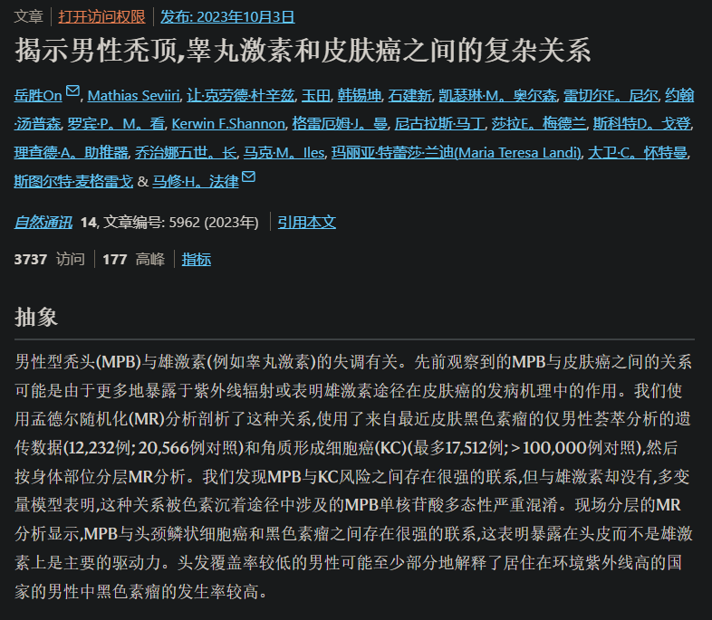

- ((66335bec-09b8-425c-afe3-deb6d056e845))
- ((66505046-3044-4293-bce6-b8c580b032c6))
- 遮阳帽
	- 铝箔+头顶支架（隔开透气散热）
- 防中暑（阳暑）
  id:: 66542b38-cee4-438a-b8cb-6c090e6ba21a
- 防皮肤晒伤
  id:: 66542a78-6f54-4fc7-a847-e6bf9db73123
- 防皮肤晒黑
- 防皮肤癌等疾病
- 防晒的必要性
	- 皮肤衰老
		- 内源性衰老
		- 光老化
			- [晒太阳到底是防衰老还是会加速皮肤老化？ - 抗衰颜究所的回答 - 知乎](https://www.zhihu.com/question/305820450/answer/2518019163)
	- [坚持用防晒能防老？你可能想多了……（一） - 知乎](https://zhuanlan.zhihu.com/p/296564131)
- 防晒性能的检测手段
	- [紫外线测试卡？ - 知乎](https://www.zhihu.com/question/283359314)
- TODO 动植物隔着玻璃光照有害吗？
	- ((65897b5e-747d-4d6a-8660-82a820a5b647))
	- [Frontiers | Interactive Effects of UV-B Light with Abiotic Factors on Plant Growth and Chemistry, and Their Consequences for Defense against Arthropod Herbivores](https://www.frontiersin.org/articles/10.3389/fpls.2017.00278/full)
	- [UV-B light and its application potential to reduce disease and pest incidence in crops | Horticulture Research](https://www.nature.com/articles/s41438-021-00629-5)
	- [How plants protect themselves from ultraviolet-B radiation stress - PMC](https://www.ncbi.nlm.nih.gov/pmc/articles/PMC8566272/)
- TODO 织物晒太阳的影响？
- 防晒窗膜（“不是非得贴在玻璃窗上”）
	- 防紫外线，保护你的皮肤，也保护包括地板在内的家具等物品
	- [3M™ Sun Control Window Film Prestige Series | 3M United States](https://www.3m.com/3M/en_US/p/d/b5005059011/)
	- [汽车车窗该不该贴膜，原理效果终极总结，几乎参考了网上能查到全部有效信息 - 知乎](https://zhuanlan.zhihu.com/p/536892392)
	- [汽车膜测评：防爆膜不防爆，某大牌紫外线透射比超标15倍？_汽车贴膜_什么值得买](https://post.smzdm.com/p/a83dqmk0/)
- [Uncovering the complex relationship between balding, testosterone and skin cancers in men | Nature Communications](https://www.nature.com/articles/s41467-023-41231-8) #头发
	- 