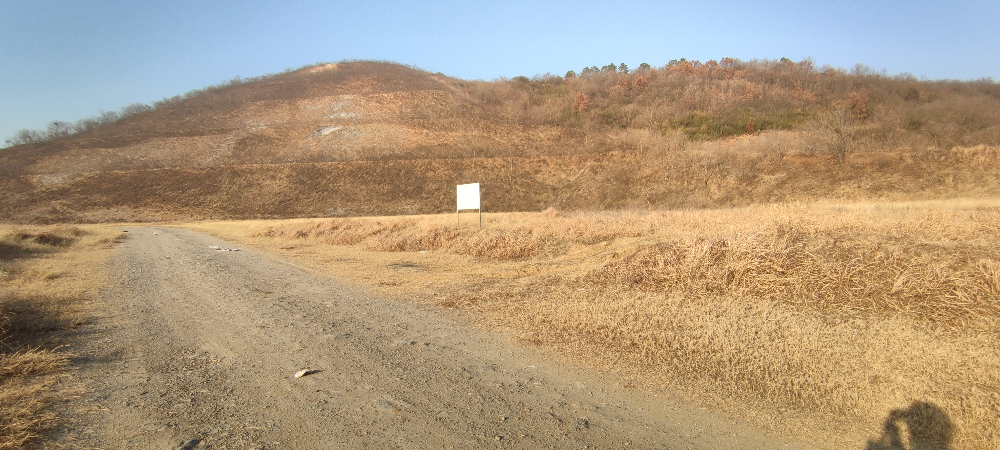
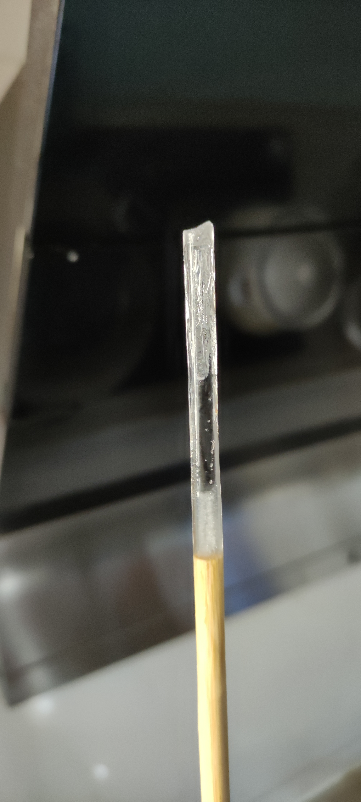

- 原名“城会玩”
	- # 同志，你疑似有点太城~~市~~尸化了，得改一改，不然以后得吃大亏！
- 娱乐化、渐进、参考考古和仿生的运动
- 为什么现代人类社会（差不多）总是培养不出不用手机电脑等电子设备也能玩得很开心的（成年）公民？（仿“钱学森之问”）
  id:: 66ade373-450c-4d5b-994b-c3d13b8dfef8
	- 只有手机电脑，不会加上家长不让花他们的钱网购玩具——所以只会玩手机电脑游戏（？）
	- 玩手机电脑游戏“隐性剥夺”了其他乐趣
- ---
- 动力
	- “占便宜感”
	- ((68eb464b-434c-4438-bb86-d41a57add8d6))
- 顺序改为货币成本与年龄解锁
- 已有人体、基本生活资料的
  collapsed:: true
	- 人体
		- ((668ce77c-0ab6-4a03-afd8-39b2b536a767))
			- “有音乐会抖得更带感些”
		- ((67b2c100-6085-4e92-8cb6-7c0b24e7acfb))
		- ((68eb464f-191b-4bc6-8a87-1cc73a546efc))
			- “没做过不好意思？有外人时你也不一定做其他几项”
		- “本能运动”：MovNat、动物流（以及类似的五禽戏、形意十二形等；“我没说是人类的本能”）等
		  id:: 669c6f67-0fd0-4881-8731-a69e27ccc6ef
		  collapsed:: true
			- 这些几年前就听说过，但也是没怎么学过
			- 用城市化的器械也可以做到
			- MovNat
			  id:: 669c6f67-daa4-4d38-8f0c-1bbae5c3dab1
			  collapsed:: true
				- “Move Naturally——这下看懂了”
				- [The Practice of Natural Movement | Erwan Le Corre | download on Z-Library](https://zh.1lib.sk/book/3698979/c520b4/the-practice-of-natural-movement.html)
				  id:: 669c5360-5d03-431f-929e-7e301238fbfa
					- 看得出来学/融合的同行挺多，但提及的同行不多——当然（我了解的人更是不多，比如较多提及的Gray Cook），前半句似乎至少能保证这疑似基于一部分“演化想象”的运动体系的“实际效果”并不差
					- 标志性器材：“树枝（branch）666”
					- 器材用得比动物流多？
					- 协作劳动（抛掷传递重物）
					- 功能，我们需要怎样的功能？坐在电脑前的功能？那么从具体应用场景出发寻找可能比较低效？
					- 专项运动在实用性上的低效，跑步等
				- [How to Incorporate Natural Movement with other Training Modalities - MovNat: Natural Movement Fitness](https://www.movnat.com/how-to-incorporate-natural-movement-with-other-training-modalities/)
					- https://www.movnat.com/wp-content/uploads/2019/11/movnat_tree_graphic_diagram_progression.jpg
					- >Next, it’s **very important** that you “snack” movement throughout the day (check out #movnatsnacks for inspiration). This is literally 1-5 minutes of Natural Movement at a time.
					  It may not seem like much, but even 1 min x 8 times per day x 7 days per week x 365 days per year = 2912 min. That’s just over 48 hours of movement. See how it adds up?
					  Your body will collect the goodness!
				- [MovNat日常活动度训练_哔哩哔哩_bilibili](https://www.bilibili.com/video/BV15o4y1F7F5)
				- [自然训练 MovNat Follow Along Mobility Practice_哔哩哔哩_bilibili](https://www.bilibili.com/video/BV1Lp411d7nD)
				- [人类的143个本能动作_哔哩哔哩_bilibili](https://www.bilibili.com/video/BV1Hp4y1y7RE)（每天学10个，半个月至少学一遍，学5个，一个月至少学一遍）
				- ---
				- TODO “中华本格自然运动”
				  id:: 68980f92-01eb-42a3-b7c9-27c36a287b74
					- ((6895e1b7-9fed-444c-8c7b-4583c7e248bf))
						- “什么？你那地方的农夫行走没有挑扁担的？！”
						- “铁山靠”
			- 动物流
			  id:: 669cbc36-9074-4845-bfa3-6ff029b783d9
				- ((669c5036-3c66-4948-a9b8-3608ba6c591d))
			- ((668ce769-d3b9-40f9-b221-e02732d24960))
	- 衣物
		- ((68f9d4ba-0cbf-4371-9373-a985598a69c9))
	- 被子、合适的光照
		- ((679b7f52-1201-48ab-b770-49cff906fd71))
	- [[眼]]
		- 看不见
		  id:: 66a5b9e2-d42f-4abd-9a98-f314dced68aa
			- 交通时不要乱来
			- 往往显著增加平衡类运动的难度
			- [《超越百岁》配套动作——闭眼平衡（中字）_哔哩哔哩_bilibili](https://www.bilibili.com/video/BV1GgGNeREcm)（相比单脚独立，可能更切近实际走路时的步态）
			  id:: 66a740b6-6a8f-400b-b108-88b0501c1deb
			- ((668ce775-74f3-40d3-91ca-3519a9f34cc3))
			- 关灯
				- ((66a4274c-5ef3-4e6a-a3d0-326b227804e0))
				- 黑暗环境捉迷藏、做爱等
	- ---
	- 虫、室内户外活动空间
	  collapsed:: true
		- 捕虫
			- ((67402ac8-ed94-44e2-95e2-add3e05a33ec))
			  id:: 66db8ab0-e6de-49e9-a137-36d56f80f7b9
				- 有可能抓活的，但捕获虫尸也是捕虫
				- ((665d508b-0c4f-4258-b349-288ac0fb6c3b))
				  id:: 66335be1-04ad-4195-8e80-e1e23b14bfdc
				- 灭蝇拍（疑似不太流行了）
					- [通背拳 掸手打苍蝇_哔哩哔哩_bilibili](https://www.bilibili.com/video/BV1s2421Z7ks)
					  id:: 66a484a5-d044-4627-acf5-f7c6a3d0a63e
			- ((65ab10fa-1fe3-4ff0-a931-bcfd92e35518))
			- [[蟋蟀]]
	- 植物、室内户外活动空间
	  collapsed:: true
		- 采摘
			- 摘花
			- 摘枇杷等果实（可能用到长杆工具）
	- ---
	- ((66a05623-8b2f-4158-ac53-a79988d92f76))
		- “反正对于我可遇不可求”
	- “疯狂！”
		- 不要压抑或许被认为是神秘古怪的生命冲动/激情，冲动来了，兴奋了，兴冲冲了，一定要（首先注意安全）跟随行动释放！
		  collapsed:: true
			- ((668ce769-8356-44bf-b6a9-3a96f41726f5))
			- 甚至为了效率，你需要有意识地坚持与你目前的生活模式闹别扭！
				- [[魔怔人心态构件大品评]]
			- “阿克曼！”
			- （尤其在美妙[[音乐]]、“好消息”、睡眠充足等的加持下，）你也可以相对很自然地打出类似“松裹（一说是“活”，但我认为结合[[筋膜]]等作答，“裹”也是对的）弹抖闪电鞭”的“自发动功” [[20241212]]
				- ((668b545f-f4d5-464f-abd3-3668e5575131))
				- [Irgendwie, Irgendwo, Irgendwann - song by Jiyagi, Kontrollverlust | Spotify](https://open.spotify.com/track/1W4YaZtgtVXTGuPBLO3DIv?si=17b97335c1714b19)
				  id:: 675a6766-af16-4d32-a1cd-b23bede4824d
				- ((67402ac7-b47d-4e14-8517-3fa578246ca8))
		- 但，不在争强好胜者（很多儿童）视野内展示请勿模仿行为
- 玩伴（不一定是人）
	- 潜行越过障碍（绿化灌木）吓喜欢这样玩的动物（不推荐对鸟这样做，因为鸟一般不认为这是玩，这样做影响鸟对人的信任）
	- 捉迷藏
	  id:: 678b0495-560b-48f8-9cfb-bce76331e388
	  collapsed:: true
		- ((65dc970c-1b17-4f72-a2de-b6d29de4e642))
		- ((67ad9459-6eed-481e-ab64-5c0cb376dd27))
		- ((669c5ce6-7c5a-4555-97af-450f69f29914))
		- ((672efebd-64e3-492d-ad82-be03144cc448))
		- ((67ca9702-4007-4262-ac74-dac451247f8e))
		- ((64f09e1b-e5b5-4054-b9d9-bf1f6d125fc8))
		- [如何训练狗玩捉迷藏？ - 知乎](https://www.zhihu.com/question/36390148)
		  id:: 68a69d78-23fb-4a94-bba7-ec93c1ce719a
	- 我倒
	  id:: 669bb5c3-9e95-4ce0-88fb-fbca6442c263
	  collapsed:: true
		- ((66a7918b-aa4f-4cbb-9b22-4e26cc3b3571))
		- 打水仗（开放水体、公共浴池、泳池、水上游乐园等；人多了就不好玩了——“人多了就不好玩了？”）
			- ((669a2ce4-326a-430c-8fab-7a258820b141))
		- ((65e5bb8d-9564-489f-8ef7-358cacef502d))游戏
		  id:: 65e5bd77-c4cc-4607-b739-b8c3ab85391f
		- 臀打（传武利用整体结构的一种打法，但此处指互相撞屁股）
			- [竞女第01集在线免费观看 - 日本动漫 - 樱花动漫](https://www.yhdm9.cc/bofang/3477-1-1.html)（“我跟我亲戚讲‘动画锻炼’，然后他告诉我的”）
		- 摔跤
		  id:: 66dac322-f9b9-4471-ade2-24c606e71a1f
			- [「sportscenter」腿摔跤（很好玩的样子）_哔哩哔哩_bilibili](https://www.bilibili.com/video/BV1Wm421g72T)
			  id:: 66ade373-e57e-4243-a4ed-3f021c98ee8f
			- ((68eb464f-d7d5-4b55-8122-3f40695d8f78))
	- [【校园生活】让你爱上校园生活的中二游戏大盘点：不用手机不充钱，一样可以玩得尽兴_哔哩哔哩_bilibili](https://www.bilibili.com/video/BV1Dq4y1Z7z1)
	  id:: 67402ab4-820a-4156-9fa2-d7a4d4c82d8e
	  collapsed:: true
		- 踢塑料瓶盖
		  id:: 68fa373e-8140-42b0-9187-65877d06c2b9
		- 传踢毽子
		- 纸上坦克大战
		  id:: 68fa39d8-87e7-4322-a077-cdec6a6e95f9
		- 转尺子、橡皮等文具互相压、击飞
		- 翘签
		- ((68919d41-82c5-4b2c-bf9a-d4c464375124))
		- 纸上RPG
		  id:: 68fad0d4-4fec-4153-821e-475f84080c49
		- 扔、接沙包
		  id:: 68fad138-3953-4df2-8081-1817442c12ac
		- 防盗门磁球吸特乐
		  id:: 68fad258-437f-452f-a726-6e6dc8980e54
		- 胶带纸足球
		  id:: 68fad3d8-65f7-4339-bff4-6f3f6bc9fe08
			- id:: 68fc093c-1955-4514-a6b4-213fa17d95eb
			  >我们用橡皮筋缠在纸外面再包胶带——弹幕
		- 踢塑料饮料瓶
		  id:: 68fad59c-77ec-410a-a66c-280794148e8a
		- 躲避沙包
		  id:: 68fad668-ff00-4a8f-ae89-7b6dcec8ae50
		- 比谁写作业快
		  id:: 68fad743-12c3-4f96-86f1-cb307014cab7
		- 转书
	- 背儿童
	  id:: 668ce77a-d196-422c-ba6f-b0e862fe55a1
	- ---
	- [[OUTSIDE]]
- 可能需要花钱或找玩伴凑的材料
  collapsed:: true
	- ((68eb467e-0fce-443e-b359-226a1b2aca82))
	  collapsed:: true
		- 手插进谷物堆（“吃米、逛超市的朋友们这辈子有了”）
	- [[绘画]]
	  id:: 67cede84-d9c1-4b3a-b933-0190960d2b10
	- ((67e26e9f-f287-4cd3-a2ea-ee5bf0065ed1))
	  collapsed:: true
		- 拼图
		  id:: 679add38-a1b8-4e4d-9d5b-9ae2f1a61d90
			- 不必用卡的那种，直接裁、撕的也能玩
			- TODO 双面拼图
			  id:: 68fc2c97-1669-4d33-a1bb-b6c8435850dc
				- 看[植青俱乐部青年生存指南｜第一集_哔哩哔哩_bilibili](https://www.bilibili.com/video/BV1pqWyzuEKd/)看的
				- “玩法？意义？”
					- 隔着玻璃等透明物体拼
						- ((688b2827-b048-4a53-93fe-d30b349beb2d))
						- 增加 ((66db8af3-f59e-48e2-94c1-e2582a474fb3)) 交流
							- ~~“这下小鹿要创死了”~~
							- “隔音玻璃”
						- 预制格子（降低难度）
					- “不都是好拼图”
						- 有的是单面
							- 有的拼不成双面
							- “可以由对面的人拼这面的”（“我是懂分手拼图的”）
						- 有的空白
							- “单胜（身、剩）结局”
			- 七巧板
				- [让传统冲破维度，七巧板三维计划。时光玲珑，莫使空空。 - 摩点 - 发现新奇好物](https://zhongchou.modian.com/item/113729.html?_ga=2.39842016.2136559758.1630587220-336020074.1622701208)
			- 碎纸机拼图
				- [电影中「将碎纸机吐出的碎片拼接起来找线索」的情节在现实中可能吗？ - 知乎](https://www.zhihu.com/question/20101964)
	- 积木
	  id:: 67c2ceeb-1f73-4f73-94e5-8f1278d6bd1e
	  collapsed:: true
		- 乐高积木
			- ((67cf91e9-87e1-4147-983a-ed7c0fac84d3))
			- ((68257079-8209-4335-ad5e-93bb113c10f2))
		- ((67e9f6f4-7140-4cc4-a499-6ad3cd4c3ade))
	- 食物、餐具
	  collapsed:: true
		- [[饮食游戏]]
			- 多动嘴少动手
				- 用牙剥[[烤红薯]]、芋头仔、虾、蛋壳
				  id:: 67983ba0-6b97-4320-a698-d612ff7af3cc
			- ((679adce7-c52a-4fbf-bf49-f164ccda7cf5))
			  id:: 65cc3677-9630-453a-b4db-07ad47f74d91
				- 在室内跑酷时，注意避免将餐桌上的物体坠落或桌垫拉动（进而造成其他物体坠落）
				- 上桌
				- 钻桌
				  id:: 669c5ce6-7c5a-4555-97af-450f69f29914
		- ((67402ab3-4c34-4b3a-9ad3-cef7e0f65c15))
	- ((665451b6-348a-45c3-bd9c-4fd39c289825))
	- 麦克风、话筒
	  collapsed:: true
		- 唱歌
		  id:: 67a48d08-5aa2-4bc6-bbfc-52436be072a6
			- 去KTV的话，可能的危害有空气污染、声响过大等，自娱自乐（很多人可能只是到了特定场所才会开始试探自己的声音在各方面的极限）、全情投入、载歌载舞（跳舞也可以学）等一般也在曲库、听众至少两方面受限。
			- 准备一个最爱的歌单平时唱唱，点歌可能用到。各个时代的中外金曲一般能找到，唱着可能相当好玩。平时可以专门找些这样的歌单听听唱唱。
			- 如果KTV没喜欢的歌，那可以过去学歌，别人唱什么觉得还好（又不能玩手机）就跟着简单唱唱，音色先不管（开原唱，别人可能没听过这么好听的歌），只要乐感不太差，总能得到进步，节奏、音高对了，机器评判分数不会低，而别人可能也不一定听得明白，看分数觉得厉害就完事了。
	- 解压
	  collapsed:: true
		- （“因为不方便或没法玩别的？”）
		- 呐喊
			- “被反甲、赔偿、教养等剥夺了肢体暴力权的可怜现代人这一块”
			- 车里大喊（“车载音响”罢了）
				- 一般场景隔音够吗？（“玻璃能隔什么音？”）
		- 转笔
			- 并行不悖的另一套秩序
		- 破坏
			- ((678b0495-475a-4e76-8113-13e0f220b673))
				- “每一个相同的囚室的破开都激励关心小事的行动者继续，即便最好的结果不过是解放了少量空气使它们回归大气圈， ((68eb467a-3720-48d9-b904-f2dc8303c4a0)) 可以高效得多地达成大致相同的目的”
	- ---
	- TODO （薯片）罐（伞）绳传声筒
	- [[陀螺]]
	  id:: 62a870bf-e7b0-4e08-8250-71a4df91590b
	- 棋牌
	  id:: 68eb46db-efe9-4052-a5dc-ea4a38707abe
	  collapsed:: true
		- ((67be68d7-df43-43e3-ba11-16f1e15cd4f1))
		- 可玩相应的电子游戏快速学习
		- 棋和牌的不同
			- 棋
				- 围棋是黑白陶器，象棋是汉字木刻，西洋棋是立体木雕（也许是字母难以缩写一一对应），抽象度依次增加
				- 棋似乎更耐用？
				- 棋似乎大多有专门的跑道
					- 经纬线和经纬格子
				- 飞行棋、军棋、大富翁（纸质棋）
				- [为什么西洋棋（以国际象棋为例）的棋子大多做的立体而东方棋（以围棋象棋为例）的棋子大多偏于平面扁圆呢？ - 知乎](https://www.zhihu.com/question/344355442)
					- [为什么国际象棋有三维立体棋盘 （棋盘是三层的或者更多），而中国象棋则没有？ - 知乎](https://www.zhihu.com/question/22657641)
				- 大棋论
					- 下大棋是为了避免小棋独走，是为了让棋子认同自己在这一个棋盘上，什么时候棋子脱离棋手控制了？
				- ---
				- 象棋
					- ((6871c74a-fc0d-4ffc-a573-6e31d39d76a5))
				- 围棋
					- 三维围棋
						- [三维围棋可行吗？难度有多大？ - 知乎](https://www.zhihu.com/question/22760554)
			- 牌
				- 麻将虽然很像棋。但没跑道
					- [春节打牌发现问题：麻将里的一条为什么不是“条”而是一只小鸟？](https://mp.weixin.qq.com/s/cEfDjQHSf-yFP4Gm2J2JXw)
				- 卡牌除了移动点数、方式、克制关系外还带更多东西，如生命值、武力值，这不是普通棋做得到的，需要印刷、喷墨打印，扑克牌，丰富卡牌更特化，需要较复杂的计算电子卡牌需要
		- 比较
			- 容器方面，棋有棋盘，牌有牌桌。
			- 外形方面，则是根据实际需要来，并不一定是块状的都是棋，纸片状的都是牌，如麻将。
			- 信息对称性方面，整体上，棋偏向“明”、程序公平，牌偏向“暗”、“手气”随机——“洗牌”。
			- 牌型与规则的关系方面，长辈们一般玩扑克牌，牌型固定，各种规则赋予每张牌不同的角色，年轻人一般玩各种有故事的“桌游”（如果包括手机电脑上的，那就是联机或回合制换人玩），游戏王、三国杀等有描述的，则是规则寓于牌型且相对固定。
			- 牌的玩法方面，掼蛋等不懂就问两三局半小时左右就基本可以上手了。
		- 扑克牌
			- 洗牌
				- 熟能生巧，装牌时容易顶到对面封口的先于整体放入
			- 掼蛋
				- 规则
					- 红桃逢人配
				- 记牌（很重要）
				- 牌可能被心急牌友搞乱（两副牌掼蛋，有时四副牌会混起来）
	- 宠物
	  collapsed:: true
		- 发酵
			- ((68cd4358-1634-4a9a-ac70-7b00faaba3cb))
		- [[猫]]
		  id:: 65d55d4f-a43a-4cb2-9d63-f31265900cb7
		  collapsed:: true
			- “今天爱猫，明天爱人”
			- TODO （室内）远程逗室内猫
			  id:: 67a07513-81ff-4975-916b-e1a4991025fe
				- 又看到对面楼的 ((679add8d-629e-407d-8f25-9229ff284f84)) ，在阳台落地窗边小凳上朝外四处张望，主要看地，或许还是在“观鸟”，我挥一挥手，它没看过来——“关爱空巢哈基米，哈基人义不容辞”
				  id:: 67a07516-9b62-4eeb-bcd4-796f2071686d
				- 比如使用（索道遥控；靠近可以解锁更多俯角）激光笔逗猫，然后如果主人发现了（除了“登门拜访”、“隔空对喊”外）可以用[[直接光通讯]]解除或扩大误会——“手工耿不住这么相对高密度高楼层的方式，怕是想不到这么美吧？”
			- 猫抓板
				- 麻绳，瓦楞纸板，哪个更适合猫抓？
				- 麻绳种类
					- {{embed ((65f682d3-0e3f-4865-ad3d-9161297b82b1))}}
				- ((67db5f48-5ce4-4ef8-a12c-598296da2d36))
			- 逗猫杆
			  id:: 678a4de6-6845-42ae-9ac6-43f369d9ca9c
				- “钓猫”
				- [猫 格 分 裂_哔哩哔哩_bilibili](https://www.bilibili.com/video/BV1Dy4y1H7ZD)
			- （逗猫）软球
			  id:: 65d9feda-f198-4a75-b00b-ef0dc182e1f8
			  :LOGBOOK:
			  CLOCK: [2024-02-24 Sat 22:37:50]--[2025-02-10 Mon 15:42:15] =>  8441:04:25
			  :END:
				- 彩色球比单色球在滚动时对猫更有吸引力？
				- 球垂直运动多些（上抛多些）可以减少猫为了靠进球而运动的距离和时间，使猫在靠近球后球仍能继续运动较长时间，且更易延长猫的关注时间和捕获球的概率，还可能让猫自己推开球再运动一段
				- 手抛
					- 抛/扔到猫附近，且垂直方向要有弹跳，水平方向速度不能太快
					- 有多个球可以一起拿着，等一个让猫玩完了再扔下一个
				- 和猫一起踢（小）足球
				  id:: 65d9e7ea-4967-4270-bc94-608c799c96c9
					- 铲球
					- 避免击中猫头
				- “往多只猫之间扔”
				  id:: 65eade12-ac5c-485b-a203-e275fc9503ed
				- （毛绒小熊头）上抛到正在捕猎练习状态的猫身边吓她一跳
				  id:: 65eb1aab-22fa-4e8c-af83-49877a71c733
			- 激光逗猫
			  id:: 679088c4-abc6-4046-a285-4ba35e52feca
				- [激光制导捣蛋_哔哩哔哩_bilibili](https://www.bilibili.com/video/BV1R1421b7rr)
				- [把激光笔装在猫咪头上，作孽啊_哔哩哔哩_bilibili](https://www.bilibili.com/video/BV1xs411C7yn)
			- ((65d55b64-52c2-439a-88d5-7fd8597ca8e8))
			  id:: 65d55d55-b1f9-4393-be08-fa46ac293633
				- 踩上去“喵喵”响
				- 可以需要从高处比如桌面跳下才足够触发
			- 脚踏逗猫（“抖腿逗猫两不误”）
			- （沙发）猫滑梯
			  id:: 65d83577-d2fb-48cc-8339-f465051ad449
			- 猫秋千
			- 躲猫猫
			  id:: 65dc970c-1b17-4f72-a2de-b6d29de4e642
				- “这下真躲猫猫了”
				- 夜间关灯可能更好玩
				- “坏了，白天也让它躲赢了”
				  id:: 65ded228-670d-4415-a554-946ee8836c1f
				- “互相躲，互相跑酷找是吧？”
			- TODO 逗猫、遛猫轨道
			  id:: 681581ec-2db9-4235-8931-3224756e5ea2
				- ((67da628d-4208-43f7-b269-523a8d1e4697))
				- ((678a4de6-6845-42ae-9ac6-43f369d9ca9c))
				- ((68065839-e032-475a-aabb-20860a9194bb))
		- id:: 66127692-a109-4080-b0c2-d0be7851cd28
		  >我觉得对宠物可以有三个角度：认识公共宠物（动物园、观鸟，可以再延伸到其他议题上），拿宠物训练（“猫爬”、当力量训练负重），训练宠物（垄断度较低、更易接近现实的动物社会运行模式的知识）
			- >重要的是一定是狗和鸟跟人打配合最密切
			  >左牵黄右擎苍，老哥们争取哪天也去试下
				- >做野生动物救助最有可能
		- “在家坐久了起来撸撸[[猫]]狗”
		- ((65e9c3f1-211d-4363-b9d3-e7fed2fd368c))
			- 没有猫也可以像猫追猫那样人追人
		- ((65fa768e-013a-42ec-b13f-7eabd9ea1b6f))
		- ((660a4631-86b6-43cd-bc16-da7144800acf))
			- ((66a21d83-fbb1-479e-8cc8-13501ac4c017))
	- ((66db8aba-f3b7-4ad1-be8f-cfddb29578b9))
	  collapsed:: true
		- “工作前先不整理家里物品”
	- ((66db8ac0-f2ef-47bb-8224-9492c1d93c5f))
	  collapsed:: true
		- ((668ce730-193d-4c94-9804-36e87e7abdf9))
		- 躲 ((66db8aba-f3b7-4ad1-be8f-cfddb29578b9))
		- 跳舞毯
		  id:: 65d55b64-52c2-439a-88d5-7fd8597ca8e8
			- [用跳舞毯和手柄同时击败两个女武神！《艾尔登法环》终极挑战](https://www.bilibili.com/video/BV1yR4y1m7WX)
	- ---
	- 相对危险的
		- ((68fb641b-fe6d-4ad2-9962-024afb363300))
		- “养臭水”
		  id:: 68cd4358-1634-4a9a-ac70-7b00faaba3cb
			- [养臭水_百度百科](https://baike.baidu.com/item/%E5%85%BB%E8%87%AD%E6%B0%B4/64492701)
			- [【鉴定热门】中学生流行养“臭水”到底有多危险？每天吃7分饱能让你多活30年？_哔哩哔哩_bilibili](https://www.bilibili.com/video/av1555678392/)
		- 嬉戏追逐打闹
		  collapsed:: true
			- 场地不合适
			- 无目的瞎跑
			- “没轻没重”
				- 不要以为只有不少小孩会，一部分“难以预测”、“布朗运动”的成人也会，在这个现代残疾社会应该并不鲜见
				- 比如我在餐馆吃饭吃了一个多小时看暂时没啥菜就站起来走走，同时示意经常这么做的我妈也起来，可能因为当时我正好想到在记flomo没注意，加上我妈拉胯，预判和控制能力有限，结果踢到我膝盖，她还说她踢的是小腿——还好是相对完好的一块，而且我妈的力量也相对有限
				- 骑一辆车头盔后顶
		- [[游乐设施]]
		- 烟花爆竹
		  id:: 679add38-cb27-4676-8960-570eeab43984
		  collapsed:: true
			- ((68c4d098-6682-4931-a89a-753c2631df88))
			- “我觉得春节是一场战争，你认为呢？”
			- “元宵节deadline未爆品集中销毁”
			  collapsed:: true
			- 玩法
				- [见过民间狠人放炮，才懂什么叫疯狂](https://mp.weixin.qq.com/s/g70gn6kGclFNb_4wjsItRw)
				  id:: 67962113-adc2-4d7f-bf6a-23fcc0c5aa2a
				- [村际弹道导弹，三级点火！春节放炮骚操作TOP10盘点！](https://mp.weixin.qq.com/s/-mpnLi8Ol121-X__o5tpAQ)
				  id:: 67996c0d-7639-4759-b892-3310b8d19a6f
				- TODO “烟花爆竹wargame冬训”（“爆”）
				  id:: 65c9caf1-c2a3-4ece-acc2-e3d3a116feff
				  collapsed:: true
					- “这与常规wargame比有啥突出的优势？”
					- 法律风险？
						- 模仿（但没模仿全）风险
					- 防护
						- [杭州一医院除夕夜接诊16位烟花爆竹伤患者：有人眼睛被炸4个洞_腾讯新闻](https://new.qq.com/rain/a/20240211A04ADN00)（包括“纯路人”）
						- “这样一来，玩的话至少应该会戴手套、头盔、防毒面罩”——“经典曲线安全”
						- 爆炸防护
							- 相对安全的姿势
								- [春节放烟花心得【生存狂吧】_百度贴吧](https://tieba.baidu.com/p/8896797609)
								  id:: 65cd6859-2dbd-4b88-a4eb-e923959f12f1
									- >我们本地的杨家埠木板年画上，反映过年的年画，出过典型教程：侧身，侧脸，斜眼，余光，看着点引信，至少能保证不糊脸上。
							- 测得最长安全脱手时间
							- 小装药爆竹
								- “可以纯玩小金鱼，但可能是集束的那种”
							- 至少戴大镜片半盔+厚头套
							- 如何与外凸的防毒面罩戴到一起？
							- 配重块，扔得快、远的同时避免（点燃擦炮后在掐秒扔雷时）意外直接在手上爆炸
						- 爆炸噪声防护
							- 3/4盔、全盔
							- 或者，隔音耳塞、耳罩
								- 主动降噪耳机会否降噪过度？
						- ((66db8abb-050c-4368-a0bf-4035b0528285))
					- 计分、淘汰方式
					- 炮种
						- 冷烟花
							- 夜战照明、报点和敌我识别？
						- 摔炮
							- 砂炮（“拜个早年”）
							  id:: 644b817a-05b6-4ece-bede-e3f9fb9cb620
								- 小金鱼、大鲨鱼
								- [小金鱼摔炮原理是什么？ - 知乎](https://www.zhihu.com/question/267244440)
							- [发明项目：摔炮子弹 发明人：肺雾初中生_哔哩哔哩_bilibili](https://www.bilibili.com/video/BV15zPKeLEZy/)
							  id:: 67cf91c7-f0ed-43bc-87c3-8cf64f6ea347
						- 拉炮（“大约的确是没得卖了”）
						  id:: 65bcbf68-8216-4e2d-8d83-0ac3db753007
							- “绊线地雷”
								- 大约能用摔炮、擦炮等改
							- [DIY露营狩猎警报器【生存狂吧】_百度贴吧](https://tieba.baidu.com/p/1333060574)
					- （最好可复用的）固定机构
					- 点燃方式
						- ((65cd6859-2dbd-4b88-a4eb-e923959f12f1))
							- 打火机
							  id:: 68eb4666-bc08-45ed-8e03-b0f3cb4966c2
							- >小时候放烟花大人都是用香烟点的，小孩则是拿一截蚊香。
						- 禁打火机局（“钱扣七百多，打火机也没了”）
						  id:: 67402ab4-1445-4a93-9864-cca136b63a1d
						- 集束大擦板
					- 其他玩法
						- 比谁扔得远、准
							- 放飞镖、飞针尖端前或后（“穿甲弹！”）
						- 球拍弹雷（“轮盘赌”）
						- 炸物体（炸破气球、炸倒塑料瓶；投掷、弹弓）
						- ((670d40d6-18fe-4e48-8952-f1dd059b32ac))
							- [飞盘式擦炮助投器_哔哩哔哩_bilibili](https://www.bilibili.com/video/BV1N1NBesECz)
						- [[弹弓]]
							- TODO 弹弓砂炮兜（防捏爆）
							  id:: 67996c52-56c4-4136-a40a-3415881066b3
								- 年夜饭餐桌上看到砂炮想的
							- TODO 速射砂炮弹弓
							  id:: 67aac87e-3da8-4cbf-bc5a-41098b594adf
								- ((677a650b-68f3-4e99-80ab-bfed0dfc220e))
							- “‘一生二，二生三，三生万物’，再接下来是区别于‘打火机集束’的人力全自动，然后是更多品种，弹弓、烟花爆竹、玻璃、家纺、家具、家电等的厂家、销售和装修工人狂喜，医院、消防、学校巨忙，保险巨亏，弹弓、烟花爆竹被严管，我也可能被请去喝茶，本网站也可能永久关闭，人类暂时躲过一位活阎王”
						- 穿甲弹
							- 杠杆压爆砂炮
				- ((67fe15d3-9bf2-4018-b8d1-6fe25e2028b1)) （“并非玩法”）
				  id:: 67fe15df-4f8a-4ada-8759-19b964f1af80
				- [初八了，祝大家开工大吉，来个版的简易版铁树新花给大家助助兴_哔哩哔哩_bilibili](https://www.bilibili.com/video/BV1nAP2eAEQt/)
				  id:: 685fd6e7-1466-43ed-9886-82055334ff30
				- [我在身上绑了3600根火药！点燃之后真的很炸！_哔哩哔哩_bilibili](https://www.bilibili.com/video/BV1jXKqzPE1Z/)
			- [中国烟花是怎么占领全世界的？](https://mp.weixin.qq.com/s/pVkuS_v3SbyaqkczIQ_Hvg)
			  id:: 679a11a3-0597-496b-8ff2-fe01c56e928f
			- 危险燃放烟花爆竹
			  id:: 679ac2bb-8ea3-4602-81a3-cba437be4339
			  collapsed:: true
				- [奶奶把烟花当香烧了_哔哩哔哩_bilibili](https://www.bilibili.com/video/BV1wz4y1T7Yq)
				  id:: 678b0495-497b-4797-953d-8b5542c89eb2
				- [起火、燃烧、爆裂！随意燃放烟花爆竹后果惨不忍睹！](https://mp.weixin.qq.com/s/SbzXwnr2cubefGevo7Rnrg)
				  id:: 679ac226-ca25-4352-ae50-008f1d785200
				- [轰！孩子鞭炮炸井盖致路面地下管线彻底炸毁+百万豪车炸翻！](https://mp.weixin.qq.com/s/8rcxJDaGQA0nt3aS8wWLIA)
				  id:: 679bffea-ea65-4cc6-ac1b-447383ed560a
			- 加长引线
			  collapsed:: true
				- ((67fe15df-4f8a-4ada-8759-19b964f1af80))
	- 上下班
		- ((66095541-fd54-4170-8d30-9141b2aa3f70))
	- 宠物
	- 开车
		- ((66975f62-8787-470c-ba2d-152fc023c7eb))
	- 狩猎、采集
		- 山区打野猪（依托林业局的赏金猎人团队）
		- ((645076b5-bd28-455d-a136-bc7c416dca63))
	- [[手工]]
	- [[绳]]
	- [avant-lab.com](http://www.avant-lab.com/)
	- ((673ec846-6415-4aae-9850-7882079b4ee7))
	  id:: 679adcca-384e-4bcc-821f-10e87b5886af
	- 高级
		- 多米诺骨牌
		  id:: 67cf9178-8395-4292-b3f9-80e3ec66c436
		  collapsed:: true
			- [人体多米诺，场面极度沙雕_哔哩哔哩_bilibili](https://www.bilibili.com/video/BV1o4411c7zz/)
			  id:: 67cf90ed-6afd-473f-ad44-e043ef802c77
			- 复位
				- [这不比全自动功德机好玩？_哔哩哔哩_bilibili](https://www.bilibili.com/video/BV1q24y1q7Lt/)
				  id:: 67cf91e9-87e1-4147-983a-ed7c0fac84d3
		- 阿基米德圆规
		  id:: 67ab4b1b-918d-495c-a41e-10b9e85083cd
		  collapsed:: true
			- [不可思议的“阿基米德圆规”，每颗球都走直线！你知道原理吗？_哔哩哔哩_bilibili](https://www.bilibili.com/video/BV1Ng4y1179S)
	- “可食用玩具”
	  id:: 67402ac6-ff78-4d1e-ac73-b32a870649ef
		- ((678b04ab-d9ca-4686-a9f3-b48d04404b9f))
		- ((67303aa5-6610-40fc-8160-50387674b19d))
	- TODO 磁力“=”
	  id:: 68468a89-0c2e-4dfe-aad1-07061192fabd
	  collapsed:: true
		- 了解 [[CDDA]] 设定时想到剥离自然属性之外的很多元素层后——“美国也是差不多的地儿”——想到未明子的普遍主义，可能也有点像火柴人MC的方块法杖那种概念性武器，想到MLP的书记登场那集
		- 两横之间用磁力连接，在任何角度乃至速度下保持形状不变
	- 远程玩具
	  id:: 66335be4-7f61-4c0b-832e-7fc580f5c595
	  collapsed:: true
		- 投掷（“难以掷信”）
		  id:: 679add39-5e29-4d78-bb8e-17906721ae0e
		  collapsed:: true
			- 投掷运动（纸飞机、泡沫回旋飞机、扔纸团/垃圾/鸡蛋/诺基亚/三星、掼炮、飞镖、飞刀、飞牌、沙包、打雪仗、水气球、粘靶球、打水漂、打卡、保龄球、套圈、飞盘、手里剑、回旋镖、标枪、实心球、铁饼、飞石索、链球、手球、擦炮/燃烧瓶/手雷、投篮）
			- ((68c273cd-052b-4efb-8123-7aa965c87dd8))
			  collapsed:: true
			- ((670610f4-4f81-4b3a-b878-e7fbb7e82f6a))
			- TODO 闪光灯（？）招财猫投掷抓手
			  id:: 68779fac-5502-4c9b-bad7-afdbee2a7d2c
			- 织物
			  collapsed:: true
				- 手绢
					- 丢手绢
					  id:: 6815dcbc-faec-404d-b33a-0bf86aa45d01
						- id:: 6815dcbc-6801-447f-b496-3470b514a17e
						  >丢~啊丢~啊丢手绢~~
				- 枕头大战
				  id:: 66a76430-b3ea-41bd-99f5-9383096e508a
			- 沙包
			  id:: 68fad67c-665b-41a9-bf73-8ce7834c6c5b
				- ((68fad138-3953-4df2-8081-1817442c12ac))
				- ((68fad668-ff00-4a8f-ae89-7b6dcec8ae50))
			- 飞饼
			  id:: 67eb2843-32de-4806-aee5-e2bd5cec9cb5
			- [[垃圾袋]]
				- 丢进垃圾桶里面——“最日常的一集”
			- [保安用矿泉水瓶打掉马蜂窝，有0.5秒空气静止了。_哔哩哔哩_bilibili](https://www.bilibili.com/video/BV1z24y1N7tE)
			  collapsed:: true
			- 石头
				- 击中物体
				  collapsed:: true
					- ((678b04a5-4e20-437a-818e-324876bf76b5))
					- 记录
						-  [[20250117]]
						  id:: 67d27058-af2a-440a-bcae-21277f942ff9
							- 农村砾石路蛮多石子石头的
							- 可能15-20米，可能扔了有半小时以上，击中“警示牌”（含支撑杆；上面像是有bb弹压缩空气枪或气枪的弹坑，“警”字上的最多，“示”上的最少）4次，经常往左偏（想省力身体就不够后仰和右旋，投掷末段就会偏），其次就是不够高从“警示牌”下部穿过
				- 打水漂
				- 铁饼（古希腊罗马运动，但当时用的是扁圆石块）
				- 投石索
				  id:: 6865ed50-01b7-40ee-b677-026c5d329230
					- [全网最全投石索制作视频教程大合集 持续更新中_哔哩哔哩_bilibili](https://www.bilibili.com/video/BV14y4y1x7BT/)
					- [【原始技术】投石索（Minecraft真人版第十一弹）_哔哩哔哩_bilibili](https://www.bilibili.com/video/BV1zs411d78Y/)
				- 投石杖
			- 投矛器
			  id:: 67eb2843-5ff2-4be9-99ef-a16b348c23ba
				- 固定
			- 标枪
		- 球类
		  collapsed:: true
			- 杀伤球
				- ((68a69cd3-1485-4757-beca-24bb9c6bd33a))
				  id:: 67402ab4-f291-4eee-97f9-e6677c11fc58
			- 进球（“赢球”）
				- 迷宫球
				  id:: 66dba0ae-4bbe-4f70-8398-fe8edb032e2e
				- ---
				- 室内门球/足球
				  id:: 68eb4651-9769-47d2-91f4-4ca35c515e12
					- 倾倒纸箱作门？纸箱去掉一面改成门球门？猫狗等宠物的腿之间作活动的门？（“你礼貌吗？”）
				- ---
				- 保龄球
				- 冰壶
					- ((679f0f50-9b2f-4ce7-a1da-7d735ec9b34c)) 冰壶
						- 洗完碗，第三次倒平底炒锅里的水后，想着锅底最好别沾水，往外放了点，又觉得靠外不太安全，往里推了下，然后炒锅有点流畅地滑了几厘米
					- 平底锅冰壶
				- 台球
				  id:: 68a69ce6-712a-4101-9390-248bf5cb6800
				- 门球
				- 高尔夫球
				  id:: 67d27058-757c-47b5-b584-7b61eefd24cf
					- ((67fe82ff-b9d0-4029-9c42-b9ca3e69b2e2))
					- 高尔夫球童
					  id:: 67d009d0-8f5a-4d70-ab4e-04845f6ff4a8
						- [揭秘高尔夫行业“球童”这个职业的真相 - 知乎](https://zhuanlan.zhihu.com/p/570237344)
				- ---
				- 水球
				- 冰球
					- [北京室外冰场的平行空间，是连接1991和2001的神奇时空入口](https://new.qq.com/omn/20210219/20210219A04LCD00.html)
				- 橄榄球
				- 足球
				  id:: a1d8be49-a949-40c9-b41f-ac1d9de87ed8
					- “更多足球”
						- ((68fad3d8-65f7-4339-bff4-6f3f6bc9fe08))
						- ((68fad59c-77ec-410a-a66c-280794148e8a))
						- ((668ce77a-758e-409b-83b7-b640e203d535))
						- ((65d9feda-f198-4a75-b00b-ef0dc182e1f8))
					- ((664d9dd6-5f57-42b1-83b7-aa7031f03527))
					- 足球场大，能塞更多观众，拉动经济
					- [江苏沛县“村界杯”再度开赛，这次还能成网红吗？_哔哩哔哩_bilibili](https://www.bilibili.com/video/BV1fg4y1Y7Zy)
					- 中国足球
						- [范志毅：“中国足球脸都不要了！”](https://www.bilibili.com/video/BV1yx411L73B)
						  id:: a6efa660-72c0-4f6e-937b-f649e786d096
						- [万字长文揭露中国足球现状：国足还远没到谷底！2019旧文已预见今日结果！](https://mp.weixin.qq.com/s/4jwJaepPEQ4hIVC0XZRV6w)
						- 足球青训
						  id:: 67b132b1-7dde-4e7e-9fbd-55cc0cf6c229
						  collapsed:: true
							- 
					- [最长时间滑跪庆祝进球_哔哩哔哩_bilibili](https://www.bilibili.com/video/BV1Us411G7Lp/)
				- 篮球
					- [篮球风云WaveBall的个人空间-篮球风云WaveBall个人主页-哔哩哔哩视频](https://space.bilibili.com/335564074)
				- 手球
				- 板球
				- 棒球
					- [棒球棍实用防身技巧_哔哩哔哩_bilibili](https://www.bilibili.com/video/BV1RC4y1L7FM/)
					- 棒球插笔（？）
			- 接（不到）球（“输球”）
			  collapsed:: true
				- 粘靶抛接球
				  id:: 67cede84-d43d-4047-895c-efe252f14c5d
				- 挥拍
				  id:: 67fe0956-2669-4902-86d9-1838a6b32033
				  collapsed:: true
					- “不拍人体也是拍”
					- [Associations of specific types of sports and exercise with all-cause and cardiovascular-disease mortality: a cohort study of 80 306 British adults | British Journal of Sports Medicine](https://bjsm.bmj.com/content/51/10/812)
					  id:: 67fdbc16-0d6c-4bbc-abce-7f9184dc1715
						- [Swimming, aerobics, racquet sports slash risk of death | CNN](https://edition.cnn.com/2016/11/30/health/swimming-aerobics-racquet-sports-reduce-death-risk/index.html)
						- [排名第一的长寿运动竟是它！研究发现：这几种运动延寿效果好，你练对了吗？](https://mp.weixin.qq.com/s/sEktEoI1-A_231cZGanYqg)
						  id:: 67bd169c-fcc6-4bcf-97a9-0c763b905b16
							- “简中笑传之传错（出）版（社）”（看了几个网页全都说是柳叶刀，实际是BMJ）
					- ((66f4ac7f-846d-4a78-9f45-df4bf35d92e0))
					- ((6800e553-d969-4e1a-9e43-cecada76d31a))
					  id:: 6800e571-27d8-4073-901f-4ea07fc43ce7
					- ---
					- [打羽毛球和打网球有什么区别？ - 知乎](https://www.zhihu.com/question/296830891)
					- 羽毛球
					  id:: 67cede84-e9d8-44b2-8e83-a2700c7aae4c
					  collapsed:: true
						- ((679add8c-89dc-40f4-87e6-193d34de0306))
						- [Play Badminton Forever: A Systematic Review of Health Benefits - PMC](https://pmc.ncbi.nlm.nih.gov/articles/PMC9330062/)
						  id:: 67fdb8fb-1c99-4b9d-8ab2-3230acb46193
						  collapsed:: true
							- id:: 67fdc02f-0d7d-48e2-b674-a1161da85dfc
							  >缺乏活动的负面影响已得到广泛研究，结果表明，缺乏活动会导致学业成绩较差  [6 ]；心理健康状况较差，例如压力和焦虑程度较高  [7 , 8 , 9 , 10 , 11 ]；身体健康与冠心病风险增加相关  [12 , 13 ]；运动技能发展下降  [14 , 15 ]；以及失去改善社会关系的机会  [16 ]，等等。
							- id:: 67fe09cb-29aa-4fdd-ade6-f9a6df68c9c7
							  >Schnohr 等人  [42 ] 在一项针对青少年、成年和老年男女的研究中，比较了参与各种运动对预期寿命的影响。这些作者得出结论，与久坐不动的人相比，羽毛球运动员的预期寿命高出 6.2 年，是预期寿命获益第二大的运动项目（网球 9.7 年，羽毛球 6.2 年，足球 4.7 年，骑自行车 3.7 年，游泳 3.4 年等）。
								- [Sci-Hub | Various Leisure-Time Physical Activities Associated With Widely Divergent Life Expectancies:The Copenhagen City Heart Study. Mayo Clinic Proceedings | 10.1016/j.mayocp.2018.06.025](https://www.sci-hub.ru/10.1016/j.mayocp.2018.06.025)
								  id:: 67fe77c9-e4ea-4c7f-9c97-86b62c9029d4
									- [Mayo Clin Proc：爱打网球多活十年！科学家发现社交频繁的运动更有益于延长寿命-MedSci.cn](https://www.medsci.cn/article/show_article.do?id=ec9415655651)
									- >与久坐不动人群相比，不同运动项目的多变量调整预期寿命增长如下：网球，9.7 年；羽毛球，6.2 年；足球，4.7 年；骑自行车，3.7 年；游泳，3.4 年；慢跑，3.2 年；健美操，3.1 年；健身俱乐部活动，1.5 年。
										- “这个健身俱乐部活动大概指的是健身房相关器械活动，这下很难一丝一毫不想嘲讽了”
											- >By far the smallest improvement in life expectancy was noted in people who
											  predominantly did health club activities (eg, treadmill, elliptical, stair-climber, stationary bikes, and weightlifting). The large differences in life expectancy gains were not accounted for by the wide differences in duration of the various sports, as highlighted by the finding that the cohort of people who spent the most time exercising——health club activities group——was the one that showed the smallest improvement in longevity.
											- >Regarding health club activities, we were not able to separate the time spent on aerobic exercise or anaerobic exercise because these activities include treadmill, elliptical, stair-climber, stationary bikes, weightlifting, and so forth.
									- 调整后每周平均：网球104分钟，羽毛球93分钟
									- 论文的结论
										- 大学学历可能进一步降低网球爱好者的死亡率，而研究中网球组的大学学历率最高（48%；跑步组37%，其余最高为羽毛球组27%）
											- >When we restricted the analysis to only individuals with a university degree, the ranking of various sports according to HRs remained largely unchanged, although the 95% CIs were wider due to smaller numbers of individuals. In this subgroup analysis of only individuals with a university degree, tennis (HR, 0.26; 95% CI, 0.10-0.69) and badminton (HR, 0.46; 95% CI, 0.19-1.12) players had the lowest multivariable-adjusted risk of mortality compared with sedentary individuals.
									- 论文的讨论
										- 社会支持比运动强度更有性价比
											- 但运动种类仍很重要
												- >Low social network was a risk factor for all-cause mortality, but did not
												  attenuate the association between the different sports and mortality.
										- 间歇性大肌群、全身爆发运动和短重复间歇高强度运动比持续性（中等强度）运动好
										- 跑步者之中，轻度跑步者（每周2.5h以下，同时每周不超过三次）死亡率最低
										- id:: 67fe82ff-b9d0-4029-9c42-b9ca3e69b2e2
										  >Other studies show that golf is another sport that is associated with robust health ben-
										  efits.  One very large observational study found that playing golf on a regular basis improved life expectancy by about 5 years.
							- id:: 67fe6bd8-84a2-4fbd-8696-21a06761c1e6
							  >关于社交效益，Patterson 等人  [45 ] 发现，羽毛球运动提高了女性与朋友相处和建立新关系的积极性。
								- [Sci-Hub | The impact of badminton on health markers in untrained females. Journal of Sports Sciences, 35(11), 1098–1106 | 10.1080/02640414.2016.1210819](https://www.sci-hub.ru/10.1080/02640414.2016.1210819)
									- >The badminton programme was effective at increasing participants’ social engagement motives (i.e., affiliation) to exercise when compared with both the running group and the control group. This suggests that participants in the badminton programme increased their motivation to exercise to spend time with friends, they enjoyed the social aspects of playing badminton and had fun being active with friends and making new friends. This provides partial evidence that badminton can increase an individual’s social engagement motives to exercise and social engagement could be considered as a potential reason for people to join badminton groups, particularly for females. This has been shown in previous research on motives to exercise in adults (Allender et al., 2006), who concluded that enjoyment and social networks offered by sport and physical activity are clearly importantmotivators for many different groups of people aged between 18 and 50 years. Participating in exercise for social reasons is considered an intrinsic motive and is associated with better long-term adherence and behaviour change.
						- [BWF Research Projects – BWF Development](https://development.bwfbadminton.com/sport-science/bwf-research/bwf-research-projects)
						- [The Effect of Badminton in Myopia Progression Among Children in Yogyakarta | Ophthalmologica Indonesiana](https://ophthalmologica-indonesiana.com/index.php/journal/article/view/174)
						- [踢足球还是打羽毛球更有锻炼效果？ - 知乎](https://www.zhihu.com/question/376262839)
						- ---
						- [羽毛球场_百度百科](https://baike.baidu.com/item/%E7%BE%BD%E6%AF%9B%E7%90%83%E5%9C%BA/4977741)
						- 羽毛球拍
						  id:: 682dd3df-43c5-47f6-91fe-dc69049d8bc6
						- 羽毛球拍捡球夹
						  id:: 67fe0956-6ec0-4673-a4a7-0b61ddbbf24d
						- ---
						- [羽毛球快速提高技巧，绝对干货（建议收藏细看）](https://zhuanlan.zhihu.com/p/106296639)
						- [职业羽毛球运动员假动作赏析！论动作一致性的重要！_哔哩哔哩_bilibili](https://www.bilibili.com/video/BV1fdKHeiEtR/)
						- ---
						- [不会物理都不敢打羽毛球（完整版）_哔哩哔哩_bilibili](https://www.bilibili.com/video/BV1Rs411D7pf)
						- [全寝公开赛！_哔哩哔哩_bilibili](https://www.bilibili.com/video/BV1Bf421B7ux)
						- [深圳羽毛球实验学校_哔哩哔哩_bilibili](https://www.bilibili.com/video/BV1yP411H7BZ/)
						- [校园兴起羽毛球运动的热潮。~课间十分钟实录_哔哩哔哩_bilibili](https://www.bilibili.com/video/BV1sF411x7Bx/)
						- ---
						- ((67fe095a-26e9-4577-8965-82bc7b2e46e8))
						- “为什么羽毛球是~~LSP~~两性交友友好运动？”
						  id:: 67fe0956-c51c-4d3a-913e-948974253bc6
							- 运动量不太小
								- 首先比较延年益寿，你好我好大家好
									- “朋友们，我们不仅不应感到羞愧，还必须为自己感到自豪！因为帮助人们养成健康的运动习惯可以说是功德无量！”
									- ((67ff5520-66a0-4e7a-8092-086d7165fbba))
								- 相比玩绝大多数联机电子游戏，运动量更大，运动模式更健康，能看到人，且比一般不开的摄像头看得更可靠（“瞧！碧螺！”）、立体、全面
								- 比 ((6706103a-07bf-441f-bb46-d144c378ac8a)) 异性参与率更高，且比较有锻炼效果而少符号 ((678a4de0-f33a-4106-b977-3b87b79d5897)) 、规训
								- 比 ((67aed69c-1631-41d7-b207-6a060d49122e)) 等健康，比如照明
								- 比骑摩托车、开车门槛低得多，比骑摩托车飙车、炫技安全得多，整体上运动量也大得多
							- 随便看看
								- 相向而非跑步、自行车、徒步那样的同向，可以大大方方看正面（看脸分析假动作等也可以有道理），且比自行车的自行车、场地限制小，而跑步、平地徒步手挽手需要本来关系就比较好
								- 游泳可能裸露更多，但也因此相对不易邀请，场地费用高，野泳更不易邀请，技术要求高，游时看得不太清楚，泳镜、泳帽遮挡，泳衣的风格可能还不如陆上日常的
								- 有垂直位移，尤其是进阶后还有跳跃，而且可以看~~抖胸抖屌~~“身体弹性”、“衣品”（比如是否“自我悦纳”）~~，这些还可以有技巧地主动触发~~
									- 比足球、篮球等通常激烈运动的~~女性~~异性（“我是懂一点相对论的”）参与率（可以）更高，入门简单，场地普及率更高，人数较少，场地较小、不那么疲于奔命，人与人的距离也会自动调节、相对稳定
								- 可以不区分性别，也可以混双，打赢了有奖励，打输了有惩罚，还可以笼络其他人（“最照顾兄弟、我带你们打的一集”）
									- ((67fe6bd8-84a2-4fbd-8696-21a06761c1e6))
								- 比乒乓球少台面遮挡，看得更全面，且入门容易，反应时间没那么紧张
								- 比网球靠得更近，看得更清楚，而且力量偏小者的参与率也（可以）更高，且球不好滚、弹不远，纯手工捡球省力些
								- 更全面的高频互动
								- 入门简单≠能坚持（跟你玩），整体上更易筛选
					- 网球
					  id:: 67cede84-baa4-4f0d-9ba5-d6c8eb1586ec
					  collapsed:: true
						- ((67fe09cb-29aa-4fdd-ade6-f9a6df68c9c7))
						- ((67ff6d7e-1794-47ae-87df-04ce995bb082))
						- 网球的运动模式相对羽毛球更募集、更均衡、更长程？
							- >网球的运动模式看起来也比较自然、可拓展，比如通背拳、 ((680f3ffc-e4eb-433c-95a5-33726cff15e2))
						- ---
						- [【网球链】自制各种网球训练神器,妈妈再也不用担心我打不好网球了_哔哩哔哩_bilibili](https://www.bilibili.com/video/BV1XK4y1o71Q)
						- [居然接不到球…网球时速这么快吗？_哔哩哔哩_bilibili](https://www.bilibili.com/video/BV1CFSvYeEKT/)
						  id:: 67ff60ed-4ede-4646-80c6-f63db8d172aa
						- [你会用通背拳打网球吗？？？_哔哩哔哩_bilibili](https://www.bilibili.com/video/BV1LU421Z7UD/)
						  id:: 67ff99d1-d2fe-4eb0-8268-f27b0c13f100
						- ---
						- >找块地打网球比较好，不大，36.6*18.3米，简单用绳、布、树、墙等搞个球网、球界，球拍买贵点的也能用个几年
						  网球入门难些，一是场地和器材，二大概是教学，不上大学可能选不到网球课
						- >那我有空得算算，我相信能算出网球不费钱（）
						- [大学体育选择了网球，靠谱吗？ - 知乎](https://www.zhihu.com/question/344313467)
						- [羽毛球和网球对比，哪个运动花费更多？](https://www.toutiao.com/question/6510478002986418439/)
						- 网球
							- [GT China | GreenTennis](https://www.greentennis.org/china)
						- 网球拍
							- [[奥运网球热]一个视频搞定选网球拍！如何选？选哪个？手把手教我看谁还学不会。_哔哩哔哩_bilibili](https://www.bilibili.com/video/BV1LBiKeZEJQ/)
							- ((67eb285c-5f3e-47ef-bf8b-a4920c8026b6))
						- 网球练法
							- 打墙
								- [下班打打墙，勉强1分钟_哔哩哔哩_bilibili](https://www.bilibili.com/video/BV12a411u7rz/)
								- 打天花板
									- 膜结构
							- [你在没有网球场的时候是如何练习网球的? - 知乎](https://www.zhihu.com/question/23437692)
							- [【网球】职业选手3分钟教会你正手｜全网最详细讲解！_哔哩哔哩_bilibili](https://www.bilibili.com/video/BV1LU4y137tP/)
							- [【网球】5个多球训练帮你提升稳定性，无须教练_哔哩哔哩_bilibili](https://www.bilibili.com/video/BV1FR4y137Ju/)
							- [每天打一个小时网球会发生什么 ? - 知乎](https://www.zhihu.com/question/482286562)
						- 网球反弹网
							- 金属管框的绷得比较紧
								- 可能 ((67eb281f-03ba-4091-bcba-be51d0da6fc9)) 也能试试
						- [网球场地_百度百科](https://baike.baidu.com/item/%E7%BD%91%E7%90%83%E5%9C%BA%E5%9C%B0/5520069)
						- 网球捡球滚筐
						- 网球单人训练器
						- ---
						- “打网球，是网友”
						- “为什么网球也是、甚至更是？”
							- ((67fe0956-c51c-4d3a-913e-948974253bc6))
							- 球网更低更少遮挡上身
							- >网球裙 look 比羽毛球 look 好看多了——评论区
								- ((67ff60ed-4ede-4646-80c6-f63db8d172aa))
								- [「网球裙」是怎么演变到如今这么短的？_哔哩哔哩_bilibili](https://www.bilibili.com/video/BV1eW42197Kp/)
							- 成品球场更大比例是露天球场（可能最主要与风力对球速的影响有关），有自然光、自然风等，环境对近视控制更有帮助，所以不戴眼镜时看得更清楚，另外，室外自然光亮度更高，比室内电灯的显色指数也更高，看起来会更饱满鲜艳
							- 网球与足球相比，总预期寿命增加的空间密度是4倍（按足球场105×68米，网球场36.6×18.3米，不考虑多个球场间的间隔计算），加上时间后的时空密度是5.08倍
								- ((67fe77c9-e4ea-4c7f-9c97-86b62c9029d4))
					- 软式网球
						- [Comparing sports vision among three groups of soft tennis adolescent athletes: Normal vision, refractive errors with and without correction - PMC](https://pmc.ncbi.nlm.nih.gov/articles/PMC4705707/)
					- 乒乓球
					  id:: 67d27058-849b-4d1f-ad66-bf7c1396c693
						- [无-乒乓之恋（Alex Liu remix）](http://music.163.com/song?id=1322025282)
						- [马龙张继科得分到底喊什么?气势满分!真不是cao](https://www.163.com/sports/article/BU8RHN5T00050I18.html)
						- ---
						- 乒乓球桌下供球筒
						- 乒乓球捡球筐
					- 壁球
						- [小众运动项目科普—壁球篇_哔哩哔哩_bilibili](https://www.bilibili.com/video/BV1Pj411z7sA/)
					- 匹克球
						- [羽毛球场上“打网球”，“乒乓”桌前“踢足球”？这两种运动在厦走红_腾讯新闻](https://news.qq.com/rain/a/20231220A0340O00)
					- ((67d27058-757c-47b5-b584-7b61eefd24cf))
					- ---
					- 发球机
					- 眼部护具
						- [Full article: A Systematic Review on the Effectiveness of Eyewear in Reducing the Incidence and Severity of Eye Injuries in Racket Sports](https://www.tandfonline.com/doi/full/10.1080/00913847.2023.2196934)
					- 捡球抄网
					- ((67fe066d-271f-4b52-a510-b02b8a6e45df))
					  id:: 67fe066d-271f-4b52-a510-b02b8a6e45df
					- ---
					- ((67fdb96c-f62d-461a-8622-9fb7ea6a91e3))
					- TODO 足球场挥拍传球进球
					  id:: 67fdc9bb-09d4-4e59-971d-cc9082321341
						- ((67cede84-e9d8-44b2-8e83-a2700c7aae4c)) 、 ((67cede84-baa4-4f0d-9ba5-d6c8eb1586ec))
						- 球拍快速背取
							- >加油特种兵！
							- 背拍器，单向拔取
						- 球拍臂固定、伸缩
							- ((67eb281b-4b38-4654-8917-4a940314130e))
					- TODO 游泳打
					- ---
					- ((668ce77c-fd06-4399-b852-a97bdfb34191))
					- ((67402ab2-b658-4500-a11c-eb438227a692))
					- [[陀螺]]？
					- ((669c6f67-cdd2-483f-850d-14dbdb988cef))
					- 打屁股
						- [「 高田熊 」 跟 着 节 奏，一 起 摇 摆 ~ | takadabear_哔哩哔哩_bilibili](https://www.bilibili.com/video/BV1uL411g7Yg/)
					- ((66ade371-0e26-4122-aa07-40dea22f2162))
					- ((678a4deb-c77d-4ab6-9559-6e2f57e07e64))
					- ((668ce778-547e-4cff-8392-ff8d5dbbf5f6))
				- 排球
				  collapsed:: true
					- 沙滩排球
			- 不接到球
				- 躲避球
					- ((68fad668-ff00-4a8f-ae89-7b6dcec8ae50))
			- ---
			  id:: 62a870bf-6bdf-4cdf-a335-3cc02ba4a1fc
			- 塑胶弹球（动能别太大把电视砸坏）
			- 球场
			  collapsed:: true
				- 便携球网、球界
				  id:: 67fe0956-4fea-468f-8756-0da93e5d8728
				  collapsed:: true
					- 便携球网
					  id:: 67fe35a8-b4df-4fd4-a83e-c45931f8252b
						- TODO 绳挂球网
						  id:: 67fdce6e-cd21-4724-bd5e-a8792c2adc58
							- 高挂、绑树等
								- 不影响行人、车辆等通过
							- 绳上两点下垂
								- 垂拍、立拍作网
							- 减少网飘动
								- 水气球、石头、水具等
							- ((67cede84-baa4-4f0d-9ba5-d6c8eb1586ec)) 外界网应该也可以挂
							- ---
							- 网球网，垂地，逐级滚动或反弹（？）
					- 便携球界
						- ((67bfddc2-1137-425c-ac59-f69b8e83ffd4)) 、 ((67fb92b2-c405-4a64-b4ba-498ac13e69c8)) 量下
						- 步行估计
						- ---
						- 利用树、灌木、墙
							- 编线，倒放，听懂掌声！（？）
						- 快速围网，天幕等
						- 薄裆被
						- 使用现有图案
						- 水具
						- 反光尺、绳拿东西固定一下
						- 两三线预警围栏（？）
						- ((67d38067-9062-4d16-8aa2-0f072061bcbb))
							- 激光球网线
						- 粉笔
						- 场地胶带
						- ((680f7607-c41c-4499-bb76-9c00c4df4633))
				- 没装水的未使用（露天）游泳池
				  id:: 68876c10-a866-409c-8453-8d52b4176217
				- 与大天幕（“那个名称总记不得”——“膜结构”）对打
				- 攀爬进入球场
					- [球场旁的屋顶，爬上去有意外收获..._哔哩哔哩_bilibili](https://www.bilibili.com/video/BV1NC4y187Dy/)
					- TODO 脚、鞋攀爬器
					  id:: 68171701-995c-4ce9-9b01-57255a792c97
						- 限角（保持脚部不太上仰，省力）
							- 下压限角杠杆
								- 两叉或三叉（“大致匹配得了”）
							- 高于脚面挂
								- 弹簧轨（下滑一点更好发力~~，弹簧助力更省力~~）
							- ---
							- 爬球场脚套鞋套
				- 草地快速补平
					- 推土
				- ---
				- ((68186b5a-1897-406f-a62a-771e778c8241))
				- ---
				- 室外打，景色优美，风力变化多端
				- 暂时没人陪，在家对着墙打网球、羽毛球、抛接球，窗口、窗外空间足也可以栓个网袋对着窗外打
		- 体外储能/蓄力
		  collapsed:: true
			- [[弹弓]]
			- 传统弹弓
				- [古人的弹弓用什么当橡皮筋？ - 知乎](https://www.zhihu.com/question/20449607)
				- [弹弓起源于何时？古时没有皮筋怎么做弹弓 - 弹弓技术交流 - 爱归来弹弓论坛](https://www.aiguilai.com/thread-12597-1-1.html)
			- [[弓]]
			  id:: 67eb2843-bdd1-48ce-a0cf-22c6aef81310
			- 弩
				- “首先是普法教育”
					- [男子主动上交弓弩，值班民警看到如临大敌：关门那一刻气氛感十足_哔哩哔哩_bilibili](https://www.bilibili.com/video/BV1nh41137hA)
					- [一个男子带着弩枪走进了派出所，警官也立刻拔枪，但结局我是没想到·····_哔哩哔哩_bilibili](https://www.bilibili.com/video/BV1wf4y1K7Cc)
				- 小时候在景区玩过金属的
				- [“手搓武器大师”_哔哩哔哩_bilibili](https://www.bilibili.com/video/BV1aAzSYaE3u)
				- [木人加弓，先来个半成品_哔哩哔哩_bilibili](https://www.bilibili.com/video/BV1K8jyzbEtg/)
				- 连弩
					- TODO 皮筋加特林连弩
					  id:: 67c273a0-42cb-4425-909b-35168464ea86
						- 人力驱动的话，单发动能应该不太大，能发射黄豆最终穿透 ((67a07bf4-41b9-48bc-9a0d-c30980148d95)) 就行，毕竟本身就是演示机械结构用的“样子货”
						- 渐进切换角度模式（“横扫”）
						- ((67c27a31-fa44-44e8-9556-86d9d04a7297))
				- 床弩
					- [床弩_百度百科](https://baike.baidu.com/item/%E5%BA%8A%E5%BC%A9/2031546)
			- 枪/炮
			  id:: 679add39-a917-455a-ac0e-09fd66ec3f7a
				- 皮筋枪
				  id:: 67cbf21e-777d-4b37-8454-e69619ed67a3
					- >枪口它没长眼睛，我曾经答应上帝，除非是万不得已，我尽量射橡皮筋~~
						- [【4K修复】周杰伦 - 牛仔很忙 MV 2160p修复版_哔哩哔哩_bilibili](https://www.bilibili.com/video/BV1EA4y1Z7n7)
							- 虽然MV里拿的是弹弓
					- [1s内清空所有皮筋_哔哩哔哩_bilibili](https://www.bilibili.com/video/BV1du4y1v7Ty)
					- [这应该是当前功能最多的的皮筋枪了吧！【成品展示】MP7连发反吹皮筋枪_哔哩哔哩_bilibili](https://www.bilibili.com/video/BV1BBkbYZEeR)
					- [用瓦楞纸做一把橡皮筋机关枪，最多可装载 120条橡皮筋！_哔哩哔哩_bilibili](https://www.bilibili.com/video/BV1uv411P7Ta)
					  id:: 68d62f1e-aca7-42fb-9b8a-d1461b91c29d
					- 纸飞机皮筋枪
					- 纸牌皮筋枪
					- ((68ce1df8-316f-40c2-b40e-12d99d6c683d))
				- 弹簧子弹
					- [粉丝要的7.62km子弹教程（纸质玩具请审核通过）_哔哩哔哩_bilibili](https://www.bilibili.com/video/BV1T14y197MX)
				- 湿纸团枪
					- 卷纸拉栓
				- TODO 苍耳枪
				  id:: 67cedf5e-46bd-49fc-aafb-5a775044deb0
				  collapsed:: true
					- “最讨喜的一集”
					- “XX减速带”
						- ((66335be9-b70e-4f6e-94e6-8365f8b74ba0))
					- 苍耳榴弹炮
						- “送中药喽！”
					- ---
					- “所以有什么说法？”
						- 内部结构防苍耳钩挂
						- 防苍耳互相钩挂
							- “两个苍耳就要隔一道，全枪上下那么多苍耳，后面不找了”
								- ((67402aa3-b889-4af0-acd2-ccd4d88b504e))
							- “直假苍耳”隔开？（“去制造更多问题吧！”）
							- （附着面）直接截取发射
								- ((67bfdec2-a3b1-495a-a8a7-aa29cf325f14))
								- “没说要完整的苍耳，主打的就是钩子”
						- ((675f9e97-39e7-40dc-b794-6896d3b080a3))
							- “拽衣服是吧？”
				- 玩具水枪
				  id:: 668ce77a-9b8f-4d88-8b06-e5f1c9c80719
				- 软弹枪
				  id:: 685a79ec-74bc-4e74-b46f-b4ad0b22f1c9
					- [优秀的发射器：3D打印长弓S，全新MOD，细节狂魔！值得打印玩一玩~_哔哩哔哩_bilibili](https://www.bilibili.com/video/BV12MRhYgExm/)
				- 水弹枪
				  id:: 679add39-a61e-4002-ae99-baecb3753011
				  collapsed:: true
					- [wargame从入门到入土（入门篇） - 哔哩哔哩](https://www.bilibili.com/read/cv3651505)
					- 水弹
					  id:: 68fb23fa-3a7c-442a-852f-4a4c62301b37
						- [水晶弹珠吸水弹7-8mm泡弹珠瓶装儿童玩具软水弹泡弹珠泡大水弹包 - 阿里巴巴](https://detail.1688.com/offer/840934935338.html)
						- [水弹到底有没有毒?碎了的水弹对环境有影响吗?_水弹吧_百度贴吧](https://tieba.baidu.com/p/4980694084)
					- 禁水弹枪
						- 媒体，cherry pick，水弹枪打穿纸，青少年保护，然后一起刷短视频成废物
						  id:: 67bed4cd-9827-4ab9-b6c3-fdb8a172e25f
						- [关于水弹枪的禁用以及根本性问题的讨论 - 知乎](https://zhuanlan.zhihu.com/p/261361819)
					- ---
					- 塑料瓶加水弹替换盖
					  id:: 682db6fc-9121-4c1d-a25b-c94eb798f45e
				- 飞碟枪
				  collapsed:: true
					- TODO ((67a07bf4-41b9-48bc-9a0d-c30980148d95)) 飞碟
					  id:: 67cef8cf-83a8-4fea-be2f-6e18a9523ef8
						- ((67bfdec2-a3b1-495a-a8a7-aa29cf325f14))
						- 现制
							- ((67960091-8e1f-4e71-ac07-6741f2d240db))
						- ((67b339bb-2abf-45ba-b0f0-972e81a0c397))
					- TODO ((670ccc0c-6c3d-44e9-bd3f-79426c174a9e)) 飞碟
					  id:: 67cefae3-f4c7-4c1e-872b-904de9bcb44a
						- “飞走吧！成熟男士的过去！”
						- “现货组合”
							- 经常炒烟卡的朋友都知道，庞大的市场需求至今未被充分满足，儿童消费者们总是贪得无厌，讲究一个人无我有，人有我优，人优我多——货源总不够充足的朋友不要灰心，通过复盘整合过往成功案例，创新驱动新质生产力，发力新赛道，转换市场需求，广阔的蓝海是属于我们的！
							- 朋友们，有没有用过货币？纸币应该都见过吧？纸币有不同面值，纸币可以堆叠，以前我们大多是那样交易的，那么烟卡飞碟就可以按原料所属烟品的价格、位置（比如商标优于边角）和堆叠层数分出很多不同的价值，市场升维啦！这就是给孩子们的一节最好的财商课，听懂掌声！
						- “时尚是一个圈”
							- ((670cc845-b855-4804-9d90-cd986fb659e2))
						- ((67bfdec2-a3b1-495a-a8a7-aa29cf325f14))
						- ((679add4e-226d-4157-a5c6-2d9fe3ce923b))
				- 气枪/炮/弓
				  id:: 679add39-8441-4b02-9038-4f22b69200a8
				  collapsed:: true
				  :LOGBOOK:
				  CLOCK: [2022-01-26 Wed 09:15:24]--[2022-01-26 Wed 09:15:24] =>  00:00:00
				  :END:
					- ((67e20fe1-db3c-4a1b-8c57-741464c564a0))
					- 人力压缩空气
						- ((67b43c9e-2203-4353-bd46-af6dc897bd76))
						- 吹管/吹箭
						  id:: 678c9d15-adb9-4c0c-8063-0f7f58696996
							- “[[呼吸]]肌和肺的强大超乎你的想象！”
							- “上20mm就是嘴炮了”
							- ((687707a4-dd0d-4a57-8e4c-c17a18ecd56c))
							  id:: 67debf59-ce16-4123-9239-ccb58e433504
							- [【吹箭】霰弹吹箭/暴雨梨花针，第二次优化试射。_哔哩哔哩_bilibili](https://www.bilibili.com/video/BV1R64y1H7xS/)
							- ((685fd7ff-182f-4cf0-ad11-215ac7695ab5))
							- ((68ad9041-0c2b-4fc9-8c38-c27751b6b877))
						- [轻松自制三种简易空气炮_哔哩哔哩_bilibili](https://www.bilibili.com/video/BV1Hp42eZEw4)
						  id:: 6792ef34-195a-4a18-b99f-6da03367ec7c
						- 饮料塑料瓶扭转加压空气炮
						  id:: 679add39-42a5-463f-a1ec-d049b4341c6e
							- 瓶身薄些的比较好扭（例如冰露，瓶盖也更轻）
							- [众所周知，冰露是一种武器_哔哩哔哩_bilibili](https://www.bilibili.com/video/av428809946)
								- [我貌似发现了冰露除“高射炮”以外的另一种用法:漏斗_哔哩哔哩_bilibili](https://www.bilibili.com/video/BV18a4y167b4)
									- ((6645c052-7bce-4b03-9f0d-6354d964b588))，不建议食用
								- [冰露？威力不如润田_哔哩哔哩_bilibili](https://www.bilibili.com/video/BV1yS4y1x7xa)
						- TODO 多塑料袋扎带弹弓空气炮
						  id:: 67c30722-387a-4b1d-8cba-e5b7a1b3f0fb
							- 主要缺点大概是塑料袋的空气阻力就不小
							- ((67bfe678-2e2b-4565-a0d7-f9f67d415fa4))
						- TODO ((6790bb4f-2cf8-463c-a029-1593e0e6e818)) 气枪/炮
						  id:: 6790bb74-dd0c-45ce-a343-a3346e3b53cf
							- [气压喷壶改造成飞镖发射器,只要10元,用随处可见的宝特瓶和A4纸_哔哩哔哩_bilibili](https://www.bilibili.com/video/BV1Xm4y1c7ob)
						- ((6793854a-cf74-4932-888f-d95f2827c295))
					- 压缩气瓶
					  id:: 68a69ce5-d2ad-42fe-94bb-45bc69222109
						- ((dd50b3de-f28c-4c52-9e11-752b42023b2e))
						- [我爱发明，我爱制作，太有才了_哔哩哔哩_bilibili](https://www.bilibili.com/video/BV11QTMzNEZi)
						- [快排的历史你知道吗_哔哩哔哩_bilibili](https://www.bilibili.com/video/BV1AwT1zNEUm/)
					- [用可乐瓶制成1200发射速的气压机关枪，威力能有多大？_哔哩哔哩_bilibili](https://www.bilibili.com/video/BV1Bi4y1A7wb/)
				- 酒精爆炸
				  id:: 6792edcf-3b81-4241-9210-73243ddb8062
				  collapsed:: true
					- [全网第一个微声酒精发射器_哔哩哔哩_bilibili](https://www.bilibili.com/video/BV1A64y1H7xw)
					- [用饮料瓶盖做一个空气炮_哔哩哔哩_bilibili](https://www.bilibili.com/video/BV1624y1B7q8)
				- 电击枪/炮
					- [国产泰瑟电击枪，瞬间制服。_哔哩哔哩_bilibili](https://www.bilibili.com/video/BV1TM4m1r7tt/)
					- TODO 电网枪/炮
					  id:: 68d8acf2-b251-4552-abec-3ed7bfabda1f
						- 《突然想到》：“第三世界平民武器体系还是要多些保障”
						- 前出覆盖网点
						- 释放水等导体
						- 被动模式
							- 牵拉开关
				- [[枪械]]
			- TODO 冰弹
			  id:: 676e3e3e-d19d-47a8-b107-562eee63c8a3
			  collapsed:: true
				- 真正无添加、无“化学”残留、“无痕”，比什么高分子水弹（更结实，动能也可以更高？）或打苍蝇盐弹（或纸弹）高到不知道哪里去了！
				- 独头弹（短管冰圆柱）
				  id:: 6779fa50-ddb3-4599-8726-acf3b52d81e9
				- 霰弹（内含多个小冰珠）
				- 尖头
				- 膛线冰弹
				  collapsed:: true
					- ((686c90a2-e13a-4c8c-ab2d-86ce2d97cb70))
				- 透明
				  collapsed:: true
					- “会更隐身吗？”
					- ((677a12c3-a35b-4155-b4e5-ebacfd88f6e1))
					- 模具直接冷冻成型
						- ((6779fa50-ddb3-4599-8726-acf3b52d81e9))
						- ((678c900f-4e77-44ba-bb8a-d59f016b132a)) 插一次性圆筷后加水放冷冻室门上置物架30分钟，之后用吸管撇断后可吹出
						  id:: 678c9d15-40a8-4ef7-a243-a5d1f6e09afd
							- 
					- 冷冻后切割
				- 回收
				  id:: 67eb2842-9c6f-44e6-af25-3d2dacc5b688
				  collapsed:: true
					- 反取证
				- ---
				- 冰雹水箭炮
				- 冰雪奇圆（冰珠）
				- 调酒师
				- [库拉·戴尔蒙多（格斗游戏《拳皇》系列中的角色）_百度百科](https://baike.baidu.com/item/%E5%BA%93%E6%8B%89%C2%B7%E6%88%B4%E5%B0%94%E8%92%99%E5%A4%9A/22164042)
				- ---
				- 西瓜冰弹
	- [[家庭wargame]]
	- [公 共 玩 具_哔哩哔哩_bilibili](https://www.bilibili.com/video/BV1p34TzVEPu/)
	  id:: 68f48d6e-a273-43b5-a063-9ab2da65cd52
		- 不易拆卸、损坏的
- （从树上下来后也要重新掌握立体机动能力灵巧、更赶时间、至少更多姿多彩地）赶路
  id:: 67eb281f-a0ce-4202-9832-d9e024cf47dc
  collapsed:: true
	- ((66ade36f-a813-470e-a4a2-914db121de60))
	- “臂幅鉴”
	  collapsed:: true
		- 用两手分别比划比划你可能很常用的两种姿势（可以在镜子前“无实物表演”）：一只握架手机（不用对着镜子挡住脸那么高；对了，不专门这么比划的话，很多人其实是低头握手机的，这样就更低了）、一只手架在桌面抵着键盘或握着鼠标——你发现了吗？这大概就是你的左膀右臂的（主要）日常（偏静态）最高水平了
		- 小学之后，可能就不怎么主动举手了（“老师！老师！老师！我！我！老师！我！我！我！”）——“回答对了没奖励，回答错了可能有惩罚？”如果有这种潜意识，那它对上课举手这一动作是否有负向强化？
			- ((6667ab34-643c-4b2c-97cf-e4e5db42dd33))
		- 体测完了还练什么球和引体向上吗？
		- “懒”腰还伸吗？每天都坚持伸吗？伸得长、伸得直、伸得持久吗？
		- 往高处走吗？电梯按钮按几次？走楼梯扶扶手吗？不扶的话只是因为觉得脏吗？
		- 如果平时无论为了“健康”还是“赶时间”快走甚至跑步，手臂的运动幅度都能超出前述静态姿势的，但显然不能保证所有人都如此
		- 这样你“年纪轻轻”就肩关节灵活性差才“正常”，更别提看到不太算得上“年纪轻轻”的人们练有点像是要立定跳远但是欸没跳的“平甩”之类的“古怪”动作会觉得不“正常”
		  id:: 66a7091c-6ccf-4e3d-aa93-ec02fc416231
		- 哪个更怪呢？大爷大妈的平甩还是柏拉图甩手、通背拳摇臂、相对直上直下搞折叠的引体向上、体操运动员在单杠上的翻转还是公园里比婴儿更庞大的爬行者？（“Creeper？”）
			- {{embed ((668ce77c-c714-41a1-9e40-a6ae88c5ab70))}}
	- 用手之外的部位（一般是“下位替代”）
	  id:: 67eb281f-92fa-4c06-a3aa-ee8a89325b61
	  collapsed:: true
		- “这就是街舞！”
		  collapsed:: true
		- 体侧（能直接推、撞开的“铁山靠”）
		- 脚
		  id:: 67402ab4-6df8-4117-a682-36950f788636
			- 搬东西时肘也碰不到门把手或电梯按钮怎么办？用脚开！
			  id:: 66a7181c-0483-4500-aa60-7821b470d153
			  collapsed:: true
			- 注意落脚安全
			- 避免地面、足底湿滑时开关（比如刚淋浴完脚还没干就出来关灯；尤其是可能触电的，脚湿时插排开关就不要按了、插头就不要拔了）
			  id:: 679add3a-ee00-4ac0-b0bb-be8e71b0b24e
			- 练几次 ((66385cde-9dd5-44f6-abee-28a14ac8135b)) 后明显更稳更快更准
			- 可能是7月中旬或下旬开始练的，差不多三个月，已经相当稳、快、准了，基本赶上手了 [[20241015]]
		- 肘
			- 推拉门开一两个“身位”（“走窄门”），顺利转进后肘抵门把旋转关门
		- 手（但是爬行中 ((66a70418-04f6-4d2d-9d49-f7014bafe512))）
		- 膝 [[20241017]]
	- 室内（“房子就是健身房！”）
	  collapsed:: true
		- 开关门窗
		  id:: 67bd16ab-aedb-49ca-b689-b83712f2ab8c
			- ((67402ab4-6df8-4117-a682-36950f788636))
				- “我的门把脚呢？”
				  id:: 67452219-ad12-4cb5-abf8-a7ba3cf3fa78
				- ((679adcb2-c4b6-4650-8037-fe85f48400a7))
			- 旋转滚动（比如贴在推拉门上转体）
		- 按开关、按钮等电器
		  id:: 679add3a-2354-42e7-a194-2dbe2f073473
		  collapsed:: true
			- 关灯等动作（也）是为了“保护地球  母亲（和她的孩子们）”
			  id:: 679add3a-449d-4f5f-9b4f-f63a8971b807
				- ((66a0e78d-5633-4ebb-b7fd-a82b01d110c5))
				- 开灯的次数越多，关灯练习的次数就越多
				- 有时不爱人造照明不爱开灯，练习的次数就少
				- 在此，我要特别感谢电费很高“年轻人不找工作白居不易”但是自己不省、碳达峰爱好者、历史罪人、我的家人——陪练！
			- ((65f78b91-757f-430b-8996-d7ae97e6cb42)) 开关（难度较高）
				- ((679add3a-ee00-4ac0-b0bb-be8e71b0b24e))
			- ((66ade371-0e26-4122-aa07-40dea22f2162))
			- ((685a79ec-74bc-4e74-b46f-b4ad0b22f1c9))
			  id:: 679add3a-1524-4b33-be74-364fca40c96c
			- ((679c07e4-4e05-441d-abb4-f2da26131384))
			- 显示器
		- 按电梯按钮（抱着一摞东西时懒得先把东西放下即可）
		  id:: 65c9cd5a-009f-4169-9a93-ff058a279b49
		- 提物
		  id:: 66aed830-2865-4a46-98d7-244e2549c1f0
		  collapsed:: true
			- 提提手（手提袋、包包、箱装常温奶等）
			  id:: 66ade373-0a6e-446d-a777-efce7466ad9e
				- 脚
					- 另一只脚可以跳跃、旋转移动
			- 无提手重物
			- 杠杆
		- 使用遥控器（“谁用手谁是小狗！”）
	- 用体侧
	  id:: 669c6f67-9531-4aff-a05d-84792ff45aac
	  collapsed:: true
		- ((66a704c3-39b3-47f5-b3ee-7a8c8c0d3116))
			- 对厨房等房间的灯开关，可以身体在门后，屈膝把腿脚绕过墙，可以参考对面瓷砖上的倒影
	- 成就
	  collapsed:: true
		- 关灯/光菩萨：养成随脚（或随手，爬行中——也可以用脚）关灯的习惯，同时，劝导身边人节约用电
		- 用脚关 ((67402ac6-28c9-48b7-9494-fe71ca23ee5c))
		  id:: 681f57c8-0627-495f-96c9-53c0865c5b2b
		- 油烟机：用脚开关油烟机
			- 第一阶段：注意防滑、不碰到锅碗瓢盆储物架垃圾桶扫帚等（先拿一边去），“体侧线不要绷住！”
			- 我目前用手扶着腿能够到
		- 高脚杯：用脚提高杯子喝水——“高脚高脚，这水瓶就太高了，谁家高足？”
			- 第一阶段：在床上用脚趾抓握、提起空水杯把或杯边，用手接走
	- 用（平地）走路之外的姿态（“重新上树！”）
	  id:: 670d40d6-6ac6-4e1c-9cd4-cb25eb816832
	  collapsed:: true
		- 水平面（地面、床面）
			- 床上不动下半身转身摸手机
		- 爬行
		  id:: 668ce769-d3b9-40f9-b221-e02732d24960
		  collapsed:: true
			- “山里灵活的狗！”
			- [「Strength Side」爬行最基础的7个动作—人人都该做_哔哩哔哩_bilibili](https://www.bilibili.com/video/BV1ih4y1A7xz)
			  id:: 669e2e35-d0d1-4a47-9c33-187fdd21972f
				- 这些动作并非很基础，比如如果感觉手支撑较少的猫爬和鳄鱼爬对膝关节压力较大，青蛙爬对脊柱、腰背压力较大，则先练习其他基础
				- 不用一次全学全练
				- 缩短步幅可以降低难度
				- 鳄鱼爬难度大，容易忘，不带手机练前多学学
			- [由于我一直爬一直爬…越来越像猫了_哔哩哔哩_bilibili](https://www.bilibili.com/video/BV1kg411D765)（用来看的，不建议初学者直接模仿）
			- [中科大学生猩猩模仿—表演课期末考试_哔哩哔哩_bilibili](https://www.bilibili.com/video/BV1fe4y1T7un)
			- [我不想被同情，我可以爬。_哔哩哔哩_bilibili](https://www.bilibili.com/video/BV1iRQmYAEke/)
			  id:: 67f7390a-3283-4eb8-9a7d-bdf8c93ec4bc
				- “我们必须想象克里斯蒂娜是幸福的”
					- ((66a41ac0-4d2e-4973-b301-38b43d46adf3))
			- 在光天化日之下、大庭广众之间（乃至之下）爬行，毫无疑问是一项不需要任何口号的无与伦比的智性运动
				- id:: 66aaef1d-0361-45d1-a13b-0c78ba0f609c
				  >这两天没晨练，刚才惩罚自己到小区大草地连滚带爬了，草地有点扎，扎不多得乐
			- 在小区地面练爬行与练瑜伽、站着打太极有多大区别？可能爬行更加动感，也是现代人日常遗忘的一种运动模态，小区还不比公园，更远离“公共空间”
			- 初学者避免连续大力爬行，比如连续蛙跳、连续翻滚，以免手腕受伤
			  id:: 66b55460-ee82-4c00-ac45-f3c12e8bc948
			- 观察、体验动作的稳定度
				- 可以借助目视前方、镜象
				- 可以在背上放个不怕摔下来的东西
			- 软地
				- 比家里的硬地爬着、滚着柔软得多
				- 草地
				  id:: 66aaf629-f994-4b01-8711-d73c333d465b
					- 安全着想，每次先用脚或其他工具探一下较大的风险
					- 如果草地不是很平整的草“坪”，可以尝试走相对稀疏或稠密的路线
					- 注意避开狗屎等杂物
					  id:: 66b2c5b7-e035-4e64-a4f8-daa4ccd01a68
					- ((6688ce78-c1f6-4474-8908-cbc7abd8f751))
			- 躯干稳定不晃，离地时触地肢体继续参与动态平衡，手脚同时落地
			- 人爬道
				- ((679add5c-db4a-43e6-81fe-34ac8047c7fd))
			- ---
			- 猫爬
			  id:: 67402ab4-0b5c-4b5d-a61a-f5ddd51a0c98
				- ((65e9c3f1-211d-4363-b9d3-e7fed2fd368c))（“但不能以牺牲动作质量为代价，至少保质保量了再撒开来”）
				- [跑酷教学-基础篇章-猫爬+爬杆（在家也能练习的爬行动作哦）练完记得评论区打卡哦_哔哩哔哩_bilibili](https://www.bilibili.com/video/BV1BE411t7Sn)
				- [【八大黄金体态减脂动作】第1式：跟我一起学猫爬_哔哩哔哩_bilibili](https://www.bilibili.com/video/BV1ab411h7wq)
				- [这是我见过最好的猫爬_哔哩哔哩_bilibili](https://www.bilibili.com/video/BV1ct411r7QT)
				- [核心训练经典动作：特别像猫🐱的熊🐻的爬！_哔哩哔哩_bilibili](https://www.bilibili.com/video/BV1tg4y1i7FW)
				- [「Strength Side」熊爬的好处_哔哩哔哩_bilibili](https://www.bilibili.com/video/BV1Y3411d78u)
				- “我们一起学猫爬”
				  collapsed:: true
					- ((65c6ff25-5b55-4b45-884b-092858872f50))
					- 可能类似全谷物的思路，爬等非步行姿态可以占五分之一以上
					- 而祖先很多也需要伏击、卧倒
			- 蟹爬
			  id:: 66bc038a-1ebc-4408-952f-ee37607b2e7c
			  collapsed:: true
				- ((66286624-e988-4ad5-bb1a-819803d05783)) 等坐地动作后可转为蟹爬
				- 与猫爬大致对称
			- 倒爬（往后看是有新鲜劲的）
			- 快爬（速度快了也是有新鲜劲的）
			- 边爬边滑
			  id:: 6770bc3f-454c-48c7-91d1-eb41e4b77a22
			  collapsed:: true
				- 穿拖鞋爬发现的，或许以前也发现过——前一会儿想的是 ((67402ab4-f828-4bf7-89a8-d69c82b610a3))
				- “你的平板支撑有点僵化”
				- 也可以用脚爬，用手滑，也可以混合
			- 举手
			  id:: 66a70418-04f6-4d2d-9d49-f7014bafe512
			  collapsed:: true
				- >先天悟了圣体白天发现了三个比较有趣的新动作：倒熊爬、熊爬举手关灯（想到之前看的movnat单个动作）、闭眼坐瑜伽球不触地平衡（今天是加回了手降低点难度）——经由这本晚上想到重新下了次的老书回溯 [[20240729]]
				- 拉起（如果在较低位置）
			- 转向
			  collapsed:: true
				- 腹背朝向翻转
				- 手脚靠近但是转向 ((66a70412-b1c2-4934-b33c-56aec15f915d))
			- ((66a7918b-aa4f-4cbb-9b22-4e26cc3b3571))
			- [爬行健身是否科学？ - 知乎](https://www.zhihu.com/question/20648733)
			- ((65bcbf46-c5d9-48a7-9a9f-b1d2c2d5de8d))
			- [【锐博康复科普】爬行治腰痛？你真的爬对了吗！ - 运动康复陈老师的文章 - 知乎](https://zhuanlan.zhihu.com/p/612243063)
			- TODO 可能有助于耐受类似的骑自行车的姿势、增大操控力？
			  id:: 65f852f9-0bc9-4b56-bf3d-6989db1229d0
			- 注意事项
			  collapsed:: true
				- 快爬时可以戴护具，头盔、护膝等，注意避免（“顾头不顾脚”）在墙角拉伤脚趾
				- 起身时注意头不要撞到桌底、桌边等，可以提前点起身
				- 防滑
				  id:: 679add3a-fa9b-4369-8227-2db83c6f6fc4
					- 露出足跟可能就够了
					- 蹦床袜
					- ((679add3a-95ab-4941-ac3a-5a7967893be1))
			- ---
			- 爬上床等
		- 爬坡
		  collapsed:: true
			- 足背不屈
				- 爬楼梯
				  id:: 65558df4-0822-4a5f-a669-658b067dcfe6
				  collapsed:: true
					- {{embed ((6664fc71-22b3-4bc4-941f-a349ebb8c173))}}
					  id:: 66123fce-5769-4c4a-bd28-5c3574478f9b
					- [Gluteus Maximus Activation during Common Strength and Hypertrophy Exercises: A Systematic Review - PMC](https://www.ncbi.nlm.nih.gov/pmc/articles/PMC7039033/)（step-up）
						- 一次爬几级台阶
					- “那么深蹲呢？”
					- 倒爬楼梯
					  id:: 66b07334-8847-49ca-9fc4-9dbf09b01b54
						- ((66ade373-0aea-4c94-a415-32b66aa63f7f))
						- 一开始还是站着、扶扶手
						- 脚可以逐渐转向
					- 带领家人一起爬楼，不行就自己爬
			- 足背屈
		- 攀爬
		  id:: 66ade373-b0fb-455b-8945-32cdd43d3970
		  collapsed:: true
			- >家里的撑墙单杠有点靠天花板，还是要出去，很实用的技能，游戏里都需要攀爬
			  游戏人物还是有点蛇皮了，一点点高就爬不了，能力很不平衡——《观双力臂》
			- “城市屋顶跑酷”
			  id:: 675464bb-4acc-4a6e-82f8-769250ca0d5e
			- 超市商场等的自动人行道运动
			  collapsed:: true
				- 箭步蹲、髂腰肌拉伸
			- 用各种“双杠”（比如稳固的椅背、桌面、板凳面等）撑起身体
			- “这客厅、这包厢/KTV有这么大的沙发，这不得狠狠爬一爬？”
			  id:: 679add3a-f56a-4662-a287-7cf55929fa58
			- [男孩在家徒手爬光滑墙壁,上蹿下跳如履平地,网友壁虎游墙功_哔哩哔哩_bilibili](https://www.bilibili.com/video/BV1hh411k72E)
			- [会爬墙功的小孩，像壁虎一样，真是厉害！_哔哩哔哩_bilibili](https://www.bilibili.com/video/BV1fs411J7x6)
			- [广东河源 ，5岁小女孩爬墙如履平地！妈妈：从小就爱各类云动。_哔哩哔哩_bilibili](https://www.bilibili.com/video/BV11B4y1b7fQ)
			- 爬大石墩子
			- [[爬树]]
			  id:: 6312b7e1-df6b-4b00-95c1-2a5e596c9657
			- 爬路灯（“鸟鸟可以上路灯，我怎么就不能上？”——“对了，我要挂个东西！”）
			- 攀岩
			  id:: 67eb281f-30e7-42aa-9bec-7ff422ca767b
			  collapsed:: true
			  :LOGBOOK:
			  CLOCK: [2022-01-20 Thu 10:11:25]
			  :END:
				- 先滑翔伞开始
				- [攀岩人大魏 | 一场中国大地上的垂直之旅](https://www.163.com/dy/article/GHKMI8U705249LSJ.html)
				- [真【壁虎游墙】_哔哩哔哩_bilibili](https://www.bilibili.com/video/BV1Np4y1X7qy)
				- 个人记录（虽然攀的比例不高）
					- 普通大石头1/？
						- ((61dee40e-0ac3-4785-875c-47297d651a01))
					- 人造岩壁4
			- 穿蹦床袜爬墙（比如室内的狭窄走廊）
		- 翻滚
		  id:: 66a70412-b1c2-4934-b33c-56aec15f915d
		  collapsed:: true
			- [动画锻炼！XX 同一屋檐下第3集-番剧-全集-高清正版在线观看-bilibili-哔哩哔哩](https://www.bilibili.com/bangumi/play/ep96359)
			- [在一个撒满暖阳的中午，我们来到了一片大的斜坡草地，于是玩起了滚草地，欢乐声满地翻滚～_哔哩哔哩_bilibili](https://www.bilibili.com/video/BV1de41127Ws)
			- 翻滚起床
			- “滚去翻来”
			- ((66aaf629-f994-4b01-8711-d73c333d465b))
				- 草地上翻滚（如果没穿衣服或不够防扎）扎到皮肤可能使接触部位产生轻微皮炎和瘙痒，一般会在数小时内自行消退
				  id:: 66aaf2e9-2430-4e70-9c48-c154374d31ab
					- 其间可以来回拉伸对应部位体验不同感受
					- 可能起到类似 ((66ac888e-daee-43a0-8264-72bf8c16d2eb)) 、 ((66ac8891-d1e5-4a4b-972e-06d15bc3b80a)) 等的效果？
					- ((66aaef1d-0361-45d1-a13b-0c78ba0f609c))
			- 侧翻（“在，把”）
				- ((66999fd1-5f06-4664-853e-161f3f051b0a))
				- 肩滚
				  id:: 66db8ab0-49f6-4360-b20a-4568fd25f336
					- 一开始不要完整、连贯动作，先“往前送”、“下放”，把肩靠到地面上、往前推着接触更多、转到合适的角度再松开重心自然滚过去——熟练了再逐渐“回收”
					- 注意避免头、手臂尤其是手肘撑地、砸地
			- 斜翻
			- 正翻
			- ---
			- [吊环后空翻_哔哩哔哩_bilibili](https://www.bilibili.com/video/BV1f54y1e7Pi)
			  id:: 66c0108f-cba4-4b90-a58a-f2770e28faf2
		- 跳跃
		  id:: 669c6f67-b6c8-4551-93d4-df2f3322e2cd
		  collapsed:: true
			- 完全可以“跳过”阻碍“捷足先登”，而不用绕开或“冲！”
			- 避障
				- 地面静态障碍（可以是“自然形成的杂物集合”——“不要破坏我的障碍矩阵！”）
					- ((68a69cac-a212-41d4-9859-c9ddbe23ad0f))
				- 动态障碍
					- 跳绳
					  id:: 669c6f67-cdd2-483f-850d-14dbdb988cef
						- [跳绳带来独一无二的训练益处](https://mp.weixin.qq.com/s/SGQm8PT7MiC0U1UJlERMgA)
						- 计数跳绳
						  id:: 67f8e8e9-5d85-458a-9b70-831a840d46f9
							- ((67f8e129-32ab-4919-9a05-e5fd9f7e82a6))
						- 无绳跳绳
							- “发明无绳跳绳的现代社会多少有点逆天了”
					- ((68bbaaf0-a9b8-431e-a6d7-7e5bb48d7a8a))
			- 不要跳上床、以免意外碰到床边并落地碰伤膝关节
			- 家庭跑酷
			  id:: 669b3143-9c38-482d-8b43-db782620a59c
				- 跳矮墙、手撑登上较高的矮墙？
			- 楼梯冲锋
				- “错峰出行”，比如一下课就赶时间去食堂，一脚下几级台阶，我在高中时发现大部分这么做的是学霸班的男生
				- 可以抓扶手缓冲
			- 地下车库
				- 在地下车库通道侧蹬墙起飞（“想蹬出个枢木朱雀是吧？”）
			- （足够紧凑的）连续石墩子（在体育公园、景区、停车场等的出入口可能有）跑酷
			  id:: 68eb4666-dcea-484b-b9d6-c51c70096e67
			- 蹦床
			  id:: 67eb281f-03ba-4091-bcba-be51d0da6fc9
				- 可尝试在蹦床或弹性软床上跪姿旋转跳（可以戴护膝）
				- [【迷你蹦床】活络淋巴循环的运动_哔哩哔哩_bilibili](https://www.bilibili.com/video/BV14t421p7yi)
				- 蹦床馆（练好脖子）
					- [去蹦床馆之前要注意些什么？](https://www.zhihu.com/question/415262346)
					- [蹦床馆，滑雪爱好者们的第二江湖](https://zhuanlan.zhihu.com/p/361637955)
					- 蹦床空翻（练好了可能买运动相机拍）
			- 蹦极（先滑翔伞开始）
				- 爬两棵大树（活套结固定荡过去？）中间连绳子蹦
				- 蹦极相关
					- 蹦极床（儿童）
					- ((66dba0ae-4047-4b34-8f02-ac7f07f55898))
		- 旋转
		  collapsed:: true
			- [【音MAD】俄罗斯铁砧_哔哩哔哩_bilibili](https://www.bilibili.com/video/BV1Nz63Y7EQY)
				- “俄罗斯方块，下落会消失，旭日旗，工，康，卡，黄色，旋转，重复，变频”
				- [普京的《俄罗斯方块》旋转半分钟_哔哩哔哩_bilibili](https://www.bilibili.com/video/BV1XVroYREqK)
					- [《普京（被迫）旋转一分钟》_哔哩哔哩_bilibili](https://www.bilibili.com/video/BV1BrrpYBEW1)
			- ((6699e438-5c9b-4b51-9bd8-d5de48079ee6))
			- 绝大多数动作需要经由关节的旋转（此处重新定义一下旋转：包括屈伸和收展）
			- ((66a75a82-04fd-4944-9c4e-069e24a275bf))
			- [脊柱螺旋_顶级大师的身体保养秘诀_哔哩哔哩_bilibili](https://www.bilibili.com/video/BV12z42197En)
			- 更多 ((65bcbf46-0a4d-44e3-9f6b-afcac5cb834d)) （“这些是Mod吗？”）
				- ((66a7653f-cb3e-4bbc-b785-c24ece502500)) 为赶时间或 ((669c6f67-759b-4da4-abcc-b178662bba09)) 而侧身坐，或腿折叠放上椅面
			- 躯干
			  collapsed:: true
				- 转身
					- 更灵活的单脚旋转（前掌、后跟来回切换）
						- 坐姿转身后用脚掌内侧转回来
				- ((68070390-4915-4141-b645-36d02c3ca172)) （尤其是那种能往后躺较多的）
			- 肢体
			  collapsed:: true
				- 转头
					- 打喷嚏（借“喷嚏劲”“甩狙”，尽量少把喷嚏内容物弄屏幕、书、前面或对面的人身上）
					- 洗头后甩水
						- ((66692492-ba63-4e0f-a102-dfb84ba36b42))
				- 甩鞭/浴巾/毛巾/红领巾（“先烈一定希望少先队员茁壮成长”）
				  id:: 66a75ba5-b290-4767-ae3f-56d81be76c04
					- 末段回拉发出响声
					- [甩鞭子时为什么有爆炸声？最简易的超音速聚能武器_哔哩哔哩_bilibili](https://www.bilibili.com/video/BV1t64y1R7uh)
				- 摆荡（偏肢体旋转）
				  collapsed:: true
					- ((668b545f-f4d5-464f-abd3-3668e5575131))
					- “开摆！”
					- ((66999fd1-5f06-4664-853e-161f3f051b0a))
					- ((66ade371-6a86-4e03-845d-a86ceecb4d5d))
					- ((66db8af3-4a66-40d9-ad69-c996ea38bb24))
					- 甩手提物
						- “快乐旋转！”
					- 电梯
						- 蹲在电梯时头顶着电梯壁起身（“桥”——“啊朋友再见~”）
						- ((661f847c-ad62-4fa4-b347-ba2cca1261fd))
					- 太空漫步机
					  id:: 679add3a-0135-45ff-b0c9-95f625f70810
						- 健身公园常见——“来健身公园必玩器械”
						- [太空漫步机的作用也绝对不仅是用来慢悠悠的漫步](https://www.zhihu.com/question/407930298/answer/1351365566)
						- 还可双手握杆、两侧同向前后晃并从站到蹲荡着玩
						- 还可用作水平引体向上的单杠
						- 
					- 跷跷板
					  id:: 679add3a-a48c-4287-baaa-1ad967617fdb
						- 双弹簧柱的（体重差很多也能玩、不容易把轻者翘老高，但也变得费力、运动角度变小、少了很多乐趣）
						- [美墨边境变“家庭游乐场”！孩子隔屏障玩“跨国跷跷板”_哔哩哔哩_bilibili](https://www.bilibili.com/video/BV1Vt411c7iW)
						- ((68bf955a-c978-49f5-ae76-e9653fdef0c1))
					- 秋千
					  id:: 6311e5df-edb6-4162-94b8-63506e6dabe9
					  collapsed:: true
						- [我 和 你 荡 高 压 线](https://www.bilibili.com/video/BV1kJ41197Gy?p=1)
						  id:: 332ab4e2-f75d-4776-bc2e-6913ea16ab0c
							- > 我和你荡秋千，荡到那天外天
						- 我的荡秋千史
							- 大概小学时在焦山古炮台前面现在那个茶室里的空地（还有前面的“金盆洗手”和后面的水车小溪）上大概架在木梁上的秋千荡得可爽了
						- 可以挂健身公园单杠、空中横梁、粗树枝（也许可以在两棵大树间，拉开距离荡起来更像吊床）等
							- [如何在树上悬挂秋千](https://zh.cathedralcollege.org/colgar-un-columpio-en-un-rbol-6580)
						- 在 ((65a9d480-7c33-49fd-a057-eebda1f83cd4)) 下荡
						  id:: 65fff989-6849-401c-8ec6-d305ea214fa9
						  collapsed:: true
							- 
								- 只建议用打孔穿钢筋的室内单杠，以下是按压式室内单杠的小测逝，大概不适合长期或剧烈荡秋千
									- ((66db8b0f-ff7d-4846-9a23-cac848a66572))
									- 戴头盔，底下有条件铺软毯或气垫（气垫床），清空附近区域
									- 先挂上去，再拉绳、打结，下压（上方的杆可以手扶）确认
									- 晃到四十五度还没啥问题，也就是撞附近门框、上方带子可能有缝点间脱落或拉伸而有滚动阻力和噪声，在较高点有几声嘎吱不知哪来
										- 所以装室内单杠时可以预留不会荡到撞到哪的空间装秋千
						- （可）室内秋千
						  id:: 67d8d2d1-dfd4-4ca8-9a55-9fcd619065ed
							- 绳子环带秋千
							  id:: 66a39458-efcf-445e-bd89-5248fd01a0b5
								- 有人在需要固定的室内单杠上挂载秋千
							- [我要在家引体向上和荡秋千：墙上单杠+室内秋千安装过程全记录](https://post.smzdm.com/p/747972/)
							- [家里装个秋千，可行吗？](https://www.zhihu.com/question/25010044)
							- 装完了简单点可以戴[[头盔]]极低高度测承重（“兄弟抱一下！”）
						- 秋千种类
							- 秋千椅（长椅形或大多单人的环绕式接近球形笼）
								- 兴奋跳上去可能会摔
									- [家里装个秋千，可行吗？ - 管大刀的回答 - 知乎](https://www.zhihu.com/question/25010044/answer/43247050)
							- 空中瑜伽吊床
								- [家里装个秋千，可行吗？ - hellolee的回答 - 知乎](https://www.zhihu.com/question/25010044/answer/136738516)
							- 吊床
							  id:: 678b0495-424c-4edc-9806-6065a5cca364
								- [为什么几个世纪以来水手们在船上睡觉时使用吊床，而不是像现在这样普通的床？_睡眠_欧洲_空间](https://www.sohu.com/a/683629716_121447415)
								  id:: 678f53cb-e284-4dbf-a041-902122537c00
								- 绳网吊床
								  id:: 6826b444-5065-4c07-888d-63e644dcb90e
									- [6mm机编网_哔哩哔哩_bilibili](https://www.bilibili.com/video/BV1uR4y1r7dF/)
							- 秋千
								- 坐板、坐垫
									- 木质、塑料坐板在结实（也要考虑其他环节， ((61ed01dd-7d24-4bd8-909a-f23d3a1dbf04)) ）的同时重量、惯性大，有撞伤的风险
							- ((665451b6-348a-45c3-bd9c-4fd39c289825))
								- 双脚/单脚踩吊环抓单杠等摇摆
								- 还可以把手臂当一部分绳子或伸腿进吊环荡秋千
								- ((621d75b3-7bf4-49f5-b444-8e769864c7c7))
							- 空中秋千（大概是硬杆高空秋千，或者比较高的秋千，可能带来类似坐过山车的体验）
								- [这位98岁的少女，告诉你人生从来没有太晚的开始](https://mp.weixin.qq.com/s/a0q78tWOVYWvQihnkZlwIQ)
					- 呼啦圈
						- 呼啦圈重量要与体重适配，偏轻的转起来频率会更高更费力
						- ((66db8aad-8887-4313-8fa6-831ce503cc95)) 不适可能暂时别练
						- 玩法
							- 调速
							- 滚铁环
							- 双臂、双腿、脖子转
							- 投掷（套圈、投远、抛接）
						- 彩光呼啦圈
							- ((6790d6c7-7744-4a09-acd3-d2976f55b997))
						- 呼啦圈trap（？）
						  id:: 682042a6-b372-4a2f-b8a6-582303cd43d5
					- ((621d75b3-7bf4-49f5-b444-8e769864c7c7))
						- ((66a39458-efcf-445e-bd89-5248fd01a0b5))
					- ((668ce778-547e-4cff-8392-ff8d5dbbf5f6))
					- ((668ce77c-fd06-4399-b852-a97bdfb34191))
			- 用手脚关门都可以旋转“卸力”（尤其是滑动门），有挨着的比如卧室独卫门还可以在旋转中“顺路”一起关
			- 可以增大每一步的旋转角度
			- ((6699e438-5c9b-4b51-9bd8-d5de48079ee6))
			- ((6778af6c-3d11-48b8-a3c5-c05e68d1712f))
		- 滑行
		  collapsed:: true
			- “小心地滑”
			  id:: 668ce76a-5925-484d-b0ca-f0eb4d84a06a
			- 代步
			  id:: 670d40d6-45b4-452d-bc29-12d0b156fb4f
				- 走不动？厌倦走路？
				- ((668ce77a-d196-422c-ba6f-b0e862fe55a1))
				- 滑梯
				  id:: 678b0495-87c1-41f9-a789-dfea01cfae94
					- （上来下去不亦乐乎）
					- 坐那种塑料硬壳滑
					- “不能碰的滑梯”——泛指独立自主地打开新世界的大门的第一步，毕竟家长可能已经弱爆了抱不动或懒，无法代劳
					  id:: 669b2e37-661d-42af-be76-f5ed99d2f3f5
					- 沙丘
					- 塑胶滑梯
						- >穿棉服玩塑胶滑梯,每次下来都带电——评论
							- ((679317e4-cb63-45b7-aa04-da6d1f23a88a))
					- ((67f656bb-1d5e-495b-802e-5c619ff14c48)) 滑梯
					- [太奶见面通道_哔哩哔哩_bilibili](https://www.bilibili.com/video/BV1vw41117QN)
					- [苍耳收割梯，笑死了_哔哩哔哩_bilibili](https://www.bilibili.com/video/BV18g41197pz)
					  id:: 67ccffd4-985d-43cc-9ade-df74799a8ba3
				- 浮
					- 游泳圈
						- 鸭鹅游泳圈（？）
					- 玩具快艇
					- ((68a6e599-d228-46c4-a2f9-fd31bee15aa0))
					- 水翼
					- 桨板
					  id:: 68a69cb2-ccdb-43b0-b11e-6ba55087e607
				- 家畜
				  id:: 669a61e0-94ff-4459-b15f-f5451ef45de0
				- 轮子
				  id:: 679add3a-b898-46e3-b277-020e298e6e97
				  collapsed:: true
					- 轮子是滚动不是滑行，但轮子上的人是
					- 不载人
						- 四驱车
						  id:: 62a870bf-1a5a-4b95-923d-52b874867093
							- “老年轻人的第一个机械动力”
						- 遥控车
					- 载人
					  collapsed:: true
						- 站
						  collapsed:: true
							- 把手
								- 购物车
								  id:: 65bcbf49-20bf-4af7-9d4a-6cdec028e4f3
									- 《购物车运动指南》
									  id:: 65c750b9-eeed-4211-adfd-3f59a4083ad5
										- # “购物车🛒漂移太爽力！”
										- 驾驶方式由脚踩（滑板？）改手撑？
											- 最简单的上杆
										- 分解练习
											- 单手手握推行
											- 跳跃后停车（避免滑行时碰撞）
											- 同侧脚杵地转弯
											- （左脚前滑）直线行驶
												- 购物车由于常规使用者的重心而磨损，在运动中通常容易右倾右转（然后就马太起来了）
										- 有没有购物车主题碰碰车？
											- 防撞条
									- 玩之前先原地抓扶手撑起来看看会不会翘（两侧也可以在扶手角落），翘也可以玩，关键要熟悉
									- 有需要可戴自行车头盔等护具
									- 注意不要伤人或把商品乃至较轻的货架撞倒
										- [两人争抢超市手推车撞伤老太膝盖谁该担责？超市称需起诉认定责任_腾讯新闻](https://new.qq.com/rain/a/20220421A0116P00)
										- [超市扶梯上，一辆购物车快速下滑……](https://m.thepaper.cn/baijiahao_26558364)
									- [《超市尖叫购物车》宣传视频_哔哩哔哩_bilibili](https://www.bilibili.com/video/BV1H4411576Z)
								- 滑板车
								  id:: 670d40d6-5269-478d-86a6-aa4512170372
									- 腰带滑板车
									  id:: 6804b294-6983-41e8-84ee-00179abd81d3
										- [可以缠在腰上的折叠滑板车！_哔哩哔哩_bilibili](https://www.bilibili.com/video/BV18P411y7CJ/)
										  id:: 6804ae0c-9450-40f3-86f3-99161f221140
							- [[滑板]]
							  id:: 668ce77a-b472-4a2c-b421-2bfc2aa6b2a1
							- 平衡车
							  id:: 66dba0ae-6a88-4138-bc56-e19037b86638
								- 相当于自动、一体、但是练不了平衡的漂移板，略微类似蛇行板之于陆地冲浪板
						- 低坐
						  collapsed:: true
							- ((679add4e-19f7-4057-a119-2a0216783c6f))
								- TODO 坐行李箱滑行（可能成年人也行）
								  id:: 67aee263-54c1-4bd1-8cf7-652ff826adea
							- 学步车
								- [学步车的危害，远远超乎你想象​_澎湃号·湃客_澎湃新闻-The Paper](https://www.thepaper.cn/newsDetail_forward_6449789)（“邯郸学步是吧？”）
							- 扭扭车
							  id:: 66dba0ae-cd40-4474-81b8-cc0835138a35
								- [扭扭车对低龄幼儿有什么危害-百度经验](https://jingyan.baidu.com/article/4b07be3c75b30a48b380f327.html)
								- 张亮
								  id:: 669b42fb-dc18-4136-8b89-10bfe2ae42ef
									- [励志！安徽扭扭车男孩高考成绩超一本线44分！_哔哩哔哩_bilibili](https://www.bilibili.com/video/BV1gU4y1Q7RC)
									- [今天，人民日报再次关注扭扭车男孩！_澎湃号·媒体_澎湃新闻-The Paper](https://www.thepaper.cn/newsDetail_forward_22607339)
									- [400米用了40分钟，“扭扭车男孩”第一次站着走去教室｜面谈_武汉_新闻中心_长江网_cjn.cn](http://news.cjn.cn/csqpd/wh_20004/202304/t4518858.htm)
										- >站立的感觉非常震撼，从脚传到整个身体的感官冲击力是我前所未有的体验。站起来后，我感觉自己变高了，视野也更高更远。
										- >在获悉张亮想通过3D打印技术实现梦想后，大江资讯记者通过多方联络，联系安徽春谷3D打印智能装备产业园，为他提供技术指导和专业帮助；联系皖南康复医院为张亮提供免费医疗检查和康复训练……越来越多的社会机构和爱心人士加入张亮圆梦助力行动中，这些爱心和力量的靠拢，让张亮深受感动。
									- [01年“扭扭车男孩”张亮，大二期间创立翰林科技，研发人体外骨骼设备立志帮助更多残障人士_哔哩哔哩_bilibili](https://www.bilibili.com/video/BV17142117ib)
							- 碰碰车
							  id:: 678b0495-89f0-42d7-aa45-a3f984146cb8
							- 卡丁车
							- 汽车
						- 高坐
						  collapsed:: true
							- [[自行车]]
							  id:: 636a40b7-3058-475b-a6cd-3d9e5f805f6a
								- ((670d413b-250a-4ea8-a3b0-80839cd43eba))
								- TODO 护裆工具？
								  id:: 679add3a-5831-4b97-afdf-ecfb98cd4989
								- 共享单车
								  id:: 670d40d6-0f5a-4849-b124-84232960013e
								  collapsed:: true
									- 目前左膝因之前的伤和赤足跑切换过快而暂时不敢继续跑和过多玩陆冲，骑车就好很多，甚至感觉有助康复
									- 共享单车，支付宝，出行，骑行，拖地图，有点就是车
									- 但看知乎上不建议骑共享单车，说是伤膝盖，后来我的哈罗单车7天5次卡用完后换成 ((2b6a7836-4012-4313-b3a3-24f32ee17cb8)) 了，很好
									- [郑州骑共享单车到开封_百度百科](https://baike.baidu.com/item/%E9%83%91%E5%B7%9E%E9%AA%91%E5%85%B1%E4%BA%AB%E5%8D%95%E8%BD%A6%E5%88%B0%E5%BC%80%E5%B0%81/65066604)
									  id:: 672f3f4b-d667-4c4e-96c6-4bbb01d43992
										- [一觉醒来，郑州的单车都到开封了_腾讯新闻](https://news.qq.com/rain/a/20241105A09BB800)
										- [郑州部分高校严查夜不归宿，禁止大学生夜骑开封：出事了谁负责？_单车_淄博_家长](https://www.sohu.com/a/823965707_120925298)
										- [科学网—共享单车“夜骑开封”背后的几个有趣的问题 - 段含明的博文](https://blog.sciencenet.cn/blog-3416370-1458523.html)
										- [郑州大学生跨城50公里夜骑开封！共享单车加强调度保障“青春热血”_腾讯新闻](https://news.qq.com/rain/a/20241103A068R000)
											- >你们觉得这件事很正能量是吧？！在我看来，这就是一群假装自己很能吃苦的没素质的货！我昨天骑了一辆哈罗单车肯定是他们从郑州骑过来的，扫的时候系统也没有提示说这是郑州的车，结果关的时候怎么着都关不掉了！最后在那原地等了半天车自己给锁上了！
										- [第一个夜骑的她找到了！开封大学生开始“反击”？越玩越大……_澎湃号·媒体_澎湃新闻-The Paper](https://www.thepaper.cn/newsDetail_forward_29253919)
										- 部分地区景点淡季从十一月开始（但主要是近期景点对夜骑大学生免费？），8号周五，时间上是比较合理的
										- 吃灌汤包前运动预支热量，合理
										- 车队很密，前面人停车了也绕不过去，后面还有车，所以也跟着停车，合理
										- >做生意能减少拥挤成本也好，日常比这拥挤的地方也不是没有，什么有名头的店开业不排队呢？只要队够长，规则就会发生改变
										  学生一来奔着免费、给平平无奇的大学生活刷点成就、共享单车逐渐稀缺争先恐后，二来没人教、兴头里也想不到小学数学题、“隧道效应”（用错了，应为“幽灵堵车”）、社会影响啥的，共享单车不想从起点开始限量锁车，那就只能苦一苦有关部门上标题了
										  如果共享单车企业要限量控制往返、减少运营成本同时保留跨区业务，那得跟学校沟通——但好像在那之前还有打通分区管理共享单车的问题，
										  中途提示“分享”骑行计划（包括回程的），自动分配骑到对方城市不同大学旁的单车数量，招募学生志愿者管理（打折、免单、未来骑行优惠，这是企业能做的），加大违约处罚力度（比如限制使用共享单车），剩下坐公交到景点
											- >可以摇号出行
									- 分区管理
										- [共享单车该不该分区管理？听证代表们“吵翻天”_南方plus_南方+](https://static.nfapp.southcn.com/content/201912/12/c2890594.html)
								- 车轮轧脆叶
									- >想起来了，主要是初中骑自行车时喜欢轧秋天的梧桐叶，
									  强大的即时反馈系统，太伟大了大自然！
										- ((67440890-f21a-4eb0-b340-b589a19e6ca4))
									- [超美！在马塍路上扎过满地的梧桐叶，这个秋天才不算白过_落叶](https://www.sohu.com/a/430683272_99959897)
							- 电轻摩
						- 趴
							- ((679add4e-19f7-4057-a119-2a0216783c6f))
							  id:: 67ad5421-9688-4013-9c81-27dc5bdc2894
								- TODO 趴行李箱滑行（儿童可以；成年人也应该可以，强化！）
					- ((668ce77a-f421-47b7-bb3d-aa9fd085066f))
					- ((683ba686-de7d-4662-bb69-0610aa9b72f9))
					- ((67cbab1d-45d9-421d-b7eb-093c80816b7a))
					- ---
					- ((67fda4ec-5b09-4d8b-be9d-71e67f8803d6))
				- ((67eb280e-0e29-4433-a3eb-eecc2cf48195))
			- ((d04b86db-4172-4e10-a3e6-c55e9bfb6b7c)) 一般比穿鞋滑，赤足一段时间、足茧增厚后滑
			- 滑沙
			  id:: 68d88c68-e355-44d7-81d9-f2a1fca41cba
				- [世界上的滑沙胜地，惊险的旅程，体验从沙丘最高处一滑而下的刺激 - 知乎](https://zhuanlan.zhihu.com/p/110949313)
			- 冰雪运动
				- 溜冰（户外大场地优先，不容易撞着人）
				  :LOGBOOK:
				  CLOCK: [2022-01-26 Wed 09:13:53]--[2022-01-26 Wed 09:13:54] =>  00:00:01
				  :END:
					- 雪圈（看网友拉绳甩孩子玩的）
				- 滑雪
				- 雪坡、冰坡
				- 雪橇
				  id:: 67402ab4-f828-4bf7-89a8-d69c82b610a3
				- 黄土运动主动上坡路，白雪运动被动下坡路
				  id:: 676ea515-6811-4c05-9ab3-504e49138a2a
				  白雪运动更多包裹身体，更不透气、接地气
		- 举重
		  id:: 67402ab4-ece5-4aef-bc68-1c4ec175b3bb
		  collapsed:: true
			- [举重运动员有多牛？ - 运动分子的回答 - 知乎 ](https://www.zhihu.com/question/373511126/answer/1608008791)
			  id:: 67eb281f-f7fc-43ff-9358-f73ad2098400
			- 等电梯时/电梯里深蹲（“电梯给同向加速度时蹲起还相当于加重量”）
				- 我自重或较小重量时单腿蹲（第一次轻负重蹲时摔了两次，除了自己绷不住外没啥影响），较大重量时双腿蹲
		- 平衡
		  collapsed:: true
			- ((66a5b9e2-d42f-4abd-9a98-f314dced68aa))
			- ((66a83f0f-19f7-4990-9377-59cd33dff962))
			- 平衡板
			  id:: 67eb281f-311a-478c-b074-6d43b5ae0968
			  collapsed:: true
				- 平衡棍
					- 粗树枝架在（平）石头上平衡
						- 
							- “什么（御剑飞行式的飞天扫帚、）商场电动振动板和平衡板”
							  id:: 679add3a-92c5-4dae-9fe8-cde2236d91c1
				- 手持平衡板赛跑（？）
			- 坐电瓶车上平衡
	- 走路
	  collapsed:: true
		- ((d04b86db-4172-4e10-a3e6-c55e9bfb6b7c))
		- ((667b89d8-cba2-41ea-b85e-b11c5c0d89c0))
		- “不胫而走”
		  collapsed:: true
			- ((66a888e5-195d-46b2-a74f-52ee9ee3f6c0))
		- 屈膝骨盆后倾倒走/正走（感受腿前两侧绷）
		- 快走（比如春节期间快走到附近亲戚家或餐馆）
		  collapsed:: true
			- 路牙快走
				- ((669c5360-5d03-431f-929e-7e301238fbfa)) 第26章
		- 盲道
		  collapsed:: true
			- 边走边看手机相对好的路线
		- 爬坡
		  collapsed:: true
			- 足背屈，改善
			- ((679add3a-3988-4d7f-9751-5561101497dd))
		- ((66f3c092-67ad-44de-8651-0870aba57ae1))
		  collapsed:: true
		- 转着走
			- “笑着玩”
			- ((66f3cc94-5812-4d00-902e-66673156962b))
			- 走箩筐
				- [传统武术竟然真的有走箩筐！！！自然门基本功走箩筐，精彩！_哔哩哔哩_bilibili](https://www.bilibili.com/video/BV1NY4y1a7s7)
		- 前臂和肘连续推墙走（例如在相对狭窄的过道）
	- 接触土地后防寄生虫等
	  id:: 66b2b090-72a6-44c6-a6ec-d7a463e8e90e
	  collapsed:: true
		- 洗手
		- 暂停用脚 ((66a7181c-0483-4500-aa60-7821b470d153))，或者先洗脚
	- ((65bcbf46-0a4d-44e3-9f6b-afcac5cb834d)) 转转、荡荡、抬腿练核心
	- collapsed:: true
	  ---
	- 变换角度
	- 减少动作次数
	  id:: 669c6f67-759b-4da4-abcc-b178662bba09
	  collapsed:: true
		- “不要这多”步数等；“按需”，长时间运动可能不适合需要保持
		- （比如坐着时）单脚起身转身前倾迈步
	- 增大动作频率
	  collapsed:: true
		- 转弯时快速绕圈倾斜走
		- “电脑桌-餐桌往返”
		  id:: 66a7653f-cb3e-4bbc-b785-c24ece502500
			- “ ((66335bea-e054-49b0-89cc-3d88d3d2f697)) 是这样的，还有很多也是这样的”
	- 减小音量
	  collapsed:: true
		- 更安静地使用触摸屏
		- 带上滑动门时精准施力，或者在滑动末段加点阻力
		- 带上转动门时在关门附近转动门闩减少冲击
	- 加减使用部位数量
	  collapsed:: true
		- “独走”
			- 单脚跳、爬等
		- 爬行至少一开始没（纯路人）走路快吧？
	- ((679add3a-1b5a-49c3-9061-c06ce8d1cbb1))
	  id:: 679add3a-1b5a-49c3-9061-c06ce8d1cbb1
	  collapsed:: true
		- 一击命中
			- 餐桌落座抓筷子
		- 能量效率
			- 让滑动门正好关上，而不是撞上后回弹
	- ---
	- 桌椅墙球
	- 瓶装水
	  collapsed:: true
		- ((66a4213c-d52b-4400-a36d-0e19f1a0efff))
		- ((66a46bd4-3db1-456d-a55f-39183384ec03))
	- 椅子
	  id:: 65cb7616-7bda-47ee-bfb0-4e94caaad106
	  collapsed:: true
		- “椅子就那样趴在那儿感觉怪怪的，咱们换个姿势上它吧！（”
		- “咱们为什么不挂在树上吃饭捏？”
		- 以下的椅子要稳固
		- 各种方式快速从椅子上起身、转身、入座
		- 跑酷的跳箱
			- 如果你离开电脑桌、书桌到其他地方的路径上或附近有椅子，那么你可以至少跳一个
			- “餐桌跑酷，上桌起步”
		- 搬椅子
			- “拿得起，放得下”
			- ((66a41ac0-4d2e-4973-b301-38b43d46adf3))
		- 臀桥
		- 脱鞋打坐
		- 撑在椅背上随椅子往后倒或人体更前倾平衡
		- ((66876dfd-d508-45e2-b606-de4960441d40)) 椅子支撑拉伸
		- ((88eb6dcb-2718-4509-b325-34b91732af7f)) 攀其他比较稳的椅子
		- 音乐暂停抢椅子坐
	- 瑜伽球
	  id:: 668ce77a-758e-409b-83b7-b640e203d535
	  collapsed:: true
		- “瑜伽球，应该就是瑜伽球吧？”
		- “有球娱人nia！”
		- “玩球喽！”
		- 可能很多儿童都挺爱玩
		- 就实用效率而言可能不是很高，但乐趣这块相对而言是可以点很高的
		- 此处默认是大瑜伽球，一般就是常见型号中最大的
		- 可能出乎意料的受伤原因
			- ((66a711a8-0547-4d89-bb20-6215c73ce214))
			- ((66ab6fe9-30d5-4a73-8671-e4b1d53885b2))
		- ---
		- 耳贴球面听声
			- 敲、拍球鼓
		- 推球（走、跑等）
			- （“相对不矮的人”）俯身两手在球上向前滚动，脚跟着
		- 踢球（可以用全身各处“踢”，甚至包括甩出去的拖鞋；儿童玩时可能会迁移其他游戏的规则，比如在客厅划定区域）
			- 技术、环境到位或有更多人了就可以（间断地）（更靠近球）踢
		- （两手）手掌朝上（像乒乓球拍、羽毛球拍那样）颠球（远离可能被瑜伽球砸坏的物品）
		- [利用瑜伽球矫正不良体态和圆肩驼背，简单有效的两种居家健身动作_哔哩哔哩_bilibili](https://www.bilibili.com/video/BV1g44y1z7uA)
		- ---
		- 以下注意膝、踝、腕等热身、强化，减小失去平衡后触地支撑时扭伤关节的风险
		  id:: 66a711a8-0547-4d89-bb20-6215c73ce214
		- 躺球
			- 晃晃（“啊~~~~~~”）
		- 坐球前滚，延迟脚着地，感受“lunarglide”（耐克跑步鞋的一个系列）
			- 脚着地后可以重复连续滚，也可进一步前滚躺地后举球前移，两腿架上球，手把身体往球上推滚，重复
		- 在球上不触地平衡（至少身体一部分不触地）
		  id:: 63888d79-2ddd-4c70-bd3f-0b2165b03ea4
		  collapsed:: true
			- 降低难度：屈膝、气少些（凹陷面积更大、更平坦）、更大的瑜伽球（这个不确定）
			- 提升难度和运动量、追求刺激
				- 夹球坐（类似骑马，比如坐在电脑桌前）
					- ((669ce9a6-1ecf-4c42-a136-1fa48712876d))
				- id:: 678a4de6-5205-4a29-a692-fb898cee9d97
				  >让我们一起摇摆！”
				- 不触地弹蹦（“属于是动态微缩蹦床公园了”）
				- ((66a5b9e2-d42f-4abd-9a98-f314dced68aa))
					- 可以先从有光时睁眼看别的方向过渡
					- 可以把手加回去
					- 或者干脆躺或趴球上“休息一下”
						- 第一次这么玩就发生了意外：从球上下来坐在地上时屈肘往侧后方的球上靠想把球拉回来当靠背（可能要撑球起身），但是接触靠外，球滚了，肘空了往地上一砸——“想得不够多导致的”
						  id:: 66ab6fe9-30d5-4a73-8671-e4b1d53885b2
				- 从一个球到另一个球
				- 坐姿转跪姿/手脚爬姿
					- 从体侧转
					- ((670d40d6-1805-422f-b3c2-6c751fa8215a))
				- 蹲球上
					- [「jockey_reo91」这平衡性~_哔哩哔哩_bilibili](https://www.bilibili.com/video/BV1Hz42187Mm)
					- 可以先手扶靠墙或重桌子的椅子的椅面平衡
					- 还可以先双手加单腿平衡
		- 下斜俯卧撑
		- 上斜俯卧撑
			- 有平衡难度，所以相对危险，比较可能脱手硬撑地伤到手腕、手指、肩部，建议只在面积、缓冲能力足够的软垫上尝试，并可按需加上护腕等
			- 成年人大概只能窄距
		- 趴在球上然后两手爬行滚动前进
		  id:: 63872aa0-7ad2-4387-bd03-44017484f9c5
			- 球很快滚到小腿乃至脚背了，如何继续前进？
				- 可以后退往返——“以退为进”（指玩球技术和身体健康得到相对扎实可靠的进步）
				- 也可以用（至少初学时是）跪姿的小腿和脚推球前进的同时在球上弹起，然后腿、脚（背）落在向前移动后的球上
					- 略像 ((66eeb9aa-ed44-4e9e-857e-53bbfbecb900)) 的虎戏，只是“起点比较高”
					- 注意爬行路径上不要有茶几、椅凳、空气净化器、其他球、体重秤等障碍物，以免脚腾空后球碰到障碍物后偏离，脚落空摔到脚背（“不幸中的万幸”——指幸亏动作相对标准、没有其他因素干扰，没有摔到其他更脆弱的部位，可能疼一会儿就好了；“真好啊，刚写就收获了防受伤经验”）乃至脚趾、膝盖——建议先在面积、缓冲能力足够的软垫上尝试，或者按需加上护脚、护膝等；增大腿间距也可以增大捕获可靠度
					- TODO “旋转，跳跃，我闭着眼”
		- [巴西柔术大师Jeff glover展示用瑜伽球进行柔术基本功训练_哔哩哔哩_bilibili](https://www.bilibili.com/video/BV1ua411973f)
		  id:: 670d40d6-1805-422f-b3c2-6c751fa8215a
	- 人在球内
	  collapsed:: true
		- 陆上轨道滚筒、水上步行球等——安全：注意看护和避免漂走）
		- 陆上内滚球（有吗？老仓鼠球了）
		  id:: 636cdc01-f604-43b1-a272-9997d1182bcd
	- 场景奇行种
	  collapsed:: true
		- ((6680c6f6-a83a-4e11-9819-41d3fab7c23e))
		- 小区（基本同上，而且还多了赤膊、穿条短裤晒太阳，目前还没 ((667b89db-93e3-485b-9b12-0f5f52661d3b)) ）
		- 
		  id:: 66a83398-045c-4a18-a1d2-715f16023f08
			- ((66a83386-e325-4e09-856d-95acf385600b))
- 力工（可能偏建筑向）
  collapsed:: true
	- 推箱子
	  id:: 678b0495-6d1c-40ba-8f18-7546227c1cab
	  collapsed:: true
		- “什么用脚推，你们膝盖太硬蹲不下来用手推吗？”
		- “我们家要有小推车”
	- 轮胎
	  id:: 668ce77a-f421-47b7-bb3d-aa9fd085066f
	  collapsed:: true
		- 翻轮胎（硬拉的实用进阶；要有硬拉基础，否则容易受伤，下背拉伸和桥恢复）
		- 圈内转手举胎农夫行走？
		- 轮胎内塞一个人在里面滚
		- 踹一脚
		- 爬上去走保持平衡
		- 在大轮胎上绕圈跑
	- 滚石、擂石
	  collapsed:: true
		- 但是一般不高，滚不远
	- 石锤、打桩机
	  collapsed:: true
		- 脚踩翘起大石头，松开就可以砸向其他物体
			-  [[20250117]]
				- 这块是自己裂了一小块
					- >对石源的她，我献上我的新我从旧我分离的那一霎那
						- ((670d4117-d802-4e9c-b2bc-e5854bbccc4a))
		- 用绳子吊起就可以玩打桩
- ---
- [[儿童]]娱乐
	- 线下娱乐与线上娱乐的冲突？
		- 大班一二年级疫情不便出去玩
	- ((67402ab5-c2f4-459a-ba62-4ff4a0c14586))
	- ((67eb282f-6780-44ec-a1ec-c5a809a0bd72))
	- ((67aaeef1-5ee9-4fc9-b93f-95b9f01e3b5b))
	- [春节假期发现：手机最先摧毁的，是底层家庭的孩子](https://mp.weixin.qq.com/s/9KhKZNjpqfDWG5j_CvmsbA)
	  id:: 68eb4651-7328-4e4e-a7fd-05b2b6190072
	- 儿童贪玩迷恋手机电脑是由家长默认的交换、市场逻辑导致的
	- 有没有一种可能，我（们）担心孩子更多不是因为他们不写作业，而是他们玩得也不够有慧根？
	  collapsed:: true
		- [[非电子游戏]]
	- 为什么不看电视手机也能在家里“趟来趟去”几分钟以上？
	- 一心求玩时，学习质量又能有多高？
		- 练字，不一定认真写，可能比几秒完成一道的算数更难
	- 饮食
		- 儿童不按大人的点吃饭
		- 不吃饭，争分夺秒玩
		- “想吃啥吃啥，没有就自己做”
		  collapsed:: true
			- 从饭点到睡点
	- “多开”
	  collapsed:: true
		- 左手（疑似漫无目的、只是让左手也动动、让手表屏幕动动似地左右横扫）右手手机
	- ((65e5bd77-c4cc-4607-b739-b8c3ab85391f))
	- “家长就不怎么会玩”
	  collapsed:: true
		- 单亲家庭
		  collapsed:: true
			- 父亲与母亲以及爷爷奶奶外公外婆等的娱乐方式一般存在较大差异
			  collapsed:: true
				- 成人向的丰富（“吃！喝！”）与儿童向的匮乏（“玩！具！”）
			- [Strongest (Alan Walker Remix) - Ina Wroldsen/Alan Walker - 单曲 - 网易云音乐](https://music.163.com/song?id=521657045&uct2=U2FsdGVkX1+v4yvLF2h4YeLii1/QQWeZt/OE95IPic4=)
	- “不要看我玩”
	  collapsed:: true
		- 可能过一会儿确实能看出进步就先不管，尊重优先
		  collapsed:: true
			- ((65d14e0b-8612-4cb1-9d9d-60c54871a86d))
	- “不要让我想玩”
	  collapsed:: true
		- 其他人给我静默
		  collapsed:: true
			- 让儿童学习时不被时刻诱惑（“你用机械硬盘是爽了，但是键盘或门缝降噪得有吧？”）
	- “说话”
	  collapsed:: true
		- 网络语言
		  id:: 679adcca-3b63-45e5-be54-309147529c9f
		  collapsed:: true
			- [[猫]]
			  collapsed:: true
				- “哈猪咪”（“那么对应不那么胖的就叫‘哈鸡咪’喽？”）、“摸摸猪头，XX不愁”
	- ((668ce769-a103-499b-8779-51271bbef55a))
	  collapsed:: true
		- ((65c32c2c-caa8-40c0-a618-04a960ee7df8))
	- 儿童游戏
	  collapsed:: true
		- [为什么小孩子喜欢挖土和玩泥巴？](https://www.zhihu.com/question/516368376/answer/2346814669)
		  id:: 68a69ce9-e688-43c3-9bef-b4baf4867463
		- 波波攒
		  id:: 68919d41-82c5-4b2c-bf9a-d4c464375124
		  collapsed:: true
			- [「波波攒」的游戏是谁发明的？学名叫什么？ - 知乎](https://www.zhihu.com/question/27045752)
	- ## 电子娱乐
	  id:: 65d19d43-e636-4a85-a2a4-303f129c2e51
	  collapsed:: true
		- “人类看到屏幕就会凑过去”
		  collapsed:: true
			- [人类，他们看到门就会冲进去（人类：一败涂地 Human: Fall Flat）文字](https://www.douban.com/review/12823825)
		- ((68f985f0-9eed-44ec-baf6-4e848c526491))
		- [[电视]]
		- 手机
		- ((65b644d1-f687-4191-99ab-7e4b06330ed6))
		- 景观的复制
		- 电子娱乐限制
		  id:: 679adcca-a0c2-4570-86a2-1d13c510798d
		  collapsed:: true
			- “只要不对XX加以限制，XX就一定会XX”
			- 抛开什么什么不谈，现在限制儿童进行电子娱乐的难度有点大，游戏从企业端限制时间后，（相关或不相关的）短视频就可劲看吧
			- 垄断游戏游玩渠道，至少与其他儿童“自发”要玩要看的游戏竞争
			- 人身自由限制（“不排除限制的是家长的人身自由——这下汗流浃背了”）
			  collapsed:: true
				- ((65d42808-79fc-4a40-bc14-c9c89aa837c7))
			- 设备限制
			  collapsed:: true
				- [家长举行手机封机仪式](https://www.bilibili.com/v/topic/detail/?topic_id=1161588)
				  id:: 65d3f5b0-b068-47df-bd10-6c4442377b31
			- 内容限制
			  id:: 67402aaf-f8f9-4df2-8fe1-f7b8256de45c
			  collapsed:: true
				- 家长是否对内容保持默认或“中立”，而只关注时间？
				  id:: 65d86f71-ab2c-47dd-b3c1-a13a847549d5
				- “营销号”：“注意看小帅小美”
				- [[电视]]
				- TODO 儿童优选播单
				  id:: 677fce5e-69c4-48b4-bc18-0c81b98b5ea8
			- 监控
			  collapsed:: true
				- “好好好”（继续玩）
				- 重点地区（电脑前）
			- 断网
			  collapsed:: true
				- 智能家居目前可以断电视等联网设备的网
			- 断电
			  collapsed:: true
				- TODO 电闸能否加密码控制不清楚
				  id:: 679adcca-53ab-49a5-8019-95338c7e75f6
			- 断光？（“相关性：这个儿童好像习惯夜间在人工照明较亮的地方玩手机平板”）
			- 密码
			  collapsed:: true
				- 扫脸（“扫扫你的”——“坏了，这下起床战争了”）
			- 儿童手表也可以玩？
		- 间隔
		  collapsed:: true
			- “做XX分钟作业后玩/看XX分钟”，就会好吗？
		- 家务
		- 语音助理
		  collapsed:: true
			- 小爱同学会根据用户的声音判断用户所属年龄群体并变到对应年龄群体的声音吗？
		- [[短视频]]
		  collapsed:: true
			- ((65d03d0c-c8bc-4c9a-be64-2fda8b6803da))
			- “实际上是为了让家长听到？”
			  id:: 65f2f7ca-a48e-4f66-849b-5f993a9d933f
			  collapsed:: true
				- “扣税”
			- 家庭成员也不太容易锁上自己的手机，被儿童拿走就至少看短视频
			- 老人
			  collapsed:: true
				- [如何看待“农村老人沉迷刷App赚钱”【主播说三农】_哔哩哔哩_bilibili](https://www.bilibili.com/video/BV1tF4m1M7h6)
			- 低创视频、文化垃圾
			  id:: 65f99a60-8389-499d-8f76-6eee9c952e48
			  collapsed:: true
				- 让用户（包括儿童）学会做这样的视频？
		- {{embed ((65d03593-68f0-4de4-b51b-26447457adbc))}}
	- “没电子设备了？还是看看儿童专注力之类的彩印图书吧”
- ((668ce754-8b71-4712-acd1-cc458b8726ea))
- [[导引]]
- [[原虎鲸计划细目]]
- [[体技心]]
- ((668ce771-c7db-4f9c-ac8a-5d17c00d66b3))