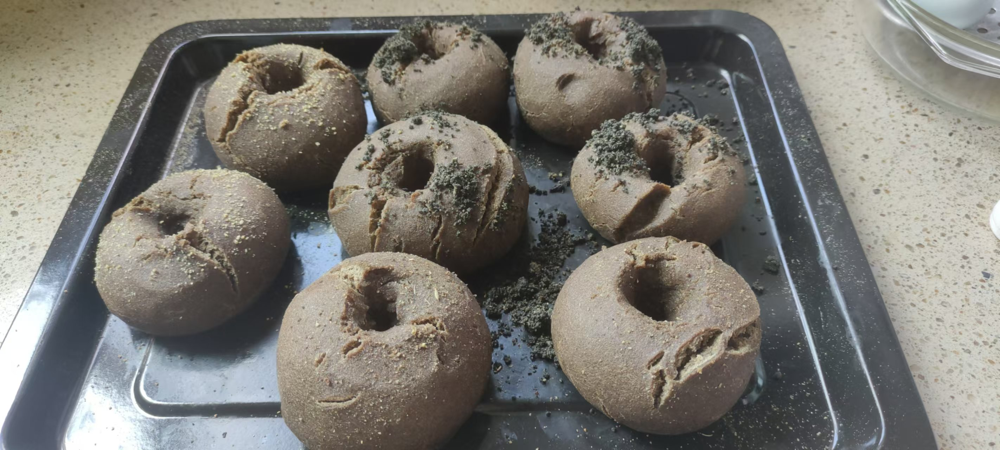

- ((65e9367e-e044-4a96-b0d3-bc14a1f4a901))
	- 黑麦（rye）与黑小麦（black wheat）
	  id:: 685cff81-5a7b-448a-b801-fcb683cb9d60
		- [你用的黑麦粉是传统意义上的黑麦吗解密黑麦与黑小麦的区别_哔哩哔哩_bilibili](https://www.bilibili.com/video/BV1BK411L7Xy/)
		- [黑小麦：我不是小麦，也不是黑麦！_Lunasin](https://www.sohu.com/a/359230283_719772)
		- [一文说清楚黑麦和黑小麦，黑麦面包推荐：厂长说说黑麦面包怎么选-哪款黑麦值得买？ - 知乎](https://zhuanlan.zhihu.com/p/439095143)
		- [15 份黑、紫色小麦种质资源的遗传差异及籽粒花青素含量](https://www.hnnykx.org.cn/CN/10.15933/j.cnki.1004-3268.2022.12.004)
		- [Sci-Hub | Composition, characteristics and health promising prospects of black wheat: A review. Trends in Food Science & Technology, 112, 780–794 | 10.1016/j.tifs.2021.04.037](https://www.sci-hub.ru/10.1016/j.tifs.2021.04.037)
		- [黑小麦240天生长全过程，从播种走到餐桌，营养高简直美味一绝_哔哩哔哩_bilibili](https://www.bilibili.com/video/BV1TK411s7vb/)
	- 小麦替代
	  collapsed:: true
		- [[可颂]]
		- ((65bdbada-73fe-4534-9dfc-ef27e61ad285))
			- [【经典意大利面～～红酱牛肉丸意面（pasta with meatball）的做法步骤图】看风景的人-Ruby_下厨房](https://www.xiachufang.com/recipe/101797045/)
			- ((65f98b02-67af-4d74-a88b-d10764d53811))
		- 加鸭蛋：竹升面
		- 换成淀粉：鱼面
		- 越南米纸卷
		  id:: 65b70785-3af7-4d85-9b7d-d60be6234190
			- 不一定需要加热，食材口味配比合适或加一勺料汁大概就可以吃了
			- 可以包其他 ((67eb2820-57c8-42db-833c-52e66a034963))
			- [越南米纸夏日卷，怎样卷出100个清新的夏天？ - 知乎](https://zhuanlan.zhihu.com/p/21358510)
			- [貝兒實驗室。越式香茅豬肉米紙捲食譜、做法 | 貝兒實驗室的Cook1Cook食譜分享](https://cook1cook.com/recipe/13379)
			  id:: 6822be75-3d94-44d0-b436-bc65081938dd
				- [春日開胃這樣捲：越式香茅豬肉米紙捲 Vietnamese Pork Rice Paper Rolls－Belle's Lab 貝兒實驗室｜痞客邦](https://belleslab.pixnet.net/blog/post/195304806)
			- 综合米纸
				- [【東南亞零食】便宜又變化多端的米紙：越南學生的青澀回憶、上班族的零嘴首選 - TNL The News Lens 關鍵評論網](https://www.thenewslens.com/feature/aseansnacks/118629)
			- 方便食材
				- 速冻甜玉米粒（“比玉米面贵多啦！”）
- 酵（母）种（含酵母的面粉、水等的混合物）
	- ((678a4de9-3280-4c3a-999e-e97dbb671dd2))
	- 酸面团种
		- [What is a Levain And How is it Different From a Starter? | The Perfect Loaf](https://www.theperfectloaf.com/what-is-a-levain-and-how-is-it-different-from-a-starter/)
		- 酸面团酵头（sourdough starter）
		  id:: 685a5ab1-c434-47aa-ab3a-a11a9fd4068a
			- ((68477306-a2bf-4257-9db0-8cf3bd3e9d6a))
			- “八十万浸菌酵头”
			- 参考菜谱
				- [How to Feed a Sourdough Starter with Bread Flour](https://cultured.guru/blog/how-to-feed-a-sourdough-starter-with-bread-flour)
				  id:: 685b829b-83b9-4ee2-98e1-7d3d5d8444cb
					- 50g的用量看起来比较标准，但实际用起来可能不适合稍小的容器、可能造成较多浪费（第三天开始丢弃，200g减去继续发酵的50g和酵头用量较大的贝果菜谱的120g，还有约30g可能被浪费），可根据面粉吸水性等按需调整用量
						- ((686392e6-27b9-4893-8930-6e604cf43574))
					- [How to Make Rye Flour Sourdough Starter • Cultured Guru](https://cultured.guru/blog/rye-flour-sourdough-starter)
						- 黑麦粉比较贵，想用又想省钱可以只用于酵头
				- [Simple Sourdough Starter - Sourdough Made Simple](https://www.sourdoughmadesimple.com/simple-sourdough-starter/)
					- “那写得很享乐了”
				- [Sourdough Discard • Cultured Guru](https://cultured.guru/blog/category/fermentation-recipes/sourdough-discard)
				- [Comprehensive Sourdough Starter Troubleshooting Guide](https://cultured.guru/blog/sourdough-starter-mold-and-sourdough-starter-problems)
				  id:: 685b4d51-4382-4b20-a623-bace889c1c23
				- [Why is My Sourdough Starter Not Rising? How to Fix a Flat Starter](https://fermentation.school/why-is-my-sourdough-starter-not-rising-how-to-fix-a-flat-starter/)
			- 记录
				- 之前白面粉的不记了
				- 300mL矮玻璃杯烫过，50g黑小麦粉，70g水，罩保鲜袋 [[20250629]]
					- 半天不到已经膨胀一半左右过半，换较大的啤酒杯，加50/70，比之前稀一些
					- 上表面看起来干了一层，大概有今天开了更早的空调的影响，但约1/3处有液体分离层，所以还是改为加50/60
					- 第三天换回矮玻璃杯，贝果菜谱用120g
					- 第四天闻起来酸味就比较浓、有可能像是苹果酒和苹果醋的混合物的宜人气味了，可能没必要“丢弃”了，圆面包菜谱倒100g，加30/30，换成一张抽纸盖杯
			- ---
			- ((685cff81-5a7b-448a-b801-fcb683cb9d60))
			- 整体用量
				- 用量大概可根据烘焙用量和感觉倒推，比如每天烤三人早餐的酸面包可能少说要200g面粉（包括酵头中的面粉），按酵头中的面粉与新加面粉1:5、面水比50-200%就需要约50-100g酵头
			- 发酵容器
				- （接上——）面加水密度大于水，考虑酵头膨胀，假设酵头密度1g/mL（实测膨胀一半左右后可能不高于0.66g/mL；实测第三天开始八小时不到胀一倍），每天最多补充酵头剩余重量的一半（如果不丢弃），那么最大需要300mL，再预留一些盖子下的顶部空间，最大至少要350mL
					- 反正 ((685b829b-83b9-4ee2-98e1-7d3d5d8444cb)) 这个用量多点水从第二天开始300mL就有点不太够用了
				- 推荐用压盖（按盖）的足够宽、平内壁（便于去除上部面糊和整体清洁）的“玻璃密封罐”
					- 有合适的玻璃杯也可以买或自制或直接用现成的合适的盖子或纱布等，塑料膜（比如 ((678a4de4-3d1a-4082-bd16-c9983c43fa3f)) ）戳细孔、保鲜袋反过来套罩上（与台面留点间隙）应该也行，更宽的塑料罐戳孔罩上应该也行
			- 清洁、消毒发酵容器和搅拌工具
			  collapsed:: true
				- 稍微讲究点的话，清洗后（可能就够了），用少量开水烫洗，再加大致足量水放凉备用
				- 最后可先后用手指外侧和内侧将抹刀上残留面糊刮回发酵容器，减少浪费
			- 水的比例
				- “面多加水，水多加面”
				- 黑小麦粉吸水性高于白面粉、大概低于黑麦粉，可能需要1.2-1.4倍水
				- 最好用重量而非体积
					- [Feeding Your Sourdough Starter Why You Should use Grams and not Cups– Summit Sourdough](https://www.summitsourdough.com/en-us/blogs/information-and-process-5/feeding-your-sourdough-starter-why-you-should-always-use-grams-and-why-using-cups-just-doesnt-cut-it)
			- 环境温度
				- 天热时可能半天就膨胀一半以上，一天就变色、膨胀、起泡、出味，就可以放冰箱冷藏室等低温容器里了
			- 是否取出一部分丢弃
			  collapsed:: true
				- 可以不丢弃：如果用得勤，那么可以丢弃的部分自然就用掉换掉了——“日取其半，一周不足百一”；如果用得不勤，比如冷藏发酵，那么也不一定发酵出较多可以丢弃的部分
			- 加料次数
			  collapsed:: true
				- “面水加加加加到厌倦~~”
			- 加料量
			- 容器内壁高于水平面的面糊可用硅胶刮刀、纸、手等刮去
			- 观察
				- 正常现象
				  collapsed:: true
					- 酵母菌发酵产生气泡，水相对少些会较多鼓包，水相对多些会较多小泡
					- 表层干了也容易鼓包，可以适度增湿，比如用加厚透气盖物或盖不透气盖物
				- 比较容易出现在高比例精面上
				- ((685b4d51-4382-4b20-a623-bace889c1c23))
				- 粉色
					- ((681ca9c0-dbb2-433e-a179-d6aaf4ce3c39))
					- [Red tint on top of starter | The Fresh Loaf](https://www.thefreshloaf.com/node/51062/red-tint-top-starter)
					- [Why is my sourdough starter pink? Three things that can kill your starter – Milk and Pop](https://milkandpop.com/sourdough-starter-troubleshooting/)
			- ---
		- 鲁邦种（levain）
			- [How to Make a Levain - Sourdough Made Simple](https://www.sourdoughmadesimple.com/how-to-make-a-levain/)
	- 波兰种
		- [看上去很像外星生物的东西，居然是发酵的面团#科普 #有趣 #解压_哔哩哔哩_bilibili](https://www.bilibili.com/video/BV13u4m1T7zU/)
	- 啤酒酵母
- 面团
	- 低钠面食
		- ((66dba0b0-0fd7-44c9-b1a2-dd8e1c06b7ec))
	- [烘焙食品健康与营养改良研究进展.pdf-原创力文档](https://max.book118.com/html/2024/0113/7120122125006030.shtm)
	- [【小高姐】万能面团_哔哩哔哩_bilibili](https://www.bilibili.com/video/BV1LK411V7c2)
	- ---
	- ((678a4de9-8bb3-460a-b364-3aeb4791c0dc))
	- 添加较多的全谷物粉可能降低面团筋度，可对应将其他粉换成高筋粉
	- 和面
		- 揉面
			- [90: How to get a Filling INSIDE your Bread Dough - Bake with Jack - YouTube](https://www.youtube.com/watch?v=ZA_FTFtdZgM)
			- 揉面盆
			- 烘焙垫
				- [木质，塑料，硅胶，不锈钢，擀面板/烘焙揉面垫，哪些品牌健康安全，性价比高还好用？ - 知乎](https://zhuanlan.zhihu.com/p/413587156)
				  id:: 65bcbf68-4331-4799-900c-f1008a34c69a
				- [什么是铂金硅胶？淘宝上20元的烘焙垫是铂金硅胶做成的吗？如果是假的，用什么代替的，对身体有什么害处？ - 知乎](https://www.zhihu.com/question/35857092)
				  id:: 65bcbf68-00b0-4785-9ef1-939a6afccce9
			- 刮板/切面刀
			  id:: 65f6ea99-7751-44c3-a138-e9fee8ba7f1b
			- ---
			- 手法
				- 较干时握拳，挤出的面糊继续握
				- 较湿时用手掌按，按后几根手指往内扒拉面团继续按
		- 防面糊粘手
			- 湿手
			- 湿容器或台面
	- 拉伸、折叠
	- 遮盖
		- 发面容器可以装入保鲜袋等塑料袋简单（一折塑料袋多余部分）一压或一夹，如为透明塑料袋可按需置于弱光处
			- ((683da798-53de-4ad9-b6a7-6b6d65e448a4))
		- 大盘子、锅盖、炒锅
	- ((65f6b5b0-b4c7-4208-a963-3ffb77f4f228))
- ---
- 一般不咋发酵的
	- 曲奇
	  id:: 67303aa5-6610-40fc-8160-50387674b19d
	  collapsed:: true
		- “网络冷笑话”
			- id:: 67303c2b-3f9d-4e38-bfdd-0201812d5335
			  >各种粉要先上网筛，然后才有cookie #苏州植青
		- [你想知道关于曲奇的一切（上）理论篇暨泡打粉深入分析 - 知乎](https://zhuanlan.zhihu.com/p/34650341)
		- 异形曲奇
			- 符号（字母、数字等）曲奇
			- 答辩曲奇
				- “你连心爱的女人（？）拉的大便都不敢吃，还敢说爱ta”
			- ---
			- 菲乐斯曲奇
			- 拉康三戒曲奇
				- 大半环，垫板支撑，互相穿过后再接上
				- 或者烤完了让食客自己接上
				- 似乎也应该有三种口味
			- 曲奇积木
		- 注射夹心
			- “这下很难不下头了”
		- 3D打印曲奇
			- [免費印自家設計曲奇！依莉詩試玩 3D 食物打印機 - unwire.hk 香港](https://unwire.hk/2016/11/01/ingdan-coffee/hottopic/walk/)
	- 面条
		- 捞面器
		  id:: 68185f19-989f-498a-a5a4-0e3f0a5ce4b3
	- [[饺子]]
	- 蛋糕
		- ((6859019f-e044-49fe-8cd8-9db83bf16ac1))
			- [法国冠军世赛教练亲授：焦糖苹果圣奥诺雷泡芙_哔哩哔哩_bilibili](https://www.bilibili.com/video/BV14E41117vt/)
			- [【修女泡芙】烘焙地球村&烘焙名师柴柴_哔哩哔哩_bilibili](https://www.bilibili.com/video/BV1qx411i7Ko/)
- 面包
	- 酸面包
		- 酸圆面包
			- [Dutch Oven Sourdough Bread Recipe (Master Recipe)](https://cultured.guru/blog/dutch-oven-sourdough-bread-recipe-master-recipe)
			  id:: 68612fdc-0dfe-49bd-ab21-2fead1e1662c
				- 注意有的搪瓷荷兰锅可能内部没有搪瓷
				- 5.5-6升的不多，有点贵，可以先用砂锅（小烤箱如果搁不下较高的汤煲可以用平底砂锅）
				- 第一次用50%黑小麦粉 [[20250703]]
					- 10g盐，多加100g水，好像稍多
					- 三次拉伸折叠后超时2小时过去看，发了不少，更整不成球了，50%白面粉大概是中筋粉不太行，加些粉杯水车薪，事已至此，先冷藏吧
		- [Easy Sourdough Bread Machine Recipe • Cultured Guru](https://cultured.guru/blog/easy-sourdough-bread-machine-recipe)
		- [Simple Sourdough Bread Recipe - Sourdough Made Simple](https://www.sourdoughmadesimple.com/simple-sourdough-bread-recipe/)
		- [【小高姐】酸种面包_哔哩哔哩_bilibili](https://www.bilibili.com/video/BV1n74y1m7we/)
	- 大列巴
	  id:: 6864f974-683e-45e9-ac44-2b11219f3779
		- [【正宗大列巴的做法,最正宗的做法步骤图解_怎么做好吃】_下厨房](https://www.xiachufang.com/recipe/102317197/)
	- [[披萨]]
		- 吃披萨至少可能把钙（奶酪）给补了，虽然一般还是比无碱（无盐）面多不少钠
		  id:: 65f00596-184c-45d6-bef1-d59964638da4
	- 贝果
	  id:: 68639280-d2e2-4c20-b2b7-ed126dbf42ac
	  collapsed:: true
		- [贝果 - 维基百科，自由的百科全书](https://zh.wikipedia.org/wiki/%E8%B2%9D%E6%9E%9C)
		- 我第一次到 ((675cebeb-3eb1-4f7f-add4-0fec4a86d3c3)) 一坐，就赶上一位糕师学艺归来请我和家人吃新鲜出炉的贝果（我妈说有多种，没注意有没有这种，坏了这下更不确定吃没吃过贝果了），顶料记不太清大概有糖霜/粉，贝果里有甜奶油还是炼乳啥的就蛮好吃（“我嘴相对刁”），家人前阵子出去旅游前买面包当零食还说吃过几十家面包店都没那个小伙子做的好吃，好像还说以后还得过去吃
		- 酸面团贝果
		  id:: 68639285-f024-4ec4-bdd1-9cf448391376
			- [New York Style Sourdough Discard Bagels (Ready in 4 hours)](https://cultured.guru/blog/new-york-style-sourdough-discard-bagels-ready-in-4-hours)
			  id:: 686392e6-27b9-4893-8930-6e604cf43574
				- 补充注意事项
					- 和面
						- 这个面粉量是我迄今用过最大的（之前也就一斤面粉做四个披萨面团），新手至少得有个足够大的和面盆，或者先倒面粉帮助判断适可而止
						- 全谷物粉的比例首次做不建议超过50%
						- 不用酵母需要2倍发酵时间，酵头需要高活性的（特征之一：膨胀到最高处还没下沉的）
						- 除了蜂蜜也可用枫糖浆（作者回复评论）
						- 还可另外加各种想加的食材
						- 跟面团搏斗也需要一点劲
					- 分割面团
						- 分割大面团前可以直接往和面盆里加面粉
						- 没有烘焙纸可以用铝箔
						- 保鲜膜、保鲜袋、铝箔等也可以用来盖、罩住面团；作者回复评论说冷藏发酵没必要盖
						- 小面团可以稍微揉一下接近球形就蘸面粉然后搓匀些，之后可以用和面盆倒扣
					- 煮贝果面团
						- 煮水深度不用太深，免得贝果中间加热过度——或者足够深，不翻面了
						- 煮水记得尽早放小苏打和蜂蜜/糖，免得水一开就忘了就直接下贝果了
						- 锅不太小的话大概可以批量煮贝果，记住下锅顺序按顺序翻面、取出
						- 要防蒸汽烫手，用较长的厨具或戴手套
					- 刷蛋清、撒顶料
						- 在水槽边、水槽上方敲蛋、开蛋的话注意避免蛋清从指缝漏下流走
						- 要有刷子，硅胶抹刀刷蛋清的效果大概不如直接拿贝果蘸
						- 顶料大概可以参考月饼，比如椒盐应该就挺好，面团已经有点甜，可能不用加糖
						- 较湿、散的顶料大概没干料容易粘附，比如加工好的冰糖黑芝麻碎糊
					- 烤中旋转贝果可以旋转烤盘，旋转不是翻面（“已经上顶料了排除一下”）
				- 第一次用黑小麦粉做 [[20250702]]
					- 
					- 用的椴树蜜，40g还差6g
					- 用的黑小麦粉，把备用60g水加了又加了100g水
					- 黑小麦粉揉出来质感粗粗沙沙的更接近玉米粉，shaggy不了一点；拉伸时也只能两手抓着尽量拉一下
					- 发酵时间没翻倍，除了忘了也有昨晚已经晚了；可能由于每次发酵不明显，所以没发现明显膨胀
					- 戳完美式无头窝窝头的造型就好啦！“嘿嘿！”
					- 用两个保鲜袋盖了放冷藏的
					- 煮水忘加小苏打和糖了
					- 至少一时没刷子，硅胶抹刀不太能刷蛋清
					- 混合香料碎（黑胡椒为主，其他大概是五香中的几种）2个、白胡椒碎2个、冰糖黑芝麻碎糊4个（勺子撒得很不均匀、斜一点就不咋粘附了）
					- 先用包汉堡的大概是淋膜纸垫的，不能烤，铝箔片又不知被收哪去了，还是直接放烤盘上
					- 烤10分钟后转了一下发现还比较软，底也有点粘，那么不转了——“坏了，没想到转烤盘”；感觉有点厚所以烤了30分钟
					- 粘底，扯下来一部分
					- 酸咸甜，顶料没面团有味，咸度够够的，盐可以少放，吃起来不算好吃（其实还是有点好吃，这料放在这里，也就是黑小麦粉太多了）也不算难吃，吃几口重新盖上保鲜袋冷藏，这几天也是有的吃这个“非洲贝果”了
		- ---
		- TODO 贝果弹弓管
		  id:: 6863928a-ba07-4999-8e39-06418f95fec6
			- “空气炮不顶饱”
			- 贝果型号武器化
				- “蒜都有独头蒜，我们贝果（？）也要有独头贝果！——啊？已经是了吗？”
			- 贝果顶料防脱落
				- 可能没必要为了什么“粒子特效”浪费食物，除非有合适的回收手段
			- 贝果上管
				- ((67b9dab3-2aff-4380-9f45-bf8ba98f0da6))
				- 也可以换成竹管等
				- ---
				- 自动装填
					- 扁竖漏斗仓
						- “你们这些个小水弹不能吃啊！”
					- 穿管分区
			- 贝果发射架
				- 垫圈
				- 钩爪
					- 比方说把“W”改成圆角，中间角扳90度、倒U形轻挂、箍在管上，两侧也可能只是各一横而不前突
					- 也可能直接拿一次性竹筷试试
				- ---
				- 将贝果内侧上部垫离管（减少磨损）
			- 皮筋
				- TODO 内穿皮筋
					- 不在管上开槽怎么搞？
				- 管外下方走皮筋
					- 泵动握把
				- ---
				- 末端
					- 皮筋和垫圈/钩爪堵头
			- 瞄准
				- 管内瞄准
					- 放大
				- 激光瞄具
			- 发射托
				- 不清楚会加加加加到多大的后座力
			- ---
			- 射后接着玩
				- 贝果撞击面强化、缓冲等
					- 看需不需要
					- 贝果整体硬化
						- “先想到握力圈”
						- “扎头发用的”
						- TODO 贝果弹弓圈/杯
						  id:: 68639e03-05e4-4b45-9556-9a2e0e89dca8
							- “拆顶料作弹药”
						- TODO 贝果颈圈/枕
						  id:: 68639ea2-2e81-4ef5-b1ca-970f2232810c
							- 看过个童话啥的，懒人的老婆出门前给他脖子上套了张大饼，结果回来发现因为他懒得扭头而饿死了——“那很有定力了”
				- ---
				- 更可能固定的目标
					- “躲避靶”
						- 比如有刃
							- 贝果划痕等的深度、数量越小，说明射得越准
						- “保卫贝果”
						- “（手撕包菜，）炮决贝果”
					- 套圈
						- 没怎么想，因为可能需要比较大的贝果
				- “快到碗里来！”
					- 扎贝果盘/碗
						- 粘靶球
				- “贝果忍者”
				- 击剑
					- “再给它穿上”
						- “接力”
							- “先掉的输”
				- 嘴接
					- “那很把人当狗了”
					- ((6642de75-9af8-4eef-8525-2ba12a621943))
				- 空中拦截、撞击
					- 贝果对撞
	- ---
	- [[三明治]]
	- 派
	  collapsed:: true
		- TODO 骑墙派
		  id:: 68649a21-bf04-47c8-945f-313839073259
			- ((67e9ffe0-079f-4dc4-88cd-dffa08f41d86))
				- “那很模块化了”
	- [[可颂]]
	- 毛毛虫面包
		- 更真实的毛毛虫面包
		  id:: 678a4e13-a2f3-47e3-bc86-2243f8b4adcd
	- TODO GMF击掌大手印面包
	  id:: 685e7255-8b91-4dfd-96aa-e767d5829830
		- 揉酸面团揉的
	- TODO 面包甲
	  id:: 685e7921-18dd-47fb-8b0c-fc647b24152e
		- 烤水分实际上不太足的面包烤的
		- 好吃（确信）又好玩
		- “败者食撑”
		- [Bread armour +97 def +20 speed (special effect) a swarm of birds protects you : r/ItemShop](https://www.reddit.com/r/ItemShop/comments/he07iq/bread_armour_97_def_20_speed_special_effect_a/)
		- [Bread Armour: Armour +50 protection -25 resistant to water spells - Berd power (able to summon a flock of birds to attack enemies: -10 durability each use 15 second cooldown) : r/ItemShop](https://www.reddit.com/r/ItemShop/comments/dwjsm7/bread_armour_armour_50_protection_25_resistant_to/)
	- TODO 面包飞盘
	  id:: 685f9681-78df-4cdd-9a5e-c76285f8d2b7
		- 今天烤的比较稀的、比较摊在烤盘上的酸面团是这样的，差不多
	- TODO 面包车
	  id:: 6864952c-5ec1-4725-827b-6003bf4e3962
		- 一想到就记忆乱了，不确定以前有没有吃过个车轮啥的了
		- ((67e9ffe0-079f-4dc4-88cd-dffa08f41d86))
		- ((68649530-19ef-48ec-8bab-636ddb41a0b6))
		- [小时候以为面包车就是面包做的车......._哔哩哔哩_bilibili](https://www.bilibili.com/video/BV1T1421q76A/)
		  id:: 68649535-8f1b-46ec-81ea-55a4635281bf
		- ---
		- ((68639280-d2e2-4c20-b2b7-ed126dbf42ac)) 算是较宽的越野轮
		- ((6864f974-683e-45e9-ac44-2b11219f3779)) 车身，可能挖掉一部分
	- TODO 面包人
	  id:: 68649530-19ef-48ec-8bab-636ddb41a0b6
		- “可食用手办”
		- “坏了，一股巫蛊味”
	- >“我们烘焙圈也要有自己的房树人！”
- ---
- “恐怖面食”
  id:: 6858cc16-9474-47db-83b8-bfe0a194b367
	- ((678a4e13-a2f3-47e3-bc86-2243f8b4adcd))
	- >想到b站有那种做成各种精神污染造型的面食视频，作为教具可能——“有从零到一的作用” [[20250701]]
	- [77的美胃人生的个人空间-77的美胃人生个人主页-哔哩哔哩视频](https://space.bilibili.com/1440345074)
	  id:: 686406a6-8a01-478c-84b9-70fc654b63ea
- ((662361ba-0f68-47a9-b607-6154071963aa))