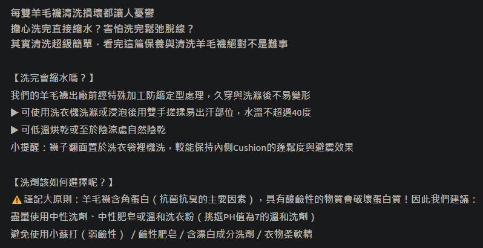
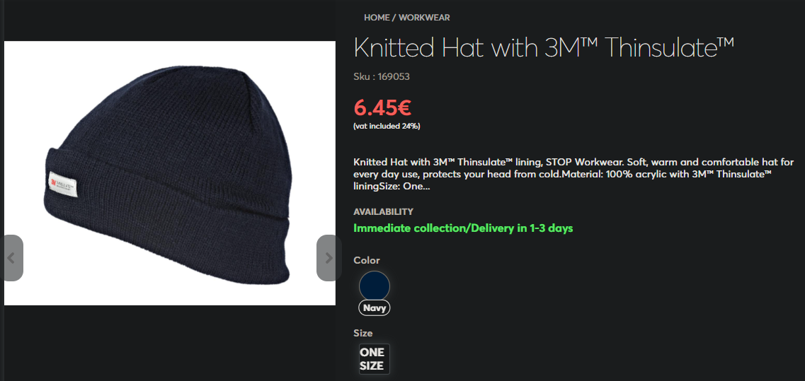
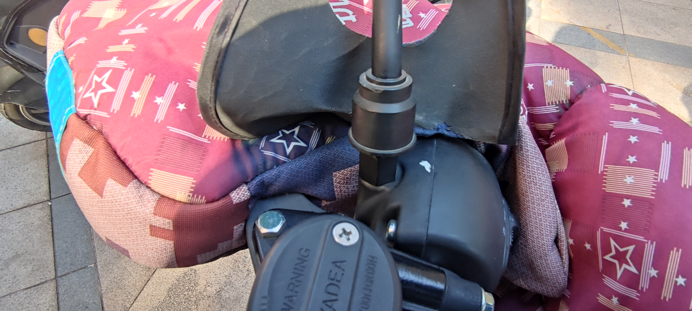

- 室内外防风寒、防大风刮走电费
- 关键词：赤井秀一、电费、双碳；爱的供养、咳咳咳、二手烟
- 行动建议：“爱心传递”（带电子温湿度计、测温枪串门帮别人发现问题、提供解决方案）
- 3c（[[头盔]]）双碳零霾零烟
- TODO 《风》选品：电瓶车挡风被（两大潜在薄弱点：手套孔钻风手冷、护脖）、门窗密封条（在用的“鞍森友”的，大的泡沫密封条A、B无胶，卡进窗轨后无法开窗，不平整的边角还是稍微钻进来一些风；阳台用的可开窗的？）、空净（四机箱风扇CRBOX、怼脸吹待选品）
  id:: 678b04be-bd0e-409e-b729-9f476d363a4e
- {{renderer :tocgen2}}
- ((65672e7a-fd59-435d-8bf8-137f1518a65f))
- {{embed ((653ddc91-605c-46d2-aea2-f78f72d707ef))}}
- >太阳很好，同时风很大。
- # 一、毕淑敏的风和阳光
  id:: 654a28e3-35e9-46a5-80d9-34d518165edf
	- [【美文】毕淑敏《风不能把阳光打败》](https://www.sohu.com/a/231956009_559576)
		- 可能有些读者做语文课外阅读看过，我妈是在单位图书馆看的（我翻了下她最近几十条朋友圈，发现好像只在宣传保险时用过一个“但”字），我则至少从语文课本中看过《我的五样》
	- ## “但是 VS 同时”·ROUND 1
		- id:: 653da952-7041-4ace-8a01-1ad5895efb8a
		  >其实，所有的光明都有暗影，“但是”的本意，不过是强调事物立体。可惜日积月累的负面暗示，“但是”这个预报一出，就抹去了喜色，忽略了成绩，轻慢了进步，贬斥了攀升。
		  一位心理学家主张大家从此废弃“但是”，改用“同时”。比如我们形容天气的时候，早先说：今天的太阳很好，但是风很大。今后说：今天的太阳很好，同时风很大。
		  最初看这两句话的时候，好像没有多大差别。你不要急，轻声地多念几遍，那分量和语气的韵味，就体会出来了。
		  但是风很大——会把人的注意力凝固在不利的因素上。觉得太阳好不是件值得高兴的事情，风大才是关键。借助了“但是”的威力，风把阳光打败。
		- 聪明的读者，你认为谁赢了？
- # 二、防风防寒省电
  id:: 67402acd-efd8-44c8-923e-13166052bcae
	- ## 你知道吗？“风险”就是“冷不防”就会出事
		- 因为网购的流行，消费品市场的质量分化加剧，很多老年人（“咱就不加双引号了，懂的都懂，但是大多不完全懂”）因为不会网购（有种称呼叫“数字难民”），手机自带的浏览器都不会用买不到足够保暖的衣物，加上节俭惯了舍不得开空调及其他取暖设备，所以在冬季较易因为低温增大感冒、传染病、中风风险
		- 家人不一定会网购，先
	- TODO 免疫力、中风与温度
	- 看天气预报
	- ## 室内防风：从地库到天台，封闭式整治“四门两窗一阀一漏”
	  id:: 65ab10fb-1915-428a-bad5-ba7e7675dbb5
	  collapsed:: true
		- “不会吧不会吧，应该不至于每一道防线都有漏洞吧？”
		- 别让邻居公共烟道的二手油烟、楼道邻居二手烟、绿化割草、农药飘进自家让家人难受、客人心中暗自笑话
		- 出门（“记得带钥匙”）帮大伙儿巡视检查一下，看看哪些东西在妨碍我们的双碳目标，用手、眼、耳、鼻凑上风口感受一下，单元门、地库门、电梯门和各层楼的推拉窗都在不同程度进风，那么它们从哪出风呢？对喽，就走你家防盗门的缝
		- “单元楼中对立的四门一窗”
			- “前阵子是给家里关门关窗，现在给整栋楼关门关窗了噢”
			- 单元的三门一窗（没电梯、地下车库乃至单元门的老小区可能只有楼梯间推拉窗，当然也可能是不可打开的窗）
				- 单元门：下部留缝漏风；内门上下两段向内弯，不知道是否有有意为之（“简单的密封条可能也不好贴了”）；长期滑动门锁附近变形，也漏风；可能的敞开半边门的情况：（因为雨雪寒潮等）推电瓶车进来，电瓶车可能比较重，门不自动打开不方便腾出手，干脆先把半边门向外打开固定（有的向外打开的角度够了就不回来了，有的用砖头等重物挡着防止门自动关上），电瓶车推进去了（一部分还要坐电梯上楼），可能就
					- 我的解决方案是：升级密封电动门，前置一个刷卡机或其他识别设备（比如贴门前牛奶箱旁）方便门自动向外打开、不被电瓶车挡着，或者简单点向内开也行
					- 对于没带门卡的住户和快递员
				- （单元）地库门：门开着就有很大风，关上后不想内有些矮楼层或为了锻炼要爬楼（包括一时兴起）的住户，这是不可避免的，而我这的地库门不会自动关上，门开着风挺大，关门后不向内按上最后几毫米还是有风——地库的空气质量可能比地上的更差，但我还看有的群里的跑步爱好者会利用这个“地下避风港”跑几公里
				  id:: 679addae-7e9a-4102-9e5f-07dec4ddb0cf
					- [地下车库的空气环境让人满意吗？- 知乎](https://zhuanlan.zhihu.com/p/380366676)
					  id:: 679addae-7472-482a-95ff-833ea30467ee
				- 电梯门：也有一点风
				- 楼梯间推拉窗：因为看得最多（“牛，帮我搬个花/浇个水”，以及），所以最先试过关，的确关了一些，还上了锁（除了一些安装得不太好，锁上时会抵着外推外窗的；也许部分是为了方便后续观察，也许部分是强迫症），但是肯定还是会漏些风的
					- 文章反正已经有点长了，不妨再加点题外话：冬至巡视时到了 11 楼，楼上有个门开不了，但是上半层的楼梯间有个平开窗，回来一趟拿了个塑料凳放下爬了上去（危险动作，请勿模仿；其实不够高，不带也行，但下来比上去难，要注意腿下来的先后顺序，如果凳子太矮、掂不到脚会多费点力）——发现并不是天台，看了会楼下烧纸的老奶奶、飞到对面十一楼阳光房顶的熟悉的珠颈斑鸠、比楼高的不确定是否为鸽子的小队、飞机、焦山附近江上的船——
			- 住户的一门
			  id:: 67402acd-c7c2-46e6-b1f7-7fbdbe086300
				- ((66db8ad0-71d2-4d00-bfd9-68a79c2c363d))
				  id:: 67402acd-cb18-4c0e-ad60-9f0cad7f604e
					- 把其他常规点关上，也可能小不少，但总归还是有
					- 大力关门旷量
						- ~~“没有功夫不要大力关门”~~
						- 关车门那股劲（“声响大就是关紧了，越响越紧！快使劲！”；我开车带爸妈到地儿了，想得起来就把我的左前车窗打开，其中回地库停车位时一般伸手刷卡后是开着的，那么爸妈下车时，我会把头往窗外杵，以减少关门对我造成的冲击）也用来关防盗门，每天五次十次以上砰砰几年，可能早就松了裂了——拜年或常规拜访时也可以帮别人看看
						  id:: 679addae-a40c-468e-91d6-e99548c350d0
					- 如果有些邻居在楼道里抽烟或==点蚊香==（“我真是服了”），也可能吹进来
					- 我之前挂在门上的口罩都悬，门锁、门框处吹风都不小，应该密封好再挂门上
					- 原装密封条可能很便宜，就一比较硬的密封条，不带可变形的空腔，也许门锁尤其是晚上讲究人会锁门的附近会优先断裂
					- ---
					- 门框合页密封
					- ---
					- 甚至蚊子钻进来
					- 主副门受力不均
		- 住户的一窗一道一漏
			- “你不能把大自然或小区给关了，至少现在有点难”
			- 推拉窗
			  id:: 678b04be-b66b-42bf-84d1-b4895ba27cb1
			  collapsed:: true
				- [看似简单的推拉窗，原来还有那么多你不知道的学问？ - 知乎](https://zhuanlan.zhihu.com/p/450400832)
				- [新绍CT140全景推拉窗—革命性线轨技术，启迪设计新灵感_轨道_型材_产品](https://www.sohu.com/a/762369391_100049227)
				- 大窗比小窗更漏风
				- 铝合金推拉窗比塑钢推拉窗更漏风
					- ((6594ae08-f775-4791-b1e0-6219f53a3cac))
						- 
						- 
						- 除了卧室和书房，别处都是这个窗
						- 上学上班白天不在家少受苦，但晚上回来还是要花钱取暖的
				- “原配的、能用就行的”
				- 推拉窗、房间门（这个先不谈了）、防盗门很多都有明显的缝，目的显然不是防止你不开门窗被闷死或“不开窗即能满足通风需求”，就是用料不行，可能还有当初没装好、
				- “推拉不密封，密封不推拉”
				- 我家两个卧室和书房的推拉窗还好，卫生间的就一般，客厅的就不行，阳台的就离谱（现在都不想看了，因为“再多看一眼就会爆炸”）
				- 铝合金窗（可能阳台、客厅的不会换）一般更漏风
				- 热量损失途径除了缝隙漏风，还有玻璃透冷（换中空、真空玻璃；中空玻璃漏气，内部起雾、光线照射可能有虹彩，则需要更换）、窗框/门框透冷，但本文先来便宜的
					- [【我叫杨坤】万字解析，全国不同地区应该买什么样的窗户？_哔哩哔哩_bilibili](https://www.bilibili.com/video/BV1eu4y1Y7n3)
				- 推拉窗滚轮
					- [20楼窗户突然脱落，女子抓住窗户30分钟，女子：掉下去会有人受伤_哔哩哔哩_bilibili](https://www.bilibili.com/video/BV1RB4y1D78x/)
			- 烟道：没装好烟道止逆阀，别人家的饭菜香和油烟从公共烟道串过来喽！
			- 地漏：这个更多与可能通过排水管垂直传播的病毒气溶胶有关，有条件还是封上或日常开排风扇图个心安吧
				- TODO 排风扇如何定时开？
		- 怎么办？
			- 推拉窗
			  id:: 678b04be-3fae-4263-a40d-685e8a474a80
				- [天冷了，该解决老式推拉窗漏风问题了_哔哩哔哩_bilibili](https://www.bilibili.com/video/BV1mP4y1V7dK)
				  id:: 6594ae08-f775-4791-b1e0-6219f53a3cac
					- 评论建议，铝合金推拉窗就不要自己拆（除非会）下来换滚轮（“省事喽！”）
					- 有条件的话，天气相对暖和时安装
					  id:: 66dba0c0-470c-481c-a2e9-f1c9f5d3a9a7
					- 气泡膜（半透明；快递包装里有时有）
						- 不常用的窗户（比如卫生间的）、晚上不用的窗户（比如阳台的）可以用喷壶喷水贴上
					- 透明膜
						- [冬天窗户漏风了老金用 20 块钱魔术贴塑料布搞定_哔哩哔哩_bilibili](https://www.bilibili.com/video/BV1Yu411o7RK)
				- ---
				- ((678cc364-4be7-4bbd-a430-84da02b2072e))
				- 推拉窗密封条
				  id:: 6795e488-c6f7-49b8-8f3b-59f86eca89f7
					- ((678b04be-bd0e-409e-b729-9f476d363a4e))
					- 内部是泡沫塑料的密封条在嵌入窗轨较窄时注意技巧也还是费时费力，且可能把窗向外顶，而在取出时又会因为过紧而在薄的地方撕裂（可以用另一扇窗顶出一部分再拿相对大的一截拉出）
					- 是硅胶或橡胶的又太硬，弹性空间不大，可能不适配窗缝
				- [[推拉窗密封膜]]
				  id:: 6795e560-0cc3-4b1f-aee3-1b854961c532
			- 平开窗
				- 保温帘
					- [天气冷了，该解决平开窗漏风的问题了_哔哩哔哩_bilibili](https://www.bilibili.com/video/BV1ju411D7tk)
				- ---
				- 平开窗手摇开窗器
				- 平开窗合页密封条
			- （门窗）密封条
			  id:: 67402acd-ed71-4d64-9702-fb3e64559d64
				- 不要遮光，我还要看鸟呢（“第一人称后置环绕式 3D 动态壁纸”）
				- 按安装方式分为两大类：卡的、贴的，卡的一般不能再推拉，贴的可能可以，两者均不能再滑动纱窗，但是冬季一般也不用纱窗，取下就好
				- 安装
					- 去除旧密封条
						- [换防盗门密封条 [202307181640]_哔哩哔哩_bilibili](https://www.bilibili.com/video/BV1GV4y187Uc)
							- 一般分三阶段，扯胶条、去除残余胶条、去除残胶，这个视频中可能完成了一阶段
							- 铲残余胶条可能造成碎屑飞舞，建议清理前戴口罩、护目镜，并把门边、挂门上的东西拿开
							- “密封条上挺多灰的，新年大扫除应该包括这里吗？”
				- 防盗门密封条方案总成本：我这一栋楼 22 户，就算全住，每户买 25 元密封条，共 550 元，不确定有没有改造单元的三门一窗
				- 卡的肯定紧，不适合再开窗，贴的也可能比较难开
				- 怎么安装？
					- 贴的可能要在室外温度不太低时贴，比如 10 度
					- 站在椅子凳子上安装时注意安全
			- 烟道止逆阀
			- 地漏塞子或装水塑料袋
		- “验收气密性”，交房有这项吗？至少没有普及吧？房子的秘密还多着呢
		- 比如我家厨房时不时串味，一般是烟道止逆阀没装好，现在还没动
			- ((656ee774-85e7-445b-bba5-3649cc7b2990))
		- 后果很严重
			- 风可能通过缝隙将照进室内的阳光的热量吹散
			- 取暖电费飙升，钱被大风刮跑喽！
				- 开空调暖气的这几月，电费高，
				- 可能用户的潜意识类似“窗就是窗，门就是门，空调就是空调，电费就是电费”，或是多点思考，“房子大了、以前没用过的中央空调就是比较耗电、老了火力不壮了怕冷了、有点钱了才开的空调、装中央空调本身就花了不少钱不能浪费、由奢入俭难......”
				- 漏进来冷风，导致过早开空调、取暖时间延长，为了足够的取暖效果温度调高、取暖功率加大，用电量上升，进而还可能跳到更高的阶梯电价（有些地方租房，房东可能连“电器折旧”、“电路维护”的名目都不立就要收你更高的电价，可能他们想的是“你不租有的是人租”，泪目），电费自然就高了
			- 加湿器加湿效率下降
				- 遇到大风天，越加湿湿度越低，why？！（决定开始解决这个问题，还是拜之前的加湿器文章留的坑所赐）
		- 解决方案
			- “赶快换窗吧！”
			  id:: 656899bc-22a5-4e62-95a2-a9a2dc6c4b36
				- 换窗还能降噪、减少玻璃导热损失，就是换一下有点贵，还没怎么了解过，先拖着
			- [如何将推拉窗的缝隙封死？我家是这样的，冬天嗖嗖的进风，求推荐好用的密封条？- 知乎](https://www.zhihu.com/question/435051887)
			- 推拉窗密封条
				- 没弹性的可能无法适配缝隙，硅胶的弹性没海绵好
				- 拿皮尺量一下，一般够
				- 有胶
					- 一般是在缝之间合上，可以开窗，会有磨损
				- 无胶
					- 一般按上去就不好开窗了
				- 密封条有气味可以先吹几天
				- 窗轨洞堵漏
			- 保暖窗帘（半透明、聚酯纤维/涤纶、石墨烯，石墨烯的可能利于白天晒太阳取暖，后部铝箔可能利于快速导热到室内——“暖气片”，但效果如何得具体看。包住窗框是防风，如果防风已经做得话，在太阳直射的地方悬着深色织物应该有类似效果）
	- ## 取暖小温室
		- TODO b站视频（二氧化碳、有机挥发物、电器、防火）
		- ((678dbe5d-492e-430b-b7b1-ae236572f212))
	- ## 穿暖
	  collapsed:: true
		- 保暖内衣和棉袄/羽绒服
			- 会买东西的人都知道，材料往往高于品牌，现在很多老品牌跨行业出产品就是找代工（包括换到印度苹果），很多国外品牌也是国内代工，按材料买，国外没有太多花里胡哨的“新发明”，用国外品牌的材料一般不会乱标，很多出口原单的正品信息都能查到（当然，也有一些专门做仿品的，但一般也不会标“外贸”、“原单”），放心买
			- 不出汗穿性价比就很高的全棉保暖内衣大家都有吧？不够再来点抓绒（polartec，但是之前在淘宝“尾货”店买了前几月在外面熬过夜的抓绒毯，不确定真不真，甚至已经忘了到底有没有静电）、人造棉（比如 3M 的 Thinsulate 新雪丽棉：初中买的哪年丢掉的好顶赞的厚手套、现在穿的“老干部”劳保棉袄、最近刚买的针织帽和触屏骑行手套、未来不确定盘不盘的汽车吸音棉）、羊毛（美利奴羊毛更好，如果是贴身穿最好是超细美利奴羊毛，之前买了件淘宝 popfire 的春秋 T 恤，其实刚开始穿那几天感觉还是稍微有点扎，其他方面 OK，起点小球问题不大），再往上我穿不起（“小时候”穿的羽绒服静电更大）就不说了
			- 大家可以关注下材料，主要就这么先
			- 保暖内裤（秋裤）塞进袜子里，风钻不进来
		- TODO 镂空/网面挡上（运动鞋透气网面、自行车头盔）
		  id:: 679addae-a862-467f-b964-ff6bbf4cc017
		- 羊毛袜
		  collapsed:: true
			- 羊毛袜推荐国产飞爽 outdome 的户外美利奴羊毛袜 630，比较舒适（注意比较厚，鞋小了可能挤着；660 是长筒，可能勒小腿），不追求最高的羊毛含量、一般冬天够了，之前的几个冬天，我是穿着它在家走来走去的
				- 机洗时最好内侧朝外后放入洗衣袋，其他袜子也推荐放入洗衣袋与其他衣物分开
				- 
			- 烘干时朝里朝外？
			  id:: 65e3ea59-d273-4552-9719-55a2bb5ed2cd
				- [如何让洗好的衣服快速干? - 知乎](https://www.zhihu.com/question/68067490)
		- [[拖鞋]]
		  collapsed:: true
		- 雪地靴
		- 帽子
		  collapsed:: true
			- 这东西，可能室内不开空调暖气、光靠持续的“大脑升级”散热也大致够用，但室外可能就要戴了，尤其是脑门凸显的朋友（“是的，我是有一个朋友”），尤其要护一下，戴个帽子还可能美观些
			- 外衣自带帽子的，也不一定够用，而且不向前兜着、收紧照样刮脸、钻风
			- [《名侦探柯南》即将推出赤井秀一、柯南款式的针织帽 - 哔哩哔哩](https://www.bilibili.com/read/cv10710012/)
			  id:: 678b04be-5209-42a6-87ea-59b4d2ed1e4b
			- 针织帽，翻下来遮耳朵和一部分后颈，不误外挂口罩，刚剪短头发在室内头冷也能保暖
			  id:: 65ae0909-05ee-4c98-8114-0dec2408bd95
				- 买了个希腊品牌 STOP 的外贸原单，真不错，我偏要把正面的 3M 标戴在前面，免得别人不知道应该买什么样的帽子
					- 
					- https://open.weixin.qq.com/connect/oauth2/authorize?response_type=code&scope=snsapi_base&appid=wx839691cce7c102bb&redirect_uri=https%3A%2F%2Fmobile.yangkeduo.com%2Fgoods1.html%3Fgoods_id%3D565726228250%26page_from%3D101%26pxq_secret_key%3DMZMMALOTSUUQNX5AHVNWIAI2ULWXXOVAR5UMQYN2DBGXFBZUGLCQ%26_oak_share_snapshot_num%3D1520%26_oak_share_time%3D1706435173%26share_uin%3DPAZRZCGOEEUIDDZSYODJWTSCNA_GEXDA%26refer_share_id%3D4bd54eb11d9240b2919e57958126cf9f%26refer_share_uin%3DPAZRZCGOEEUIDDZSYODJWTSCNA_GEXDA%26refer_share_channel%3Dmessage%26refer_share_form%3Dcard&state=BASE&connect_redirect=1#wechat_redirect
			- 巴拉克拉法帽（翻下来能露出眼的针织帽；买的感觉不太好）
			- 鸭舌帽，短时间挡下风也可以，而且还可以给眼睛遮光，对头戴耳机影响不大
		- 耳罩
		- 围巾
		- TODO 触屏手套
		  id:: 65ab10fb-9acf-48a8-9562-b322fc793432
		  collapsed:: true
			- 结合个人冻疮经验，可能温度低于15度时就该考虑戴手套
			- 骑行触屏手套
				- 骑自行车大概5度以上没任何问题
			- “因为人也是有电的”
			- 其实最薄的线手套也可以触屏，只不过要大力
			- 导电胶带可以贴、缝在手套上
			- 毛线手套加触屏贴？
			- 填充的手套较厚，不太适合敲不太大的键盘
			- 触屏指套、触屏贴
			- 主要在长时间不运动、吃大餐（产热）时戴，戴一阵子熟悉了小尺寸键盘也不会误触，但是可能容易被指甲钻通
		- ((670d40d8-937f-47bb-a6b9-7a2528bff95f))
			- 戴手套可以增强对冬季冷水的适应，不戴或“坏了”就不行了，进而有流水冲洗习惯的就会多支出一笔给水加热的燃气费或电费
		- ((67a763c4-15aa-414a-ae31-4b15dfa31edc))
		  id:: 66db8ad0-ea21-42f8-a36e-5f2a1fa58a4b
			- 羽绒护膝，有专门护膝的，也有比较长、同时护小腿、吊带骑车用的护腿
				- [羽绒服新国标将「含绒量」换成「绒子含量」，为什么这样改，对品质要求是提高了吗？ - 知乎](https://www.zhihu.com/question/564127175)
		- 屏风
			- 很多中老年朋友的户外时间比其他年龄群体的长得多
			- 我爸腰还好时每天晨练时的“杠上转”大爷，有江边跑步的大爷——哎呀，我人见得少，身体令人有点印象的没了
			- 我在客厅北边窗口边的电脑椅前起身看看窗外（有时是为了看一下飞来飞去的食客珠颈斑鸠、楼下跳跳叫叫的灰喜鹊和天上飞过的不太常见的鸟）时经常看见小区空地有些老年人朋友围着下棋打牌（没细看过，想了十几分钟，好像也难通过我浅薄的学识推测更可能是棋还是牌，也许老牌友也能看出牌局的门道来——“承认自己不懂的一个最大的好处是节省时间”），我觉得这是挺不错的，比开在快递站旁边乃至住户家里的棋牌室要好、要阳光、要健康，前几天看到小桌从两侧步道中间、带长凳的方块“小花园”移动到了外面，许是阳光被小树或房屋挡着了——但这几天好像也没看到他们下棋，许是起风了、风把阳光打败了，但难道起点风就不要下棋了吗？活到老，下到老。小孩学棋风雨无阻，老当益壮——
			  id:: 65a920cb-660f-4d17-bd17-09b685e75aff
			- 子曰：“饱食终日，无所用心，难矣哉！不有博弈者乎，为之犹贤乎已。”
			- 如果再加上一句，可以是下棋打牌比带罐头笑声的低质量娱乐视频好得多，毕竟它是更高级的智力活动，有益于防治各种“老年病”，节省各方面的成本
			- （“宇宙安全声明：因本人暂无此类需要，所以我就简单发个文章”）
			  如有需要，尤其是自己或家人经常参与这样的室外活动、瘾大但又囊中羞涩的，建议与棋友牌友、物业沟通一下，看看能不能筹款或划拨专项资金弄些比较美观、挡风不挡光的透明屏风或帐篷，旁边草地就可以下钉——小区绿化的潜在用途多样，应当研究综合利用
	- ((670d40f5-5742-4226-bd11-f0f2858bf033))
	- ## 骑电瓶车
	  collapsed:: true
		- [大家冬天骑电动车是怎么保暖的？请从头到脚依次回答？ - 知乎](https://www.zhihu.com/question/424785167)
		- 我们大美镇江不算大，骑电瓶车还是挺便利的
		- [[头盔]]
		- 骑（自行车）冻耳朵
			- “长招风耳的有难啦！”
			- 护耳/耳罩（环形耳罩也可以当简单围脖）
			  id:: 65bcbf4a-33de-4861-88f8-748ea2152346
			- 小帽（耳罩+帽子）
			- 头套（不能太厚，要方便戴头盔）
			- 魔术头巾
		- 挡风被
		  collapsed:: true
			- TODO 据说挡风被不够安全
				- “我们讲究一个综合安全”（防撞、防）
				- [电动车装上“挡风神器”暖和了安全隐患也来了 - 新华网](http://m.xinhuanet.com/sx/2019-11/26/c_1125273666.htm)
				- 挡风被部分遮挡反光镜视野，特意沉肩观察
				- ---
				- “刘强东送外卖也用挡风被”
			- 挡风被把套堵漏
			  collapsed:: true
				- “袖套”版
				- 穿孔版
					- 
					- 
					- 这个挡风被的把套可能属于那 1%，也会从两个开孔漏风，戴刚到几天的触屏骑行手套还是可能有点冷
					  我能想到橡皮筋、绳子或是可能只能更圆、不一定贴合的卡箍，或者塞紧
					- 像是在里面塞密封圈
					- 可能还是会先试试胶带
					- ---
					- 漏了再挡
						- TODO 挡风被把套漏风塑料袋支架
						  id:: 6799de42-87df-456f-a819-051fce33f372
							- 电瓶车挡风被手套部漏风是困扰广大电瓶车使用者的一大问题，但有时懒得再换挡风被，或者用的多楔形泡沫挡风块并不适配手套部形状
							- 支架支开塑料袋避免贴手吹风还是冷
			- 带围脖的
			- 买大些的，手套处两个小洞穿在把手和刹车上的，但可能还是有些漏风（昨天我妈中午回来拿手冰我脸）——堵、换、戴手套
			- 不是两个小洞而是一个大洞用绳子固定在车上的，有那种“挡风被把套”
			- 底部看能否碰到踏板，如果只是刚好到踏板也不一定够给（尤其是有通风孔的）鞋子防风（有时可以踩在踏板上）
			  id:: 66dba0c0-dff6-4e76-bd15-18a8680c26a5
			- 有个口袋可以放东西
			- 有根松紧带可以套在脖子后面防止挡风被上部耷拉下去
		- 手套毕竟没有手摩擦力高
		- 围脖/护脖（外套领口不一定够高，头盔、挡风被上可以有，或者单独穿戴，挡风被的护脖与 3/4 盔或半盔不一定能良好适配，前者看着像是可能把风引向上方，而后两者的大镜片可能会被绕过；防风头套也可以有，但好像不能同时戴口罩）
		  collapsed:: true
			- 冷风吹脖子，有没有可能导致或加重“刀片嗓”呢？
		- ((65bcbf4a-1700-4143-969d-37f2ecce335b))
		- N95/KN95以上级别口罩
			- 无论戴不戴挡风的头盔，口罩都能降低风速、吸附颗粒物、增大口罩内部空间湿度（“是不是又巧了？反正我是觉得巧了”），对于户外干冷多尘的风是个很好的防护
			- 面部尤其是，随便戴，也就是戴戴着和看着相对舒服的，但（“后面会提到”）家里至少睡前开个暴力空净的我“由奢入俭难”，晒太阳空气质量差要戴口罩晒的我出门还是要戴挂门上的支米口罩的——它算是有点凸的口罩，但还不至于顶到全盔内侧
			- ((6556e061-1ffe-4345-ad78-0419d539267c))
		- （如果外套领口短了、头盔没装围边，可能还要加上围巾）
	- 泡脚
	- # 增强产热/防寒能力
	  collapsed:: true
		- ((664f4245-097c-46f8-be76-5b96958ef946))
		- ((6651b2fd-3d2d-4917-a8ba-2a492419c22e))
		- 运动
		  id:: 659b89ca-062f-4fcb-9b57-1d5bdd0d2d46
			- 隔一段时间或多或少运动一下，上厕所、接水、做饭、洗碗、坐不住了、听音乐手舞足蹈、接电话、闹钟、“看看门窗有没有又被爸妈开下来”等都是机会，比如在走道实体墙面装个室内单杠，久坐腰不舒服时适合吊的吊一下，还可以用来练引体向上、举腿等，如果在单位、学校，那利用率就相当可观了（“旺旺！”）
			  id:: 65681fc5-cc87-4631-8898-8d7ea3a89656