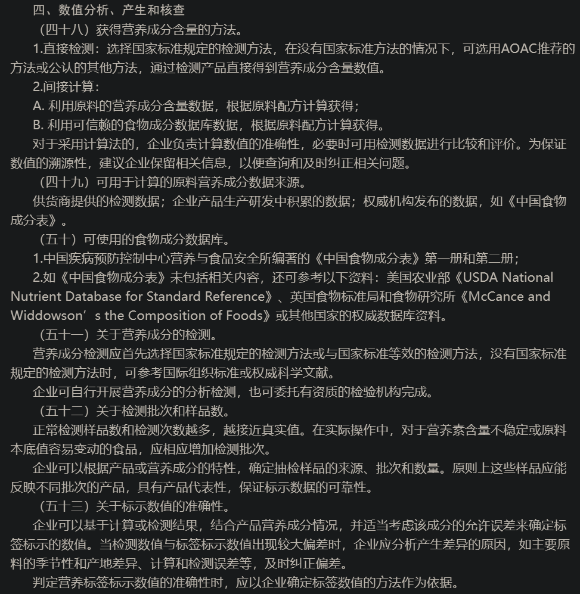

- [[食物功效]]
- [[食品添加剂]]
- [[保健食品]]
- [[营养素、膳食补充剂]]
- [[运动饮料]]
- [[电解质片]]
- [[运动营养食品]]
- 食品营养标签
	- ((659b89ca-9904-42fd-ae98-491758214d0f))
	- “没说就是零卡”与“海克斯科技”
	- 营养成分表
		- [GB 28050 — 2011 食品安全国家标准 预包装食品营养标签通则](https://www.gov.cn/gzdt/att/att/site1/20120709/001e3741a4741164d66215.pdf)
			- [《预包装食品营养标签通则》（GB 28050-2011）问答(修订版)](http://www.nhc.gov.cn/sps/s3594/201402/6f68ec6692594cf28d190cb47b770c11.shtml)
			  id:: 65facf9f-6f8c-4dfd-9426-e7abc9465e71
		- “数据怎么来的？”
			- ((65facf9f-6f8c-4dfd-9426-e7abc9465e71))
				- （下面还有）
			- [食品包装上的营养成分表是怎么测出来的？ - 知乎](https://www.zhihu.com/question/31420122)
		- [如何鉴别营养成分表真假? - 知乎](https://www.zhihu.com/question/494329125)
		- 有时是重量，有时是体积（比如食用油可能净含量标毫升，营养成分表里是“每100g”）
		  id:: 65fad3dd-6d79-49f9-b70f-d0983696f76f
- ---
- 食品形态演化
  collapsed:: true
	- 过去的食品形态分类
		- ((b3cede3e-5882-4b0e-814f-a5b0687e3345))
	- 个体
		- 扇贝、小龙虾、螺蛳、花蛤、“海瓜子”、生蚝、炸小鱼虾蟹
		- 烤红薯、烤小土豆
	- 谷粒（粥：燕麦粒酸奶；再制谷粒：炸鸡粉；肉粒：肉馅，肉馅在降低所需肉类等级带来的嚼得动口感，扩大了消费群体）
	- 叶片（谷片：大白兔奶糖的米纸、越南米纸、裹凉皮；肉片：培根、猪肉脯）
	- 肉块
		- 牛排
		- 再制肉排
			- 鞑靼肉排、汉堡肉饼
		- 牛肉干、柴鱼
		- 谷块（面疙瘩、寿司、糕点、干脆面、压缩饼干）
	- 谷粉（抗美援朝炒面）
		- 糊（咖喱饭）
		- 片（饺皮、云吞皮、春卷皮、肉燕皮）
		- 条（面条、米粉）
		- 肉粉（婴儿辅食）
	- 组合食品（谷叶肉等融合，谷片肉粒为主，辅以香料糊糊；以单个运量升序排列）
		- 汤汁逻辑（“原汤化原食”）
		- 饺（猪肉白菜水饺、意大利饺子：以肉为主，菜和汤较少，容量较小，包法较简单、汤圆；皮较包子薄、传热更快，且孔隙率较低、不易透水，所以最主要水煮充分发挥它的长处）
		- 手抓（虽然常见的是隔着塑料袋、包装纸抓；当然也有人什么都用筷子的，而对于比较厚的汉堡，用刀叉也正常）
			- 包（蒸、烤；烧卖、汤包）
				- [灵魂拷问：新疆人为什么烤着吃包子 - 知乎](https://zhuanlan.zhihu.com/p/90652939)
				  id:: 63383c97-faed-4176-a8cd-4d94b5dbc278
					- “感悟：水热气候条件对区域饮食的影响是多尺寸的“
			- 卷（“老百京鸡肉卷，地道”；谷皮肉条，多层圆柱，相比汉堡更便携、更易单手握持，但厚度一般不如汉堡，毕竟体积一定的情况下加大厚度就是缩短长度也就是高度，与其吃口感不均匀、面皮多层的矮粗卷为啥不吃堡呢？不过也适合嘴张得小的人）
			- 堡（兼顾种类和厚度）
				- [[汉堡]]
	- “细胞食品/新材料/营养液幻觉代餐”
- 食品物态变化
  collapsed:: true
	- 液体化
		- 酱油、鱼露
		- 香料糊糊
			- 黄芥末酱、沙茶酱、咖喱酱
- 生产要素
  collapsed:: true
	- 食材
		- 小麦筋度：“小麦与人类共生的自由王国”
			- [究竟是人类驯服了小麦，还是小麦驯服了人类？ - 知乎](https://www.zhihu.com/question/269631884)
				- [【量化历史研究】农业立国之争：土地肥力还是作物特性？](https://mp.weixin.qq.com/s/Zn1OctykrVewRD7GMVkeBg)（谷物按季节收获、易贮存的特点增强了其可侵占性，谷物的高可侵占性促进早期国家形成）
			- “新冠的自由王国”
			- ((63383c97-faed-4176-a8cd-4d94b5dbc278))
		- 饲料（“浓缩”）
	- 厨具
		- 水
			- ((63383c97-faed-4176-a8cd-4d94b5dbc278))
	- 餐具（“供料”）
		- ((63317666-cf48-488d-bf3e-d62a4050af6a))
	- 人体（“锅炉”；饮食基因：肠道、肠道菌群）
	- 时间
		- 饮食的节拍和乐谱
			- ((63343bcf-d5b5-4ceb-b6fb-c9830a61dabb))
			- ((63384870-eb40-4760-9a1e-9dd01af20644))
- ---
- 自家烧的水、滤的水、做的菜算食品吗？