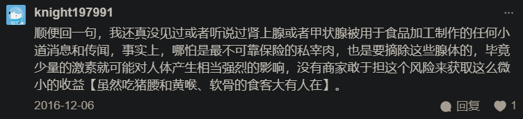
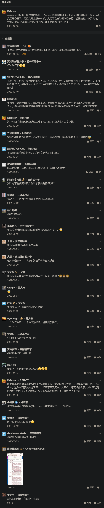
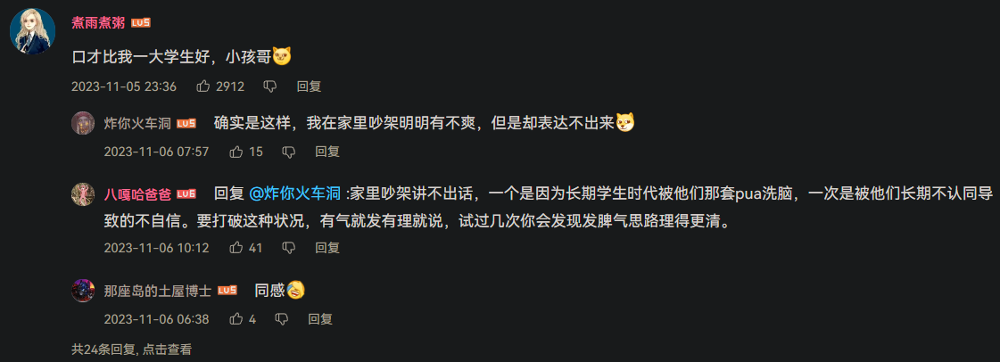

- >你要注意吃下去的是什么，因为那是作为掠食者的义务
- “我才不怕吃，一听吃我就高兴”
- # 接管厨房！
- 菜单
	- [[简单再生餐]]
	  collapsed:: true
		- [[买菜]]
		- [[食物功效]]
		- [[菜谱]]
			- [[炭烤]]
		- [[营养素、膳食补充剂]]
		- 宏量营养素比例
		  id:: 66335bd5-48a6-4a3e-849a-56ec50eec6ed
			- [【随便聊聊】我个人的减肥方法，仅供成年人参考，非医疗建议_哔哩哔哩_bilibili](https://www.bilibili.com/video/BV1rf4y1377e)
			  id:: 65bcbf46-c7b7-4416-86a2-f90bf18f5e18
		- 用餐次数和用餐时间
			- ((65bcbf46-c7b7-4416-86a2-f90bf18f5e18))
			- 一日N餐
			  id:: 65ab31a2-942b-43f9-8c29-2327ed283d47
			- 不吃早餐真的不好吗？
				- ((675cd98e-4086-49d8-955d-a7be2ec36f0e))
				- 体力劳动者
				- 脑力劳动者
			- [《JAMA·内科学》：下午3点后不吃，值得坚持！临床试验发现，每天在7-15点间进食，14周减重效果优于不限时丨临床大发现](https://mp.weixin.qq.com/s/lLUbPAO4eef6b8XYgjl8sg)
		- 饮水
		  id:: 65bef01e-499b-4679-8d0b-aae2ab3e9bca
		  collapsed:: true
			- [那些长期喝冰水的人，最后都怎么样了？|丁香医生](https://dxy.com/article/44540)
			- [热水比冰水更「解暑」？夏天最需要喝的是……|丁香医生](https://dxy.com/article/18148)
			- 人真的需要每天喝“八杯水”吗？
				- 八杯水，大啤酒杯，吨吨吨
			- 口水
				- “吞津”真的是没用的吗？
					- 八部金刚功·窃吃昆仑长生酒
					- 唾液酸？
		- 通过饮食检测生理功能
		  collapsed:: true
			- 蛋黄检测胆功能？
	- [[1050造饭工程]]
- [健康饮食](https://www.who.int/zh/news-room/fact-sheets/detail/healthy-diet)
- [粮农组织主页|联合国粮食及农业组织](https://www.fao.org/home/zh)
	- [一国一品](https://www.fao.org/one-country-one-priority-product/zh)
	  id:: 6659e8cd-8dfc-4aba-9384-3567f75f10d2
- 注意做好标记、记录，以免停服一段时间后不知道内容物是什么
- AI食物照片识别与营养分析
  id:: 66a4c2be-76bc-4358-b26a-d5fcf79dc201
	- [Nutri Vision-免费 AI 驱动的营养分析](https://www.yeschat.ai/zh-CN/gpts-2OTo9yt7wb-Nutri-Vision)
	- [胃之书 BellybookApp - AI美食记录、搜索与收藏](https://bellybook.cn/)
	- [[AI行业案例]-“菜品识别”黑科技实现精细化膳食管理](https://ai.baidu.com/customer/qianhong)
- 日常饮食发生学
  collapsed:: true
	- 需要更新的战略储备
	  collapsed:: true
		- 粮食、种子等和货架上的食品都会过期、变质，人也会死亡或改行
		- ((6645b76d-5b47-4fb0-b561-fc28ae07d915))
		- [一颗大豆如何影响经济：粮食危机与大豆战争_澎湃号·湃客_澎湃新闻-The Paper](https://www.thepaper.cn/newsDetail_forward_6961995)
		  id:: 6659e489-8372-4008-812f-325dce5150f9
		  collapsed:: true
			- >为什么中国的大豆依赖进口？
			  >大豆属于土地密集型农作物，中国人口众多且人均耕地面积少，这使得中国很难扩大大豆种植面积。而在大豆的主要出口国，美国和巴西，高度的机械化让大豆生产的成本很低。进口大豆的生产成本和价格都要远远低于国产大豆，平均每吨低1000~1500元。
			  >同时，进口的转基因大豆，出油率也更高。
			  >大豆不仅是油料、粮食作物，也是工业原料和经济作物。大豆油是数十种工业产品的重要原料，而榨油之后产生的豆粕是很多家畜和家禽饲料的主要原料。
			  >猪肉是我国居民最主要的肉食品，在肉蛋白摄取来源中占有相当大的比重——这就意味着，猪肉价格的涨跌对CPI有着非常大的影响。
			  >根据国家公布的统计数据，2月份CPI同比涨幅5.2%，猪肉价格上涨拉动了其中的3.2个百分点，占比达到62%。
			- >大豆出口对美国经济意义重大。数据显示，2017年美国大豆出口量为5313万吨，占到美国大豆总产量的44%，其中对华出口量3286万吨。大豆出口额占美国对华出口额比例为11%，占对华出口农产品金额比例为58%。
		- 大包销
			- “你要钱，就得干/生产，你干/生产，就得有人买”
			- 工会代购
			- 工作用礼品
			- 扶贫农产品
				- [脱贫地区农产品如何摆脱“政府包干依赖症”——来自农博会的一线观察-新华网](http://www.news.cn/local/2023-11/02/c_1129953740.htm)
			- ((66335c3e-f949-4841-b291-3a182cb1268c))
			- ((65e08224-aa65-41ec-baaa-133b27fef7a1))
			- 邮储银行卖比原价更贵的各种卡和礼品
	- “咽下去了、看不见的便可以不管么？”
	- ### 粮油盐菜糖肉烟酒（猪，“香肠的诞生”）
	  id:: 65c5a920-ac35-428e-b3af-f730d355d0c4
	  collapsed:: true
		- 辣醋
		- ((666554c1-4bc3-42b2-a738-0c49bee5c6b0))
		  id:: 666554f8-e5e0-40c3-8bdb-0c1db372df1d
		- 柴米油盐酱醋茶
		-
		- 盐
		- 粮
		  collapsed:: true
			- 粮食安全
				- 储存
			- 谷
				- 酒
					- 醋
				- 油
				- 酱
			- 薯
			- 豆
				- ((6659e489-8372-4008-812f-325dce5150f9))
		- 肉
			- 要快出肉有时就要上科技
			- 脂
		- 茶
		- 工业化生产（古代产量相对不高，现代是拿陈酿古代尸体换速成现代尸体）
			- “成分都算得上传统，但是以前吃不到这么多”
		- 精制谷物
			- 口腔、下颌发育
		- ((65bcbf49-8e56-4e3e-8ecf-73b99f591c2a))
		- 作为一道菜，肉类体积与蔬菜体积对应，造成整体偏大？
		- 定性与定量
		- 通过感官判断食物咸度？
		- 蔬菜多、油多、肉少所以用盐多？味精？
		- 那时还没有冰箱
		- 盐
		  id:: 66335bd5-a932-4894-9e34-449d408b231d
		  collapsed:: true
			- 风味，长保
			- 含钠调味料与（食物其余部分中可能已有的）食盐分离
				- TODO 无盐酱（青酱、红酱等）
				  id:: 65e48e90-b778-447a-9382-e4f28dba78a7
			- 代盐
			  id:: 66ff6100-8f4e-40b7-89bf-efa00bd58ff6
				- 香辛料
					- ((66ff606f-9b46-46ff-b101-4a5ca346b341))
		- 油
			- 脆（膨化食品，人喜欢脆的，但源头可能是昆虫、虾、海藻、水母等生食和烤肉皮等熟食，而不是现在刻意脱水；生食往往硬而脆，熟食往往会使食物变软烂）
		- （添加）糖
		  id:: 67402acd-fad4-4f7b-b4b6-1186fb01354e
		  collapsed:: true
			- >青稞酒酥油茶会更加香甜~~
			- [Science | 重磅发现！小时候吃的糖，也会影响终生！这个年龄前吃糖过多，更容易得糖尿病、高血压](https://mp.weixin.qq.com/s/m7eaUQBRYd35h08hLSdV_A)
			  id:: 673ace94-5f47-47af-ab90-79f444db176d
			- [这种饮料正在摧毁你的胰岛细胞！很多糖尿病都和这种饮料有关！](https://mp.weixin.qq.com/s/1PE7zMTSmQbGe0bKoCxyew)
			  id:: 67833646-0c2d-420a-b7a9-0ee5a82286dd
			- [为什么糖是战略物资？ - 知乎](https://www.zhihu.com/question/50053883)
			- ((6645aa81-76b7-4721-bb25-9873cfba5a8a))
			- ((65e400c3-d49b-4bdc-9ae5-b7a492e4c1ae))
				- 糖蜜、糖
			- ((66335c1c-4b47-4cbd-87ee-fc47c4cb3d6b))
				- 喜宴（可能有蛋糕）喜糖（添加糖爆满——社会关系/人脉需求越多，收的就越多）
				  id:: 66473f4a-6e2f-4e76-9fce-a0121099857a
			- 可乐
			  collapsed:: true
				- 戒饮料的经验
					- >从味道出发我是坚持普通可乐的，但我对咖啡因比较敏感（规律是最晚下午两点前喝），虽然短时间能比较兴奋，拉长几天看对工作效率乃至作息有不良影响，短时间兴奋也不好说（“忘了”）帮助产生了什么实际上很好的成果，加上辞职后收入不确定，以及知道替代品雪碧“不仅不是最好的墨西哥蔗糖可乐“，还多了代糖，后面就连带按重量算比较贵的以前经常一起吃的乐事薯片戒了——顶多过年喝点还不算冰的玩玩
						- >还有（至少曾经）可口可乐占水源显然算作恶，这可乐喝不得啊（
							- ((65bcbf55-d77e-443a-99cb-db4418f5b8f5))
		- “（被允诺的）节（日饮）食”（“你怎么吃得比小孩还不健康？这就叫过年？”；这是“节难”的一部分）
		  id:: 65c5a8e2-0592-4e57-861b-f56ec1981109
		  collapsed:: true
			- “有没有相对健康的节日？休假学习不过节之外的？”
			- 过年腌制肉类（主要是香肠、腊肉、咸鱼、火腿这类，主要是通常要凑几种常见畜禽的冷菜）与其他食物合并、同做，或者小份量，减少一菜一调味叠加的更高钠摄入
				- ((65c974d2-d45c-4ba6-9b45-cbd56c9c5f17))
		- [[酒]]
			- 有钱了喝自己生产的酒浇愁
	- 菜品数量、份量
		- 多就是好？
	- 饮食的快感机制
		- 试试咀嚼中断和变频
	- 尽量挑健康的吃
	- 外食
	  id:: 67402acd-921f-4d42-8181-3470bdde0249
	  collapsed:: true
		- “下馆子真好吃啊！有钱我天天下馆子，钱少些我天天大排档，没钱我在家让老婆或自己做！”
		- 菜型
			- 炒菜历史
			- 汤
				- “香”——更丰富的嗅觉刺激？
				- 多喝汤减少乃至避开了炒菜等过敏原？
				- ((668ce76a-a222-463f-b6c1-edbf0bbe7bfa))
		- 食堂
		- 餐馆
		  collapsed:: true
			- [中国疾控中心超8000道菜分析：中国餐馆菜肴过咸，这些菜品钠含量最高_澎湃号·湃客_澎湃新闻-The Paper](https://www.thepaper.cn/newsDetail_forward_18204684)
			- ((65cc3677-9630-453a-b4db-07ad47f74d91))
			- ((6646bb4e-4cdc-44da-afbe-fbac4cb88c55))
			- 前期小盅
				- 小米放后面作主食？小米份量多了浪费？
		- 饭局
			- 吃席基本都是久坐吃席，还暴食、饮酒、大量碳水（面条和水果一起上）、大量加工红肉，所以为什么要跟他们一起死？
			- 吃撑
			  id:: 66472db1-12a0-408c-8ccd-a0228ea4ff4d
				- 拉长用餐时间与并未等比例变慢的用餐速率？
	- [可惜！中餐的健康优势，正在悄悄丢失|丁香医生](https://dxy.com/article/107771)
	- 浪费
		- “真可耻！”
- 营养学介入
  collapsed:: true
	- ((66335c3c-7ef0-4a2c-ad31-10c7cb42e2e6))
	- 家里有人太会太爱做菜怎么健康饮食？
		- （？）可能只需优化家人做的菜并教会便足够
	- 从买菜到菜谱到营养，从疾病到营养
	- 从食品化学到化学
	- 消费替换
	  collapsed:: true
		- 
		- ### 代糖
		  id:: 66db8b16-aca4-4ce9-bfcf-91d27b90b577
			- [新研究发现代糖「赤藓糖醇」可能增加心脏病风险，如何解读？市面上的无糖饮料还能喝吗？ - 知乎](https://www.zhihu.com/question/586895483)
			- 三氯蔗糖
				- ((66ecca19-61a7-42e6-bf7a-90a2d6a66bc2))
			- ((64631f00-6547-4549-b039-713ca26a06ab))
			- “无糖”
				- 魔爪能量饮料上“无糖”字体比“人参”还大
		- ### 奶
			- [[酸奶]]
			- [[奶茶]]
- 食物选择
  id:: 6766006d-f160-4550-bd1e-56cf7e7ed832
  collapsed:: true
	- 食品安全
	  id:: 66335bd5-8678-43d8-b7e2-e8855d857724
	  collapsed:: true
		- [食品_百度百科](https://baike.baidu.com/item/%E9%A3%9F%E5%93%81/174284)
		  collapsed:: true
			- TODO 什么是地方特色产品、特色农产品？
			  id:: 6663fe80-87e3-4849-8486-3705d7aa51f2
				- ((6663fc6a-2185-4bf8-b221-e8cf16fa556b))
			- [如何准确区分初级农产品与食品？这个《答复》告诉你！_腾讯新闻](https://new.qq.com/rain/a/20221120A02MXQ00)
			  id:: 6663dd53-176a-42a5-8535-c383630df62d
			- [市场监管总局关于修订公布食品生产许可分类目录的公告_国务院部门文件_中国政府网](https://www.gov.cn/zhengce/zhengceku/2020-03/27/content_5496236.htm)
			- [国家市场监督管理总局令（第24号）　　食品生产许可管理办法__2020年第13号国务院公报_中国政府网](https://www.gov.cn/gongbao/content/2020/content_5509732.htm)
			- [市场监管总局关于发布《食品生产许可审查通则（2022版）》的公告](https://www.samr.gov.cn/zw/zfxxgk/fdzdgknr/spscs/art/2023/art_f3436e09d78f4919a00274c84be274d1.html)
			- ## Copilot
			  id:: 6663fa17-56ad-4e29-9362-ba96650ead04
			  collapsed:: true
			  根据您提供的链接，以下是关于如何准确区分初级农产品与食品，以及食品生产许可相关信息的总结：
				- 初级农产品与食品的区分:
					- 初级农产品是指在农业活动中获得的植物、动物、微生物及其产品，这些产品可以是直接获得的，也可以是经过基本加工但未改变其自然性状和化学性质的产品。
					- 食品则包括各种供人食用或饮用的成品和原料，以及传统上既是食品又是中药材的物品，但不包括以治疗为目的的物品。
				- 食品生产许可分类目录修订:
					- 中国市场监管总局修订了食品生产许可分类目录，以便更好地管理食品生产许可证中的“食品生产许可品种明细表”。
				- 食品生产许可管理办法:
					- 该办法规定了食品生产许可的申请、审查、发证等程序，确保食品生产活动符合法律法规要求，保障食品安全。
				- 食品生产许可审查通则（2022版）:
					- 这是一份指导文件，用于规范食品生产许可的审查工作，包括申请材料的审查和现场核查等内容，以确保食品生产许可的审查工作符合法律法规和食品安全国家标准。
					  以上信息提供了关于食品生产许可和初级农产品与食品区分的详细指导，有助于理解中国在食品安全方面的法规和标准。如果您需要更多具体信息或有其他问题，请随时告知。
		- ((665e5342-0cd2-485c-a6d9-dbff7d11b023))
		- [食物安全中心 - 主頁](https://www.cfs.gov.hk/tc_chi/index.html)
		- ((6657e134-141c-4b2c-bb71-35eb306a0412))
		- TODO 相关标准里提到的污染物
		- 安全标准不一定实际安全
		- 315
		- 短期安全
			- 节庆食品
				- 粽子、月饼、年糕等
		- 长期安全
		  collapsed:: true
			- >《最高人民法院最高人民检察院关于办理危害食品安全刑事案件适用法律若干问题的解释》（法释〔2013〕12号）第八条规定，在食品加工、销售、运输、贮存等过程中，违反食品安全标准，超限量或者超范围滥用食品添加剂，**足以造成严重食物中毒事故或者其他严重食源性疾病**的，依照刑法第一百四十三条的规定以生产、销售不符合安全标准的食品罪定罪处罚。在食用农产品种植、养殖、销售、运输、贮存等过程中，违反食品安全标准，超限量或者超范围滥用添加剂、农药、兽药等，**足以造成严重食物中毒事故或者其他严重食源性疾病**的，适用前款的规定定罪处罚。
				- ((6663dd53-176a-42a5-8535-c383630df62d))
				- “那么不足以的呢？”
		- ((66335be5-615a-4271-a1ed-4eb2086d49f2))
		- “手作”
			- 有些连“标称成分”都没有？
		- ---
		- ((66335c19-33ec-4da8-ba32-da6e43739918))
			- ((6645c052-7bce-4b03-9f0d-6354d964b588))
			- ((666634da-d988-4480-90c5-2505b1e9e003))
			- 买菜塑料袋、快餐、外卖塑料、泡沫塑料
			- ((66335c32-1621-441c-a858-39b4a9a76fb0))
		- 物理风险
		  collapsed:: true
			- ((66472db1-12a0-408c-8ccd-a0228ea4ff4d))
				- 量多也不安全，进食过程也很重要
				- 装“半碗饭”，宁可加饭，决不闷/撑饭
			- 刺伤划伤摔伤（香蕉皮等果皮）
			- 鱼刺
				- [拔鱼刺挂什么科？_哔哩哔哩_bilibili](https://www.bilibili.com/video/BV1sU421d7qY)
				  id:: 65dd32f2-a36b-4229-98bc-bee86cdf0065
			- ((65e1a013-a020-4b98-972e-a36561cf1709))
			- 窒息
				- 辣等刺激呛到窒息
				- 冰糖葫芦
		- 化学风险
			- [潜藏的毒物——环境雌激素 - 《中国大百科全书》第三版网络版](https://www.zgbk.com/ecph/words?SiteID=1&ID=488279&Type=bkdzb&SubID=743)
			  id:: 666634da-d988-4480-90c5-2505b1e9e003
		- 生物风险
			- 淋巴肉
				- >吃鸡脖吃的
				- [“淋巴肉”不可以食用吗？ - 知乎](https://www.zhihu.com/question/49545714)
					- >什么是淋巴肉？
					  拿猪来说，身体内有数百个淋巴结，很多是融在了脂肪组织没法剔除的。在正规的操作中，首先应当经过检验检疫，屠宰过程中还会有一个摘三腺的过程，把甲状腺、肾上腺，还有病变的淋巴结都要摘除掉。
					  未摘除腺体的肉，比如血脖肉和喉气管肉这些就是“淋巴肉”了。比如甲状腺里的甲状腺素对热不太敏感，食用后也会有风险。
					  一般经过检验加工的过程，正规上市的产品都是摘除过的，对于消费者来说是可以放心食用的。
						- 
							- [“淋巴肉”不可以食用吗？ - 赵钱孙李周吴郑王的回答 - 知乎](https://www.zhihu.com/question/49545714/answer/117150028)
					- 
						- “什么群英荟萃？”
		- ---
		- 流通环节
			- 原料
				- 酸菜
			- 农田
				- [农民自己吃的和卖出去的一样吗？中国农业的一家两制｜食日谈004_澎湃号·湃客_澎湃新闻-The Paper](https://www.thepaper.cn/newsDetail_forward_18135368)
					- ((66335be7-c4cf-49e2-bb54-9c3c57f684f9))
			- 工厂
				- 可能“更安全”的食品，比如绿色食品、有机食品
			- 盒饭
			- 外卖
			- 食堂
				- 鼠头
				- [男孩喊话学校饭菜问题，被做思想教育，媒体：教育应该让孩子勇敢表达_腾讯新闻](https://new.qq.com/rain/a/20240613A060C900)
				  id:: 666adfa1-d63e-4cfd-807c-f7633b5cd350
					- [男孩喊话学校饭菜问题被做思想教育？学校回应来了→-重庆日报](https://cqrb.cn/shishi/2024-06-13/1950952_pc.html)
					- [我一定要曝光学校！_哔哩哔哩_bilibili](https://www.bilibili.com/video/BV1Au4y1a7Na)
						- 
						  id:: 666adfa1-e507-4461-9f3c-7942ba388c3d
					- [我与学校食堂的事已成为历史了，没有继续的必要_哔哩哔哩_bilibili](https://www.bilibili.com/video/BV15J4m1K7w9)
					- [学新闻学的_哔哩哔哩_bilibili](https://www.bilibili.com/video/BV1My411z7Ah)
					  id:: 666cce4d-5172-49d4-a155-32be76f3a814
			- 流动摊贩
				- 腹泻
			- 餐馆
				- 用餐环境、上菜、换盘（“我的天，吃这么多干吗？日餐法餐啊？那没事了——坐那么久也不好”）服务，地租
				- 一次性餐具、消毒柜里的、清洗包装后的重复使用餐具是否干净，要不要开水烫，开水烫有没有用一次性餐具是否干净
			- 商店
		- ---
		- 搞定采购等人员
		- 家委会
			- 检查
			- 承包食堂
		- 自带食物
		- 点评（“架在火上烤！”）
		- 放弃外卖，监管食堂和餐馆，学会用拼多多
		- ---
		- 针对食品安全展开 可以有一下几种类型
		- 食品安全基本知识：介绍食品安全的定义、食品质量的基本要求以及食品污染的类型（生物性污染、化学性污染、物理性污染等）。
		- 食品安全常识：讲解如何购买和检查食品，包括注意食品包装的生产厂家、生产日期、保质期、原料和营养成分标明等。
		- 预防食源性疾病和食物中毒：介绍常见的食源性疾病和食物中毒问题，以及如何预防这些问题。
		- 食品添加剂和特殊用途食品：解读食品添加剂的使用标准和婴幼儿配方食品及辅助食品的相关知识。
		- 食品安全与卫生常识：结合实际生活中的例子，讲解食品供给安全和食用安全的重要性
		- 《食品安全宣传教育工作纲要》（2011—2015）确定每年6月第三周为食品安全宣传周，在全国范围内集中开展形式多样、内容丰富、声势浩大的食品安全主题宣传活动。
	- [[食物功效]]
	  collapsed:: true
	- 以前的归因猜想
	  collapsed:: true
		- 奶油等含蛋白乳制品与关节弹响僵硬/易受伤、所需睡眠时间延长、脱发等的关系？
		- 吃椰青肉发热？
		- 稍硬的椰青肉影响消化胀气？
		- 咖啡因-提升甲状腺激素水平-高代谢、外向性？
		- 肝吃多了睡不着？
	- ---
	- 挑食
	  collapsed:: true
		- 从全谷物到精制谷物
		  id:: 65cd87d1-20e2-420e-a0e7-d377fc250c15
			- “精面粮票多的人高级，精面更高级”
			- ((65cd87a8-27b7-4806-97de-f04d68b0c200))
		- 过度加工
			- 中年人看短视频喝老年人不好消化才喝的粥，营养（包括gi）损失过多
				- 其中不同食材熟的时间不一样
				- 代替粥：高压锅豆子
		- 儿童爱吃比较咸的肉类？
	- 放屁别吃
	- 饮食看大便
- 化学元素与食物
  id:: 67713e8c-9f1b-4786-8e97-fac8ce317bf5
	- 铝
	  collapsed:: true
		- [食品里有明矾，能吃吗？| 果壳 科技有意思](https://www.guokr.com/article/207370)（海蜇）
		- ((65bdbc1e-7a90-4a6c-9a5b-650cf3a8de82))
	- 铅
	  collapsed:: true
		- [罗马帝国铅污染降低了整个欧洲智商；一天中喝咖啡的最佳时间 | 科技周览](https://mp.weixin.qq.com/s/Rupk2fyQ67mRRozFhezVFA)
		  id:: 67830960-3837-4e83-a04b-bd547d17283b
		- [松花蛋中的铅哪里来的？ - 知乎](https://www.zhihu.com/question/281021215)
- 食品礼品
  collapsed:: true
	- 长保与送礼、健康（“最好的请过来，但是并非最好”）
		- ((67402ab3-d34d-4337-b761-68d9412e4179))
- 避免饮食过量
  id:: 6646bb87-e154-4d33-b0cb-b5fa5cd1843d
  collapsed:: true
	- ((6646b6b0-e48b-4dd2-9358-11eb9088a976))
	- 少食多餐也是避免一次性吃太多的一种手段，如果能够控制住，三餐乃至两餐都是可以的
	- ((666663b8-551b-4eae-83c3-207896c0de89))
	- 专心吃
		- ((66fa2c64-1328-4098-a927-80b973f14ce8))
- 饥饿
  collapsed:: true
	- ((40a0572d-7313-4618-82b7-20b67441b37c))
	- ((6646bb87-e154-4d33-b0cb-b5fa5cd1843d))
	- ((6652fead-7786-40d3-81d1-de494ef00f61))
	- ((666663b8-551b-4eae-83c3-207896c0de89))
	- [为什么有些人总是饿得快、吃了还想吃？_澎湃号·湃客_澎湃新闻-The Paper](https://www.thepaper.cn/newsDetail_forward_12279518)
	- 饱食感、饱腹感
		- [你的饱食感怎么调控？李永国博士等发现调控摄食的新通路，揭示褐色脂肪组织产热的新生理功能- X-MOL资讯](https://www.x-mol.com/news/15163)
- 进食时间窗口/间歇性禁食（断食）/轻断食
  id:: 6652fead-7786-40d3-81d1-de494ef00f61
	- [Cell | 吓死宝宝了！西湖大学张兵团队发现长期轻断食会减少发量](https://mp.weixin.qq.com/s/fA4rG2upVC5GpfN_gKs4SA)
	  id:: 675cd98e-4086-49d8-955d-a7be2ec36f0e
		- [十分“秃”然！“16＋8”轻断食翻车了？Cell：中国学者发现，长期间歇性禁食抑制毛囊再生，发质发量均下降！](https://mp.weixin.qq.com/s/6lmCULv-TvohehaXZWiDVQ)
	- [16:8轻断食，提高心脏病风险91%？真相在这里，一定要看完](http://www.chinalowcarb.com/fasting-and-cvd/)
	- [贾玲都在坚持的「16+8 饮食法」，手把手教会你|丁香医生](https://dxy.com/article/190389)
	- [充分回答有关间歇性断食的问题 - Ask The Scientists](https://askthescientists.com/zh-hans/intermittent-fasting/)
	- [“过5不食”添新用！Nature子刊：不仅能减肥，还能降血糖、减少皮下脂肪、具有抗衰作用](https://mp.weixin.qq.com/s/Jst8LDjNagxoU6Y5uS0FeA)
	  id:: 67846d79-1b3d-48f2-83e5-96d57d7b7a33
	- 干断食
		- [为什么要干断食？有什么风险？](http://www.chinalowcarb.com/dry-fasting/)
	- 长期禁食
	  id:: 666adfa1-5e9c-4c82-8a05-fefa693793dd
		- [Angus Barbieri's fast - Wikipedia](https://en.wikipedia.org/wiki/Angus_Barbieri's_fast)
			- >虽然这么长的带点现代吃喝的禁食是个例（而且不确定他相对短寿是否与这次禁食有显著关系），但也可以从中一瞥人类的潜力
- 手抓
  collapsed:: true
	- ((664bef52-9567-4f12-a2ed-584af3d39760))
- 吃完饭做什么
  id:: 675bbd02-d143-488b-b535-db2618db34e1
  collapsed:: true
	- 洗碗优于看视频优于思考写作
- ---
- “古法膳食”
  id:: 675a6d2b-d83a-4d99-91c6-890d636c38f0
  collapsed:: true
	- 加（“真正的”）故事，部分融合[[简单再生餐]]
	- 《黄帝内经》
	- ((666663b8-551b-4eae-83c3-207896c0de89))
	- ((67402ab7-01f8-4e07-9291-b9354fa73323))
	- 乾隆
		- [吃肉·喝奶·饮茶：乾隆帝的长寿秘诀！_膳食](https://www.sohu.com/a/247966626_528605)
- 饮食的性别
  collapsed:: true
	- 都可以吃，但效果不一样的
		- >男人的加油站，女人的美容院
		- >他好，我也好
	- >女同志要多吃藕，男同志要多吃韭菜——我爸
	- 桃胶
	- 应该是有一些食物对不同性别的（排除“安慰剂效应”等后的）效果是不一样的
- ((675d34b5-b00b-4a32-9c44-09dac68dd9fe))
- [[保健食品]]
  collapsed:: true
	- 不要让家里人乱买
- （过度）加工食品
  collapsed:: true
	- [健康饮食：加工食品的诞生、流行以及争议 - BBC 英伦网](https://www.bbc.com/ukchina/simp/vert-fut-57638392)
	- 麦片
		- ((66fc9790-8b1a-495d-9da9-5ce413a7e238))
		- ((66db8aaf-6746-4dd2-b613-caa3051c160e))
	- （相对）固定的套餐
		-
- 公认比较有害但合法的食品（或“产品”）、药品
  id:: 6657e134-141c-4b2c-bb71-35eb306a0412
  collapsed:: true
	- 槟榔
	  id:: 6657e149-bd97-4d01-ae8f-56f1a6efcd97
		- [对十三届全国人大三次会议第1427号建议的答复 - 中华人民共和国国家卫生健康委员会](http://www.nhc.gov.cn/wjw/jiany/202102/eb9520baf2e843f2966d451611fc7383.shtml)（“比马局长说得明白些，或许表达上也就因此落了下乘”）
		- [湖南：争取通过地方立法确定槟榔为“地方特色产品”](https://www.guancha.cn/politics/2021_08_30_604988.shtml)
		  id:: 6663fc6a-2185-4bf8-b221-e8cf16fa556b
		- [槟榔陷入尴尬身份：不再是食品，列入地方特色产品惹争议_中国网](http://food.china.com.cn/2021-09/01/content_77726999.htm)
		- [中国槟榔简史：从贡品到7亿人消费 百亿产业走到十字路口_腾讯新闻](https://new.qq.com/rain/a/20211102A049AQ00)
		- [槟榔遭遇史上最严“禁售令”，致命的“恶魔果实”背后暗藏千亿产业_澎湃号·湃客_澎湃新闻-The Paper](https://www.thepaper.cn/newsDetail_forward_20000064)
		- [槟榔口香糖游走法律边缘：无法完全去除槟榔碱，热卖或涉违法_中国网](http://food.china.com.cn/2022-10/13/content_78463427.htm)
		- [总局回复：不得以食品名义展示、经营槟榔制品_腾讯新闻](https://new.qq.com/rain/a/20221221A04TZ000)
		- [【补档】电棍传世经典带货和成天下_英雄联盟](https://www.bilibili.com/video/BV1eG4y1V7gR)
			- [【电棍】回应卖槟榔，他们没槟榔活不下去，不能夺人所爱，我心里肯定过意的去啊！_英雄联盟](https://www.bilibili.com/video/BV12K421Y7hu)
			  id:: 6657e30c-2e39-46f9-a4ea-32f2a8707e16
		- ((66335c21-080d-4e87-9979-601bf715a547))
		- [《超人强我要嚼槟榔》_哔哩哔哩_bilibili](https://www.bilibili.com/video/BV1DN411e7hM)
	- 烟草
	  id:: 670d40f6-a0d8-46a7-9c2f-be321e668fb9
		- [“一包香烟半包税，全国烟民养军队”是真的吗？ - 知乎](https://zhuanlan.zhihu.com/p/440320238)
		  id:: 6704f5fb-4c24-4be4-8561-4d723e1189ad
		- [近10年国防军费与烟草税利对比，中国烟草连续10年超万亿_烟草消费_烟草在线—吸烟有害健康！](https://www.tobaccochina.com/html/news/ycxf/675484.shtml)
		- TODO 烟头盒
		  id:: 67651042-c7bb-4278-8eb8-8368f2db99a3
	- ((66db8ac2-dabf-47dd-9c1f-ca1141d6e33e))
- 生酮饮食
  collapsed:: true
	- [生酮饮食影响运动表现与疲劳恢复的研究进展](http://zgsydw.cnjournals.com/sydwybjyx/article/abstract/2023110011?st=article_issue)
	- [Impact Of Ketogenic Diet On Athletes: Current Insights - PMC](https://www.ncbi.nlm.nih.gov/pmc/articles/PMC6863116/)
- ---
- “最好吃的一集”（降序）
	- {{embed ((675c25a5-f0e3-46b8-8071-3307118d15cd))}}
	- ---
	- {{embed ((67402acc-1ecb-4bfa-bb29-24914f5eb71d))}}
	- ---
	- 烤箱烤烟薯25
	- 烤箱烤贝贝南瓜